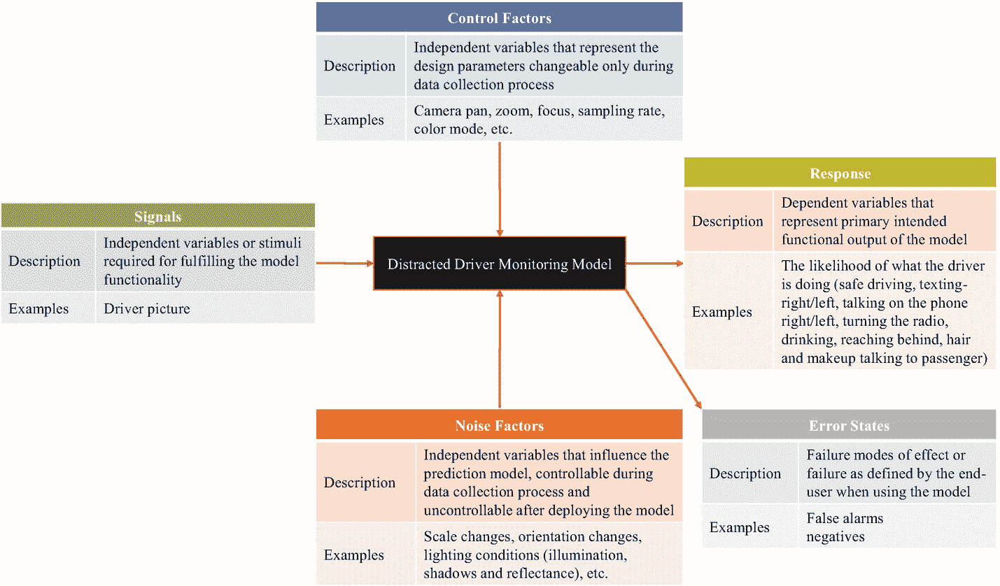
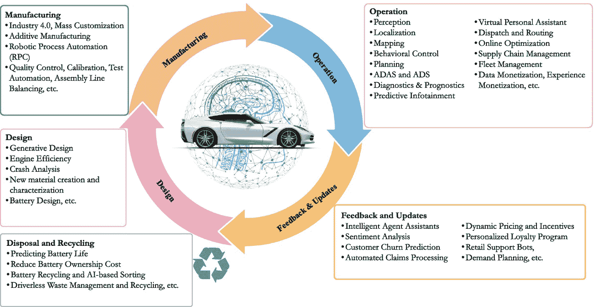
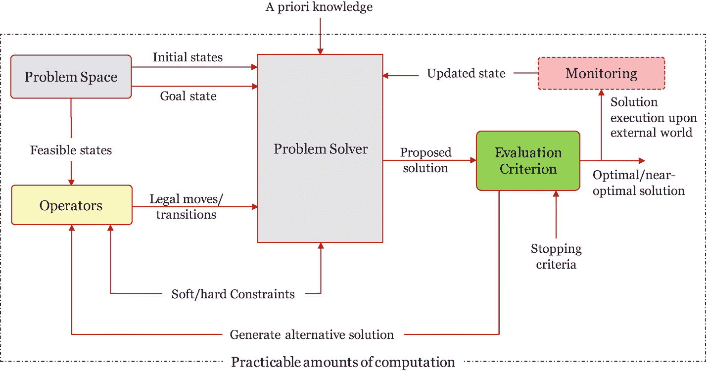

# 噪声因素可以包括但不限于尺度变化、方向变化、光照条件（照明、阴影和反射率）等。`Response` 指模型的主要预期功能输出。在此示例中，输出是对驾驶员当前行为（安全驾驶、发短信——右手、打电话——右手、发短信——左手、打电话——左手、操作收音机、喝水、向后伸手、整理头发和妆容，或与乘客交谈）可能性的判断。最后，错误状态表示终端用户在使用预测模型时定义的故障模式或故障影响。具体而言，错误状态可能是误报或漏报。应考虑到对抗性用例。这些用例由于与目标用例的相似性，容易欺骗算法。在上文图 3-9 所示的示例中，假设我们有两个控制因素（相机变焦和采样率），每个因素有三个水平，以及三个噪声因素（尺度变化、方向变化和光照条件），每个因素有六个水平。基于部分因子设计的数据收集实验次数可使用以下公式计算：`L_R^(k-p)`，其中 *L* 是水平数，*k* 是待研究因素的数量，*p* 表示实验设计的分段值（*p* = 0 表示全因子设计，*p* = 1 表示半因子设计，*p* = 2 表示四分之一因子设计），*R* 是分辨率（分辨率 I 表示因素之间无交互或仅有单向交互，分辨率 II 表示双向交互，分辨率 III 表示单向和双向交互混杂，分辨率 V 表示单向与四向交互或双向与三向交互混淆）。在我们的示例中，假设采用全因子设计和分辨率 I，所有控制因素和噪声因素的实验次数将为 `3² × 6³ = 1,944` 次运行。假设每次实验耗时 10 分钟，那么数据收集的总时长为 324 小时，按每天 8 小时计算则为 40.5 天。领域专家应能判断每个因素的重要性以及需纳入实际考虑的水平，因为受时间和资源限制，收集完全全面的数据集（全因子数据集）通常不可能。使用包含关键因素及常见水平的部分因子数据集，可以构建具有可接受的迁移性和泛化能力的高效模型。

图 3-9

基于视觉特征的分心驾驶监测模型

## 3.6.3 人工智能赋能智能出行

人工智能是一项基础性技术，也是我们当前所见的诸多现有和新兴出行系统及服务背后的驱动力。根据 Wards Intelligence 在 2018 年进行的《汽车行业人工智能》调查，40.6% 的受访者认为高级驾驶辅助系统（ADAS）将是首个应用人工智能的车载系统，32.5% 认为是信息娱乐/语音识别系统，17.6% 认为是诊断系统，9.2% 认为是车联网（V2I）/车辆间通信（V2V）。

**重要提示**

麦肯锡未来出行中心对出行和人工智能领域的 474 家公司进行的调查显示，其中 38.2% 的公司专注于将人工智能用于自动驾驶，19.4% 用于改善车内体验，16% 用于制造和供应链管理，9.3% 用于车队管理，8.9% 用于质量保证，5% 用于交通/基础设施检查，3.2% 用于预测性维护（Cornet 等，2017）。

人工智能贯穿出行平台从设计、制造、运营、反馈与更新直至处置与回收的整个生命周期，如图 3-10 所示。

人工智能和机器学习在智能出行中的潜在应用包括但不限于以下方面：

图 3-10

人工智能在车辆中的应用示例

* 打造渐进式、颠覆性或变革性的创新功能、服务或新商业模式，以提升客户体验、赢得竞争优势，和/或服务于低端市场或未被满足的消费者群体。

* 自动收集相关数据并生成多种洞察，以得出更广泛的结论并做出更优决策。

* 识别出行公司已拥有但未被利用、处于闲置状态的数据（暗数据）。

* 开发不同层级的态势感知能力，以便在特定时空范围内感知环境要素、理解其含义并预测其近期状态。示例包括：车辆诊断与预测；弱势道路使用者（VRU）的检测、定位与意图识别；用户行为识别（身体行为、视觉行为或生理行为）；用户行为学习与建模（年龄识别、性别识别、偏好识别等）；以及预测性信息娱乐。

* 在不断变化的环境中实现高级驾驶辅助系统（ADAS）和自动驾驶任务（感知、规划、控制、学习与自适应）。

* 支持数字化转型（例如生成式设计、测试自动化、空中下载技术（OTA）、机器人流程自动化（RPA）、智能代理助手、出行平台数字孪生、调度与路线优化、车队管理、数字化市场推广工具（GTM）等）。

此外，人工智能搜索算法和现代元启发式优化技术能够处理复杂、结构不良的人员出行问题、物流问题和基础设施优化问题。以下小节将描述这些结构不良的问题，并阐释人工智能算法解决这些问题的潜力。

## 3.6.4 人工智能解决智能出行中的结构不良问题

现实世界的问题可大致分为结构良好问题（WSP）和结构不良问题（ISP）。图 3-11 展示了结构良好问题的主要组成部分。

Herbert Simon 在 Simon（1973）中描述了结构良好问题的六个主要特征如下：

1.  存在明确的准则来检验任何提出的解决方案，并且存在一个可机械化应用该准则的过程。

图 3-11

结构良好问题（WSP）

2.  至少存在一个问题空间，在该空间中，问题的初始状态、目标状态以及在尝试求解过程中可能达到或考虑的所有其他状态都能被表示出来。

3.  可达的状态变化（合法移动）可以在问题空间中表示为从给定状态到从该状态直接可达的状态的转换。但值得考虑的移动，无论合法与否，也可以被表示——即从一个值得考虑的状态到另一个状态的转换。

4.  问题解决者能够获得的关于该问题的任何知识，都可以在一个或多个问题空间中表示出来。

5.  如果实际问题涉及对外部世界采取行动，那么状态变化的定义以及应用任何操作符对状态产生的影响，必须在一个或多个问题空间中准确反映支配外部世界的规律（自然规律）。

6.  所有这些条件都必须在强意义上成立，即所假设的基本过程仅需要实际可行的计算量，并且所假设的信息能有效提供给这些过程——即仅需通过实际可行量的搜索即可获取这些信息。

