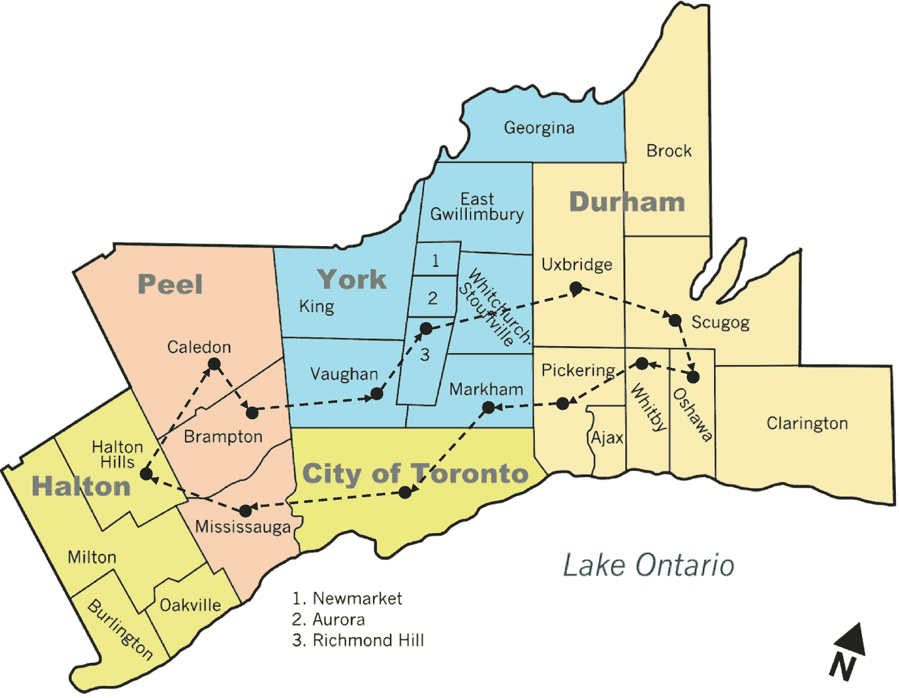
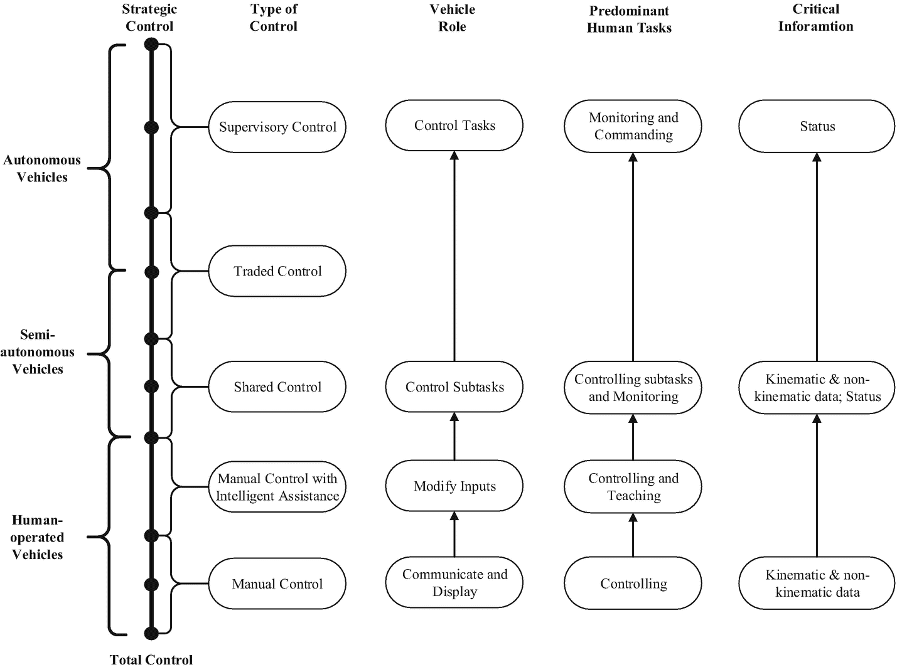
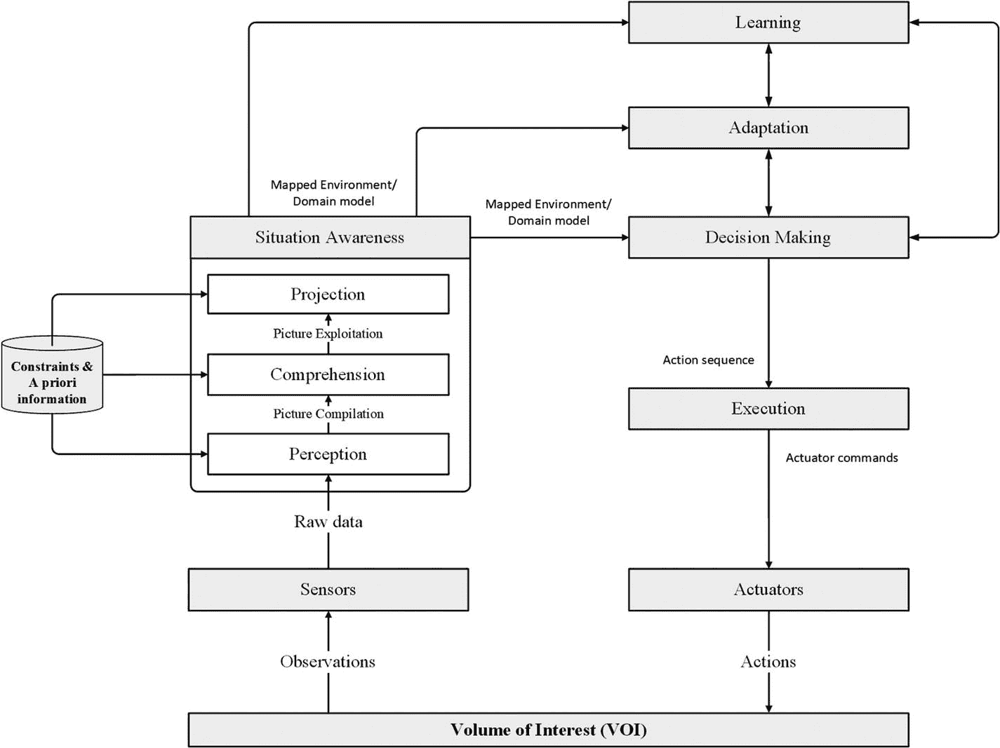
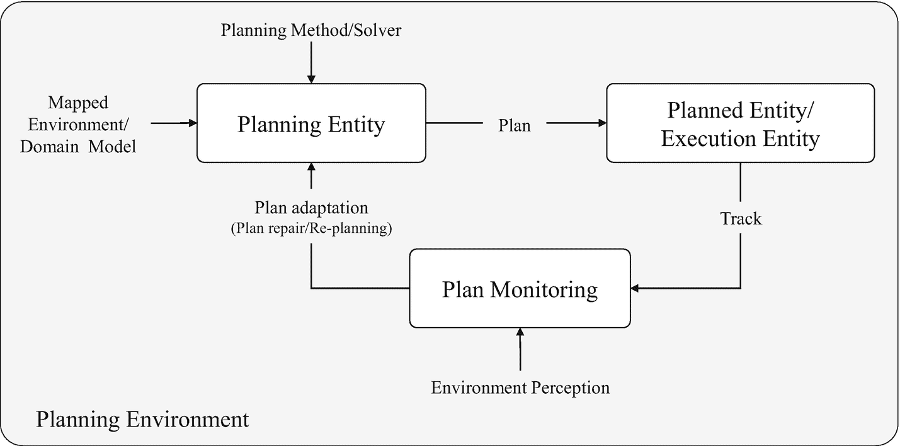
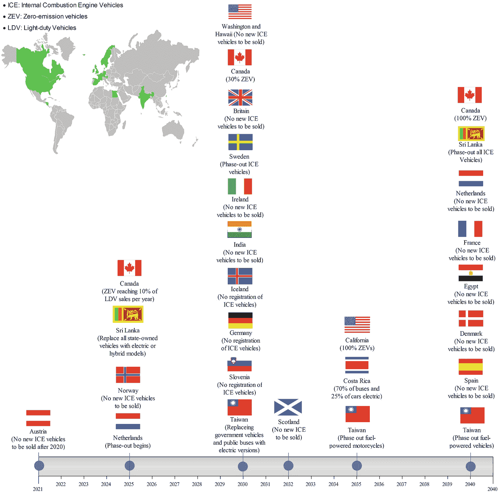

# 排版后的内容

不良结构问题是复杂的离散/连续问题，没有算法解决方案或通用问题求解器，其特征可能包括缺乏数学模型、数据不完美、目标不明确、问题视角不同、解决方案相互冲突、随机行动或情境敏感性等一个或多个特征。这些特征可能导致在定义问题空间、生成合法操作/转换或替代解决方案、评估所提出的解决方案、定义停止条件以及更新状态机制时出现约束和困难。

以数据不完美为例，车辆环境中可使用多种数据源来提供有关驾驶环境的信息，包括驾驶员状态、车辆状态和周围环境。这些数据源可能包括各种物理传感器、人类生成的信息以及从互联网检索的数据。物理传感器包括但不限于测距传感器、摄像头、车速传感器、胎压监测传感器等。来自这些传感器的数据曾被称为“硬数据”，本质上具有定量性。人类可作为软传感器，提供关于其状态/偏好、车辆以及天气/道路状况的动态观测信息。这种信息被称为“软数据”。软数据的另一个来源是互联网上的开源信息，可以检索和挖掘这些信息，例如提供更多关于交通状况的观测数据。下一代高级驾驶辅助系统将依赖于整合和融合来自上述来源的多模态数据。由于软数据具有定性性质、主观性和固有的不完整性，处理软数据比处理硬数据更具挑战性。硬数据和软数据都可能存在不同的不完美方面。这种数据不完美可能导致对驾驶员/车辆/环境状态的错误信念。这些错误信念进而可能导致错误的决策和行动。

数据不完美可分为不确定性、不精确性和粒度性。当数据所陈述内容的关联置信度或信心程度小于 1 时，数据就是不确定的。不精确数据指的是多个对象而非单个对象。不精确性有多种形式，如模糊性、歧义性和无知/不完整性。数据粒度是数据不完美的另一个方面，指的是区分由数据描述的对象的能力，这取决于所提供的属性集。

例如，不确定性可能由环境、传感器、车辆、模型或计算等多种因素引起。物理世界本质上是不可预测的。虽然在结构化的环境（如装配线）中不确定性程度很小，但高速公路和城市峡谷等环境是动态的，且多数时候不可预测。传感器也是存在误差的不完美设备。它们能感知到的内容本身就存在局限性。局限性来自两个主要因素：传感器的量程和分辨率，这两者都受物理定律制约（Fox et al., 2005）。例如，摄像头无法穿透其他车辆或墙壁等障碍物，即使在感知范围内，摄像头图像的空间分辨率也有限。传感器易受噪声影响，噪声会以不可预测的方式干扰传感器测量，从而限制了可从传感器测量中提取的信息（Choi and Lee, 2007）。这种噪声会导致随机/非确定性误差，与系统/确定性误差不同，其特点是传感器输出缺乏可重复性。此外，观测的不确定性可能源于其他因素，如虚假测量、数据源的不可靠性和欺骗性、多目标和杂波观测的存在、快速机动目标的规避行动以及未知的相关性（Mahler, 2007）。车辆中的某些执行器可能不准确，并且由于控制噪声和磨损等因素，在某种程度上不可预测。模型是真实世界的抽象。因此，它们只能部分地模拟车辆及其环境的底层物理过程（Fox et al., 2005）。此外，为了保证实时响应，有时会采用近似模型。

一些诸如聚类和旅行商问题（TSP）之类的问题在原则上可能是结构良好的，但由于实时求解这些问题所需的计算量不切实际，它们在实践中是结构不良的。在 TSP 中，给定`n`个城市，一个旅行商必须访问这`n`个城市并返回家中，形成一个环路（往返行程）。他希望能以最高效的方式（最快的方式、最便宜的方式、最短的距离或其他标准）旅行。TSP 中的搜索空间非常大，例如，如果旅行商要访问大多伦多地区（GTA）的 14 个主要城市，如图 3-12 所示。

对于非对称 TSP，存在`13! = 6,227,020,800`条可能的路径。在非对称 TSP 中，路径可能并非双向都存在，或者距离可能不同，从而形成一个有向图。交通碰撞、单行道以及出发和到达费用不同的城市的机票价格，都是这种对称性可能被打破的例子。这是一个 NP 难问题。TSP 被用作研究通用方法的平台，这些方法可应用于广泛的离散优化问题。这些问题包括但不限于：安排校车路线以接送学区内的儿童、为特定机队分配飞机航线、将农业设备从一个地点运输到另一个地点以进行土壤测试、调度有线电视公司的上门维修服务、为行动不便者送餐、调度仓库中的堆垛起重机、规划包裹收寄的卡车路线，以及其他一系列问题。

图 3-12  
大多伦多地区（GTA）的旅行商问题（TSP）

在智能出行的背景下，智能系统问题（ISPs）可分为人员出行问题、物流问题和基础设施问题。人员出行问题的例子包括：

*   **多标准最优路径规划**：改进现有的路径规划算法，除了最短时间外，还需考虑不同的标准，例如左转次数、交叉路口数量、避开危险区域、道路容量、收费等。

*   **带容量约束的车辆路径问题**：服务提供商需要使用一个公共仓库的同质车辆车队来服务一组客户。每个客户对货物有一定需求，货物最初位于仓库。任务是设计起始和结束于仓库的车辆路线，以满足所有客户的需求。

*   **公交调度问题**：调度的目标是获得一个公交装载方案，使得路线数量最小化、所有公交车的总行驶距离保持最小、没有公交车超载，并且遍历任何路线所需的时间不超过最大允许时间策略。

*   **紧急派遣与路径规划**：用于地面/空中救护车、消防车、警车或搜救车辆等第一响应应急车辆。

*   **点对点（P2P）车辆共享服务、需求响应式交通（DRT）、拨号乘车或辅助公交、微交通、拼车服务、网约车或叫车服务、或合乘/拼车服务**：旨在最大化正常时段和高峰时段的车辆占用率或预期利润。在非高峰时段，司机愿意接载距离较远的乘客。如果非常繁忙，司机不太可能接受接驾时间较长的行程，因为他们认为如果多等几分钟，就会接到距离更近的请求。这些信息可用于为拼车应用生成合理的优化方案。

*   **疫情时期的按需响应式交通**：支持必要工作者和普通公众（尤其是老年人）前往药房和杂货店的必要出行，同时考虑商店的营业时间、容量和在线配送选项。

*   **健身规划器**：为跑步者和骑行者创建一个健身助手，可无缝自动完成规划健身活动所涉及的多个任务。该规划器评估运动员当前的体能水平和个人训练目标，以制定健身计划。该规划器还会生成并推荐既受欢迎又根据用户目标、水平和计划时间定制的地理路线，从而减少规划阶段面临的挑战。建议的健身计划会根据每位用户在实现健身目标过程中的进展而持续调整，从而保持运动员受到挑战和激励。

*   **行程规划**：规划一天的行程可能是旅行中最具挑战性和最耗时的任务。通过游览最好的景点来最大化用户的时间总是理想的；然而，从大量高评分的地点中进行选择，显著增加了决策过程的难度。这个问题可以通过开发一个旅行规划器来解决，该规划器能最小化总通勤时间，最大化解决方案中所包含景点的平均评分，最大化在每个景点停留的时间，并有效减少游客游览一个城市时的空闲时间。

*   **共享或私有自动驾驶汽车（AV）或零乘员车辆（ZOV）的运动规划**：该问题涉及到如何在一系列障碍物中，为车辆找到一条从起始位置到给定目标位置的无碰撞路径。路径规划可以看作是一个优化问题，旨在满足若干约束条件的同时，改善某些系统目标。系统目标可以是行驶距离、行驶时间和消耗的能量。然而，行驶时间是最常见的目标。

*   **空驶问题**：为第一/最后一英里运输公司最小化空驶（最小化无乘客行驶里程）。

*   其他问题包括但不限于：最优 MaaS 套餐捆绑、多模式无缝行程规划、电动出行中的生态路径规划、微出行第一/最后一英里路径规划以及通信中继。

物流问题可能包括以下内容：

*   **最后一英里配送调度与重新调度**：为送货自行车、半自主和全自主最后一英里送货卡车、自动驾驶送货机器人、送货无人机、e-Palette、邮政投递、无人驾驶送货以及私有自动驾驶汽车找到最优的调度方案，以最大化客户满意度并最小化配送成本，同时考虑车辆容量、配送服务类型（几日送达、次日送达或加收附加费的当日送达）、配送时间、投递地点等因素。

#### 多准则最优路径规划
传统的导航应用（如 Google/Apple 地图或 Waze）引发了许多问题，因为它们没有考虑多个准则以及重要的硬约束和软约束，无法在车辆载货运输（`liveheading`）和空驶运输（`deadheading`）期间实现最优的配送车辆路径规划。`deadheading`（或空驶里程）表示配送车辆在未装载任何货物时行驶的空闲距离。`liveheading`表示配送车辆在装载货物时行驶的距离。配送车辆路径规划可以通过考虑多个准则和约束来进行优化。使用此优化引擎对`liveheading`和`deadheading`问题进行优化的目标函数示例包括：燃油消耗、行驶时间、行驶距离、路径上的交通信号灯数量、左转次数、交叉口数量、环岛数量以及路径上的公交车站数量。硬约束的示例包括：在客户给定的时间窗口内送达，以及不超过配送车辆的容量。软约束可以包括：避免经过主干道、避免在上下学时间经过学校区域、避免经过高海拔街道以节省燃油、避免在桥梁开启时间经过桥梁、避免经过危险区域、避免经过铁路道口等。
多个相互冲突的目标可以通过基于偏好的多目标优化过程、理想多目标优化过程或帕累托优化方法来处理。在前一种方法中，首先应用对偶原理将所有相互冲突的目标转化为最大化或最小化问题，然后通过使用相对偏好向量或加权方案将这些多个目标转化为单一或总体目标，从而对多个目标进行标量化。然而，找到这个偏好向量具有高度主观性且并不直接。后一种方法依赖于找到多个折衷的最优解，并使用更高级的信息从中选择一个。这个过程将备选方案的数量减少到一个最优的非支配解集，称为帕累托前沿，可用于在多目标空间中制定战略决策。

##### 其他问题
其他问题包括动态订单编排、仓库中的自动驾驶车辆（`SDV`）协调、卡车编队、集群以及配送车队管理。

#### 基础设施问题示例

##### 交通传感器的优化布置
精确连续地收集交通数据，使道路运营者能够以最低成本实时监控和管理交通流量。这些信息也有助于城市规划者进行智能交通规划，以实现更可持续和高效的城市出行。交通监控系统包含大量的传感器，这些传感器提供关于道路占用率/车头时距/车间间隙/拥堵程度、车辆计数与分类、弱势道路使用者（`VRU`，如行人和骑行者）计数等方面的宝贵信息。这些传感器包括但不限于：感应线圈检测器、摄像头、雷达、蓝牙（`BLE`）和 WiFi 检测器等。传感器的布置对交通监控系统的性能有着巨大的影响。传感器布置问题可视为一个组合优化问题，涉及将一组具有不同视野的*N*个传感器放置在*M*个感兴趣区域中。

##### 其他问题
其他问题包括：城市自行车站点的优化布置；公交车站的优化布置；步行路线和自行车道的优化布置（以促进积极的、软性的和包容性的出行）；按需出行系统中堆叠点与货架/取货与落客点的优化分配；微出行站点的优化布置；电动汽车充电站的优化布置；智能停车（车位分配、动态定价、导航）；动态拥堵收费与道路定价；交通流量优化；自动驾驶车辆（`AV`）协调与自组织；交通走廊和城市街道的规划/重新规划（以适应共享交通中更多的行人、骑行者、摩托车手，并减少汽车数量）；用于电动汽车充电的无人机最优部署；以及空中出租车起降点的优化分配。

#### AI 搜索算法与现代元启发式优化技术
AI 搜索算法与现代元启发式优化技术能够高效地探索搜索空间，从而在合理时间内为这些复杂问题找到（近）最优解。将元启发式算法应用于解决智慧出行系统中的不良结构问题有多重好处。首先，元启发式算法能够以合理的计算成本找到高质量的（即近最优的）解，并常被视为全局优化器。其次，元启发式方法通常对问题规模、问题实例和随机变量具有鲁棒性。最后，与纯随机搜索相比，元启发式算法的随机性并非盲目使用，而是以一种智能的、有偏的形式使用。我展示了如何利用 AI 和元启发式算法解决这些问题，这些内容出自我在多伦多大学开发并教授的课程《智慧出行的仿生算法》。本课程全面介绍了 AI 搜索算法，并强调了它们在解决智慧出行背景下复杂的离散和连续问题中的强大能力。该课程的开源 GitHub 组织可在此处获取：[`https://github.com/SmartMobilityAlgorithms`](https://github.com/SmartMobilityAlgorithms)。该组织包含多个关于确定性和随机性仿生搜索算法的 Python 代码库，以及智慧出行系统与服务中潜在用例的示例。

### 3.6.5 AI/ML 成功采用的关键因素

成功采用 AI/ML 技术应考虑以下五个先决条件或关键要素：

*   **统一战略：** 公司需要制定清晰统一的战略，以充分利用快速演变但充满挑战的 AI 和 ML 技术的全部潜力，并协调跨职能创新的高级研发工作。
*   **AI 治理框架：** 用于解决负责任 AI 的重要方面，例如性能指标、网络安全、隐私、伦理、偏见、透明度、责任、法律与政策合规性以及可信赖性。
*   **技术协议与指南：** 例如数据收集协议、安全验证与确认规范，以及部署、鲁棒性和 OTA（空中下载）更新流程。
*   **基础设施与工具：** 公司还应提供充足的硬件基础设施和软件工具，用于数据处理、模型开发、超参数优化、模型加速与压缩、模型部署（云端或边缘部署）以及 OTA 更新。
*   **AI 文化与人才培养：** 最后但并非最不重要的一点是，传播 AI 文化、培养人才并持续教育他们了解这一快速发展领域的最新进展至关重要。我们需要充分理解当前 AI 浪潮的优势和局限性，以免过度信任技术并在关键的安全相关项目中制造虚假论点。

### 3.7 机器人学

机器人学是关于机器人的工程科学与技术，涉及机器人的设计、制造、控制和编程；利用机器人解决问题；研究人类、动物和机器中使用的控制过程、传感器和算法；以及将这些控制过程与算法应用于机器人设计。机器人学实现了感知（思考如何感知）与规划（思考如何行动）的智能连接（Brady, 1985）。

机器人学是智能出行的关键基础技术。诸如机器人出租车或机器驾驶员、空中出租车、自主水上出租车、自动旅客捷运系统、物流无人机、自动驾驶接驳车以及用于行走辅助的外骨骼等智能出行平台，已开始从机器人研究实验室中涌现。这些平台基于机器人在机械设计、运动系统、感知、规划、控制、导航和协调算法方面的进步。例如，自动驾驶汽车被视为智能机器人系统，它采用智能技术模仿人类驾驶员在感知、决策、问题解决、从环境中学习及适应环境变化方面的智能。如同移动机器人，自动驾驶汽车应能回答以下问题：“我在哪里？”“我要去哪里？”“世界看起来是什么样？”“如何探索未知环境？”“我怎样从当前位置到达目的地？”“如何实现感知与行动的智能连接？”“如何应对突发事件？”以及“如何在遵循正式或非正式互动规则的前提下，与环境中的其他参与者（如其他车辆及行人、骑行者等弱势道路使用者）正确互动？”

一般来说，车辆可根据自主程度分为人工驾驶、半自动和全自动三类。图 3-13 展示了这三个级别及其与 Draper (1994)提出的控制分类体系的关系，涉及每个级别的控制类型、系统角色、人类任务及关键信息。

人工驾驶车辆是指必须由人类在现场或远程操作的车辆。在半自动车辆中，系统的角色变得更大，车辆本身可以控制和监控多项任务。自动驾驶车辆能够在结构化、非结构化、静态、动态、可观测或部分可观测的环境中，无需明确的人类引导即可自主运行、决策和交互（Bayat et al., 2016）。完全自动驾驶车辆尚未出现，因为这类系统应具备自我治理或自我能力，例如自我配置与管理、自适应或适应能力、自我保护、自我诊断与自我修复、自我优化、自我同步以及自我组织。例如，具备自我修复能力的全自主系统将更具弹性，能够在动态环境中处理瞬时故障。Hollnagel (2009) 描述了表征弹性系统的四种核心能力，包括预测可能发生的事（预期什么）、监控当前状况（关注什么）、在事件发生时有效响应（做什么）以及从过往经验中学习（了解已发生什么）。

**图 3-13:** 自主等级

在图 3-13 中，控制级别决定了人类执行任务的相关重要性和频率。它指的是人类对车辆运行所负责任的性质，范围从完全控制到战略控制。在完全控制阶段，人类负责所有决策，从战略规划到轨迹控制。在该连续体的另一端，人类仅负责相对长期的计划，至少在车辆执行任务期间如此。如图 3-13 所示，控制级别包括：

-   **手动控制：** 在此级别，人类操作员完全控制车辆功能；车辆的任务是显示操作和情境信息，并响应人类输入。

-   **带智能辅助的手动控制：** 随着车辆智能程度的提高，人类可以向车辆传授关于工作现场的基础信息，例如定义禁止进入的区域。车辆能够修改信息显示并调整人类输入以提供引导。随着车辆能力的增强，人类能够承担更少的责任。

-   **共享控制：** 在此级别，人类负责控制某些子任务，而车辆同时控制其他子任务。

-   **交接控制：** 车辆和人类交替负责子任务，即有时机器人完全控制，有时人类控制。

-   **监控控制：** 在此级别，车辆负责控制所有任务，人类对其进行监控，并在紧急情况下偶尔干预。只有在出现异常情况时，人类才会进入控制回路。

类似地，SAE（国际自动机工程师学会）国际组织（SAE On-Road Automated Vehicle Standards Committee and others, 2018）定义了六级驾驶自动化，具体内容将在下一章解释。

美国国家航空航天局的机器人学、远程机器人学与自主系统路线图工作组对自动化系统与自主系统做出了有趣的区分（National Research Council, 2012）。他们将自动化系统定义为：

*一个遵循预设脚本的系统，尽管这个脚本可能非常复杂；如果遇到意外情况，它会停止并等待人类帮助。选择要么已经做出并以某种方式编码，要么将在系统外部做出。相比之下，自主系统是一个能够自行做出选择的系统。系统试图达成的目标由另一个实体提供；因此，系统相对于代为实现目标的那个实体是自主的。决策过程实际上可能很简单，但选择是在本地做出的。*

基于这一定义，我们可以认为，在 SAE 1、2、3 级运行的车辆代表自动化系统，而 4、5 级车辆代表具有更高自主程度但并非完全自主的系统，原因在于它们缺乏之前解释过的自我治理能力。

全球主要的汽车原始设备制造商拥有多种开发自动驾驶系统或自动驾驶汽车框架。通用汽车采用自底向上的无缝集成迭代方法来开发自动驾驶系统（General Motors, 2018）。Waymo 的框架包含以下四个步骤（Hedlund and North, 2018）：

-   **定位：** 向自动驾驶系统提供其运行设计域内所有道路的详细三维地图。该地图包括道路轮廓、路缘和人行道、车道标记、人行横道、交通信号灯、限速标志、标识牌、固定物体以及其他相关特征。

### ADS 框架

- **扫描（Scan）：** ADS 传感器全方位扫描道路及周边区域，探测车辆周围的物体：其他车辆、骑行者、行人、动物、路面上的障碍物、坑洼以及临时标志。它还能解读各类交通管制设施，包括交通灯颜色、铁路道口闸门及信号。扫描仪的作用范围可达数百米。
- **预测（Predict）：** ADS 根据每个可移动物体的当前位置、先前运动轨迹及速度，预测其运动轨迹。预测时会考虑其他物体可能如何受道路特征或状况影响，例如交通信号灯或行驶车道上的车辆。这些预测每秒会更新多次。
- **执行（Act）：** 接着，ADS 选择自身轨迹，并确定该轨迹所需的速度或转向调整。
- **重复（Repeat）：** 持续循环执行上述四个步骤。

该框架与作战行动流程中常用的“观察、判断、决策、执行”（`OODA`）循环有些相似。在“观察”步骤中，车辆试图基于处理来自不同多模态传感器（如摄像头、`LiDAR`、短程与远程雷达等）的数据，形成对世界的一致理解。在“判断”步骤中，会建立一个世界表征，以帮助车辆理解态势、选择行动方案，进而在“决策”阶段进行规划并做出相应决定。在“执行”阶段，车辆实施规划好的动作，同时持续监控态势，并在必要时重新规划。

### 认知循环

从机器人学的视角来看，**感知-认知-决策-执行-适应-学习**这一认知循环能更全面地解释自动驾驶车辆的能力。该循环在机器人学中常用的**感知-决策-执行**认知循环基础上，增加了态势感知、适应和学习能力，如图 3-14 所示。在此类系统中，数据从不同的硬数据和软数据源收集。硬数据来自物理传感器（如摄像头、雷达、`LiDAR`），而软数据包括虚拟传感、融合数据、人类输入以及社交媒体数据。收集到的数据经过处理，以实现不同层次的态势感知，例如：在特定时空约束下对环境要素的感知、对其含义的理解，以及对它们近期状态和潜在后果的预测（Endsley，2016）。

如图 3-14 所示，感知的结果是形成一个编译后的环境图像，其中可能包含多个子过程，如物体定位（或跟踪）、物体识别与标识。理解能力整合这些信息，生成一幅更全面的世界图像，展示已识别物体之间的关系。预测能力则能预测环境中物体的未来行动。总体而言，态势感知能力的输出是一个映射环境或领域模型，该模型可能包含初始状态、目标状态、车辆的可行状态、基本动作或活动、硬约束与软约束、不确定性（传感器与执行器）、先验知识，以及低/高分辨率的静态/动态地图。

**图 3-14** 自动驾驶车辆的认知循环

决策模块负责在不确定的情况下做出决策。若未正确处理这种不确定性，可能导致对自身状态和/或环境状态产生错误认知，从而采取错误行动。适应模块使系统能够基于从态势感知模块提取的上下文来调整自身行为。上下文信息用于回答与态势相关的问题，例如“谁”、“什么”、“何时”以及“何地”，从而从位置、身份、活动、时间和状态方面描述工作环境和系统代理。适应可以表现为更改角色分配、协调模式，或重新规划、修复计划，并以协同方式优化数据采集过程、最终增强态势感知与决策的方式，来控制传感与执行资源的使用。从过往经验中学习是自主系统的一项关键特性。学习模块可用于使系统学习新任务，或将重复性流程自动化，并在必要时为人类提供智能指导。

### 运动规划示例

我们以运动规划作为自动驾驶车辆特定任务的一个示例。运动规划是一项复杂活动，它为自动驾驶车辆确定一系列未来的行动/活动，使其能够从初始状态行驶至指定的目标状态。规划通常需要在不确定性下进行推理，尤其是在非结构化、动态且部分可观测的环境中。为了正确规划运动，自动驾驶车辆必须在一系列障碍物之间，计算出一条从起始位置到给定目标位置的无碰撞最优路径。路径规划侧重于运动的空间方面，而轨迹规划则包含与如何运动相关的时空方面，具体基于轨迹、速度、时间和运动学，并考虑车辆的机械限制。在运动规划背景下，决策模块作为规划实体，将映射后的环境/领域模型作为输入，并使用规划方法/求解器生成规划，如图 3-15 所示。这些求解器可基于离散规划（如前向搜索和后向搜索）、组合规划（如精确与近似单元分解、维诺图、可视性图、高速路网与轮廓）、基于采样的运动规划（如快速探索随机树和概率路线图）、势场法、元启发式算法、决策理论规划或混合方法。

**图 3-15** 自适应运动规划

随后，规划被发送至执行模块或规划实体，以生成并发送至车辆执行器的驱动指令。规划的执行可由态势感知能力持续监控，适应能力则可在必要时通过计划修复或重新规划算法来调整规划。学习能力则持续从示例和/或交互中学习，以改进未来的决策。

### 历史背景

美国国防高级研究计划局（`DARPA`）通过首届于 2004 年 3 月 13 日举办的`DARPA`无人车挑战赛（`DARPA Grand Challenge`），催生了自动驾驶车辆，该挑战赛主要面向移动机器人领域。自那时起，由于自动驾驶车辆在智能出行等众多潜在领域具有广泛适用性，它们受到了学术界、政府实验室、工业界以及风险投资家越来越多的关注。为进一步推动该领域的研究与发展，还设立了其他竞赛，例如`AutoDrive`挑战赛、`CARNET`自动驾驶挑战赛以及印地自动驾驶挑战赛（`IAC`）。

### 开源工具与数据集

机器人实验室发起的多项开源工具和数据集，在加速智能出行领域的创新动力方面发挥着关键作用。开源工具示例包括：麻省理工学院为 DARPA 城市挑战赛开发的`轻量级通信与编组（LCM）`、最初由斯坦福大学机器人实验室的两名博士生研发的`机器人操作系统（ROS）`，以及由巴塞罗那计算机视觉中心与丰田研究所、英特尔实验室合作开发的`CARLA`开源模拟器。开放数据集包括：`Berkeley DeepDrive`、`Oxford Radar RobotCar Dataset`、`MIT DARPA Urban Challenge Dataset`、`KITTI Vision`、`自动驾驶中的联合注意力（JAAD）`、`苏黎世城市微型飞行器数据集`、`机器人 2D 激光数据集`、`维尔茨堡与奥斯纳布吕克机器人 3D 扫描存储库`以及`KAIST 城市数据集`。

## 3.8 电动化

人员与货物运输是全球第二大 CO₂排放源，也是美国最大的排放源。电动化是通过以电力替代化石燃料（煤炭、石油和天然气）驱动乘用车和货运车辆，实现交通领域脱碳的过程。电动汽车可根据动力系统选项分为：纯电动汽车（BEV）、燃料电池汽车（FCV 或 FCEV）或氢电混合动力汽车。氢能和电力技术的历史均早于内燃机系统。汉弗里·戴维于 1801 年演示了后来称为燃料电池的原理；威廉·格罗夫在 1839 年发明了第一种名为“气体电池”的燃料电池。荷兰教授西布兰杜斯·斯特拉廷赫与仪器制造商克里斯托弗·贝克尔于 1835 年展示了一辆配备早期电池的纯电动三轮车。`通用汽车 EV1`是现代大型汽车制造商首款量产且专门设计的电动汽车。在能效和充电站的广泛普及方面，电动动力系统相比氢燃料电池技术具有一定优势。

与全电动技术相比，氢燃料电池技术可提供更快的加注时间和更长的续航里程。不过，电池与充电技术正在迅速缩短充电时间。通用汽车的`Ultium`能源选项范围从 50 到 200 千瓦时，据通用估计，满电状态下续航里程可达 650 公里或更长，0-96 公里/小时加速时间低至 3 秒。快速和超快速充电器可在数分钟内为电动汽车完成充电。例如，直流快速充电器在充电负荷低于 90 千瓦时的充电速率约为 300 公里/小时。利用感应充电技术的路边出租车充电也越来越普及。充电垫可为电动汽车电池输送足够能量，车辆在感应线圈上停留每 15 分钟即可增加约 80 公里的续航里程——无需物理插头或人工连接（Ulrich, 2020）。换电模式可能复兴，尤其是针对`MaaS`和共享出行服务。总部位于旧金山的`Ample`已将电动汽车换电技术引入美国。该公司采用模块化电池，目前专注于车队车辆。`彭博社`报道称，中国政府正加大力度制定统一的行业标准，使驾驶员能在约三分钟内更换电动汽车电池。^(¹³)

表 3-3 详细比较了`BEV`（纯电动汽车）、`BEV + REx`（纯电动汽车+增程器）、`FCEV`（燃料电池电动汽车）、`PHEV`（插电式混合动力电动汽车）和`HEV`（混合动力电动汽车）。

关于电动汽车的环保性存在另一场争论。尽管没有道路排放，但电池和车辆制造过程使得电动汽车并未达到应有的绿色程度。

> **重要提示**  
> 为确保电动汽车在完全意义上实现零排放，其电力必须来自可再生能源而非燃煤电厂，同时电池的生产过程也必须实现 CO₂中和（Infineon, 2018）。

这引发了以下需求：优化生产过程以使用可再生能源；减少或消除钴、锂等材料的使用；增加回收材料的利用；开发新型电池和新材料；改进电池的使用和回收方式。欧盟和美国的锂离子电池（LIB）回收率仍不足 5%（Sommerville et al., 2020; Nguyen and Oh, 2020）。此外，由于大多数电动汽车车主在家充电，应增设更多公共/高速公路及工作场所充电站。公共充电站的布局应进行优化以改善道路覆盖。全球倡议`CharIN`^(¹⁴)旨在将`联合充电系统（CCS）`发展为所有类型纯电动汽车的充电标准。

### 表 3-3：电动汽车分类 | 数据来源：OneWedge

| 属性 | BEV | BEV+REx | FCEV | PHEV | HEV |
| --- | --- | --- | --- | --- | --- |
| 示例 | 雪佛兰 Bolt | 宝马 i3 | 丰田 Mirai | Mini Countryman | 丰田普锐斯 |
| 能效 | 73% | 73% ⟷ 20% | 22% | 60% ⟷ 17% | 54% ⟷ 15% |
| 传动系统 | 无 | 无 | 无 | 有 | 有 |
| 变速换挡 | 无 | 无 | 无 | 有 | 有 |
| 发动机类型 | 交流感应/同步电机 | 交流同步电机 | 交流同步电机 | 交流同步电机 | 交流同步电机 |
| CO₂排放量 | -66% | -66% ⟷ −8% | -50% | -58% ⟷ +2% | -57% ⟷ +11% |

当前，多个倡议正在推动零排放城市建设，通过逐步淘汰化石燃料车辆（即禁止汽油车、燃油车或汽油与柴油车）（Burch and Gilchrist, 2018; Muoio, 2017; Oki, 2020）。图 3-16 展示了不同国家内燃机（ICE）车辆淘汰的现状。

全球超过 14 个国家和 20 多个城市已提议在未来某个时间点采用电动化，并禁止销售以汽油、液化石油气和柴油等化石燃料为动力的乘用车（主要是汽车和公交车）（Outlook, IEA Global EV, 2020; Burch and Gilchrist, 2018）。例如，挪威政府已下令，到 2025 年所有新车必须实现零排放（Ulrich, 2020）。法国计划到 2040 年禁止销售汽油和柴油汽车（Chrisafis and Vaughan, 2017）。加拿大将电动化视为交通领域脱碳并向低碳未来转型的途径。加拿大政府为零排放车辆（ZEV）设定了雄心勃勃的联邦目标：到 2025 年占轻型车辆（LDV）年销量的 10%，到 2030 年达到 30%，到 2040 年达到 100%。

**图 3-16：内燃机（ICE）车辆淘汰现状 | 数据来源 (Burch and Gilchrist, 2018) 含更新**

### 3.9 本章小结

在本章中，我们讨论了现有及可能出现的智慧出行系统与服务所涉及的几个核心构建模块。所讨论的技术包括定位、导航与授时（PNT）、地理信息系统（GIS）、无线通信、移动云计算、区块链、物联网（IoT）、人工智能（AI）、机器人技术以及电气化。这些技术并非详尽无遗，应被视为能够成为智慧出行服务基础的技术范例。下一章将基于本章讨论的基础技术，介绍若干可用于智慧出行的潜在技术推动因素。

脚注 1 2 3 4 5 6 7

