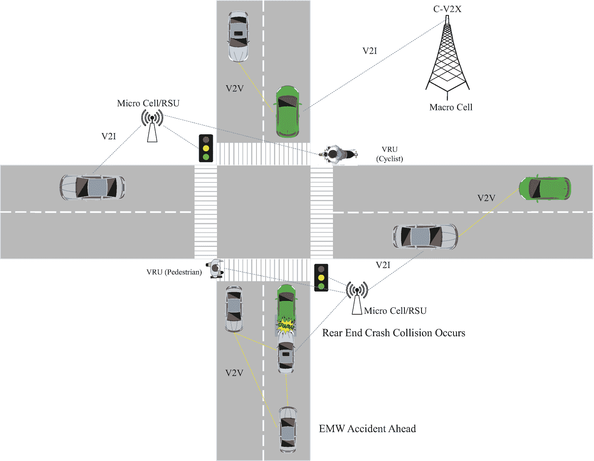
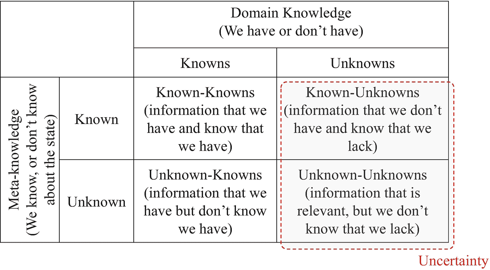
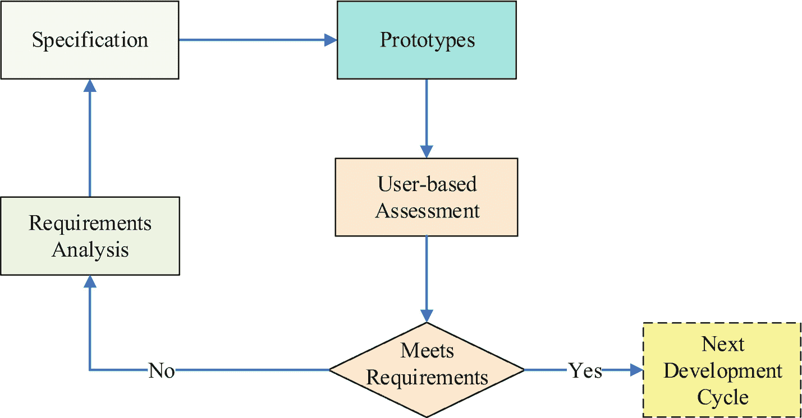

# 4. 智慧出行：技术推动因素

渐进式与革命性的技术推动因素为改进现有流程、创造全新且有时具有颠覆性的商业模式与服务提供了可能。在智慧出行的背景下，这些技术可能包括智能基础设施、互联出行、自动化出行、电动出行、微出行、主动/慢行交通、包容性出行以及情境感知系统（CAS）。以下各节将对这些技术推动因素进行说明。

## 4.1 智能基础设施

需要建设出行基础设施，以适应现有和新兴的个人及共享出行系统，并促进这些系统的有效管理。此类支持性基础设施的示例包括智能交通系统、智能交叉口、高质量的自行车基础设施（如自行车高速公路，又称自行车快线或超级自行车道）、智能停车、充电基础设施以及智能路面。本节将以智能交通系统、智能交叉口和智能路面为例，介绍作为智慧出行系统与服务技术推动因素所需的智能基础设施。

智能交通系统（ITS）或道路远程信息处理是智慧出行系统正常运行和管理所需基础设施的重要组成部分。根据威廉姆斯销售合伙公司（WSP）的定义，ITS 是“应用于交通与运输管理系统中的前沿信息与通信技术的结合，旨在提升交通网络的安全性、效率和可持续性，减少交通拥堵并提升驾驶员体验。”^(¹⁵) ITS 的主要类别包括（French and Chen, 1999）：

*   **先进的交通管理系统（ATMS）**：自适应交通信号控制、自动事件检测、区域交通控制、电子收费、排放检测等。
*   **先进的公共交通系统（APTS）**：自动车辆定位、信号优先、智能卡收费、动态合乘等。
*   **先进的出行者信息系统（ATIS）**：驾车者信息、动态路径引导、出行前规划、车载标识等。
*   **先进的车辆安全系统（AVSS）**：智能巡航控制、碰撞预警、碰撞避免、夜视、队列行驶等。
*   **商用车运营（CVO）**：动态称重或行驶中称重（WIM）、自动车辆分类、车队管理、国际边境通关等。

根据欧盟委员会的资料，^(¹⁶) ITS 可以通过辅助系统和信息服务（如动态交通管理和导航系统的使用）来帮助减少拥堵。它还能通过自动呼叫紧急服务并传输事故现场的位置数据，从而大幅缩短紧急服务的响应时间，将道路死亡人数减少约 5-10%，并减轻伤害程度，从而降低致死率和与交通相关的受伤率。ITS 还有潜力通过更好的需求管理（包括使用道路收费和准入管理）来减少 10-20% 的排放并节约能源。基于时间的动态行程定价和基于道路使用量的收费方案是新兴技术，旨在以最小化拥堵并最大化社会及环境效益的方式来控制基础设施的使用。多家公司正在提供“收费即服务”（TaaS）系统，以动态收取道路通行费。例如，Blissway 的系统包括路线规划、车辆和乘客验证以及通行费支付。通行费根据节省的时间和车内乘客数量计算，如果实际节省的时间与预估不符，费用会相应更新。加拿大公司 IMS 最近与交通政策制定者合作，在俄勒冈州、犹他州、华盛顿州和加利福尼亚州部署了基于使用量的收费方案。

**重要提示：** 根据 Precedence Research 的数据，全球智能交通系统（ITS）市场规模预计到 2030 年将达到 478.9 亿美元，年复合增长率为 6.3%。

ITS 在城市出行中的一个重要组成部分是智能交叉口。智能交叉口的主要目标是保护行人、自行车骑行者等弱势道路使用者，尤其是在繁忙的交叉口和人口密集的城市区域。智能交叉口集成了不同类型的传感器、通信模块（例如 DSRC 路侧单元或 C-V2X 微蜂窝）以及边缘端或云端的数据采集与处理模块。智能交叉口可以警示或防止左转车辆与从遮挡物后驶来的对向交通发生正面碰撞。智能交叉口也是实现联网、自动驾驶、共享和电动（CASE）车辆协同控制（如集群和队列行驶）的推动因素。例如，自动网络基本图（ANFD）被提出作为拥有智能交叉口的城市网络宏观层面建模工具（Amirgholy 等人，2019）。

智能路面有潜力彻底改变道路建设与融资方式。该技术将无线电连接的传感器嵌入道路中，以持续监测并报告路面状况的变化；在路基中安装双向 WiFi 发射器，为车辆及相邻商家/住宅提供增强型商业宽带服务；并在电动汽车行驶过程中为其充电，从而减少离路充电的必要（Careless, 2017）。此外，智能路面可以向驾驶员或自动驾驶车辆提供连续的交通和路况信息，并可向当局通报事故及其他危险状况。据《丹佛邮报》报道，^(¹⁷) 科罗拉多州已宣布，它将成为美国第一个实施“智能路面”的城市，以此作为迎接自动驾驶车辆及能够识别并警告驾驶员前方危险路况和急转弯的传感器联动标准车辆到来的准备工作的一部分。

## 4.2 网联出行

网联出行创造了新的数据丰富环境，并成为众多应用和服务的推动力，这些应用和服务将使我们的道路更安全、更少拥堵、更环保。网联出行能够支持实时导航与路径规划、交通信息、安全警告、事故避免、高级驾驶辅助系统（`ADAS`）以及自动驾驶系统（`ADS`）等功能。例如，想象一下，在变道前，系统会因盲区中即将驶来、可能导致碰撞的车辆而发出警告；提醒前方危险，如障碍物、横穿的行人/骑行者、停驻车辆、施工区域或结冰路面；提供远程诊断、故障代码通知和维修服务；实时推送交通信息和兴趣点（如商场）的更新；帮助寻找空闲停车位和加油站/充电站；以及促进在线购物。

网联化的广泛范畴是车联万物（`V2X`），它确保车辆与周围一切之间以正确的格式、在正确的时间无缝共享信息。在此，“车辆”的概念被扩展，涵盖了用于在陆地、海洋或空中运输人员或货物的任何出行平台，例如汽车、卡车、自行车、电动滑板车、空中/水上出租车、自动旅客捷运系统等。网联形式包括以下几种：

*   **车与乘客（`V2O`）**：乘客可以是出行平台的驾驶员或乘员。`V2O` 支持通过 `BLE/UWB` 技术实现的手机即钥匙功能；用于工作、娱乐和商务的车内网联服务；驾驶错误识别与预测；以及体验质量的量化。`V2O` 可扩展至客户互联，不仅包括通过智能手机、游戏主机、增强现实/虚拟现实头显等各种接口设备，利用 WiFi、4G 及现在的 5G 技术进行的直接人类互动，还包括来自日益多样化的物联网设备所产生洞察的互联传输。例如，联网的健康监测设备和个人可穿戴设备可以告知乘员他们在车内及周边环境的体验（Whitelock，2019）。

*   **车与弱势道路使用者（`V2VRU`）**：`VRU` 包括行人、骑行者，以及摩托车手、残障人士或行动不便者。`V2VRU` 能够支持 `VRU` 的检测、定位、过街意图及运动行为识别。

*   **车与车（`V2V`）**：其应用包括碰撞后警告、碰撞前警告、协作式碰撞警告、协作式前方碰撞警告、变道警告、基于车辆的路况警告、能见度增强、逆行驾驶员警告、交叉路口移动辅助、盲点警告、紧急情况下的通信中继、智能货运伴侣、末端配送系统、协作式自适应巡航控制、协作式自动化、车队管理系统以及自组织自动驾驶车辆。`V2V` 使所有车辆能够以协调的方式移动，减少“停停走走”的拥堵和紧急避让操作（Hedlund and North，2018）。为促进车与车（`V2V`）通信、传感器数据共享、协同感知及安全应用，已有多种不同的通信技术被提出并付诸实施（Edison，2019；Higuchi et al., 2019；Thota et al., 2019）。

*   **车与环境（`V2E`）**：其应用包括路况监测、交通标志与信号灯识别、驾驶风险预测以及周界监控系统。联网车辆还能实现缓慢变化及近实时性的基础设施与环境感知。缓慢变化的基础设施感知包括但不限于路面粗糙度或国际平整度指数估算、弯道倾斜角、车道标线质量、坑洼、减速带等（Nguyen et al., 2019）。近实时性基础设施感知条件的例子包括积雪覆盖、沙尘覆盖、油污检测等。

*   **车与基础设施（`V2I`）**：其功能包括路况警告、`SOS` 求救服务、施工区域警告、应急车辆信号优先通行、交叉路口碰撞警告、车内 `AMBER` 警报、远程诊断与维修、行人过街信息、红灯警告、行人检测与警告、自行车检测与警告、禁止左转警告、交通状况监测、天气状况、交通信号灯管理系统、交互管理系统、停车管理系统，以及自动驾驶汽车故障时的远程操控。例如，通用汽车的 `OnStar` 服务提供自动碰撞通知、`SOS` 紧急援助、增强型路边援助、月度车辆健康报告、自动诊断故障代码通知、服务连接、保养提醒、驾驶信息以及按需诊断。

*   **车与网络（`V2N`）**：用于路边故障车辆警告、安全凭证管理系统、多模式出行系统、动态按需出行系统与服务、基于云的群体感知服务、实时交通监控，以及将吸引人的消费者体验带入座舱以培养品牌忠诚度。

图 4-1 展示了在使用 `DSRC` 和 `C-V2X` 无线通信技术时，不同形式的网联（如 `V2VRU`、`V2V` 和 `V2I`）如何在碰撞后安全警告场景中发挥作用。在该场景中，前方车辆能够通知其他车辆前方发生的事件或危险情况，例如前方紧急电子刹车灯警告或前方碰撞避免（Peng et al., 2019）。

图 4-1

碰撞后安全警告场景

如前一章所述，美国联邦通信委员会（`FCC`）于 2020 年 11 月颁布了新的规定，以重新分配自 1999 年以来专用于 `DSRC` 标准运营的 5.850–5.925 GHz（即 5.9 GHz）频段。`FCC` 宣布的这一频谱重新分配，是对 `DSRC` 技术部署进展缓慢所采取的一项强力措施。现有的 75 MHz 安全频谱将被细分为两个带宽分配区。上段 30 MHz（5.850–5.925 GHz）将不再支持 `DSRC`，而是被重新分配，以推进和加速蜂窝车联万物（`C-V2X`）技术的部署。

## 4.3 自动化出行

世界卫生组织（`WHO`）认为，人为错误是当今所有碰撞事故的最大单一原因，并且是超过 90%致命车祸的主要因素（世界卫生组织，2018）。自动化出行旨在消除或减少这些伤害和死亡，改善因年龄或残疾目前无法驾驶者的出行便利性，并创造新的商业模式，如乘客经济。

### 自动驾驶汽车 vs. 自动飞行飞机

在莱特兄弟 1903 年首飞后，飞机的自动化进程于 9 年后开启。首个飞机自动驾驶仪由斯佩里公司于 1912 年研发。一百多年前，第一批自动驾驶模型就已开发、安装并应用于飞机。然而，汽车自动驾驶技术至今仍未像飞机自动驾驶那样普及。

**警告**

> “自动驾驶的技术难度比我们最初设想的要更具挑战性。”（哈坎·塞缪尔森，沃尔沃 CEO）

其主要原因在于运行环境特性。飞机运行的环境相对静态、可预测、结构明确且可观测，而汽车及其他城市交通工具的运行环境则高度动态化、非结构化、部分可观测，存在大量边界/极端情况以及未知的未知。同样的原理也适用于封闭式自动化快速运输系统（如地铁和自动旅客捷运系统）以及火车，这些系统因其运行环境的静态性、可预测性、结构化和可观测性而能够完全自动化。图 4-2 展示了自动驾驶车辆环境中领域知识与元知识之间的关系。

**图 4-2** 元知识与领域知识

`已知的已知`代表我们拥有且知道自身拥有其信息。例如，自动驾驶系统识别交通标志和信号灯的能力可视为`已知的已知`。`未知的已知`是我们拥有但尚未意识到的信息。`已知的未知`代表我们不具备但知道自身缺乏的信息。对抗性用例和边界/极端情况可视为`已知的未知`，因为我们了解大多数这类情况，但不知道如何应对。对抗性用例是指那些因与目标案例相似而可能混淆模型的案例。对抗性案例的例子包括充满空气的塑料袋、假坑洼/减速带、人行横道上的充气人偶气球，或带有真人大小图片的横幅。这些物体可能被物体识别系统错误地解读为需要避开的障碍物。边界/极端情况的例子包括但不限于：突然跳上汽车引擎盖的大型动物/鹿、羊群等罕见道路障碍、奇怪的马车、极端天气条件等等。`未知的未知`是那些相关但既不知道也意识不到自身缺乏的信息。例如对未知扰动的敏感性。以波音 737 MAX 为例，其配备了一个名为`MCAS`的计算机控制稳定系统，用以防止飞行中失速。在 2018 年狮航 610 号航班和 2019 年埃航 302 号航班两起空难之前，`MCAS`使用的迎角传感器故障的影响属于`未知的未知`。当系统失效时，由于`MCAS`被设计为遵从安全措施，它阻止了飞行员采取正确操作，最终导致了波音 737 MAX 的空难系列事件。

鉴于驾驶任务是一种高度重复且反应性的活动，各种智力水平的人都能获得驾照，尤其是在熟悉区域驾驶时。约书亚·本吉奥在 2019 年神经信息处理系统大会（NeurIPS 2019）上发表了题为“从系统 1 深度学习到系统 2 深度学习”的演讲，解释了“系统 1”和“系统 2”认知的区别。本吉奥表示，系统 1 是“我们凭直觉、无意识地做的事情，无法用语言解释，在行为方面就是习惯性的事情”。系统 1 自动且快速地运行，几乎不费力气，也无需意志控制；而系统 2 则将注意力分配给需要它的费力的心智活动，包括复杂计算。系统 2 的运作通常与个体能动性、选择和专注的主观体验相关联（Kahneman, 2011）。本吉奥这样解释系统 1 与系统 2 的差异：想象在熟悉的社区驾驶。你通常能下意识地导航，利用数百次见过的视觉线索。你不需要指引方向，甚至可能在不怎么专注驾驶的情况下与乘客交谈。然而，当你进入一个陌生区域，不熟悉街道且景色全新时，你必须更关注路标、使用地图并借助其他指示找到目的地。在熟悉区域情景下，你使用系统 1 认知；而在陌生区域情景下，你必须切换至系统 2 认知才能驾驶车辆。依赖系统 1 认知，很可能是大多数事故发生在日常熟悉行程中的原因。模仿或逆向工程这些系统 1 和系统 2 的认知功能，以构建能够在动态、非结构化和部分可观测环境中导航的自动驾驶系统，极具挑战性。因此，现代豪华汽车的平均软件代码行数远高于各类飞机也就不足为奇了。例如，美国空军 F-22 喷气式战斗机有 170 万行代码，波音 787 梦想客机有 650 万行代码，而现代豪华汽车的代码量超过 1 亿行（Wise, 2016）。这些现代车辆配备了互联网连接、传感器和致动器，以及 50 多台微型计算机，使其如同“超级计算机或名副其实的带轮子 IT 设备”。然而，随着车辆软件代码行数的增加，软件错误和相关漏洞的潜在风险也随之上升（Wise, 2016）。

下一章将阐述的用于人员与货物运输的城市空中交通（UAM）平台，与自动驾驶汽车共享环境的复杂性，同时还面临额外的航空技术挑战，如稳定性问题，以及噪音污染和视觉干扰等监管方面的问题。

### 4.3.2 自动驾驶

与上一章阐述的控制等级类似，SAE（国际自动机工程师学会）国际（SAE 道路自动驾驶车辆标准委员会等，2018）定义了六个驾驶自动化等级（表 4-1）。在其标准中，例如 `SAE J3016`（分类与定义）、`SAE J3018`（高度自动驾驶车辆在公共道路上的安全测试）和 `SAE J3131`（自动驾驶参考架构），SAE 并未使用“自主”一词，而是使用“自动驾驶”来反映这样一个事实：即便最先进的自动驾驶系统也并非自我管理。自动系统与自主系统之间的区别已在上一章中着重说明。

自动驾驶系统 (ADS) 包括第 3 级（低级）、第 4 级（中级）和第 5 级（高级）。“高度自动驾驶车辆”(HAV) 一词有时用来替代 ADS。第 5 级是指在所有可由人类驾驶员操控的运行设计域 (ODD) 内实现无人驾驶的完全车辆自主等级。ODD 是对 ADS 设计运行地点和时间的定义。ODD 至少应包含以下信息，以界定每个 ADS 的能力限制/边界：

*   ADS 旨在安全运行的道路类型（州际公路、地方道路、封闭道路，例如住宅社区、大学、科技园区、退休和休闲社区）
*   地理区域（城市、山区、沙漠等）
*   速度范围
*   ADS 运行的环境条件（天气、白天/夜间等）
*   其他域约束

SAE 国际与 ISO 合作更新和细化 SAE 驾驶自动化等级，以减少对概念的错误解读。最近公布的最显著变化包括将 SAE 第 1 级和第 2 级命名为“驾驶员辅助系统”，将 SAE 第 3-5 级命名为“自动驾驶系统”。此外，还增加了其他术语和定义，例如远程辅助和远程驾驶。执行这些功能的用户被称为远程辅助员和远程驾驶员。车辆类型的定义已按常规车辆、双模式车辆和 ADS 专用车辆进行分组。进一步明确了 SAE 第 3 级和第 4 级之间的区别，包括后备就绪用户的作用、在 SAE 第 3 级中实现某些自动后备的可能性，以及在 SAE 第 4 级中向车内用户发出某些警报的可能性。此外，还解释了持续驾驶自动化的分类如何融入驾驶员辅助和主动安全功能的更广泛背景中。有关道路驾驶自动化等级以及可作为评估新兴和未来驾驶自动化功能框架的潜在客观测试方法的更多信息，可参考 Tellis 等人 (2016) 的文献。

### 4.3.3 自动驾驶与安全

人类通常运用一套防御性驾驶规则来安全驾驶。其中一个例子是“史密斯系统”，它基于五条关键规则，称为 `Smith5Keys`。这五条原则、规则或“钥匙”是：“放眼远方”、“洞悉全局”、“眼观六路”、“留有余地”和“确保被看见”。这些规则为驾驶员提供了知识和技能，以便在驾驶过程中创造三个重要条件：从容驾驶、避开冲突的空间；及早发现危险及与另一车辆或固定物体发生冲突的可能性的视野；以及应对多变复杂驾驶环境的反应时间。《机动车辆操作标准安全规范》(ANSI/ASSE Z15.1) 中定义的其他一般原则包括：保持安全跟车距离；根据（适应）天气和/或道路条件安全驾驶；以及在进入弯道前调整速度，以避免在弯道中间刹车 (Hinderks 等人，2018)。自动驾驶车辆也需要防御性驾驶的指导规则。Mobileye 公司推出了一种基于模型的安全方法，称为责任敏感安全 (RSS) (Shalev-Shwartz 等人，2017)。RSS 强调了自动驾驶车辆应能遵循的五条安全规则。这五条规则包括：安全距离（即，自动驾驶车辆不应撞击前方车辆）；切入（自动驾驶车辆应能识别何时因驾驶人不安全地变道至其车道而可能导致侧向安全受到威胁）；通行权（自动驾驶车辆应能保护自身免受未正确遵守通行权规则的人类驾驶员的侵害）；有限视野（在视野受限区域保持谨慎）；以及避免碰撞（自动驾驶车辆应在不引发另一起碰撞的情况下避免碰撞）。

**表 4-1**  
SAE 自动驾驶等级

| 等级 | 名称 | 自动驾驶系统角色 | 人类角色 |
| --- | --- | --- | --- |
| 0 | 无自动化 | 无 | 所有驾驶功能 |
| 1 | 驾驶辅助（脚离） | 驾驶辅助功能，包括自适应巡航控制、预先制动或自动紧急制动、车道居中、泊车辅助、驾驶员观察和警报 | 负责所有核心驾驶功能 |
| 2 | 部分自动化（手离） | 部分驾驶自动化，例如转向、加速和减速（例如，凯迪拉克超级巡航、奥迪交通拥堵辅助、梅赛德斯-奔驰驾驶辅助系统、特斯拉自动驾驶、沃尔沃领航辅助） | 负责监控道路环境，随时准备在有或没有系统警告的情况下接管控制 |
| 3 | 有条件自动化（眼离） | 大部分驾驶功能和道路监控实现自动化，例如代客泊车。系统指定请求人类干预和驾驶员必要性 | 处于持续就绪状态，随时准备根据系统请求接管控制和进行干预 |
| 4 | 高度自动化（神离） | 所有驾驶和监控功能实现自动化，例如城市领航。运行限于选定的地理围栏环境（例如，定义的班车路线） | 无需人工控制。方向盘、踏板和换挡通常不可用 |
| 5 | 完全自动化（机器人司机） | 无需人类驾驶员的所有驾驶功能和环境（例如，机器人出租车和无人/零乘员车辆或 ZOV） | 人类可为导航提供输入，但无需任何车辆控制。可由人类操作员选择加入或退出 |

根据 NHTSA 的说法，车辆已经历了五个安全时代。巡航控制、安全带和防抱死制动等安全与便利功能在 1950 年至 2000 年期间引入，随后在 2000 年至 2010 年期间引入了高级安全功能，例如电子稳定控制、盲点检测、前向碰撞警告和车道偏离警告。高级驾驶辅助功能，例如后视摄像系统、自动紧急制动、行人自动紧急制动、后方自动紧急制动、后方交叉交通警报和车道居中辅助，在 2010 年至 2016 年期间得到了广泛部署。最近，部分自动化安全功能，例如车道保持辅助、自适应巡航控制、交通拥堵辅助和自动泊车已经开始出现。根据 NHTSA 的预测，符合安全标准的全自动安全功能和高速公路自动驾驶仪预计将在未来几十年内可用。车辆安全标准在第 [2] 章中讨论。凭借这些先进的安全功能，自动驾驶汽车有潜力消除人为错误，从而挽救生命并减少伤害。然而，目前尚不完全清楚如何处理自动驾驶车辆自身可能出现的一些安全问题，例如由车辆自身错误（如感知错误、认知错误、决策错误或行动错误）以及缺乏处理混合交通场景中其他人类驾驶员错误导致的所有事故的能力，或缺乏处理不遵守交通规则的弱势道路使用者的能力。

多种安全评级用于评估车辆的不同安全方面。例如，五星安全评级计划评估车辆在碰撞测试中的表现。公路安全保险协会（IIHS）的测试评估安全的两个方面，即耐撞性（即车辆在碰撞中保护乘员的能力）以及避免碰撞和减轻碰撞——即可预防碰撞或减轻其严重程度的技术。欧洲新车安全评鉴协会（Euro NCAP）也创建了五星安全评级系统，以帮助消费者、其家人和企业更轻松地比较车辆，并帮助他们根据自身需求确定最安全的选择。这些安全评级不断演变，以匹配不同自动化级别的自动驾驶车辆的能力。

### 4.3.4 数据驱动方法与自动驾驶车辆安全

据 Mobileye 称，只有将责任敏感安全（RSS）模型与基于语义的决策相结合，才能保证安全性和运行时效率，因为纯粹的数据驱动方法无法实现这一目标。为了证明纯粹数据驱动方法的不可行性，Mobileye 给出了以下示例：

> **重要提示**
>
> 假设每 1 小时驾驶的致死概率 *ρ* = 10^(−6)，这相当于每年约 35,000 人死亡。为了让社会接受自动驾驶系统（ADS），理想的 *ρ* 应为 10^(−9)，相当于每年约 35 人死亡。为了保证每小时事件发生概率为 *ρ*，ADS 必须驾驶 1/*ρ* = 10⁹ 小时。假设平均速度为 30 英里/小时，这段时间相当于约 300 亿英里。

基于兰德公司报告“驶向安全”的发现，Mobileye 在表 4-2 中总结了证明自动驾驶车辆可靠性所需的里程和年数。

**表 4-2 根据 Mobileye 观点，证明 ADS 可靠性所需的里程和年数**

| 为了证明死亡率…… | 我们需要驾驶…… | 100 辆车全天候行驶所需时间…… |
| :--- | :--- | :--- |
| 等于人类驾驶员 | 约 3 亿英里 | 超过十年（13 年） |
| 降低 90% | 约 30 亿英里 | 超过一个世纪（130 年） |
| 降低 99% | 约 300 亿英里 | 超过一千年（1,300 年） |

有趣的是，Mobileye 预测了为实现完全自主驾驶能力而驾驶 300 亿英里的数据和设备成本。

> **警告**
>
> 就数据成本而言，配备环绕式激光雷达、雷达和摄像头的 ADS 每小时生成约 5 TB 数据，因此 10⁹ 小时的驾驶将产生 500 万 PB 的数据，成本约为 2 万亿美元。就设备成本而言，300 亿英里相当于约 40 亿辆车每天运行 20 小时，持续一年。如果每辆测试车成本为 10 万美元，总设备成本将约为 4000 亿美元。

降低工作环境的复杂性或针对受限的操作设计域（ODD），使得 ADS 能够在多个行业成功部署。例如，矿业公司使用 ADS 运输砾石，使用自主船只进行航运，农民使用自动驾驶拖拉机在广阔、无人居住的农田上进行播种、犁地和喷洒。自动驾驶车辆还被部署在配送中心和工厂中，作为仓库拣选和放置操作中的专用自动化车辆，以及在度假胜地和机场中作为无人驾驶穿梭车，在设定的轨道上以 24 公里/小时的速度来回运送乘客。

### 4.3.5 自动驾驶与社会互动

Lipson 和 Kurman 在其著作中强调了自动驾驶车辆在城市环境中面临的一个挑战，即需要与弱势道路使用者（如行人和骑自行车者）进行社交互动。这也可以扩展到第一响应者（执法人员），他们在发生事件/事故时指挥交通；以及建筑工人，他们左手松松地举着“停止”和“慢行”标志，右手示意车辆通过，要求车辆暂时停下或减速；或者停车场服务员在车辆旁边挥手，引导其驶入车库。这种主要通过使用眼神接触、身体动作和手势进行的非语言沟通社交互动，在确保弱势道路使用者的安全方面起着至关重要的作用。模仿这种社交互动并遵循正式和非正式的互动规则，对 ADS 构成了挑战。理解街上人们所做的手势在 (Weaver, 2020) 中有所讨论。在该系统中，非光学动作捕捉技术和机器学习建模被用于为通用汽车 Cruise 的自动驾驶车辆开发手势识别系统。该系统能够识别弱势道路使用者的手势，例如停止、前进、左转和右转。自动驾驶与公共安全通用解决方案（APSCS）联盟与弗吉尼亚理工交通研究所（VTTI）以及马萨诸塞大学交通安全研究项目（UMassSafe）合作，针对自动驾驶系统的几种应急响应场景开展了一项有趣的研究。该联盟由主要汽车制造商组成，例如通用汽车、福特、梅赛德斯-奔驰、丰田、本田、现代和日产。本研究中描述的应急响应场景包括响应事件、保护事件现场、进行交通指挥和控制、执行交通拦截、调查被遗弃或无人看管的车辆，以及执行稳定和救出伤员。在每个场景中，都考虑了不同的直接、间接和信息安全交互。

### 4.3.6 自动驾驶与智慧出行

在智慧出行领域，自动驾驶并不局限于汽车，而是可以扩展到用于客运和货运的各种出行平台。这些平台包括但不限于：自动驾驶穿梭巴士（例如通用汽车的 Cruise Origin）、自动驾驶模块化商店（例如丰田的 e-Palette）、末端配送（例如 Starship、Nuro 和 Robby），以及负责第一公里和中间程运输的自动驾驶卡车（例如 Embark、特斯拉、图森未来、戴姆勒卡车、Waymo、智加科技 和 Peloton）。美国、德国、英国以及多个欧洲国家已通过立法，允许自动驾驶汽车在公共道路上进行测试。西班牙第六大城市马拉加是欧洲首个试点运营全尺寸 12 米自动驾驶载客巴士的城市。这辆可搭载 60 名乘客的巴士将每天六次往返于市中心与港口之间，全程八公里。通用汽车的 Cruise 计划于 2023 年开始在迪拜部署其自动驾驶出租车，这使迪拜成为美国以外首个运营 Cruise 服务的城市。Cruise 将在 2029 年之前成为阿联酋唯一的自动驾驶出租车服务供应商。到 2030 年，Cruise 与迪拜道路与交通管理局计划投入 4000 辆自动驾驶出租车进行运营。此外，Cruise 于 2021 年 6 月获得加州公用事业委员会的授权，可提供原型自动驾驶出租车的载客服务。在加拿大安大略省，无人驾驶车辆可在严格条件下获准在公共道路上进行测试。2021 年初，中国修改法律，允许自动驾驶汽车在高速公路上进行测试。此外，人们也在通过诸如编队行驶和队列行驶等方式，致力于为车队赋能自动驾驶能力。例如，根据 Bishop Consulting 的数据，在 L1 级队列行驶（第一代）中，前车驾驶员在连接制动等防碰撞辅助下正常驾驶，而后车驾驶员负责转向、监控道路并应对交通状况。在 L4 级跟随行驶（第二代）中，前车驾驶员的操作方式与 L1 级相同，但跟随车辆中将没有驾驶员，并采用诸如 `AutoFollow` 之类的技术。

自动驾驶系统将极大地改变世界，这一技术会带来诸多预期内和预期外的后果。伦敦中心将自动驾驶可能带来的城市影响总结为：降低公私车辆的出行成本、提升便利性、增加配送需求、加剧交通拥堵、改善公共交通可达性、减少停车需求，以及降低城市步行友好性 (Bosetti 等，2020)。然而，该中心也强调，其应用普及和实现完全自动化的能力存在高度不确定性。

停车位可能减少 70%，交通信号灯会改变或消失，出租车队可能减少 40%，汽车将教会我们人类行为，汽车也将教会我们了解它们周围的世界 (Walsh, 2020)。持悲观态度的人则认为，自动驾驶系统可能导致交通拥堵和排放问题恶化 (Madrigal, 2018)。Select Car Leasing 公司预测了自动驾驶系统的以下后果 (Select Car Leasing, 2018)：

- “路怒症”消失
- 酒精消费量增加（据估计，由于驾驶和饮酒时间开始重叠，酒精行业价值将增长 627 亿美元）
- 从拥有权向使用权的转变（根据 RethinkX 的一项研究，由于驾驶员转向订阅模式，到 2030 年消费者对新车的需求将下降 80%）
- 合法化未成年人驾驶（根据开放机器人伦理研究所的一项研究，38%的公众乐意让他们的孩子乘坐自动驾驶汽车）
- 汽车收音机消失，因为乘客会将乘车时间用于观看节目、浏览社交媒体或工作

凯捷研究院对来自欧洲、北美和亚洲的 5500 名消费者和 280 名高管进行了一项研究 (Winkler 等，2019)。该研究表明，25%的潜在消费者会考虑在未来 12 个月内乘坐自动驾驶汽车，54%的人会信任搭载其非驾驶家庭成员和朋友的自动驾驶车辆。研究还显示，73%的消费者对自动驾驶汽车带来的燃油效率最感兴趣，紧随其后的是减少排放（71%）和节省时间（50%）。为了反映对这种技术日益增长的乐观情绪和信任，52%的人预计到 2024 年，该技术的漏洞将得到修复，以至于无人驾驶汽车将成为他们首选的交通方式。

## 4.4 电动出行

电动出行旨在实现环境友好型出行，消除道路上的尾气排放和噪音污染。电动出行包括任何由电动机驱动的出行平台。例如：电动汽车、电动自行车、电动滑板车、电动滑板、电动轮椅、电动垂直起降飞行器、电动穿梭巴士、自动旅客捷运系统、超级高铁、单轨列车等等。

**重要提示**  
根据 Research and Markets 的数据，全球电动出行（电动汽车、电动滑板车、电动自行车、电动滑板、电动摩托车和电动轮椅）市场规模预计到 2025 年将达到 4893.16 亿美元，2019 年至 2025 年的复合年增长率为 21.6%。

全球电动汽车市场仍处于早期采用阶段，2019 年仅占全球新车销量的约 2% (William Hughes 和 Abuelsamid, 2020)。然而，根据世界经济论坛的数据，2020 年全球电动汽车销量达到 230 万辆，在短短五年内增长了近四倍。在挪威等一些国家，近 50%的新车现在是电动汽车，这一比例远高于其他任何国家 (Ulrich, 2020)。在挪威，电动汽车驾驶员可享受 90%的道路税折扣。麦肯锡的电动汽车指数显示，全球电动汽车行业仍在快速扩张 (Hertzke 等，2019)。该指数是一个从零到五的评分，用于评估全球 15 个主要国家的电动出行绩效。中国在全球电动出行市场中处于领先地位。

尽管电动出行的普及和社会接受度增长迅速，尤其是在微出行和公共交通领域，但电动出行仍面临一些挑战，特别是在电动汽车领域。这些挑战或限制因素包括：电动汽车相对于内燃机汽车价格过高、缺乏吸引人的购车激励措施、里程焦虑、电池寿命和性能衰减，以及超级充电桩的可用性和互操作性。英飞凌强调，电动出行的吸引力取决于电池：出行平台能用它们行驶多远距离、成本多高、重量多重 (Infineon, 2018)？

由于缺乏噪音，还存在其他一些安全隐患，这可能会对行人、自行车骑行者等弱势道路使用者的安全意识产生负面影响。低速行驶或倒车的电动汽车非常安静，可能对弱势道路使用者，特别是过马路的视障行人构成危险。一些 SAE 专家表示，电动汽车撞到行人的概率比内燃机汽车高 19%。北美和欧洲的一些政府计划要求，电动汽车在低于每小时 18 英里行驶时，必须发出自动可听警告信号，以防止在路口人行横道或电动汽车倒车时造成行人伤害。

### 可负担性与电动出行

`可负担性`仍然是电动汽车面临的最大障碍之一。其他电动微出行平台，例如电动自行车、电动滑板车和电动三轮车（见第 4.5 节），尤其是共享模式，则要实惠得多。尽管电动汽车相比传统内燃机汽车（ICEV）的初始成本更高，但其运行成本却低得多。根据密歇根大学交通研究所^(¹⁸)2018 年进行的一项研究，电动汽车的运行成本不到内燃机汽车的一半。该研究表明，在美国，运营一辆电动汽车的年均成本为 485 美元，而内燃机汽车的平均成本为 1117 美元。此外，鉴于电动汽车的活动部件远少于内燃机汽车，电动汽车的使用寿命明显更长，维护需求也更少。唯一的例外是电池的使用寿命较短。根据`InsideEVs`^(¹⁹)的数据，几乎所有电动汽车电池的保修期至少为 8 年或 10 万英里。而且，随着时间的推移，电动汽车变得越来越实惠。根据一份`Electric Vehicle Market Status—Update`报告^(²⁰)，考虑到当前联邦、州和地方激励措施，市场上即将出现净成本低于 30,000 美元（厂商建议零售价）、续航里程高达 250 英里的电动汽车车型。该报告还显示，当电池组价格降至 100 美元/千瓦时以下时，电动汽车将与内燃机汽车实现价格平价（基于不考虑任何税收优惠的总拥有成本）。虽然一些行业专家认为这最早可能在 2021 年实现，但大多数人认为这将在 2025 年左右发生。多家原始设备制造商正在加速电气化进程。例如，通用汽车在 2020 年推出了一系列新款电动汽车，包括凯迪拉克 LYRIQ 和标志性的美国 SUV 悍马 EV，并计划到 2025 年在全球推出 30 款电动汽车。

`车网互联`（V2G）技术（Sovacool 等人，2020）有助于提高电动汽车的可负担性，因为它使电动汽车车主能够通过将电动汽车电池中的能量回馈给电网来赚钱。然而，车辆需要有 75%的时间处于插电状态，才能捕捉到 V2G 的潜在价值。对于住宅用户而言，这在应急响应车辆或物流等车队中不会成为问题。电网平衡、电网维护、配电网互操作性以及数据隐私/网络安全仍然是 V2G 面临的挑战。例如，在 V2G 网络安全方面，数据将在四方之间共享，即零售商/供应商、网络公司、车队和个人用户。保证透明度（为何要共享数据？）、信任（数据将与谁共享？）和价值（共享数据有何益处？）有助于社会对 V2G 技术的接受。

`电动出行`应得到自适应路线规划和导航算法、非接触式支付以及能源辅助应用的支持，以避免用户的里程焦虑和充电焦虑。如今，已有多种能源辅助工具可用，例如`myChevrolet`移动应用的`Energy Assist`、`Google Automotive Services`（GAS）、[`EVNAViQ`](https://github.com/evnaviq)、`PlugShare Trip Planner`、`ChargePoint`、`ChargeHub`、`EVgo`、`EVHotels`、`Chargeway`、`Chargemap`和`Greenlots`。`GM Energy Assist`整合了来自车辆的数据，从而实现智能规划和准确的充电时间预测。该应用提供的服务包括实时充电站可用性（适用于`EVgo`、`Flo`、`ChargePoint`和`EV Connect`等充电网络）、支付、车主对充电站的评价和评分，以及偏好设置（例如充电器类型、网络和充电器可用性）。类似地，也有多款应用适用于电动自行车、电动滑板车和电动滑板等微出行平台。例如`Strava`、`Trailforks`、`Gravatron`、`Coach’s Eye`、`Bike Share Toronto`、`WIND`、`HFX`，以及被福特收购的共享电动滑板车`SpinBike`。在电动汽车车队层面，`Ubiq`平台提供预测性充电、充电即服务（ChaaS）、动态定价和自动车队平衡。

## 4.5 微出行

`微出行`是一种体型小巧、重量轻、速度低（低于 25 公里/小时）的出行平台，通常用于短途出行。微出行正日益普及，其形式多样，例如自行车、滑板车、滑板和自平衡独轮车。

**重要提示**

`Inkwood Research`预计，全球微出行市场到 2026 年将达到 132.7 亿美元，在 2021-2026 年的预测期内，年复合增长率为 12.09%。

电动出行平台被称为电动微出行平台，例如电动自行车、助力踏板自行车、电动滑板车、电动坐式滑板车（也称为 Vespa 式踏板车或轻便摩托车）、电动滑板、电动摩托车（也称为电动两轮车或 E2W）、趣味多功能车（FUV）、电动三轮车（也称为电动嘟嘟车或 toto）、赛格威，以及电动四轮车/电池动力微型汽车（例如雪佛兰 EN-V 2.0）。

这些出行平台可以共享，也可以作为个人交通工具私有。它们可用于本地出行、第一公里交通（即从家或出行起点到交通系统）和最后一公里交通（即从交通系统到最终目的地，如家、工作场所或咖啡馆）、监控，以及在教育机构校园、住宅小区、购物中心、主题公园和机场等场所提供送货服务，仅举几例。例如，共享电动三轮车在许多国家，尤其是低收入发展中国家，作为一种非正式且公平的交通系统已变得非常流行。公平的交通系统旨在满足以往服务不足人群的需求，使这些群体能够方便且负担得起地前往目的地和获取机会（Yanocha 和 Allan，2019）。考虑到交通支出是家庭支出的主要类别之一，微出行提供的可负担性在发达国家和发展中国家都是一个有吸引力的因素。例如，根据`加拿大统计局`^(²¹)的数据，2017 年交通支出是第二大支出类别，占总消费的 19.9%，仅次于住房支出（29.2%），高于食品支出（13.4%）。

`麦肯锡公司`^(²²)声称，从理论上讲，微出行可以涵盖所有少于 8 公里（5 英里）的旅客出行，这占当今中国、欧盟和美国总旅客里程的 50-60%。交通与发展政策研究所在（Yanocha 和 Allan，2019）中总结了电动微出行（如电动自行车和电动滑板车）在可达性、环境、公平性、可负担性、效率、安全和健康方面潜在的正负面影响。例如，在可达性方面，电动微出行的潜在积极影响包括：短途出行的时间可与汽车媲美，以及与公共交通以及经济和社会机会的连接。然而，对公共停车的需求将会增加，并且需要基础设施方面的改变。

## 4.6 主动、轻柔或零冲击出行

除了作为流行的休闲活动，步行和骑行也是高效、经济、环保且便捷的主动出行方式。许多发达国家大力提倡短途出行从机动车转向非机动车。此外，千禧一代或 Y 世代通常选择定居在有利于步行、骑行及其他主动出行方式的密集城区。主动、轻柔或零冲击出行包括非机动的人力交通工具，如步行、脚踏自行车、滑板车、轮滑、滑板以及脚踏三轮车。这些出行方式在城市"第一/最后一公里"出行中是一种廉价、有趣且环保的选择。主动出行无疑可以朝着可持续出行的未来迈进一步。

**重要提示**

根据国家环境健康合作中心（NCCEH）进行的一项研究，步行、骑行及其他主动交通方式的更广泛益处包括：减少道路拥堵和温室气体排放；降低基础设施（含维护成本）；提升道路安全；以及相比机动车更低的用户成本（Reynolds 等，2010）。

《步行性通论》指出，步行旅程应满足四个主要条件：有用、安全、舒适且有趣（Speck，2014）。基于多种因素提出了不同的步行性衡量指标，例如：连续且维护良好的人行道、通用无障碍特性、路径直达性和街道网络连通性、平面交叉口处理的安全性、无重型及高速车流、行人隔离或与车流的缓冲、土地利用密度、建筑与土地利用多样性或混合程度、行道树与景观美化、视觉趣味性，以及根据当地条件界定的场所感和实际或感知的安全感（Lo，2009）。例如，在美国、加拿大和澳大利亚，`Walk Score` 用于衡量城市步行性。根据 `Walk Score`，温哥华、蒙特利尔和多伦多是 2020 年加拿大最适宜步行的城市。纽约在美国榜单中名列榜首，总分为 88.3 分（满分 100 分），旧金山紧随其后。

如今，带有运动传感技术的可穿戴设备被用于监测与出行相关的活动。可穿戴技术定义为能够佩戴或贴合人体皮肤，以持续、近距离监测个体活动，且不中断或限制用户动作的设备（Haghi 等，2017）。智能手机、智能手表、智能戒指、智能手环、智能腕带或头带以及健身追踪器都是这类带有运动传感技术的可穿戴设备的例子。多款步行应用程序能够提供步行导航；追踪用户的步行锻炼、全天步数或活动；并显示其速度、行进距离和路线。这些应用的例子包括 `RideScout`、`Walkmeter Walking & Hiking GPS`、`MotionX-GPS`、`Virtual Walk`、`MapMyWalk`、`Argus`、`Fitbit app MobileTrack`、`Endomondo` 和 `Charity Miles`。`WALKscope` 也是一种众包工具，丹佛居民用它来收集与步行性相关的数据，例如街道信息——人行道状况、交叉口以及行人计数。

在许多情况下，对于城市区域内最长 10 公里的距离，骑行可以成为所有出行方式中点到点最快的（MMM Group，2016）。创新的自行车相关技术改善了骑行体验。这些技术包括运动传感、性能监测、座椅检测、健身规划、行程规划等。智能自行车配备了传感器，可以持续收集生理和性能数据，例如速度、功率输出、脚踏压力、车架状况、心率、温度、湿度等。智能自行车头盔配有内置尾灯、扬声器、麦克风和蓝牙连接功能。`Strava`、`Zwift`、`Komoot`、`Cyclemeter GPS`、`ViewRanger`、`Map My Ride GPS Cycling & Route Tracker`、`Bikemap` 和 `Google Maps` 是帮助骑行者充分利用其骑行时间的移动应用程序示例。除了检测汗液中的葡萄糖、乳酸盐、钠和钾，或基于皮肤电活动或皮电反应（GSR）的传感器外，皮肤温度也可用于检测出汗。特殊服装可以使用基于生物电阻抗矢量分析（BIVA）的水合传感器来监测骑手的水合状态。

世界各地许多城市通过多种项目推广主动出行。例如，布鲁塞尔出行局发起了海报宣传 `#BlijvenTrappen`（“持续踩踏”）活动，并临时免费提供该市 `Villo` 计划中的共享自行车，吸引了 7000 名新用户。根据 `Copenhagenize Index`，哥本哈根被列为 2019 年全球最适宜骑行的城市。`Copenhagenize Index` 是对全球最适宜骑行城市进行的全面整体排名。62%的哥本哈根居民骑车上下班或上学，政府在自行车基础设施上的人均投资超过 45 美元（Colville-Andersen, 2015）。然而，根据 `2019 年自行车城市指数`，荷兰城市乌得勒支是全球最适宜骑行的城市。北美城市未能进入前十名，蒙特利尔是排名最高的加拿大城市（全球第 16 位），旧金山是排名最高的美国城市（全球第 39 位）。

欧盟资助的 `LAirA`（陆侧机场可达性）项目专注于多模式、智能和低碳的机场接驳。该项目鼓励将主动出行（步行、骑行等）作为前往机场的选择。适用于步行和骑行的健康经济评估工具（`HEAT`）在 Kahlmeier 等人（2017）的著作中被描述为一种用户友好且基于可靠证据的决策工具，供交通和城市规划者使用，使得在交通评估中能够纳入体力活动的益处。`Urbano` 是另一种在城市设计中推广主动出行的工具（Dogan 等，2020）。该工具除了扩展版的知名指标 `Walkscore` 之外，还引入了两个新的城市设计指标，称为 `Streetscore` 和 `Amenityscore`。

## 4.7 包容性出行

世界卫生组织（WHO）估计，有 11 亿人（占世界人口的 14.1%）患有某种形式的残疾。这代表了世界上最大的少数群体，也是我们任何人随时都可能加入的唯一少数群体。全球估计有 4.66 亿人患有致残性听力损失，预计到 2050 年，这一数字将上升到每四人中就有一人。全球范围内，各年龄段视力受损的人数估计为 2.85 亿，其中 3900 万人失明。每天有 7500 万人需要轮椅。这几乎占世界人口的 1%。约有 2 亿人存在智力障碍（智商低于 75）。这占世界人口的 2.5%以上。根据美国疾病控制与预防中心（CDC）的数据，美国有 6100 万成年残疾人，超过四分之一的美国成年人（以及约五分之二的 65 岁及以上成年人）患有某种残疾（美国疾病控制与预防中心等，2019）。此外，大多数人在生命中的某个阶段都可能会经历行动障碍（Davidson 和 Viita，2020）。"敞开大门组织"声称，美国超过 60%的残疾人在出行时遇到重大障碍。由于生育率下降和预期寿命延长，人口老龄化也是一个日益加剧的现象。例如，像意大利这样的国家，到 2050 年，超过 35%的人口将超过 85 岁（Tapus 等，2007）。随着年龄增长，交通选择往往会变得更加有限（Davidson 和 Viita，2020）。

### 包容性出行：全面概述

包容性出行旨在促进体弱老年人和行动不便者的出行能力。这与美国交通部（USDOT）提出的“完整行程”^(²⁴)概念相符。`完整行程`指的是旅客从起点到目的地之间的无缝旅程，无论涉及多少种交通方式、换乘次数或接驳环节。一次成功的完整行程，可定义为个人能够可靠、自主、自信、独立、安全且高效地从起点到达目的地，且出行链中没有任何环节缺失，无论其所在地点、收入水平或是否残疾。

多家政府及非政府组织正关注包容性出行，并致力于相关政策与立法工作。例如，美国交通部的无障碍出行技术研究计划（`ATTRI`）正牵头开发并推广变革性应用，以改善所有出行者（特别是残疾人士）的出行选择（Martin 等人，2020）。在`ATTRI`框架下，美国交通部确定了四个重点关注的应用领域，这些领域是`完整行程`出行链中的常见短板。这四个领域分别是：智能寻路与导航系统、出行前管家与虚拟化、机器人与自动化，以及安全路口通行。2021 年 1 月，美国交通部宣布通过“完整行程”计划，拨款超过 4100 万美元用于创新技术，以改善残疾人士的交通出行便利性与可达性。

欧盟资助了多项支持包容性出行的项目。例如，`INCLUSION`项目^(²⁵)旨在理解、评估和评价欧洲重点区域交通解决方案的无障碍性和包容性。该项目识别差距与未满足的需求，并提出并试验一系列创新且可推广的解决方案（包括基于信息通信技术的元素），以确保所有人（尤其是弱势用户群体）都能获得无障碍、包容且公平的出行条件。

加拿大残障政策联盟是由残障问题研究人员、倡导者和政策制定者组成的全国性合作组织，旨在创造并传播知识，以完善加拿大的残障政策。其中一项政策涉及针对老年人及行动不便者的助行器具（特别是轮椅和代步车）（McColl 等人，2015）。(Davidson and Viita, 2020) 提出了“无障碍出行”概念，将其作为确保所有用户（包括老年人和行动不便者）都能获得无障碍、独立出行的框架。

### 技术组件与用户驱动方法

包容性出行系统的技术组件应被明确构思并设计为“社会-技术”系统的一部分，该系统在单一概念框架内对人和机器领域进行建模，并遵循用户驱动的方法，而非传统上使用的技术推动和问题聚焦方法。如果没有用户驱动的研究方法，那么设计不当的技术充其量可能无关紧要或不合适，最坏的情况下甚至会强化一些负面的老年歧视假设，而这些假设构成了社会对老龄化及/或残疾问题的许多应对方式的基础。

这种用户驱动方法（图 4-3）可以推动包容性出行系统/平台的规范制定、开发与部署，从而打造一个对用户日常生活具有实际益处的出行平台。

### 基准测试与行业倡议

由 Disability:IN 开发的残障平等指数（`DEI`）^(²⁶)是一个全面的基准测试工具，可帮助原始设备制造商和出行服务提供商规划出一条可衡量、可落地的行动路线图，以实现残障包容。大众汽车发起的“包容性出行”^(²⁷)计划旨在直接在车辆技术与出行服务设计的早期阶段让残障团体参与进来。

### 助行器具与技术

适用于体弱老年人和行动不便者的助行器具包括但不限于轮椅、个人智能城市无障碍车辆（`PICAVs`）、智能激光鞋、GPS 鞋垫与外骨骼，或用于行走辅助的柔性外衣。`PICAV`是一种电动单人车辆，具有专为行动受限人士（如老年人和残疾人）设计的特性（Cepolina 等人，2011）。

丰田的 e-Palette 是一款电动自动驾驶汽车，可容纳多达四位坐轮椅的乘客及额外的随行人员。May Mobility 也开发了低速、电动、可供轮椅上下的自动驾驶车辆。Voyage 正在全球最大的退休社区“村庄”部署自动驾驶班车服务。在东京羽田机场，残疾人可以使用智能手机应用程序召唤自动驾驶轮椅，选择目的地后即可安心就座、放松身心（Scudellari, 2017）。

`Alinker`是一款专为因疾病或健康状况而影响出行的设计的人士设计的助步自行车。同样，`Ford GoBike`也是为残疾人设计的。

### 医疗保健交通服务

此外，出行服务提供商开始更加关注医疗保健交通服务。医疗保健交通是指任何非紧急性质的、前往医疗机构的交通（例如，前往医疗预约、紧急护理中心，或从医院出院）（Wolfe and McDonald, 2020）。如今，多项符合 HIPAA（健康保险携带和责任法案）要求的非紧急医疗保健交通服务已提供给因出行或经济原因受限的个人。这些服务的例子包括`Uber Health`、蓝十字蓝盾与`Lyft`、`Cigna-HealthSpring`与`Lyft`，以及`RIDE`辅助公交服务。

**图 4-3** - 实现包容性出行的用户驱动迭代方法

外骨骼是一种新型的轮椅，能够模拟行走的运动，以弥补老年人和行动障碍者行动能力的缺失。`ReWalk` 是一种知名的可穿戴机器人外骨骼，能为脊髓损伤（SCI）患者提供髋部和膝部的动力运动，帮助他们直立、行走、转弯以及上下楼梯。`ReStore` 外装是一种轻量级的软体外装，在行走时为穿戴者的踝部和髋部提供辅助扭矩。滑铁卢大学开发了基于人工智能的自控假腿，以支持老年人和身体残障者的行动（`Laschowski` 等人，2020）。捷豹路虎发布了可改变形状的“未来座椅”，通过让大脑以为你在走路来应对久坐的健康风险。该座椅通过泡沫中的一系列执行器持续调节，模拟行走的节奏。一种名为 `Path Finder` 的新型助行器只需安装在用户的鞋子上，就能帮助行走困难者（`Rutkin`，2014）。这些鞋子专为患有“冻结步态”的帕金森病患者设计。“冻结步态”是一种致残的临床症状，会阻止患者行走或导致其步幅极短。鞋子上的激光会在患者前方 50 厘米的地板上投射出平行线，而压力传感器则在脚着地时触发振动。这些智能鞋可以帮助老年人、病人和残疾人安心行走，无需担心摔倒。GPS 追踪鞋垫用于监测阿尔茨海默病或痴呆症患者的位置和行踪。`SensFloor` 是一种大面积电容式传感器地板，可安装在任何地板下，以增加智能个人互动和监控的机会。智能斑马线油漆和智能手杖技术也能帮助视障者安全地通过人行横道。俄亥俄州立大学开发的这种油漆使用了稀土纳米晶体，能发出独特的光信号，而安装在智能手杖尖端的传感器可以激活并读取该信号。由 `Mobileye` 联合创始人创立的 `OrCam` 提供了诸如 `OrCam MyEye` 之类的可穿戴设备，使视障者能够通过音频反馈理解文字和识别物体，描述他们无法看到的事物。最后，如今已有多种软件服务和应用可用于支持包容性出行，例如 `accessibleGO`、`Wheelmap`、`AbleThrive`、`GoGo Grandparent`、`Be My Eyes` 和 `BlindSquare`。例如，`accessibleGO` 是一个提供全方位服务的无障碍出行平台，可搜索、评价和预订全球范围内的无障碍酒店、游轮、交通和目的地。

## 4.8 情境感知系统（CAS）

在其关于态势感知理论模型的描述中，`Endsley` 将态势感知定义为：在一定时空范围内对环境元素的感知、对其含义的理解，以及对它们近期状态的预测（`Endsley`，1995）。感知提供了对多种情境元素（对象、事件、人员、系统、环境因素）及其当前状态（位置、条件、模式、动作）的认识。理解则产生对感知元素整体含义的把握——它们如何作为一个整体相互关联、当前属于何种情境，以及这对个人任务目标意味着什么。预测则产生对情境可能演变趋势的认识，以及其可能或大概率出现的未来状态和事件。

为了获得完整的态势感知，智能出行平台/系统会从硬/软传感器收集静态和动态的上下文信息，以识别情境实体及其关系。随后，系统会对对象-事件进行关联分析，接着进行意图估计和后果预测。系统可以根据由上下文信息表征的情境/环境变化来执行自适应动作。

上下文信息用于回答与情境相关的问题，例如谁、什么、何时、何地，从而根据位置、身份、活动、时间和状态来表征工作环境以及系统中的主体（出行平台，如联网车辆、联网自行车或联网穿梭巴士/公共交通；以及人类主体，如驾驶员、乘客和联网行人）。上下文可分为显式上下文和隐式上下文。显式上下文包含可直接观察到的上下文参数。显式上下文信息的示例包括但不限于：行人状态、车辆位置、交通灯状态、电动汽车电池状态、共享车辆的乘客请求、行程详情以及通信通道的服务质量（QoS），如带宽、吞吐量、丢包率、延迟和抖动。隐式上下文包含需要直接推断的参数。用户体验质量（`QoE` 或 `QoX`）（`Möller` 和 `Raake`，2014）是隐式上下文信息的一个示例。`Wu` 等人将 `QoE` 定义为“用户感知和行为的多元结构，代表了用户在使用系统时的情感、认知和行为反应，包括主观和客观两方面”（`Wu` 等人，2011）。它是“用户对应用程序或服务感到愉悦或烦恼的程度，取决于其期望在效用和/或享受方面得到满足的情况，并考虑用户的个性和当前状态”（`Brunnström` 等人，2013）。这种感知过程取决于三个影响因素，即：所使用的车辆及其特定特征和条件、车辆使用的上下文环境，以及用户的主观（或人类）个性和精神状态。要获取这种隐式上下文信息，需要推断驾驶员的个性/偏好及其当前的身体、情感或认知状态。

考虑上下文信息有助于设想新的服务，例如基于位置的信息出行/地理营销，或作为忠诚度计划的一部分触发促销，或提供其他车辆云服务。这种上下文信息还有助于根据带宽或其他 QoS 参数的可用性来调整连接方式。这种自适应调整的示例可能包括：在失去与基础设施的通信时，或者当要到达的基础设施超出出行平台通信范围时，建立临时的车对车（V2V）通信中继。

个人导航系统（PNSs）（Adam 等人, 2020）是移动电话及多种导航或卫星导航应用（例如 `Google Maps`、`Apple Maps`、`CoPilot Premium HD Europe`、`TomTom GO mobile app` 和 `Waze`）以及车辆/单车共享应用（如 `BikeHub`）中存在的**情境导航系统**的实例。寻路愿景整合了个人导航系统与情境感知。它融合了用户个人预设偏好、用户活动、当地环境条件（即机场或高速公路的繁忙程度），以及基于 GPS 位置信息、视觉里程计和/或里程计的情境检测算法（Symonds 等人, 2017）。寻路可被视为一种**情境感知系统（CAS）**，它能引导用户到达特定的值机区和登机口；为同一出行空间中符合你条件的同行者（即朋友、特定商业类型用户）提供自动提醒；提供导航和方向指引；提供自动到达信息及本地引导，例如交通选择和心跳检测；以及根据用户情绪自动播放音乐。多个情境感知移动项目涉及将位置信息集成到无线应用中。例如，`General Motors OnStar` 与用户在车内和车外保持连接，并通过其 `Marketplace` 服务为他们提供便捷的优惠获取通道。`GM Marketplace` 允许用户接收特别促销信息、本地推荐与路线指引，并可通过车载触摸屏和移动应用从本地商店订购并远程付款。`General Motors OnStar` 与 `Salesforce` 合作试点了一个项目，根据驾驶员/乘客的位置提供购物、加油或餐饮优惠和交易。商家能够将优惠直接发布到 `Salesforce` 中，并通过分析看到营销活动的结果。另一个情境感知服务的例子是 `Burger King` 在墨西哥城试点的 `Traffic Jam Whopper`。`Traffic Jam Whopper` 项目利用实时数据，瞄准拥堵道路和高速公路上饥饿的驾驶员，由摩托车外卖员提供送餐服务。

## 4.9 本章小结

本章提供了基于上一章所述基础技术构建的智能出行技术赋能实例。例如，道路远程信息处理和互联出行利用无线通信基础设施、移动计算服务、区块链和物联网服务，创造了能够容纳不同智能出行服务的丰富数据环境。得益于人工智能和机器人技术等基础技术的进步，自动化出行也在不断发展，情况亦是如此。向电气化的转变为电动出行和微出行服务奠定了基础，使其成为实现净零排放的脱碳出行的一种方式。作为可持续出行的推动力，主动式、软性或零影响的出行方式也正获得发展势头。包容性出行是改善体弱老年人和残障人士出行与生活条件的推动因素。情境感知赋予出行系统根据不同的情境信息进行适应的能力。适应意味着能够处理令人困惑的情况，并迅速、成功地应对新情况。情境适应是未来出行系统非常期望的功能。根据智力三元理论和英国理论物理学家及宇宙学家史蒂芬·霍金（1942–2018）的观点，适应也是智力的一个主要标志，霍金将智力视为适应变化的能力。在下一章中，我们将详细描述得益于本章所讨论的技术赋能而发展起来的一些智能出行颠覆性创新。

脚注 1 2 3 4 5 6 7 8 9 10 11 12 13

