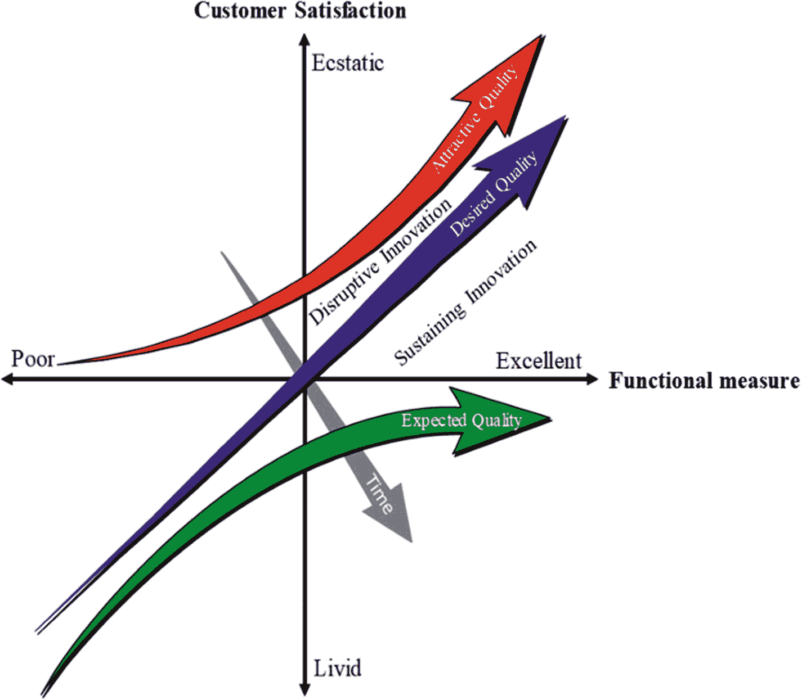
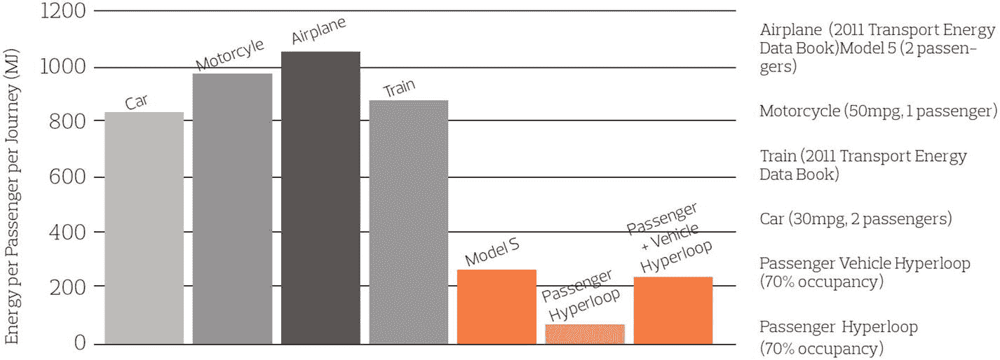
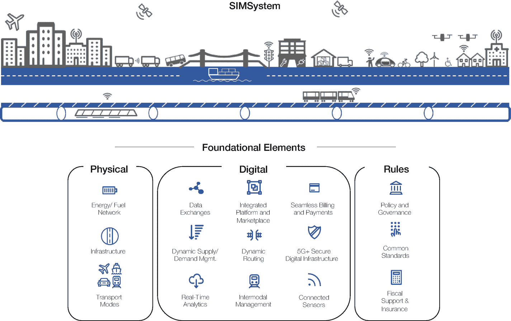

# 5. 智能出行：颠覆性创新

“颠覆性创新”一词由克莱顿·克里斯坦森提出，指的是一种过程，在此过程中，一种被低估的产品或服务开始变得足够流行，从而取代或置换传统的产品或服务。颠覆性因素正在显著改变消费者、行业和企业的运作方式，并能带来能够服务于低端或未被满足的消费者群体，并最终进入主流市场的、改变游戏规则的产品和服务。根据《创新者的窘境》（Christensen, 2013），颠覆性创新满足客户的未来需求，并且可能在某些关键特性上表现较低，但会创造出一些市场所看重的独特功能。昂贵的导航系统和 `Google`/`Apple Maps` 中的导航功能，分别是持续性创新和颠覆性创新的例子。前者更可靠，不依赖网络覆盖，但价格更高，并且相较于 `Google`/`Apple Maps` 不提供实时交通更新。出行领域的颠覆性创新通常不是突破性创新，但会显著改变出行服务提供商的运营方式、人们的出行方式以及货物的配送方式。本章将重点介绍智能出行领域的一些颠覆性创新。

## 5.1 卡诺模型

卡诺模型（图 5-1）是一种洞察客户对新产品与服务需求、并将创新视为不断变化的靶心的深刻方法。颠覆性创新存在于魅力质量与期望质量之间的区域，而维持性创新则处于期望质量与基本质量之间的区域。随着客户期望随时间推移而变化，魅力特性会逐渐变为基本特性。例如，电动车窗、电动座椅、可调节方向盘和定速巡航等汽车功能，正从期望特性转变为基本特性。而车道保持辅助、自适应巡航控制、盲点检测和预测性维护等功能，正从魅力特性转变为期望特性；自动代客泊车和自动驾驶等功能，对许多客户而言仍然是魅力特性。

**图 5-1** 卡诺模型

如果产品/服务未能反映不断变化的客户期望，客户可能会放弃它，转而选择具有更多魅力特性的其他产品/服务。许多以维持性创新为基础的公司已经倒闭，例如 Borders、Blockbuster、柯达和哥伦比亚唱片公司，它们已被采用人工智能和颠覆性创新的软件公司所取代，例如亚马逊、Netflix、Flickr 和 Apple Music。如今，谷歌是最大的营销平台。亚马逊是最大的书商，Skype 是增长最快的电信公司，LinkedIn 是增长最快的人才招聘公司，iTunes 和 Spotify 是增长最快的娱乐公司，而 Airbnb 则是全球最大的住宿服务提供商，尽管它不拥有任何房地产。此外，比特币是拥有最多货币但无实体现金的银行，Facebook 是拥有最多用户但自身不创作内容的主流媒体，阿里巴巴是价值最高但无库存的零售商，优步则是拥有最多车辆但无自有车辆的出租车公司。

出行颠覆者包括但不限于：颠覆性出行平台、共享出行、出行即服务（MaaS）、按需出行（MOD）、无缝集成出行系统（SIMS）、最后一英里配送、车辆即服务（VaaS）、零工经济和乘客经济。以下各节将更详细地解释这些颠覆者。

## 5.2 颠覆性出行平台

出行平台可以是地面的、空中的或水上的。以下小节描述了针对人员出行和货物配送正在兴起的一些颠覆性出行平台。

### 5.2.1 自主地面车辆

人们提出了不同的自主地面车辆概念，其中一些已经过测试，以促进城市、机场、购物中心、医院和主题公园中的出行即服务（见第 5.4 节）、按需出行（见第 5.5 节）和无缝集成出行（见第 5.6 节）。这些出行概念的示例包括自动驾驶穿梭车（SDS）、智能手推车、智能轮椅和自主机器人代客泊车。自动驾驶穿梭车（SDS）是能够以低速（低于 50 公里/小时）自主导航的车辆。这些车辆为第一/最后一英里交通和最后一英里配送提供了有吸引力且灵活的共享出行解决方案。例如，FABULOS 项目 ^(²⁸) 聚焦于城市如何利用 SDS 进行最后一英里交通。许多原始设备制造商（OEM）参与了各种自动驾驶穿梭车平台的开发。例如，通用汽车的 Cruise 发布了其名为 Origin 的自动驾驶穿梭车，该车没有方向盘或油门踏板，用于即将推出的叫车服务。Origin 是一个互联、自主、电动的出行平台，旨在成为城市及周边区域拼车服务的六人出租车。该 SDS 已在旧金山的公共道路上进行了广泛测试。截至本书出版日期，一支车队在该城市的地理围栏区域内运行，为 Cruise 员工提供全天候的叫车服务（目前仅限于员工）。表 5-1 总结了自动驾驶穿梭车的潜在应用、相关利益相关者以及预期的社会/环境影响。

尽管自动驾驶穿梭车具有上述有前景的应用和优势，但在 SDS 能够广泛应用尤其是用于公共交通之前，仍有一些悬而未决的问题需要解答。这些问题^(²⁹) 包括：乘坐者对自动驾驶穿梭车的接受程度如何？他们有哪些担忧？乘坐者将如何叫到一辆无人驾驶穿梭车？没有智能手机和出行服务提供商应用的乘坐者是否也能叫到穿梭车？穿梭车将在何处接载乘客？一些残障乘客是否需要帮助才能进入无人驾驶穿梭车？如果需要，谁来帮助他们？如果无人驾驶车辆将乘客送到附近的公交站而不是直接送到目的地，乘客是否会感到不满？

**表 5-1** 自动驾驶穿梭车的潜在应用场景（Bucchiarone 等，2020 年）

| 使用场景 | 提供的服务 | 涉及的利益相关者 | 社会/环境影响 |
| --- | --- | --- | --- |
| 作为共享与集成出行的自动驾驶穿梭车 | 共享出行和多模式出行规划 | 市民、游客、员工和公共公司 | 激励可持续出行行为，优化多模式公私交通的规划、预订和支付 |
| 旅游/信息出行/地理出行 | 游客流动与定向营销广告 | 游客、地方政府和商业企业主 | 改善游客体验，并为赞助商提升营销吸引力 |
| 最后一英里货物配送 | 货物配送 | 快递公司、商业企业主和市民 | 缓解市中心交通拥堵，降低运营/配送成本，减少空气污染，提高客户满意度 |
| 公共/私人监控管理 | 监控管理 | 市民、游客、员工、公共公司、私营公司、当地警察和安全公司 | 实时上下文数据检索，监控活动，在危险情况下协调响应，并检测恐慌事件 |

其他颠覆性出行平台还包括自主轮椅、自主手推车和自主机器人代步车。WHILL 公司推出了一款智能轮椅，以解决当前机场行动不便乘客服务效率低下的问题。WHILL NEXT 可以自主跟随乘客移动，并允许多个单元（如行李车）排成单列行进。在目的地卸下行李后，手推车会自动返回服务下一位客户。一款名为 Eli 的自主购物手推车可以在超市为购物者提供帮助。它能在超市内导航，跟随购物者在过道中行走，避开障碍物，并自动为所购商品结账。一款名为 Stan 的自主机器人代步车可以在机场为您停车。该机器人已在伦敦盖特威克机场进行了测试。Stan 使用类似叉车的臂和人工智能技术，可在停车场内增加多达 50%的空间。利用乘客的航班信息，Stan 机器人会将汽车送回到指定车位，以便乘客返回时车辆已在那里等待。

### 5.2.2 三维机动性与城市空中交通（UAM）

有轨电车/城市路面电车/火车可被视为**1 自由度（DOF）**移动平台，因为它们主要依赖纵向运动，而横向运动的自由度相当受限（脱轨情况除外）。汽车具有**2 自由度**（横向和纵向运动）。三维机动性是从受限的二维街道向二维移动空间的范式转变，实现了**3 自由度**（横向、纵向和垂直运动），或更准确地说，考虑到旋转运动，是**6 自由度**（横向、纵向、垂直、侧倾、俯仰和偏航）。在此范式下，城市空中交通（UAM）指的是快速发展的、用于人员和货物运输的城市交通系统。空中出租车/飞行出租车/飞行汽车是未来主义的颠覆性移动平台，其基础是按需航空商业模式。它们是有人驾驶的垂直起降（VTOL）飞行器。这些 VTOL 飞行器可定制，以容纳不同数量的乘客或用于货物运输。eVTOL 利用电力推进在人口稠密的城市区域及其周边飞行，速度最高可达 320 公里/小时，航程约 200 英里。例如`uberAIR`、被`Joby Aviation`收购的`Uber Elevate`、`JoeBen Bevirt`的飞行汽车、`Airbus Flying Taxi`、`Maker’s Archer Aviation`、`Boeing Flying Taxi`以及在`CES 2021`上展示的`Cadillac eVTOLs`。`Cadillac eVTOLs`使用一台 90 千瓦时的电动汽车电机为四个旋翼以及空对空和空对地通信提供动力，可以在屋顶接载乘客，并将他们送到距离目的地最近的垂直起降机场。`Archer Aviation`正与汽车制造商`Stellantis`合作进行制造，并与`United Airlines`合作运营其复合材料 eVTOL 飞行器。该公司计划通过其特殊目的收购公司（SPAC）合并筹集 38 亿美元。生产计划于 2023 年启动。

**重要信息**

根据`Prescient & Strategic Intelligence`的数据，全球城市空中交通（UAM）市场预计在 2023 年价值 8.95 亿美元，到 2030 年将增长至 68.894 亿美元，预测期（2023-2030 年）内的复合年增长率为 33.9%。

来自`Airbus Helicopters`的、具有 15 分钟自主飞行能力的远程遥控四座 eVTOL`City Airbus`已于 2020 年 7 月首次公开飞行。`Hyundai`在`CES 2020`上展示了未来的空中交通概念，该概念由互联的 PAV（个人飞行器）、PBV（定制化车辆）和一个枢纽站组成。PAV 是一种无需跑道的城市空中交通 eVTOL 飞行器。PBV 是一种生态友好、高度定制化的城市车辆，用于人员或货物运输，并可在途中提供定制服务（例如咖啡馆、诊所），而枢纽站主要是 PAV 的起飞/降落点和 PBV 的到达/出发点。

根据`NASA 城市空中交通`报告（Goyal, 2018），设想了三个具有挑战性的 UAM 用例：

-   **最后一英里配送**：从本地配送枢纽将包裹（小于 5 磅或 2 公斤）快速送达专用接收装置。配送是非计划性的，并随着在线订单的下达而规划路线。
-   **空中地铁**：类似于当前的地铁和公交等公共交通选项，具有预定路线、固定时刻表以及在每个城市高流量区域设定的站点。车辆自主运行，一次可容纳两到五名乘客，平均每次行程载客三人。
-   **空中出租车**：空中出租车用例是一种近乎普遍（或门到门）的拼车服务，允许消费者呼叫 VTOL/eVTOL 到他们希望的上车地点，并在给定城市的屋顶指定下车目的地。像今天的拼车应用程序一样，行程是非计划性的且按需提供。与空中地铁的情况类似，车辆自主运行，一次可容纳两到五名乘客，平均每次行程载客一人。

一些城市正在试验 UAM，重点放在空中出租车（例如中国的`亿航`，^(³⁰)新西兰的`Kitty Hawk`，^(³¹)以及迪拜的无人机出租车^(³²)）和空中快递（例如`Amazon Prime Air`，^(³³)`京东`的无人机配送，中国的`迅蚁`在 COVID-19 疫情期间用于医疗物资配送的无人机，以及美国的`Zipline`在美国和非洲用于医疗物资和个人防护装备配送的无人机）。

英国政府正向一家初创公司提供 165 万美元，用于建造一个用于“飞行出租车”的弹出式城市机场，该机场将于 2021 年晚些时候在英格兰考文垂开放。这个名为`Air-One`的城市机场将成为世界上第一个 eVTOL 运营枢纽。

`麦肯锡` ^(³⁴) 将交通管理基础设施、接收包裹或降落车辆的物理基础设施以及支持技术基础设施（例如允许无人机进入仓库的自动门）确定为 UAM 的关键基础设施要求。

要使 UAM 作为最后一英里配送平台、空中地铁或空中出租车被广泛接受和社会认可，仍然面临若干挑战。这些挑战包括但不限于：“超视距”（BVLOS）运行的安全性、密集城区的安全性、隐私、噪音污染、视觉干扰、对野生动物的影响、动态地理围栏、特别是在恶劣天气条件下的最优路径规划和导航、将包裹送达正确的人员公寓、以及遵守空域规定。例如，正如第`2`章所讨论的，在世界许多司法管辖区，BVLOS 飞行需要获得航空当局的认证和许可。2021 年 1 月，美国联邦航空管理局首次批准了具备 BVLOS 运行能力的全自动商用无人机飞行。该批准授予了`American Robotics Inc.`。然而，这些无人机仅获准在乡村地区沿规划航线飞行，且高度限制在 122 米以下。此外，需要一名人类飞行员远程监督每次飞行的起飞过程。

### 5.2.3 水上出租车

水上出租车或水上巴士主要在城市环境中提供公共或私人交通服务。这种城市水上交通已在全球许多水道丰富的城市（如威尼斯、曼谷、东京、纽约、悉尼和多伦多）使用了数百年，用于确保快速点对点运输并缓解交通拥堵。迪拜道路与交通管理局（RTA）监管多种水上交通方式，例如水上出租车（每次最多 10 名乘客）、水上巴士（20 名乘客）、传统木船（20 名乘客）、混合动力木船（20 名乘客）、电动木船（9 名乘客）以及渡轮（100 名乘客）。技术正在迅速改变水上出租车的形态。例如，采用混合动力推进系统的“雷霆”号水上的士，能够在威尼斯的水道中以纯电动模式零排放行驶。这些水上的士也会驶入开阔水域前往机场，此时可使用柴油发动机达到更高速度，同时为电池充电。SeaBubbles 是一款实验性的水翼电动水上的士，最高时速可达 25 公里/小时，无浪、无噪音、零排放，可在城市中按需提供水上的士服务。

在不久的将来，自动驾驶船只将被用于沿海和河滨城市的货物和人员运输，有助于减少公路和铁路的交通拥堵。例如，“Roboat”项目^(³⁵)旨在开发一支自动驾驶船队，用于在阿姆斯特丹市运输货物和人员（Wang 等人，2019）。在同一项目中，麻省理工学院的研究人员设计了 3D 打印的无人驾驶船只，这些船只既可提供运输服务，也能自行组装成其他浮动结构。

**重要提示**

根据 MarketsandMarkets 的数据，自主船舶市场预计到 2030 年将达到 142 亿美元，2020 年至 2030 年的复合年增长率为 9.3%。

目前，高度自动化的船舶已在多个国家投入使用，尤其是在挪威等北欧国家。例如，由挪威公司 Kongsberg Maritime 建造的两艘实验性自主船只“海洋空间无人机 1 号”和“2 号”，正被挪威科技大学使用。挪威政府资助的其它几个项目旨在开发电动自主船舶，使其成为新型综合交通系统的一部分，而非取代现有船只。

正如第 2 章所述，改变海事法律法规仍是适应自主船舶用于人员出行和货物运输所面临的挑战。

### 5.2.4 自动旅客捷运系统

自动旅客捷运系统代表了交通系统的可持续性与颠覆性创新，是全面自动化/无人驾驶、高架且先进的固定导轨系统。APM 在导轨管道内使用电动转向架，推动悬挂式客舱前进，客舱可根据需求定制不同尺寸，从个人舱到多人舱不等，速度可超过 160 公里/小时。与磁悬浮及其他类型的单轨系统相比，悬挂式自动快速公交所需的基础设施要少得多，如表 5-2 所示。

**表 5-2** 城市磁悬浮、轻轨、快速公交与自动旅客捷运系统比较 | 来源：Swift Tram

| 因素 | APM | 城市磁悬浮 | 轻轨 | 快速公交 |
| :--- | :--- | :--- | :--- | :--- |
| 安装成本 | $$ | $$$ | $$$$$ | $$$ |
| 路权成本 | $ | $$$ | $$$$$$ | $$$$ |
| 运营成本 | $$ | $$ | $$$$$ | $$$$ |
| 系统运力 | 中等 | 中等 | 高 | 中等 |
| 可及性/频率 | 高 | 中等 | 低 | 中等 |
| 24/7 可用 | 是 | 否 | 否 | 否 |
| 能耗 | 极低 | 中等 | 中等 | 高 |
| 行驶速度 | 30 英里/小时 | 55 英里/小时 | 55 英里/小时 | 55 英里/小时 |
| 专用货运 | 是 | 否 | 否 | 否 |
| 天气影响运营 | 否 | 可能 | 是 | 是 |

### 5.2.5 超级高铁与城市环线高铁

超级高铁是一项颠覆性的客货运输技术。该系统由一个密封的减压真空管构成，浮动的吊舱/胶囊在其中以低空气阻力或摩擦力高速（最高 1200 公里/小时）运送人员或货物。超级高铁系统兼具火车的便利性和飞机的速度。SpaceX 超级高铁吊舱竞赛吸引了学术界、工业界和政府机构的关注，共同致力于超级高铁技术的研发。该竞赛的目标是设计和建造一个缩比原型运输载具，以证明超级高铁概念在技术上的可行性。主要参与者包括超级高铁运输技术公司、超级高铁一号、AECOM、Hardt 和 TransPod^(³⁶)，后者曾在多伦多市推出超级高铁概念。迄今为止，维珍超级高铁^(³⁷)是世界上唯一一家成功对其技术进行大规模测试的公司。维珍超级高铁一号概念代表了一种可持续的交通模式，其设想是利用覆盖管道的太阳能电池板，相比高速铁路能更好、更经济地利用地形，并消除了机械噪音源，如轨道上的车轮噪音。

**重要提示**

根据 Verified Market Research 的数据，2019 年超级高铁技术市场估值为 4 亿美元，预计到 2027 年将达到 73.2 亿美元，2020 年至 2027 年的复合年增长率为 47.14%。

埃隆·马斯克设想超级高铁系统的能源成本远低于任何现有交通方式（图 5-2）。美国宇航局也表示，超级高铁的效率将比航空（短途航线）高五到六倍，比铁路高两到三倍（Taylor 等人，2016）。然而，关于能耗计算的细节有限；因此，这些说法无法得到进一步验证（Walker, 2018）。这主要是由于缺乏真实的超级高铁系统或测试平台，无法用于在这种新兴颠覆性出行技术在不同运行条件下的能源分析。

**图 5-2** 洛杉矶至旧金山旅程中各种交通方式的每位乘客能源成本（Musk, 2013）

尽管超级高铁作为一种概念已存在多年，并吸引了大量投资，但在开发与测试方面仍存在巨大差距。为弥合这一差距，我共同发明了一种用于超级高铁的多功能培训与实验测试平台（Khamis 和 AbdelFattah, 2019）。该测试平台^(³⁸)包括一个配备真空系统的密封管道、一个由电磁引擎悬浮和推进的胶囊/吊舱、多个车站、一个状态监测与控制系统、一个用于本地实验的人机界面单元、一个用于远程实验的远程呈现系统、一个交互式虚拟现实工具以及一个数字孪生体。该测试平台可用于超级高铁技术及相关技术的专业和教学培训。它允许学生、学员和研究人员研究、实验并理解超级高铁技术作为颠覆性交通技术的各个方面。该测试平台支持各种教学和建构活动，不仅展示了超级高铁技术如何工作，还展示了该技术能实现什么。

该测试台的控制系统负责调节压力水平、调度胶囊运行、启动操作并在紧急情况下进行干预。其编程接口允许执行不同的控制算法，例如胶囊的 PID 参数整定、利用 IMU 或安装在管道内的反光带进行胶囊定位，或使用混合定位（反光带结合基于 IMU 的定位）、胶囊派遣、时刻表制定与调度。远程实验单元支持为教育、培训和研究目的与超回路测试台进行远程交互。这使得该测试台不受师生同步到场的限制，允许学生随时按需访问，并能与其他机构共享资源。该测试台中集成了超回路数字孪生系统，它是一个基于云的高保真虚拟表示，即超回路的数字复制品，展现了胶囊的不同元件及其动力学特性。该数字孪生体融合了 3D 建模、多物理场仿真和认知物联网能力，构建了一个包含超回路在整个系统生命周期内最新、精确属性和状态的数字影子。数字孪生的优势包括但不限于监控、诊断和预测，以确保系统健康、高效、可持续地运行，并优化超回路测试台的运行与维护。

另一种新颖且颠覆性的地面交通方式是于 2018 年在法国推出的城市环（urbanloop^(³⁹)），它被定位为一种用于快速出行的城市交通系统。受跑车启发的单人或双人透明胶囊在管道中运行，根据城市约束条件，这些管道可以埋入地下、半埋或架空。

## 5.3 共享出行

近年来，共享出行技术已显著成熟——这一点从市面上出现的商业化共享出行服务中可见一斑，例如汽车共享、单车共享、滑板车共享、拼车、网约车/出行服务采购以及需求响应式公交（DRT）。共享自动驾驶汽车（SAV）和拼车共享自动驾驶汽车（PSAV）也在迅速兴起。PSAV 是同时服务于多名乘客的 SAV。

**重要信息**

根据 Grand View Research 公司的报告，全球共享出行市场规模预计到 2025 年将达到 6195.1 亿美元，预测期内的复合年增长率为 25.1%。

不同的共享出行服务是基于共享经济和零工经济的商业模式提供的。这些服务代表了从所有权向使用权的范式转变。共享出行服务包括以下内容：

*   **车辆共享服务**：由 Zipcar、SHARE NOW、Getaround、Capital Bikeshare、Lime、VeoRide 和 Bird 等公司提供，涉及多名客户在不同时间使用同一辆车（Kimley-Horn 等，2019）。

*   **个人对个人（P2P）车辆共享服务**：这是一种新兴服务，由车辆所有者向所在地区的其他人短期提供车辆。该模式类似于 Airbnb 和 Couchsurfing。在这些系统中，出行平台可以是一辆汽车（例如 `Drive Drive Car`）、一辆自行车（例如 `Spinlister`）、一辆滑板车、个人智能城市无障碍车辆(PICAV)、垂直起降飞行器(VTOL)、SeaBubble 或任何其他个人交通工具。

*   **需求响应式公交（DRT）、电话叫车或辅助公交**：DRT 是一种需要预先预订的共享出行服务，它融合了公共交通和私人交通服务，以提供类似于按需出行服务的体验。DRT 在（Bakker，1999）中被定义为介于私家车和传统公共交通之间的一种交通选择，即一种提供与私家车相似的服务水平和出行便利性，同时又能方便接驳公共交通的服务。DRT 提供专用的小巴、中巴或大型出租车，旨在通过电话或智能手机应用满足用户预先提出的预约请求（Talley 和 Anderson，1986）。

*   **微公交**：美国交通部(USDOT)将微公交定义为“一种私人拥有和运营的共享交通系统，可以提供固定路线和时刻表，也可以提供灵活的路线和按需调度。车辆通常包括面包车和巴士”（Kimley-Horn 等，2019）。微公交是 DRT 的一种形式。微公交的供应商或服务示例包括 Ford TransLoc、DemandTrans 和 Transdev。

*   **拼车服务**：由 Zimride、Getaround 和 Waze Carpool 等公司提供，是传统拼车的一种软件辅助现代化形式，即拥有自己私家车的司机与使用相同订阅服务的乘客进行匹配，以分摊共同通勤的成本（Kimley-Horn 等，2019）。在拼车中，司机在已经计划从 A 点开到 B 点的行程中填补空余座位。这并非新模式，因为自二战以来，拼车已使用多年。当时美国政府鼓励民众拼车和共乘，作为节省战争所需资源的一种方式。1943 年美国政府发起的这场史无前例的宣传活动中就包括一张宣传海报，上面写着：“当你独自驾车时，你就是在与希特勒同行！”

*   **网约车或出行服务采购**：由 Uber、Lyft 和 DiDi 等交通网络公司(TNC)提供，指司机使用其个人车辆为付费乘客提供私人行程（Kimley-Horn 等，2019）。乘客按需叫车，司机驾驶车辆前往某处以获取报酬。

*   **拼车服务**：由优步（Uber）和来福车（Lyft）等运输网络公司（TNCs）在主要城市提供（`UberPool`和`Lyft Line`），是网约车（ridesourcing）与微公共交通（microtransit）模式的紧密结合体。司机使用个人车辆，专业驾驶而非通勤途中搭载，能够在根据新行程请求动态更新的路线上，同时容纳多名独立乘客（区别于面向单一付费乘客的网约车`ridehailing`）（Kimley-Horn 等，2019）。与微公共交通相比，拼车（ridesplitting）通常使用容量更低的车辆（少于六名乘客）；与网约车/网约出租车（ridehailing/ridesourcing）相比，拼车中，顾客更有可能同时独立预订行程，且其起止点能够通过同一整体行程方便地服务。

美国交通部联邦公路管理局在（Shaheen 等，2016）中提供了另一种分类。他们将共享出行分为五类，即：基于会员制的自助服务模式（例如，共享单车、共享汽车、拼车、面包车合乘和按需共享出行），点对点（P2P）自助服务模式（例如，共享单车和共享汽车），非会员制自助服务模式（共享单车、汽车租赁和临时拼车），雇佣服务模式（例如，快递服务网络的 CBS、豪华轿车/礼宾车、网约车或 TNCs 以及出租车或电子叫车）和大运量公交系统（例如，公共交通、微交通和替代交通服务，包括微公共交通、辅助公交和班车服务）。

共享出行的关键优势在于其能够填补传统公共交通缺失、不足或低效的空白（Kimley-Horn 等，2019），尤其是在快速公交与居民比率（RTR）较低的国家。`RTR`衡量的是每个国家的每百万城市居民拥有多少公里的大运量公交。

美国的`RTR`为 8.9，而法国的`RTR`为 30.2（Hook 和 Hughes，2017）。共享出行也是实现公平交通的推动力。公平的交通系统满足了先前服务不足人群的需求，使这些群体能够便捷且负担得起地获取目的地和机会。

公平交通还意味着系统效益（和外部性）得到公平分配（Yanocha 和 Allan，2019）。

新冠疫情严重影响了共享出行服务，因为它加剧了人们对可能感染的担忧。新冠疫情对共享出行的影响将在下一章讨论。

## 5.4 出行即服务（MaaS）

从核心上讲，服务化（servitization）是指各行业利用其“产品”来销售“作为服务的结果”，而非一次性销售（Vandermerwe 和 Rada，1988）。这意味着产品被用作交付和销售服务的平台。在出行领域，服务化使得将出行作为服务交付成为可能，而非客户购买车辆。出行即服务（MaaS）在 Goodall 等人（2017）中被描述为应用于城市交通的网飞（Netflix）商业模式。

当前汽车、自行车、火车和公交之间的严格划分构成了无缝出行的障碍。`MaaS`是出行系统的新自由主义化，使得无缝出行成为可能。`MaaS America`将`MaaS`定义为“通过一个集成的数字平台，跨越所有可用的交通方式，提供无缝、无限可适应的个性化出行服务”。^(⁴⁰)

`MaaS`涉及集成无缝支付和相关基础设施元素（例如，停车和车辆充电），以利用创意定价和出行套餐为客户提供有吸引力的价值主张（Kimley-Horn 等，2019）。通过`MaaS`，可以实现不同出行服务之间的无缝集成，出行平台将更加以客户为中心，路线规划将更加简便，并为用户启用简化的支付方式。`MaaS`使这些个人能够购买由他人（通常是政府、出行提供商和其他个人）拥有的、可互操作的出行服务套餐（汽车、出租车、公交、铁路、共享单车等）的访问权。这由集成的聚合与支付平台促进，并通过大数据的密集处理来实时匹配供给与需求（Thakuriah 等，2017）。表 5-3 显示了由`MaaS America`定义的七个`MaaS`层级。

**表 5-3** 根据 `MaaS America` 划分的 `MaaS` 层级

| MaaS 层级 | 描述 | 服务 |
| --- | --- | --- |
| 0 | 具有数字化界面的个体交通方式 | 基于账户的系统及在线可用信息 |
| 1 | 部分私营服务之间的一对一集成 | 联合产品（例如，收费 + 停车场，汽车 + 渡轮，以及停车换乘 + 公交服务） |
| 2 | 在有限的公共和私营交通服务中集成支付与票务 | 私营运营商与公共交通运营模式之间的集成 |
| 3 | 在多种交通服务中使用单一账户的统一界面 | 通过一个出行者账户实现单一元运营商（私营和公共） |
| 4 | 所有模式均已集成，包括私营和公共，含路线规划、票务和支付 | 开放数据和标准被所有交通提供商和 MaaS 元运营商定义并普遍使用，以向出行者提供服务 |
| 5 | 基于出行偏好和近实时数据主动进行人工智能（AI）选择，以实现行程的临时更改 | 基于出行者特定行为和画像；对于基于出行者偏好、过往出行历史和过滤条件的端到端行程，出行者仅需极少（甚至无需）干预 |
| 6 | MaaS 连接超越出行范畴，与物联网（IoT）、智慧建筑和智慧城市对接 | 与出行者生态系统实现便捷无缝的接口 |

不断演进的出行即服务（MaaS）解决方案将共享出行大规模扩展，涵盖公共交通、汽车共享、租车、出租车和公共自行车等服务。维也纳、赫尔辛基和汉诺威等城市已成为 MaaS 解决方案的应用典范 (Polle and Naper, 2021)。MaaS 依赖于功能完善的数字平台，这些平台能够全程管理旅客行程，让旅客无缝"混搭"不同的个人与共享出行方式，例如电动自行车、机器人出租车、小型城市通勤车/微通勤车、自动驾驶接驳车、火车、飞机及其他第一英里和最后一英里交通方式。这种无缝出行平台有助于提升多模式交通系统的可用性、经济性、效率和可持续性。从用户角度来看，MaaS 以应用程序或其他数字平台的形式呈现，整合了公共和私营出行服务商提供的服务。用户可按需选择适合特定时间点的出行方式支付行程费用，并直达目的地。这些平台应提供多种移动设备支持的服务，例如多模式出行的最优动态规划、一键预订支付、动态定价、行程调整、实时交通与天气信息、自适应路线规划、智能停车等。像`Whim`（赫尔辛基）、`UbiGo`（哥德堡）、`Qixxit`（德国）和`Beeline`（新加坡）这样的移动应用程序，已允许用户选择并支付多种交通方式。例如，`Whim`应用程序可提供出租车、租车、公共交通和共享单车等多模式出行服务。该应用还能学习用户偏好，并与日历同步，智能推荐前往活动的出行方式 (Goodall et al., 2017)。

### 重要信息

据 MarketsandMarkets 预测，到 2030 年，全球出行即服务（MaaS）市场规模将达到 704 亿美元。

从出行服务提供商的角度来看，MaaS 平台应赋予服务商打包服务并便捷分账的能力。例如，西门子 MaaS 平台^(⁴¹)能够针对特定用户群体和出行需求打包出行产品。举例来说，"商务套餐"可能包含全部公共交通使用权、1000 分钟高级停车时长以及 120 分钟豪华轿车服务，每月费用为 200 欧元。"学生套餐"可包含全部公共交通、不限次共享单车及 2 天汽车共享服务，每月费用为 80 欧元。"家庭套餐"则可能涵盖全家公共交通、500 分钟市区停车、100 分钟汽车共享及校车服务，每月费用为 130 欧元。

可以根据用户信息与行为（如职业、居住区域、日常通勤方式及套餐使用情况）推荐或定制最优或最受欢迎的 MaaS 服务组合。例如，在市中心区域，用户可能希望套餐中 50%为公共交通，35%为电动自行车或电动滑板车，15%为汽车出行时间；而在城市郊区，用户可能更倾向于增加汽车出行时间并减少微出行时间。与供应商进行行程经纪、重新打包并将其作为捆绑套餐转售，是 MaaS 的其他显著特征 (Sochor et al., 2015)。优步软件平台的若干功能（如行程规划和出行管理）已在多个城市作为软件即服务（SaaS）提供，这是该网约车公司进军公共交通领域的更广泛战略的一部分。^(⁴²)此外，优步收购了 Routematch^(⁴³)，以使公共交通更加便捷。MaaS 的演进及其被消费者大规模采用，对于客运经济的兴起至关重要 (Lanctot et al., 2017)。MaaS 在客运经济中的作用将在第 5.9 节中重点阐述。

MaaS 面临的主要挑战之一，是在服务商与乘客的利益之间找到恰当的平衡点。服务商以利润最大化为目标，通常倾向于在高峰时段将更多资源分配给繁忙区域，而乘客则期望在任何时间、任何地点都能获得响应迅速且价格合理的服务。MaaS 的另一个主要挑战是开发出行服务商之间高效协调与协作的模型。这种协调旨在解决相互合作或竞争的出行服务商之间的相互依赖关系管理问题，以实现各自目标。根据德克萨斯大学奥斯汀分校的一项研究 (Pandey et al., 2019)，与建立更集中化的平台（该平台可创造一定程度的合作，并基于所有服务商的有限信息生成最优分配方案）相比，多个出行服务商相互竞争可能会降低 MaaS 平台的服务质量。

## 5.5 按需出行（MOD）

美国交通部将按需出行（MOD）定义为一种创新的交通概念，消费者可通过调度或使用共享出行、快递服务、飞行器及公共交通解决方案来按需获取出行服务、商品和货物，并且行程规划、预订、实时信息、票价支付等乘客服务被整合至单一用户界面（Shaheen 等人，2017）。MOD 提供商促进了对不同出行方式的接入，例如汽车共享、单车共享、踏板车共享、拼车、网约车/叫车、交通网络公司（TNC）、微出行、班车服务、公共交通以及其他新兴交通解决方案。Susan Shaheen 和 Adam Cohen 在（Shaheen 和 Cohen，2020）中重点阐述了 MOD 与出行即服务（MaaS）的主要区别。MOD 侧重于乘客出行与货物配送的商品化以及交通系统管理，而 MaaS 主要关注乘客出行服务的聚合与订阅服务。MOD 旨在提供一个技术平台，使客户能够将一定程度的按需选项融入其公交出行中，并可能通过同一用户界面发现、预订和支付多种出行方式（Kimley-Horn 等人，2019）。MOD 系统的设计必须能够有效地（从用户角度）且经济地（从运营商角度）响应客户需求（Mitchell 等人，2008）。从用户角度来看，应尽可能缩短行程时间（即接载等待时间、行驶时间及送达等待时间的总和），最小化行程成本，并最大化行程的便利性与体验。从运营商角度来看，应优化车辆的时空分布/调度（例如，根据需求的时空分布动态调整车辆分布，或在自动驾驶车辆情况下实现车辆自组织），以最少车辆服务最多客户；应优化车辆路线，最小化空驶里程（即无乘客或货物行驶的里程）；应最大化星级评分，避免欺诈、安全及信息传播相关行为；应通过策略性动态定价来提升交通节点的吸引力。例如，研究表明运营商的动态定价策略会影响相应的出行者选择行为（Qiu 等人，2018）。动态定价在收益管理文献中被广泛研究（Talluri 和 Van Ryzin，2006），且在当前共享出行与按需出行领域是一个重要问题。Mitchell 等人在（Mitchell 等人，2008）中阐述了动态定价对节点吸引力的影响。该研究揭示，用户成本与系统延迟是按需出行系统成功的两个关键因素。此处的系统延迟指从出行起点步行至就近车场取车、驾车至目的地附近车场、还车并步行至最终目的地所需的时间。根据这项研究，高质量的行程规划有助于实现复杂的动态定价，并利用定价来管理需求。

交通网络公司的溢价定价模型是动态定价模型的一个例子，当交通拥堵、拼车需求旺盛时，它会提高费率。一些乘客可以选择支付溢价，而另一些则会选择等待几分钟，看看费率是否会回落。优步的溢价定价模型在高峰时段对时间、距离和基础票价进行倍数加成（例如，这个倍数可能是 1.5 倍或 2 倍），而 Lyft 的 Prime Time 定价模型则使用百分比来对其高峰时段定价进行加成（例如，如果费率上涨 50%，那么原本 20 美元的车费将变成 30 美元）。

## 5.6 无缝集成出行系统（SIMS）

加拿大城市交通协会（CUTA）将集成化城市出行定义为“人们根据自身需求轻松地从一个地方移动到另一个地方的能力”。德勤将无缝集成出行定义为在城市中构建一个便捷、互联、包容且快速的交通系统（Wolff 等人，2020）。麦肯锡认为，无缝出行比现有模式更清洁、更便捷、更高效，能够容纳多达 30%的交通流量，同时将出行时间缩短 10%（Hannon 等人，2019）。世界经济论坛将无缝集成出行系统（SIMS）定义为一个“系统的系统”，它通过创建物理资产、数字技术和治理规则之间的互操作性，更高效地运送人员和货物。如图 5-3 所示，物理资产包括不同的交通方式、基础设施以及能源/燃料网络。

图 5-3

SIMS 系统及基础元素（世界经济论坛，2018）

数字平台代表了 SIMS 的核心，它提供了出行供需以及整个系统状况（例如，交通、基础设施、天气）的整体实时视图。该数字平台支持多种服务，如动态定价、无缝计费、共享数据交换与动态路线规划，以及多式联运管理。最后同样重要的是，治理结构、标准和规则涵盖了 SIMS 的监管部分。

## 5.7 最后一公里配送

`Last mile`（最后一公里）是一个用于供应链管理和运输规划的术语，描述人员与货物从运输枢纽到目的地的移动（Goodman, 2005）。`Last-mile delivery`（最后一公里配送）是运输的最后一段，专注于将货物从仓库或配送门店运输到最终配送目的地，该目的地通常距离仓库约 11 英里（即 17 公里）。`First-mile delivery`（第一公里配送）处理货物从制造设施到配送枢纽的移动，而`middle-mile delivery`（中间公里配送）则负责将货物从配送枢纽运送到仓库。

`Last-mile delivery`（最后一公里配送）是一个与我们开展配送历史一样久远的过程。然而，客户在配送速度、灵活性和透明度方面的期望正在发生变化。这些期望在很大程度上由`Uber`和`Amazon`等公司设定。它们制定了游戏规则及其新标准。为了满足客户期望并遵守这一新的配送标准，`last-mile delivery`系统应采用新技术，以提供更快、更具弹性且更透明的配送服务。`Last-mile delivery`应使用高效的数字化平台，能够为客户提供以下服务：

*   选择配送服务的灵活性（几日达、次日达、当日达或即时配送，是否收取额外附加费）
*   安排和重新安排配送时间
*   选择并更改取货地点（送货上门、线上下单线下提货、智能快递柜、被称为`PUDO`点（Pick-up and Drop-off points）的自提点、路边提货或暗店（`dark stores`），后者是将传统零售店改造为本地配送中心，以消除对店内顾客的干扰或应对疫情期间的顾客需求）
*   关于配送物品性质的可见性和透明度（延迟通知、与调度员的沟通渠道和/或配送信息），以便让客户参与其中并成为体验的一部分

还可以为供应商添加其他服务，例如动态订单编排、配送路线规划、最优部署以及高效自适应的路线规划和车队管理。

重要提示

作为总运输成本的一部分，`last-mile delivery`成本相当可观——根据`Business Insider Intelligence`的数据，它占总成本的 53%。根据`McKinsey & Company`的研究，半自动和全自动的`last-mile delivery`系统将降低成本约 10%至 40%（Joerss 等人，2016）。

如今，为了降低配送成本、提高客户满意度并最小化对环境的负面影响，各种创新的`last-mile delivery`解决方案正在开发或测试中。这些解决方案包括但不限于：货运自行车、送货到车（例如`Amazon`与`General Motors`和`Volvo`的合作）、自助式智能快递柜（例如`Amazon`、`Quadient`、`RTN`）、客户不在家时送货入户（例如`Waitrose`、`Albert Heijn`）、`e-Palette`（例如`Toyota e-Platte`和`GM BrightDrop EP1`及`EV600`）、自动驾驶配送机器人、半自动/全自动`last-mile delivery`卡车或配送机器人（例如`FedEx`的自主机器人`SameDay Bot`、`Amazon Scout`、`Nuro`、`Starship`、`KiwiBot`和`TeleRetail`）、配送无人机（例如`Amazon Prime Air`和`7-Eleven`），以及将卡车作为母船协同工作的无人机。例如，电动助力或纯电动货运自行车（即`e-cargo bike`）是非常高效且环保的`last-mile delivery`车辆。这些车辆的功率通常在 250 瓦以下，以便符合电动助力车辆（`EAVs`）的监管类别。`Civilized Cycles`⁴⁴电动自行车可搭载一名后座乘客，并配备集成锁定的硬壳后轮侧袋，用于携带食品杂货、笔记本电脑、其他日常办公用品，或最多 50 磅的货物。根据`Velove Bikes`⁴⁵的说法，与基于货车的配送相比，这些`last-mile delivery`电动货运自行车效率最高可提高 2 倍，并且总拥有成本显著降低。

COVID-19 疫情期间电子商务的快速增长，成为了非接触式`last-mile`服务激增的催化剂。疫情对`last-mile delivery`的影响将在下一章讨论。

## 5.8 车辆即服务（VaaS）

除了先前讨论的`MaaS`（Mobility as a Service，出行即服务）和`MOD`（Mobility on Demand，按需出行）服务外，现代车辆的传感和计算资源也可以作为共享服务提供。如今，一辆普通车辆拥有 50 个微型计算机，这些计算机并非始终被充分利用。现代车辆还配备了不同类型的传感器以支持辅助和自动驾驶功能。这些传感器包括但不限于：摄像头、激光雷达传感器、短程和远程雷达、惯性测量单元，以及来自车辆`CAN`总线的车辆动态数据（如车速、方向、制动状态、转向灯状态等）。根据自动驾驶水平的不同，每辆车每天可产生 5TB 到 20TB 的数据（`Twitter`每天产生 12TB 数据）。即使在较低的自动驾驶水平下，每辆车每天也能产生约 5TB 的数据。车辆数据/信息的示例包括：

*   **车辆事件**：描述事件、显著状态变化或车辆内异常的数据
*   **客户偏好**：描述车辆内首选设置的数据
*   **客户行为**：描述基于客户输入而发生的车辆条件变化的数据
*   **车辆位置**：描述车辆在三维空间中位置的数据
*   **车辆时间**：描述车辆在时间维度上属性的数据
*   **车辆描述**：描述车辆相对静态特征的数据
*   **车辆状态**：描述组件、子系统或车辆系统设定条件的数据

这些车辆数据被视为一种资产，可以遵循信息经济学（`infonomics`）的最佳实践进行货币化。信息经济学是关于赋予信息经济意义的理论、研究和学科。它致力于将经济学和资产管理的原则与实践应用于信息资产的估值、处理和部署（Laney, 2017）。车辆数据和信息可以与其他附近车辆和/或基础设施共享，以增强安全性并创造货币化机会。信息经济学为量化数据和信息的价值提供了基础和方法，并提供了使用和货币化这些数据与信息的策略。

根据 Frost & Sullivan 的数据，数据货币化预计将为原始设备制造商（OEM）释放约 330 亿美元的机会，到 2025 年，每辆汽车有潜力通过 140 个独特用例实现 100 美元的货币化。然而，根据麦肯锡（Bertoncello 等人，2021 年）进行的一项更近期的调查，数据货币化到 2030 年可为整个生态系统中的参与者带来每年 2500 亿至 4000 亿美元的增量价值。这些参与者包括车辆特定参与者（OEM 和经销商）、车队运营商、租赁公司、出行服务提供商、远程信息处理公司、车辆维修/保养厂以及更广泛的生态系统群体（例如，政府、基础设施提供商、充电和燃料供应商、广告和营销公司、内容提供商、第三方市场、物流和货运代理、金融服务公司以及科技公司）。在单车层面，到 2030 年，车联网在 B2B 和 B2C 场景下平均每年可带来高达 310 美元的收入和 180 美元的成本节约。本报告揭示了 9 个集群，包含 38 个潜在的数据货币化用例。其中，OTA 更新、研发硬件优化以及销售和服务效率被认为是影响最大的三个用例。例如，OTA 更新可以提供多种创收和成本节约机会，例如在整个车辆生命周期内销售功能、购后功能激活、减少 OEM 需要创建的车型变体数量，以及防止或加快召回。通用汽车推出了一个名为`Vehicle Intelligence Platform`（`VIP`）的新型大脑和数字神经系统，该系统可支持所有车辆的 OTA 软件更新。该架构支持每小时 4.5 TB 的数据传输，目前用于 2020 款凯迪拉克 CT5 和 2020 款克尔维特，并将在未来几年内推出的所有通用汽车车型上使用。

根据麦肯锡（Bertoncello 等人，2021 年）的说法，迄今为止，大多数公司未能成功实现数据货币化，主要原因有三个。第一个原因是未能激发客户兴趣并使其服务差异化。第二个原因是没有进行组织重构，也没有培养能够在整个车辆生命周期内实现有效数据货币化的能力。第三个原因是未能建立实现规模化运作的生态系统。

安大略省的自动驾驶汽车创新网络（`AVIN`）设想了多种车载云服务（Kadri 等人，2019 年）。这些服务包括处理即服务（`PRaaS`）、存储即服务（`STaaS`）、网络即服务（`NaaS`）和信息即服务（`INaaS`）。`PRaaS`能够利用联网车辆可用的板载处理资源。`STaaS`为使用联网车辆可用的存储资源作为动态数据中心或作为数据调动的“驮驴”或中继打开了大门。`NaaS`使车辆能够充当移动热点。最后，通过`INaaS`，联网车辆可以作为邻近和远程实体（如其他车辆、基础设施、智能家居、电动汽车充电站等）的信息资源。

## 5.9 零工经济与乘客经济

零工经济和乘客经济是由智能出行系统和服务推动的两种新型商业模式。以下小节将介绍这些模式。

### 5.9.1 零工经济与众包

零工经济是一种商业模式，在这种模式中，短期、灵活的工作对于具备不同技能组合的独立承包商来说很常见，他们可以从事赚取收入的自由职业活动，而不存在传统的、长期的雇佣关系。在大多数情况下，这些自由职业活动不需要任何先前的工作经验。根据 Intuit 2020 年关于零工就业未来的研究，零工经济趋势表明，在未来几年内，超过 80%的美国主要公司将大幅增加对非传统工作的使用。

出行领域的零工经济，尤其是在按需配送方面，在过去几年中取得了显著的发展势头。一些“第一英里/最后一英里”运输服务和“最后一英里”配送服务都基于这种零工经济模式。例子包括`GoShare`（为需要司机或搬运工的客户提供帮助）；`Kanga`、`EZER`和`Bellhops`（搬运工服务）；`Cabify`、`Amazon Flex`和`Stuart`（包裹配送）；`Deliv`（包裹配送）；`FedEx Express`（短途和长途配送）；等等。这里提供了对 24 个基于零工经济的应用程序的全面概述^(⁴⁶)。由于对快速配送服务的需求持续增长，这些应用程序大多专注于实现众包配送，主要提供基于零工经济模式的当日达和即时配送服务。

> **重要提示**
> 
> 根据麦肯锡公司的管理顾问的说法，到 2025 年，当日达和即时配送市场将占标准包裹收入的 20%左右，预计平均年增长率约为 40%。

提供配送服务的零工经济平台示例包括`Onfleet`、`OnTime 360`、`Bringoz`、`LogiNext`、`GSMtasks`、`eLogii`、`Dispatch Science`、`Track-POD`、`Locus`、`OptimoRoute`和`Routific`。`Hailify`是一家物流公司，它将拼车和配送工作整合到一个单一平台中，供零工司机使用。服务合作伙伴受益于拥有更广泛的司机池，同时也可以利用`Hailify`按单提供保险。司机则受益于有更多工作可选，而无需在不同服务之间手动切换，从而在特定时间段内最大化其收入潜力。

关于零工经济模式作为独立承包商唯一收入来源的可持续性仍存在争议，原因在于该模式的财务回报较低。低财务回报是由于有限的短期工作、有限的利益相关者以及提供类似服务的应用程序数量巨大所致。

在 COVID-19 疫情期间，对非接触式“最后一英里”配送服务的需求激增。这导致对零工劳动力的需求增加，以便及时且经济高效地完成配送任务。COVID-19 对“最后一英里”配送的影响将在下一章讨论。

### 5.9.2 乘客经济

`乘客经济`（Passenger Economy）是英特尔公司提出的一个术语，用以代表全自动驾驶汽车（SAE 5 级）将产生的经济和社会价值 (Lanctot et al., 2017)。这是一种旨在通过无人驾驶移动平台上的用户体验实现盈利的新商业模式。根据麦肯锡的`互联汽车客户体验（C³X）`框架，该模式需要达到`互联汽车客户体验（C³X）`的第 3 至第 5 级。在第 3 级（基于偏好的个性化）中，所有乘客都能享受个性化控制以及有针对性的情境广告。在第 4 级（多模式实时对话）中，所有乘客都能与车辆进行实时互动，并收到关于服务和功能的主动推荐。在最高级的第 5 级（虚拟 chauffeur）中，所有乘客的明确和未明确表达的需求都将由能够预测并执行复杂非编程任务的认知 AI 来满足 (Bertoncello et al., 2018)。

借助`互联汽车客户体验`和自动驾驶技术，可以向乘客提供多种以消费者为中心的产品和服务，例如零售、健康、金融和媒体服务。根据英特尔的预测，到 2050 年，这种`乘客经济`将成为一个价值 7 万亿美元的市场^(⁴⁷)。为了更直观地理解，这个数字是 2021 年德国国内生产总值（GDP）的两倍，加拿大的四倍。根据 Strategy Analytics 的分析，`乘客经济`中最大的收入机会在于消费者将资源从拥有车辆转向使用 MaaS 服务 (Lanctot et al., 2017)。消费者对 MaaS 服务的使用将占这些收入的近 55%，即 3.7 万亿美元。

`乘客经济`可以创造多个新机遇，以提升互联化、自动化和共享化车辆中乘客的体验并将其变现。未来，将开发功能完备的移动出行系统，为乘客提供与教育、休闲、商业和医疗保健相关的各种订阅制服务。这类智能移动平台的一个例子是丰田纺织的定制空间系统（MOOX）。MOOX 是“移动”（mobile）和“盒子”（box）两个词的组合，意指一个可以在移动过程中自由使用的私人空间。总的来说，除了作为个人使用的私有车辆外，自动驾驶汽车还可以被改造利用，以服务于不同的机会。这些机会包括移动汽车旅馆、睡眠舱（Sleep-Cab）、移动美容院、餐厅、汽车影院、移动商店、移动药房、迷你诊所，以及其他实体业务等等。

## 5.10 本章小结

本章给出了几个移动出行颠覆性因素的例子，例如颠覆性出行模式、共享出行、`出行即服务（MaaS）`、`按需出行（MOD）`、`无缝集成出行系统（SIMS）`、最后一英里配送、`车辆即服务（VaaS）`、零工经济和`乘客经济`。本章将自动驾驶巴士、城市空中交通和城市水上交通、`自动旅客捷运系统（APMs）`、超回路列车（Hyperloop）和城市环线列车（Urbanloop）描述为颠覆性出行平台的例子。共享出行和`出行即服务（MaaS）`被讨论为一种范式转变，即从个人拥有出行工具转向使用权和 servitization，作为出行系统新自由主义化的体现。本章重点阐述了 MaaS、`按需出行（MOD）`和`无缝集成出行系统（SIMS）`之间的主要区别。本章介绍了最后一英里配送服务在配送速度、灵活性和透明度方面满足客户期望的进展。在`车辆即服务（VaaS）`概念下，描述了利用智能出行平台感知和计算资源的一些想法。最后，同样重要的是，本章还介绍了这些出行平台在零工经济和乘客经济领域的潜在应用。

COVID-19 疫情对多种不同的智能出行服务产生了多方面的影响。下一章将讨论疫情期间造成的影响，并提供关于后疫情时代潜在影响的见解。

脚注 1 2 3 4 5 6 7 8 9 10 11 12 13 14 15 16 17 18 19 20

