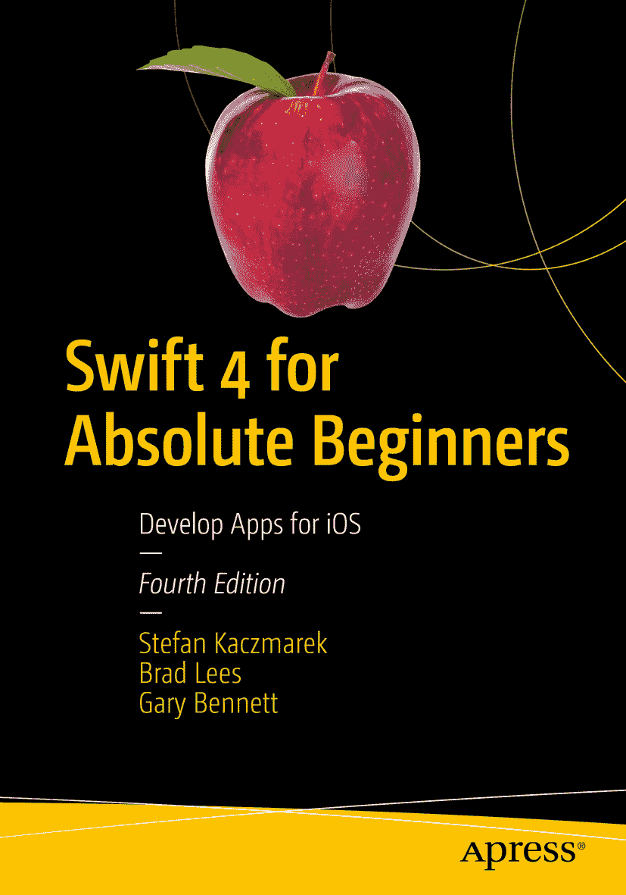

Stefan Kaczmarek、Brad Lees 与 Gary Bennett 合著《零基础学 Swift 4：iOS 应用开发》第 4 版

本书作者引用的任何源代码或其他补充材料，读者均可通过 GitHub 在本书的产品页面（位于 [`www.apress.com/978-1-4842-3062-6`](http://www.apress.com/978-1-4842-3062-6)）获取。如需更详细信息，请访问 [`http://www.apress.com/source-code`](http://www.apress.com/source-code)。ISBN 978-1-4842-3062-6 电子书 ISBN 978-1-4842-3063-3 [`doi.org/10.1007/978-1-4842-3063-3`](https://doi.org/10.1007/978-1-4842-3063-3) 美国国会图书馆控制编号：2017963640 © Stefan Kaczmarek、Brad Lees 与 Gary Bennett 2018 本作品受版权保护。出版商保留所有权利，无论是整体还是部分材料，特别涉及翻译权、重印权、插图再利用权、朗诵权、广播权、微缩胶片复制权或任何其他物理形式的复制权，以及传输或信息存储与检索、电子改编、计算机软件，或目前已知或未来开发的类似或不同方法。本书中可能出现商标名称、标识和图片。我们并非在每次出现商标名称、标识或图片时都使用商标符号，而是仅以编辑方式使用这些名称、标识和图片，以维护商标所有者的权益，无意侵犯商标。本出版物中使用商品名称、商标、服务标记及类似术语（即使未明确标识）不应被视为对其是否受专有权利保护的立场表达。尽管本书中的建议和信息在出版时被认为是真实准确的，但作者、编辑和出版商均不对可能存在的任何错误或遗漏承担法律责任。出版商对本书所含内容不作任何明示或暗示的担保。本书采用无酸纸印刷。通过 Springer Science+Business Media New York（地址：233 Spring Street, 6th Floor, New York, NY 10013）在全球图书贸易中分销。电话：1-800-SPRINGER，传真：(201) 348-4505，电子邮件：orders-ny@springer-sbm.com，或访问 www.springeronline.com。Apress Media, LLC 是一家加州有限责任公司，其唯一成员（所有者）是 Springer Science + Business Media Finance Inc (SSBM Finance Inc)。SSBM Finance Inc 是一家特拉华州公司。

