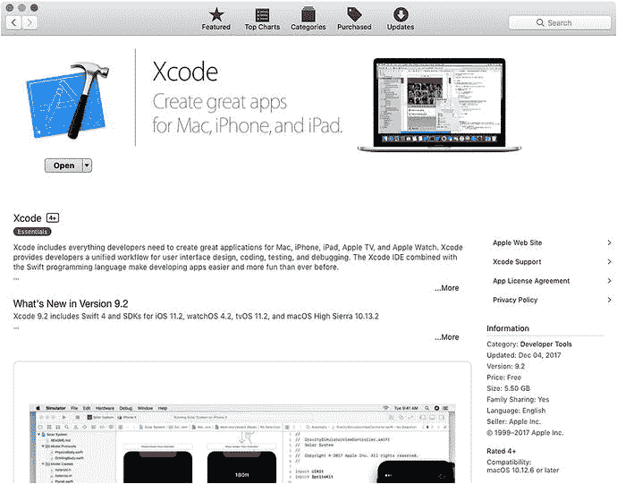
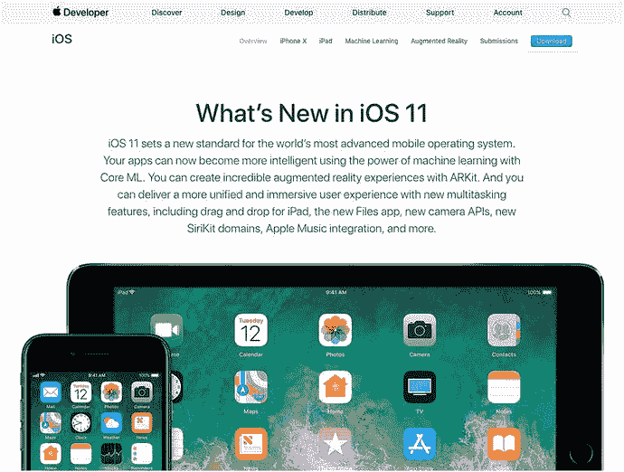
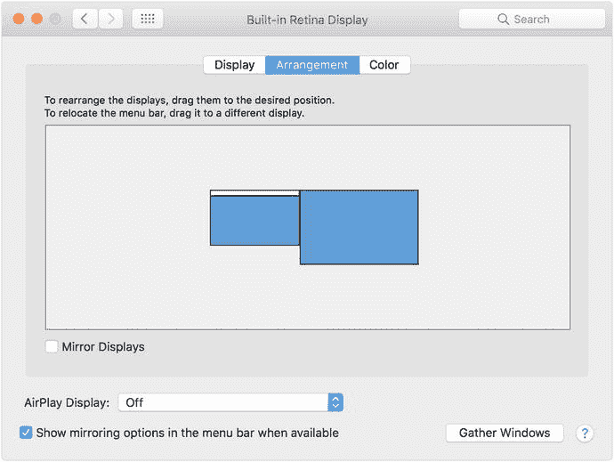
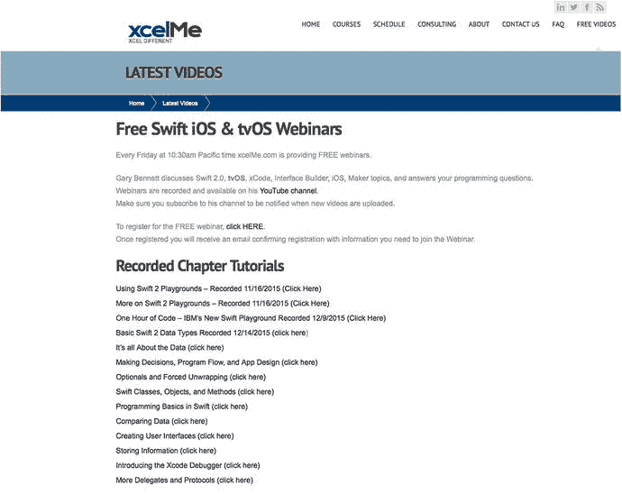
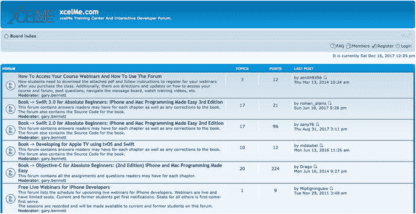

# 所需软件、材料及设备

开发 iOS 应用的一大好处在于，几乎所有开发所需的东西都是免费的。

- `Xcode`
- `Swift`
- `macOS` 10.12.6 或更高版本
- `iOS SDK`
- `iOS Simulator`

你只需要一台 Mac 和知道从哪里下载这些内容即可。我们将在下文中详细介绍。

## 操作系统与集成开发环境

开发 iOS 应用必须在 Mac 上使用 `Xcode`。你可以从 Mac App Store 免费下载 `Xcode`。（见图 1）

图 1. 从 Mac App Store 下载 `Xcode`

### 软件开发工具包

你需要注册成为开发者。可以免费在 [`https://developer.apple.com/ios`](https://developer.apple.com/ios) 完成注册（见图 2）。

当你准备将应用上传至 App Store 时，需要支付每年 99 美元的费用才能发布。

图 2. Apple 开发者网站（编辑注：标题，原因不明，无法应用该样式）

### 双显示器（编辑注：不确定为何此“粗体”格式生效）

我们建议开发者连接第二台显示器。在双独立显示器上，你可以同时单步调试代码、查看输出窗口以及 `iOS Simulator`，非常方便。

Apple 硬件让这变得很简单。只需将第二台显示器插入任何 Mac 的端口（当然要使用正确的适配器），就能让两台显示器独立工作。见图 3。请注意，双显示器并非必需。若没有双显示器，你只需合理排列打开的窗口以适应屏幕即可。

图 3. 在 Mac 上设置双显示器

## 免费在线研讨会、问答环节及 YouTube 视频

我们几乎每周都会举办在线研讨会，讨论书中的某个主题或当前的热门话题。这些研讨会是免费的，你可以在 [`http://www.xcelme.com/latest-videos/`](http://www.xcelme.com/latest-videos/) 进行注册。见图 4。

图 4. Swift 研讨会

每次研讨会结束时，我们会进行问答环节。你可以针对讨论的主题或书中任意主题提问。

此外，所有这些研讨会都会被录制下来并上传至 YouTube。请务必订阅该 YouTube 频道，以便在新视频上传时收到通知。

### 免费书籍论坛

我们在 [`http://forum.xcelme.com`](http://forum.xcelme.com) 为此书建立了一个在线论坛，你可以在学习 Swift 的过程中提问，并获得作者的解答。你还可以找到练习题的答案以及额外的练习题，以帮助你更好地学习。见图 5。

图 5.

