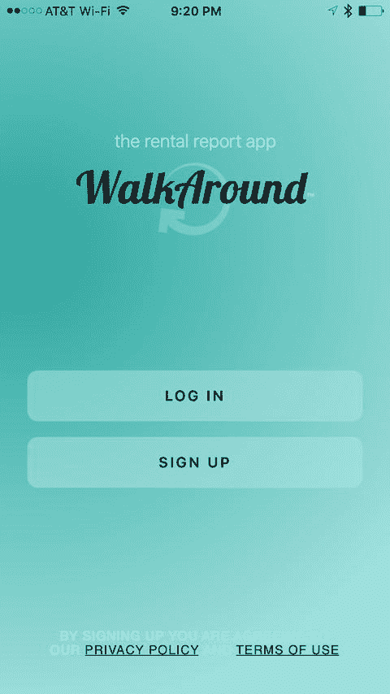
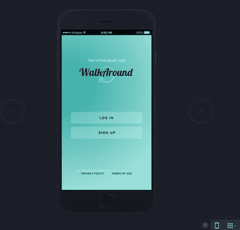

# 成为一名出色的 iOS 开发者

既然你已经准备好成为一名软件开发人员，并且阅读了本书的引言，那么你需要熟悉几个关键概念。你的计算机程序会精确地执行你告诉它的指令——不多也不少。它会遵循由操作系统和 Swift 编程语言定义的编程规则。你的程序不会在意你今天是否心情不好，也不会在意你要求它执行某个操作的次数。通常，你认为你告诉程序要做的事情，和它实际执行的事情，是两回事。

## 成功的关键

如果你还没有读过，请花几分钟时间阅读本书的引言。引言会告诉你如何访问与每章相关的免费网络研讨会、论坛以及 YouTube 视频。此外，你还会更好地理解本书为何使用 Swift Playground 编程环境，以及如何在开发 iOS 应用时取得成功。

根据你的背景，处理这种绝对非黑即白的事情可能会让你感到沮丧。很多时候，编程学生都会抱怨：“这不是我想要它做的！”当你开始在编程中积累经验和信心时，你会开始像程序员一样思考。你将理解软件设计和逻辑，体验让你的程序完全按照你的意愿执行的成就感。

## 像开发者一样思考

软件开发涉及编写计算机程序，然后让计算机执行该程序。计算机程序是你希望计算机执行的一组指令。在开始编写计算机程序之前，列出你希望程序执行步骤的顺序是很有帮助的。这种分步过程被称为**算法**。

如果你想编写一个烤面包片的计算机程序，你首先要编写一个算法。该算法可能如下所示：

1.  从袋子里拿出面包。
2.  将一片面包放入烤面包机。
3.  按下“烤面包”按钮。
4.  等待面包片弹起。
5.  从烤面包机中取出烤好的面包。

乍一看，这个算法似乎解决了问题。然而，该算法遗漏了许多细节，并做出了许多假设。以下是一些例子：

-   用户想要哪种面包？用户想要白面包、全麦面包还是其他种类的面包？
-   用户希望面包烤到什么程度？浅色还是深色？
-   面包烤好后，用户想在面包上放什么：黄油、人造黄油、蜂蜜还是草莓酱？
-   这个算法对所有用户，无论其文化和语言背景，都适用吗？某些文化中可能有另一个表示“烤面包”的词语，或者根本不知道烤面包是什么。

现在，你可能会想，对于一个简单的烤面包程序来说，这未免太详细了。多年来，软件开发一直背负着耗时长、成本高、不符合用户需求的声誉。之所以会有这种名声，是因为计算机程序员经常在还没有彻底思考清楚他们的算法之前就开始编写程序。

制作成功应用的关键要素是**设计需求**。设计需求可以是正式而详细的，也可以简单到像一张纸上的列表。设计需求之所以重要，是因为它们能帮助开发人员在应用开发完成时明确它应该做什么和不应该做什么。设计需求不应由程序员闭门造车，而应通过开发者、用户和客户之间的协作产生。

你成功应用的另一个关键要素是**用户界面**设计。苹果建议你将超过 50% 的整个开发过程时间用于关注 UI 设计。设计可以使用简单的纸和笔，或者使用 Xcode 的 `storyboard` 功能来布局你的屏幕元素。许多软件开发人员从 UI 设计开始，在布局完所有屏幕元素并让众多用户查看纸面原型后，他们根据屏幕布局撰写设计需求。

### 注意

如果你要从本章中带走什么，那就是在开始软件开发之前考虑设计需求和用户界面设计的重要性。这在软件开发周期中是对时间最有效（且成本最低）的运用。使用铅笔和橡皮擦比在开始编程前没有让其他人审阅设计而后来修改代码要容易得多、快得多。

在尽最大努力完善所有设计需求、布局完所有用户界面屏幕、并让客户或潜在用户审阅你的设计并给出反馈之后，你就可以开始编码了。一旦开始编码，设计需求和用户界面屏幕可能会发生变化，但这些变化通常是微小的，并且很容易通过开发过程来适应。参见图 1-1 和图 1-2。

图 1-1 展示了开发前一个租赁报告应用屏幕的纸面原型。在设计需求的同时开发纸面原型屏幕，可以迫使开发人员在编码开始前就考虑到应用程序的许多可用性问题。这有助于缩短应用程序的开发时间，带来更好的用户体验，并在 App Store 上获得更好的评价。图 1-2 展示了租赁报告应用视图完成后的样子。请注意纸面原型工具如何使你能够将应用模型做得与实际效果一模一样。

**图 1-2。** 这是已完成的 iPhone 租赁报告应用。此应用名为 `WalkAround`。

**图 1-1。** 这是开发开始前，iPhone 移动租赁报告应用`登录`屏幕的 UI 纸面原型。此 UI 设计纸面原型是使用 InVision 完成的。

