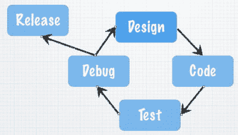

# 完成开发周期

现在你已经掌握了设计需求、用户界面设计，并编写了程序，接下来该做什么？编程之后，你需要确保程序符合设计需求和用户界面设计，同时确认没有任何错误。用编程的术语来说，错误被称为 bug（缺陷）。Bug 是指程序中不希望出现的结果，必须在应用发布到 App Store 之前修复。在程序中查找错误并确保程序满足设计需求的过程称为测试。通常情况下，测试由经验丰富的软件测试方法论专家执行，且此人并非应用的编写者。软件测试通常被称为质量保证（`QA`）。

> **注意：** 当应用准备好提交到 App Store 时，Xcode 会为文件添加 `.app` 或 `.ipa` 扩展名，例如 `appName.app`。这就是为什么 iPhone、iPad 和 Mac 应用程序被称为应用（app）。本书中，程序（program）、应用（application）和应用（app）均指代同一概念。

在测试阶段，开发者需要与 `QA` 人员协作，确定应用为何未能按设计运行。这个过程称为调试。它要求开发者逐步执行程序，找出应用无法按设计工作的原因。图 1-3 展示了完整的软件开发周期。

**图 1-3.** 典型的软件开发周期

在测试和调试过程中，经常需要修改需求（设计），以使应用对客户更易用。完成设计需求和用户界面更改后，整个过程将重新开始。

最终，所有人共同努力开发的应用必须提交到 App Store。关于在周期中的哪个时间点进行提交，需要考虑许多因素：

- 开发成本
- 预算
- 应用的稳定性
- 投资回报率

开发者和管理层之间总会有权衡。开发者希望应用尽善尽美，而管理层希望尽快从投资中获得收益。如果将发布日期交给开发者决定，应用可能永远不会提交到 App Store。开发者会一直不断调整应用，使其更快、更高效、更易用。然而，总有一个时刻，代码必须从开发者手中“撬”出来，上传到 App Store，以便实现其应有的使命。

