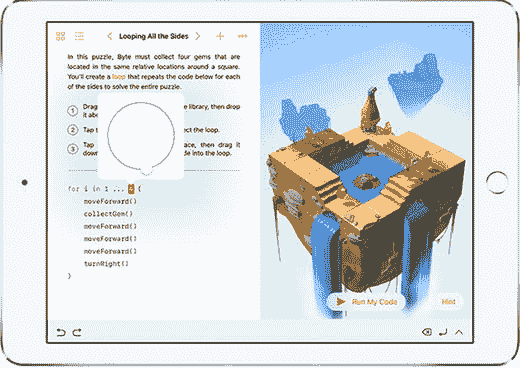
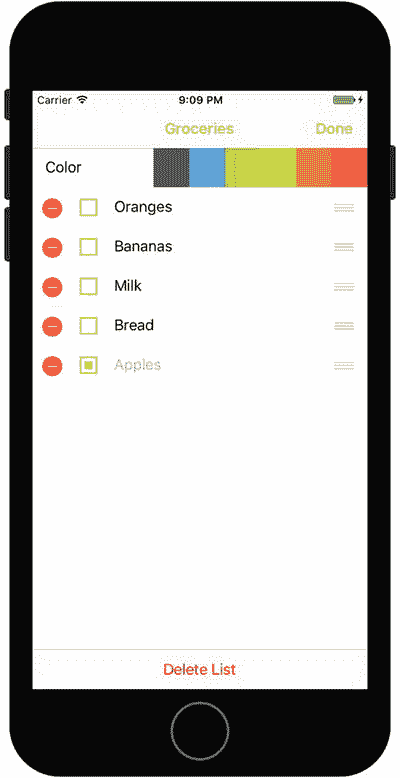

# 介绍面向对象编程

正如引言中详细讨论的，Playground 让你能够专注于面向对象编程（`OOP`），而无需一次性掌握所有 Swift 编程语法和复杂的 Xcode 开发环境。相反，你可以专注于学习 `OOP` 的基本原则，并快速运用这些原则编写你的第一个程序。

几十年来，开发者一直在寻找更好的方法来编写可重用、可管理且在项目生命周期内易于维护的代码。`OOP` 旨在帮助实现代码重用性和可维护性，同时降低软件开发成本。

`OOP` 可以被视为程序中对象的集合。对这些对象执行操作，以实现设计需求。

对象是任何可以被操作的事物。例如，飞机、人或 iPad 上的屏幕/视图都可以是对象。你可能希望操作飞机使其倾斜转弯，希望让人行走，或者希望改变 iPad 上应用屏幕的颜色。



**图 1-4.** 此 Playground 视图中有多个对象

在你完成每一行代码时，Playground 就会执行该行代码，如图 1-4 所示。当你运行 Playground 应用时，用户可以对应用中的对象应用操作。Xcode 是一个集成开发环境（`IDE`），让你能够在编程环境中运行应用。你可以先在电脑上测试应用，然后在 iOS 设备上运行，方法是使用 Xcode 的模拟器运行应用，如图 1-5 所示。



**图 1-5.** 这个示例 iPhone 应用包含一个表格对象，用于组织购物清单。可以对对象应用诸如“向左旋转”或“用户选择了第 3 行”之类的操作。

对对象执行的操作称为方法。方法操纵对象以实现你希望应用完成的任务。例如，对于一个 `jet` 对象，你可能有以下方法：

```
goUp
goDown
bankLeft
turnOnAfterburners
lowerLandingGear
```

图 1-5 中的 `table` 对象在程序中实际上被称为 `UITableView`，它可能具有以下方法：

```
numberOfRowsInSection
cellForRowAtIndexPath
canEditRowAtIndexPath
commitEditingStyle
didSelectRowAtIndexPath
```

大多数对象具有描述这些对象的数据。这些数据被定义为属性。每个属性以特定方式描述关联的对象。例如，`jet` 对象的属性可能如下：

```
altitude = 10,000 feet
heading = North
speed = 500 knots
pitch = 10 degrees
yaw = 20 degrees
latitude = 33.575776
longitude = -111.875766
```

对于图 1-5 中的 `UITableView` 对象，其属性可能如下：

```
backgroundColor = White
selectedRow = 3
animateView = No
```

对象的属性可以在程序运行时的任何时刻更改，无论是用户与应用交互时，还是程序员为实现设计需求而设计应用时。在特定时刻，对象属性中存储的值统称为对象的状态。

状态是计算机编程中的一个重要概念。在教授学生有关状态的知识时，我们让他们走到窗边，在天空中找一架飞机。然后我们让他们打个响指，并想象该飞机在那特定时刻可能具有的一些属性值。这些值可能如下：

```
altitude = 10,000 feet
latitude = 33.575776
longitude = -111.875766
```

这些值代表了对象在打响指那一特定时刻的状态。

等待几分钟后，我们让学生找到同一架飞机，再次打响指，并记录飞机在那个特定时间点可能的状态。

此时属性的值可能如下所示：

```
altitude = 10,500 feet
latitude = 33.575665
longitude = -111.875777
```

注意对象的状态如何随时间变化。

