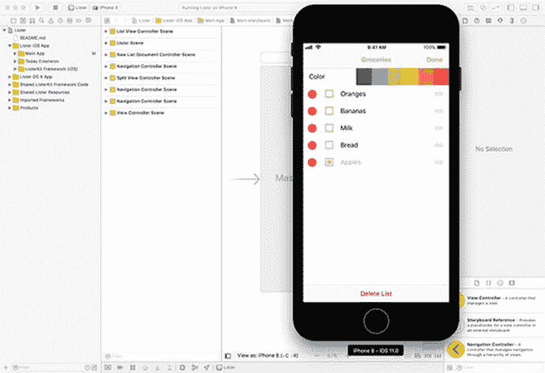

# 使用 Playground 界面

Playground 提供了一种极好的方式来应用刚刚讨论的概念，而无需同时学习 Xcode 和 Swift 语言的所有复杂性。你只需花几分钟熟悉 Playground 界面，就可以开始编写程序。

从技术上讲，Playground 界面并不是像你用来编写 iOS 应用那样的真正 `IDE`，但它非常接近，并且学起来容易得多。真正的 `IDE` 将代码开发、用户界面布局、调试工具、文档以及模拟器/控制台启动整合到单个应用中，如图 1-6 所示。然而，Playground 在视觉、感觉和功能上与你用来开发应用的 Xcode `IDE` 非常相似。

**图 1-6.** 带有 iPhone 模拟器的 Xcode IDE

在下一章中，你将逐步了解 Playground 界面并编写你的第一个程序。

## 总结

恭喜你，你已经完成了本书的第一章。理解以下术语至关重要，因为本书后续内容将不断强化这些概念：

- 计算机程序
- 算法
- 设计要求
- 用户界面
- Bug（程序错误）
- 质量保证（QA）
- 调试
- 面向对象编程（OOP）
- 对象
- 属性
- 方法
- 对象的状态
- 集成开发环境（IDE）

## 下一章节

剩余章节将提供你学习 Swift 和编写 iOS 应用所需的信息。术语和概念会反复出现并不断强化，因此你会逐渐熟悉它们。请坚持下去，对自己保持耐心。

## 练习题

- 回答以下问题：
  - 为什么在用户需求上花费时间如此重要？
  - 设计要求和算法有什么区别？
  - 方法和属性有什么区别？
  - 什么是 Bug？
  - 什么是状态？
- 编写一个自动售货机的算法，描述从投入硬币到汽水售出的整个过程。假设每瓶汽水的价格为 80 美分。
- 为一个用于操控自动售货机的应用编写设计要求。

