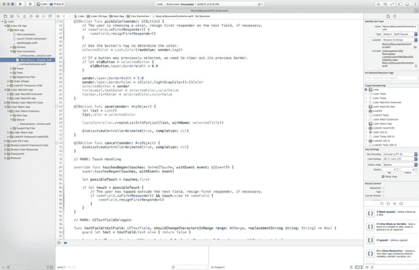
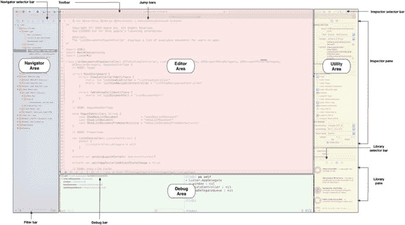
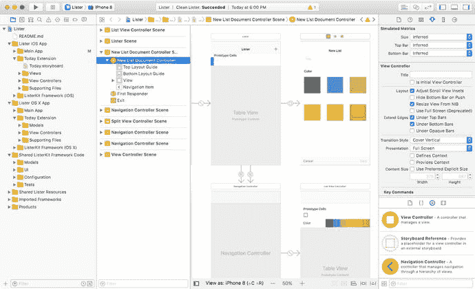
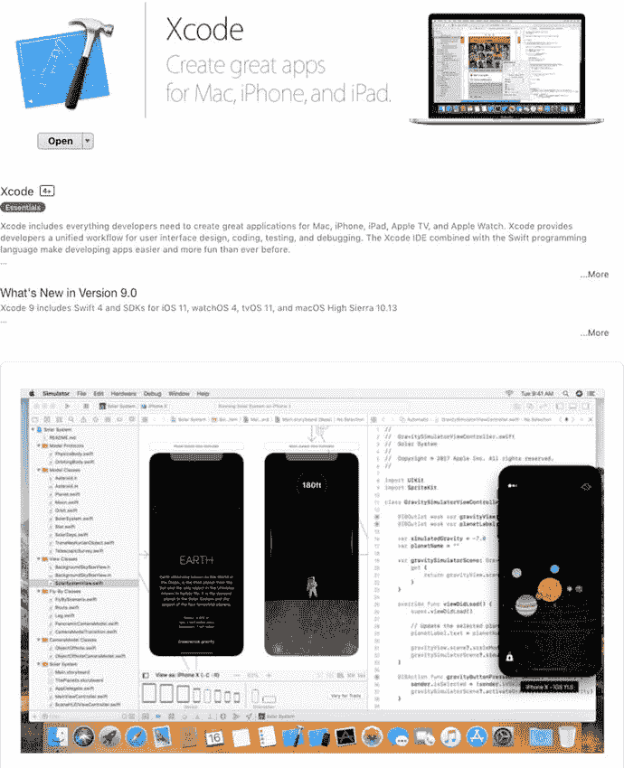
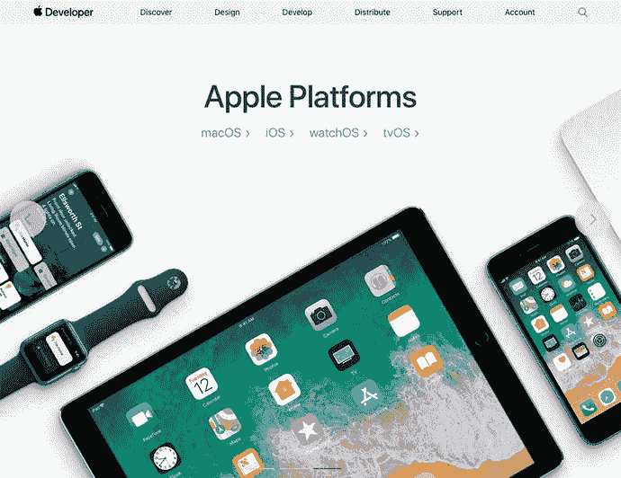
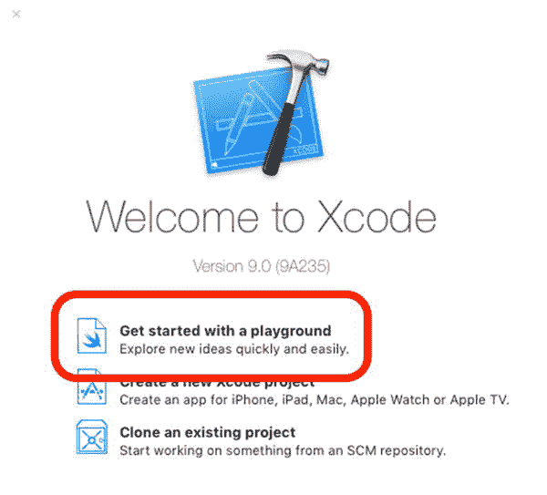
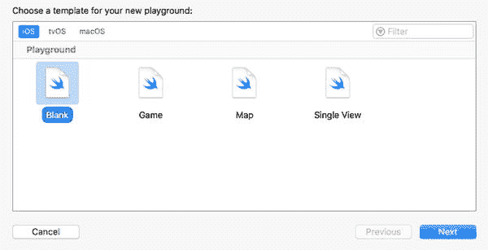
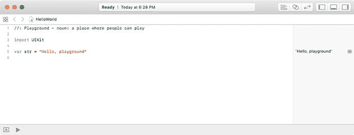
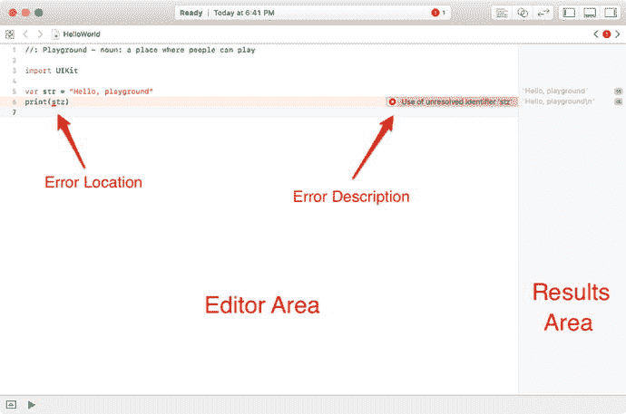
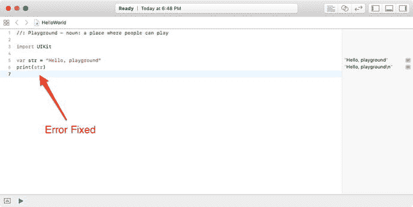

# 2. 编程基础

本章重点介绍成为一名优秀 Swift 程序员所必备的基础知识。本章涵盖如何使用 Playground 用户界面、如何编写你的第一个 Swift 程序，以及如何使用 Xcode 集成开发环境（IDE）。

> 注：我们将向你介绍如何使用 Playground，它能让你立即开始编程，而无需担心 Xcode 项目的所有复杂性。我们采用这种方式是为了帮助你快速掌握概念，避免挫败感，并为你打下坚实的基础。

## Xcode 漫游

Xcode 中的 Playground 让编写 Swift 代码变得极其简单且有趣。输入一行代码，结果会立即显示。如果你的代码需要运行一段时间（例如在循环或分支中），你可以在时间线区域观察其进度。在 Playground 中完成代码后，你可以轻松地将代码迁移到 Swift iOS 项目中。借助 Xcode Playground，你可以实现以下操作：

- 设计或修改算法，并实时观察每一步的结果
- 创建新的测试，在将其纳入测试套件之前验证其有效性

首先，你需要进一步了解 Xcode 用户界面。当你打开一个 Xcode iOS 项目时，你会看到如图 2-1 所示的界面。

Xcode 用户界面旨在帮助你高效编写 Swift 应用。该用户界面还能帮助新程序员学习 iOS 应用的用户界面。接下来，你将探索 Xcode 的 IDE 工作区和 Playground 的主要区域。



### 探索工作区窗口

工作区窗口（如图 2-2 所示）允许你打开和关闭文件、设置应用偏好、开发和编辑应用，以及查看文本输出和错误控制台。

工作区窗口是你创建和管理项目的主要界面。它会自动适应当前的任务，并且你可以进一步配置窗口以适应你的工作风格。你可以根据需要打开多个工作区窗口。



工作区窗口包含四个主要区域：编辑器、导航器、调试区和实用工具区。

当你选择一个项目文件时，其内容会出现在编辑器区域，Xcode 会在相应的编辑器中打开该文件。

你可以通过工具栏中视图选择器的按钮来隐藏或显示其他三个区域。这些按钮位于窗口的右上角。

-  单击此按钮可显示或隐藏导航器区域。在这里，你可以查看和浏览项目中的文件及其他方面。
-  单击此按钮可显示或隐藏调试区域。在这里，你可以控制程序执行并调试代码。
-  单击此按钮可显示或隐藏实用工具区域。实用工具区域有多种用途，最常见的是查看和修改文件的属性，以及向项目中添加现成的资源。

### 导航工作区

你可以从导航器区域访问项目中的文件、符号、单元测试、诊断信息及其他功能。在导航器选择栏中，你可以选择适合当前任务的导航器。每个导航器的内容区域都能让你访问项目中相关的部分，而每个导航器的过滤栏则允许你限制显示的内容。

在导航器选择栏中，可以选择以下选项：

-  **项目导航器。** 添加、删除、分组和管理项目中的文件；或选择文件在编辑器区域中查看或编辑其内容。
-  **源代码管理导航器。** 当你使用版本控制系统（VCS）（如 Git 或 Subversion (SVN)）时，查看对项目文件所做的详细更改历史。
-  **符号导航器。** 浏览项目中的类层次结构。
-  **查找导航器。** 使用搜索选项和过滤器快速查找项目中的文本。
-  **问题导航器。** 查看在打开、分析和构建项目时发现的诊断信息、警告和错误等问题。
-  **测试导航器。** 创建、管理、运行和审查单元测试。
-  **调试导航器。** 在程序执行期间的指定时间点检查正在运行的线程及相关的堆栈信息。
-  **断点导航器。** 通过指定触发条件等特性来微调断点，并在一处查看项目中所有的断点。
-  **报告导航器。** 查看构建历史记录。


### 编辑项目文件

在 Xcode 中，大部分开发工作都在编辑区进行。编辑区是工作区窗口中始终可见的主要区域。你最常使用的编辑器如下：

- **源代码编辑器**：编写和编辑 Swift 源代码。
- **界面构建器**：以图形化方式创建和编辑用户界面文件（参见图 2-3）。
- **项目编辑器**：查看和编辑应用的构建方式，例如指定构建选项、目标架构和应用程序授权。

当你选中某个文件时，Xcode 会在相应的编辑器中打开该文件。在图 2-3 中，`Main.storyboard` 文件在项目导航器中处于选中状态，并且在界面构建器中打开。



图 2-3. Xcode 的界面构建器展示一个故事板文件

编辑器提供了三个控件：

-  点击此按钮可打开**标准编辑器**。你将看到单个编辑器窗格，其中包含所选文件的内容。
-  点击此按钮可打开**辅助编辑器**。你将看到一个独立的编辑器窗格，其内容与标准编辑器窗格中的内容在逻辑上相关。
-  点击此按钮可打开**版本编辑器**。你将看到一个窗格中显示所选文件与另一窗格中同一文件的另一个版本之间的差异。通常在处理源代码控制时使用。

## 创建你的第一个 Swift Playground 程序

既然你已经对 Xcode 有了一些了解，那么是时候编写你的第一个 Swift playground 程序，并开始理解 Swift 语言、Xcode 以及一些语法知识了。首先，你需要安装 Xcode。

### 安装并启动 Xcode 9

Xcode 9 可从 Mac App Store 免费下载，如图 2-4 所示。



图 2-4. Xcode 9 可从 Mac App Store 免费下载

> **注意**
> 此软件包包含编写 iOS、watchOS、tvOS 和 macOS 应用所需的一切。要将应用发布到 iOS 或 macOS App Store，你需要申请 Apple Developer Program，并在准备提交时支付 $99 美元。

图 2-5 展示了 Apple Developer Program 网站 `https://developer.apple.com/`。



图 2-5. Apple Developer Program

现在，你已经安装了 Xcode，让我们开始编写一个 Swift playground。

启动 Xcode，然后点击“Get started with a playground”，如图 2-6 所示。



图 2-6. 创建你的第一个 Swift playground

### 使用 Xcode 9

在新建的 Xcode 窗口打开后，请按照以下步骤操作：



图 2-7. 选择空白的 iOS playground 模板

1.  选择 **Blank iOS** 模板，然后点击 Next，如图 2-7 所示。
2.  将 playground 命名为 `HelloWorld`，并在你选择的文件夹中创建它，例如 `Documents` 文件夹或 `Desktop`（桌面）。

Xcode 为你做了大量工作，并创建了一个包含可供使用代码的 playground 文件。同时，它还会在你的 Xcode 编辑器中打开该 playground 文件，以便你开始操作，如图 2-8 所示。



图 2-8. Playground 窗口

现在，你需要熟悉 Xcode playground IDE。让我们来看看两个最常用的功能：

- 编辑区
- 结果区

## Xcode Playground IDE：编辑区和结果区

编辑区是 Xcode playground IDE 的核心部分——是你将梦想变为现实的地方。这是你编写代码的地方。当你编写代码时，你会注意到代码颜色会发生变化。有时，Xcode 甚至会尝试为你自动补全单词。这些颜色具有特定含义，当你使用 IDE 时会逐渐明了。编辑区也是你调试代码的地方。

> **注意**
> 即使我们已经提过，但值得再说一遍：通过阅读本书，你将学习 Swift 编程，但真正学会 Swift 是通过编写和调试你的代码。调试正是开发者学习并成为优秀开发者的途径。

让我们添加一行代码，来体验一下 Swift playground 的强大之处。在文件的末尾，第 6 行，添加以下代码：

```swift
print(str)
```

一旦你输入这行代码，Xcode 会自动执行该行并显示结果 `"Hello, playground\n"`。

当你编写 Swift 代码时，一切都很重要——逗号、大小写和括号。使编译器能够将代码编译为可执行应用程序的一系列规则被称为语法。

第 5 行创建了一个名为 `str` 的字符串变量，并将 `"Hello, playground"` 赋值给该变量。

第 6 行将 `str` 字符串变量打印到**结果区**。

让我们通过将第 6 行改为 `print(stz)` 来创建一个语法错误，如下面的图 2-9 所示。



图 2-9. 被 Swift 编译器捕获到语法错误的 Playground

在 Swift 中，`print` 是一个函数，它会将其参数的内容打印到结果区。当你输入代码时，结果区会自动更新，显示你输入的每行代码的结果。

现在，让我们通过正确拼写 `str` 变量来修复这个应用，如图 2-10 所示。



图 2-10. 语法错误已修复

欢迎随意尝试并更改要打印的文本。你可能想添加多个变量，或者将两个字符串拼接在一起。尽情享受吧！

## 总结

在本章中，你构建了第一个基本的 Swift playground。我们还介绍了一些新的 Xcode 术语，这些术语对于你理解 Swift 至关重要。

> **成功关键**
> 正如本书引言中提到的，你可以访问 `http://www.xcelme.com/`，然后点击 “Free Videos” 标签，观看与本章相关的视频。这些视频将帮助你更深入地理解 Xcode、IDE 和 playground。另外，也可以访问 `http://forum.xcelme.com/` 来提出关于这些概念的问题。

你应该理解以下概念：

- Playground
- 编辑区
- 结果区

**练习**

- 扩展你的 playground，添加一行打印你所选任意文本的代码。

