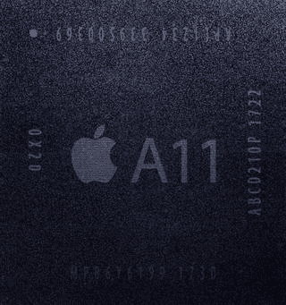
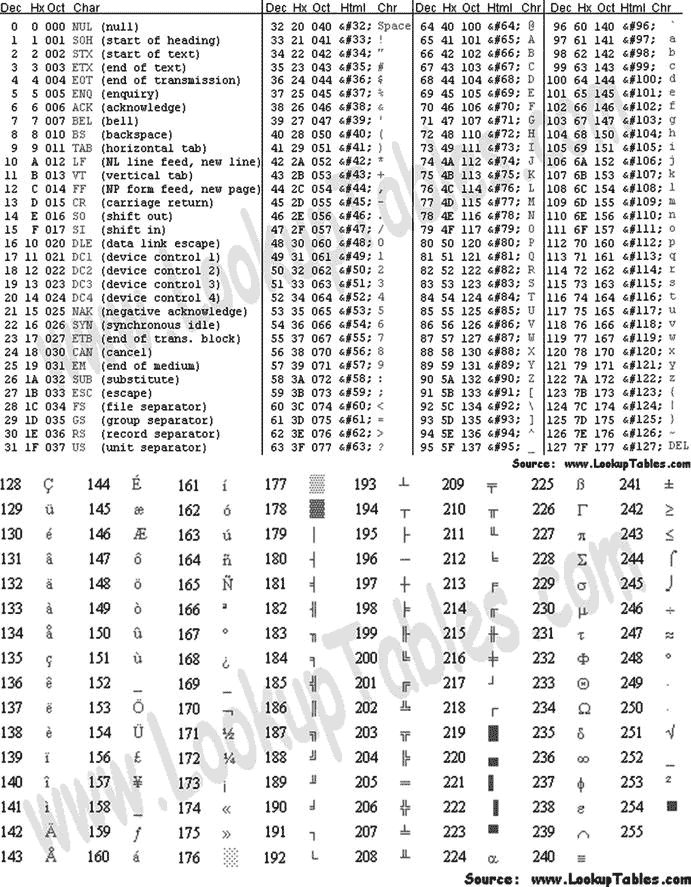

# 3. 一切都与数据有关

你可能知道，数据在计算机内存中以零和一的形式存储。然而，零和一对于开发者或应用用户来说不太实用，因此你需要了解程序如何使用数据，以及如何处理这些存储的数据。

在本章中，你将了解数据如何在计算机上存储，以及如何操作这些数据。然后，你将使用 playgrounds 来进一步了解数据存储。

## 编程中使用的数制

计算机处理信息的方式与人类不同。本节将介绍诸如你的 iPhone 和 iPad 等设备存储、计数和操作信息的各种方式。

### 位

位被定义为计算机用于存储和处理数据的基本信息单位。一个位的值为 0 或 1。在计算机刚问世时，晶体管和微处理器还不存在。数据通过真空管的开或关来操作和存储。如果真空管开启，则该位的值为 1；如果真空管关闭，则该位的值为 0。计算机能够存储和处理的数据量直接与其拥有的真空管数量有关。

公认的第一台计算机被称为电子数值积分与计算机（ENIAC）。它占地超过 136 平方米，拥有 18,000 个真空管。其性能大约相当于你现在的手持计算器。

如今，计算机使用晶体管来存储和处理数据。计算机处理器的性能取决于其芯片或 CPU 上放置的晶体管数量。与真空管一样，晶体管也有关闭或开启两种状态。当晶体管关闭时，其值为 0；如果晶体管开启，其值为 1。在撰写本文时，为 iPhone 8、iPhone 8 Plus 和 iPhone X 提供动力的苹果 A11 仿生处理器是一款 6 核 ARM 处理器，拥有约 43 亿个晶体管，而初代 iPad 的 A4 处理器仅有 1.49 亿个晶体管。图 3-1 展示了苹果最新的 iPhone 处理器 A11 仿生。

**图 3-1.** 苹果专有的 A11 仿生处理器

#### 摩尔定律

你 iPhone 或 iPad 处理器中的晶体管数量，直接关系到你设备的处理速度、图形性能、内存容量以及设备可用的传感器（加速度计、陀螺仪）。晶体管越多，你的设备就越强大。

1965 年，英特尔联合创始人戈登·摩尔描述了处理器中晶体管的趋势。他观察到，从 1958 年到 1965 年，处理器中的晶体管数量每 18 个月翻一番，并且很可能“至少在未来 18 个月”会继续如此。这一观察结果即广为人知的摩尔定律，并且在超过 55 年的时间里被证明是准确的。

> **注：** 摩尔定律也有其负面影响，你可能已经在钱包里感受到了。处理能力快速提升带来的问题是它很快会让技术过时。因此，当你的 iPhone 两年合约到期时，市场上新 iPhone 的性能将是你签约时那部 iPhone 的两倍。这对大家来说多方便啊！

### 字节

字节是用于描述计算机信息存储的另一个单位。一个字节由八个位组成。一个位最多可以表示两个不同的值，而一个字节最多可以表示 2⁸ 个不同的值，即 256 个值。一个字节可以包含从 0 到 255 的值。

二进制数字系统表示数字符号 0 和 1。为了说明数字 71 在二进制中如何表示，你可以使用一个包含八个位（1 字节）的简单表格，其中每个位都表示为 2 的幂。要将字节值 `01000111` 转换为十进制，只需将开启的位相加，如表 3-1 所示。

**表 3-1.** 数字 71 按字节表示（64 + 4 + 2 + 1）

| 2 的幂 | 2⁷ | 2⁶ | 2⁵ | 2⁴ | 2³ | 2² | 2¹ | 2⁰ |
| --- | --- | --- | --- | --- | --- | --- | --- | --- |
| “开启”位的值 | 128 | 64 | 32 | 16 | 8 | 4 | 2 | 1 |
| 实际位 | 0 | 1 | 0 | 0 | 0 | 1 | 1 | 1 |

为了表示二进制中的数字 22，开启加起来等于 22 的位，即 `00010110`，如表 3-2 所示。

**表 3-2.** 数字 22 按字节表示（16 + 4 + 2）

| 2 的幂 | 2⁷ | 2⁶ | 2⁵ | 2⁴ | 2³ | 2² | 2¹ | 2⁰ |
| --- | --- | --- | --- | --- | --- | --- | --- | --- |
| “开启”位的值 | 128 | 64 | 32 | 16 | 8 | 4 | 2 | 1 |
| 实际位 | 0 | 0 | 0 | 1 | 0 | 1 | 1 | 0 |

为了表示二进制中的数字 255，开启加起来等于 255 的位，即 `11111111`，如表 3-3 所示。

**表 3-3.** 数字 255 按字节表示（128 + 64 + 32 + 16 + 8 + 4 + 2 + 1）

| 2 的幂 | 2⁷ | 2⁶ | 2⁵ | 2⁴ | 2³ | 2² | 2¹ | 2⁰ |
| --- | --- | --- | --- | --- | --- | --- | --- | --- |
| “开启”位的值 | 128 | 64 | 32 | 16 | 8 | 4 | 2 | 1 |
| 实际位 | 1 | 1 | 1 | 1 | 1 | 1 | 1 | 1 |

为了表示二进制中的数字 0，开启加起来等于 0 的位，即 `00000000`，如表 3-4 所示。

**表 3-4.** 数字 0 按字节表示

| 2 的幂 | 2⁷ | 2⁶ | 2⁵ | 2⁴ | 2³ | 2² | 2¹ | 2⁰ |
| --- | --- | --- | --- | --- | --- | --- | --- | --- |
| “开启”位的值 | 128 | 64 | 32 | 16 | 8 | 4 | 2 | 1 |
| 实际位 | 0 | 0 | 0 | 0 | 0 | 0 | 0 | 0 |

### 十六进制

通常，有必要用计算机识别的另一种格式来表示字符，即十六进制格式。十六进制格式本质上是二进制的“压缩”版本，其中不是用八个字符来表示一个字节（八个位），而是可以使用两个字符，例如 `00` 或 `2A` 或 `FF`。当你调试应用程序时，会遇到十六进制数字。十六进制系统是一种基数为 16 的数字系统。它使用 16 个不同的符号：0 到 9 表示值 0 到 9，A 到 F 表示值 10 到 15。例如，十六进制数字 `2AF3` 在十进制中等于 (2 × 16³) + (10 × 16²) + (15 × 16¹) + (3 × 16⁰)，即 10,995。你可以在程序员模式下使用 Mac 计算器应用程序，看看十六进制如何与十进制和二进制相关联。

图 3-2 展示了 ASCII 字符表。因为一个字节可以表示 256 个字符，这对于西方字符来说效果很好。例如，十六进制 `20` 表示空格。十六进制 `7D` 表示右花括号（`}`）。你也可以通过在程序员模式下使用 Mac 计算器应用程序看到这一点，因为它可以将数值转换为 ASCII。

**图 3-2.** ASCII 字符

### Unicode

使用一个字节表示字符的体系在计算机中一直运作良好，直到大约 1990 年代，个人电脑在语言字符超过 256 个的非西方国家被广泛采用。Unicode 不使用单字节字符集，而是可以拥有多达四字节的字符集。

为了促进更快速的采用，Unicode 的前 256 个码点与 ASCII 字符表相同。Unicode 可以有不同的字符编码。西方文本最常用的编码是 UTF-8。“8”表示每个字符使用的位数，因此它是每个字符一个字节，就像 ASCII 一样。

作为 iPhone 开发者，你可能会最常使用这种字符编码。

