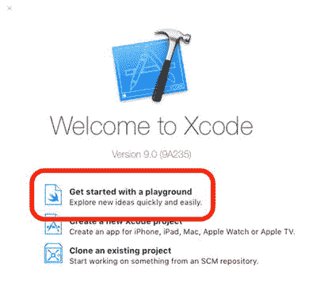
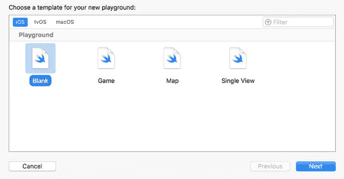
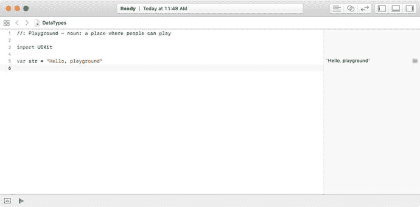
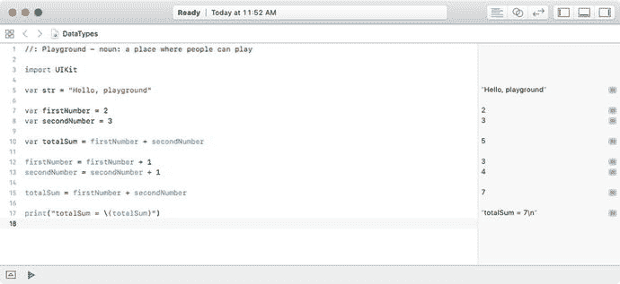
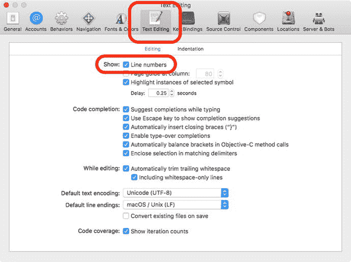

# 在 Playground 中使用变量

现在你已经了解了数据类型，让我们在一个 playground 中编写代码，实现两个数相加并显示总和。

1.  打开 `Xcode`，并选择“开始使用 playground”，如图 3-3 所示。

    

    图 3-3. 创建一个 Playground

2.  选择一个空白的 iOS 模板，然后点击“下一步”，如图 3-4 所示。最后，将你的 playground 命名为 `DataTypes`，并点击“创建”。

    

    图 3-4. 选择空白的 iOS Playground 模板

3.  当你的 playground 创建完成后，其中已经预先放置了两行代码，如图 3-5 所示。

    

    图 3-5. 两行代码

4.  向这个 playground 中添加如下代码，如代码清单 3-3 所示。

    ```
    1 //: Playground - noun: a place where people can play
    3 import UIKit
    5 var str = "Hello, playground"
    7 var firstNumber = 2
    8 var secondNumber = 3
    10 var totalSum = firstNumber + secondNumber
    12 firstNumber = firstNumber + 1
    13 secondNumber = secondNumber + 1
    15 totalSum = firstNumber + secondNumber
    18 print("totalSum = \(totalSum)")
    ```

    代码清单 3-3. Playground 加法演示

你的 playground 应该如图 3-6 所示。

Playgrounds 的一个巧妙特性是，当你输入代码时，Swift 会立即执行你输入的每一行代码，因此你可以马上看到结果。



图 3-6. 显示 Swift 代码结果的 Playground

在 Swift 编程中使用的 `//` 使程序员可以为代码添加注释。注释不会被应用程序编译，它们作为程序员的笔记，或者更重要的是，作为后续开发人员的参考。注释有助于原始开发者和后来的开发者理解应用程序的开发方式。

有时，注释可能需要跨越多行，或仅覆盖一行中的部分内容。这可以通过 `/*` 和 `*/` 来实现。`/*` 和 `*/` 之间的所有文本都被视为注释，不会被编译。

`print` 是一个函数，它可以接受一个参数并打印其内容。

**注意**：如果你的编辑器的菜单或装订线（包含程序行号的左列）与之前的截图不同，你可以在 `Xcode` 偏好设置中开启这些设置。你可以通过点击菜单栏中的 `Xcode` 菜单，然后选择“偏好设置”来打开 `Xcode` 偏好设置。参见图 3-7。



图 3-7. 为装订线添加行号

## 总结

在本章中，你学习了应用程序如何使用数据。你了解了如何初始化变量以及如何向它们赋值。我们解释了变量在声明时会关联一个数据类型，并且只有相同类型的数据才能赋值给变量。我们还讨论了变量与常量之间的区别，并介绍了可选类型。

在下一章中，我们将探讨如何使用布尔逻辑来控制应用程序中的数据流。

## 练习

* 在 Swift playground 中编写代码，将两个整数相乘并显示结果。
* 在 Swift playground 中编写代码，计算一个浮点数的平方并显示结果浮点数。
* 在 Swift playground 中编写代码，将两个浮点数相减，并将结果存储为整数。请注意，不会进行四舍五入。

