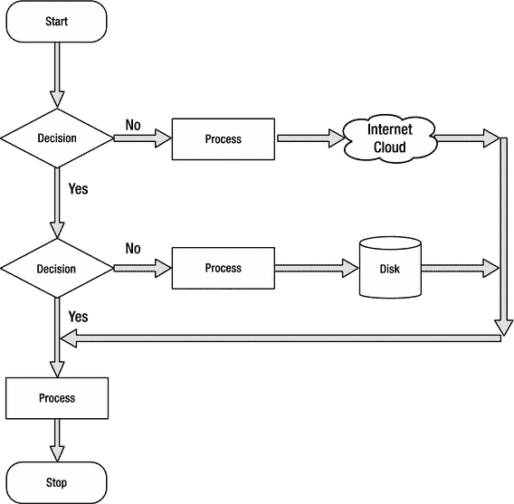
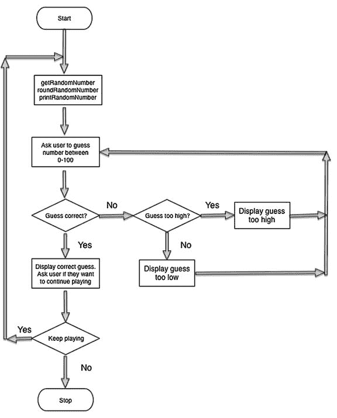

# 设计应用

既然我们已经介绍了布尔逻辑和比较运算符，你就可以开始设计应用了。有时，无需编写实际代码，向他人表达应用的全部或部分功能也是非常重要的。

编写伪代码有助于开发者理清思路，并与其他开发者就关注的代码段进行头脑风暴。这有助于在编码开始前分析问题并寻找可能的解决方案。


### 伪代码

伪代码是指以高级方式描述待求解算法的代码。伪代码不包含编程所需的语法规范，但它能表达解决当前问题所必需的算法逻辑。

你可以在纸上（或白板上）手写伪代码，也可以在电脑上录入。

使用伪代码时，你可以运用关于布尔数据类型、真值表以及比较运算符的知识。请参考清单 4-1 中的伪代码示例。

> **注意**  
> 伪代码用于表述和传授编程思路。伪代码无法实际运行！

```
x = 5
y = 6
isComplete = TRUE
if x < y
{
// 在此示例中，x 小于 6
执行相应操作
}
else
{
执行其他操作
}
if isComplete == TRUE
{
// 在此示例中，isComplete 等于 TRUE
执行相应操作
}
else
{
执行其他操作
}
// 另一种判断 isComplete == TRUE 的方式
if isComplete
{
// 在此示例中，isComplete 为 TRUE
执行相应操作
}
// 两种判断值为 false 的方式
if isComplete == FALSE
{
执行相应操作
}
else
{
// 在此示例中，isComplete 为 TRUE，因此将执行 else 代码块
执行其他操作
}
// 另一种判断 isComplete == FALSE 的方式
if !isComplete
{
执行相应操作
}
else
{
// 在此示例中，isComplete 为 TRUE，因此将执行 else 代码块
执行其他操作
}
清单 4-1.
在 if-then-else 代码中使用条件运算符的伪代码示例
```

请注意，`!` 会反转其作用的布尔值，因此使用 `!` 会将 `TRUE` 变为 `FALSE`，将 `FALSE` 变为 `TRUE`。这是 Swift 中的逻辑非运算符。

通常，我们需要组合使用比较测试。复合关系测试是指由 `&&` 或 `||`（两个管道符）连接的一个或多个简单关系测试。

在 Swift 中，`&&` 和 `||` 分别代表逻辑与和逻辑或。清单 4-2 中的伪代码演示了逻辑与和逻辑或运算符的使用。

```
x = 5
y = 6
isComplete = TRUE
// 使用逻辑与
if x < y && isComplete == TRUE
{
// 在此示例中，x 小于 6 且 isComplete == TRUE
执行相应操作
}
if x < y || isComplete == FALSE
{
// 在此示例中，x 小于 6。
// 对于逻辑或，只需一个操作数为 TRUE 即可使结果为 TRUE。
// 参见表 4–2 逻辑或真值表
执行相应操作
}
// 另一种判断 TRUE 的方式
if x < y && isComplete
{
// 在此示例中，x 小于 6 且 isComplete == TRUE
执行相应操作
}
// 另一种判断 FALSE 的方式
if x < y && !isComplete
{
执行相应操作
}
else
{
// isComplete == TRUE
执行其他操作
}
清单 4-2.
使用 && 和 || 逻辑运算符的伪代码
```

### 可选值与强制解包

第 3 章介绍了可选值。可选值是指可能不包含值的变量。由于可选值可能不含值，因此在访问它们之前需要进行检查。

首先，通过 `if` 语句将可选值与 `nil` 进行比较，以判断该可选值是否包含值。如果可选值有值，则视为“不等于” `nil`，如清单 4-3 所示。

清单 4-3 中的第 4 行检查可选变量是否不等于 `nil`。在此示例中，`someInteger` 的值不存在，等于 `nil`，因此执行第 8 行的代码。

```
1 var myString = "Hello world"
2 let someInteger = Int(myString)
3 // someInteger 的值现在不存在
4 if someInteger != nil {
5     print("someInteger 包含一个整数值。")
6 }
7 else {
8     print("someInteger 不包含整数值。")
9 }
清单 4-3.
检查可选值是否包含值
```

现在你已经添加了检查来确认可选值是否包含值，可以通过在可选值名称末尾添加感叹号（`!`）来访问其值。这里的 `!` 表示你已经检查过并确认可选变量有值，现在要使用它。这被称为强制解包可选值。参见清单 4-4。

```
1 var myString = "42"
2 let someInteger = Int(myString)
3 // someInteger 包含一个值
4 if someInteger != nil {
5     print("someInteger 包含一个值。这里是：\(someInteger!)")
6 }
7 else {
8     print("someInteger 不包含整数值。")
9 }
清单 4-4.
强制解包
```

> **注意**  
> 在 `print` 函数中显示变量的内容是通过 `\()` 实现的。

#### 可选绑定

你可以通过一个操作同时判断可选值是否包含值，并在包含值时将该值赋给一个临时常量或变量。（参见清单 4-5。）这称为可选绑定。可选绑定可用于 `if` 和 `while` 语句中，以判断可选值是否有值，并在有值时将值提取到常量或变量中。

```
1 let someOptional: String? = "hello world"
2 if let constantName = someOptional {
3     print("constantName 包含一个值，这里是：\(constantName)")
4 }
清单 4-5.
可选绑定语法（绑定到常量）
```

如果希望将可选值赋值给一个变量以便操作该变量，你可以将可选值赋值给 `var`，如清单 4-6 所示。

```
1 let someOptional: String? = "hello world"
2 if var variableName = someOptional {
3     variableName += "!"                // 在字符串末尾追加 "!"
4     print("variableName 包含一个值，这里是：\(variableName)")
5 }
清单 4-6.
可选绑定语法（绑定到变量）
```

请注意，在清单 4-5 和 4-6 中，你不需要使用 `!` 进行强制解包。如果转换成功，变量或常量会被初始化为可选值中包含的值，因此不需要 `!`。

逻辑非运算符和强制解包运算符都使用 `!` 字符可能会造成混淆。请记住，逻辑非运算符位于变量或常量之前，而强制解包运算符位于可选常量或变量之后。

#### 隐式解包可选值

在代码中，有些情况下你确切知道某个可选值总会包含值。在这种情况下，可以省去每次访问该可选值时都需要检查和解包的操作，这很有用。这类可选值被称为隐式解包可选值。

由于程序的结构，你知道该可选值有值，因此可以授权该可选值在需要被访问时能够安全地自动解包。你不需要在每次使用时都添加 `!`，而是在声明可选值时在其类型后面放置一个 `!`。清单 4-7 展示了一个可选 `String` 和一个隐式解包可选 `String` 的对比。

```
1 var optionalString: String? = "我的可选字符串。"
2 var forcedUnWrappedString: String = optionalString! // 需要使用 !

4 var nextOptionalString: String! = "一个隐式解包的可选值。"
5 var implicitUnwrappedString: String = nextOptionalString // 不需要使用 !
清单 4-7.
可选字符串与隐式解包可选字符串的对比
```


### 流程图

在前几章讨论的设计需求确定后，你就可以为应用创建伪代码部分，以解决复杂的开发问题。流程图是一种常用的算法图示方法。算法通过不同类型的方框，由线条和箭头连接而成。开发者经常使用流程图来直观地表达代码，如图 4-1 所示。



图 4-1. 流程图示例，展示了常用图形及其对应名称

流程图应始终包含一个开始和一个结束。分支路径绝不能在没有结束点的情况下终止。这有助于开发者确保代码中的所有分支都已妥善处理，并能够干净地结束执行。

### 设计与绘制示例应用的流程图

我们已经了解了大量关于决策和程序流程的知识。现在该做程序员最擅长的事了：编写应用！

你需要编写的应用会生成一个 0 到 100 之间的随机数，并要求用户猜这个数字。用户需要一直猜，直到猜中为止。当用户猜对答案后，系统会询问他们是否想再玩一次。

### 应用设计

根据你的设计需求，你可以为应用绘制一个流程图。见图 4-2。



图 4-2. 猜随机数应用的流程图

观察图 4-2，你会发现，当流程图中的某个逻辑块接近末尾时，会有箭头指回之前的某个部分，并重复执行该部分，直到满足某个条件为止。这被称为**循环**。它让你能够重复执行某段程序逻辑，而无需重写这些代码段，直到某个条件被满足。

### 使用循环重复执行程序语句

循环是一段程序语句序列，它只需被指定一次，但可以连续重复执行多次。循环可以重复指定的次数（计数控制），也可以重复执行直到满足某个条件（条件控制）。

在本节中，你将学习计数控制循环和条件控制循环。你还将学习如何使用布尔逻辑来控制循环。

#### 计数控制循环

计数控制循环会重复执行指定的次数。在 Swift 中，这是通过 `for-in` 循环实现的。`for-in` 循环会遍历序列或项目集合，例如数字范围、数组中的项目或字符串中的字符。参见代码清单 4-8。

```
for i in 0..<10 {
print("索引是: \(i)")
}
//....继续执行
代码清单 4-8. 一个计数控制循环
```

代码清单 4-8 中的循环将执行 10 次。“半开区间运算符” `..<` 返回从“下界”值 0 开始，到但不包括“上界”值 10 的值序列，结果是 `i` 的取值范围为 0 到 9。

或者，代码清单 4-9 使用“闭区间运算符” `...` 打印了 10 乘法表的前 10 项。该运算符返回从下界值 1 开始，到并包括上界值 10 的值序列，结果是 `i` 的取值范围为 1 到 10。

```
for i in 1...10 {
print("\(i) 乘以 10 等于 \(i * 10)")
}
//....继续执行
代码清单 4-9. 使用闭区间运算符的计数控制循环
```

#### 条件控制循环

Swift 能够重复执行循环，直到某个条件发生变化。你可能希望重复执行某段代码，直到某个变量达到一个假条件。这种类型的循环称为 `while` 循环。`while` 循环是一种控制流语句，它基于给定的布尔条件重复执行。你可以将 `while` 循环视为一个重复执行的 `if` 语句。参见代码清单 4-10。

```
var isTrue = true
while isTrue {
// 执行某些操作
isTrue = false // 某个条件发生，有时会将 isTrue 设置为 FALSE
}
//....继续执行
代码清单 4-10. 一个重复执行的 Swift while 循环
```

代码清单 4-10 中的 `while` 循环首先检查变量 `isTrue` 是否为 `true`—— 此时它为 `true` —— 因此进入 `{循环体}` 执行代码。最终，某个条件发生导致 `isTrue` 变为 `false`。在循环体内的所有代码执行完毕后，会再次检查条件 (`isTrue`)，然后循环重复。这个过程会一直重复，直到变量 `isTrue` 被设置为 `false`。

#### 无限循环

无限循环会无休止地重复，原因可能是循环没有导致终止的条件，或者循环拥有一个永远无法满足的终止条件。

通常，无限循环会导致应用无响应。它们是代码或逻辑中存在 Bug 的副作用之一。

代码清单 4-11 是一个由永远无法满足的终止条件导致的无限循环示例。变量 `x` 在每次 `while` 循环迭代时都会被检查，但它永远不会等于 5。变量 `x` 将始终是偶数，因为它被初始化为零，并且在循环中每次增加 2。这会导致循环无休止地重复。参见代码清单 4-12。

```
var x = 0
while x != 5 {
// 执行某些操作
x = x + 2
}
//....继续执行
代码清单 4-11. 一个无限循环示例
```

```
while true {
// 永远执行某些操作
}
//....继续执行
代码清单 4-12. 一个由永远无法满足的终止条件导致的无限循环示例
```


