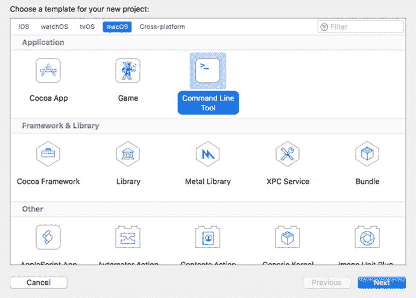
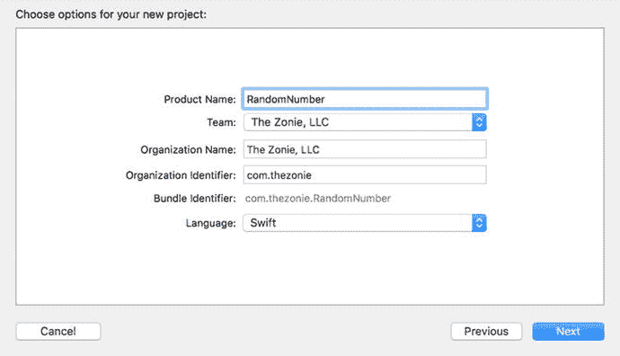
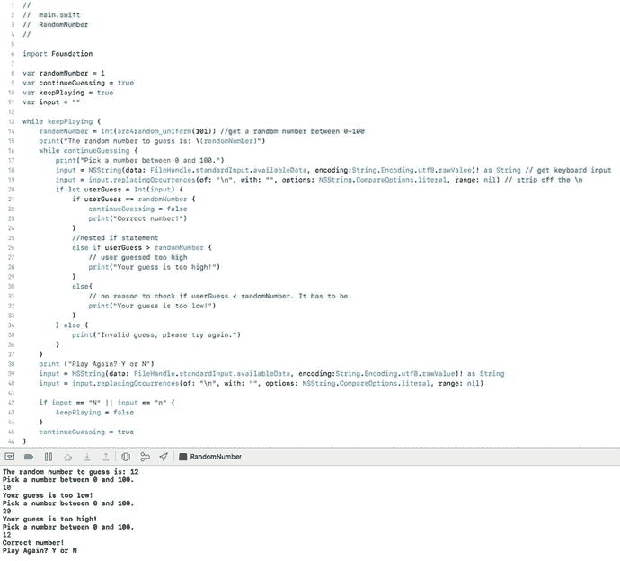
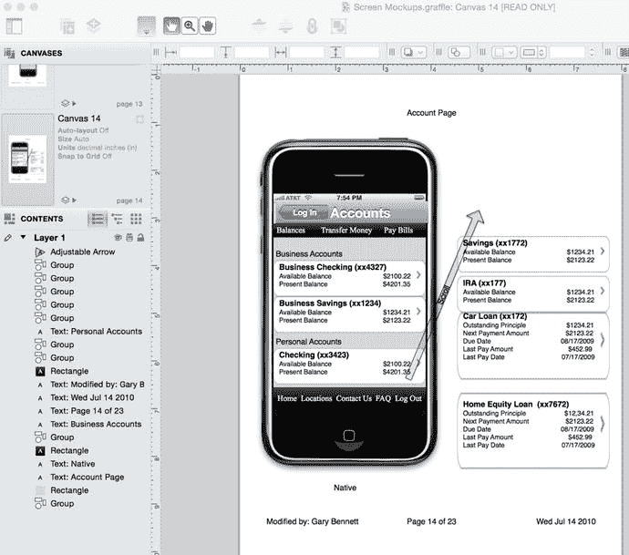
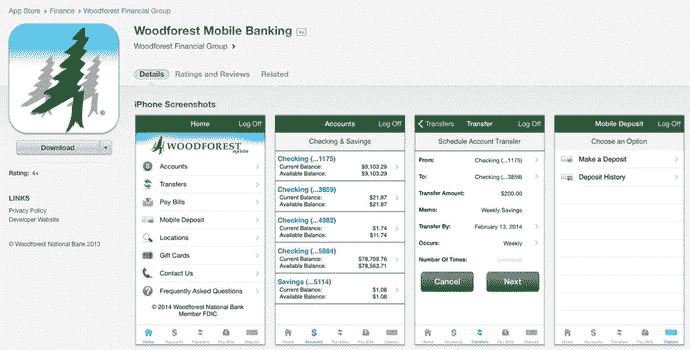
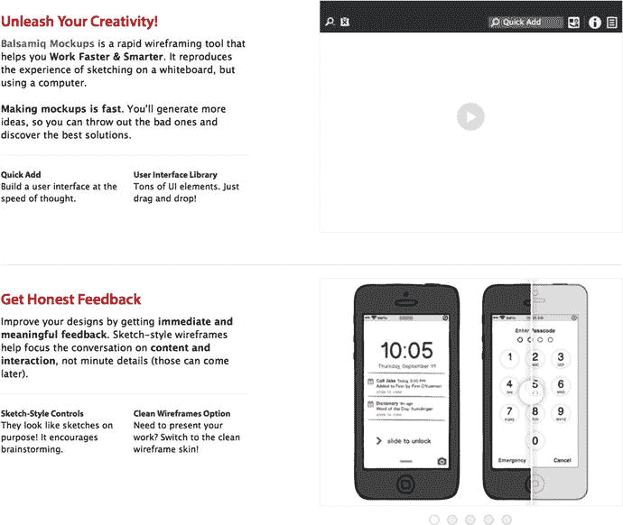

# 使用 Swift 编写示例应用

根据你的需求和所学内容，尝试用 Swift 编写一个随机数生成器。

要编写这个应用程序，你需要离开 Playground，并以 Mac 控制台应用的形式进行开发。遗憾的是，目前 Playground 无法让你与正在运行的应用进行交互，因此你无法获取键盘输入。

**注意：** 你可以在 [`http://forum.xcelme.com`](http://forum.xcelme.com) 下载完整的随机数生成器应用。相关代码是第 4 章的主题。

你的 Swift 应用将在命令行中运行，因为它需要用户猜一个随机数。

1. 打开 Xcode 并选择 **创建一个新的 Xcode 项目**。选择 **命令行工具** macOS 项目，如图 4-3 所示，然后点击 **下一步**。

   

   图 4-3. 新建一个 macOS 命令行工具项目

2. 将你的项目命名为 **RandomNumber**（见图 4-4）。确保 **语言** 下拉菜单选择 **Swift**，然后点击 **下一步**。将项目保存到你硬盘上任意喜欢的位置，然后点击 **创建**。

   

   图 4-4. RandomNumber 的项目选项

3. 打开 `main.swift` 文件。编写列表 4-13 中的代码。

   ```
   1 //
   2 //  main.swift
   3 //  RandomNumber
   4 //
   
   6 import Foundation
   
   8 var randomNumber = 1
   9 var continueGuessing = true
   10 var keepPlaying = true
   11 var input = ""
   
   13 while keepPlaying {
   14     randomNumber = Int(arc4random_uniform(101)) // 获取一个 0-100 之间的随机数
   15     print("要猜的随机数是: \(randomNumber)")
   16     while continueGuessing {
   17         print("在 0 到 100 之间选一个数字。")
   18         input = NSString(data: FileHandle.standardInput.availableData, encoding:String.Encoding.utf8.rawValue)! as String // 获取键盘输入
   19         input = input.replacingOccurrences(of: "\n", with: "", options: NSString.CompareOptions.literal, range: nil) // 去除 \n
   20         if let userGuess = Int(input) {
   21             if userGuess == randomNumber {
   22                 continueGuessing = false
   23                 print("猜对了!")
   24             }
   25             // 嵌套的 if 语句
   26             else if userGuess > randomNumber {
   27                 // 用户猜高了
   28                 print("你猜的数字太大了!")
   29             }
   30             else{
   31                 // 无需检查 userGuess < randomNumber，情况必然如此。
   32                 print("你猜的数字太小了!")
   33             }
   34         } else {
   35             print("无效猜测，请重试。")
   36         }
   37     }
   38     print ("再来一次？Y 或 N")
   39     input = NSString(data: FileHandle.standardInput.availableData, encoding:String.Encoding.utf8.rawValue)! as String
   40     input = input.replacingOccurrences(of: "\n", with: "", options: NSString.CompareOptions.literal, range: nil)
   
   42     if input == "N" || input == "n" {
   43         keepPlaying = false
   44     }
   45     continueGuessing = true
   46 }
   ```

   列表 4-13. 随机数生成器应用的源代码

在列表 4-13 中，有一些我们之前没讨论过的新代码。第一行新代码（第 14 行）如下：

```
randomNumber = Int(arc4random_uniform(101))
```

这一行会生成一个 0 到 100 之间的随机数。`arc4random_uniform()` 是一个返回随机数的函数。

下一行新代码在第 18 行：

```
18         input = NSString(data: FileHandle.standardInput.availableData, encoding:String.Encoding.utf8.rawValue)! as String // 获取键盘输入
```

这使你能够获取用户的键盘输入。我们将在后续章节中讨论这种语法。

下一行新代码在第 20 行：

```
if let userGuess = Int(input)
```

`Int` 接受一个字符串初始化器，并将其转换为整数。

## 嵌套的 `if` 语句和 `else if` 语句

有时需要对 `if` 语句进行嵌套。这意味着你需要在已有的 `if` 语句内部嵌套 `if` 语句。此外，有时还需要在 `if` 语句的 `else` 部分中首先进行比较。这被称为 `else if` 语句（回顾列表 4-13 中的第 26 行）。

```
else if userGuess > randomNumber
```

## 移除多余字符

列表 4-13 中的第 19 行如下：

```
input = input.replacingOccurrences(of: "\n", with: "", options: NSString.CompareOptions.literal, range: nil) // 去除 \n
```

读取键盘输入有时会比较麻烦。在这种情况下，它会在字符串末尾留下一个残余字符 `\n`，你需要将其移除。这是用户在键盘上按下 **回车** 键时生成的换行符。

## 通过重构改进代码

通常，在让代码运行起来之后，你会检查代码并找到更高效的编写方式。重写代码使其更高效、更易维护、更易读的过程被称为 *代码重构*。

当你审查 Swift 代码时，经常会发现可以删掉一些不必要的代码。

**注意：** 作为开发者，我们发现最好的代码行就是你不需要写的那一行——更少的代码意味着更少的调试和维护工作。

## 运行应用

要运行应用，请点击 Swift 项目屏幕左上角的 **播放** 按钮。参见图 4-5。



图 4-5. Swift 随机数生成器应用的控制台输出

**注意：** 如果运行应用时没有看到输出控制台，请确保你在编辑器右上角和右下角选择了相同的选项（选择 **视图** → **调试区域** → **激活控制台**）。


### 设计需求

正如第 1 章所讨论的，软件开发周期中最昂贵的过程是编写代码。而最便宜的过程则是收集应用程序的需求；然而，后者在软件开发中却是最容易被忽视、最不常用的环节。

设计需求通常始于向客户、用户和/或利益相关者询问应用程序应如何工作，以及它应解决哪些问题。

对于应用而言，需求可以包括长篇或短篇的描述性文字、屏幕模型和公式。在编码开始前，打开文字处理器修改需求和屏幕模型，远比修改一个 iOS 应用要容易得多。以下是一个 iPhone 手机银行应用某个视图的设计需求示例：

- **视图**：账户视图。
- **描述**：显示用户拥有的账户列表。账户列表将分为以下几个部分：商业账户、个人账户以及汽车贷款、IRA（个人退休账户）和房屋净值贷款。
- **单元格**：每个单元格将包含账户名称、账户的后四位数字、可用余额和当前余额。

一图胜千言。屏幕模型对开发者和用户都很有帮助，因为它们能展示视图完成后的样子。有许多工具可以快速设计模型，其中一种工具是 OmniGraffle。请参见图 4-6，该示例展示了由 OmniGraffle 生成的用于设计需求的屏幕模型。



**图 4-6.** 使用 OmniGraffle 和 Ultimate iPhone Stencil 插件制作的手机银行应用屏幕模型。此模型是为 2010 年的原始 Woodforest 银行应用制作的。

许多开发者认为设计需求耗时过长且不必要。事实并非如此。图 4-6 中的账户屏幕展示了大量信息。许多业务规则决定了信息如何展示给用户，以及出现问题时如何处理所有错误。在设计你的应用时，在开发过程开始时与所有业务利益相关者合作，对于首次就做好至关重要。

图 4-7 是所有利益相关者参与应用开发的一个示例。从开始就让所有利益相关者参与每个视图，将消除多次重写和应用错误。



**图 4-7.** 2015 年 App Store 上的 Woodforest 手机银行应用界面；请将此与图 4-6 中的应用需求账户屏幕进行比较。

此外，苹果公司建议开发者至少将 50% 的开发时间用于用户界面的设计和开发。

Balsamiq 也为设计 iOS 应用的外观提供了出色的工具。请参见图 4-8。



**图 4-8.** Balsamiq.com 网站，用于创建线框模型。

## 总结

本章涵盖了关于如何控制应用程序的大量重要信息；程序流程和决策制定对每个 iOS 应用都至关重要。确保你已经完成了本章中的 Swift 示例。你或许会复习这些示例，并认为自己无需实际编写这个应用就已理解了一切。这将是一个致命错误，它会阻碍你成为一名成功的 iOS 开发者。你必须花时间编写这个示例的代码。开发者是通过实践而非阅读来学习的。

本章中的术语很重要。你应该能够描述以下内容：

- `AND`（与）
- `OR`（或）
- `XOR`（异或）
- `NAND`（与非）
- `NOR`（或非）
- `NOT`（非）
- 真值表
- 否定
- 所有比较运算符
- 应用需求
- 逻辑 `AND` (`&&`)
- 逻辑 `OR` (`||`)
- 可选值与强制解包
- 可选绑定
- 隐式解包可选值
- 流程图
- 循环
- 计数控制循环
- For 循环
- 条件控制循环
- 无限循环
- `While` 循环
- 嵌套 `if` 语句
- 代码重构

## 练习

-   扩展随机数生成器应用，使其在控制台打印用户猜对随机数之前尝试的次数。
-   扩展随机数生成器应用，使其在控制台打印用户玩该应用的次数。当用户退出应用时，将此值打印到控制台。

