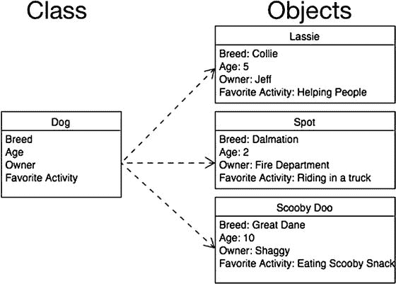

# 对象

如第 1 章所述，面向对象编程基于对象展开。本章关于对象的讨论部分内容将作为回顾，但也会更深入地探讨。对象是指任何可以被操作的事物。为了更好地理解编程中的对象是什么，你首先得观察身边物理世界中的一些事物。物理对象可以是你周围任何能触摸或感知到的东西。以电视机为例，电视机的一些特征包括类型（等离子、液晶或显像管）、尺寸（40 英寸）、品牌（索尼或 Vizio）、重量和价格。电视机还具备一些功能，比如可以开机或关机、切换频道、调节音量和改变亮度。

这些特征和功能中，有些是电视机独有的，有些则不是。例如，你家里的沙发可能就不具备与电视机相同的特征。你希望了解沙发的信息会有所不同，比如材质类型、座位容量和颜色。沙发可能只有少数几个功能，例如变成床或靠背倾斜。

现在，我们专门讨论与编程相关的对象。对象是一个特定的条目。它既可以描述书本这样的实体，也可以是应用程序窗口这样的抽象事物。对象拥有属性和方法。属性描述关于对象的某些特征，例如位置、颜色或名称。相反，方法则描述对象可以执行的动作，例如关闭或重新计算。在这个例子中，一个`TV`对象会拥有`type`（类型）、`size`（尺寸）和`brand`（品牌）属性，而一个`Couch`（沙发）对象则会拥有`color`（颜色）、`material`（材质）和`comfort level`（舒适度）等属性。在编程术语中，属性是对象的一部分变量。例如，电视机可能会用一个字符串变量来存储品牌，用一个整数变量来存储高度。

对象还拥有程序员可以用来控制它们的命令。这些命令被称为方法。方法是其他对象与特定对象进行交互的方式。例如，对于电视机来说，遥控器上的任何一个按钮都可以算作一个方法。每个按钮都代表了一种与电视机交互的方式。方法可以（并且经常）用于改变属性的值，但方法本身不存储任何值。

如第 1 章所述，对象拥有状态，这基本上是在任何给定时间点对对象的一个快照。状态是指在特定时刻所有属性的值。

在第 8 章中，你将创建一个书店应用。一个书店包含许多不同的对象。它包含书籍对象，这些对象拥有`title`（标题）、`author`（作者）、`page count`（页数）和`publisher`（出版商）等属性。它也包含杂志，杂志具有`title`（标题）、`issue`（期号）、`genre`（类型）和`publisher`（出版商）等属性。一个书店还有一些非实体对象，例如`sale`（销售）。一个`sale`对象会包含关于所购书籍、顾客、支付金额和支付方式的信息。一个`sale`对象可能还有一些用于计算税费、打印收据或取消销售的方法。`sale`对象不代表一个实体对象，但它仍然是一个对象，并且对于创建一个有效的书店来说是必不可少的。

由于对象是面向对象编程的基础，理解对象以及如何与之交互至关重要。本章的剩余部分将用于学习对象及其一些特征。

## 什么是类？

讨论面向对象编程时，不可能不讨论类的概念。一个类定义了对象将拥有哪些属性和方法。类基本上是一个可用于创建具有相似特征对象的模具。某个特定类的所有对象都将拥有相同的属性（注意，这些属性的值在很多情况下会不同）和相同的方法。这些属性的值会因对象而异。

类类似于动物世界中的物种。一个物种并非指单个动物，但它描述了许多该动物的相似特征。为了更深入地理解类，让我们看看自然界中类的例子。`Dog`（狗）类具有所有狗都共有的许多属性。例如，狗可能有名字、年龄、主人、体重和最喜欢的活动。属于某个特定类的对象被称为该类的一个实例。如果你看一下图 5-1，就能看到类与作为该类实例的实际对象之间的区别。例如，`Lassie`（莱西）就是`Dog`类的一个实例。在图 5-1 中，你可以看到一个拥有四个属性（`Breed`（品种）、`Age`（年龄）、`Owner`（主人）和`Favorite Activity`（最喜欢的活动））的`Dog`类。在现实生活中，狗会有更多属性，但这四个属性仅用于演示目的。

图 5-1. 一个类及其各个对象的示例

## 规划类

规划类是开发过程中最重要的步骤之一。虽然事后可以添加属性和方法（而且你肯定需要这样做），但了解你的应用中将使用哪些类以及它们将具有哪些基本属性和方法至关重要。在流程初期花时间规划不同的类非常重要。

好的，作为一名高级文档工程师和翻译员，我将严格按照您提供的注意事项和示例格式，将给定的英文文本翻译成中文。

