# 规划属性

让我们来看一下书店的例子，以及你需要创建的一些类。首先，创建一个 `Bookstore` 类非常重要。`Bookstore` 类包含了每个 `Bookstore` 对象所存储信息的蓝图，例如书店的名称、地址、电话号码和徽标（见图 5-2）。将这些信息放在一个类中，而不是在应用程序中硬编码，将允许你在未来轻松地更改这些信息。你将在本章后面了解使用面向对象方法论的原因。此外，如果你的书店大获成功，并且你决定再开一家，你也会有所准备，因为你可以创建 `Bookstore` 类的另一个对象。

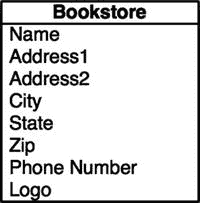

图 5-2. Bookstore 类

同时，我们也来规划一个 `Customer` 类（见图 5-3）。注意，名称被拆分成了`名`和`姓`。在你的项目中，有时你可能只想使用客户的名，如果事先没有规划好，将名和姓分开就会很困难。假设你想给客户寄一封信，告知他们即将到来的促销活动。你肯定不希望问候语写成“亲爱的 John Doe”。如果写成“亲爱的 John”，看起来会更具个性化。

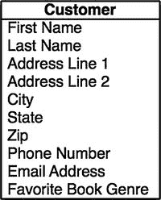

图 5-3. Customer 类

你还会注意到，地址被分解成了不同的部分，而不是全部组合在一起。`地址行 1`、`地址行 2`、`城市`、`州` 和 `邮政编码` 是分开的。这一点很重要，会在你的应用程序中使用。让我们回到你打算寄给客户关于即将到来的促销活动的信件上。

你可能不想把它寄给所有居住在不同州的客户。通过分开存储地址，你可以轻松地过滤掉那些你不想邮寄的客户。

我们还在 `Customer` 类中添加了`喜爱书籍流派`属性。添加这个属性是为了向你展示如何在每个类中保存许多不同类型的信息。如果你有一本新的悬疑小说即将发行，并且你想发送电子邮件提醒那些对悬疑特别感兴趣的客户，那么这个字段可能会派上用场。通过存储这类信息，你将能够精准地定位你的客户群中的不同部分。

创建书店也需要一个 `Book` 类（见图 5-4）。你将存储关于书籍的信息，例如作者、出版商、流派、页数和版次（以防有多个版本）。`Book` 类还将包含书的价格。

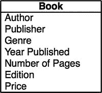

图 5-4. Book 类

你可以添加另一个名为 `Sale` 的类（见图 5-5）。这个类比前面讨论的其他类更抽象，因为它描述的不是一个有形的对象。你会注意到我们如何在 `Sale` 类中添加了对客户和书籍的引用。因为 `Sale` 类将跟踪书籍的销售情况，所以你需要知道哪本书卖给了哪个客户。

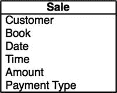

图 5-5. Sale 类

既然你已经了解了类的属性，接下来需要看看每个类将会有的一些方法。

## 规划方法

你现在不会添加所有的方法，但开始时规划得越多，后续工作就越容易。并非所有的类都会有很多方法。有些类可能根本没有方法。

> **注意：** 在规划方法时，请记住要让他们专注于一个特定的任务。方法越具体，它就越有可能被重用。

目前，你不会向 `Book` 类或 `Bookstore` 类添加任何方法。你将专注于其他两个类。

对于 `Customer` 类，你将添加方法来列出该客户的购买历史记录。未来可能还需要添加其他方法，但目前你只添加这一个。完成的 `Customer` 类图应如图 5-6 所示。靠近底部的那条线将属性和方法分隔开来。

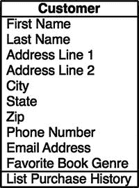

图 5-6. 完成的 Customer 类

对于 `Sale` 类，我们添加了三个方法。我们添加了`扣款信用卡`、`打印发票`和`结账`（见图 5-7）。目前，你不需要知道如何实现这些方法，但你需要知道你计划将它们添加到你的类中。

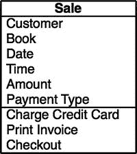

图 5-7. 完成的 Sale 类

既然你已经完成了对类及其将要添加的方法的规划，你就有了一个统一建模语言（UML）图的雏形。基本上，这是开发人员用来规划其类、属性和方法的图表。从现在开始，通过创建这样的图表来启动你的开发过程，从长远来看会对你大有裨益。对 UML 图的深入讨论超出了本书的范围。如果你想了解更多关于这个主题的信息，`smartdraw.com` 上有一个非常深入全面的概述；请参见 [`www.smartdraw.com/uml-diagram/`](http://www.smartdraw.com/uml-diagram/)。Omnigroup ([www.omnigroup.com](http://www.omnigroup.com)) 为 macOS 提供了一个出色的名为 Omnigraffle 的 UML 图程序。

图 5-8 显示了完整的图表。

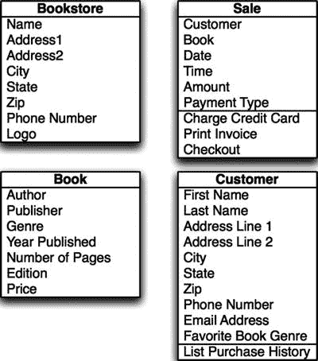

图 5-8. 为书店完成的 UML 图


### 实现类

既然你已经了解了即将创建的对象，现在就需要创建你的第一个对象。为此，你将从一个新项目开始。

1.  启动 Xcode。选择 文件 ➤ 新建 ➤ 项目。
2.  在顶部菜单中选择 iOS。在右侧，选择 主从应用。对于本章中你要做的事情，你可以选择任何一种应用类型（参见图 5-9）。点击 下一步。

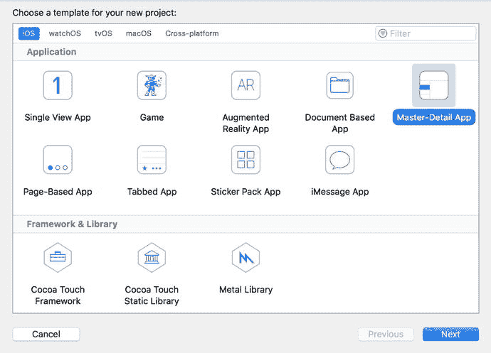

图 5-9.

创建新项目

3.  为你的项目输入产品名称。我们将使用 `BookStore` 这个名称。你还必须输入公司名称和公司标识符。公司标识符通常是 `com.companyname`（例如`com.inno`）。保持此屏幕上的复选框为默认状态。你现在还不需要担心 Core Data；这将在第 11 章讨论。同时，将当前语言选择保持为 Swift。点击 下一步 选择保存项目的位置，然后保存你的项目。
4.  从屏幕左侧的项目导航器中选择 `BookStore` 文件夹（参见图 5-10）。你的大部分代码将位于此处。

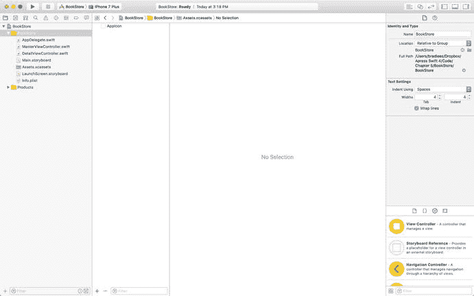

图 5-10.

选择 BookStore 项目

5.  选择 文件 ➤ 新建 ➤ 文件。
6.  在弹出的窗口中，确保顶部已选中 iOS，然后点击底部的 Cocoa Touch 类（参见图 5-11）。然后点击 下一步。

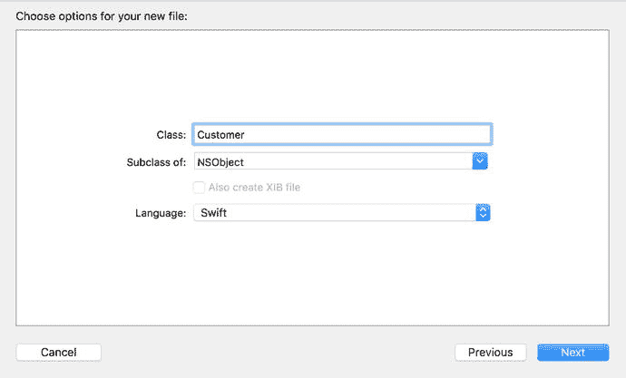

图 5-12.

创建文件

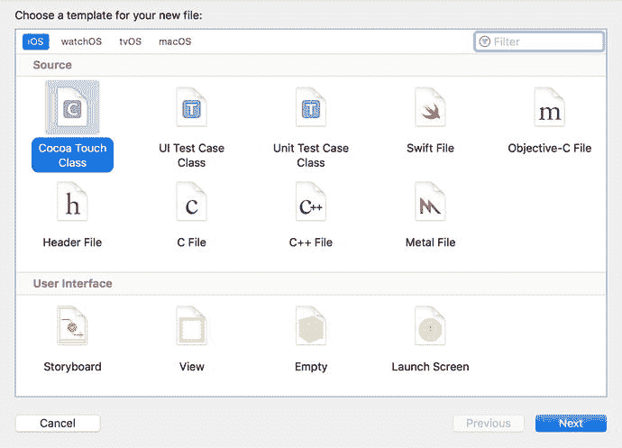

图 5-11.

创建一个新的 Swift 类文件

7.  现在你将有机会为你的类命名（参见图 5-12）。在本练习中，你将创建 `Customer` 类。再次确保语言设置为 Swift。点击 下一步 并将文件保存在默认位置。  
    **注意：** 为了便于使用和理解代码，请记住在 Swift 中类名应始终以大写字母开头。对象名应始终以小写字母开头。例如，`Book` 是一个合适的类名，而 `book` 是基于 `Book` 类的对象的绝佳名称。对于两个单词的对象，例如书的作者，合适的名称是 `bookAuthor`。这种大小写形式称为小驼峰式。
8.  现在查看你的主项目文件夹；你应该会看到一个名为 `Customer.swift` 的新文件。  
    **注意：** 如果你在 Objective-C 中创建了一个类，则会生成 `Customer.h` 和 `Customer.m` 文件。`.h` 文件是包含类信息的头文件。头文件列出了类中的所有属性和方法，但实际上并不包含它们的相关代码。`.m` 文件是实现文件，你在此编写方法的代码。在 Swift 中，整个类包含在单个文件中。
9.  现在应该已经选中了 `Customer.swift` 文件，你会看到如图 5-13 所示的窗口。请注意，它目前包含的信息不多。第一部分带有双斜杠（`//`）的是注释，不计入代码部分。注释允许你告诉可能阅读你代码的人，每段代码的目的是什么。文件的第二部分是你的新 Customer 类。新的类声明如下：

```
    class Customer: NSObject {
    }
```

**注意：**  
在 Swift 中，一个类不一定需要在其自己的文件中。可以在单个 Swift 文件中定义多个类，但当你的项目包含大量类时，这可能难以维护。为每个类设置单独的文件通常更清晰且更有条理。

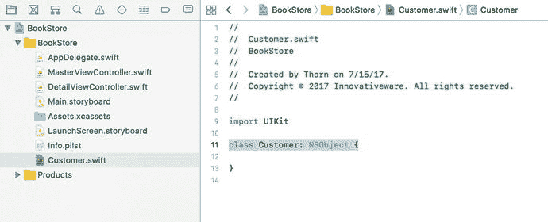

图 5-13.

你空的 Customer 类

现在让我们将 UML 图中的属性转移到实际的类中。

**提示：**  
属性应始终以小写字母开头。属性名中不能有空格。

对于第一个属性 `First Name`，将这一行添加到你的文件中：

```
var firstName = ""
```

这将在你的类中创建一个名为 `firstName` 的对象。请注意，你没有告诉 Swift `firstName` 是什么类型。在 Swift 中，你可以声明一个属性而不指定类型，属性可以根据我们最初赋予的值来分配类型。通过给属性一个初始值 `""`，你告诉 Swift 编译器将 `firstName` 设为字符串类型。在 Swift 中，所有非可选属性都需要在声明时或在类的初始化器中有一个默认值。我们将在本书后面讨论可选类型。

**注意：**  
在 Objective-C 中，所有属性都必须声明类型。例如，要创建相同的 `firstName` 属性，你将使用以下代码：

```
NSString *firstName;
```

这声明了一个名为 `firstName` 的 `NSString`。在 Swift 中，你可以只声明一个变量，并让系统确定其类型。

由于所有属性都将是 `var`，你只需对其余属性重复相同的过程。完成后，你的 Swift 文件应如图 5-14 所示。

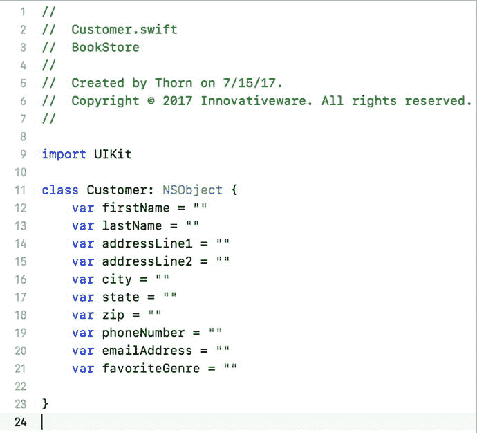

图 5-14.

包含属性的 Customer 类接口

现在类声明已经完成，你需要添加你的方法。方法应包含在与属性相同的类文件和位置中。你将添加一个新的方法，该方法返回一个数组。代码如下所示：

```
func listPurchaseHistory() -> [String] {
return ["Purchase 1", "Purchase 2"]
}
```

这段代码可能看起来有点令人困惑。空括号告诉编译器该方法没有参数传入。`->` 告诉系统你从方法中返回什么。`[String]` 告诉你你正在返回一个字符串数组。在最终版本中，你实际上会想要返回 purchase（或你选择作为你 purchase 类的任何名称）对象，但你现在使用的是 `String`。这段代码现在还无法编译，因为你不返回数组，所以你添加了一个简单数组的返回。在 Swift 文件中创建类只需要做这些。图 5-15 显示了最终的 Swift 文件。

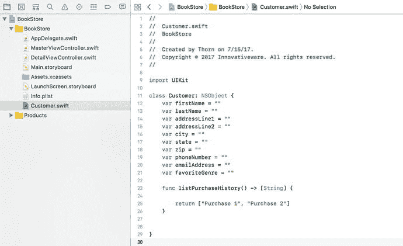

图 5-15.

完成的 Customer 类 Swift 文件


