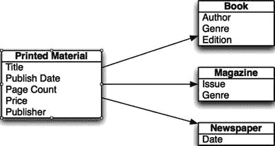

# 继承

OOP 的另一个主要特性是继承。编程中的继承类似于遗传。你可能从母亲那里遗传了眼睛的颜色，或者从父亲那里遗传了头发的颜色，反之亦然。类可以以类似的方式从其父类继承属性和方法，但与遗传不同的是，你继承的不是这些属性的值。在 OOP 中，父类被称为超类，子类被称为子类。

注意

在 Swift 中，除非特别声明，否则没有超类。在本章的示例中，我们使用了 `NSObject` 作为超类。

例如，你可以创建一个印刷品类，然后使用子类来表示图书、杂志和报纸。印刷品可以有许多共同之处，因此你可以在印刷品超类中定义属性，而不必在每个单独的类中重复定义它们。这样做可以进一步减少你需要编写和调试的冗余代码。

在图 5-16 中，你将看到 `Printed Material` 超类的属性布局，以及这些属性将如何影响 `Book`、`Magazine` 和 `Newspaper` 这些子类。`Printed Material` 类的属性会被子类继承，因此无需在子类中显式定义它们。你会注意到 `Book` 类现在的属性显著减少了。通过使用超类，你将大幅减少程序中的冗余代码。

图 5-16. 超类与子类的属性

