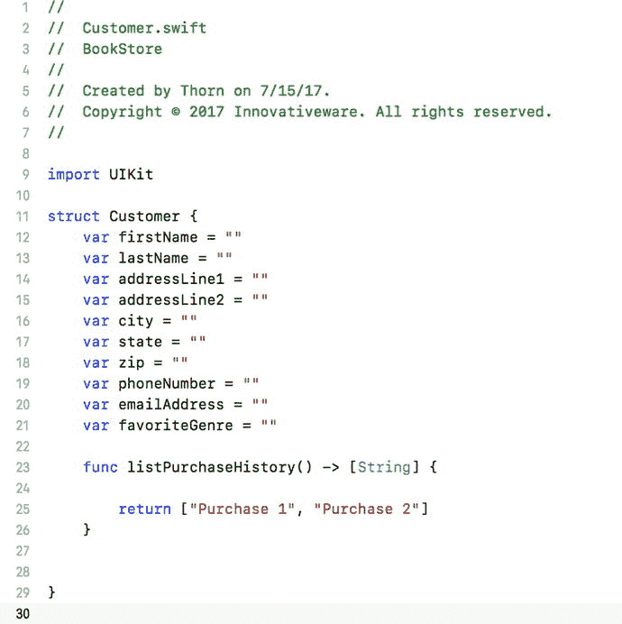

# 高级主题

我们在本章中讨论了 OOP 的基础知识，但还有一些其他主题对你的理解也很重要。

## 接口

正如本章所讨论的，其他对象与类交互的方式是通过方法。在 Swift 中，你可以为你的方法设置访问级别。将方法声明为 `private` 会使其只能被从它派生出的对象访问。默认情况下，Swift 方法是 internal（内部）的，可以被当前模块中的任何对象或方法访问。这通常被称为接口，因为它告诉其他对象如何与你的对象进行交互。在整个应用程序中实现标准接口，将使你的代码能够以类似的方式与不同的对象进行交互。这将显著减少你需要编写的特定于对象的代码量。

## 多态性

多态性是指一个类的对象能够以另一个类的对象的形式出现并被使用的能力。这通常通过创建与另一个类相似的方法和属性来实现。你一直在使用的一个关于多态性的绝佳例子是书店。在书店中，你有三个相似的类：`Book`、`Magazine` 和 `Newspaper`。如果你想对整个库存进行大促销，你可以遍历所有图书并降价，然后遍历所有杂志并降价，再遍历所有报纸并降价。这将会比实际需要做更多的工作。更好的做法是确保所有类都有一个降价方法。然后，只要这些对象是包含所需方法的某个类的子类，你就可以对所有对象调用该方法，而无需知道它们具体属于哪个类。这将节省大量时间和编码工作。

在规划类时，要寻找共性以及可能适用于多种类的方法。长远来看，这将为你节省时间并加快应用程序的运行速度。

## 面向值编程

Apple 最近为 iOS 开发者引入了一种新的范式。Apple 称之为面向值编程。Apple 现在建议开发者对于一些简单的数据，使用结构体而不是类。结构体与类类似，区别在于结构体是按值传递给方法的，并且结构体不能从任何超类继承。这意味着创建结构体比创建类有更少的开销。结构体的实例化和使用方式与类相同。图 5-17 将本章中的顾客类展示为一个结构体。

图 5-17. 顾客结构体

目前，决定使用结构体还是类是相当主观的。通常，只有当结构体非常简单、没有太多属性和方法时，才应该使用结构体来代替类。

## 小结

你终于读完了这一章！以下是本章涵盖内容的总结：

- **面向对象编程（OOP）**：你了解了 OOP 的重要性以及现代代码都应采用此方法论的原因。
- **对象**：你学习了 OOP 中的对象及其与现实世界对象的对应关系。同时，你还了解了与现实世界对象不对应的抽象对象。
- **类**：你了解了类决定了每个对象将拥有的数据类型（属性）和方法。每个对象都必须有一个类，类就是对象的蓝图。
- **创建类**：你学习了如何规划类的属性与方法。
- **创建类文件**：你使用 Xcode 创建了一个类文件。
- **编辑文件**：你编辑了 Swift 文件以添加属性和方法。

## 练习

- 尝试为你规划的其他类创建类文件。
- 规划一个 `Author` 类，选择你需要存储的关于作者的信息类型。

**面向大胆与进阶的读者**：

- 尝试创建一个名为 `PrintedMaterial` 的超类，规划该类可能具有的属性。
- 为商店可能销售的其他类型的印刷品创建类。

