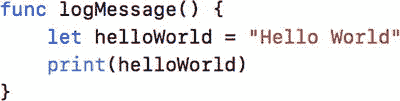

# 6. 学习 Swift 与 Xcode

在很大程度上，所有编程语言都能执行计算机所需的典型任务——存储信息、比较信息、对这些信息做出决策，并根据这些决策执行某些操作。Swift 语言让这些任务更易于理解和完成。使用 Swift 的真正技巧（实际上也是大多数编程语言的技巧）在于理解用于完成这些任务的符号和关键字。本章将继续探讨 Swift 和 Xcode，帮助你更加熟悉它们。

## 新生语言

你可能知道，Swift 诞生时间并不长。Swift 语言大约在四年前由克里斯·拉特纳开始开发，并于 2014 年 9 月 9 日正式发布了 Swift 1.0。Swift 从 Objective-C 中借鉴了许多思想，同时也融合了现代编程语言的众多特性。Swift 从设计之初就致力于让普通程序员也能轻松上手。

目前，主要有两种编程语言类型。编译型语言（如 Objective-C 和 C++）以语法严格、需遵循特定语法规则而著称，同时执行速度显著更快。解释型语言（如 Ruby、PHP 和 Python）则以更易学习和编码而闻名，但执行速度较慢。Swift 是一种弥合两者差距的语言。它融合了解释型语言的灵活性——这也是其广受欢迎的原因——与满足高要求应用和游戏所需的性能。事实上，苹果声称 Swift 应用的执行速度将快于用 Objective-C 编写的应用。在苹果的一些测试中，Swift 的执行速度几乎是 Python 的四倍，比 Objective-C 快 40%。

## 理解语言符号

理解符号是任何编程语言的基础。符号是在源代码中用于表达特定含义的标点符号。要使用一门语言，必须理解其符号。以下是 Swift 中使用的一些符号和语言结构，其中大部分你已通过不同方式接触过：

- `{`：这是左大括号。用于开始通常所说的代码块。代码块用于定义并包围一段代码，并确定其作用域。
- `}`：这是右大括号。用于结束一个代码块。只要有左大括号（`{`），就必须有对应的右大括号（`}`）。
- `[]`：这是左方括号和右方括号。用于数组的声明和使用。
- `func methodName() -> String`：这是 Swift 函数的定义方式。当然，`methodName` 一词可以代表任意名称，`String` 一词也可更改。它表示方法返回的信息类型。在此示例中，`String` 表示该方法将返回一个字符串，即一组字符（数据类型已在第 3 章介绍，后续章节将进一步深入探讨）。本章稍后将对此进行更详细的讨论。

图 6-1 展示了一个 Swift 代码示例。



**图 6-1.** Swift 代码示例

第 1 行代表一个 Swift 函数。空括号 `()` 表明该函数不接收任何变量。括号后没有 `->` 意味着该函数不返回任何类型的数据，如果被调用，也不会向调用者返回值。

第 1 行末尾和第 4 行是大括号，用于定义代码块。这个代码块就定义了该方法。每个方法至少有一个代码块。

第 2 行创建了一个名为 `hello` 的常量。正如你之前所学，常量是一个不能更改的值，即恒定不变的值。常量 `hello` 的值被赋为 `"Hello World!"`。由于你将 `hello` 赋值为一个 `String` 值，因此 `hello` 变成了一个 `String` 类型，并可以使用与 `String` 相关的任何方法（回忆一下，你第一次接触字符串是在第 3 章）。第 3 行可以重写为：

```
let hello: String = "Hello World!"
```

第 3 行是对 `print` 函数的调用。你向该方法传入对象，以便打印 `hello` 这个 `String` 对象。

虽然对于刚学 Swift 的人来说，这看起来有些难以理解，但这种简洁扼要的语法并不需要花费太多时间就能学会。


