# 在 Swift 中实现对象

Swift 从底层设计之初就具备面向对象的特性。它融合了 Objective-C 的精华，同时摆脱了与 C 语言兼容的束缚。此外，它还吸纳了脚本语言的一些最佳特性。以下是使 Swift 成为面向对象语言的一些核心概念。如果其中某些术语看起来不够熟悉，不必担心；这些内容将在后续章节（第 7 章和第 8 章）中介绍基础知识。

- 几乎所有内容都是对象。
- 对象包含实例变量。
- 对象和实例变量具有定义的作用域。
- 类隐藏了对象的实现细节。

**注意：** 如你在第 5 章所见，术语“类”通常用于表示对象的定义或类型。对象是根据类创建的。例如，SUV 是车辆的一个类别。类就像一种蓝图。工厂按照蓝图建造 SUV，最终产出的是人们驾驶的 SUV 对象。你无法驾驶一个类，但可以驾驶根据类构建出的对象。

那么，这些概念如何应用到 Swift 中呢？Swift 在类的实现上非常灵活。

**注意：** 尽管在 Swift 中，单个文件可以包含多个不同的类，但程序员通常会将代码分离到不同文件中，以便于访问。

让我们看看一个名为 `HelloWorld` 的 Swift 类的完整定义（图 6-2）。

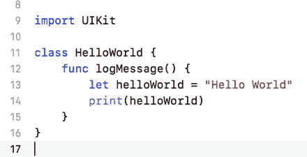

**图 6-2.** HelloWorld 类

在上述示例中，定义了一个名为 `HelloWorld` 的类。这个类只定义了一个方法：`logMessage`。这些奇怪的符号代表什么意思？我们可以参照行号，逐行审查这段代码。

第 1 行包含一个编译器指令：`import Foundation`。为了让这个小程序能识别某些其他对象，你需要让编译器读取其他接口文件。在本例中，`Foundation` 文件定义了 Foundation 框架中的对象和接口。这个框架包含了 iOS 和 macOS 系统中大多数非用户界面的基类定义。虽然在这个示例中你不会用到任何 Foundation 框架特有的对象，但它是任何新 Swift 文件的默认组成部分。

对象的实际定义从第 4 行开始，如下所示：

```
class HelloWorld {
```

`HelloWorld` 就是类名。如果你希望 `HelloWorld` 是你创建的某个日志类（例如 `LogFile`）的子类，可以将声明修改如下：

```
class HelloWorld: LogFile  {
```

第 6 行包含这个对象的方法定义，如下所示：

```
func logMessage() {
```

在定义方法时，你必须决定该方法是一个类型方法还是一个实例方法。对于 `HelloWorld` 对象，你使用的是默认的方法类型，即实例方法。这个方法只能在对象创建后被调用。如果在 `func` 前加上关键字 `class`，该方法可以在对象创建前被调用，但此时你将无法访问对象中的属性。如果你将 `logMessage` 改为类型方法，写法如下：

```
class func logMessage() {
```

第 7 行和第 8 行包含方法的具体实现。你已经在本章前面部分了解过这些语句的细节。

这就是 `HelloWorld` 类的完整描述；内容并不多。更复杂的对象只是拥有更多的方法和属性而已。

但不止于此。既然你已经定义了一个新的 Swift 类，那么该如何使用它呢？图 6-3 展示了另一段使用这个新创建类的代码。

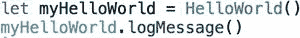

**图 6-3.** 调用 Swift 方法

第一行定义了一个名为 `myHelloWorld` 的常量，然后将该常量赋值为 `HelloWorld` 类的一个实例。第二行简单调用了 `myHelloWorld` 对象的 `logMessage` 方法。那些熟悉 Objective-C 的人会很快发现，在 Swift 中，无论是类声明还是对象创建都更加简洁高效。

**注意：** 实例化过程使一个类成为计算机内存中的真实对象。类本身在创建实例之前是无法真正使用的。以 SUV 为例，SUV 本身毫无意义，直到工厂制造出一辆（即实例化该类），这辆 SUV 才能被使用。

方法调用也可以接受多个参数。例如，考虑 `myCarObject.switchRadioBandTo(FM, 104.7)`。这里的方法名是 `switchRadioBandTo`。两个参数包含在括号内。保持方法命名的一致性至关重要。

## 在 Xcode 中编写另一个程序

当你首次打开 Xcode 时，会看到一个“Welcome to Xcode”欢迎界面。这个界面提供了一些便捷的快捷方式，用于访问最近使用过的 Xcode 项目。在你对 Xcode 更加熟悉之前，建议保持“Show this window when Xcode launches”（在 Xcode 启动时显示此窗口）复选框处于选中状态。


### 创建项目

你需要启动一个新项目，因此请点击“Create a new Xcode project”（创建新 Xcode 项目）图标。无论何时你想开始一个新的 iOS 或 macOS 应用程序、库或其他任何内容，请使用此图标。一旦项目创建并保存后，该项目将出现在显示器右侧的“Recent”（最近项目）列表中。

对于这个 Xcode 项目，你将选择一个简单的模板。请确保选中 **iOS Application**（iOS 应用程序）。然后选择 **Single View Application**（单视图应用程序），如图 6-4 所示。接着点击 “Next”（下一步）按钮即可。

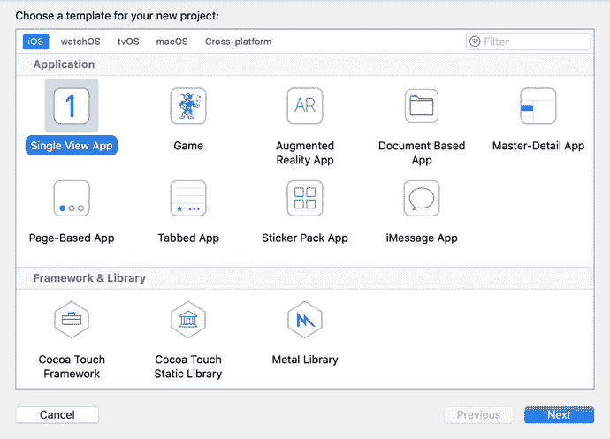

图 6-4. 从模板列表中选择新项目

这里有几种类型的模板。这些模板通过自动创建简单的源文件来提供一个起点，从而让从零开始创建项目变得更加容易。

一旦你选择了模板并点击 “Next”（下一步）按钮后，Xcode 会弹出一个对话框，询问项目的名称及其他一些信息，如图 6-5 所示。输入产品名称为 `Chapter6`。组织标识符需要填写一些内容，因此我们使用了 `com.inno`。如果你计划在实际的 iOS 设备上运行此应用或提交至 App Store，你需要从下拉菜单中选择你的团队。如果现在不选择，也可以在以后将其添加到项目中。

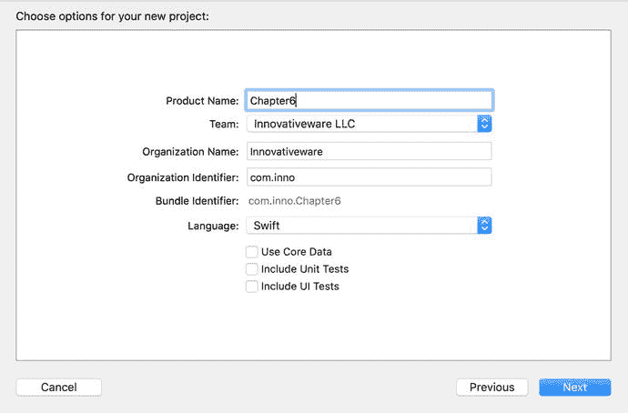

图 6-5. 设置产品名称、公司和类型

提供所有信息后，点击 “Next”（下一步）按钮。Xcode 会询问你保存项目的位置。你可以将其保存在任何地方，但桌面是一个不错的选择，因为它始终可见。

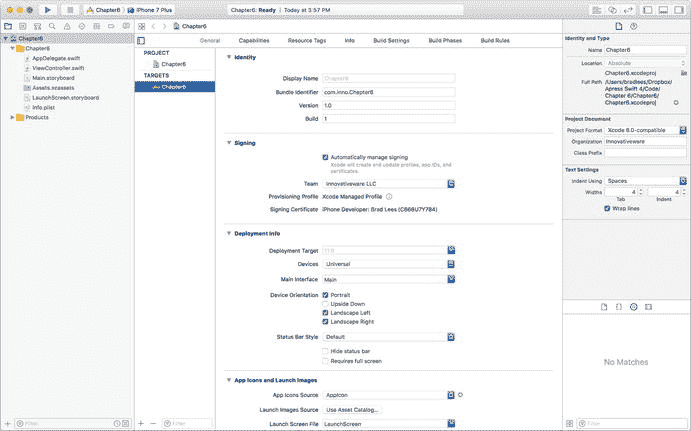

图 6-6. Xcode 9 主屏幕

一旦你选择了保存项目的位置，Xcode 主屏幕就会出现（见图 6-6）。最左侧的窗格是源文件列表。右侧三分之二的屏幕是上下文相关的编辑器。点击一个源文件，编辑器会显示源代码。点击 `.storyboard` 文件则会显示屏幕界面编辑器。

第一个应用将会很简单。这个 iPhone 应用将包含一个按钮。当按钮被点击时，你的名字会显示在屏幕上。那么，让我们先更仔细地看一下 Xcode 为你生成的一些存根源代码。Xcode 的一个好处是，它会创建一个无需任何修改即可执行的存根应用程序。在开始添加代码之前，我们先来看看 Xcode 的主工具栏，如图 6-7 所示。


图 6-7. Xcode 8 工具栏

乍一看，工具栏有三个不同的区域。左侧区域用于运行和调试应用程序。中间区域显示状态，作为编译器错误和警告的摘要。最右侧区域包含一系列用于自定义编辑视图的按钮。

如图 6-8 所示，工具栏的左侧部分包含一个播放按钮，用于编译和运行应用程序。如果应用程序正在运行，停止按钮将不会变灰。由于它现在是灰色的，说明应用程序没有在运行。方案选择暂时可以保持不动。方案将在第 13 章中详细讨论。


图 6-8. Xcode 工具栏左侧部分的特写

Xcode 工具栏的右侧包含一些改变编辑器的按钮。这三个按钮分别代表标准编辑器（已选中）、辅助编辑器和版本编辑器。现在，只需点击标准编辑器按钮，如图 6-9 所示。

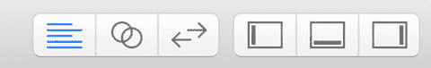

图 6-9. Xcode 工具栏右侧部分的特写

编辑器选项旁边是一组视图按钮。这些按钮可以打开或关闭。例如，图 6-10 中选中的按钮代表了图 6-7 所示的当前视图：屏幕左侧三分之一的区域是程序文件列表，中间是主编辑器，右侧是工具区。可以选择任意组合或全都不选，以便自定义主工作区窗口。最后一个按钮用于打开工具区。第 13 章将讨论这个按钮。现在，让我们回到你的第一个 iPhone 应用。

点击 `ViewController.swift` 文件，如图 6-10 所示。编辑器显示了一些 Swift 代码，这些代码定义了一个 `ViewController` 类。

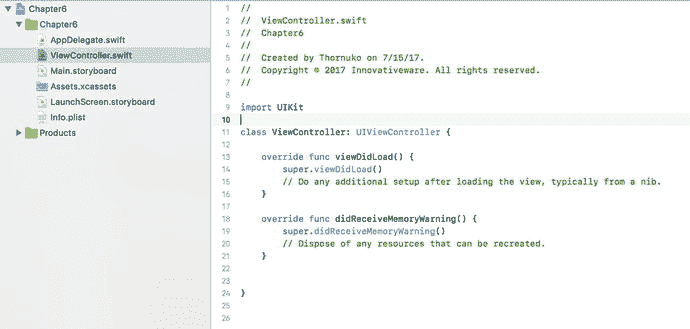

图 6-10. 在 Xcode 编辑器中查看源代码

你会注意到代码中有两个函数。`viewDidLoad` 在视图加载后立即被调用，可用于设置视图。这是放置设置标签、按钮、颜色等代码的好地方。`didReceiveMemoryWarning` 则在应用程序内存不足时被调用。你可以使用此函数来减少应用程序所需的内存量。

> **注意**
> 现在，你只需添加几行代码，看看它们的作用。目前并不期望你理解这些代码的含义。重要的是通过实际动手操作来更加熟悉 Xcode。第 7 章将更深入地讲解 Swift 程序的构成，第 10 章则会更深入地讲解如何构建 iPhone 界面。

接下来，你将向此文件中添加几行代码，如图 6-11 所示。第 13 行在屏幕上定义了一个标签，你可以在其中放置一些文本。第 15 行定义了方法 `showName`。你将调用此方法来填充 iPhone 的标签。标签无非就是屏幕上可以用来放置一些文本信息的区域。

> **警告**
> 请严格按照示例所示输入代码，包括大小写。例如，`UILabel` 不能写成 `uilabel` 或 `UILABEL`。Swift 是一种区分大小写的语言，因此 `UILabel` 与 `uilabel` 完全不同。

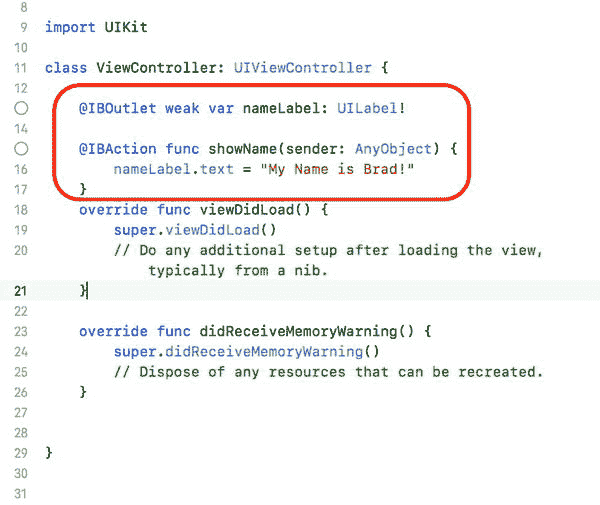

图 6-11. 添加到 ViewController.swift 文件中的代码

你会注意到，你添加的代码前面有 `@IBOutlet` 和 `@IBAction`。这些属性在将对象与界面设计器连接时是必需的。`@IBOutlet` 允许你通过代码控制界面对象。`@IBAction` 允许你在界面中发生某些事件（例如点击按钮）时执行代码。

> **注意**
> `IBOutlet` 和 `IBAction` 都以 `IB` 开头，这是 Interface Builder（界面构建器）的缩写。Interface Builder 是 NeXT 公司（后来是苹果公司）用于构建用户界面的工具。

现在你已经有了必要的代码，但设备上还没有界面。接下来，你将编辑界面，并向你的应用中添加两个界面对象。

要编辑 iPhone 的界面，你需要点击一次 `Main.storyboard` 文件。`.storyboard` 文件包含有关单个窗口或视图的所有信息。Xcode 9 也支持 `.xib`（发音为 zib）文件。

> **注意**
> 每个 `.xib` 文件代表 iPhone 或 iPad 上的一个屏幕。具有多个视图的应用会有多个 `.xib` 文件，但每个故事板文件中可以存储许多不同的视图。

你将使用 Xcode 的界面编辑器将一个 UI 对象（例如 Label 对象）连接到刚刚创建的代码上。连接起来就像点击和拖拽一样简单。


点击屏幕右上角的最后一个查看按钮，如图 6-12 所示。这将打开界面的“Utilities”视图。“Utilities”视图除其他功能外，还会显示您在应用中可用的各种界面对象。您只需要关注最右侧的两个对象：`Button`和`Label`。图 6-13 展示了对象库。虽然还有其他库可用，但目前您只需使用从左数第三个库。

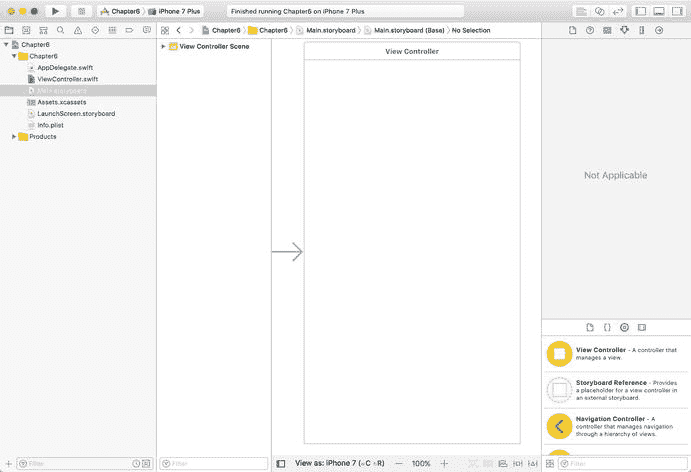

**图 6-12.** 您将要修改的界面

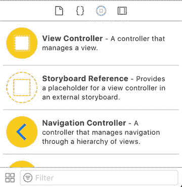

**图 6-13.** 对象库

第一步是点击“Utilities”窗口中的 `Button` 对象。接着，将该对象拖拽到 iPhone 视图上，如图 6-14 所示。不必担心；拖拽该对象并不会将其从“Utilities”视图的对象列表中移除。拖拽操作会在 iPhone 界面上创建该对象的一个新副本。

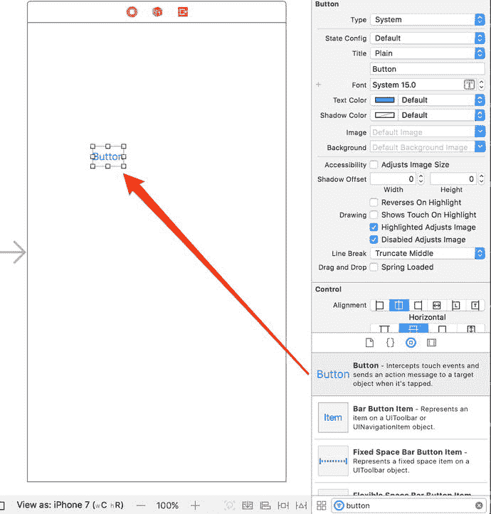

**图 6-14.** 将 `Button` 对象移动到 iPhone 视图上

接下来，双击刚刚添加到 iPhone 界面上的 `Button` 对象。这允许您修改按钮的标题，例如改为 `Name`，如图 6-15 所示。许多不同的界面对象都遵循同样的操作方式。只需双击，即可更改对象的标题。这也可以在代码中实现，但在 Interface Builder 中操作要简单得多。

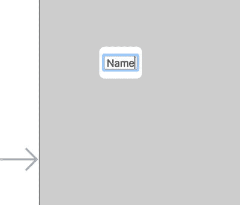

**图 6-15.** 修改 `Button` 对象的标题

标题更改完成后，将一个 `Label` 对象拖拽到按钮的正下方，如图 6-16 所示。

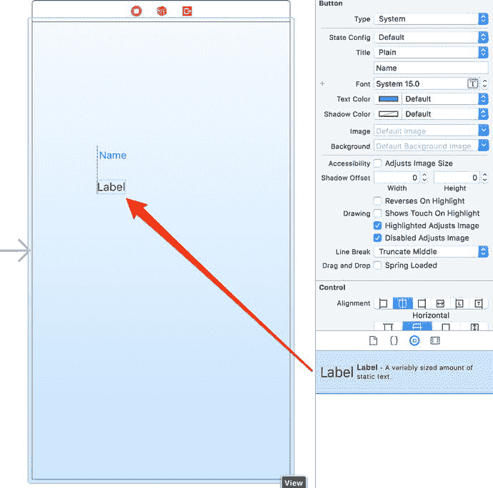

**图 6-16.** 向 iPhone 界面添加 `Label` 对象

现在，您可以暂时将标签的文本保留为“Label”，因为这样做便于在界面上找到它。如果您清除了标签的文本，该对象仍然存在，但将没有任何可见内容可供点击以选中它。通过将中心的白色方块向右拖拽来扩展标签的尺寸，如图 6-17 所示。

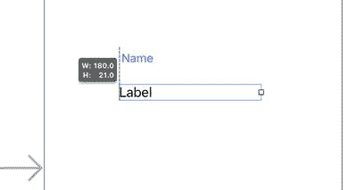

**图 6-17.** 扩展标签的尺寸

现在您有了一个按钮和一个标签，接下来就可以将这些可视化对象连接到您的程序了。首先，右键单击（或按住 Control 键单击）`Button` 控件。这会弹出一个连接菜单，如图 6-18 所示。

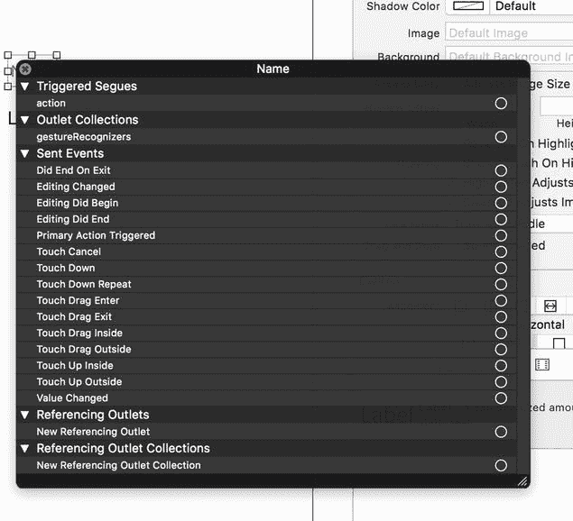

**图 6-18.** `Button` 对象的连接菜单

接着，点击并按住 `Touch Up Inside` 连接圆圈，将其拖拽到 `View Controller` 图标上，如图 6-19 所示。`Touch Up Inside` 表示用户在 `Button` 对象内部点击。将连接拖拽到 `View Controller` 会将 `Touch Up Inside` 事件连接到 `ViewController` 对象。这将使得无论何时点击 `Button` 对象，该对象都会收到通知。

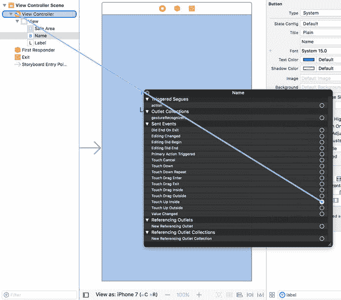

**图 6-19.** 将 `Touch Up Inside` 事件连接到对象

连接释放后，会显示一个可用于连接的方法列表，如图 6-20 所示。在此示例中，只有一个方法 `showName` `:`。选择 `showName:` 方法会将 `Touch Up Inside` 事件连接到该对象。

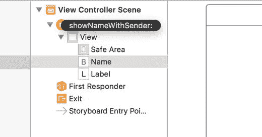

**图 6-20.** 选择处理 `Touch Up Inside` 事件的方法

连接建立后，详细信息会显示在按钮的连接菜单上，如图 6-21 所示。

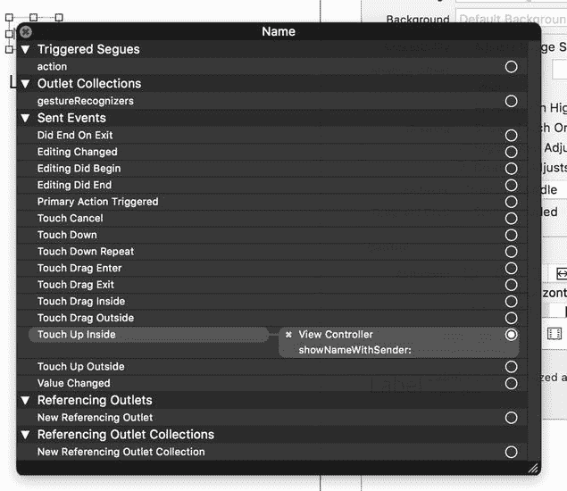

**图 6-21.** 连接现已完成

接下来，为 `Label` 对象创建一个连接。这种情况下，您不关心 `Label` 的事件；相反，您需要将 `ViewController` 的 `nameLabel` 出口连接到 iPhone 界面上的那个标签对象。这个连接基本上是在告知对象：您想要设置文本的那个标签位于 iPhone 界面上。

首先，右键单击 iPhone 界面上的 `Label` 对象。这会弹出 `Label` 对象的连接菜单，如图 6-22 所示。`Label` 对象的选项没有 `Button` 对象那么多。

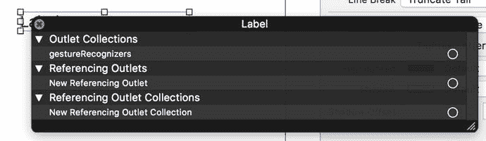

**图 6-22.** `Label` 对象的连接菜单

如前所述，您这里不是为了连接事件。相反，您要连接的是一个被称为**引用出口**的东西。它将屏幕上的对象连接到您的 `ViewController` 对象中的一个变量。就像处理按钮时一样，您应该将连接拖拽到 `View Controller` 图标上，如图 6-23 所示。

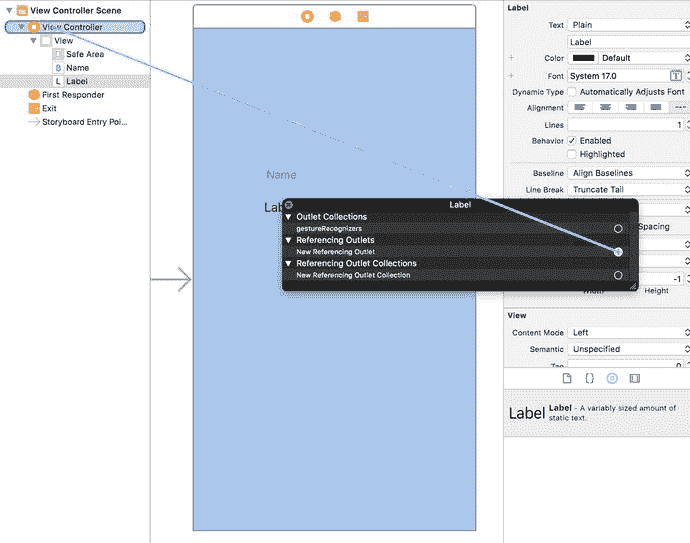

**图 6-23.** 将引用出口连接到对象

当连接释放到 `View Controller` 图标上时，会显示 `ViewController` 对象中的出口列表，如图 6-24 所示。在两个选项中，您需要选择 `nameLabel`。这就是您在 `ViewController` 对象中使用的变量名。

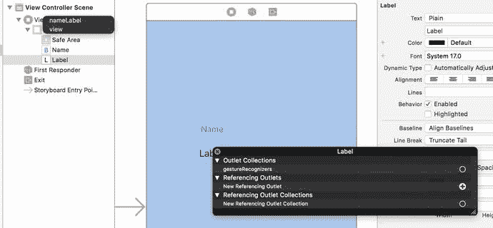

**图 6-24.** 选择对象的变量以完成连接

一旦您选择了 `nameLabel`，就可以准备运行程序了。点击 Xcode 窗口左上角的“Run”按钮（看起来像一个“Play”按钮）（参见图 6-8）。这将自动保存您的文件并在 iPhone 模拟器中启动应用程序，如图 6-25 所示。

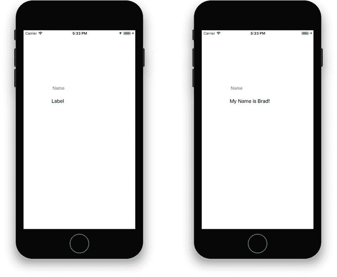

**图 6-25.** 应用运行中，点击按钮前后的状态

点击“Name”按钮后，标签的文本将从默认值“Label”更改为“My Name is Brad!”或您输入的任何值。如果您愿意，可以返回界面并清除默认的标签文本。

## 总结

本章中的示例虽然简单，但希望能激发您使用 Swift 和 Xcode 开发更复杂应用的兴趣。在后续章节中，您将学习更多关于面向对象编程以及 Swift 的更多功能。请为自己鼓掌，因为您已经学到了很多。以下是本章讨论的主题摘要：

*   Swift 语言的起源与简史
*   Swift 中常用的一些语言符号
*   一个 Swift 类示例
*   更深入地使用 Xcode，包括讨论 `HelloWorld.swift` 源文件
*   将可视化界面对象与应用中的方法和变量进行连接

## 练习

*   清除程序中“Label”的默认文本，并重新运行示例。
*   将界面上 `Label` 对象的宽度调整为更小。这对您的文本消息有何影响？
*   删除标签的引用出口连接，并重新运行项目。会发生什么？
*   如果您认为自己已经掌握了方法，请向 `ViewController` 对象和界面添加一个新的按钮和标签。将标签从显示您的姓名改为显示其他内容。


