# 7\. Swift 类、对象与方法

若您尚未阅读第 6 章，请先阅读该章后再阅读本章，因为该章对 Swift 的基础知识做了很好的介绍。本章将在此基础上进一步展开，重点讲解如何创建 Swift 类。通过本章的学习，您将更深入地理解 Swift 语言，并掌握如何运用基础知识编写简单的程序。最佳的学习方式是选取小型程序，用 Swift 编写（或重写），以观察该语言的实际运作方式。

本章涵盖 Swift 类的构成要素，以及如何通过方法与 Swift 对象进行交互。本章将以一个简单的电台类为例，演示如何编写 Swift 类，从而让您理解如何使用 Swift 类。同时，本章还将教授如何为解决问题所需的对象进行设计。此外，本章会简要介绍如何创建自定义对象，以及如何使用 Foundation 框架中提供的现有对象。

本章将扩展第 6 章的主题，并介绍一些将在第 8 章中详述的概念。

## 创建 Swift 类

在 Swift 中，创建类非常简单。通常，一个类会放在它自己的文件中，但如有需要，一个文件也可以包含多个类。

以下是一个类声明的第一行示例：

```
class RadioStation
```

这里，类名是 `RadioStation`。默认情况下，Swift 类不会继承自任何父类。如果您希望让 Swift 类继承自另一个类，可以这样写：

```
class RadioStation: Station
```

在这个例子中，`RadioStation` 现在是 `Station` 的子类，并将继承 `Station` 的所有属性和方法。代码清单 7-1 展示了一个类的完整定义。

```
1 import UIKit

3 class RadioStation: NSObject {

5     var name: String
6     var frequency: Double

8     override init() {
9         name = "Default"
10         frequency = 100
11     }

13     static var minAMFrequency: Double = 520.0

15     static var maxAMFrequency: Double = 1610.0

17     static var minFMFrequency: Double = 88.3

19     static var maxFMFrequency: Double = 107.9

21     func isBandFM() -> Int {
22         if frequency >= RadioStation.minFMFrequency && frequency <= RadioStation.maxFMFrequency {
23             return 1 //FM
24         } else {
25             return 0 //AM

27         }

29     }
30 }
代码清单 7-1.
一个 Swift 类
```

### 属性

代码清单 7-1 展示了一个包含两个不同属性的示例类：`name` 和 `frequency`。第 1 行导入了 `UIKit` 类定义（稍后会详细介绍），因为这是 Xcode 创建新类时默认添加的导入。第 3 行通过定义类名（有时称为类型）开始类的定义。第 5 行到第 6 行为 `RadioStation` 类定义了几个属性。

每当 `RadioStation` 类被实例化时，生成的 `RadioStation` 对象都可以访问这些属性，这些属性仅针对特定实例。如果有十个 `RadioStation` 对象，每个对象都拥有自己独立的变量，互不影响。这也可以称为作用域，即对象的变量位于每个对象的作用域之内。

第 13 行至第 19 行也包含属性。这些属性前面带有 `static` 关键字。这意味着该值属于类本身，并且每个对象都将保持这些属性的完全相同的值。

### 方法

几乎每个对象都有方法。在 Swift 中，与对象交互最常见的方式是调用方法，例如：

```
myStation.isBandFM()
```

上面这行代码将在 `RadioStation` 类的一个实例上调用名为 `isBandFM` 的方法。

方法还可以带有参数。为什么要传递参数？传递参数有几个原因。首先（也是最常见的），可能的取值范围太大，无法写成单独的方法。其次，需要存储在对象中的数据是可变的——比如电台名称。在下面的示例中，您会看到为每一种可能的无线电频率编写一个方法并不实际；相反，频率会作为参数传递。电台名称也是如此。

```
myStation.setFrequency(104.7)
```

方法名是 `setFrequency`。方法调用可以包含多个参数，如下例所示：

```
myStation = RadioStation.init(name: "KZZP", frequency: 104.7)
```

在上面的例子中，方法调用包含两个参数：电台名称及其频率。Swift 相对于其他语言的一个有趣之处在于，它的方法包含命名参数。如果这是一个 C++ 或 Java 程序，调用方式将会是：

```
myObject = new RadioStation("KZZP", 104.7)
```

虽然 `RadioStation` 对象的参数可能显而易见，但拥有命名参数是一个优点，因为它们或多或少地表明了参数的含义。

#### 使用类型方法

类并不总是需要被实例化才能使用。在某些情况下，类拥有一些方法，它们可以在类被实例化之前执行一些简单的操作并返回值。这些方法被称为类型方法。在代码清单 7-1 中，以 `static` 开头的方法名就是类型方法。

类型方法有其局限性。最大的限制之一是它们不能使用任何实例变量。不能使用实例变量是合理的，因为您还没有实例化任何东西。类型方法可以在其内部拥有自己的局部变量，但不能使用任何被定义为实例变量的变量。

调用类型方法的格式如下：

```
RadioStation.minAMFrequency()
```

请注意，这个调用与在实例化对象上调用方法的方式类似。最大的区别在于，这里使用的是类名而不是实例变量。类型方法在 macOS 和 iOS 框架中使用非常广泛。它们主要用于返回一些固定或众所周知的值，或者返回一个新的对象实例。这类类型方法被称为初始化器。以下是一些初始化器方法的示例：

```
1\.  Date. addingTimeInterval()  // 返回一个 Date
2\.  String(format:"http://%@", "www.apple.com")      // 返回一个新的 String 对象
3\.  Dictionary()                     // 返回一个新的 Dictionary 对象。
```

以上所有消息都是正在被调用的类型方法。

第 1 行简单地返回一个表示自参考日期 2001 年 1 月 1 日以来秒数的值。

第 2 行返回一个新的 `String` 对象，该对象已被格式化，其值为 `http://1000`。

第 3 行是一种常用的形式，因为它实际上分配了一个新对象。通常，这一行不会单独使用，而是像这样使用：

```
var myDict = Dictionary()
```

那么，什么时候应该使用类型方法呢？一般来说，如果方法返回的信息不特定于类的任何特定实例，就应该将该方法设为类型方法。例如，前面例子中的 `minAMFrequency` 对于任何 `RadioStation` 的所有实例都是一样的。这——对象——是使用类型方法的绝佳候选。然而，电台的名称或其分配的频率对于类的每个实例都是不同的。这些不应该（也确实不能）是类型方法。原因在于类型方法不能使用类定义的任何实例变量。


### 使用实例方法

实例方法（清单 7-1 中的第 29 至 35 行）仅在类被实例化后才可用。以下是一个示例：

```
1   var myStation: RadioStation         // 声明一个变量，用于保存 RadioStation 对象。
2   myStation = RadioStation()          // 创建一个新的 RadioStation 对象。
3   var band = myStation.band()         // 该方法返回 RadioStation 的频段。
```

第 3 行对 `RadioStation` 对象调用了一个方法。方法 `band()` 返回 1 表示调频，返回 0 表示调幅。实例方法是指在其声明之前不包含 `class` 关键字的任何方法。

### 使用你的新类

你已经创建了一个简单的 `RadioStation` 类，但它本身并不能完成太多功能。在本节中，你将创建 `Radio` 类，并让它维护一个 `RadioStation` 类的列表。

#### 创建你的项目

启动 Xcode 并创建一个名为 `RadioStations` 的新项目。

1.  启动 Xcode 并选择“创建一个新的 Xcode 项目”。
2.  确保选择 iOS 应用程序，并选择单视图应用模板，如图 7-1 所示。
3.  选择模板后，点击“下一步”按钮。

    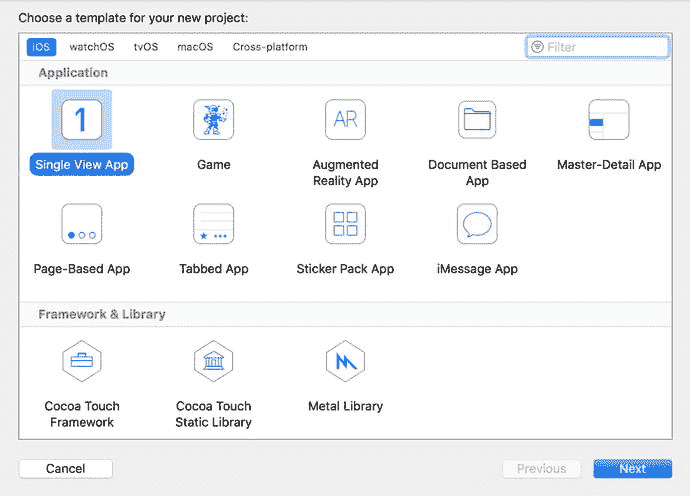

    图 7-1. 在新项目窗口中选择模板
4.  将产品名称（应用程序名称）设置为 `RadioStations`。
5.  设置公司标识符（可以虚构一个公司）并将设备系列设置为 iPhone（如图 7-2 所示）。确保在语言下拉列表中选择了 Swift。

    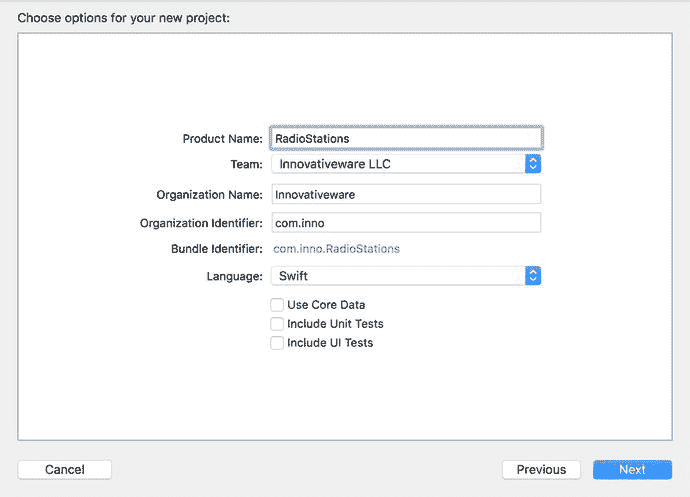

    图 7-2. 命名新的 iOS 应用程序
6.  点击“下一步”按钮，Xcode 会询问你想要将新项目保存在哪里。你可以将项目保存在桌面或主文件夹中的任何位置。做出选择后，只需点击“创建”按钮。
7.  点击“创建”按钮后，Xcode 工作区窗口应该会显示出来，如图 7-3 所示。

    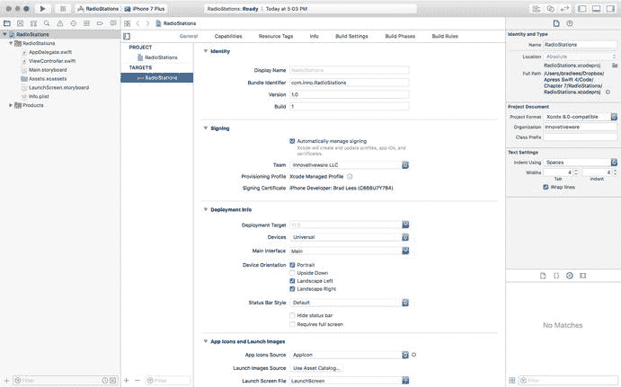

    图 7-3. Xcode 中的工作区窗口

#### 添加对象

现在你可以添加你的新对象了。

1.  首先，创建你的 `RadioStation` 对象。右键单击 `RadioStations` 文件夹，然后选择“新建文件”（如图 7-4 所示）。

    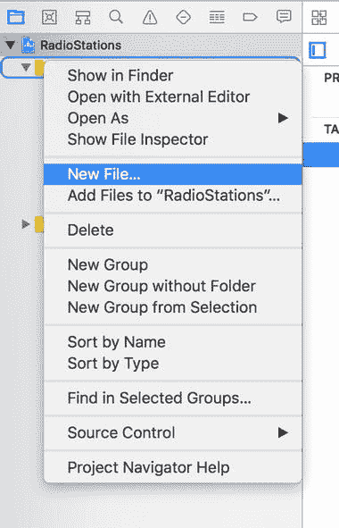

    图 7-4. 添加新文件
2.  下一个屏幕如图 7-5 所示，要求选择新文件的类型。只需从“源”组中选择 Cocoa Touch 类，然后点击“下一步”。

    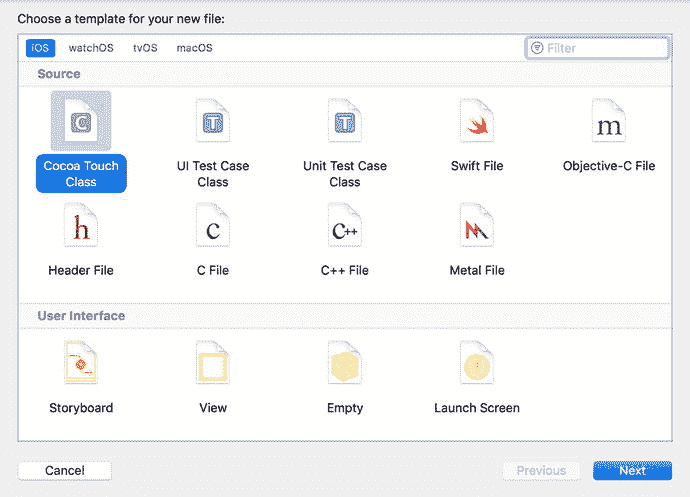

    图 7-5. 选择新文件类型
3.  接下来，屏幕会询问类的名称。输入 `RadioStation`。将“子类”设置为 `NSObject`，并确保“语言”设置为 Swift。见图 7-6。
4.  Xcode 不会提示你保存文件。默认位置在你的项目文件夹内。点击“创建”按钮将文件保存在默认位置。

    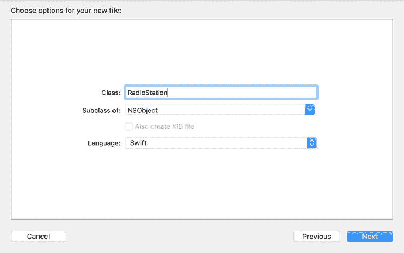

    图 7-6. 命名新类
5.  你的项目窗口现在应如图 7-7 所示。点击 `RadioStation.swift` 文件。注意，新 `RadioStation` 类的存根已经存在。现在，填充这个空类，使其看起来像你的 `RadioStation` Swift 文件清单 7-1 所示。

    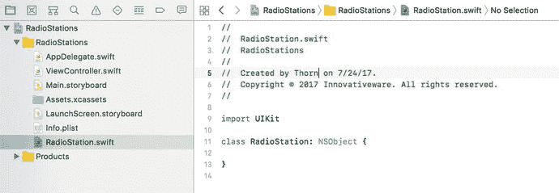

    图 7-7. 工作区窗口中你新创建的文件

#### 编写类

既然你已经创建了文件和类，就可以开始对其进行定制了。

1.  你将在这里使用的类文件与本章开头使用的相同，并且它对于电台应用程序来说将完美适用。点击 `RadioStation.swift` 文件，并在你的类中输入代码，如图 7-8 所示。

    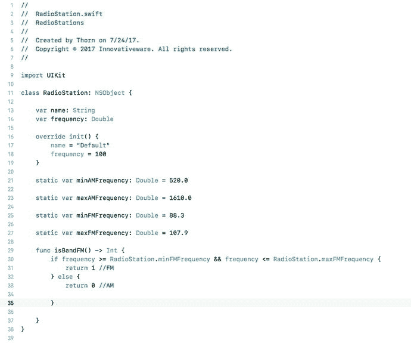

    图 7-8. `RadioStation` 类文件

    我们将在稍后回到图 7-8 中的几个项目并进一步解释；不过，定义了 `RadioStation` 类之后，你现在就可以编写实际使用它的代码了。

2.  点击 `ViewController.swift` 文件。你需要为该类定义一些变量以供使用，如图 7-9 所示。

    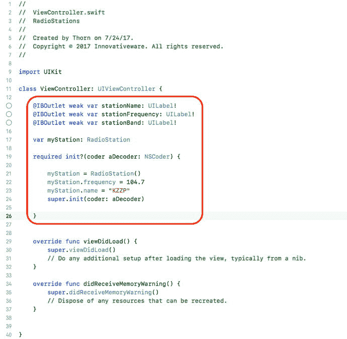

    图 7-9. 向视图控制器添加一个 `RadioStation` 对象

第 13 至 15 行将被你的 iOS 界面用来在屏幕上显示一些值（更多细节稍后介绍）。第 17 行定义了类型为 `RadioStation` 的变量 `myStation`。第 19 至 24 行包含必需的 `init` 方法。在 Swift 中，类并不强制要求初始化方法，但该方法是一个设置对象默认值的好地方。该方法设置该类中使用的变量。另外，不要忘记包含花括号（`{ ... }`）。


### 创建用户界面

接下来，需要设置主窗口以显示你的电台信息。

1.  点击 `Main.storyboard` 文件。该文件生成 iPhone 主屏幕。点击“对象库”图标，如图 7-10 所示。

    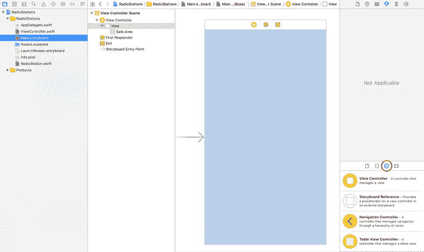

    图 7-10. 向 iPhone 屏幕添加一个 `Label` 对象

2.  拖拽三个 `Label` 对象到屏幕上，如图 7-11 所示。标签可以任意对齐，或者按图 7-11 所示方式排列。

3.  不过你需要留出空间。当 `Label` 对象位于 iPhone 屏幕上后，双击每个 `Label` 对象以更改其文本，使 iPhone 屏幕看起来像图 7-11 一样。

    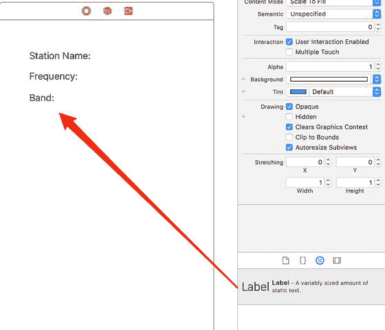

    图 7-11. iPhone 屏幕上的所有三个 `Label` 对象

4.  接下来，向屏幕添加一个 `Button` 对象，如图 7-12 所示。点击此按钮将触发屏幕更新，显示你的电台信息。

    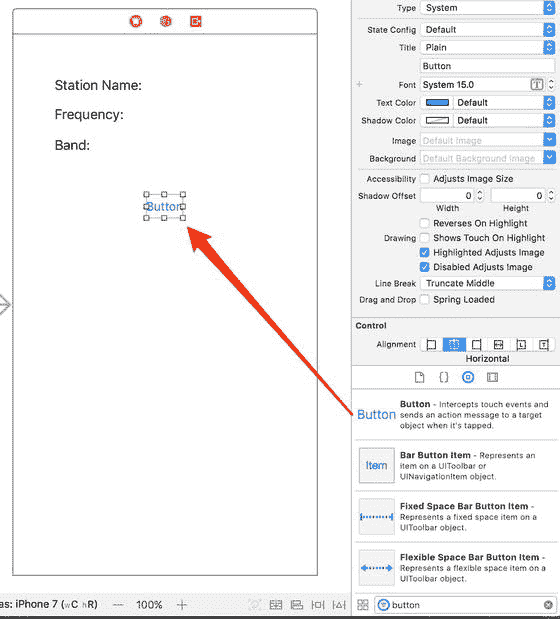

    图 7-12. 向屏幕添加一个 `Button` 对象

5.  与 `Label` 对象类似，只需双击 `Button` 对象，将其标题更改为“My Station”。按钮应会自动调整大小以适应新标题。

6.  接下来，需要添加用于显示电台信息的 `Label` 字段。这些字段应放置在现有的 `Label` 对象之后。图 7-13 显示了第一个标签的位置。放置 `Label` 对象后，需要调整其大小，使其能够显示更多文本，如图 7-14 所示。

    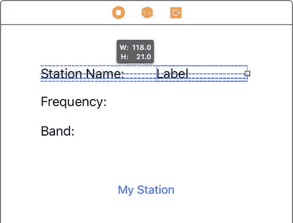

    图 7-14. 拉伸 `Label` 对象

    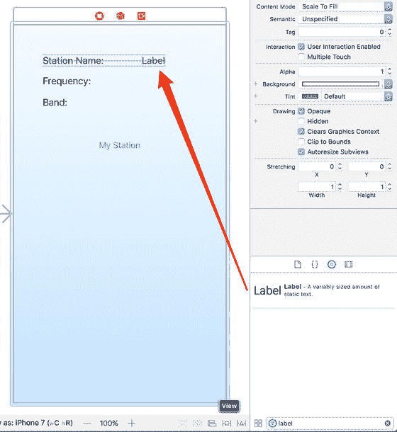

    图 7-13. 添加另一个 `Label` 对象

    > 注：拉伸 `Label` 对象可以使 `Label` 的文本容纳足够长的字符串。如果不调整 `Label` 对象的大小，文本可能会被截断（因为空间不够），或者字体大小会变小。¹

7.  重复操作，在现有的“频率”和“波段”标签旁边添加并调整一个 `Label` 对象的大小，如图 7-15 所示。暂时保留标签的默认文本“Label”也没问题。

    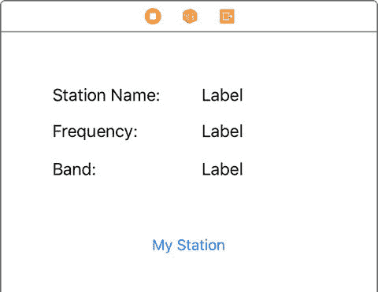

    图 7-15. 添加另一个 `Label` 对象

### 连接代码

现在所有用户界面对象都已就位，可以开始将这些界面元素连接到程序中的变量。如第 6 章所述，通过连接用户界面对象与程序中的对象来完成此操作。

1.  首先，将“电台名称”右侧的 `Label` 对象连接到变量，如图 7-16 所示。右键单击（或按住 Control 键单击）视图控制器对象，并将其拖拽到“Station Name”文本旁边的 `Label` 对象上，以调出插座列表。

    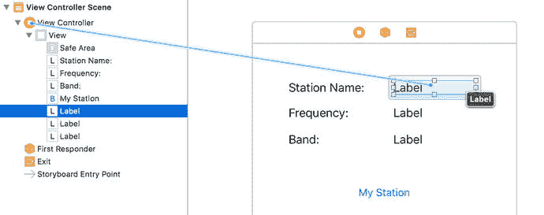

    图 7-16. 创建连接

2.  从视图控制器图标释放连接时，会显示另一个小菜单。点击你希望在此 `Label` 对象中显示的属性名称——本例中，你想要的是 `stationName` 属性，如图 7-17 所示。

    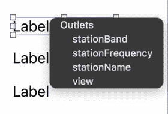

    图 7-17. 将 `Label` 连接到 `stationName` 属性

3.  现在，界面上的 `Label` 对象已连接到 `stationName` 属性。无论何时你设置该属性的值，屏幕也会随之更新。对“频率”和“波段”重复上述连接步骤。要连接按钮，需要在 `ViewController` 类中提供一个方法来处理。你可以前往 `ViewController.swift` 文件并在此添加。此外，还有一个添加 `@IBOutlet` 属性和 `@IBAction` 方法的快捷方式。在 Xcode 工具栏的右侧，点击图 7-18 所示的辅助编辑器图标（看起来像两个圆圈）。

    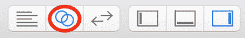

    图 7-18. 辅助编辑器图标

    点击辅助编辑器图标后，会弹出一个显示 `ViewController` 源代码的第二个窗口。右键单击（或按住 Control 键单击）并将按钮拖拽到代码窗口中，如图 7-19 所示。

    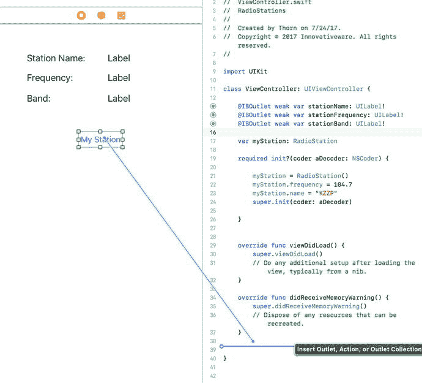

    图 7-19. 使用辅助编辑器创建方法

4.  松开鼠标时，会弹出一个小窗口，如图 7-20 所示。

    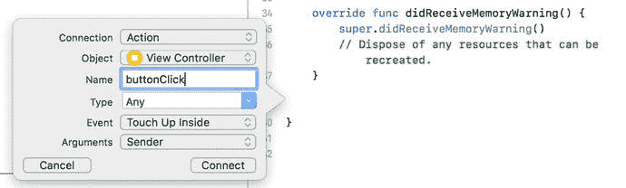

    图 7-20. 创建操作

    选择“Action”并将名称设置为 `buttonClick`。Xcode 现在将为你创建方法。

    通过添加图 7-21 所示的代码来完成你的方法。

    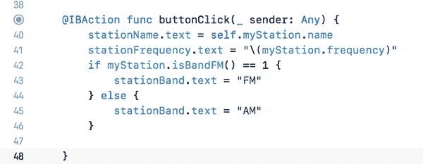

    图 7-21. 完成的 `buttonClick` 方法

    让我们逐行浏览你刚添加的代码。首先，在第 39 行，你会注意到 `IBAction` 属性。这告诉 Xcode 此方法可以作为操作的结果被调用。因此，当你去连接应用程序中的某个操作时，你会看到这个方法。

    第 40 行和第 41 行都将文本字段设置为 `RadioStation` 类中的值。第 40 行如下：

    ```
    stationName.text = myStation.name
    ```

    `stationName` 变量是你刚刚连接到用户界面 `Label` 对象的那个，而 `myStation.name` 用于返回电台名称。

    第 41 行实际上与第 40 行功能相同，但你需要先将双精度值（电台频率）转换为字符串。`\(myStation.frequency)` 会将频率属性的值代入字符串中。

    第 42 到 46 行同时使用了 `RadioStation` 类的实例变量和类型方法。这里，你只需在 `myStation` 对象上调用 `isBandFM()` 方法。如果是，则该电台是 FM 电台，`isBandFM()` 将返回 1；否则，假定其为 AM 波段。第 43 行和第 45 行在屏幕上显示波段值。

    > 提示：当用户触摸按钮内部然后释放时，按钮会发送 Touch Up Inside 事件——只有在用户抬起手指时，事件才会被实际发送。

### 运行程序

连接完成后，你就可以运行并测试程序了！为此，只需点击 Xcode 窗口左上角的“运行”按钮，如图 7-22 所示。


图 7-22. 点击播放按钮运行程序

如果没有编译错误，iPhone 模拟器将会启动，你应该能看到你的应用程序。只需点击“My Station”按钮，电台信息就会显示出来，如图 7-23 所示。

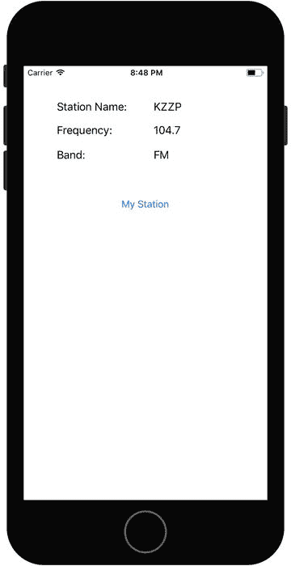

图 7-23. 显示你的电台信息

如果显示或运行效果不正确，请回溯操作步骤，确保本章描述的所有代码和连接都已正确就位。


### 将类型方法提升至新高度

在你的程序中，你尚未充分利用 `RadioStation` 的所有类型方法，但本章将描述什么是类型方法以及如何使用它。利用所学知识，尝试本章末尾提到的几个练习。只需通过添加或修改类型方法或实例方法来玩玩这个简单可运行的程序，就能了解它们的工作方式。

### 访问 Xcode 文档

Xcode 开发者文档中提供了丰富的信息。打开 Xcode 后，选择“帮助” ➤ “文档和 API 参考”（见图 7-24）以打开“文档”窗口。

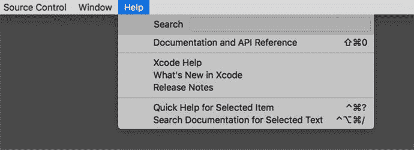

图 7-24.

Xcode 帮助菜单

打开后，可以使用搜索窗口查找本章中使用的任何 Swift 类，包括 `String` 类文档，如图 7-25 所示。

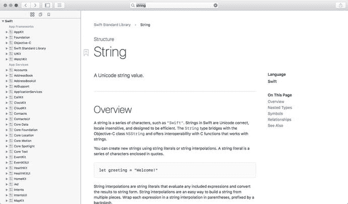

图 7-25.

Xcode 文档

关于图 7-25 中显示的 `String` 类，有几件值得探究的事情。浏览 Apple 提供的文档和各种配套指南。这将帮助你更深入地理解各种类及其支持的各类方法。

## 总结

再次祝贺你能够单枪匹马地将大量信息塞入脑中！以下是本章涵盖内容的总结：

*   Swift 类回顾
    *   类型方法
    *   实例方法
*   创建一个类
    *   使用类型方法与实例方法的局限性
    *   初始化类并使用实例变量
*   使用你的新 `RadioStation` 对象
    *   构建一个使用你新对象的 iPhone 应用
    *   将界面类连接到属性
    *   将用户界面事件连接到类中的方法

练习

*   修改创建 `RadioStation` 类的代码，使电台名称远长于屏幕所能显示的长度。会出现什么情况？
*   修改当前按钮并添加一个新按钮。将按钮标记为 FM 和 AM。如果用户点击 FM 按钮，则显示一个 FM 电台。如果用户点击 AM 按钮，则显示一个 AM 电台。（提示：你需要在 `ViewController.swift` 文件中添加第二个 `RadioStation` 对象。）
*   通过确保用户在 iPhone 应用首次启动时看不到文本“Label”，来稍微清理一下界面。
    *   使用界面工具修复此问题。
    *   如何通过向应用程序添加代码来解决此问题？
*   为 `@IBAction func buttonClick(_ sender: AnyObject)` 方法增加更多验证。目前，它只验证 FM 范围，而不验证 AM 范围。修复代码，使其也能验证 AM 范围。
    *   如果电台频率超出范围，则使用现有标签显示某种错误消息。

脚注 1

通过使用代码或 Interface Builder，你可以自定义 Label 对象对过大文本的反应方式。此处描述的行为基于 Label 对象的典型默认设置。

