# 创建书店应用

你将创建一个演示数组用法的应用。你需要创建一个`UITableView`，并使用数组为其填充数据。首先，让我们创建基础应用项目。打开 Xcode，选择"Master-Detail Application"项目模板，如图 8-1 所示。在此项目中，你将创建几个简单的对象，作为你的书店应用的基础：一个`Book`对象和一个`BookStore`对象。你将再次学习属性的概念，了解如何在项目中进行属性的取值和赋值。最后，你将实际运用这些书店对象，学习如何在创建对象后使用它们。

1. 点击"Next"按钮，将项目命名为`BookStore`，如图 8-2 所示。公司名称是必填项——你可以使用任何真实或虚构的公司名称。示例中使用了`com.innovativeware`，这完全可以。确保设备系列选择 iPhone，语言设置为 Swift。不要勾选"Use Core Data"复选框。注意：此类应用很适合使用 Core Data，但 Core Data 要到第 11 章才会介绍。在本应用中，你将使用数组进行数据存储。

   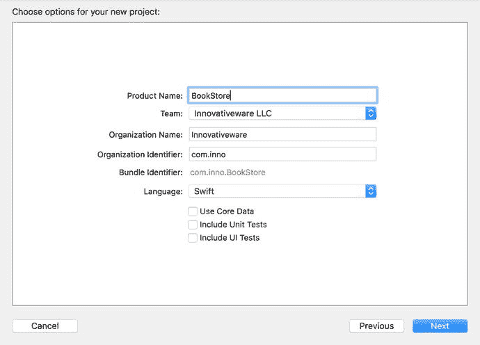

   图 8-2. 选择产品（应用）名称和选项

2. 填写完所有信息后，点击"Next"按钮。Xcode 会提示你选择项目保存位置。任何你能记住的位置都可以——桌面就是个好地方。

3. 确定保存位置后，点击"Create"按钮创建新项目。这将创建基础的`BookStore`项目模板，如图 8-3 所示。

   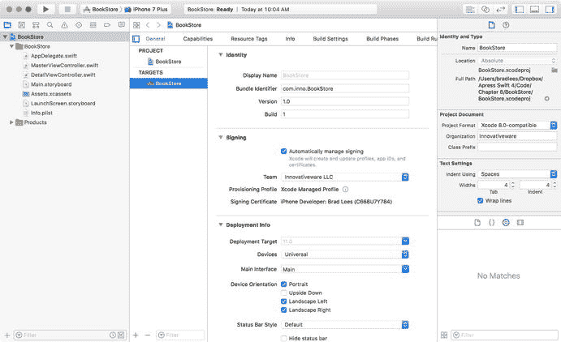

   图 8-3. 项目模板的源代码列表

4. 点击导航区域左下角的加号（+）按钮，为项目添加新对象。选择"New File"，然后选择顶部的 iOS 分类，再选择右侧的"Swift File"，如图 8-4 所示。你也可以右键单击（或按住 Control 键单击）导航区域，然后选择"New File"菜单选项。这两种方法没有区别——选择你觉得更自然的方式即可。

   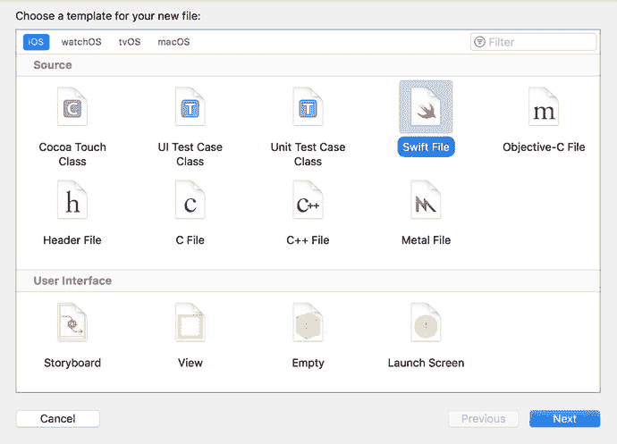

   图 8-4. 创建新的 Swift 文件

5. 你选择的是纯 Swift 文件，这将创建一个新的空 Swift 文件，用于定义`Book`类。选择后，点击"Next"按钮。

6. Xcode 会询问文件名。输入名称`Book`。Xcode 还会询问文件保存位置。为简单起见，选择项目中的`BookStore`文件夹。项目中所有其他类文件都存储在此处。

7. 双击`BookStore`文件夹，然后点击"Create"按钮。你将在 Xcode 的主编辑窗口中看到新文件`Book.swift`出现在导航区域中，如图 8-5 所示。

8. 重复上述步骤，创建第二个名为`BookStore`的对象。这将生成`BookStore.swift`文件。你将在本章后面使用这个类。现在，我们专注于`Book`类。

   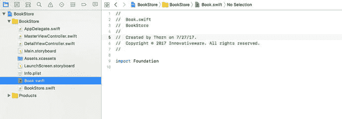

   图 8-5. 空的 Swift 文件

9. 点击`Book.swift`文件，开始定义你的新类吧！

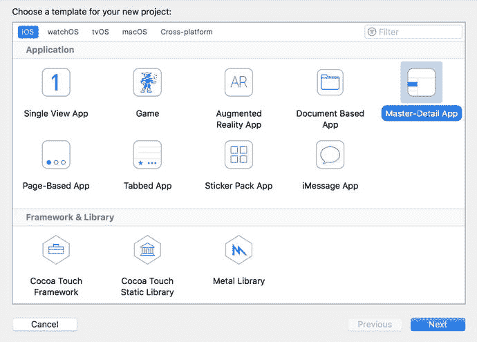

图 8-1. 基于 Master-Detail Application 模板创建初始项目

## 创建你的类

通过添加 Swift 文件（而不是 Cocoa Touch 类），Xcode 会创建一个空 Swift 文件。你可以在此文件中添加多个类。Swift 更加灵活，不要求每个文件只能有一个类。Xcode 允许你根据需要添加类。

注意：将 Swift 类放在独立文件中仍然是一个好习惯。这有助于组织和查找类，尤其是处理大型项目时。但有些情况下，某个较小的类只与另一个类配合使用，将它们放在同一个文件中也是合理的。

现在创建`Book`类。在`Book.swift`文件中输入以下代码：

```
class Book {
}
```

现在你就拥有了一个类，如图 8-6 所示。创建类就是这么简单。

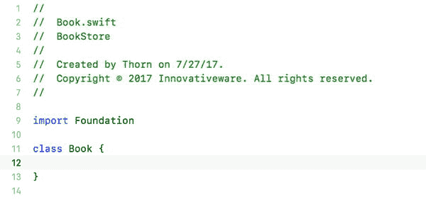

图 8-6. 空的 Book 类

## 属性介绍

这个类名称就是`Book`。没错，你有了一个类，但目前它无法存储任何数据。为了让这个类有用，它需要能够保存信息，这可以通过属性来实现。当使用对象时，必须先实例化。对象实例化后，就能访问其属性。只要对象保持在作用域内，这些变量就可用。正如你在第 7 章所学，作用域定义了对象存在的上下文。在某些情况下，对象的作用域可能是整个程序的生命周期；在其他情况下，作用域可能只是一个函数或方法。这完全取决于对象声明的位置和使用方式。稍后我们会更详细地讨论作用域。现在，让我们为`Book`类添加一些属性，使其更有用。

```
1   //
2   //  Book.swift
3   //  BookStore
4   //
5   //  Created by Thorn on 7/27/17.
6   //  Copyright © 2017 Innovativeware. All rights reserved.
7   //

9   import Foundation

11   class Book {
12       var title: String = ""
13       var author: String = ""
14       var description: String = ""
15   }
代码清单 8-8. 向 Book.swift 文件添加实例变量
```

代码清单 8-8 展示了与之前相同的`Book`对象，但现在花括号内部（第 12 至 14 行）新增了三个属性。它们都是`String`对象，这意味着它们可以为`Book`对象存储文本信息。因此，`Book`对象现在有了存储标题、作者和描述信息的位置。请注意，代码为属性分配了初始值。如果未分配初始值，则类需要初始化方法（init method）来赋值。

## 访问属性

现在你有了属性，如何使用它们？如何访问它们？不幸的是，仅仅声明属性并不一定能让你访问它。有两种方式可以访问这些变量。

* 一种方式自然是在`Book`对象内部。
* 第二种方式是从对象外部——即使用`Book`对象的程序其他部分。

如果你正在为`Book`对象内部的方法编写代码，访问其属性非常简单。例如，你可以直接编写如下代码：

```
title = "Test Title"
```

从对象外部，你仍然可以访问`title`变量。这是通过点符号实现的。

```
myBookObject.title = "Test Title"
```

## 完成 BookStore 程序

理解了属性后，现在我们将进一步创建实际的书店程序。思路很简单——创建一个名为`BookStore`的类，其中存放一些`Book`对象。


### 创建视图

首先，让我们准备好视图。如果你需要复习如何在 Xcode 中构建界面，请参考第 6 章。

1.  在导航区域中点击 `Main.storyboard` 文件。这将显示 Xcode 的 Interface Builder，如图 8-7 所示。你将在 `Main.storyboard` 文件中看到五个场景。向右导航找到详情场景（Detail Scene）。

    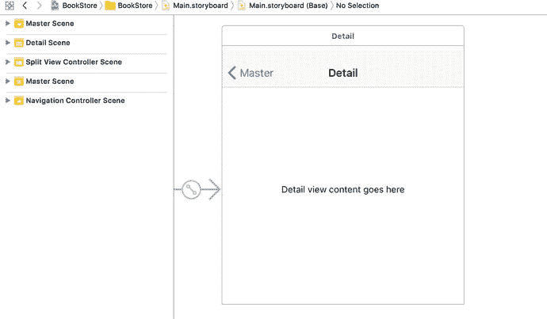

    图 8-7. 准备书店的详情视图。

2.  默认情况下，当你创建空白的 Master-Detail 应用程序时，Xcode 会添加一个标签，其中包含文本“Detail View content goes here.”。选中并删除这个 Label 对象，因为你将添加自己的内容。你需要添加一些新字段来显示所选书籍的详细信息。既然你删除了这个控件，还需要移除引用它的代码。
    1.  在 `DetailViewController.swift` 文件中，移除以下代码行：

        ```swift
        @IBOutlet weak var detailDescriptionLabel: UILabel!
        ```

    2.  在 `var detailItem: AnyObject?` 属性声明中，移除以下代码行：

        ```swift
        configureView()
        ```

    3.  在名为 `configureView` 的方法中，移除以下代码行：

        ```swift
        // Update the user interface for the detail item.
        if let detail = detailItem {
            if let label = detailDescriptionLabel {
                label.text = detail.description
            }
        }
        ```

        你的 `DetailViewController.swift` 文件现在应该如图 8-8 所示。

        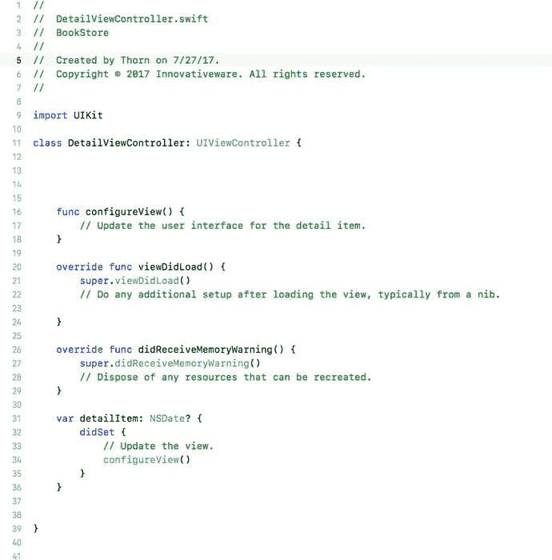

        图 8-8. 修改后的 DetailViewController。

3.  从对象库（Object Library）中将一些 Label 对象拖拽到详情视图上，如图 8-9 所示。确保下方的 Label 控件比默认宽度更宽。这样它们才能容纳较大量的文本。两个内容为“Label”的 Label 对象是你将要连接以保存来自 `Book` 对象的两个值（`Title` 和 `Author`）的控件。

    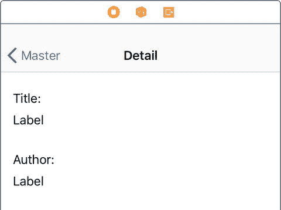

    图 8-9. 添加一些 Label 对象。

### 添加属性

接下来，你将向 `DetailViewController` 类添加一些属性。这些属性将对应详情视图中的 Label 对象。

1.  点击 Xcode 右上角的助理编辑器图标（看起来像两个圆圈）以打开助理编辑器。确保编辑器中显示的是 `DetailViewController.swift` 文件。

2.  按住 Control 键并将第一个空白的 Label 控件拖拽到右侧的代码中，如图 8-10 所示。将第一个命名为 `titleLabel`（见图 8-11）并点击连接（Connect），然后对第二个重复此过程，将其命名为 `authorLabel`。这将向你的 `DetailViewController` 类添加两个变量，如代码清单 8-9 所示，并将它们连接到界面中的 Label 控件。

    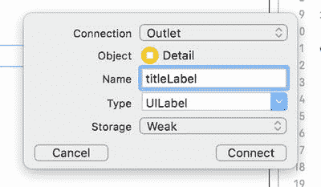

    图 8-11. 命名新属性。

    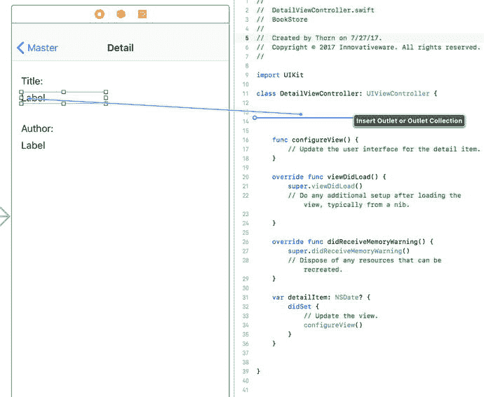

    图 8-10. 创建变量。

    ```swift
    1        @IBOutlet weak var titleLabel: UILabel!
    2        @IBOutlet weak var authorLabel: UILabel!
    ```

    代码清单 8-9. 修改 `DetailViewController.swift` 文件以包含新的标签。

### 添加描述

现在你需要向视图添加描述。描述略有不同，因为它可以跨越多行。为此，你将使用文本视图（Text View）对象。

1.  首先向视图中添加“Description:”标签，如图 8-12 所示。

    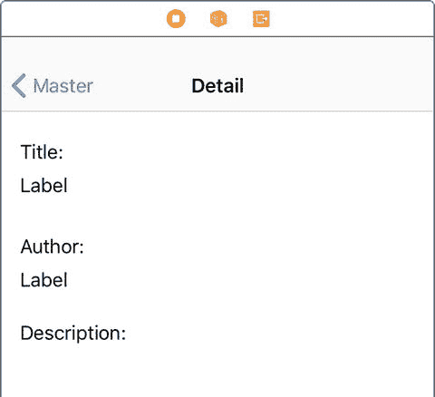

    图 8-12. 为描述添加一个新的 Label 对象。

2.  接下来，将文本视图对象添加到详情场景中，如图 8-13 所示。文本视图对象的优点是易于显示多行文本。虽然 Label 对象也可以显示多行，但不如文本视图对象整洁。注意：默认情况下，文本视图控件中填满了看似随机的文本。这种文本被称为 Lorem Ipsum 文本。如果你需要填充页面，可以在网上找到任意数量的 Lorem Ipsum 生成器。对于文本视图控件，文本可以保持不变，因为你将在运行时移除它。此外，如果清空文本，则更难准确地在屏幕上定位文本视图控件的位置——它是白底白字！

    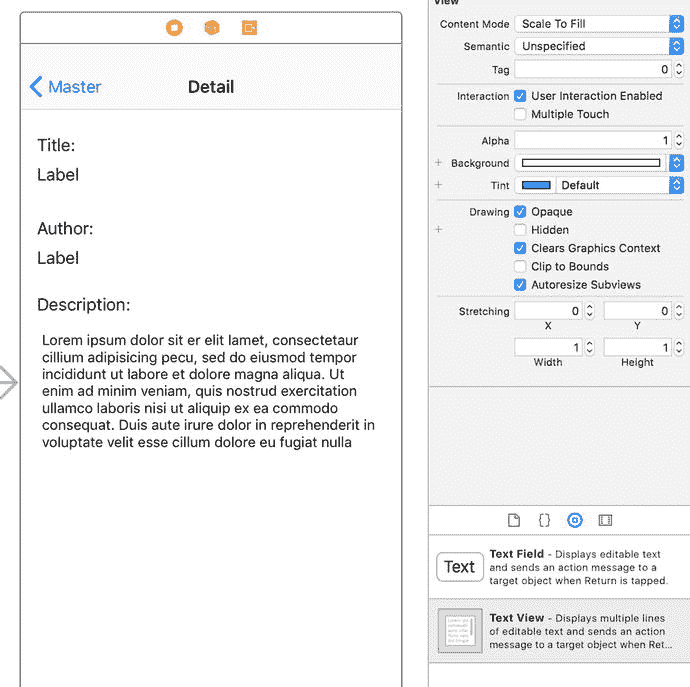

    图 8-13. 向详情视图添加文本视图。

3.  为了让程序利用文本视图，你需要为其创建一个输出口（outlet），就像你为标题和描述所做的那样。只需按住 Control 键并将文本视图拖拽到你的 `DetailViewController` 文件中，就像之前所做的那样。将此变量命名为 `descriptionTextView`。`DetailViewController` 中完成的变量部分将如代码清单 8-10 所示。

    ```swift
    1    import UIKit

    3    class DetailViewController: UIViewController {

    5        @IBOutlet weak var titleLabel: UILabel!
    6        @IBOutlet weak var authorLabel: UILabel!

    8        @IBOutlet weak var descriptionTextView: UITextView!
    ```

    代码清单 8-10. 为文本视图添加输出口以保存描述。

4.  注意类型是 `UITextView` 而不是 `UILabel`——这很重要。

**警告**

如前所述，将 `descriptionTextView` 属性设置为 `UITextView` 类型非常重要。例如，如果它被意外地设置为 `UILabel` 对象，那么当尝试将屏幕上的文本视图连接到输出口时，Xcode 将无法找到 `descriptionTextView` 输出口。为什么？Xcode 知道该控件是一个 `UITextView`，并且正在查找一个类型为 `UITextView` 的输出口。


### 创建简单的数据模型类

要让应用程序运行，它需要一些数据来显示。为此，你将使用之前创建的 `BookStore` 对象作为数据模型类。数据模型类并没有什么特别之处，其全部目的就是让应用程序能够通过对象访问数据。

修改 `BookStore.swift` 文件，使其如代码清单 8-11 所示。

```
1 //
2 //  BookStore.swift
3 //  BookStore
4 //
5 //  Created by Brad Lees on 8/20/16.
6 //  Copyright © 2016 Innovativeware. All rights reserved.
7 //
9    import Foundation
11    class BookStore {
12        var bookList: [Book] = []
13    }
代码清单 8-11.
修改 BookStore.swift 类以包含一个数组
```

在第 12 行，你添加了一个变量来保存书籍列表；该属性简单地命名为 `bookList`。请注意 `bookList` 是一个数组，这将允许你添加一系列对象，在本例中，是一组 `Book` 对象。

接下来，我们继续向 Swift 文件 `BookStore.swift` 中添加代码，如代码清单 8-12 所示。

```
1 //
2 //  BookStore.swift
3 //  BookStore
4 //
5 //  Created by Thorn on 7/27/17.
6 //  Copyright © 2017 Innovativeware. All rights reserved.
7 //
9 import Foundation
11 class BookStore {
12     var bookList: [Book] = []
14     init() {
15         var newBook = Book()
16         newBook.title = "Swift for Absolute Beginners"
17         newBook.author = "Bennett and Lees"
18         newBook.description = "iOS Programming made easy."
19         bookList.append(newBook)
21         newBook = Book()
22         newBook.title = "A Farewell to Arms"
23         newBook.author = "Ernest Hemingway"
24         newBook.description = "The story of an affair between an English nurse and an American soldier on the Italian front during World War I."
25         bookList.append(newBook)
26     }
27 }
代码清单 8-12.
实现 BookStore 数据对象
```

在代码清单 8-12 中，第 14 至 26 行定义了对象的 `init` 方法，该方法在对象首次初始化时被调用。在这个方法中，你初始化了打算添加到书店中的两本书。第 15 行是第一个 `Book` 对象被分配和初始化的地方。第 16 至 18 行为你的第一本书添加了标题、作者和描述。最后，第 19 行将新的 `Book` 对象添加到 `bookList` 数组中。这里需要注意的重要一点是，一旦对象被添加到数组中，代码就可以不再关心它；现在数组拥有了该对象。正因为如此，第 21 行不会造成问题。

第 21 行分配了一个新的 `Book` 对象，覆盖了旧值。这告诉编译器你不再关心旧值。

第 22 至 25 行简单地初始化并将第二本书添加到数组中。

就是这样！这就是定义一个简单数据模型类所需的全部内容。接下来，你需要修改 `MasterViewController` 来访问这个类，以便它可以开始显示一些数据。

### 修改 MasterViewController

这个简单的应用程序有两个视图控制器：主视图控制器，名为 `MasterViewController`，以及一个辅助视图控制器，名为 `DetailViewController`。视图控制器是控制视图行为的对象。为了让应用程序开始显示来自数据模型的数据，你首先需要修改 `MasterViewController` —— 这是应用程序导航开始的地方。以下代码已经存在于 Xcode 提供的模板中。你只需修改它来添加你的数据模型。

首先，你需要修改 `MasterViewController.swift` 文件。你需要添加一个变量来保存 `Bookstore` 对象。代码清单 8-13 显示在第 15 行将实例变量添加为一个属性。

```
1 //
2 //  MasterViewController.swift
3 //  BookStore
4 //
5 //  Created by Thorn on 7/27/17.
6 //  Copyright © 2017 Innovativeware. All rights reserved.
7 //
9 import UIKit
11 class MasterViewController: UITableViewController {
13     var detailViewController: DetailViewController? = nil
14     var objects = [Any]()
15     var myBookStore = BookStore()
代码清单 8-13.
添加 BookStore 对象
```

现在 `BookStore` 对象已经初始化，你需要告诉 `MasterViewController` 如何显示书籍列表——不是详细信息，而只是书名。为此，你需要修改几个方法。幸运的是，Xcode 提供了一个很好的模板，因此修改量很小。

`MasterViewController` 是所谓的 `UITableViewController` 类的子类，该类负责在屏幕上显示数据行。在本例中，这些是书名行（好吧，对于这个简单的程序来说只有两行，但总归是一个列表）。

有三个主要方法控制 `UITableViewController` 中显示什么数据以及如何显示。

- 第一个是 `numberOfSections(in:)`：由于应用程序只有一个列表或分区，此方法返回 1。
- 第二个是 `tableView(_:numberOfRowsInSection:)`：在这个程序中，你返回书店数组中书籍的数量。因为这是唯一的分区，所以代码很直接。
- 第三个方法是 `tableView(_:cellForRowAt:)`：此方法为每个要显示在屏幕上的行调用，并且是逐行调用的。

代码清单 8-14 详细说明了你需要进行的更改，以便在视图上显示书籍列表。更改从源文件的第 63 行开始。

```
64      override func numberOfSections(in tableView: UITableView) -> Int {
65         return 1
66     }
68     override func tableView(_ tableView: UITableView, numberOfRowsInSection section: Int) -> Int {
69         return myBookStore.bookList.count
70     }
72     override func tableView(_ tableView: UITableView, cellForRowAt indexPath: IndexPath) -> UITableViewCell {
73         let cell = tableView.dequeueReusableCell(withIdentifier: "Cell", for: indexPath)
74         cell.textLabel!.text = myBookStore.bookList[indexPath.row].title
75         cell.accessoryType = .disclosureIndicator
76         return cell
77     }
代码清单 8-14.
设置视图以显示书籍
```

在所有这些代码中，你只需要修改几行。其余部分保持不变。这是使用 Xcode 模板的优势之一。第 68 行原本只返回 1；你需要将其修改为返回 `BookStore` 类中项目的计数。

第 74 行看起来稍微复杂一些。基本上，`UITableView` 的每一行被称为一个单元格（具体来说是一个 `UITableViewCell`）。第 74 行将单元格的文本设置为书籍的标题。让我们更具体地看一下这段代码：

```
cell.textLabel!.text = myBookStore.bookList[indexPath.row].title
```


```markdown

首先，`myBookStore`是`BookStore`对象，这一点非常清楚。你正在引用`BookStore`对象中名为`bookList`的数组。由于`bookList`是一个数组，你可以通过`indexPath.row`在方括号中访问所需的书。`indexPath.row`的值指定了你感兴趣的行——`indexPath.row`总是小于总数减 1。因此，调用`myBookStore.bookList[indexPath.row]`会返回一个`Book`对象。最后一部分`.title`会从返回的`Book`对象中访问`title`属性。以下代码与你刚才在一行中完成的代码等价：

```
1    var book: Book
2    book = myBookStore.bookList[indexPath.row]
3    cell.textLabel!.text = book.title
```

现在，你应该能够构建并运行应用程序，看到你在数据模型中创建的两本书，如图 8-14 所示。

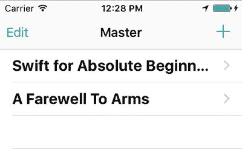

**图 8-14.** 首次运行应用程序

但是，你还没有完成。你需要让应用程序在点击其中一本书时显示该书。为此，你需要对`MasterViewController`进行最后一次修改。

每当在屏幕上点击某一行时，都会调用`prepare(for:sender:)`方法。每次你的应用转换到 Storyboard 中的不同视图时，都会调用此方法。清单 8-15 显示了为将详细信息视图连接到书籍数据所需进行的小改动。

```
50     override func prepare(for segue: UIStoryboardSegue, sender: Any?) {
51         if segue.identifier == "showDetail" {
52             if let indexPath = tableView.indexPathForSelectedRow {
53                 let selectedBook: Book = myBookStore.bookList[indexPath.row]
54                 let controller = (segue.destination as! UINavigationController).topViewController as! DetailViewController
55                 controller.detailItem = selectedBook
56                 controller.navigationItem.leftBarButtonItem = splitViewController?.displayModeButtonItem
57                 controller.navigationItem.leftItemsSupplementBackButton = true
58             }
59         }
60     }
**清单 8-15.** 点击时选择书籍

如果第 53 行看起来与清单 8-14 中的第 74 行相似，那是因为它们本质上是相同的。根据`indexPath.row`，你从`BookStore`对象中选择特定的书籍，并将其保存在名为`selectedBook`的常量中。

在第 55 行，你获取`selectedBook`并将其存储在名为`detailItem`的属性中，该属性已经是现有`DetailViewController`类的一部分。这就是你需要在`MasterViewController`中完成的所有操作。你基本上已经将书籍传递给了`DetailViewController`。你几乎完成了。现在你需要对`DetailViewController`进行一些小的修改，以便它能够正确地显示`Book`对象。

### 修改 DetailViewController

在本章的前面部分，你修改了`DetailViewController`，使其能够显示关于一本书的一些详细信息。在刚才完成的代码中，你修改了`MasterViewController`，使其将选定的书籍传递给`DetailViewController`。现在剩下的工作就是将`Book`对象中的信息移动到`DetailViewController`中屏幕上的相应字段。所有这些都在一个方法`configureView`中完成，如清单 8-16 所示。

```
19     func configureView() {
20         if let myBook = detailItem {
21             titleLabel.text = myBook.title
22             authorLabel.text = myBook.author
23             descriptionTextView.text = myBook.description
24         }
25     }
**清单 8-16.** 将 Book 对象数据移动到详细视图

`configureView`方法是 Xcode 模板中包含的许多便捷方法之一，每当`DetailViewController`被初始化时都会调用它。在这里，你将把选定的`Book`对象的信息移动到视图中的字段。

`DetailViewController.swift`文件中的第 20 至 24 行是你将信息从`Book`对象移动到视图的地方。如果你还记得，清单 8-15 中的第 55 行将选定的书籍设置到了`DetailViewController`上一个名为`detailItem`的属性中。第 20 行将该属性提取出来，并放入一个名为`myBook`的`Book`对象。

第 21 至 23 行只是将`Book`对象的每个属性移动到你在本章前面构建的视图控件中。

还有一行代码需要更改。第 40 行将`detailItem`声明为`NSDate`。我们需要将其更改为一个`Book`对象。我们还需要移除第 43 行中对`configureView`的调用。最终的声明应如清单 8-17 所示。

```
40  var detailItem: Book? {
41         didSet {
42             // Update the view.
43         }
44     }
**清单 8-17.** 更改 detailItem

现在，我们需要告诉你的视图在加载时调用`configureView`方法。将以下行添加到`viewDidLoad`函数的末尾：

```
configureView()
```

这就是你需要在这个类中完成的所有操作。如果你构建并运行项目，然后点击其中一本书，你应该会看到类似图 8-15 的内容。

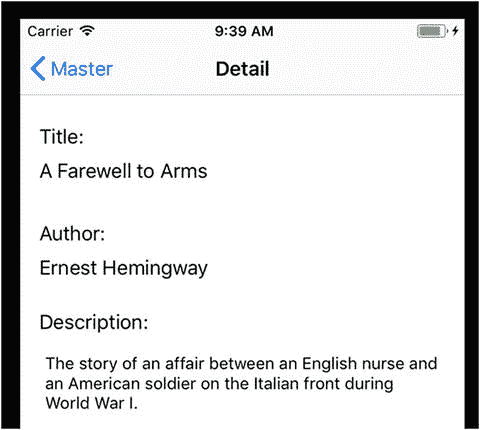

**图 8-15.** 首次查看书籍详细信息

## 总结

你已经到达本章的结尾！以下是所涵盖主题的总结：

*   **理解集合类**：集合类是 Foundation 框架中提供的一组功能强大的类，允许你高效地存储和检索信息。
*   **使用属性**：属性是类被实例化后即可访问的变量。
*   **使用`for...in`循环**：这个特性提供了一种遍历枚举项列表的新方法。
*   **构建主从应用程序**：你使用 Xcode 和主从应用程序模板构建了一个简单的书店程序，用于显示书籍和单本书的详细信息。
*   **创建简单的数据模型**：使用你学到的集合类，你使用数组构建了一个`BookStore`对象，并将其作为 BookStore 应用程序中的数据源。
*   **连接数据到视图**：你使用 Xcode 将`Book`对象的数据连接到界面字段。

## 练习

*   使用原始程序作为指南，向书店添加更多书籍。
*   在主界面场景中，移除“编辑”按钮，因为我们不会在此应用程序中使用它。
*   增强`Book`类，使其能够存储另一个属性——例如价格或类型。
*   修改`DetailViewController`，使其显示新的字段。记得将界面控件连接到属性。
*   修改`BookStore`对象，使其调用一个单独的方法来初始化`Book`对象的列表（而不是将所有代码放在`init`方法中）。
*   `UITableViewCell`还有另一个属性叫做`detailTextLabel`。尝试通过将其`text`属性设置为某些内容来利用它。
*   使用 Xcode 修改界面，尝试更改 Storyboard 文件中`DetailViewController`的背景颜色。

**更高难度的挑战：**

*   对`BookStore`对象中的书籍进行排序，使它们在`MasterDetailView`中按升序显示。

```


# 9. 数据比较

在本章中，我们将讨论编程中最基础且最频繁的操作之一：数据比较。在书店示例中，如果顾客想找某本特定的书，你可能需要比较书名；如果顾客有兴趣购买某位作者的书，你可能还需要比较作者姓名。数据比较是开发者常见的工作任务。你在第 8 章学到的许多循环都需要通过数据比较来判断代码何时停止循环。

编程中的数据比较就像使用天平。一边放一个值，另一边放另一个值，中间是操作符。操作符决定了执行何种比较，例如"大于"、"小于"或"等于"。

天平两端的值通常是变量。你在第 3 章学习了不同类型的变量。通常，针对不同变量的比较函数会略有差异。熟悉比较数据的函数和语法至关重要，因为这将构成你开发工作的基础。

为了便于本章讲解，我们将以书店应用程序为例。该应用程序允许用户登录、搜索书籍并购买。我们将介绍不同的数据比较方式，并展示它们在此类应用中如何运用。

## 重温布尔逻辑

我们在第 4 章介绍了布尔逻辑。由于它在编程中广泛应用，本章将再次深入探讨。

你为应用程序编写的最常见的比较操作就是基于布尔逻辑。布尔逻辑通常以 `if/then` 语句的形式出现。布尔逻辑的答案只有两种：是或否。以下是一些适合在程序中使用的布尔问题示例：

* 5 大于 3 吗？
* "now" 这个单词是否超过五个字母？
* 2010 年 6 月 1 日是否晚于今天？

注意，这些问题只有"是"和"否"两种可能的答案。如果你提出的问题可能有多个答案，则需要用不同的措辞来进行编程。

每个问题都将由一个 `if/then` 语句表示。（例如："如果 5 大于 3，则向用户打印一条消息"。）每个 `if` 语句都必须包含某种关系运算符。关系运算符可以是"大于"或"等于"之类的形式。

要在程序中使用这类问题，首先需要熟悉 Swift 语言中提供的各种关系运算符。我们将首先介绍它们。之后，你将学习不同类型的变量如何与这些运算符配合使用。

## 使用关系运算符

Swift 使用六种标准比较运算符。这些是标准的代数运算符，只有一处实际改动：在 Swift 语言中（与大多数其他编程语言一样），"等于"运算符由两个等号（`==`）表示。表 9-1 描述了开发者可用的运算符。

**表 9-1.** 比较运算符

| 运算符 | 描述 |
| --- | --- |
| `>` | 大于 |
| `<` | 小于 |
| `>=` | 大于或等于 |
| `<=` | 小于或等于 |
| `==` | 等于 |
| `!=` | 不等于 |

**注意：** 单个等号（`=`）用于给变量赋值。比较两个值则需要两个等号（`==`）。例如，`if(x=9)` 会尝试将值 9 赋值给变量 `x`，但 Xcode 现在会报错。而 `if(x==9)` 则会执行比较，检查 `x` 是否等于 9。

### 比较数字

开发者在比较时经常遇到的困难之一是处理不同的数据类型。本书前面讨论过不同类型的变量。你可能还记得 1 是一个整数。如果你想将一个整数与浮点数（如 1.2）进行比较，就会引发问题。这时，类型转换就派上用场了。

**注意：** 类型转换是指将对象或变量从一种类型转换为另一种类型。

在书店应用中，你会需要以多种方式比较数字。例如，假设书店为单次消费超过 30 美元的顾客提供折扣。你需要计算顾客的总消费金额，然后将其与 30 美元进行比较。如果消费金额大于 30 美元，则需要计算折扣。请看以下示例：

```
var discountThreshold = 30
var discountPercent = 0
var totalSpent = calculateTotalSpent()
if totalSpent > discountThreshold {
    discountPercent = 10
}
```

我们来逐行分析这段代码。首先，声明变量（`discountThreshold`、`discountPercent` 和 `totalSpent`）并为其赋值。注意，你不需要为变量指定具体的数值类型。类型会在你赋值时自动确定。你知道 `discountThreshold` 和 `discountPercent` 不会包含小数，因此编译器会将它们视为 `Int` 类型。在此示例中，我们假设有一个名为 `calculateTotalSpent` 的函数，它会计算当前订单的总消费额并以 `Int` 类型返回。然后，你只需检查总消费是否大于折扣阈值；如果是，则设置折扣百分比。如果你希望恰好消费 30 美元的顾客也能享受同样的折扣，可以使用 `>=` 代替 `>`。

另一个需要比较数字的操作是循环。如第 4 章所述，循环是开发中的核心操作，许多类型的循环都需要某种比较来决定何时停止。我们来看一个 `for` 循环示例：

```
var numberOfBooks: Int = 50
for y in 0..<numberOfBooks {
    doSomething()
}
```

在此示例中，你迭代（或称循环）书店中书籍的总数。`for` 语句是精彩部分开始的地方。我们来分解一下。

该 `for` 循环声明了一个初始值为 0 的变量，并在该变量小于 `numberOfBooks` 时递增它。与 Objective-C 相比，这是一种执行 `for` 循环更快捷的方式。


### 创建一个示例 Xcode 应用

现在让我们创建一个 Xcode 应用程序，以便你能开始比较数值数据。

1. 启动 Xcode，选择“文件” ➤ “新建” ➤ “Playground” 来创建一个新的 playground。本章将使用 playground 以便更轻松地进行比较操作。
2. 如图 9-1 所示，选择“空白”。点击“下一步”。

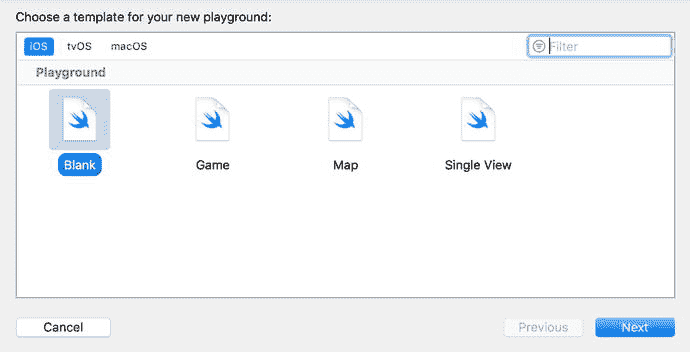

图 9-1. 创建一个新的 playground

3. 在下一页中，输入你的 playground 名称。这里我们使用了 `Comparison` 作为名称，但你可以选择任何你喜欢的名称。注意：Xcode Playground 默认保存在用户主目录的 `Documents` 文件夹中。
4. 新的 playground 创建后，你会看到标准的 Xcode 窗口。
5. 在 playground 的默认代码之后，添加下面这一行代码：

```
print("Hello World")
```

这一行代码会创建一个内容为 `Hello World` 的新 `String`，并将其传递给用于调试的 `print` 函数。

Xcode 会自动运行你添加的新行，并在右侧显示结果，如图 9-2 所示。

1. 转到以 `print` 开头的那一行的起始位置。这一行负责打印 `Hello World` 这个字符串。你将要通过在该行代码前放置两个正斜杠 (`//`) 来注释掉这一行代码。注释代码告诉 Xcode 在执行代码时忽略它。换句话说，被注释掉的代码不会运行。
2. 一旦你注释掉这行代码，该代码就不再运行，因此 Hello World 将不再显示在 playground 中，如图 9-3 所示。

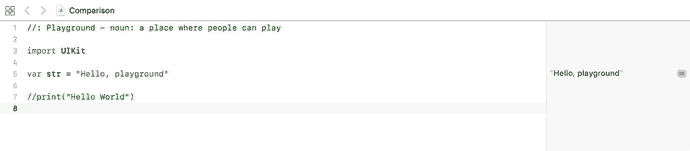

图 9-3. 包含注释代码的 playground 输出

3. 我们希望使用日志来输出比较的结果。添加一行代码，如下所示：

```
print("The result is \(6 > 5 ? "True" : "False")")
```

注意：上述代码 `(6>5 ? "True" : "False")` 被称为三元运算。它本质上只是编写 `if/else` 语句的一种简化方式。

4. 将这行代码放入你的代码中。这行代码告诉你的应用程序打印 `The result is`。然后，如果 6 大于 5，它会打印 `True`；如果 5 大于 6，则会打印 `False`。参见图 9-4。

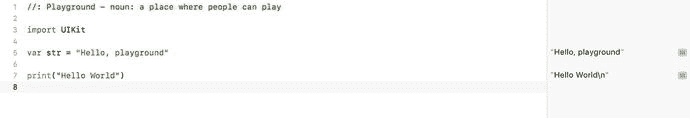

图 9-2. Playground 输出

因为 6 大于 5，所以它将打印“The result is `True`”。

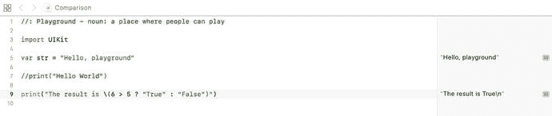

图 9-4. 三元运算输出

你可以修改这一行代码，以测试本章已经讨论过的任何比较，或者你稍后将进行的任何示例。

让我们尝试另一个示例。

```
var i = 5
var y = 6
print("The result is \(y > i ? "True" : "False")")
```

在这个示例中，你创建了一个变量并将其值赋为 5。接着你创建了另一个变量并将值赋为 6。然后，你修改了打印示例，使其比较变量 `i` 和 `y`，而不是使用具体的数字。

注意：当你在实际的 Xcode 项目中使用此代码时，可能会收到编译器警告。编译器会告诉你，三元运算符的 false 部分永远不会被执行。在你输入代码时，编译器就能查看这些值，并知道这个比较结果始终为 true。

现在你将探索其他类型的比较，然后你将回到本节的应用中并测试其中的一些比较。

### 使用布尔表达式

布尔表达式是所有比较中最简单的一种。布尔表达式用于确定一个值是 true 还是 false。示例如下：

```
var j = 5
if  j > 0 {
    someCode()
}
```

`if` 语句的计算结果始终为 `true`，因为变量 `j` 大于零。因此，程序将运行 `someCode()` 方法。

注意：在 Swift 中，如果变量是可选的，因此不保证会被赋值，你应在变量声明后添加一个问号。例如，`var j` 变为 `var j: Int?`。

如果将 `j` 的值改为 0，则语句的计算结果将为 `false`，因为 `j` 现在是 0。

```
var j = 0
if j > 0 {
    someCode()
}
```

在布尔表达式前放置一个感叹号会将其值取反（`false` 变成 `true`，`true` 变成 `false`）。

```
var j = 0
if !(j > 0) {
    someCode()
}
```

第二行现在询问“如果不满足 `j>0`”，在这种情况下，结果是 `true`，因为 `j` 等于 0。这是一个使用整数充当布尔变量的示例。如前所述，Swift 也有名为 `Bool` 的变量，它只有两个可能的值：`true` 或 `false`。

注意：与许多其他编程语言一样，Swift 在为布尔变量赋值时也使用 `true` 或 `false`。

让我们来看一个与书店相关的例子。假设你有一个常客俱乐部，所有会员在购买任何书籍时均可享受 15% 的折扣。这很容易检查。你只需在会员身份成立时将变量 `clubMember` 设置为 `true`，否则设置为 `false`。以下代码将仅对俱乐部会员应用折扣：

```
var discountPercent = 0
var clubMember = false
if clubMember {
    discountPercent = 15
}
```


好的，作为一名高级文档工程师和翻译员，我将严格遵守您的注意事项，完成以下翻译工作。


### 比较字符串

对于大多数 C 语言来说，字符串是一种困难的数据类型。在 ANSI C（或标准 C）中，字符串只是一个字符数组。Objective-C 进一步推动了字符串的发展，使其成为一个名为`NSString`的对象。Swift 则更进一步，让`String`类更易于使用。在操作对象时，您可以获得更多可用的属性和方法。对您来说幸运的是，`String`有许多用于比较数据的方法，这使您的工作变得轻松得多。

让我们看一个例子。在这里，您正在比较密码，以确定是否应允许用户登录：

```
var enteredPassword = "Duck"
var myPassword = "duck"
var continueLogin = false
if enteredPassword == myPassword {
continueLogin = true
}
```

第一行只是声明了一个`String`并将其值设置为`Duck`。下一行声明了另一个`String`并将其值设置为`duck`。在您的实际代码中，您需要从用户那里获取`enteredPassword`字符串。

下一行是实际执行工作的代码部分。您只需询问这些字符串是否彼此相等。该示例代码将始终为`false`，因为`enteredPassword`中的大写`D`与`myPassword`中的小写`d`不同。

您可能还需要对字符串执行许多其他不同的比较。例如，您可能想检查某个字符串的长度。这很容易做到。

```
var enteredPassword = "Duck"
var myPassword = "duck"
var continueLogin = false
if enteredPassword.count > 5 {
continueLogin = true
}
```

注意

`count`是一个可用于计算字符串、数组和字典数量的属性。

此代码检查输入的密码长度是否超过五个字符。

在其他时候，您将不得不在字符串内搜索某些数据。幸运的是，Swift 让这件事变得简单。`String`提供了一个名为`contains`的函数，它允许您在字符串中搜索另一个字符串。`contains`函数只接受一个参数，即您要搜索的字符串。

```
var searchTitle: String
var bookTitle: String
searchTitle = "Sea"
bookTitle = "2000 Leagues Under the Sea"
if bookTitle.contains(searchTitle) {
addToResults()
}
```

此代码的开头与您之前查看的其他示例类似。我们创建了两个变量。然后，此示例接受一个搜索词，并检查书名中是否包含相同的搜索词。如果包含，则将这本书添加到结果中。这个方法可以进行调整，以允许用户搜索书名、作者甚至描述中的特定术语。

有关`String`支持的方法的完整列表，请参阅[`https://swift.org/documentation/#the-swift-programming-language`](https://swift.org/documentation/#the-swift-programming-language)上的苹果文档。

## 使用 switch 语句

到目前为止，您已经看到了几个仅通过使用`if`语句比较数据的示例。

```
if someValue == SOME_CONSTANT {
...
} else if someValue == SOME_OTHER_CONSTANT {
...
} else if someValue == YET_SOME_OTHER_CONSTANT {
...
}
```

如果您需要将一个变量与多个常量值进行比较，可以使用另一种可以简化比较代码的方法：`switch`语句。

注意

在 Objective-C 中，您只能在`switch`语句中使用值进行比较。Swift 允许开发人员在`switch`语句的使用上拥有更多自由。使用 Swift，开发人员现在可以比较大多数对象，包括自定义对象。

`switch`语句允许您将一个或多个值与另一个变量进行比较。

```
var customerType = "Repeat"
switch  customerType {     // switch 语句后跟一个左花括号
case "Repeat":       // 等同于 if (customerType == "Repeat")
...               // 在此 case 之后调用函数并放置任何其他语句。
...
case "New":
...
...
case "Seasonal":                   ...
...
default:             // Swift 中需要默认分支
}  // switch 语句结束。
```

`switch`语句功能强大，它可以简化并精简与多个不同值的比较。

在 Swift 中，`switch`语句是一个强大的语句，可用于简化重复的`if`/`else`语句。

### 比较日期

在任何编程语言中，日期都是一个相当复杂的变量类型，而且不幸的是，根据您正在编写的应用程序类型，它们很常见。Swift 4 拥有自己的原生`Date`类型。Swift 的`Date`类有许多很好的方法，使得比较日期变得容易。我们将重点介绍`compare`函数。`compare`函数返回一个`ComparisonResult`，它有三个可能的值：`orderedSame`、`orderedDescending`和`orderedAscending`。

```
// 今天的日期
let today: Date = Date()
// 促销日期 = 明天
let timeToAdd: TimeInterval = 60*60*24
let saleDate: Date = today.addingTimeInterval(timeToAdd)
var saleStarted = false
let result: ComparisonResult  = today.compare(saleDate)
switch result {
case ComparisonResult.orderedAscending:
// 促销日期在未来
saleStarted = false
case ComparisonResult.orderedDescending:
// 促销开始日期已过，促销正在进行
saleStarted = true
default:
// 促销开始日期就是现在
saleStarted = true
}
```

这看起来似乎只是为了比较一些日期而做了很多工作。让我们逐步分析代码，看看是否能理解它。

```
let today: Date = Date()
let timeToAdd: TimeInterval = 60*60*24
let saleDate: Date = today.addingTimeInterval(timeToAdd)
```

在这里，您声明了两个不同的`Date`对象。第一个名为`today`，使用系统日期或您的设备日期进行初始化。在创建第二个日期之前，您需要向第一个日期添加一些时间。您通过创建一个`TimeInterval`来做到这一点。这是一个以秒为单位的数字。要增加一天，您需要添加`60*60*24`。第二个日期名为`saleDate`，使用未来的某个日期进行初始化。您将使用此日期来确定此促销是否已开始。我们不会详细讨论`Date`对象的初始化。

使用`Date`对象的`compare`函数的结果是一个`ComparisonResult`。您必须声明一个`ComparisonResult`来捕获`compare`函数的输出。

```
let result = today.compare(saleDate)
```

这只是简单地比较了两个日期。它将得到的`ComparisonResult`放入名为`result`的常量中。

```
switch result {
case ComparisonResult.orderedAscending:
// 促销日期在未来
saleStarted = false
case ComparisonResult.orderedDescending:
// 促销开始日期已过，促销正在进行
saleStarted = true
default:
// 促销开始日期就是现在
saleStarted = true
}
```

现在您需要找出变量`result`中的值。为此，您执行一个`switch`语句，将结果与`ComparisonResult`的三个不同选项进行比较。第一行判断促销日期是否大于今天的日期。这意味着促销日期在未来，因此促销尚未开始。然后将变量`saleStarted`设置为`false`。下一行判断促销日期是否小于今天。如果是，则促销已开始，并将`saleStarted`变量设置为`true`。再下一行只是`default`。它捕获所有其他选项。但是，您知道，唯一剩下的选项是`orderedSame`。这意味着两个日期和时间相同，因此促销刚刚开始。

还有其他可用于比较`Date`对象的方法。这些方法中的每一种在某些特定任务中会更高效。我们选择了`compare`方法，因为它可以满足您大部分基本的日期比较需求。

注意

请记住，`Date`同时包含日期和时间。这可能会影响您的日期比较，因为它不仅会比较日期，还会比较时间。


### 组合比较

正如第 4 章所讨论的，有时你需要比单一比较更复杂的逻辑。这时就需要逻辑运算符登场了。逻辑运算符让你能够检查多个条件。例如，如果对于既是你的读书俱乐部会员、又消费超过 30 美元的人群有特别折扣，你可以编写一条语句来检查。

```
var totalSpent = 31
var discountThreshhold = 30
var discountPercent = 0
var clubMember = true
if totalSpent > discountThreshhold && clubMember {
discountPercent = 15
}
```

我们将前面两个示例合并了。这条新的比较行含义如下："如果`totalSpent`大于`discountThreshold`并且`clubMember`为`true`，则将`discountPercent`设为 15。"要让此条件返回`true`，两项条件都需要为`true`。你可以使用`||`代替`&&`来表示"或"。你可以将上一条语句改为：

```
if totalSpent > discountThreshhold || clubMember  {
discountPercent = 15
}
```

现在这一行的含义变为："如果`totalSpent`大于`discountThreshold`或者`clubMember`为`true`，则将`discountPercent`设为 15。"只要任一选项为`true`，该条件就会返回`true`。

你可以继续使用逻辑运算，将任意多个比较组合在一起。某些情况下，你可能需要使用括号对比较进行分组。

## 本章小结

本章到此结束！以下是涵盖主题的总结：

- **比较**：比较数据是任何应用程序不可或缺的一部分。
- **关系运算符**：你学习了六种标准关系运算符及其用法。
- **数字**：数字是最容易比较的信息类型。你学习了如何在程序中对数字进行比较。
- **示例**：你创建了一个示例游乐场，可以在此测试你的比较逻辑并确保其正确无误。随后你学会了如何修改游乐场以添加不同类型的比较。
- **布尔值**：你学习了如何检查布尔值。
- **字符串**：你学习了字符串与你之前测试的其他信息类型有何不同表现。
- **日期**：你学习了比较日期可能相当复杂，必须小心谨慎以确保得到预期的结果。

**练习**

- 修改示例游乐场，对某些字符串信息进行比较。
- 编写一个 Swift 应用程序，判断以下年份是否为闰年：1800、1801、1899、1900、2000、2001、2003 和 2010。输出格式应为：`The year 2000 is a leap year` 或 `The year 2001 is not a leap year`。关于判断闰年的方法，请参见 [`http://en.wikipedia.org/wiki/Leap_year`](http://en.wikipedia.org/wiki/Leap_year)。

# 10. 创建用户界面

Interface Builder 使 iOS 开发者能够利用强大的图形用户界面轻松创建用户界面。它允许开发者通过简单地从 Interface Builder 的库中将对象拖拽到编辑器来构建用户界面。

Interface Builder 将用户界面设计存储在一个或多个名为故事板的资源文件中。这些资源文件包含界面对象、它们的属性以及相互之间的关系。

要构建用户界面，只需将对象从 Interface Builder 的“对象库”面板拖拽到你的视图或场景中。操作（Actions）和输出口（Outlets）是 Interface Builder 的两个关键组件，有助于简化开发流程。

对象会在视图中触发操作，而操作会连接到应用代码中的方法。输出口在`.swift`文件中声明，并作为属性连接到特定的控件。参见图 10-1。

**注意**

Interface Builder 曾是一款独立的应用程序，开发者用它来设计用户界面。从 Xcode 4.0 开始，Interface Builder 已被集成到 Xcode 中。

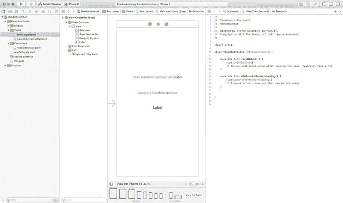

图 10-1. Interface Builder

## 理解 Interface Builder

Interface Builder 将用户界面文件保存为一个 bundle，其中包含应用程序中使用的界面对象及其关系。这些 bundle 以前的文件扩展名为`.nib`。Interface Builder 3.0 版本采用了新的 XML 文件格式，文件扩展名也变更为`.xib`。不过，开发者仍将这些文件称为 nib 文件。后来，苹果公司引入了故事板。故事板允许你将所有视图放在一个扩展名为`.storyboard`的文件中。

与大多数其他图形用户界面应用程序不同，XIB 和故事板常被称为“冻干”文件，因为它们包含了已归档的对象本身，并且可以随时运行。

采用 XML 文件格式是为了便于与 Subversion 和 Git 等源代码控制系统配合进行存储。

下一节，我们将讨论一种名为“模型-视图-控制器”的应用设计模式。这种设计模式使开发者能够更轻松地维护代码，并在应用生命周期内复用对象。


# 模型-视图-控制器模式

`Model-View-Controller`（`MVC`）是 iOS 开发中最流行的设计模式，掌握它将让您的开发工作轻松很多。`MVC` 被用于软件开发，并被视为一种架构模式。

架构模式描述了开发者可在代码中使用的软件设计问题的解决方案。`MVC` 模式并非 iOS 开发者独有；它已被许多集成开发环境（`IDE`）的制造商采用，包括那些运行在 Windows 和 Linux 平台上的环境。

对于企业而言，软件开发被视为一项昂贵且高风险的投资。通常，应用程序的编写时间比预期更长，超出预算，并且无法按预期运行。面向对象编程（`OOP`）曾引起很大轰动，并给人一种印象：如果公司采用其方法论，就能实现节约，这主要是因为对象的可重用性和代码更易于维护。然而，最初这并未实现。

当工程师们探究为何 `OOP` 未能达到预期时，他们发现了开发者在设计对象时的一个关键缺陷：开发者经常以这样一种方式混杂对象，以至于随着应用程序的成熟、代码迁移到不同平台或硬件显示发生变化，代码变得难以维护。

对象的设计方式常常导致，若以下任何一项发生变化，就很难隔离受影响的这些对象：

*   业务规则
*   用户界面
*   客户端-服务器或基于互联网的通信

对象可以被划分为三个与任务相关的类别。开发者的责任是确保每个类别中的对象不会跨界到其他类别。

随着对象被归入这些类别，应用程序可以随着时间推移更容易地被开发和维护。以下是一个 iPhone 银行应用程序中对象及其对应 `MVC` 类别的示例：

`Model`（模型）

*   账户余额
*   用户加密
*   账户转账
*   账户登录

`View`（视图）

*   账户余额表格单元格
*   账户登录旋转控件

`Controller`（控制器）

*   账户余额视图控制器
*   账户转账视图控制器
*   登录视图控制器

在 `MVC` 设计模式中记忆和分类对象的最简单方法如下：

*   `Model`（模型）：代表现实世界的独特业务或应用程序规则或代码。这是数据所在之处。
*   `View`（视图）：独特的用户界面代码。
*   `Controller`（控制器）：任何控制模型或视图对象，或与之通信的对象。

图 10-2 展示了 `MVC` 范式。

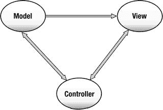

图 10-2. `MVC` 范式

无论是 `Xcode` 还是 `Interface Builder` 都不会强制开发者使用 `MVC` 设计模式。由开发者自行决定如何组织其对象以使用此设计模式。

值得一提的是，Apple 非常推崇 `MVC` 设计模式，并且所有框架都是为了在 `MVC` 世界中工作而设计的。这意味着，如果您也采用 `MVC` 设计模式，与 Apple 的类协同工作将变得容易得多。否则，您将逆水行舟。

## 人机界面指南

在您过于兴奋并开始为应用设计动态用户界面之前，需要先了解一些基本规则。Apple 通过 `iOS 11` 开发了世界上最先进的操作系统之一。此外，Apple 的产品以其直观和用户友好而闻名。Apple 希望用户在不同的应用之间拥有相同的体验。

为了确保一致的用户体验，Apple 为开发者提供了关于其应用外观和操作感受的指南。这些指南被称为`人机界面指南`（`HIG`），适用于 `iOS`、`macOS`、`watchOS`、`tvOS` 和 `CarPlay`。您可以在 [`https://developer.apple.com/design/`](https://developer.apple.com/design/) 下载这些文档，如图 10-3 所示。

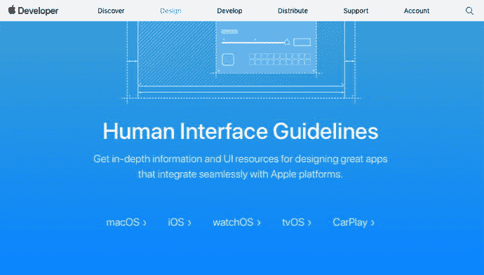

图 10-3. Apple 的`人机界面指南`

注意

Apple 的 `HIG` 不仅仅是建议或提议。Apple 对此非常重视。虽然 `HIG` 没有描述如何在代码中实现您的用户界面设计，但它对于理解实现视图和控件的正确方法非常有帮助。

以下是一些应用在 Apple `iTunes App Store` 中被拒的主要原因：

*   应用崩溃。
*   应用违反了 `HIG`。
*   应用使用了 Apple 的私有 API。
*   应用的功能与在 `iTunes App Store` 上宣传的不符。

注意

您可以在开发应用之前阅读、学习并遵循 `HIG`，也可以在应用被 Apple 拒绝、不得不重写部分或全部代码之后，再来阅读、学习并遵循 `HIG`。无论哪种方式，所有 iOS 开发者最终都会熟悉 `HIG`。

许多新的 iOS 开发者是通过惨痛教训才认识到这一点的，但如果您从一开始就遵循 `HIG`，您的 iOS 开发体验将会愉快得多。

## 使用 Interface Builder 创建示例 iPhone 应用

让我们开始构建一个生成并显示随机数的 iPhone 应用，如图 10-4 所示。这个应用将类似于您在第 4 章创建的应用，但您会看到拥有 iOS 用户界面（`UI`）后，这个应用变得有趣得多。

1. 打开 `Xcode` 并选择创建一个新的 `Xcode` 项目。确保您为 iOS 选择了 `Single View Application`，然后单击 Next，如图 10-5 所示。

   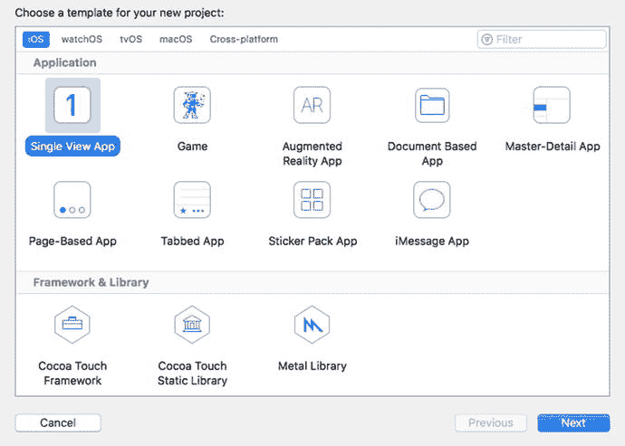

   图 10-5. 基于 `Single View Application` 模板创建 iPhone 应用

2. 将您的项目命名为 `RandomNumber`，选择 `Swift` 作为语言，然后在创建项目前单击 Next，如图 10-6 所示。

   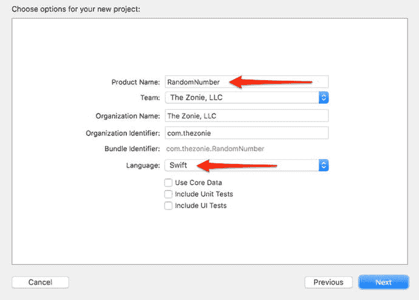

   图 10-6. 命名您的新 `Swift` 项目

3. 您的项目文件和设置将被创建并显示，如图 10-7 所示。

   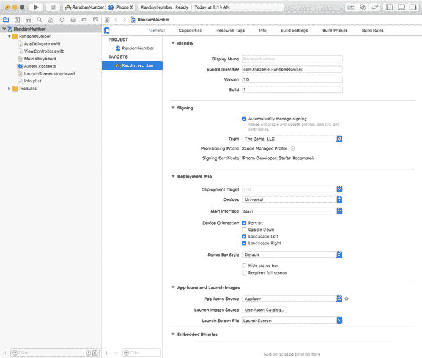

   图 10-7. 源文件

   虽然这个项目中只有一个控制器，但在开发初期就创建您的 `MVC` 分组是一种良好的编程实践。这有助于提醒您遵守 `MVC` 范式，而不是不必要地将所有代码都放在控制器中。

4. 右键单击 `RandomNumber` 文件夹，然后选择 New Group，如图 10-8 所示。

   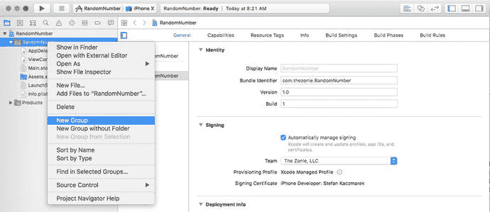

   图 10-8. 创建新分组

5. 创建一个 `Models` 分组、一个 `Views` 分组和一个 `Controllers` 分组。

6. 将 `ViewController.swift` 文件拖到 `Controllers` 分组。将 `Main.storyboard` 和 `LaunchScreen.storyboard` 文件拖到 `Views` 分组。拥有这些分组可以提醒您在开发代码时遵循 `MVC` 设计模式，并防止您将所有代码都放在控制器中，如图 10-9 所示。

   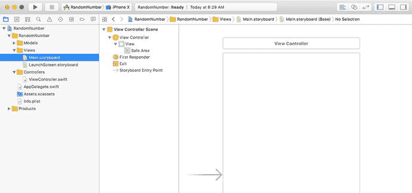

   图 10-9. 包含已组织好的控制器和故事板文件的 `MVC` 分组

7. 点击 `Main.storyboard` 文件以打开 `Interface Builder`。

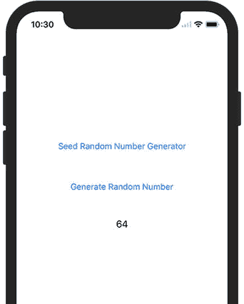

图 10-4. 完成的 iOS 随机数生成器应用


### 使用 Interface Builder

启动 Interface Builder 并开始编辑视图最常见的方法是点击关联的故事板文件，如图 10-10 所示。

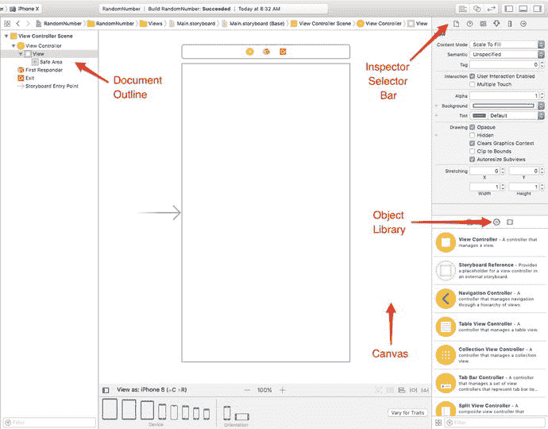

图 10-10. 工作区窗口中的 Interface Builder

当 Interface Builder 打开后，你可以在画布上看到你的场景。现在你可以设计用户界面了。首先，你需要了解 Interface Builder 中的一些子窗口。

### 文档大纲

故事板显示了视图所包含的所有对象。以下是这些对象的一些示例：

- 按钮
- 标签
- 文本字段
- 网页视图
- 地图视图
- 选择器视图
- 表格视图

> **注意：** 你可以展开文档大纲的宽度，以查看所有对象的详细列表，如图 10-10 所示。若想为画布腾出更多空间，你可以缩小或隐藏文件导航器。

### 对象库

对象库是你发挥创造力的地方。它包含了一个琳琅满目的对象集合，你可以将它们拖放到视图中。

- 通过移动视图中间的分隔条，可以放大或缩小库面板，如图 10-11 所示。

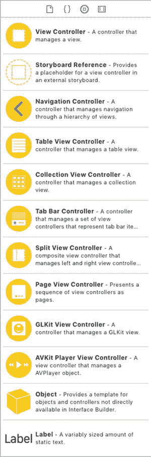

图 10-11. 展开库面板以查看更多控件，并滑动分隔条以使用鼠标调整窗口大小

点击图 10-12 中的图标视图按钮，可以更紧凑地查看对象库内容，如图 10-13 所示。

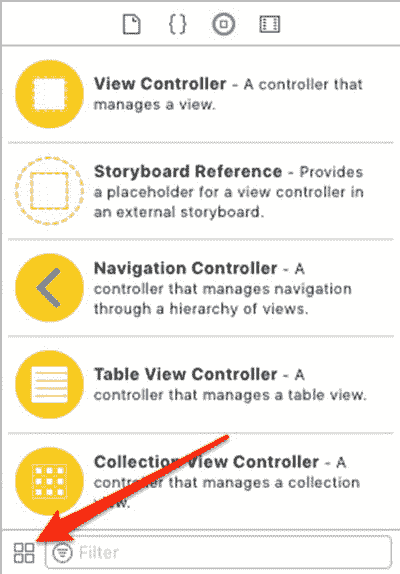

图 10-12. 对象库图标视图按钮

对于 Cocoa Touch 对象，库中包含以下内容：

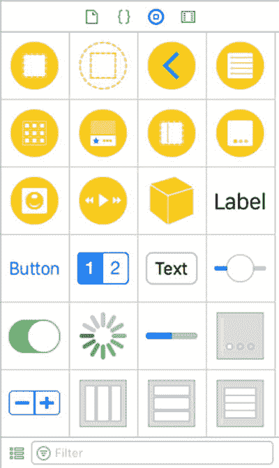

图 10-13. 对象库中的各种 Cocoa Touch 对象

- 控件
- 数据视图
- 手势识别器
- 对象与控制器
- 窗口与栏

### 检查器面板与选择器栏

检查器面板使你能够更改控件的属性，从而让对象听命于你。检查器面板顶部有六个标签，如图 10-14 所示。

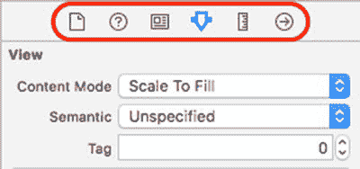

图 10-14. 属性检查器与选择器栏

- 文件检查器
- 快速帮助检查器
- 身份检查器
- 属性检查器
- 尺寸检查器
- 连接检查器

### 创建视图

随机数生成器在视图中包含三个对象：一个标签和两个按钮。一个按钮用于生成种子，另一个按钮用于生成随机数，而标签则用于显示应用生成的随机数。

1.  在对象库中滚动，将两个按钮和一个标签拖拽到视图控制器场景中，如图 10-15 所示。

    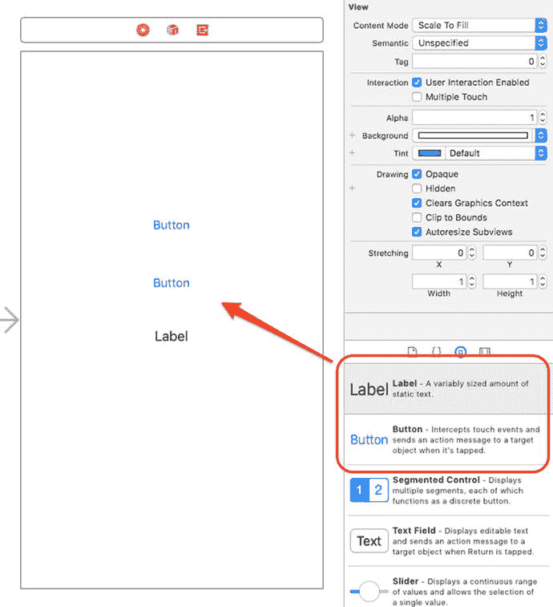

    图 10-15. 在视图中放置对象

2.  双击第一个按钮，将其标题更改为“种子随机数生成器”，然后双击第二个按钮，将其标题更改为“生成随机数”，如图 10-16 所示。

    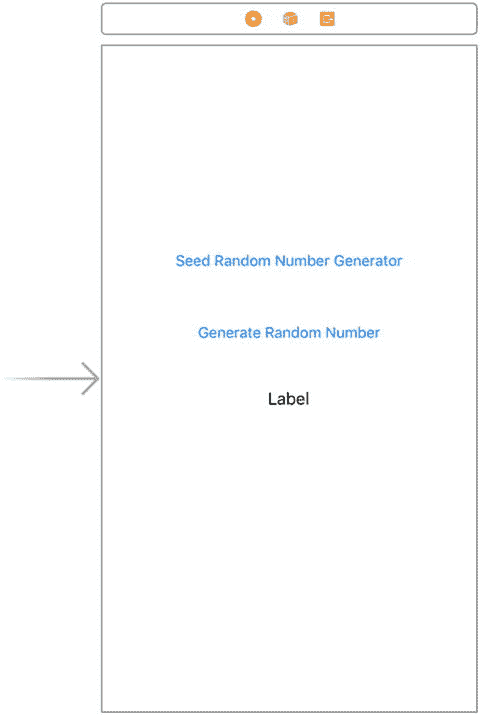

    图 10-16. 重命名按钮标题

    现在你即将体验 Xcode 的一个出色功能。你可以快速便捷地将输出口和操作连接到代码。实际上，Xcode 做得更绝——它会为你自动生成部分代码。你只需拖放即可。

3.  点击屏幕右上角的助理编辑器图标。这会显示在故事板中选中的视图所关联的 `.swift` 文件，如图 10-17 所示。

    > **注意：** 如果点击助理编辑器图标后没有显示正确的关联 `.swift` 文件，请确保你已选中并高亮显示了该视图。同时，必须在助理编辑器的跳转栏中选择“自动”。

    

    图 10-17. 使用助理编辑器显示 `.swift` 文件

### 使用输出口

现在，你可以通过创建输出口将标签连接到你的代码。

1.  按住 Control 键从视图中的标签拖拽至类文件的顶部，如图 10-18 所示。操作方法是：在键盘上按住 Control 键的同时，用鼠标点击并拖拽。你也可以右键点击并拖拽。

    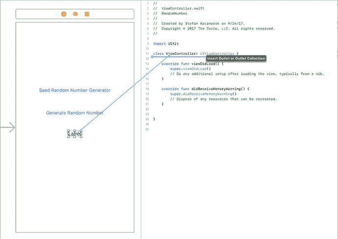

    图 10-18. 按住 Control 键拖拽以创建输出口

2.  将出现一个弹出窗口。你可以在此命名并指定输出口的类型。

    

    图 10-18. （重复）按住 Control 键拖拽以创建输出口

3.  将输出口命名为 `randomNumberLabel`，如图 10-19 所示，然后点击“连接”按钮。

    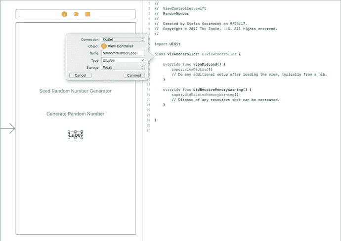

    图 10-19. `randomNumberLabel` 输出口的弹出窗口

输出口的代码已创建，并且该输出口现在已连接到 `Main.storyboard` 文件中的标签对象。第 12 行旁边的阴影圆圈表示该输出口已连接到 `Main.storyboard` 文件中的一个对象，如图 10-20 所示。

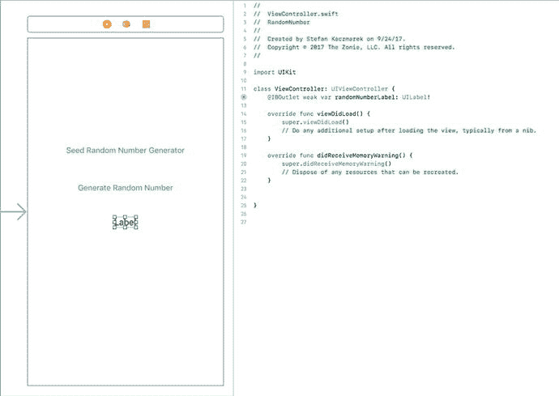

图 10-20. 生成并连接到标签对象的输出口属性代码

这里有一个对你来说可能是新概念的声明，叫做 `IBOutlet`，通常简称为输出口。输出口向控制器发出信号，表明此属性已连接到 Interface Builder 中的一个对象。`IBOutlet` 将使 Interface Builder 能够看到该输出口，并允许你将属性连接到 Interface Builder 中的对象。

用电墙插座来类比，这些属性输出口就是连接到对象的。使用 Interface Builder，你可以将这些属性连接到相应的对象。当你更改已连接输出口的属性时，其所连接的对象也会自动更改。

### 使用操作

用户界面对象事件（也称为操作）会触发方法。

现在你需要将对象操作连接到按钮上。

1.  按住 Control 键从“种子随机数生成器”按钮拖拽到类的底部。按图 10-21 所示完成弹出窗口的设置，然后点击“连接”按钮。确保你将连接类型更改为“操作”，而不是“输出口”。

    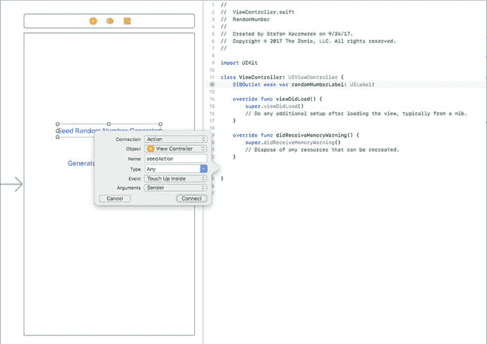

    图 10-21. 为种子方法完成弹出窗口的设置

2.  对“生成随机数”按钮重复上述步骤，在 `ViewController` 类中创建一个 `generateAction` 方法。


### 类

现在剩下的工作就是在控制器的`.swift`文件中完成插座变量和动作方法的代码。

打开`ViewController.swift`文件，完成`seedAction`和`generateAction`方法，如图 10-22 所示。

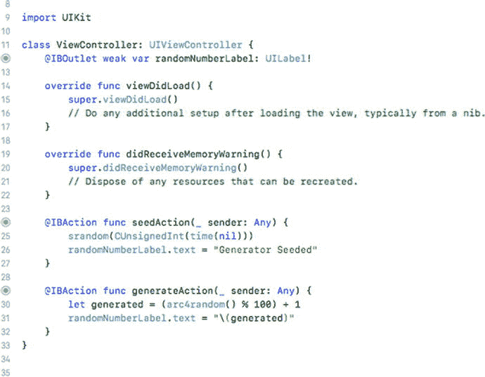

图 10-22 已完成的`seedAction`和`generateAction`方法

有些代码需要进一步审视。下面这行代码用于产生随机数生成器的种子，这样每次运行应用时都能获得不同的随机数。虽然有更简单的方式实现，但本节的目的只是让你了解动作方法和插座变量的工作原理。

```
srandom(CUnsignedInt(time(nil)))
```

在以下代码中，属性`text`设置了视图中的`UILabel`值。你在 Interface Builder 中为插座变量与`Label`对象建立的连接会自动完成所有工作。

```
randomNumberLabel.text
```

现在只需要再做一件事。选择`Main.storyboard`文件，然后选中你的视图控制器场景。接着，点击“解决自动布局问题”按钮，再选择“添加缺失约束”。这会让你要添加的控件在视图中正确居中，如图 10-23 所示。

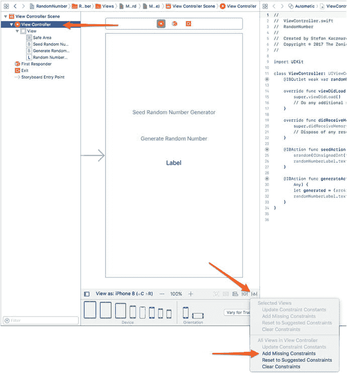

图 10-23 添加缺失约束

就这样！

要在 iPhone 模拟器中运行你的 iPhone 应用，点击“播放”按钮。应用应该在模拟器中启动，如图 10-24 所示。

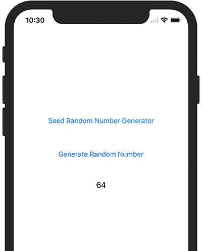

图 10-24 在 iOS 模拟器中运行的随机数生成器应用

要生成随机数，请点击“生成随机数”按钮。

## 小结

做得好！Interface Builder 为你创建用户界面节省了大量时间。你在应用中有强大的对象集可供使用，只需编写少量代码。

Interface Builder 处理了许多通常需要你手动处理的细节。

你应该熟悉以下术语：

- 故事板和 XIB 文件
- 模型-视图-控制器
- 架构模式
- 人机界面指南 (HIG)
- 插座变量
- 动作方法

## 练习

- 扩展随机数生成器应用，使其在启动时在`Label`对象中显示日期和时间。
- 在显示日期和时间标签后，添加一个按钮，用于用新时间更新该日期和时间标签。

# 11. 存储信息

作为开发者，你会遇到许多需要存储数据的不同场景。用户会期望你的应用每次启动时能记住偏好设置和其他信息。前面的章节讨论了`BookStore`应用。对于这个应用，用户会期望你的应用记住书店中的所有书籍。你的应用需要一种方法来存储这些信息、检索信息，并可能对数据进行搜索和排序。处理数据有时会有些困难。幸运的是，Apple 提供了方法和框架来简化这个过程。

本章讨论两种需要存储数据的不同格式。首先介绍如何在 iOS 设备上保存偏好设置文件，然后讨论如何在应用中使用 SQLite 数据库来存储和检索数据。

## 存储考量

Mac 和 iPhone 在存储方面有一些主要差异，这些差异会影响你处理数据的方式。我们先讨论 Mac 以及如何针对它进行开发。

在 Mac 上，默认情况下，应用程序存储在`Applications`文件夹中。每个用户都有自己的 home 文件夹，用于存储与该用户相关的偏好设置和信息。并非所有用户都有权限写入`Applications`文件夹或应用程序包本身。

在 iPhone 和 iPad 上，开发者不需要处理不同用户的问题。每个使用 iPhone 的人都有相同的权限和相同的文件夹。不过，对于 iPhone，还有其他因素需要考虑。iOS 设备上的每个应用程序都在自己的沙盒中。这意味着应用程序写入的文件只能被该应用程序本身查看和使用。这为 iPhone、iPad、Apple TV 和 Apple Watch 提供了更安全的环境，但同时也改变了处理数据存储的方式。

## 数据库

你已经学习了如何存储一些小段信息并在以后检索它们。如果有更多信息需要存储怎么办？如果需要对信息进行搜索或排序怎么办？这种场景下就需要用到数据库。

数据库是一种以易于搜索或检索的方式存储大量信息的工具。从数据库读取数据时，返回的是数据片段，而不是整个文件。你日常生活中使用的许多应用都基于某种数据库。你的网上银行应用从数据库中检索账户活动。你的超市使用数据库检索不同商品的价格。一个简单的数据库例子是电子表格。电子表格中可能有很多列和很多行。电子表格中的列代表你要存储的不同类型的信息。在数据库中，这些被称为属性。电子表格中的行则会被视为数据库中的不同记录。


# 在数据库中存储信息

对于开发者而言，数据库通常是个令人望而生畏的主题；大多数开发者会将数据库与 Microsoft SQL Server 或 Oracle 这类企业级数据库服务器联系起来。这些应用程序需要花费时间进行设置，并且需要持续管理。对于大多数开发者来说，像 Oracle 这样的数据库系统可能过于复杂。幸运的是，苹果公司在 iOS、macOS 和 tvOS 中内置了一个小巧高效的数据库引擎，名为 SQLite。这让你能够获得复杂数据库服务器的许多功能，而无需承担其开销。

`SQLite` 在为应用程序存储信息方面提供了极大的灵活性。它将整个数据库存储在一个单一文件中。它速度快、可靠，并且易于在你的应用程序中实现。关于 `SQLite` 数据库最棒的一点是，无需安装任何软件；苹果公司已经为你处理好了这一切。

然而，作为开发者，你应当了解 `SQLite` 存在的一些局限性。

- `SQLite` 被设计为单用户数据库。你不应在需要多人同时访问同一数据库的环境中使用 `SQLite`。这可能导致数据丢失或损坏。
- 在商业领域，数据库可能会变得非常庞大。数据库管理员处理规模高达半 TB 的数据库并不罕见，在某些情况下，数据库甚至可能变得更大。`SQLite` 应当能够毫无问题地处理较小的数据库，但如果你的数据库开始变得过大，你就会开始遇到性能问题。
- `SQLite` 缺乏企业级数据库解决方案所具备的一些备份和数据恢复功能。

在本章中，你将专注于使用 `SQLite` 作为你的数据库引擎。如果你正在开发的应用程序中存在上述任何局限性，你可能需要考虑企业级数据库解决方案，但这已超出了本书的讨论范围。

**注意**

`SQLite`（发音为“sequel-lite”）的名字源自结构化查询语言（`SQL`，发音为“sequel”）。`SQL` 是一种用于向数据库输入、搜索和检索数据的语言。

苹果公司已经努力解决了数据库开发中的许多挑战。作为开发者，你无需熟悉 `SQL`，因为苹果公司通过一个名为 Core Data 的框架为你处理了直接的数据库交互，这使得与数据库的交互变得更加容易。Core Data 是苹果公司从 NeXT 的产品 Enterprise Object Framework 改编而来，并且使用 Core Data 比直接与 `SQLite` 数据库交互要容易得多。通过 `SQL` 直接访问数据库超出了本书的讨论范围。

# 开始使用 Core Data

让我们从创建一个新的 Core Data 项目开始。

1.  打开 Xcode 并选择 **File** ➤ **New** ➤ **Project**。要创建一个 iOS Core Data 项目，请从顶部菜单中选择 **iOS**。然后选择 **Single View App**，如图 11-1 所示。

    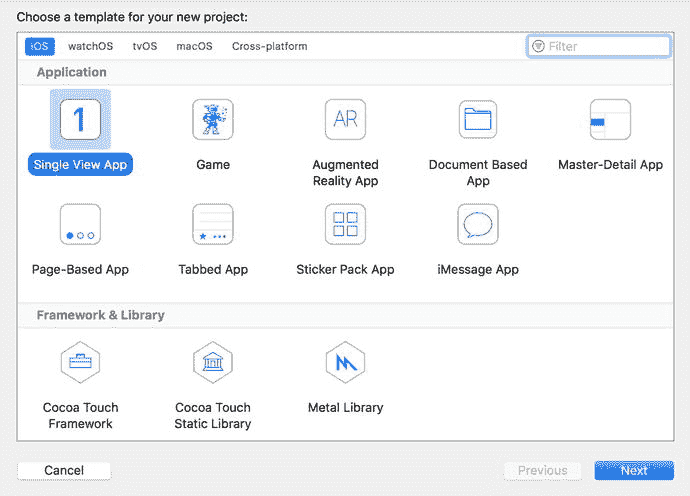

    **图 11-1.** 创建新项目

2.  完成后点击 **Next** 按钮。下一个界面将允许你输入你想要使用的名称。在本章中，你将使用名称 `BookStore`。

3.  靠近底部，你会看到一个名为 **Use Core Data** 的复选框。确保此项已勾选，然后点击 **Next**，如图 11-2 所示。

    **注意** Core Data 可以在任何时候添加到任何项目中。在创建项目时勾选该复选框，会将 Core Data 框架和一个默认数据模型添加到你的应用程序中。如果你知道自己将使用 Core Data，勾选此框将为你节省时间。

    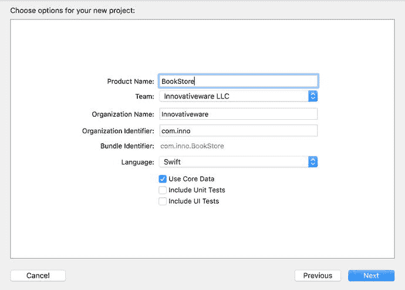

    **图 11-2.** 将 Core Data 添加到项目中

4.  选择保存项目的位置，然后点击 **Create**。

完成后，你的新项目将会打开。它看起来类似于一个标准应用程序，不过现在你会多出一个 `BookStore.xcdatamodeld` 文件。这个文件被称为数据模型，它将包含你将要在 Core Data 中存储的数据的相关信息。

## 模型

点击模型文件（`BookStore.xcdatamodeld`）将其打开。你将看到一个类似于图 11-3 所示的窗口。

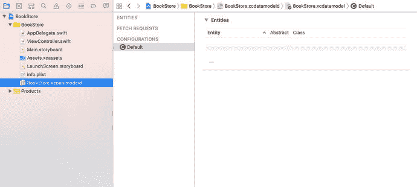

**图 11-3.** 空白的模型

窗口分为四个部分。在左侧，是你的实体。用更常见的术语来说，这些就是你想在数据库中存储的对象或项目。

右上部分包含实体的属性。属性是关于实体的信息片段。例如，一本书是一个实体，而书的标题是该实体的一个属性。

**注意**

在数据库术语中，实体就是你的表，实体的属性被称为列。由这些实体创建的对象被称为行。

右侧面板的中间部分将显示一个实体的所有关系。关系将一个实体与另一个实体连接起来。例如，你将创建一个 `Book` 实体和一个 `Author` 实体。然后你将它们关联起来，以便每本书都可以有一个作者。屏幕的右下部分处理的是提取属性。提取属性超出了本书的讨论范围，但它们允许你为数据创建过滤器或查询。

让我们创建一个实体。

1.  点击窗口左下角的加号，或者从菜单中选择 **Editor** ➤ **Add Entity**，如图 11-4 所示。

    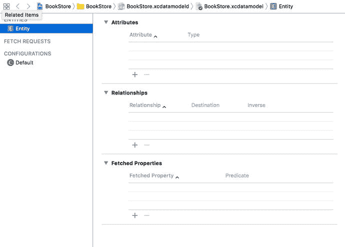

    **图 11-4.** 添加新实体

2.  在左侧，双击 **Entity** 名称并将其更改为 `Book`。

    **注意** 实体名称必须大写首字母。

3.  现在让我们添加一些属性。属性可以被视为一本书的详细信息，因此你将存储书名、作者、价格和出版年份。显然，在你自己的应用程序中，你可能想要存储更多信息，例如出版商、页数和类型，但我们要从简单的开始。点击窗口右下角的加号，或者选择 **Editor** ➤ **Add Attribute**，如图 11-5 所示。如果你没有看到添加属性的选项，请确保你已经在左侧选中了 `Book` 实体。

    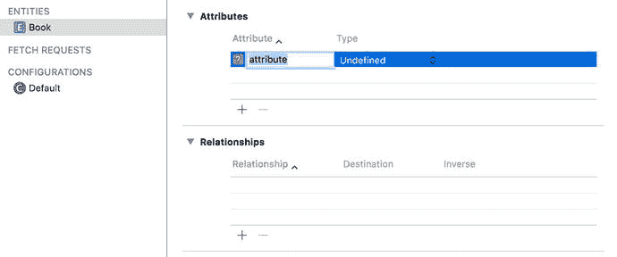

    **图 11-5.** 添加属性


## 添加新属性

对于属性，你只需指定两个选项：名称和数据类型。不妨将此属性命名为 `title`。与实体不同，属性名称必须为小写。

接下来，你需要选择一种数据类型。选择正确的数据类型至关重要，它将影响数据在数据库中的存储和检索方式。列表中共有 13 个选项，可能让人望而生畏。我们将讨论最常用的选项，随着你对 Core Data 的熟悉，可以尝试其他选项。最常用的选项包括 `String`、`Integer 32`、`Decimal` 和 `Date`。对于书籍标题，请选择 `String`。

- `String`：这是用于存储文本的属性类型。该类型应存储任何非数字或日期的信息。在此示例中，书名和作者姓名将是字符串。
- `Integer 32`：一个属性有三种可能的整数值类型。这些整数类型的区别仅在于最小值和最大值不同。在存储整数时，`Integer 32` 通常能满足大多数需求。整数是**无**小数点的数字。如果尝试将小数保存到整数属性中，小数部分将被截断。在此示例中，出版年份将是一个整数。
- `Decimal`：`Decimal` 是一种可以存储带有小数点的数字的属性类型。`Decimal` 与 `Double` 属性类似，但它们在最小值、最大值和精度上有所不同。`Decimal` 应能处理任何货币值。在此示例中，你将使用 `Decimal` 来存储书籍价格。
- `Date`：`Date` 属性顾名思义。它允许你存储日期和时间，并基于这些值执行搜索和查找。在此示例中，你不会使用此类型。

现在，让我们为书籍创建其余属性。接着，添加 `price`，它应为 `Decimal`。再添加书籍的出版年份。对于由两个单词组成的属性，标准做法是将第一个单词设为小写，第二个单词的首字母大写。例如，书籍出版年份属性的理想名称是 `yearPublished`。选择 `Integer 32` 作为属性类型。添加完所有属性后，你的屏幕应类似于图 11-6。

> **注意：** 属性名称不能包含空格。

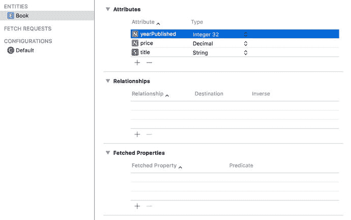

**图 11-6.** 完成后的 `Book` 实体

> **注意：** 如果你有使用数据库的经验，会注意到你并没有添加主键。主键是一个字段（通常为数字），用于唯一标识数据库中的每条记录。在 Core Data 数据库中，无需创建主键。框架会为你处理这一切。

现在，你已经完成了 `Book` 实体，让我们添加一个 `Author` 实体。

1. 添加一个新实体，并将其命名为 `Author`。
2. 为此实体添加 `lastName` 和 `firstName`，两者均为字符串。

完成后，你的实体列表中应该有两个实体。现在你需要添加关系。

1. 单击 `Book` 实体，然后按住屏幕右下角的加号（+）按钮。选择 `添加关系 (Add Relationship)`，如图 11-7 所示。（你也可以点击 Core Data 模型“关系 (Relationships)”部分下的加号。）

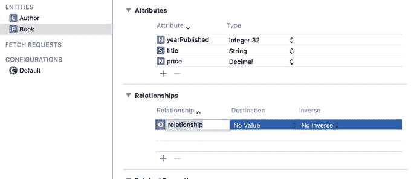

**图 11-7.** 添加新关系

2. 你将有机会为关系命名。通常，关系的名称与你引用的实体名称相同。输入 `author` 作为名称，然后从“目标 (Destination)”下拉菜单中选择 `Author`。

3. 你已经创建了关系的一半。要创建另一半，请单击 `Author` 实体。点击屏幕右下角的加号（+），然后选择 `添加关系 (Add Relationship)`。使用你要连接的实体名称作为此关系的名称，因此将其命名为 `books`。（你在关系名称后添加了 `s`，因为一个作者可以有多本书。）在“目标 (Destination)”下选择 `Book`，在“反向 (Inverse)”下选择你上一步创建的 `author` 关系。在屏幕右侧的“实用工具 (Utilities)”窗口中，选择“数据模型检查器 (Data Model Inspector)”。将此关系的类型设置为“对多 (To Many)”。现在，你的模型应如图 11-8 所示。

> **注意：** 有时在 Xcode 中处理模型时，需要按 `Tab` 键来更新实体、属性和关系的名称。这个小特性可以追溯到 WebObjects 工具。

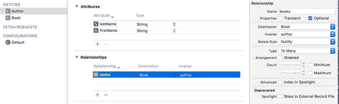

**图 11-8.** 最终的关系

默认情况下，Xcode 现在会识别并能使用你的新实体。如果你需要自定义 Core Data 对象，例如添加验证或自定义计算属性，则需要告诉 Xcode 为你生成 `NSManagedObject` 子类。在本章中，我们将使用 Xcode 的默认实现。你可以通过点击实体，然后查看右侧的“数据模型检查器 (Data Model Inspector)”（如图 11-9 所示），来确认 Xcode 将在运行时生成这些文件。确保 `Codegen` 设置为 `类定义 (Class Definition)`。

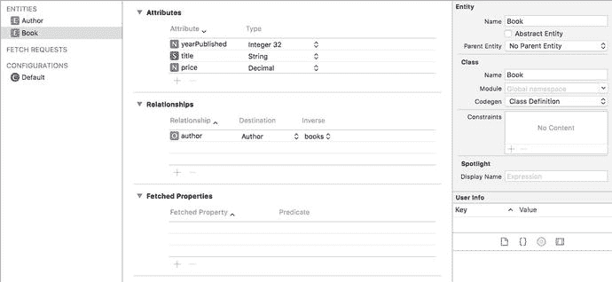

**图 11-9.** 检查实体的 `Codegen` 状态

当 Xcode 为你的实体生成类定义时，它会创建 `NSManagedObject` 的子类。`NSManagedObject` 是处理所有 Core Data 数据库交互的对象。它提供了你在此示例中将使用的方法和属性。

### 托管对象上下文

Xcode 将创建一个名为 `Book` 的托管对象类。在 Core Data 中，每个托管对象都应在托管对象上下文中存在。上下文负责跟踪对象的更改、执行撤销操作以及将数据写入数据库。这很有用，因为你现在可以一次保存大量更改，而不是逐个保存。这加快了保存记录的过程。作为开发者，你不需要跟踪对象何时被更改。托管对象上下文会为你处理所有这一切。


### 设置界面

以下步骤将帮助你设置界面：

1.  在你的项目中的 `BookStore` 文件夹里，应该有一个 `Main.storyboard` 文件。点击该文件，Xcode 会在编辑窗口中将其打开，如图 11-10 所示。

    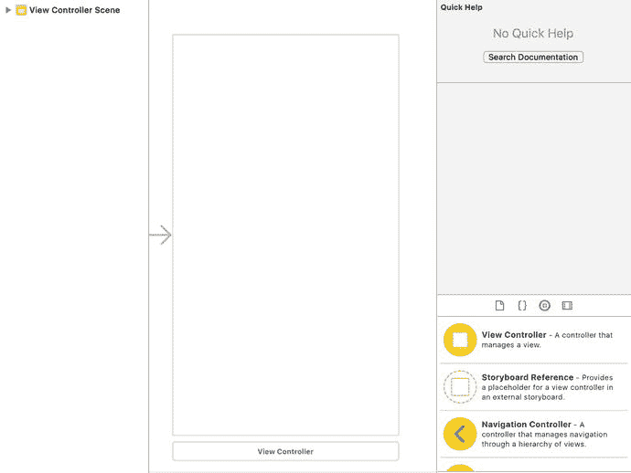

    *图 11-10. 创建界面*

2.  此时应该有一个空白窗口。要为你的窗口添加一些功能，你需要从对象库中添加一些对象。在屏幕右下角的搜索字段中输入 `table`。这会筛选出相关对象，你应该能看到 `Table View Controller` 和 `Table View`。将 `Table View` 拖拽到视图中，如图 11-11 所示。

    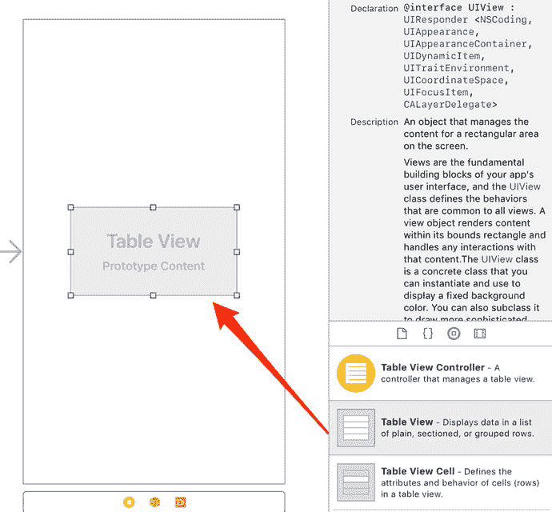

    *图 11-11. 添加 Table View*

3.  现在你有了一个 `Table View`。你需要拉伸 `Table View` 以填充你的视图。拖拽 `Table View` 的四个角，使其覆盖整个视图，如图 11-12 所示。

    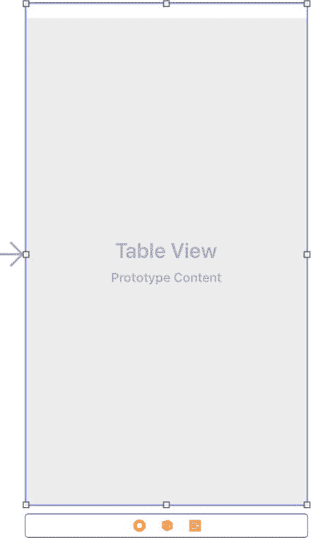

    *图 11-12. 拉伸 Table View*

4.  要在你的 `Table View` 中创建单元格，你需要添加一个 `UITableViewCell`。你当前搜索 `table` 的结果应该会在 `Table View` 对象下方显示一个 `Table View Cell`。将一个 `Table View Cell` 拖拽到你的表格中。现在你的视图上就有了一个表格和一个单元格，如图 11-13 所示。

    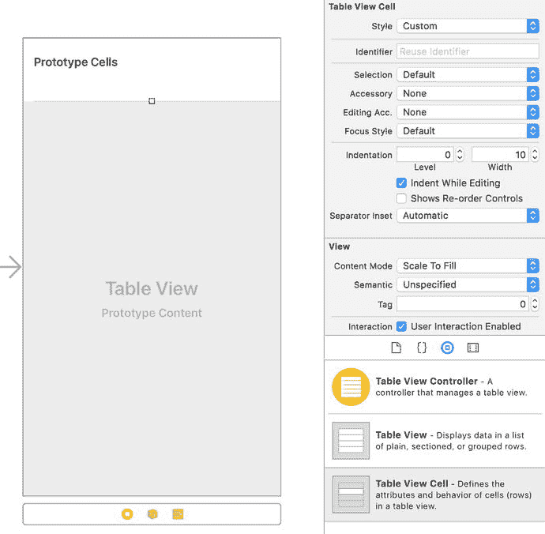

    *图 11-13. 添加 Table View Cell*

5.  选择该单元格，然后在工具区（utilities section）的属性检查器（Attributes Inspector）中，将 `Style` 设置为 `Basic`。同时，将 `Identifier` 设置为 `Cell`。当你的 `Table View` 包含多种样式的单元格时，需要使用标识符。你需要用唯一的标识符来区分它们。在大多数项目中，你可以将其设置为 `Cell` 而无需过多担心，如图 11-14 所示。

    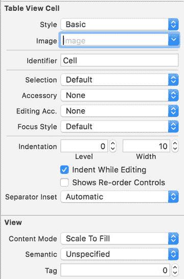

    *图 11-14. 更改单元格的样式和标识符*

6.  使用 `Table View` 时，通常最好将其放入一个 `Navigation Controller` 中。你将使用 `Navigation Controller` 来腾出空间，以便在你的 `Table View` 上放置一个“添加”（Add）按钮。要添加 `Navigation Controller`，请在场景列表（Scene list）中选择你的 `View Controller`，场景列表是故事板左侧显示你的 `View Controllers` 的窗口（你的 `View Controller` 旁边会有一个黄色图标）。从应用程序菜单中，选择**编辑器（Editor）** ➤ **嵌入于（Embed In）** ➤ **导航控制器（Navigation Controller）**，如图 11-15 所示。

    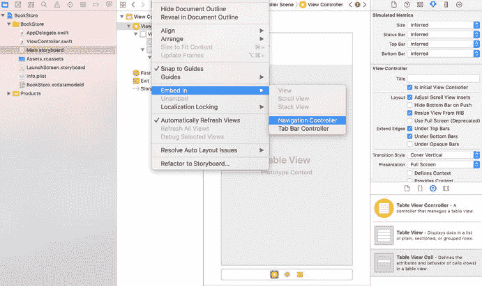

    *图 11-15. 嵌入 Navigation Controller*

7.  现在你的视图顶部会有一个导航栏。接下来你需要在导航栏上添加一个按钮。这种类型的按钮叫做 `UIBarButtonItem`。在你的对象库中搜索 `bar button`，然后将一个 `Bar Button Item` 拖拽到视图右上角的导航栏上，如图 11-16 所示。

    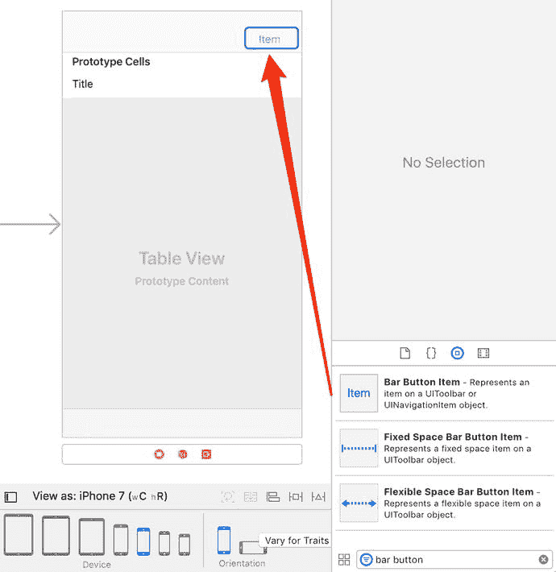

    *图 11-16. 向导航栏添加 Bar Button Item*

8.  选择该 `Bar Button Item`，并将 `System Item` 从 `Custom` 更改为 `Add`，如图 11-17 所示。这会将 `Bar Button Item` 的外观从文字 `Item` 更改为一个加号图标。

    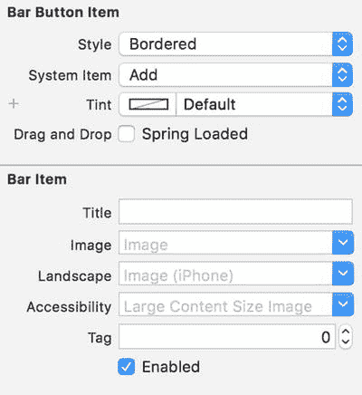

    *图 11-17. 更改 Bar Button Item*

9.  现在你已经创建好了界面，需要将其连接到你的代码。按住 **Control** 键，将你的 `Table View` 拖拽到**文档大纲（Document Outline）**中的 `View Controller` 上，如图 11-18 所示。

    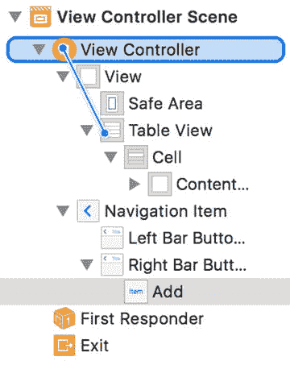


## 图 11-18. 连接表格视图

1.  将出现一个弹出窗口，允许你选择 `dataSource` 或 `delegate`，如图 11-19 所示。你需要将两者都分配给视图控制器。选择项目的顺序无关紧要，但你需要按住 Control 键将表格视图拖拽两次。

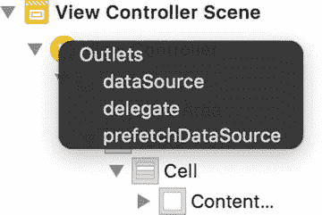

## 图 11-19. 连接表格视图

2.  现在你的表格视图应该已经准备好了。你需要连接你的按钮，使其能够执行操作。在 Xcode 窗口的右上角，点击辅助编辑器按钮（看起来像两个圆圈）。这将在右侧打开你的代码，并在左侧打开你的故事板。现在按住 Control 键将你的“添加”按钮拖拽到右侧的视图控制器代码中，如图 11-20 所示。

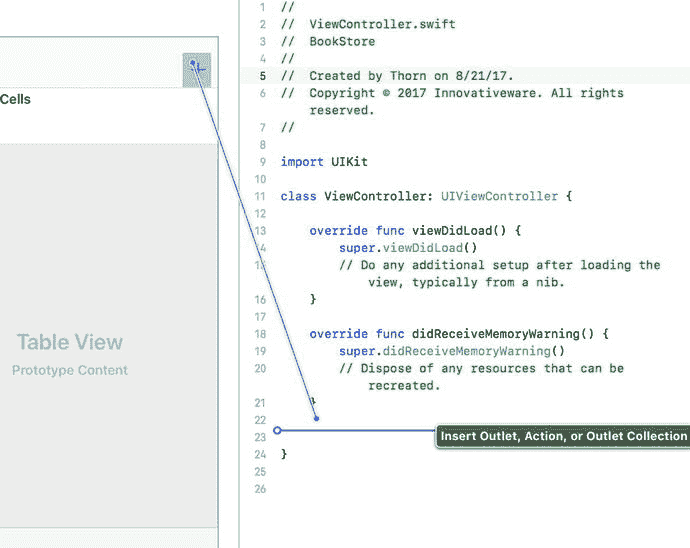

## 图 11-20. 为按钮对象添加操作

3.  只要将“添加”按钮放置在你的类中并且不在任何方法内部，它放在代码中的位置就无关紧要。为了有序组织，它应该放在类属性之后。当你松开鼠标时，系统会提示你选择要创建的连接类型。将连接（Connection）设置为操作（Action）。然后为你新方法添加一个名称，例如 `addNew`，如图 11-21 所示。点击连接（Connect）完成连接。

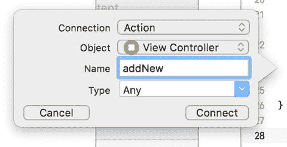

## 图 11-21. 更改连接的类型和名称

4.  你还需要为你的表格视图创建一个输出口。将表格视图从视图控制器场景拖拽到代码顶部（紧挨类定义下方，如图 11-22 所示）。确保连接设置为输出口（Outlet），并将表格视图命名为 `myTableView`。稍后你将需要这个输出口来告诉你的表格视图进行刷新。点击连接（Connect）完成连接。

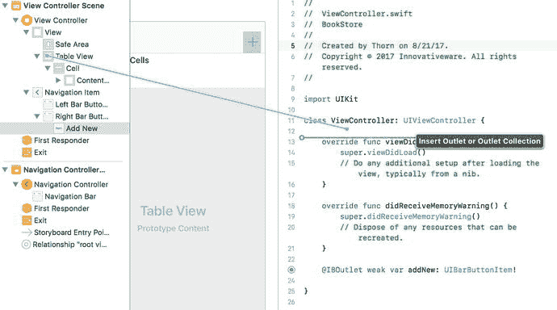

## 图 11-22. 为表格视图创建输出口

界面现在已经完成了，但你仍然需要添加代码来让界面执行操作。回到标准编辑器（点击 Xcode 工具栏右上角两个圆圈图标左侧的列表图标），并从左侧文件列表中选择 `ViewController.swift` 文件。由于现在你有一个需要关注的表格视图，你需要告诉你的类它可以处理表格视图。将文件顶部的类声明修改为以下内容：

```
class ViewController: UIViewController, UITableViewDelegate, UITableViewDataSource {
```

你在声明中添加了 `UITableViewDelegate` 和 `UITableViewDataSource`。这告诉你的控制器它可以充当表格视图委托和数据源。这些被称为协议（protocols）。协议告诉一个对象它必须实现某些方法来与其他对象交互。例如，要遵守 `UITableViewDataSource` 协议，你需要实现以下方法：

```
func tableView(_ tableView: UITableView, numberOfRowsInSection section: Int) -> Int
```

没有这个方法，表格视图将不知道要绘制多少行。

在继续之前，你需要告诉你的 `ViewController.swift` 文件关于 Core Data 的信息。为此，在文件顶部 `import UIKit` 下方添加以下一行：

```
import CoreData
```

你还需要向 `ViewController` 类添加一个托管对象上下文（managed object context）。在 `class ViewController` 这行之后立即添加以下行：

```
var managedObjectContext: NSManagedObjectContext!
```

现在你已经有了一个变量来保存你的 `NSManagedObjectContext`，你需要实例化它以便可以向其中添加对象。为此，你需要将以下行添加到你的 `override func viewDidLoad()` 方法中：

```
let appDelegate: AppDelegate = UIApplication.shared.delegate as! AppDelegate
managedObjectContext = appDelegate.persistentContainer.viewContext as NSManagedObjectContext
```

第一行创建了一个指向应用程序委托的常量。第二行将你的 `managedObjectContext` 变量指向应用程序委托的 `managedObjectContext`。在整个应用程序中使用同一个托管对象上下文通常是一个好主意。

你要添加的第一个新方法是一个用于查询数据库记录的方法。调用这个方法 `loadBooks`。

```
1 func loadBooks() -> [Book] {
2     let fetchRequest: NSFetchRequest = Book.fetchRequest()
3     var result: [Book] = []
4     do {
5          result = try managedObjectContext.fetch(fetchRequest)
6     } catch {
7          NSLog("My Error: %@", error as NSError)
8     }
9     return result
10 }
```

这段代码比你之前看到的稍微复杂一些，所以我们来逐步解析一下。第 1 行声明了一个名为 `loadBooks` 的新函数，它返回一个 `Book` 数组。然后在加载完成后返回该数组。

现在你需要为你的表格视图添加数据源方法。这些方法告诉你的表格视图有多少个分区，每个分区有多少行，以及每个单元格应该是什么样子。将以下代码添加到 `ViewController.swift` 文件中：

```
1 func tableView(_ tableView: UITableView, numberOfRowsInSection section: Int) -> Int {
2     return loadBooks().count
3 }

5 func tableView(_ tableView: UITableView, cellForRowAt indexPath: IndexPath) -> UITableViewCell {
6     guard let cell = tableView.dequeueReusableCell(withIdentifier: "Cell") else { return UITableViewCell() }
7     let book: Book = loadBooks()[indexPath.row]
8     cell.textLabel?.text = book.title
9     return cell
10 }
```

在第 2 行，你调用 `Book` 数组的 `count` 方法来获取表格视图的行数。在第 5 到第 9 行，你创建并返回你的单元格。第 6 行为你创建一个可用的单元格。这是创建单元格的标准代码。标识符允许你在一个表格视图中有多种类型的单元格，但这更复杂。第 7 行从 `loadBooks()` 数组中获取你的 `Book` 对象。第 8 行将图书标题赋值给单元格中的 `textLabel`。`textLabel` 是单元格中的默认标签。这就是在表格视图中显示 `loadBooks` 方法结果所需做的全部工作。但你仍然有一个问题。你的数据库中还没有任何图书。

为了解决这个问题，你将向之前创建的 `addNew` 方法添加代码。在你创建的 `addNew` 方法内部添加以下代码：

```
1     @IBAction func addNew(_ sender: Any) {
2         let book: Book = NSEntityDescription.insertNewObject(forEntityName: "Book", into: managedObjectContext) as! Book
3         book.title = "My Book" + String(loadBooks().count)
4         do {
5             try managedObjectContext.save()
6         } catch let error as NSError {
7             NSLog("My Error: %@", error)
8         }
9         myTableView.reloadData()
10     }
```

第 2 行根据“实体（Entity）”名称在数据库中为你的图书创建了一个新的 `Book` 对象，并将该对象插入到你之前创建的 `managedObjectContext` 中。请记住，一旦对象被插入到托管对象上下文中，其更改就会被跟踪，并且可以被保存。第 3 行将图书标题设置为 `My Book` 并加上数组中的项目数量。显然，在实际应用中，你会希望将其设置为用户提供的名称或来自其他列表的名称。第 4-8 行保存了托管对象上下文。


好的，作为高级文档工程师和翻译员，我将严格遵循您给出的格式和注意事项，对提供的英文文本进行翻译。


在 Swift 3.0 中，Apple 更改了错误处理方式。Swift 4.0 的错误处理方式与 Swift 3.0 几乎相同。现在，当执行可能引发错误的操作时，可以使用`try`然后`throw`一个错误。第 9 行告诉`UITableView`重新加载自身以显示新添加的`Book`。现在构建并运行应用程序。多次点击 + 按钮。你将向对象存储中添加新的`Book`对象，如图 11-23 所示。如果你退出应用并重新启动，你会注意到数据仍然存在。

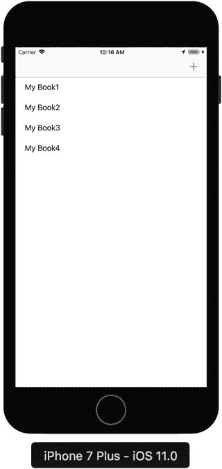

Figure 11-23. 最终应用

这是对 iOS 中 Core Data 的简要介绍。Core Data 是一个强大的 API，但也需要花费大量时间去掌握。

## 总结

以下是本章涵盖的主题摘要：

*   偏好设置：你学习了使用`UserDefaults`在 iOS、macOS、tvOS 和 watchOS 上保存和读取偏好设置文件。
*   数据库：你了解了什么是数据库，以及为何使用数据库比将信息保存到偏好设置文件更可取。
*   数据库引擎：你学习了 Apple 集成到 macOS、tvOS 和 iOS 中的 SQLite 数据库引擎及其优缺点。
*   Core Data：Apple 提供了用于与 SQLite 数据库交互的框架。该框架简化了接口的使用。
*   书店应用：你创建了一个简单的 Core Data 应用，并使用 Xcode 为你的书店创建了一个数据模型。你还学习了如何在两个实体之间建立关系。最后，你使用 Xcode 为你的 Core Data 模型创建了一个简单的接口。

## 练习

*   向应用添加一个新视图，允许用户输入书名。
*   提供一种从列表中删除图书的方法。
*   创建一个`Author`对象并将其添加到`Book`对象中。

# 12. 协议和委托

恭喜！你正在掌握成为 iOS 开发者所需的技能！然而，iOS 开发者还需要理解两个额外主题才能获得成功：协议（Protocols）和委托（Delegates）。新开发者很容易被这些主题压倒，因此我们首先介绍了 Swift 语言的基础知识。阅读本章后，你会看到协议和委托非常有用，并且不难理解和实现。

## 多重继承

我们在第 5 章讨论了对象继承。简而言之，对象继承意味着子类可以继承父类的所有特性，如图 12-1 所示。

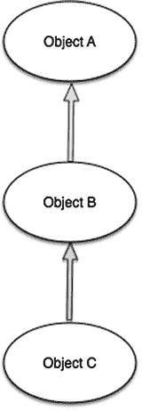

Figure 12-1. 典型的 Swift 继承

C++、Perl 和 Python 都具有称为多重继承的特性，它允许一个类从多个父类继承行为和特性，如图 12-2 所示。

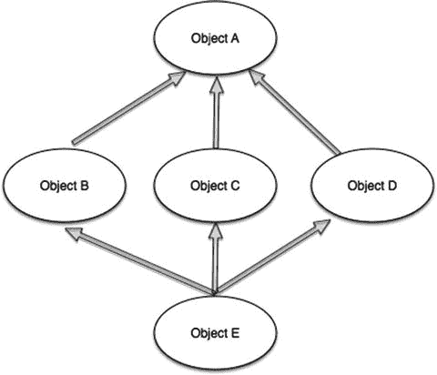

Figure 12-2. 多重继承

多重继承可能会出现问题，因为它会导致歧义。因此，Swift 不实现多重继承，而是实现了称为协议（Protocol）的机制。

## 理解协议

Apple 将协议定义为一组函数声明的列表，与类定义无关。协议类似于类，不同之处在于协议不提供任何需求的实现；它只描述实现应具有的外观。

类可以采用该协议来提供这些需求的实际实现。任何满足协议要求的类型都被称为符合该协议。

## 协议语法

协议的定义方式与类类似，如清单 12-1 所示。

```
protocol RandomNumberGenerator {
    var mustBeSettable: Int { get set }
    var doesNotNeedToBeSettable: Int { get }
    func random() -> Double
}
```
*Listing 12-1. 协议定义*

如果某个类有父类，则需要在它采用的任何协议之前列出父类名称，后跟逗号，如清单 12-2 所示。

```
class MyClass: MySuperclass, RandomNumberGenerator, AnotherProtocol {
    // 类定义写在这里
}
```
*Listing 12-2. 协议在父类之后列出*

协议还指定每个属性必须具有 gettable（可获取）或 gettable 和 settable（可获取和可设置）的实现。gettable 属性是只读的，而 gettable 和 settable 属性则不是（如前面的清单 12-1 所示）。

属性始终声明为变量属性，前缀为`var`。gettable 和 settable 属性在其类型声明后通过`{ get set }`表示，而 gettable 属性则通过`{ get }`表示。

## 委托

委托是一种设计模式，它允许一个类或结构体将其部分职责转交（或委托）给另一种类型的实例。这种设计模式通过定义一个封装了委托职责的协议来实现。委托可用于响应特定操作或从外部源检索数据，而无需了解该外部源的底层类型。

清单 12-3 定义了两个用于随机数字猜测游戏的协议。

```
protocol RandomNumberGame {
    var machine: Machine { get }
    func play()
}

protocol RandomNumberGameDelegate {
    func gameDidStart(game: RandomNumberGame)
    func game(game: RandomNumberGame, didStartNewTurnWithGuess randomGuess: Int)
    func gameDidEnd(game: RandomNumberGame)
}
```
*Listing 12-3. 协议定义*

`RandomNumberGame`协议可以被任何涉及随机数生成和猜测的游戏采用。`RandomNumberGameDelegate`协议可以被任何类型的类采用，以跟踪`RandomNumberGame`协议的进度。

## 协议和委托示例

本节将向你展示如何创建一个更复杂的随机数字猜测应用，以说明如何使用协议和委托。应用的主视图显示用户的猜测以及该猜测是高了、低了还是正确，如图 12-3 所示。

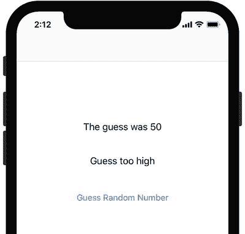

Figure 12-3. 猜测游戏应用主视图

当用户点击“Guess Random Number”按钮时，他们将被带到一个输入屏幕以输入他们的猜测，如图 12-4 所示。

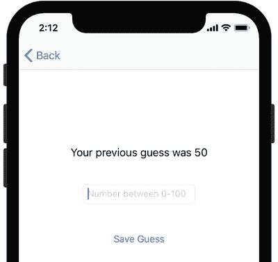

Figure 12-4. 猜测游戏应用用户输入视图

当用户输入他们的猜测时，委托方法将猜测传回主视图，然后主视图显示结果。


# 开始使用

请按照以下步骤创建应用：

1.  基于"单视图应用"模板创建新的 Swift 项目，将其命名为 `RandomNumberDelegate` 并保存，如图 12-5 所示。

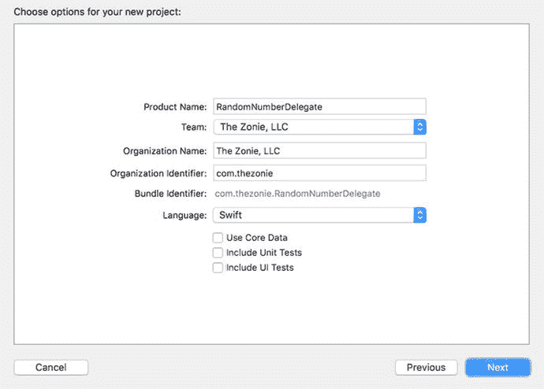

图 12-5. 创建项目

2.  在文档大纲中，选择 `View Controller`。然后选择"编辑器"➤ "嵌入于"➤ "导航控制器"。这会将您的 `View Controller` 嵌入到 `Navigation Controller` 中，使您能够轻松地在其他视图控制器之间来回切换，如图 12-6 所示。

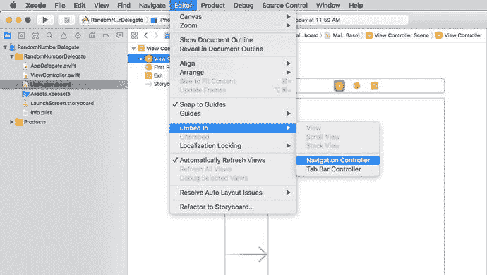

图 12-6. 在导航控制器中嵌入视图控制器

3.  在 `View Controller` 中，添加两个 `Label` 对象和两个 `Button` 对象，并添加它们各自的四个输出口来控制视图，如图 12-7 所示。

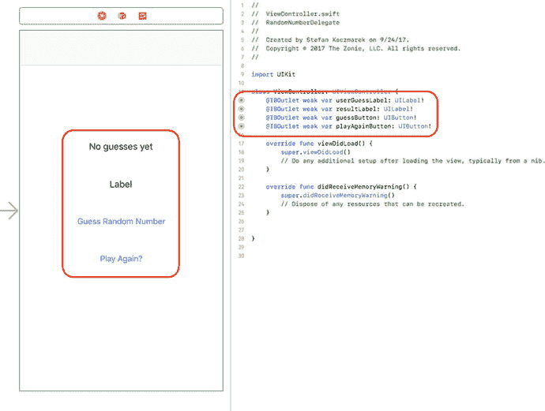

图 12-7. 控制视图所需的输出口

4.  接下来，将列表 12-4 中的操作连接到 `playAgainButton`。

```
    27     // 由 playAgainButton 触发的事件
    28     @IBAction func playAgain(_ sender: Any) {
    29         createRandomNumber()
    30         playAgainButton.isHidden = true // 仅在用户猜对数字时显示按钮
    31         guessButton.isHidden = false // 显示按钮
    32         resultLabel.text = ""
    33         userGuessLabel.text = "New Game"
    34         previousGuess = "" 35     }
    列表 12-4.
    IBAction 函数
    ```

5.  添加列表 12-5 中的代码，用于处理用户猜测数字以及创建随机数的函数。

```
    40    // 当用户点击保存按钮时，从 GuessInputViewController 调用的函数
    41    func userDidFinish(_ controller: GuessInputViewController, guess:  String) {
    42        userGuessLabel.text = "The guess was " +  guess
    43        previousGuess = guess
    44        let numberGuess = Int(guess)
    45        if (numberGuess! > randomNumber){
    46            resultLabel.text = "Guess too high"
    47        }
    48        else if (numberGuess! < randomNumber) {
    49            resultLabel.text = "Guess too low"
    50        }
    51        else {
    52            resultLabel.text = "Guess is correct"
    53            playAgainButton.isHidden = false //显示"再玩一次"按钮
    54            guessButton.isHidden = true //隐藏"再猜一次"按钮
    55        }
    56        // 将 GuessInputViewController 从堆栈中弹出
    57        if let navController = self.navigationController {
    58            navController.popViewController(animated: true)
    59        }
    60    }

62    // 创建随机数
    63    func createRandomNumber() {
    64        randomNumber = Int(arc4random_uniform(100)) // 获取一个介于 0-100 的随机数
    65        print("The random number is: \(randomNumber)") // 让我们可以作弊
    66        return
    67    }
    列表 12-5.
    用户猜测委托函数和 createRandomNumber 函数
    ```

6.  声明并初始化列表 12-6 中第 12 行和第 13 行的两个变量。

```
    11 class ViewController: UIViewController {
    12     var previousGuess = ""
    13     var randomNumber = 0

15     @IBOutlet weak var userGuessLabel: UILabel!
    16     @IBOutlet weak var resultLabel: UILabel!
    17     @IBOutlet weak var guessButton: UIButton!
    18     @IBOutlet weak var playAgainButton: UIButton!
    列表 12-6.
    变量声明和初始化
    ```

7.  修改 `viewDidLoad()` 函数，以处理视图首次出现时的外观并创建要猜测的随机数，如列表 12-7 所示。

```
    20    override func viewDidLoad() {
    21        super.viewDidLoad()
    22        // 加载视图后的任何其他设置，通常来自 nib 文件

24        createRandomNumber()
    25        playAgainButton.isHidden = true
    26        resultLabel.text = ""
    27    }
    列表 12-7.
    viewDidLoad 函数
    ```

8.  现在您需要创建一个视图，让用户能够输入他们的猜测。在 `Main.storyboard` 文件中，将一个"视图控制器"拖放到主视图控制器旁边，并添加一个标签、一个文本框和一个按钮。对于文本框对象，在占位符属性中键入 "`Number between 0-100`"，如图 12-8 所示。

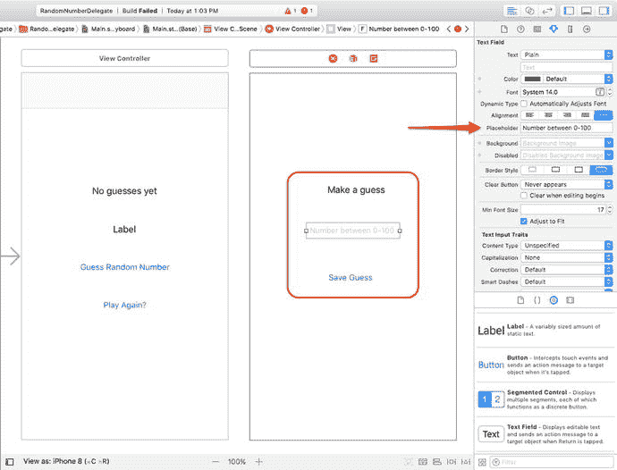

图 12-8. 创建猜测视图控制器及其对象

9.  接下来，您需要为猜测输入视图控制器创建一个类。通过选择"文件"➤ "新建"➤ "文件"创建一个 Swift 文件，并将其保存为 `GuessInputViewController.swift`。然后选择 iOS 和 Cocoa Touch Class，并将该类的名称设为 `GuessInputViewController`，作为 `UIViewController` 的子类，如图 12-9 所示。

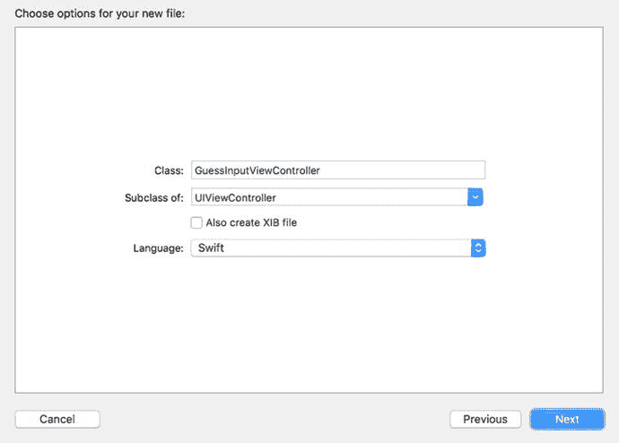

图 12-9. 创建 `GuessInputViewController.swift` 文件

10. 将 `GuessInputViewController` 类与第 8 步中创建的猜测视图控制器关联起来。在 `Main.storyboard` 文件中，选择"猜测输入视图控制器"，选择"标识检查器"，然后在"类"字段中选择或键入 `GuessInputViewController`，如图 12-10 所示。

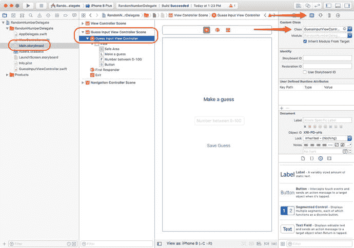

图 12-10. 设置猜测输入视图控制器类

现在，让我们在 `GuessInputViewController` 类中创建并连接操作和输出口，如列表 12-8 所示。

```
    9   import UIKit

11   // 用于将数据发送回主视图控制器的 userDidFinish 方法的协议
    12   protocol GuessDelegate {
    13           func userDidFinish(_ controller:GuessInputViewController, guess: String)
    14   }

16   class GuessInputViewController: UIViewController,  UITextFieldDelegate {
    17           var delegate: GuessDelegate? = nil
    18           var previousGuess: String = ""

20           @IBOutlet weak var guessLabel: UILabel!
    21           @IBOutlet weak var guessTextField: UITextField!

23           override func viewDidLoad() {
    24                   super.viewDidLoad()

26                   // 加载视图后的任何其他设置
    27                   if(!previousGuess.isEmpty) {
    28                           guessLabel.text = "Your previous guess was \(previousGuess)"
    29                   }
    30                   guessTextField.becomeFirstResponder()
    31           }

33           override func didReceiveMemoryWarning() {
    34                   super.didReceiveMemoryWarning()
    35                   // 处置任何可以重新创建的资源
    36           }

38           @IBAction func saveGuess(_ sender: AnyObject) {
    39                   if let delegate = delegate, let guessText = guessTextField.text {
    40                           delegate.userDidFinish(self, guess: guessText)
    41                   }
    42           }
    43   }
    列表 12-8.
    类列表
    ```

11. 您快完成了。您需要使用 Segue 连接场景。Segue 使您能够从一个场景过渡到另一个场景。从"猜测随机数"按钮按住 Control 键拖动到"猜测输入视图控制器"，然后选择"Show"作为操作 Segue 的类型，如图 12-11 所示。


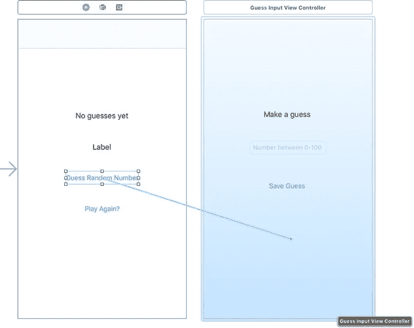
**图 12-11.** 创建点击“猜随机数”按钮时触发场景转场的 Segue

12. 现在你需要为这个 Segue 指定一个标识符。点击 Segue 箭头，选择属性检查器，并将 Segue 命名为 `MyGuessSegue`，如图 12-12 所示。

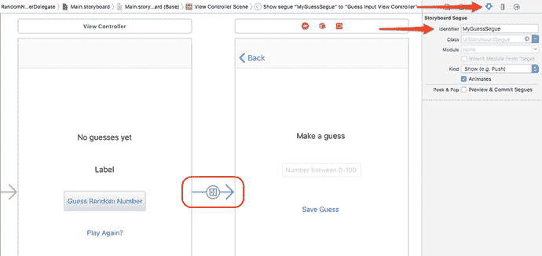
**图 12-12.** 创建 Segue 标识符

注意：输入 Segue 标识符后，务必按回车键。如果不按回车键，Xcode 可能无法识别属性更改。

现在你需要编写代码来处理这个 Segue。在 `ViewController` 类中，添加如代码清单 12-9 所示的代码。

```
    73    override func prepare(for segue: UIStoryboardSegue, sender: Any!) {
    74        if segue.identifier == "MyGuessSegue" {
    75            let vc = segue.destination as! GuessInputViewController
    76            vc.previousGuess = previousGuess // 将 previousGuess 属性传递给 GuessInputViewController
    77            vc.delegate = self
    78        }
    79    }
    代码清单 12-9. prepareForSegue 方法
```

当用户点击“猜随机数”按钮时，Segue 会被触发，同时 `prepareForSegue` 方法会被调用。首先，检查这个 Segue 是否是 `MyGuessSegue`。然后，用 `GuessInputViewController` 填充 `vc` 变量。第 76 行和第 77 行将 `previousGuess` 数值和代理传递给 `GuessInputViewController`。

13. 如果你还没有将 `GuessDelegate` 代理添加到 `ViewController` 类中，现在请添加，如代码清单 12-10 所示。

```
    11 class ViewController: UIViewController, GuessDelegate {
    12     var previousGuess = ""
    13     var randomNumber = 0
    代码清单 12-10. 带有 GuessDelegate 声明的 ViewController 类
```

14. 最后，我们需要为两个视图添加约束。选中每个视图，点击“解决自动布局问题”按钮，为每个视图添加缺失的约束，如图 12-13 所示。

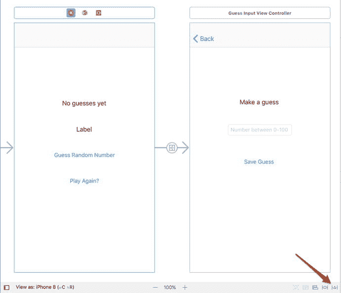
**图 12-13.** 为两个视图添加缺失的约束

## 工作原理

以下是代码的工作原理：

*   当用户点击“猜随机数”链接时，会调用 `prepareForSegue`。参见代码清单 12-9 中的第 73 行。
*   因为 `ViewController` 遵循 `GuessDelegate` 协议（参见代码清单 12-10 中的第 11 行），你可以将 `self` 作为代理传递给 `GuessInputViewController`。
*   随后会显示 `GuessInputViewController` 场景。
*   当用户猜一个数字并点击“保存猜测”时，会调用 `saveGuess` 方法（参见代码清单 12-8 中的第 38 行）。
*   由于你将 `ViewController` 作为代理传递，它可以通过 `userDidFinish` 方法将 `guess` 传回 `ViewController.swift` 文件（参见代码清单 12-8 中的第 45 行）。
*   现在你可以判断用户是否猜对了答案，并将 `GuessInputViewController` 视图从堆栈中弹出（参见代码清单 12-5 中的第 62 行）。

## 总结

本章介绍了为什么 Swift 不使用多继承，以及协议和代理的工作原理。当你想到代理时，可以将其视为辅助类。当你的类遵循某个协议时，代理的函数会协助你的类工作。

你应该熟悉以下术语：

*   多继承
*   协议
*   代理

## 练习

*   将计算机猜的随机数范围从 0–100 改为 0–50。
*   在主场景中，显示用户猜测随机数所尝试的次数。
*   在主场景中，显示用户已经玩了多少局游戏。

# 13. 初识 Xcode 调试器

苹果开发者网站和 Mac App Store 不仅免费提供 Xcode，而且它还是一款出色的工具。除了能用它来创建下一款优秀的 Mac、iPhone、iPad、Apple TV 和 Apple Watch 应用外，Xcode 还内置了调试器。

调试器到底是什么？我们首先需要明确一点：程序会严格按照编写的方式执行，但有时我们编写的内容并非程序真正意图要做的事情。这可能导致程序崩溃，或者无法实现预期功能。无论哪种情况，当程序无法按计划运行时，我们就说程序有 bug。而审查代码并修复这些问题的过程，就叫做调试。

关于“bug”这个术语的真正起源仍存争议，但有一个 1947 年记录详实的案例涉及已故的海军少将格蕾丝·霍珀，她当时是一名海军预备役军官和程序员。霍珀和她的团队当时正尝试解决哈佛 Mark II 计算机上的一个问题。一名团队成员在电路中发现了一只飞蛾，导致了其中一个继电器的问题。后来霍珀被引述说：“从那时起，只要计算机出了任何问题，我们都说它里面有 bug。”¹

无论起源如何，这个术语就这样被沿用下来，世界各地的程序员都在使用调试工具（例如内置于 Xcode 的调试器）来帮助定位程序中的 bug。但真正的调试者是人；调试工具仅仅是帮助程序员定位问题的辅助手段。无论名称听起来如何，没有任何调试器能自主修复问题。

本章将重点介绍 Xcode 调试器的一些重要功能，并解释如何使用它们。学完本章后，你应该对 Xcode 调试器以及一般的调试过程有足够的理解，从而能够查找并修复大多数编程问题。

## 调试入门

如果你曾经慢速播放电影，只为了捕捉到在正常速度播放时无法看到的细节，那么你就已经使用过类似调试的工具了。逐帧播放电影以揭示你寻找的细节，这种思路与调试程序时的思路类似。对于程序而言，有时有必要放慢速度来观察发生了什么。调试器允许你通过两个主要功能来实现这一点：设置断点以及逐行执行程序——稍后会详细介绍这两个功能。我们先来看看如何进入调试器以及它的界面。

首先，你需要加载一个应用程序。本章示例使用了第 8 章的 `BookStore` 项目，因此请打开 Xcode 并加载 `BookStore` 项目。

其次，确保为运行方案选择了“调试”构建配置，如图 13-1 所示。要编辑当前方案，请从主菜单选择“产品”➤“方案”➤“编辑方案”。“调试”是默认选择，因此你可能无需更改。这一步很重要，因为如果配置设置为“发布”，调试将完全无法工作。

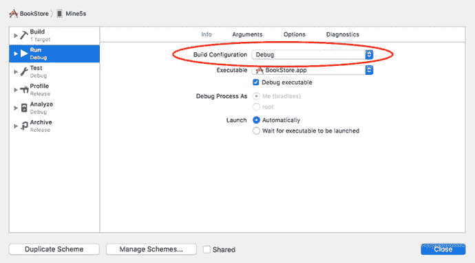
**图 13-1.** 选择调试配置

虽然本书不深入讨论 Xcode 方案，但你需要知道的是，默认情况下 Xcode 会为你创建的任何 macOS、iOS、watchOS 或 tvOS 项目提供“发布”和“调试”两种构建配置。就本章而言，主要区别在于，“发布”配置不会添加任何调试应用程序所必需的程序信息，而“调试”配置则会添加。


# 设置断点

要查看程序中正在发生什么，你需要让程序在你作为程序员感兴趣的位置暂停。断点就可以实现这一点。在图 13-2 中，程序第 24 行设置了一个断点。要设置此断点，只需将鼠标光标悬停在行号上（不是程序文本，而是程序文本左侧的数字 24）并单击一次。你会看到行号后面出现一个小蓝色箭头，这表示断点已设置。

如果未显示行号，只需从主菜单中选择 Xcode ➤ 偏好设置，点击文本编辑标签页，然后选中行号复选框。

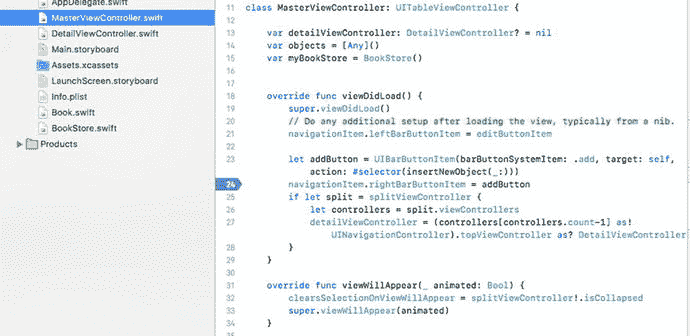

图 13-2. 你的第一个断点

可以通过将断点拖到行号列的左侧或右侧然后释放来移除断点。你也可以右键单击（或按住 Control 键单击）断点，然后会看到删除或禁用断点的选项。图 13-3 显示了断点的右键单击菜单。如果你认为将来可能还会用到该断点，禁用它会很方便。

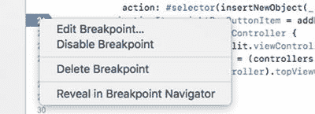

图 13-3. 右键单击一个断点

设置和删除断点是非常直接的操作。

# 使用断点导航器

对于小型项目，了解所有断点的位置并非难事。然而，一旦项目变大，比如比你那个小的 `BookStore` 应用还要大，管理所有断点就会变得有些困难。幸运的是，Xcode 提供了一种简单的方法来列出应用中的所有断点，它就是断点导航器。只需点击导航选择栏中的断点导航器图标，如图 13-4 所示。

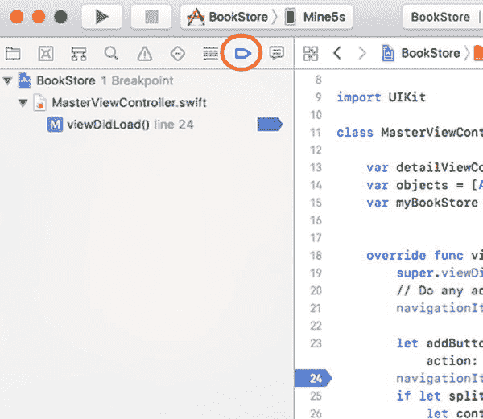

图 13-4. 在 Xcode 中访问断点导航器

点击图标后，导航器将列出应用中当前定义的所有断点，并按源文件分组。你可以使用展开箭头来显示或隐藏断点。在此处，点击一个断点会跳转到包含该断点的源文件。你也可以从这里轻松删除或禁用断点。

要在断点导航器中启用/禁用断点，请点击列表中的蓝色断点图标（或它出现的任何位置）。不要点击行，必须是那个小的蓝色图标，如图 13-5 所示。

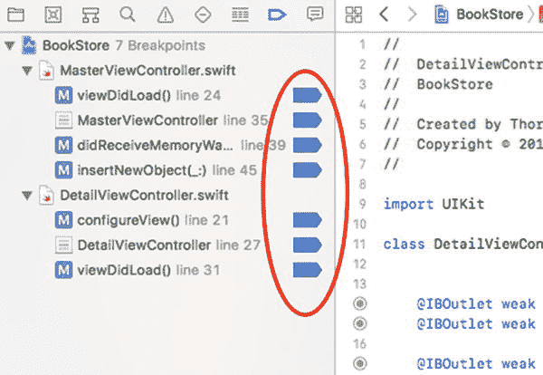

图 13-5. 使用断点导航器启用/禁用断点

有时禁用断点比删除它更方便，尤其是当你计划稍后在同一位置再次设置该断点时。调试器不会在这些变灰的断点处停止，但它们会保留在原地，以便可以方便地启用，并作为代码中重要区域的标记。

也可以从断点导航器中删除断点。只需选择一个或多个断点，然后按 Delete 键。确保选择了要删除的正确断点，因为没有撤销功能。

还可以选择与断点关联的文件。在这种情况下，如果你在断点导航器中选中列出的文件并按 Delete，则该文件中的所有断点都将被删除。

请注意，断点按其所在的文件进行分类。在图 13-5 中，文件是 `DetailViewController.swift` 和 `MasterViewController.swift`，断点列在这些文件名下方。图 13-6 展示了一个文件包含多个断点的示例。

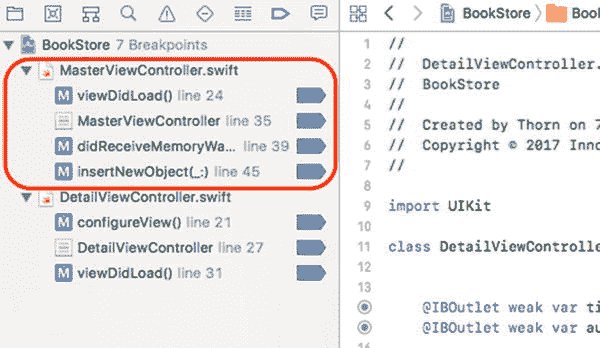

图 13-6. 包含多个断点的文件

# 调试基础

在图 13-2 所示的语句上设置一个断点。接下来，如图 13-7 所示，点击“运行”按钮编译项目并在 Xcode 调试器中启动它。


图 13-7. Xcode 工具栏中的构建并运行和停止按钮

项目构建完成后，调试器将启动。屏幕会显示调试窗口，程序将在有断点的行停止执行，如图 13-8 所示。

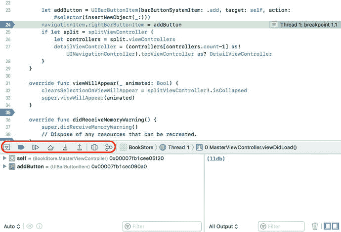

图 13-8. 执行在第 24 行停止时的调试器视图

调试器视图会添加一些额外的窗口。以下是图 13-8 中调试器视图的不同部分：

*   **调试器控制**（在图 13-8 中用圆圈标出）：调试控件可以暂停、继续、单步跳过、单步进入和单步跳出程序中的语句。单步控制是最常用的。左边的第一个按钮用于显示或隐藏调试器视图。在图 13-8 中，调试器视图是显示的。图 13-9 标注了调试器视图的不同部分。

    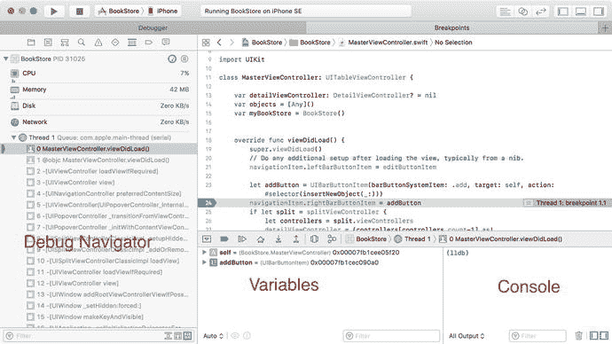

    图 13-9. 调试器的各个位置

*   **变量**：变量视图显示当前作用域内的变量。点击变量名左侧的小三角形可以展开它。
*   **控制台**：输出窗口会在发生崩溃或异常时显示有用的信息。此外，所有 `NSLog` 或 `print` 的输出都会显示在这里。
*   **调试导航器**：堆栈跟踪显示了调用栈以及程序中当前活动的所有线程。栈是所调用方法的层次结构视图。例如，`UIApplicationMain` 调用了 `UIViewController` 类。这些方法调用会不断“堆积”，直到它们最终返回。


### 使用调试器控制

如前所述，一旦调试器启动，视图便会发生变化。此时出现的是调试控件（如图 13-8 中圈出的部分）。这些控件非常直观，其功能说明见表 13-1。

**表 13-1.** Xcode 调试控件

| 控件 | 说明 |
| --- | --- |
|  | 单击停止按钮将终止程序的执行。如果 iPhone 或 iPad 模拟器正在运行该应用程序，它也会像用户强制退出应用一样停止。单击运行按钮（外观类似播放按钮）可启动调试。如果应用程序当前处于调试模式，再次单击运行按钮将从头开始重新调试应用程序；这相当于先停止再重新启动。 |
| 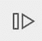 | 单击此按钮将使程序继续执行。程序将持续运行，直到程序结束、单击停止按钮或程序遇到另一个断点。 |
|  | 当调试器停在某个断点时，单击单步跳过按钮将使调试器执行当前代码行，并停在下一行代码处。 |
|  | 单击单步进入按钮将使调试器进入指定的函数或方法。如果需要跟踪代码进入特定方法或函数，此功能非常重要。只有项目拥有源代码的方法才能单步进入。 |
| 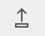 | 单步跳出按钮将使当前方法执行完毕，然后调试器将返回到最初调用该方法的那个方法。 |

## 使用单步控制

为了练习使用单步控制，我们来单步进入一个方法。顾名思义，单步进入按钮会跟踪程序执行，进入高亮显示的方法或函数。从项目管理器中选择 `DetailViewController.swift` 文件。然后，在第 31 行（即调用 `self.configureView()` 的位置）设置一个断点。单击运行按钮，并从列表中选择一本书。您的屏幕应类似于图 13-10。

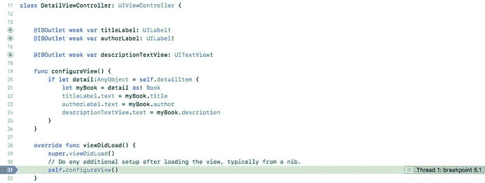

**图 13-10.** 调试器停在第 31 行

单击单步进入按钮 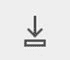，这将使调试器进入 `DetailViewController` 对象的 `configureView()` 方法。屏幕应类似于图 13-11。

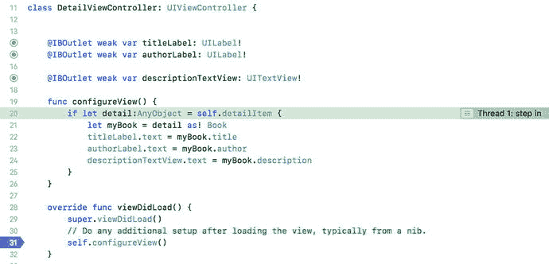

**图 13-11.** 单步进入 `DetailViewController` 对象的 `configureView` 方法

单步跳过控件 ，会让程序继续执行，但不会进入某个方法。它仅仅是执行该方法，然后继续执行下一行。单步跳出控件 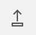 有点类似于单步进入的反向操作。如果单击单步跳出按钮，当前方法会继续执行直至结束。然后调试器会返回到当初单击单步进入按钮之后的那一行。例如，如果在图 13-9 所示的行上单击了单步进入按钮，然后又单击了单步跳出按钮，调试器将在图 13-9 所示的语句（示例中的第 31 行，即单击单步进入时所在的行）之后，返回到 `DetailViewController.swift` 文件的 `viewDidLoad()` 方法。

### 查看线程窗口和调用栈

如前所述，调试导航器会显示当前线程。不过，它也会显示调用栈。如果比较图 13-9 和图 13-10 在线程窗口方面的差异，您会发现图 13-10 中列出了 `configureView` 方法，因为 `DetailViewController` 调用了 `configureView` 方法。

现在，调用栈不仅仅是一个已被调用的函数列表；更准确地说，它是一个当前正在被调用的函数列表。这是一个重要的区别。一旦 `configureView` 方法执行完毕并返回（第 26 行），`configureView` 将不再出现在调用栈中。您可以将调用栈大致想象成一条面包屑轨迹。这条轨迹会指引您如何回到起点。

### 调试变量

当应用程序处于调试暂停状态时，可以通过将鼠标光标悬停在代码中的变量上来查看该变量的一些信息（除了其内存地址之外）。当您进入某个局部作用域中变量已被赋值的状态时，很可能在底部的变量视图中看到该变量。在图 13-12 中，您可以看到 `newBook` 变量，其标题为 Swift for Absolute Beginners。您还可以看到没有分配作者或描述。在调试过程中，当您停在一行代码上时，该行代码尚未执行。这意味着，即使您暂停在了为 `author` 属性赋值的行上，该属性也尚未被赋值。

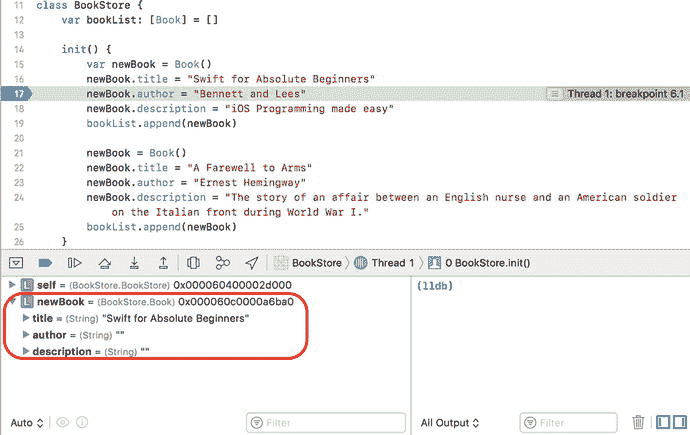

**图 13-12.** 查看变量值

将鼠标光标放在代码中 `newBook` 变量出现的任何位置，并单击展开三角形以显示 `Book` 对象。您应该会看到如图 13-13 所示的显示内容。

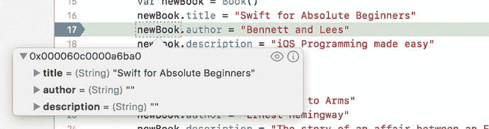

**图 13-13.** 悬停在 `newBook` 变量上可以显示一些信息

悬停在 `newBook` 变量上会显示其信息。在图 13-13 中，您可以看到 `newBook` 变量已被展开。

## 处理代码错误和警告

虽然代码错误和警告并不是 Xcode 调试器的核心部分，但修复它们是整个调试过程的一部分。在程序（无论是否使用调试器）能够运行之前，必须修复所有错误。警告不会阻止程序构建，但它们可能会导致程序执行期间出现的问题。最佳做法是完全没有警告。


### 错误

让我们来看看几种类型的错误。首先，我们在代码中引入一个错误。在 `MasterViewController.swift` 文件的第 15 行，将以下代码：

```
var myBookStore: BookStore = BookStore()
```

修改为：

```
var myBookStore: BookStore = BookStore[]
```

保存更改，然后按下 `⌘+B` 构建项目。如图 13-14 所示，将会出现一个错误，该错误可能在构建过程中或构建完成后立即显示。

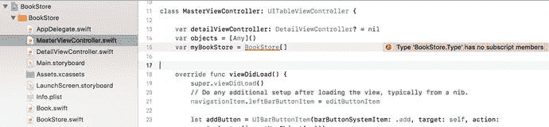

图 13-14. 在 Xcode 中查看错误

接下来，点击带有感叹号的三角形图标，切换到问题导航器（Issue Navigator）窗口，如图 13-15 所示。此视图显示程序中当前的所有错误和警告 —— 不仅限于当前文件 `MainViewController.swift`，而是所有文件。错误以红色八边形内的白色感叹号显示。在本例中，您有一个错误。如果错误信息在屏幕上显示不全或难以阅读，只需将鼠标悬停在问题导航器中的该错误上，完整错误信息便会显示出来。

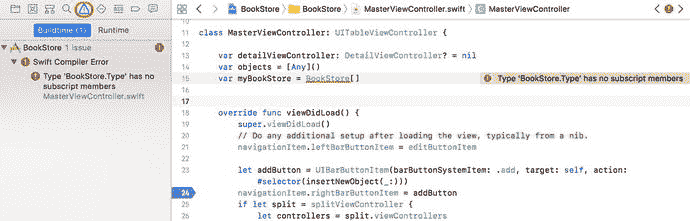

图 13-15. 查看问题导航器

通常，错误会指向问题所在。在上面的案例中，`BookStore` 对象被初始化为数组而非对象。

请继续将 `[]` 改为 `()` 来修复这个错误。

### 警告

警告指明了程序中潜在的问题。如前所述，警告不会阻止程序的构建，但可能在程序执行期间引发问题。本书不涉及那些可能在程序执行期间导致或不会导致问题的具体警告；然而，清除程序中的所有警告是一个好习惯。

在 `MasterViewController.swift` 的 `viewDidLoad` 方法中添加以下代码：

```
if false {
print("False")
}
```

`print` 命令永远不会被执行，因为 `false` 永远不会等于 `true`。按下 `⌘+B` 构建项目。如图 13-16 所示，将会显示一个警告。

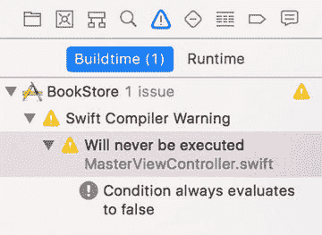

图 13-16. 在问题导航器中查看警告

点击问题导航器中的第一个警告，将会显示导致第一个问题的代码，如图 13-17 所示。

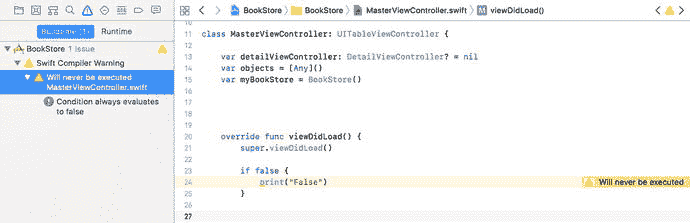

图 13-17. 查看您的第一个警告

在主窗口中，您可以看到这个警告。实际上，这个警告为您提供了代码问题的线索。警告内容如下：

> “将永远不被执行”

这是一个简单的警告示例。您可能会因为许多事情收到警告，例如未使用的变量、不完整的委托实现以及不可执行的代码。清理代码中的警告以避免日后出现问题是一个好习惯。

## 总结

本章介绍了免费的苹果 Xcode 调试器的高级特性。无论价格如何，Xcode 都是一个出色的调试器。具体来说，在本章中，您学习了以下内容：

* “bug”一词的起源以及什么是调试器
* Xcode 调试器的高级特性，包括断点和单步执行程序
* 使用名为“继续”、“单步跳过”、“单步进入”和“单步跳出”的调试控制
* 使用各种调试器视图，包括线程（调用栈）、变量视图、文本编辑器和控制台输出
* 查看程序变量
* 处理错误和警告

脚注 1

Michael Moritz, Alexander L. Taylor III, 和 Peter Stoler, “机器内部的巫师,” *时代*, 第 123 卷, 第 16 期, 第 56–63 页.

# 14. 一个 Swift iPhone 应用

在第 8 章中，您使用 Swift 创建了一个基本的书店 iPhone 应用。在本章中，您将为该应用添加一些功能，使其更具实用性，并运用您在本书中学到的许多技术，例如创建类、使用委托和协议、以及使用动作和插座。您还将学习一些新技术，例如开关、`UIAlertController` 和地标。


# 让我们开始吧

第 8 章的书店示例让您能够以表格视图浏览书店中的书籍，然后点击书籍查看其详细信息。在本章中，您将为第 8 章的书店应用添加以下功能：

-   添加书籍
-   删除书籍
-   修改书籍

请参见图 14-1 和图 14-2。

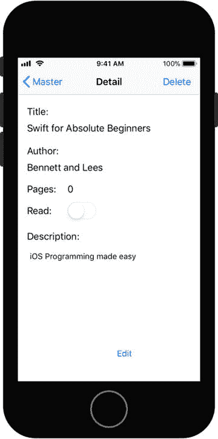

**图 14-2.** 添加编辑和删除功能，同时使用 `UISwitch`

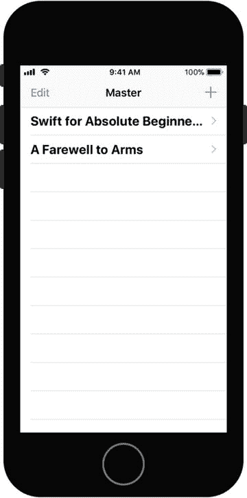

**图 14-1.** 添加书籍功能

用户将能够使用一个新的 `AddBookViewController` 向他们的 BookStore 添加书籍。首先，将以下代码添加到 `MasterViewController.swift` 文件的 `prepareForSegue` 方法中，如代码清单 14-1 所示。

```swift
45    // MARK: - Segues

47    override func prepare(for segue: UIStoryboardSegue, sender: Any?) {
48        if segue.identifier == "showDetail" {
49            if let indexPath = tableView.indexPathForSelectedRow {
50                let selectedBook: Book = myBookStore.bookList[indexPath.row]
51                let controller = (segue.destination as! UINavigationController).topViewController as! DetailViewController
52                controller.detailItem = selectedBook

54                controller.navigationItem.leftBarButtonItem = splitViewController?.displayModeButtonItem
55                controller.navigationItem.leftItemsSupplementBackButton = true
56                controller.delegate = self
57            }
58        } else if segue.identifier == "addBookSegue" {
59            let vc = segue.destination as! AddBookViewController
60            vc.delegate = self
61        }
62    }
```
**代码清单 14-1.** `prepareForSegue` 方法

注意

有助于组织代码的东西可以在第 47 行找到：`"// MARK: - Segues"`。`// MARK:` 被称为标记点。它是用于 Objective-C 的 `#pragma mark` 的替代品。标记点有助于在跳转栏中分割代码，并使您能够快速跳转到由标记点指示的代码部分。当您在 `// MARK:` 后面输入内容时，Xcode 会将该标记点放入跳转栏的下拉菜单中，如图 14-3 所示。如果您只输入 `// MARK: -`，Xcode 会在跳转栏的下拉菜单中添加一条行分隔线。Swift 还支持 `// TODO:` 和 `// FIXME:` 标记点来注释您的代码，并将它们列在跳转栏中。

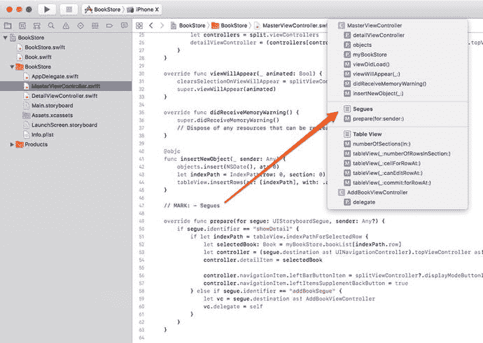

**图 14-3.** Swift 的标记点

现在，添加代码清单 14-1 中第 59 行提到的新视图控制器 `AddBookViewController`。通过将 View Controller 拖拽到 `Main.storyboard` 文件中，向 storyboard 添加一个 View Controller 对象。然后添加图 14-4 中的对象，使用户能够添加新书。随意移动场景，以清晰地显示它们之间的相互关系，如图 14-4 所示。

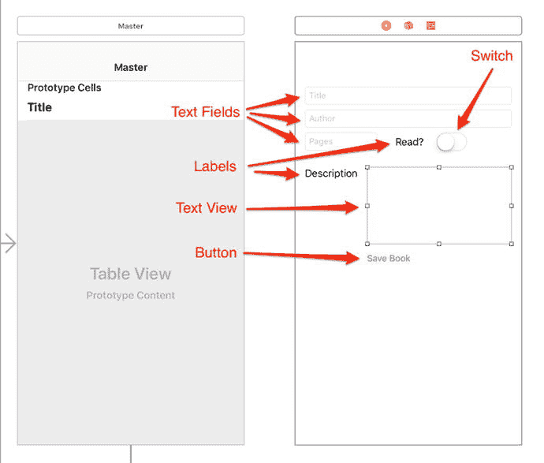

**图 14-4.** 添加 `AddBookViewController` 和对象

将 Bar Button Item 从 Object Library 拖拽到 MasterViewController 导航栏的右上角，如图 14-5 所示。

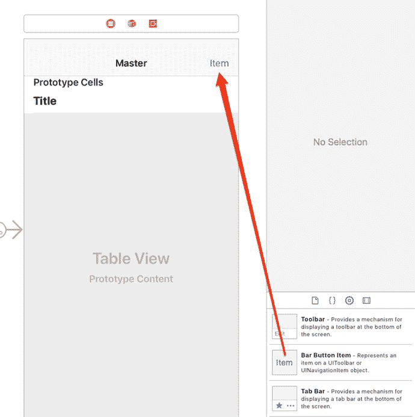

**图 14-5.** 向 MasterViewController 添加 Bar Button Item

接下来，选择新添加的 Bar Button Item，选择属性检查器，并将 System Item 从 Custom 改为 Add，如图 14-6 所示。

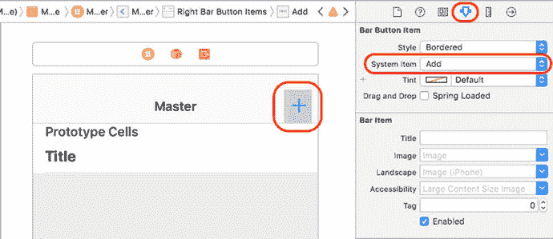

**图 14-6.** 将 Bar Button Item 从 Custom 改为 Add

通过按住 Control 键并拖拽，或者右键单击并拖拽，从 Add 按钮 Bar Button Item 到新的 View Controller 添加一个 Show Segue 对象，如图 14-7 所示。

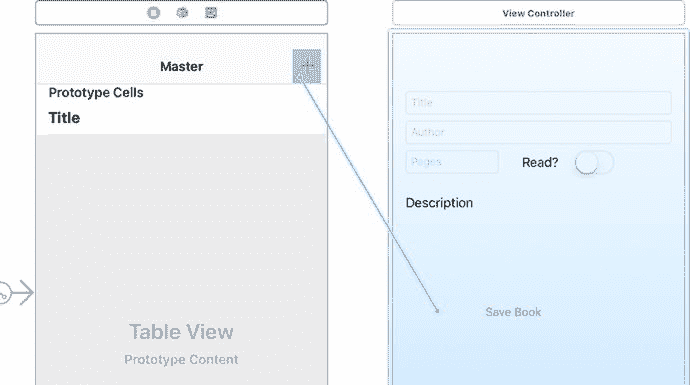

**图 14-7.** 向新的 View Controller 添加 Show Segue 对象

修改 `MasterViewController.swift` 文件中的 `insertNewObject` 函数，如代码清单 14-2 所示。

```swift
41    func insertNewObject(_ sender: Any) {
42        performSegue(withIdentifier: "addBookSegue", sender: nil)
43    }
```
**代码清单 14-2.** `insertNewObject` 函数

通过点击 Segue 箭头并将标识符设置为 `addBookSegue` 来识别 Segue 对象，如图 14-8 所示。

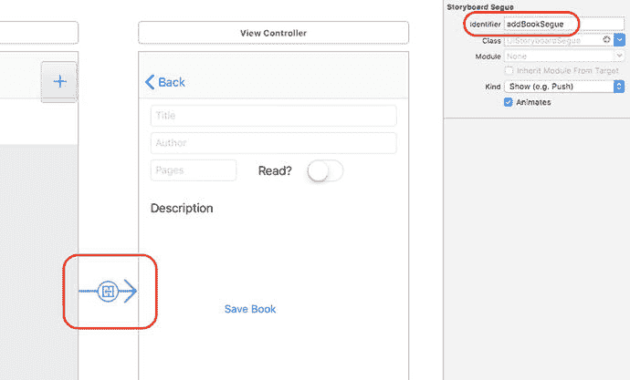

**图 14-8.** 将 Segue 对象命名为 `addBookSegue`

现在，您需要创建一个 Swift 类来配合新的 View Controller。创建一个新的 iOS Cocoa Touch 类文件，并将其命名为 `AddBookViewController`，如图 14-9 所示。确保您选择的子类是 `UIViewController`。

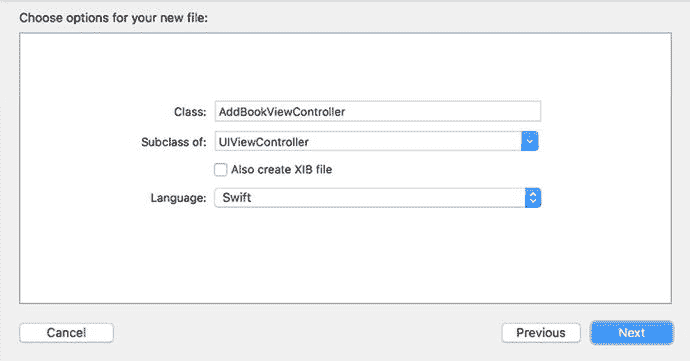

**图 14-9.** 添加 `AddBookViewController` 类

现在您必须将新的 `AddBookViewController` 类关联到新的 View Controller。在 `Main.storyboard` 中选择 View Controller，然后在身份检查器中，为类输入 `AddBookViewController`，如图 14-10 所示。

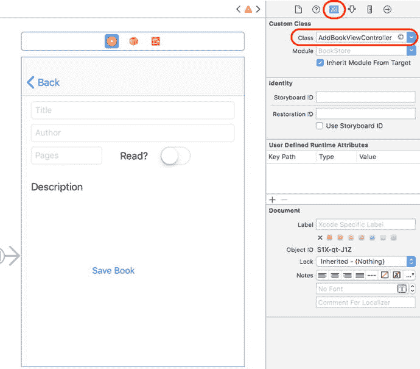

**图 14-10.** 将 `AddBookViewController` 类关联到新的 View Controller

接下来，选择属性检查器，并将 View Controller 的 Title 改为 Add Book，如图 14-11 所示。

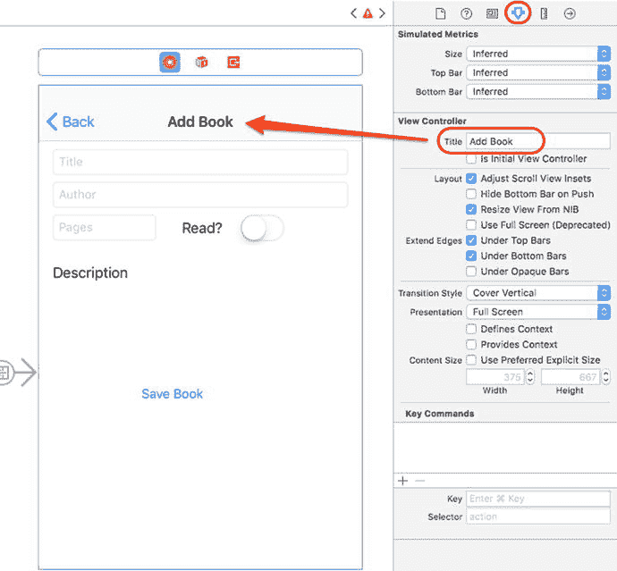

**图 14-11.** 将 View Controller 的 Title 改为 Add Book

打开 `AddBookViewController.swift` 文件，并添加代码清单 14-3 中所示的代码。

```swift
9 import UIKit

11   protocol BookStoreDelegate {
12           func newBook(_ controller: AnyObject, newBook: Book)
13           func editBook(_ controller: AnyObject, editBook: Book)
14           func deleteBook(_ controller: AnyObject)
15   }

17   class AddBookViewController: UIViewController {
18           var book = Book()
19           var delegate: BookStoreDelegate?
20           var read = false
21           var editBook = false

23           @IBOutlet weak var titleText: UITextField!
24           @IBOutlet weak var authorText: UITextField!
25           @IBOutlet weak var pagesText: UITextField!
26           @IBOutlet weak var switchOutlet: UISwitch!

28           @IBOutlet weak var descriptionText: UITextView!

30           override func viewDidLoad() {
31                   super.viewDidLoad()
32                   if editBook == true {
33                           self.title = "Edit Book"
34                           titleText.text = book.title
35                           authorText.text = book.author
36                           pagesText.text = String(book.pages)
37                           descriptionText.text = book.description
38                           if book.readThisBook {
39                                   switchOutlet.isOn = true
40                           }
41                           else {
42                                   switchOutlet.isOn = false
43                           }
44                   }

46                   // Do any additional setup after loading the view.
47           }

49           override func didReceiveMemoryWarning() {
50                   super.didReceiveMemoryWarning()
51                   // Dispose of any resources that can be recreated.
52           }
```


```swift
@IBAction func saveBookAction(_ sender: UIButton) {
        book.title = titleText.text!
        book.author = authorText.text!
        book.description = descriptionText.text
        if let text = pagesText.text, let pages = Int(text) {
                book.pages = pages
        }
        if switchOutlet.isOn {
                book.readThisBook = true
        } else {
                book.readThisBook = false
        }
        if (editBook) {
                delegate?.editBook(self, editBook:book)
        } else {
                delegate?.newBook(self, newBook:book)
        }
}
```
*清单 14-3.*
*`AddBookViewController.swift` 文件*

在 `Book` 类中添加两个属性：`pages` 和 `readThisBook`。如清单 14-4 的第 15 和第 16 行所示。

```swift
class Book {
    var title: String = ""
    var author: String = ""
    var description: String = ""
    var pages: Int = 0
    var readThisBook: Bool = false
}
```
*清单 14-4.*
*Book 类的改动*

### 开关（Switches）

在 `AddBookViewController` 类中连接输出口，方法是将输出口的空心圆圈拖拽到对应的控件上，如图 14-12 所示。

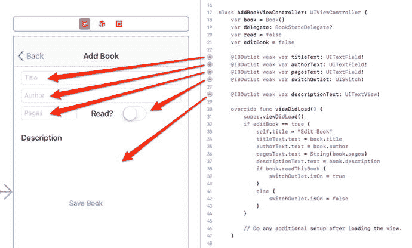

*图 14-12.*
*连接输出口*

将 `saveBookAction` 动作连接起来，方法是将输出口圆圈拖拽到“保存图书（Save Book）”按钮上，如图 14-13 所示。

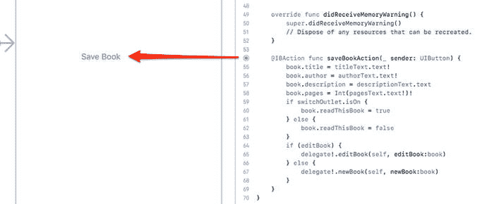

*图 14-13.*
*连接 `saveBookAction`*

在 `DetailViewController` 类中，在 `configureView` 方法上方添加清单 14-5 所示的代码。

```swift
@IBOutlet weak var pagesLabel: UILabel!
@IBOutlet weak var readSwitch: UISwitch!

var delegate: BookStoreDelegate? = nil

var myBook = Book()
```
*清单 14-5.*
*新属性*

### 警告控制器（Alert Controllers）

为 `DetailViewController` 添加“Pages”（页数）、“Read”（已读）和“Edit”（编辑）控件。通过将输出口的空心圆圈拖拽到对应的控件上来连接输出口，如图 14-14 所示。

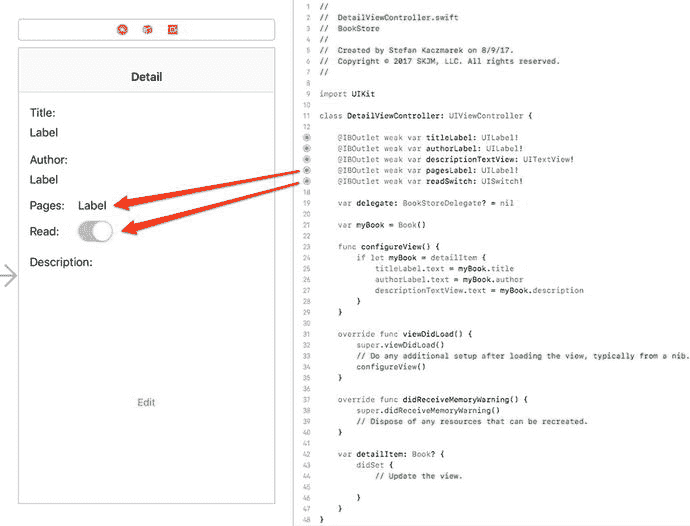

*图 14-14.*
*添加 Pages 和 Read 输出口*

在属性检查器（Attributes Inspector）中取消勾选 `Enabled`（启用）属性，可以将此视图中的“Read”（已读）开关禁用。

添加用于在点击 `DetailViewController` 上的“Delete”（删除）按钮时显示 `UIAlertController` 的代码，如清单 14-6 所示。

```swift
@IBAction func deleteBookAction(_ sender: UIBarButtonItem) {
    let alertController = UIAlertController(title: "Warning", message: "Delete this book?", preferredStyle: .alert)
    let noAction = UIAlertAction(title: "No", style: .cancel) { (action) in
        print("Cancel")
    }
    alertController.addAction(noAction)

    let yesAction = UIAlertAction(title: "Yes", style: .destructive) { (action) in
        self.delegate?.deleteBook(self)
    }
    alertController.addAction(yesAction)

    present(alertController, animated: false, completion: nil)
}
```
*清单 14-6.*
*显示一个 `UIAlertController`*

将“删除（Delete）”栏按钮项添加到右侧导航位置，并将其连接到该动作，如图 14-15 所示。

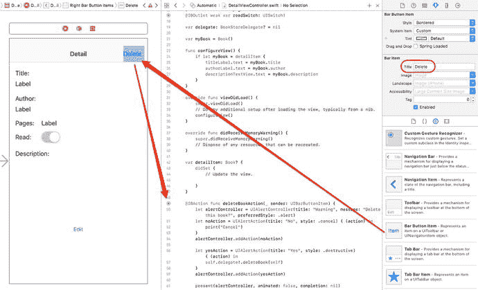

*图 14-15.*
*添加右删除栏按钮项及动作*

`UIAlertController` 将警告用户，当前在 `DetailViewController` 中显示的图书即将被删除，并允许用户决定是否删除。`UIAlertController` 有两个按钮：是（Yes）和否（No）。当用户点击右侧的栏按钮项（删除）时，完成后显示的 `UIAlertController` 将如图 14-16 所示。

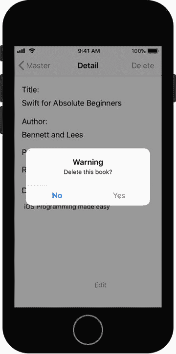

*图 14-16.*
*正在显示的 `UIAlertController`*

当用户点击“是（Yes）”删除图书时，需要按照 `MasterViewController` 类中的描述调用 `deleteBook` 委托方法。添加 `BookStoreDelegate`，如清单 14-7 所示。

```swift
class MasterViewController: UITableViewController, BookStoreDelegate {
```
*清单 14-7.*
*添加 `BookStoreDelegate`*

现在我们来讨论这三个委托方法：`newBook`、`deleteBook` 和 `editBook`，它们在清单 14-3 的 `AddBookViewController` 类中进行了定义（第 11 至 15 行）。将这些方法添加到 `MasterViewController` 类的末尾，如清单 14-8 所示。

```swift
// MARK: - BookStoreDelegate Methods

func newBook(_ controller:AnyObject,newBook:Book) {
    myBookStore.bookList.append(newBook)
    tableView.reloadData()
    navigationController?.popToRootViewController(animated: true)
}

func deleteBook(_ controller:AnyObject){
    if let row = tableView.indexPathForSelectedRow?.row {
        myBookStore.bookList.remove(at: row)
    }
    tableView.reloadData()
    navigationController?.popToRootViewController(animated: true)
}

func editBook(_ controller:AnyObject, editBook:Book){
    if let row = tableView.indexPathForSelectedRow?.row {
        myBookStore.bookList[row] = editBook
    }
    tableView.reloadData()
    navigationController?.popToRootViewController(animated: true)
}
```
*清单 14-8.*
*遵循协议*

函数 `newBook` 将一本新书添加到书店；正如第 99 行所示，通过使用 `newBook` 追加数组来实现。然后第 100 行通过调用所有表格视图委托方法来重新加载表格视图：


`numberOfSectionsInTableView`  
`numberOfRowsInSection`  
`cellForRowAtIndexPath`

最后，通过调用 `popToRootViewController()` 将 `DetailViewController` 从导航栈中弹出。从导航栈中弹出视图意味着该视图被移除，类似于点击返回按钮。

函数 `deleteBook()` 从 `bookStore` 数组中移除书籍。首先，确定在 `tableView` 中选中的是哪一行，然后使用该索引通过调用 `remove(at:)` 来删除数组中的书籍，如第 106 行所示。

函数 `editBook()` 允许用户编辑 `bookStore` 数组中的现有书籍。为此，该函数会在数组中将选中的行处的书籍替换为编辑后的版本，如第 114 行所示。

现在，从编辑按钮添加一个 Show Segue 到 `AddBookViewController`，如图 14-17 所示。

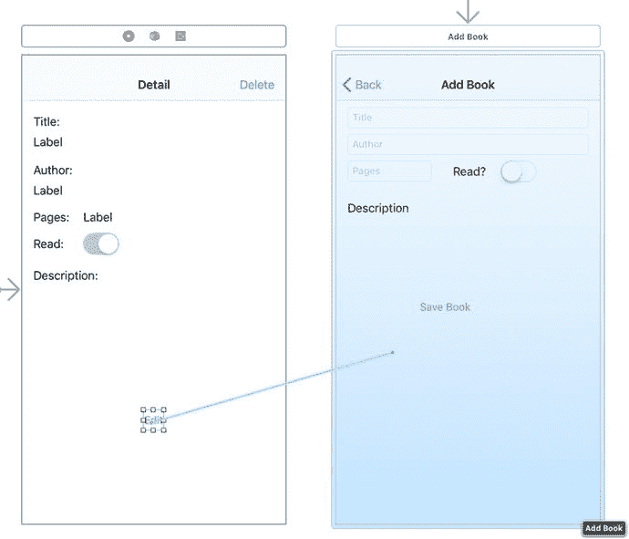  
图 14-17. 添加编辑 Show Segue

选中刚创建的 Segue，选择属性检查器，并将标识符命名为 `editDetail`。参见图 14-18。

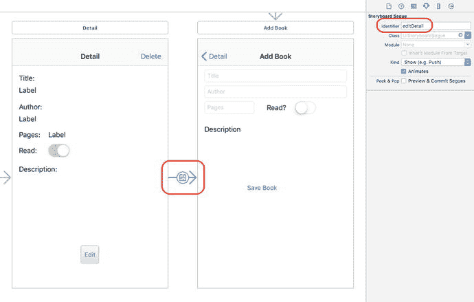  
图 14-18. 命名 Segue 的标识符

在 `DetailViewController` 中，在 `configureView()` 方法之前添加 `prepare(for:sender:)` 方法，如代码清单 14-9 所示。

```
23    override func prepare(for segue: UIStoryboardSegue, sender: Any?) {
24        if segue.identifier == "editDetail" {
25            if let vc = segue.destination as? AddBookViewController {
26                vc.delegate = delegate
27                vc.editBook = true
28                vc.book = myBook
29            }
30        }
31    }
```

代码清单 14-9. 添加 `prepareForSegue` 方法

最后，修改 `DetailViewController` 中的 `configureView()` 函数，以正确填充 Pages 和 Read 开关的输出口，如代码清单 14-10 所示。

```
33    func configureView() {
34        if let detail = self.detailItem {
35            myBook = detail
36            titleLabel.text = myBook.title
37            authorLabel.text = myBook.author
38            descriptionTextView.text = myBook.description
39            pagesLabel.text = String(myBook.pages)
40            if myBook.readThisBook {
41                readSwitch.isOn = true
42            }
43            else {
44                readSwitch.isOn = false
45            }
46        }
47    }
```

代码清单 14-10. 修改 `configureView` 函数

## 应用总结

编译并运行应用。建议在 `delegate` 函数处设置断点以观察程序流程。这是一个很好的应用示例，展示了如何利用委托将信息从一个视图传递到另一个视图。

此外，你还可以通过使用 Core Data 或 `UserDefaults` 为应用添加数据持久化功能。

## 练习

- 参考原始程序，向书店中添加更多书籍。
- 增强 `Book` 类，使其能够存储另一个属性——例如价格或 ISBN。
- 使用 Core Data 或 `UserDefaults` 为应用添加持久化功能。

# 15. Apple Watch 与 WatchKit

2014 年 9 月，苹果公司发布了 Apple Watch，并将其视为苹果历史上的下一个篇章。这款手表不仅能处理电话和短信，还能通过跟踪心率和运动来评估佩戴者的健康状况。与此同时，苹果还发布了 WatchKit，这是一个专为开发 Apple Watch 应用而设计的框架。对于熟悉 UIKit 的开发者来说，WatchKit 会让他们感到非常熟悉。

最初，Apple Watch 在开发方面存在一些严重的限制。手表仅作为 iPhone 应用的附加屏幕。这要求手表靠近手机才能运行，并且导致应用运行缓慢。2015 年 6 月，苹果发布了 watchOS 2.0。这次更新包含了许多新功能，但对开发者而言，最大的进步是能够创建代码在 Apple Watch 上而非手机上运行的应用。开发者能够创建性能更好、响应更快的独立应用。现在，苹果已经发布了 watchOS 4.0，为开发者带来了更多改进。

## 创建 watchOS 应用时的注意事项

为 watchOS 进行开发的一大优势是，所有开发工作都使用 Swift 或 Objective-C 完成，与其他 iOS 设备一样。不过，在开始开发之前，你需要考虑 Apple Watch 的一些特殊之处。

- Apple Watch 的屏幕非常小。根据手表尺寸的不同，仅限于 38 毫米或 42 毫米。这意味着你没有太多空间放置不必要的 UI 元素。你的界面需要紧凑且组织良好。此外，由于这两种尺寸很接近，你需要创建一个界面，并确保在两种尺寸下都有良好的显示效果。
- 在手机和手表之间共享数据需要提前规划。随着 watchOS 3.0 及现在的 4.0，苹果使数据共享变得更加容易。主要是增强了 `WCSession` 类。该类别的使用超出了本书的范围。
- 适用于 watchOS 4.0 的 WatchKit 提供了多种与用户交互的方式，不仅通过应用，还包括速览、可操作通知和复杂功能。编写良好的应用可以在合适的场景下利用多种交互方式。这些交互方式超出了本书的范围。


# 创建 Apple Watch 应用

第一步是在 `Xcode` 中新建一个项目。在顶部，选择 watchOS 标题下的 Application 作为项目类型。然后选择 iOS App with WatchKit App，如图 15-1 所示。

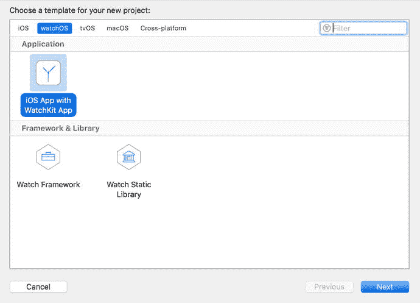

图 15-1. 创建 watchOS 应用

接下来，系统会提示您为项目命名。我们将本章的项目命名为 `BookStore`。您还会注意到，watchOS 应用与标准 iOS 应用相比，其选项有所不同。我们不会为此应用添加通知或复杂功能场景，因此请确保这些选项均未被勾选，如图 15-2 所示。

**注意**：`WatchKit` 提供了 iOS 应用中不具备的额外交互类型。Glances 是快速浏览应用内容的方式。例如，书店应用可能会有一个 Glance 界面来展示畅销书。Glances 使用了手表上的特殊界面。Complications 则允许您的应用在表盘上直接提供简单信息。

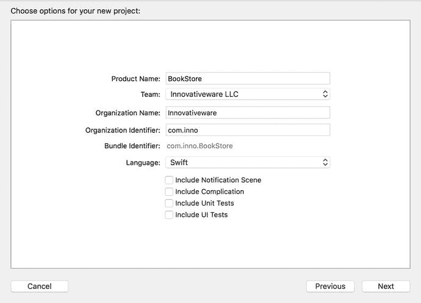

图 15-2. watchOS 应用选项

随后，`Xcode` 会提示您保存项目。保存后，您将看到新创建的项目。在左侧，您会注意到项目中有两个额外的目标。一个是 `BookStore WatchKit App`，它包含应用的界面（故事板和资源）。第二个新目标是 `BookStore WatchKit Extension`，它将包含应用在 watchOS 上运行所需的所有代码。参见图 15-3。

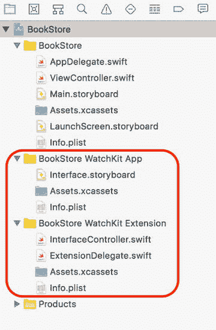

图 15-3. 新的 WatchOS 目标

点击 `BookStore WatchKit App` 目标中的 `Interface.storyboard`，您应该会看到类似图 15-4 的屏幕。这就是您空白的 watchOS 应用故事板。您会注意到其尺寸比标准 iOS 故事板小得多。

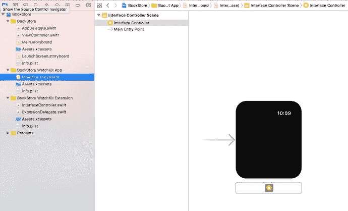

图 15-4. 界面故事板

由于您要为 watchOS 应用创建一个书籍列表，因此需要在故事板中添加一个表格。在右下角搜索 table，然后将表格拖入 Interface Controller Scene，如图 15-5 所示。

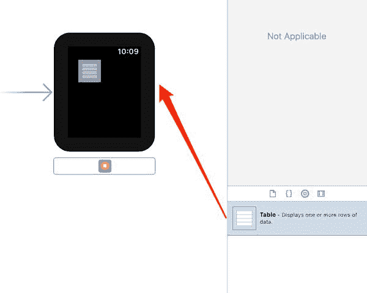

图 15-5. 添加表格

`Xcode` 现在会为表格提供一个 Table Row。这类似于您在 iOS 应用中创建表格视图时使用的原型行。您需要创建一个类来控制它，但在此之前，我们先向其中添加一个标签。在对象库中搜索标签，并将一个标签拖到行上。参见图 15-6。

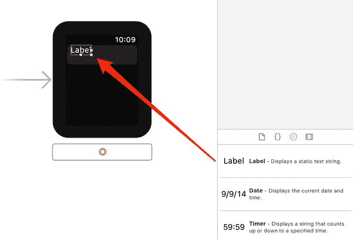

图 15-6. 向表格行添加标签

默认情况下，标签位于 Table Row 的左上角。检查属性检查器，确保其高度和宽度能够根据内容自动调整（见图 15-7）。这将有助于确保您的应用在两种尺寸的 Apple Watch 上都能良好运行。

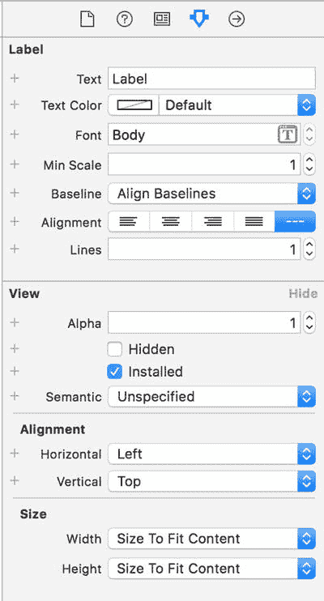

图 15-7. 允许标签自动扩展

现在标签将扩展以填满整行。但是，默认情况下，标签只会显示一行文本。由于您要添加书名，可能需要多行才能容纳所有文本。选中标签后，查看右侧的属性检查器。找到 `Lines` 属性并将其设置为 0，如图 15-8 所示。将行数设置为 0 是告诉 `Xcode` 可以使用所需任意多行。

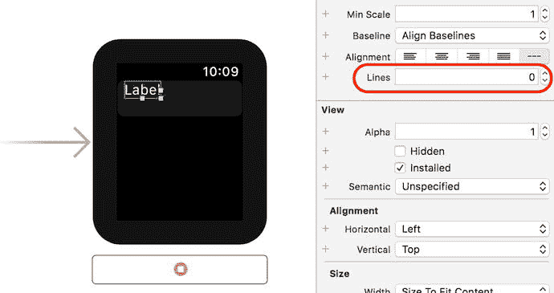

图 15-8. 设置 `Lines` 属性


现在你需要添加一些代码以使用户界面工作。在左侧，展开`BookStore WatchKit Extension`文件夹并选择`InterfaceController.swift`文件，如图 15-9 所示。`InterfaceController`是 WatchKit 故事板中初始场景的默认控制器。

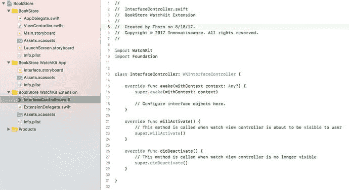

*图 15-9 打开 InterfaceController.swift 文件*

你会注意到新的控制器文件中的默认方法与标准`UIViewController`中的不同。`willActivate()`相当于`viewWillAppear()`。

你首先需要添加一个行的类定义。为此，将以下代码添加到文件底部，位于`InterfaceController`类的闭合花括号（`}`）之外。

```
1   class BookRow: NSObject {
2       @IBOutlet weak var bookLabel: WKInterfaceLabel!
4   }
```

第 1 行声明了一个名为`BookRow`的新类，它是`NSObject`的子类。第 2 行创建了一个名为`bookLabel`的属性。`bookLabel`的类是`WKInterfaceLabel`，这类似于你之前使用过的`UILabel`，但它适用于 WatchKit。

> **注意**：Swift 允许在同一个 Swift 文件中声明多个类。当你只在该文件中与其他类一起使用这个类时，这种方式效果很好。在本例中，我们只会在`InterfaceController`类中使用这个行类。

`InterfaceController.swift`文件现在将如图 15-10 所示。

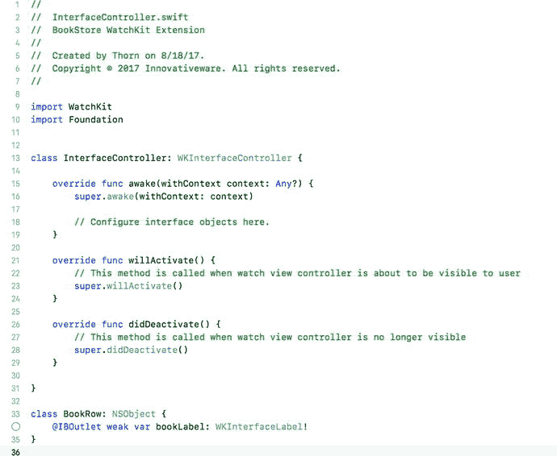

*图 15-10 修改后的 InterfaceController.swift 文件*

现在你可以将插座变量连接到界面。选择`Interface.storyboard`。然后通过点击 Xcode 窗口右上角带有两个圆圈的图标来打开助理编辑器，如图 15-11 所示。

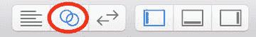

*图 15-11 打开助理编辑器*

使用助理编辑器时，Xcode 为开发者提供了一种快速创建对象并将其与界面中的插座变量关联的方法。你首先需要创建一个表示表格的表格属性。从界面控制器场景中的表格按住 Control 键并拖动到右侧的`InterfaceController`类上，如图 15-12 所示。

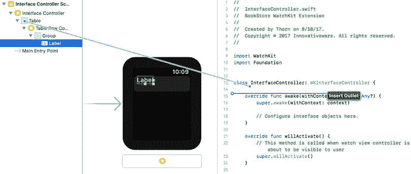

*图 15-12 按住 Control 键拖动以创建插座变量*

当你将`Table`对象释放到`InterfaceController`类上时，Xcode 会提示你输入要创建的插座变量类型。保持默认设置不变，只需将名称改为`mainTable`，如图 15-13 所示。

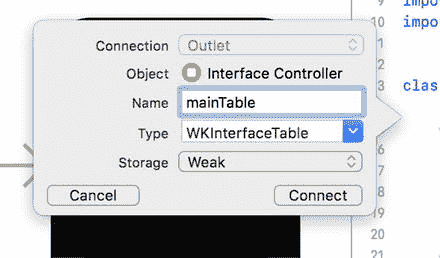

*图 15-13 命名你的插座变量*

点击 Xcode 窗口右上角的“文字行”图标返回标准编辑器。在界面控制器场景下，选择表格行控制器，如图 15-14 所示。

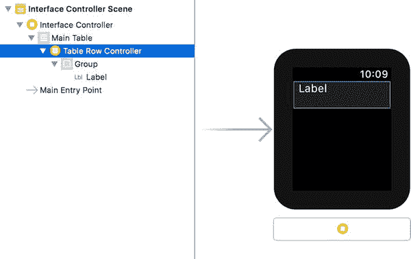

*图 15-14 选择表格行控制器*

通过选择右侧的身份检查器，并在类下拉菜单中选择`BookRow`，来设置表格行控制器的类，如图 15-15 所示。

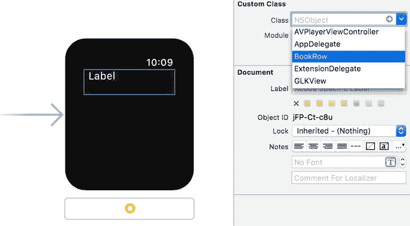

*图 15-15 将表格行类更改为 BookRow*

既然你的应用知道你在代码中使用的表格行类型，你需要为该行添加一个标识符。这在单个表格有多个行类型的情况下会很有帮助。选择属性检查器，并输入`MyBookRow`作为标识符，如图 15-16 所示。

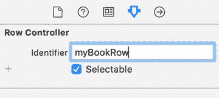

*图 15-16*


# 修改表格行标识符

现在你可以连接之前创建的`WKInterfaceLabel`。在接口控制器场景（Interface Controller Scene）下，按住 Control 键从书籍行拖拽到标签上，如图 15-17 所示。

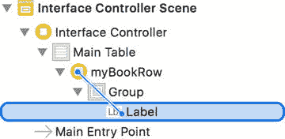

图 15-17. 从行控制拖拽到标签

系统将提示你从可用输出口中选择一个输出口，如图 15-18 所示。当前只有一个可用输出口，因此请选择 `bookLabel`。

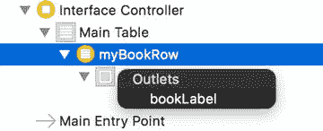

图 15-18. 连接 `bookLabel` 输出口

现在表格和标签已全部连接完毕。接下来你需要一些数据来显示。你将复用第 8 章中创建的部分数据。使用 Mac 上的访达（Finder），将第 8 章文件夹中的 `Book.swift` 和 `BookStore.swift` 文件拖拽到 Xcode 中的 `BookStore WatchKit Extension` 文件夹内。勾选“如果需要则拷贝项目”复选框，将文件复制到新项目中。完成后，你的目标中将会包含 `Book.swift` 和 `BookStore.swift` 文件，如图 15-19 所示。

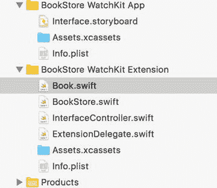

图 15-19. 添加数据文件

数据和界面都已准备就绪。现在需要将它们连接起来，以便界面能够了解数据。你需要声明一个用于保存`BookStore`对象的新属性。在 `InterfaceController.swift` 文件中 `mainTable` 对象的声明下方，需要添加以下代码行：

```
var myBookStore: BookStore = BookStore()
```

这将创建一个名为 `myBookStore`、类型为 `BookStore` 的属性，并将其初始化为 `BookStore` 的一个实例。

我们将使用 `configureTable()` 方法来设置表格。在类中添加以下代码，位置应在其他任何方法之外：

```
1     func configureTable() {
2         mainTable.setNumberOfRows(myBookStore.bookList.count, withRowType: "myBookRow")
3         for index in 0..<myBookStore.bookList.count {
4             if let myRow = mainTable.rowController(at: index) as? BookRow {
5                 myRow.bookLabel.setText(myBookStore.bookList[index].title)
6             }
7         }
8     }
```

第 1 行声明了新的方法。第 2 行将表格的行数设置为书店中书籍的数量。你将使用 `myBookStore.bookList.count` 来获取该数字。同时，我们还需告知表格要使用哪个行标识符。第 3 行是一个循环，将 `index` 赋值为 0，并持续递增直到达到书籍数量减 1。之所以要减去 1，是因为 Swift（以及大多数现代编程语言）的数组索引从 0 开始。这意味着如果一个数组包含两个项目，那么项目的位置分别是 0 和 1。如果你试图访问位置 2，则会收到错误提示。

第 4 行尝试使用上一行创建的 `index` 变量为表格创建新行。第 5 行获取该行，并将 `Book` 的标题赋值给 `bookLabel`。现在我们需要在视图激活时调用 `configureTable`。请在 `willActivate` 函数中添加以下代码行：

```
configureTable()
```

输入这些代码行后，`InterfaceController.swift` 文件将如图 15-20 所示。

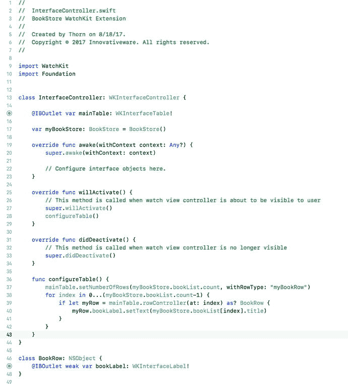

图 15-20. `InterfaceController.swift` 文件

现在你已拥有运行应用程序所需的全部要素。从目标菜单中选择 `BookStore WatchKitApp`，然后选择希望模拟器使用的 Apple Watch 尺寸，如图 15-21 所示。如果这是你首次启动 Watch 模拟器，可能需要一些时间，并且在应用程序成功运行前，可能会要求授予电话模拟器相关权限。

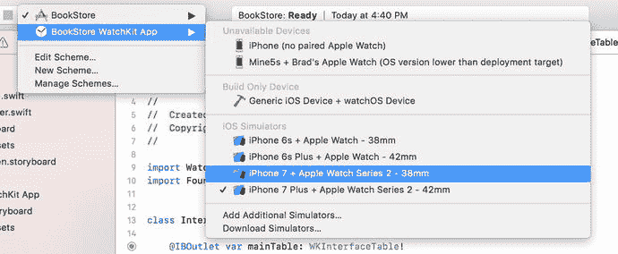

图 15-21. 选择 WatchKit 目标

应用程序启动后，你将看到一个手表屏幕，其中显示了 `myBookStore` 对象中的两本书。如果你想要尝试滚动操作，可以返回 `BookStore.swift` 文件并添加更多书籍。应用程序应如图 15-22 所示。

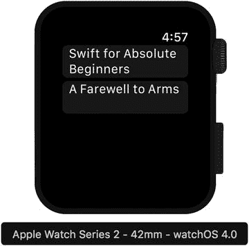

图 15-22. 首次启动 WatchKit 应用程序


# 添加更多功能

在上一节中，你创建了一个 WatchKit 应用，但其功能十分有限。在本节中，你将向应用添加一个新场景，以便在选中一本书时显示书籍详情。由于需要添加场景，你将使用额外的控制器文件。右键点击 `BookStore WatchKit Extension` 文件夹，选择 `新建文件`，如图 15-23 所示。

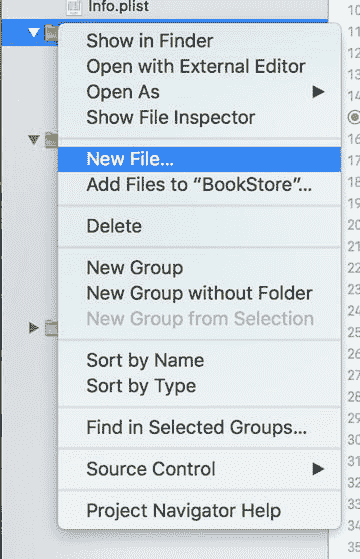

图 15-23. 添加新控制器文件

确保新文件是 Swift 文件，并将其命名为 `DetailController.swift`。现在它应该出现在你的文件列表中。在 `import Foundation` 行之后添加以下代码：

```
10      import WatchKit

13      class DetailController: WKInterfaceController {
14           @IBOutlet var labelTitle: WKInterfaceLabel!
15           @IBOutlet var labelAuthor: WKInterfaceLabel!
16           @IBOutlet var labelDescription: WKInterfaceLabel!

18           var book: Book!

20           override func awake(withContext context: Any?) {
21                super.awake(withContext: context)
22                if let book = context as? Book {
23                     labelTitle.setText(book.title)
24                     labelAuthor.setText(book.author)
25                     labelDescription.setText(book.description)
26                }
27           }
28      }
```

第 10 行导入了 `WatchKit` 框架。处理任何 `WatchKit` 类（如 `WKInterfaceController` 或 `WKInterfaceLabel`）时都需要此操作。第 13 行声明了一个名为 `DetailController` 的新 `WKInterfaceController` 子类。第 14–16 行创建了用于显示书籍信息的标签出口。第 18 行声明了名为 `book` 的 `Book` 属性。第 20 行是 `awakeWithContext` 方法。它接收一个名为 `context` 的对象，其类型为 `Any`。`Book` 对象将在此处被传递。第 22 行将 `context` 赋值给 `book` 对象。第 23–25 行从书籍中提取信息并将其赋值给标签。

现在，你需要向 `InterfaceController` 类添加以下方法：

```
override func contextForSegue(withIdentifier segueIdentifier: String,
in table: WKInterfaceTable,
rowIndex: Int) -> Any? {
return myBookStore.bookList[rowIndex]
}
```

当该方法接收到选中行的 `rowIndex` 时，会将书籍传递给 `DetailController`。现在你需要创建界面。在左侧选择 `Interface.storyboard`。从对象库中拖拽一个界面控制器到故事板，如图 15-24 所示。

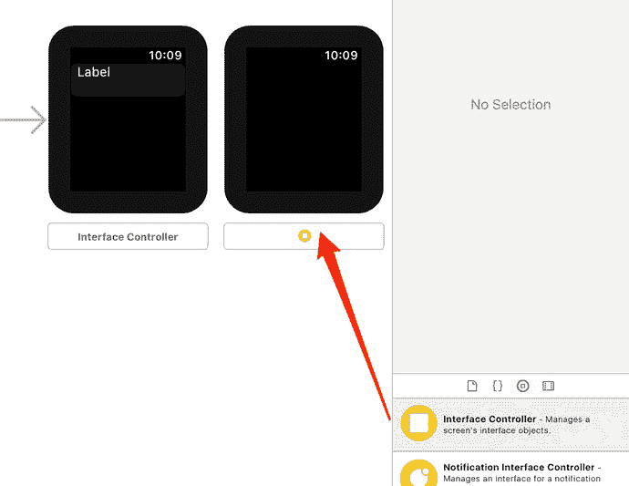

图 15-24. 添加新控制器文件

选择第二个界面控制器场景，并将其类设置为 `DetailController`，如图 15-25 所示。

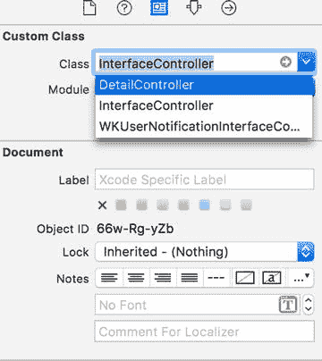

图 15-25. 设置新控制器类

现在将三个标签对象拖拽到界面上。这些标签将用于显示书籍标题、作者和描述。参见图 15-26。watchOS 并未提供与 iOS、tvOS 或 macOS 相同的全部布局选项。作为开发者，你需要花时间设计简洁的 watchOS 界面。

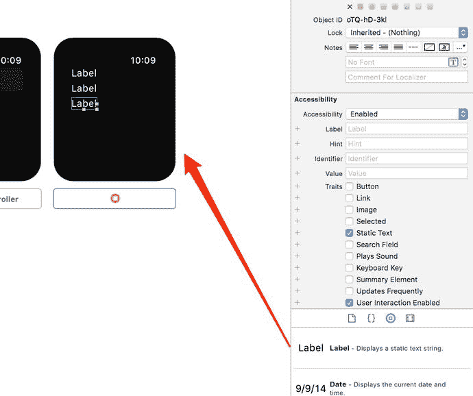

图 15-26. 新标签

现在你需要连接新标签的出口。按住 Control 键从详情控制器场景拖拽到每个标签，并将它们分配给各自的属性。参见图 15-27。

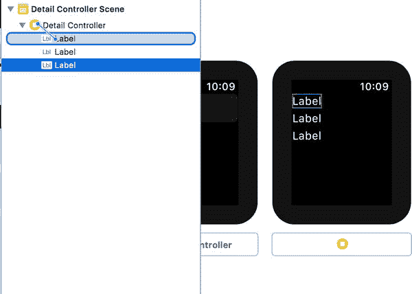

图 15-27. 连接出口

现在所有数据应该都能显示了。你需要创建转场并再次测试应用。按住 Control 键从界面控制器场景下的 `MyBookRow` 拖拽到详情控制器。系统将提示你选择转场类型。选择 `Push`。参见图 15-28。

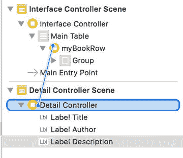

图 15-28. 创建转场

现在运行应用并选择一行。你应该会看到刚刚创建的详情控制器，如图 15-29 所示。

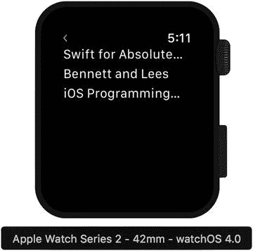

图 15-29. 详情视图场景

## 总结

本章介绍了 Apple Watch 开发的基础知识。具体来说，你学习了以下内容：

- 如何创建新的 WatchKit 应用
- 如何使用 WatchKit 控件 `WKInterfaceController`、`WKInterfaceTable` 和 `WKInterfaceLabel`
- 如何创建多个场景并在它们之间添加转场
- 如何处理从一个场景到下一个场景的数据传递

## 练习题

- 在详情场景中设置标签，使其显示所有数据，而不是截断部分内容。
- 向你的 `BookStore` 中添加更多书籍，以便在应用中体验滚动效果。


# 索引 A

## Apple 开发者计划
Apple 的 `A11 Bionic` 处理器  
Apple Watch 与 WatchKit  
- 添加标签  
- 添加表格  

助理编辑器  
- `bookLabel` 输出口  
- `BookRow`  
- 拖拽连线  
- 数据文件  
- `DetailController.swift`  
- 详情视图场景  
- 展开标签  
- `InterfaceController` 类  
- 界面故事板  
- `lines` 属性  
- `myBookStore`  
- 新控制器类  
- 新标签  
- 新目标  
- 连接输出口  
- 转场  
- 表格行控制器  
- 表格行标识符  
- WatchKit 目标  
- watchOS 应用  
- Xcode  

应用设计  
- 条件控制循环  
- 计数控制循环  
- 流程图  
- 强制解包  
- 无限循环  
- 可选绑定  
- 强制解包  
- 隐式解包  
- 伪代码  

条件运算符  
- 定义  
- 逻辑运算符  

`Array` 类  
- 访问对象  
- 添加多个对象  
- 添加对象  
- 添加字符串  
- 快速枚举  
- `remove(at:)` 方法  

ASCII 字符  

## B
Balsamiq 工具  
二进制数制  
位  
- Apple 的 `A8` 处理器  
- 定义  

书店应用  
- Apple Watch 与 WatchKit (参见 Apple Watch 与 WatchKit)  
- 比较数字  
- 面向对象编程  
- 添加购买历史  
- 添加三个方法  
- `Book` 类  
- 创建对象  
- `Customer` 类  
- `Sale` 类  
- UML 图  

Swift 语言编程  
- 访问变量  
- 添加属性  
- 模板项目  
- `Book` 类  
- `configureView` 方法  
- 数据模型类  
- `DetailViewController` 实例变量  
- 主从应用  
- `MasterViewController`  
- 产品应用  
- 创建 Swift 文件  
- `UITableViewController`  
- 创建视图  
- Xcode 调试器 (参见 Xcode 调试器)  

`BookStore.xcdatamodeld` 文件  
- 属性  
- `Author` 实体  
- 空白模型  
- 日期  
- 小数  
- 获取属性  
- 整数 32  

界面创建  
- `addNew` 方法  
- 助理编辑器按钮  
- 属性检查器  
- 栏按钮项  
- 连接设置  
- 文档大纲  
- 最终视图  
- 连接标识符  
- `loadBooks` 方法  
- 导航控制器  
- 协议  
- 表格视图  
- `UIBarButtonItem`  
- `viewDidLoad()` 方法  
- 托管对象类  
- 关系  

字符串  
- 布尔表达式  
- 比较字符串  
- `someCode()` 方法  

布尔逻辑  
- 与运算符  
- 比较运算符  
- 非运算符  
- 或运算符  
- 真值表  
- 与  
- 与非  
- 或非  
- 非  
- 或  
- 异或  
- 异或运算符  

Bug  
字节  

## C
代码重构  
比较数据  
- 布尔表达式  
- 比较字符串  
- `some_code()` 方法  

布尔逻辑  
- 比较运算符  
- switch 语句  

组合比较  
`ComparisonResult`  
- `if` 语句  
- 变量  

比较运算符  
计算机程序  
条件运算符  
`configureView` 方法  
Core Data  
- `BookStore.xcdatamodeld` 文件  
- 属性  
- `Author` 实体  
- 空白模型  
- 创建实体  
- 获取属性  
- 界面创建  
- 托管对象类  
- 关系  
- 创建  

## D
数据  
- 两数相加  
- 位  
- 字节  
- 常量  
- 显式  
- 变量  
- 十六进制  
- 变量  
- 摩尔定律  
- 可选值  
- 类型  
- 字符串变量  

Unicode  
数据库  
- Core Data (参见 Core Data)  
- 定义  
- SQLite  

数据存储  
- iPhone  
- Mac  
- 偏好设置文件 (参见 偏好设置文件)  

调试  
委托  
- 猜数字应用 (参见 随机数猜测应用)  

定义  
`Dictionary` 类  

## E
电子数值积分计算机 (ENIAC)  
显式变量  

## F
快速枚举  
冻干  

## G
概览  

## H
十六进制系统  
人机界面指南 (HIG)  

## I, J
隐式变量  
继承  
初始化方法  
实例方法  
集成开发环境 (IDE)  
界面  
界面构建器  
- 动作与输出口  
- 捆绑包  
- nib 文件  
- 故事板  
- XML 文件格式  

iOS 开发者  
- 计算机程序设计  
- 需求  
- 面向对象编程 (参见 面向对象编程 (OOP))  

Playground 界面  
软件开发周期  
- App Store  
- 错误  
- 调试  
- QA 测试  
- 值导向编程  

## K
钥匙串  

## L
本地化你的应用  
逻辑运算符  
循环  
- 计数控制  
- `for-in`  
- 无限  
- `while`  

Lorem Ipsum 文本  

## M, N
Mac，数据存储  
移动银行应用  
模型-视图-控制器 (MVC)  
- 架构模式  
- 银行应用  
- 对象  
- 面向对象编程  
- 示意图  
- 软件开发  

摩尔定律  
多重继承  

## O
Objective-C  
面向对象编程 (OOP)  
- 类  
- 调试  
- 消除冗余代码  
- 继承  
- 实例  
- 接口  
- 方法  
- MVC  
- 对象  
- `Bookstore` 对象  
- 对象定义  
- 方法  
- 物理属性  
- 状态  
- playground 应用  
- 多态  
- 原则  
- 属性  
- 替换  
- 状态  
- `UITableView` 对象  

OmniGraffle 工具  
可选绑定  

## P
多态  
偏好设置文件  
- 缺点  
- iOS  
- macOS  
- `string(forKey:)` 方法  
- `synchronize` 函数  
- `UserDefaults` 类  

协议  
- 定义  
- 猜数字应用 (参见 随机数猜测应用)  
- 语法  

## Q
质量保证 (QA)  

## R
`RadioStations` 类  
- 创建动作  
- 添加对象  
- 助理编辑器图标  
- `buttonClick` 方法  
- 公司标识符  
- 连接  
- 执行  
- iPhone 应用  
- 标签对象  
- 单视图应用  
- `stationName` 实例变量  
- 类型方法  
- UI 创建  
- 工作区窗口  
- 编写类  

随机数生成器应用  
- 文档大纲  
- 启用控件  
- 检查器面板  
- iPhone 模拟器  
- 命名 Swift 项目  
- 创建新组  
- 对象库  
- `seedAction` 和 `generateAction` 方法  
- 选择器栏  
- 单视图应用  
- 源文件  
- 故事板文件  
- 使用动作  
- 使用输出口  
- 创建视图  
- 工作区窗口  

随机数猜测应用  
- 主视图  
- 项目创建  
- 动作转场  
- 添加缺失的约束  
- `createRandomNumber` 函数  
- `GuessDelegate`  
- 猜测输入视图控制器类  
- `IBAction` 函数  
- 导航控制器  
- 控制输出口  
- `prepareForSegue` 方法  
- `RandomNumberDelegate`  
- 转场标识符  
- 文本字段对象  
- `userDidFinish` 方法  
- 用户猜测委托函数  
- 变量声明与初始化  
- 视图控制器  
- `viewDidLoad()` 函数  
- 用户输入视图  

冗余代码  
关系运算符  
- 比较数字  
- 比较运算符  

Xcode 应用  
- 调试器窗口  
- `NSLog` 函数  
- 单视图应用  

租赁报告应用  

## S
沙盒  
SQLite  
故事板  
字符串  
- `string(forKey:)` 方法  

Swift  
- 类定义  
- 初始化器  
- 方法  
- 实例方法  
- 属性  
- 类型方法  
- 类的实现  
- 编程  

`Array` 类  
- 书店应用 (参见 书店应用)  
- 集合  
- `Dictionary` 类  
- `let` 与 `var`  
- `RadioStation` 类 (参见 RadioStation 类)  
- 符号  

Swift iPhone 应用  
- 添加书籍功能  
- `addBookSegue`  
- `AddBookViewController` 类  
- 添加编辑和删除功能  
- 属性检查器  
- 栏按钮项  
- `Book` 类，属性  
- 栏按钮项  
- 代码重构  
- 设计要求  
- `else if` 语句  
- `insertNewObject` 函数  
- 地标  
- `MasterViewController`  
- 嵌套 `if` 语句  
- 换行符  
- 输出  
- `prepareForSegue` 方法  
- 随机数生成器  
- 开关  
- 添加书籍视图控制器的标题  

`UIAlertController`  
- `AddBookViewController` 类  
- 添加页数和已读输出口  
- 属性检查器  
- `BookStoreDelegate`  
- `configureView`  
- 委托方法  
- 删除右侧栏按钮项与动作  
- `DetailViewController`  
- 显示编辑按钮，转场  
- 函数  
- `deleteBook` 函数  
- `editBook` 函数  
- `newBook` 标识符  
- `editDetail`  
- `prepareForSegue` 方法  
- 转场标识符  

开关  
Switch 语句  
- 组合比较  
- `ComparisonResult`  
- `Date` 类  
- `if` 语句  
- 变量  

`synchronize` 函数  

## T
类型方法  

## U
Unicode  
统一建模语言 (UML)  
用户界面 (UI)  
- 设计原型  
- 界面构建器 (参见 界面构建器)  
- Xcode  

UTF-8  

## V
值导向编程  
变量  

## W
WalkAround (租赁报告应用)  
Woodforest 银行应用  
工作区窗口  

## X, Y, Z
Xcode  
- 助理编辑器  
- 文档  
- 帮助菜单  
- 字符串类  
- IDE  
- 界面构建器  
- 导航器  
- 选择器栏  
- 断点导航器  
- 调试导航器  
- 查找导航器  
- 问题导航器  
- 项目导航器  
- 报告导航器  
- 符号导航器  
- 测试导航器  
- 启动画面  
- playground IDE  
- playground  
- 项目创建  
- 运行应用  
- 按钮对象  
- 按钮的连接菜单  
- 上下文相关编辑器  
- `didReceiveMemoryWarning`  
- `@IBOutlet` 和 `@IBAction`  
- iOS 应用  
- iPhone 界面对象  
- 标签对象  
- 标签尺寸扩展  
- 主屏幕  
- `Main.storyboard` 文件  
- 对象库  
- 对象的变量选择  
- 引用输出口  
- 设置  
- `showName` 方法  
- 故事板文件  
- 模板列表  
- 工具栏  
- Touch Up Inside  
- 视图按钮  
- `ViewController.swift` 文件  
- `viewDidLoad`  
- 项目编辑器  
- 关系运算符  
- 调试器窗口  
- 单视图应用  
- 源代码编辑器  
- 标准编辑器  
- 用户界面  
- 版本编辑器  
- 工作区窗口  

Xcode 9  
- Apple 开发者计划  
- 安装  
- playground 窗口  
- 步骤  
- Swift playground  

Xcode 调试器  
- 断点导航器  
- 代码错误  
- 控制台  
- 控件  
- 调试构建配置  
- 定义  
- 功能  
- 中断的程序执行  
- 问题导航器  
- `MasterViewController.swift`  
- `viewDidLoad` 方法  
- 运行按钮  
- 设置断点  
- 堆栈跟踪  
- 单步控制  
- `configureView()` 方法  
- 调试变量  
- `self.configureView()`  
- 线程  
- 窗口与调用堆栈  
- `viewDidLoad()` 方法  
- 变量视图
