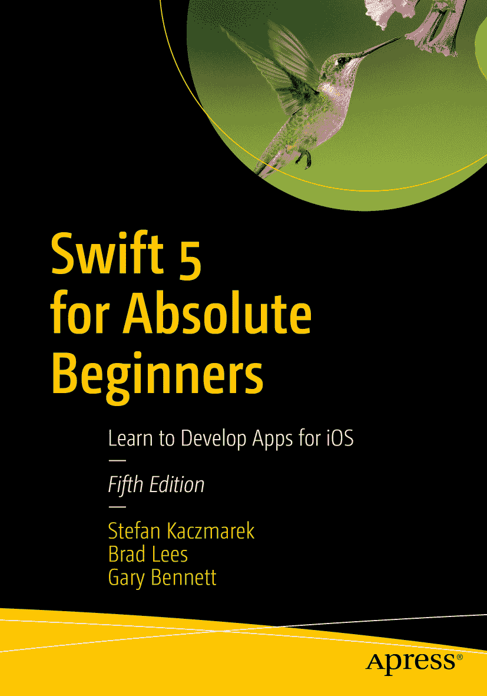
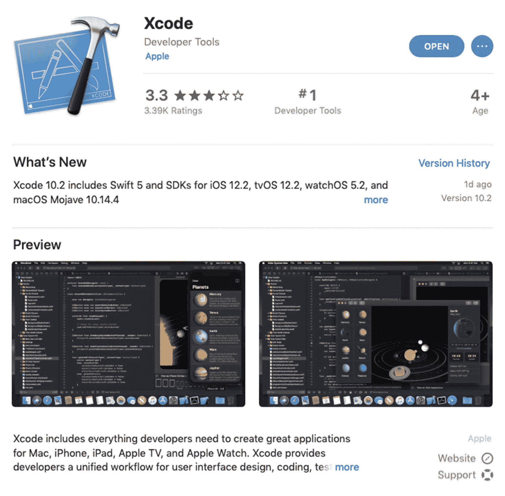
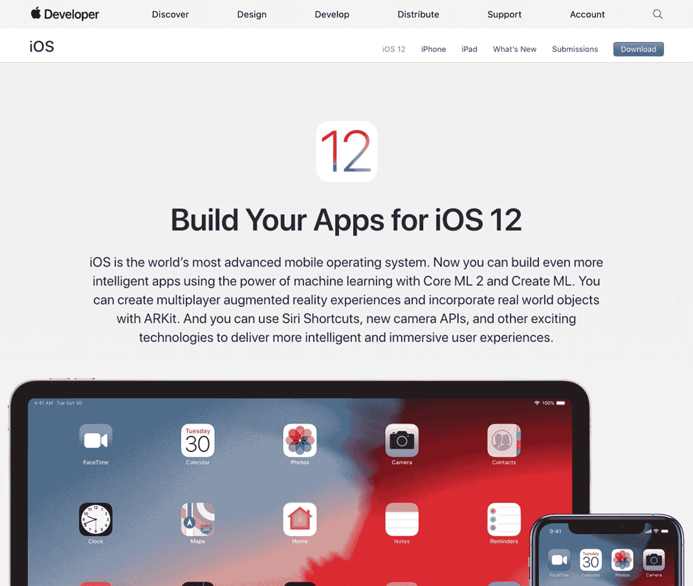
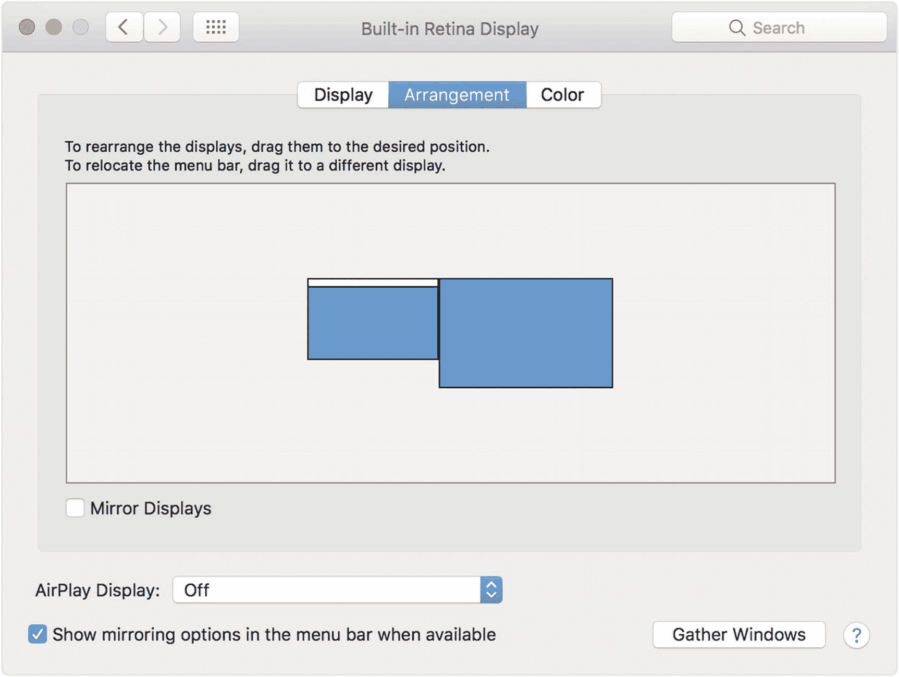

ISBN 978-1-4842-4867-6  
e-ISBN 978-1-4842-4868-3  
[`doi.org/10.1007/978-1-4842-4868-3`](https://doi.org/10.1007/978-1-4842-4868-3)

© 斯特凡·卡茨马雷克、布拉德·李斯、加里·贝内特 2019  
本作品受版权保护。出版商保留所有权利，无论涉及材料的全部或部分，具体包括翻译、重印、重用插图、朗诵、广播、以缩微胶片或任何其他物理方式复制、传输或信息存储与检索、电子改编、计算机软件，或任何目前已知或未来开发的类似或不相似方法的权利。本书中可能出现受商标保护的名称、标识和图像。我们不会在每个出现商标名称、标识和图像的地方使用商标符号，而是仅以编辑方式使用这些名称、标识和图像，以惠及商标所有者，且无意侵犯商标权。本出版物中对商品名称、商标、服务标志及类似术语的使用，即使未明确标识，也不应被视为对这些术语是否受所有权保护的表达。尽管本书中的建议和信息在出版时被认为是真实和准确的，但作者、编辑和出版商均不对可能出现的任何错误或遗漏承担法律责任。出版商对本书所包含的材料不作任何明示或暗示的担保。本书通过纽约施普林格科学与商业媒体在全球图书贸易中发行，地址：233 Spring Street, 6th Floor, New York, NY 10013。电话：1-800-SPRINGER，传真：(201) 348-4505，电子邮件：orders-ny@springer-sbm.com，或访问 www.springeronline.com。Apress Media, LLC 是加利福尼亚州的有限责任公司，其唯一成员（所有者）是施普林格科学与商业媒体金融公司（SSBM Finance Inc）。SSBM Finance Inc 是一家特拉华州公司。

## 引言

在过去的十年里，我们无数次听到以下说法：

*   “我从未编程过，但我对 iPhone 或 iPad 应用有一个绝妙的想法。”
*   “我真的能学会为 iPhone 或 iPad 编程吗？”

对于后者，我们的回答是：“是的，但你必须相信自己能行。”只有你自己会告诉自己做不到。

### 写给新手

本书假设你可能从未编程过。本书也面向那些从未使用过面向对象编程（OOP）语言的人。市面上有许多 Swift 书籍，但所有这些书都假设你之前有编程经验，并且了解 OOP 和计算机逻辑。我们想写一本能够带领读者从对计算机编程和逻辑知之甚少，到能够在 Swift 中编程的书。毕竟，Swift 是 iPhone、iPad 和 Mac 的原生编程语言。

在过去的十年里，我们教会了成千上万名学生成为 iOS（iPhone/iPad）开发者。我们的许多学生已经在 App Store 中开发出了各自类别中最成功的 iOS 应用。我们将在前两门课程——“面向对象编程与逻辑入门”和“面向 iPhone/iPad 开发者的 Swift”——中学到的经验融入到了本书中。

### 写给经验更丰富的开发者

许多多年前编程过、或使用非 OOP 语言编程的开发者，在深入学习 Swift 之前，需要 OOP 和逻辑方面的背景知识。这本书正是为你准备的。我们会循序渐进地引导你了解 OOP 以及它在 iOS 开发中的使用方法，帮助你成为成功的 iOS 开发者。

### 本书的组织方式

你会注意到，我们在这本书中非常注重成功体验。我们在 Swift Playgrounds 中引入 OOP 和逻辑概念，然后将这些概念迁移到 Xcode 中。许多学生是视觉型学习者或通过动手来学习。我们两种技巧都会用到。我们会通过视觉示例带你了解主题和概念，然后通过分步示例强化这些概念。

我们经常在不同章节重复某些主题，以巩固你所学到的内容，并以新的方式应用这些技能。这使得新手程序员能够重新运用开发技能，并在进步过程中获得成就感。如果你觉得某个主题还没有掌握，不用担心！继续前进！

### 成功公式

学习编程是一个程序与你之间的互动过程。就像学习演奏乐器一样，你必须练习。你必须完成本书中的示例和练习。理解一个概念并不意味着你知道如何应用和使用它。

你将从此书中学到很多。你将从完成本书中的练习中学到很多。然而，当你调试程序时，你才会真正学到东西。花时间通读你的代码，并试图找出它为何没有按你预期的方式工作，这是一个无与伦比的学习过程。调试的缺点是新开发者可能会觉得特别沮丧。如果你从未想过要把电脑扔出窗外，那么你会有这种冲动。你会质疑自己为什么要这样做，以及自己是否足够聪明来解决这个问题。编程非常磨练心性，即使对最有经验的开发者来说也是如此。

就像音乐家一样，你练习得越多，就会变得越好。我们所说的练习，指的是编程！作为程序员，你可以做出一些了不起的事情。世界是你的牡蛎。在 App Store 中看到你的应用是最令人满足的成就之一。然而，这是有代价的，这个代价就是花在编码和学习上的时间。

在教会了许多学生成为 iOS 开发者之后，我们总结出了一套让学生成功的公式。以下是我们的成功公式：

*   相信自己能行。唯一会说你做不到的人就是你自己。所以不要这样告诉自己。
*   完成书中所有的示例和练习。
*   编码，编码，再编码。你编码越多，就会变得越好。
*   对自己要有耐心。如果你有幸是一个只需阅读就能记住材料的全优生，这在 Swift 编码中行不通。你必须花时间编码。
*   你通过阅读本书来学习。你真正通过调试代码来学习。
*   不要放弃！

### 开发技术栈

我们将引导你理解 iOS 应用的开发过程以及你需要哪些技术。不过，简要地看一下所有技术组件是很有帮助的。以下是你需要了解的关键 iOS 开发技术，以便构建一个成功的应用并将其发布到 App Store：

*   Apple 开发者网站
*   应用分析
*   iOS SDK
*   Swift
*   面向对象编程与逻辑
*   Xcode 集成开发环境（IDE）
*   调试
*   性能调优

我们知道这有很多技术。别担心，我们会逐一讲解，并让你能够自如地使用它们。

### 所需软件、材料和设备

开发 iOS 应用的一大好处是，几乎所有开发所需的东西都是免费的。

*   Xcode
*   Swift
*   macOS 10.14 或更高版本
*   iOS SDK
*   iOS 模拟器

你需要的入门工具只是一台 Mac 电脑和知道在哪里下载所有东西。我们将介绍这一点。

### 操作系统和集成开发环境

对于开发 iOS 应用，你必须在 Mac 上使用 Xcode。你可以从 Mac App Store 免费下载 Xcode（见图 1）。

**图 1** 从 Mac App Store 下载 Xcode

### 软件开发工具包

你需要注册成为一名开发者。你可以免费在[`https://developer.apple.com/ios`](https://developer.apple.com/ios) 完成注册（见图 2）。

图 2

苹果开发者网站

当你准备好将应用上传到 App Store 时，你需要支付 `$99/年` 的费用才能发布。

### 双显示器

我们建议开发者在电脑上连接第二台显示器。在双独立显示器上同时调试代码、查看输出窗口和 iOS 模拟器，效果非常棒。

苹果硬件让这变得很容易。只需将第二台显示器插入任何 Mac 的端口（当然要使用正确的适配器），就能让两台显示器独立工作。见图 3。请注意，双显示器并非必需。如果没有的话，你只需要整理好打开的窗口，让它们适应屏幕即可。

图 3

在 Mac 上布置双显示器

### 关于作者与技术评审

### 作者简介

### 技术评审简介

