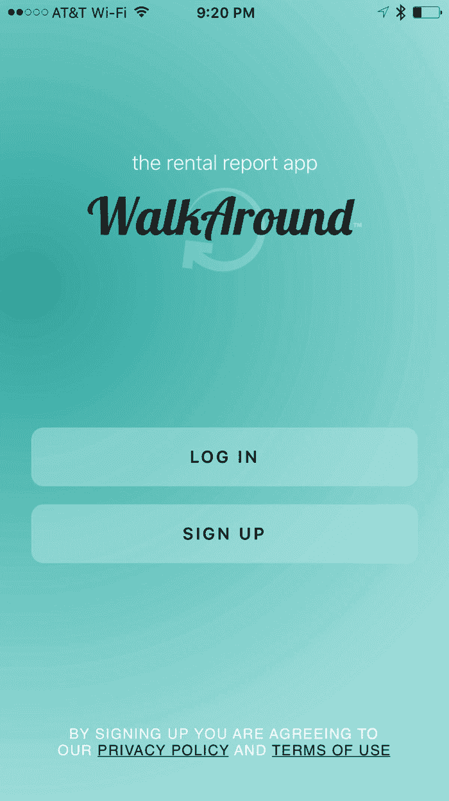
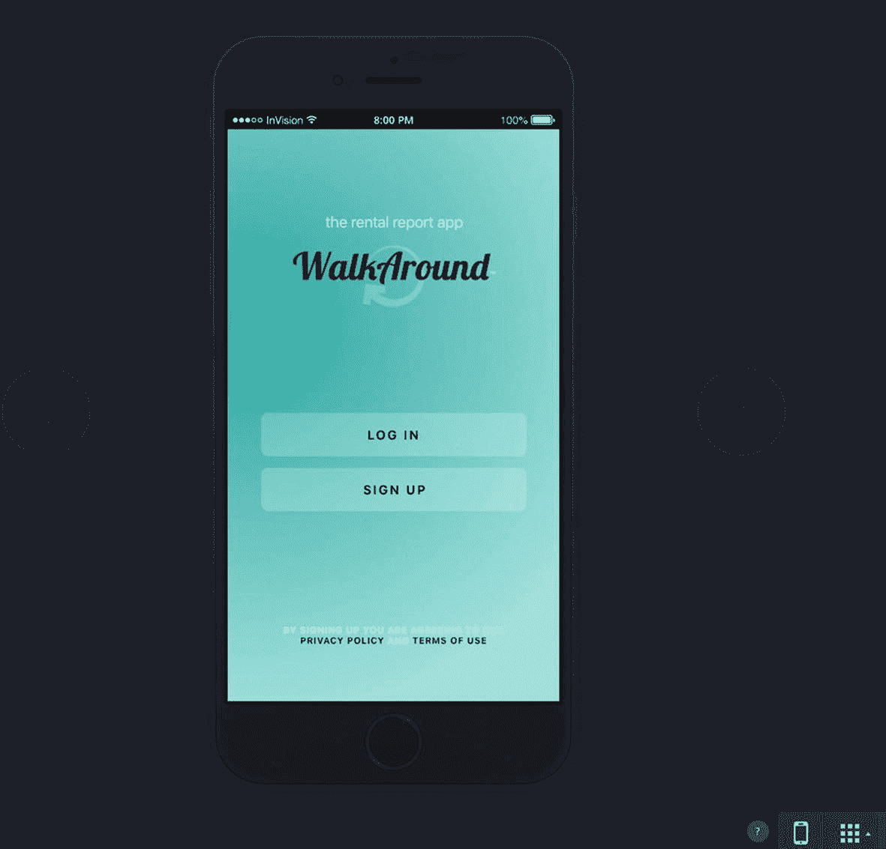
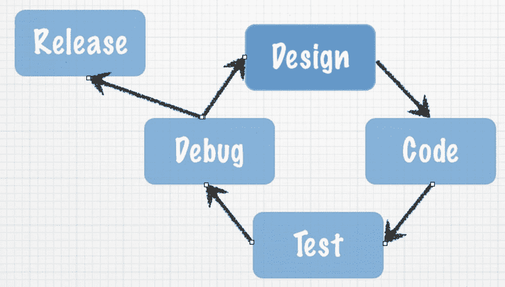
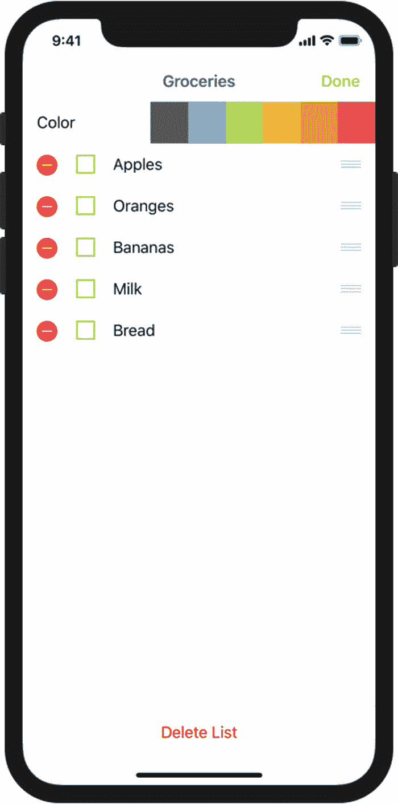
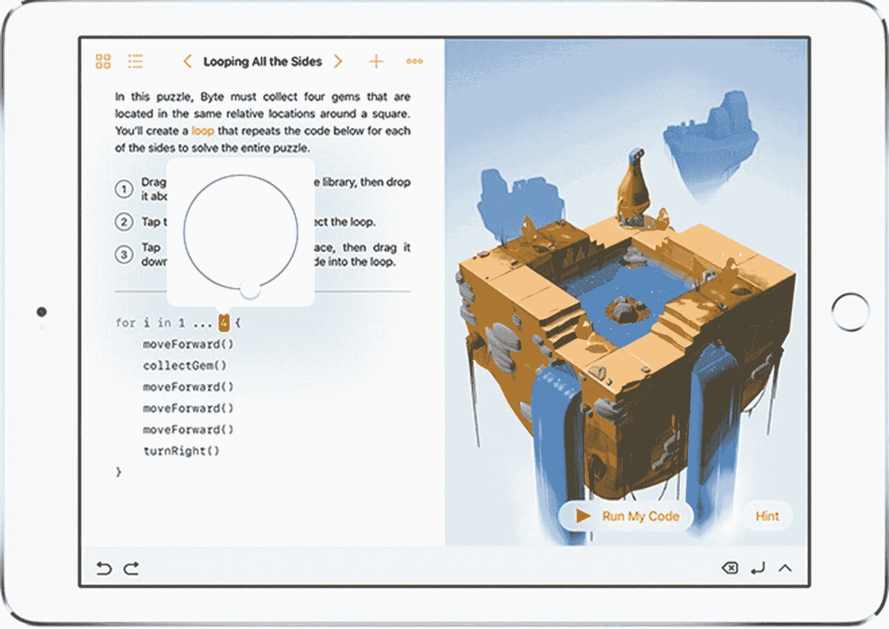

# 1. 成为一名出色的 iOS 开发者

既然你已准备好成为一名软件开发者，并且已经阅读了本书的引言，那么你需要熟悉几个关键概念。你的计算机程序会完全按照你告诉它的指令执行——不多也不少。它将遵循操作系统和 Swift 编程语言定义的编程规则。你的程序不会在意你今天是否心情不好，也不会在意你要求它执行多少次。通常，你认为你告诉了程序去做什么，与程序实际所做的，是两码事。

### 成功的关键

如果你还没读过，请花几分钟时间阅读本书的引言，获取一些关于如何成功开发你自己的 iOS 应用的建议。

根据你的背景，处理这种绝对非黑即白的事物可能会令人沮丧。很多时候，编程学生都会抱怨：“这不是我想要它做的！”但随着你开始积累编程经验和信心，你会开始像程序员一样思考。你将理解软件设计和逻辑，体验到你的程序完全按照你想要的方式运行，以及随之而来的满足感。

## 像开发者一样思考

软件开发涉及编写计算机程序，然后让计算机执行该程序。计算机程序是你希望计算机执行的一组指令。在开始编写计算机程序之前，最好按照你希望完成的顺序，列出你希望程序执行的步骤。这个分步过程被称为算法。

如果你要编写一个计算机程序来烤一片面包，你首先要写一个算法。这个算法可能看起来像这样：

1.  从袋子里取出面包。
2.  将一片面包放入烤面包机。
3.  按下“烘烤”按钮。
4.  等待面包片弹出。
5.  从烤面包机中取出烤好的面包片。

乍一看，这个算法似乎解决了问题。然而，该算法遗漏了许多细节，并且做了很多假设。以下是一些例子：

-   用户想要什么样的面包？用户想要白面包、全麦面包还是其他种类的面包？
-   用户希望面包烤到什么程度？浅色还是重色？
-   面包烤好后，用户想在上面加什么：黄油、人造黄油、蜂蜜还是草莓酱？
-   这个算法对所有文化背景和语言的用户都适用吗？某些文化中可能对“烤面包”有其他叫法，或者根本不知道什么是烤面包。

现在，你可能会想，对于制作一个简单的烤面包程序来说，这过于详细了。多年来，软件开发一直背负着耗时过长、成本过高、不符合用户需求的恶名。之所以会有这样的名声，是因为计算机程序员经常在还没有真正想清楚他们的算法之前，就开始编写程序了。

制作成功应用的关键要素是设计需求。设计需求可以是正式而详细的，也可以简单得像一张纸上的清单。设计需求之所以重要，是因为它们能帮助开发者明确应用在完成时应该做什么，不应该做什么。设计需求不应当在程序员的“真空”中完成，而应是开发者、用户和客户协作的成果。

你成功应用的另一个关键要素是**用户界面**（UI）设计。苹果公司建议你将整个开发过程 50% 以上的时间都花在 UI 设计上。可以使用简单的铅笔和纸张进行设计，或者使用 Xcode 的故事板功能来布局你的屏幕元素。许多软件开发者从 UI 设计开始，在布置完所有屏幕元素并让许多用户查看纸张原型后，再根据屏幕布局来编写设计需求。

### 注意

如果本章只能让你记住一件事，那一定是在开始软件开发之前，充分考虑设计需求和用户界面设计的重要性。这是在软件开发周期中最有效（也成本最低）的时间利用方式。使用铅笔和橡皮擦来修改设计，远比因为没让别人在编程前审查设计而修改代码要容易和快速得多。

在你竭尽全力完善所有设计需求、布局所有用户界面屏幕，并让客户或潜在客户查看你的设计并给出反馈之后，你就可以开始编码了。一旦编码开始，设计需求和用户界面屏幕可能会发生变化，但这种变化通常是微小的，并且很容易被开发流程所适应。见图 1-1 和图 1-2。

图 1-1 展示了一个租赁报告应用在开发前的界面原型。开发原型屏幕以及设计需求，迫使开发者在编码开始前就思考应用许多可用性问题。这有助于缩短应用开发时间，并带来更好的用户体验，以及在 App Store 上获得更好的评价。图 1-2 展示了租赁报告应用的视图完成后的样子。注意原型工具是如何让你将应用模型与现实模型相匹配的。



图 1-2。

这是已完成的 iPhone 租赁报告应用。这个应用被称为 `WalkAround`。



图 1-1。

这是一个 iPhone 移动租赁报告应用在开发开始前的登录屏幕 UI 原型。这个 UI 设计原型是用 `InVision` 完成的。


## 完成开发周期

现在你已经有了设计需求、用户界面设计并编写了程序，接下来该做什么呢？编程结束后，你需要确保程序符合设计需求和用户界面设计，并且不存在错误。在编程术语中，错误被称为 *bug*（缺陷）。Bug 是编程中不希望出现的结果，必须在应用发布到 App Store 之前修复。在程序中查找 bug 并确保程序满足设计需求的过程称为 **测试**。通常，测试工作由具备软件测试方法论经验、且未参与应用编写的人员执行。软件测试通常被称为 **质量保证**（QA）。

### 注

当应用准备提交到 App Store 时，Xcode 会为文件添加 `.app` 或 `.ipa` 扩展名，例如 `appName.app`。这就是 iPhone、iPad 和 Mac 应用被称为 **app** 的原因。本书中 *program*、*application* 和 *app* 指代相同的意思。

在测试阶段，开发者需要与 QA 人员协作，确定应用无法按设计运行的原因。这个过程被称为 *调试*。调试要求开发者逐步检查程序，找出应用未能按设计运行的原因。图 1-3 展示了完整的软件开发周期。



图 1-3. 典型的软件开发周期

在测试和调试过程中，常常需要修改需求（设计），以使应用对用户更易用。设计需求和用户界面修改完成后，整个周期再次开始。

在某个时间点，所有人辛勤开发的应用必须提交到 App Store。关于周期中何时进行提交，需要考虑多种因素：

*   开发成本
*   预算
*   应用的稳定性
*   投资回报率

开发者与管理层之间总存在权衡。开发者希望应用完美无缺，而管理层希望尽快从投资中获得收益。如果发布日期由开发者决定，应用可能永远无法提交到 App Store。开发者会不断调整应用，使其更快、更高效、更易用。然而，在某个时刻，必须将代码从开发者手中“夺走”并上传到 App Store，以便它能实现其设计初衷。

## 介绍面向对象编程

如前文详细介绍，Playground 使你能够专注于**面向对象编程**（OOP），而无需一次性掌握所有 Swift 编程语法和复杂的 Xcode 开发环境。相反，你可以专注于学习 OOP 的基本原则，并快速运用这些原则编写你的第一个程序。

几十年来，开发者一直在探索更好的方式来开发可重用、可管理且易于在项目周期内维护的代码。OOP 旨在帮助实现代码复用和可维护性，同时降低软件开发成本。

OOP 可以被视为程序中对象的集合。通过对这些对象执行操作来实现设计需求。

**对象**是指任何可以被操作的东西。例如，飞机、人或者 iPad 上的屏幕/视图都可以是对象。你可能希望让飞机转弯来操控它，希望让人行走，或者改变 iPad 上应用屏幕的颜色。

Playground 在你完成每一行代码时就会执行它，如图 1-4 所示。当你运行 Playground 应用时，用户可以对应用中的对象施加操作。Xcode 是一个**集成开发环境**（IDE），使你能够在编程环境中直接运行你的应用。你可以先在计算机上测试应用，然后通过 Xcode 的模拟器在 iOS 设备上运行，如图 1-5 所示。



图 1-5. 这个示例 iPhone 应用包含一个用于组织购物清单的表格对象。像“向左旋转”或“用户选中了第 3 行”这样的操作可以应用于该对象。



图 1-4. 此 Playground 视图中有多个对象

作用于对象上的操作被称为**方法**。方法操纵对象来实现你希望应用完成的功能。例如，对于一个 `jet`（喷气式飞机）对象，你可能有以下方法：

```
goUp           // 上升
goDown         // 下降
bankLeft       // 左倾斜
turnOnAfterburners  // 打开加力燃烧室
lowerLandingGear   // 放下起落架
```

图 1-5 中的 `table` 对象在程序中实际被称为 `UITableView`，它可能包含以下方法：

```
numberOfRowsInSection          // 每个分区的行数
cellForRowAtIndexPath           // 返回指定位置的单元格
canEditRowAtIndexPath           // 是否可编辑指定行
commitEditingStyle              // 提交编辑样式
didSelectRowAtIndexPath         // 选中某行后的处理
```

大多数对象都包含描述自身的数据。这些数据被定义为*属性*。每个属性以特定方式描述相关联的对象。例如，`jet` 对象的属性可能如下：

```
altitude = 10,000 feet       // 高度 = 10,000 英尺
heading = North              // 航向 = 北
speed = 500 knots            // 速度 = 500 节
pitch = 10 degrees           // 俯仰角 = 10 度
yaw = 20 degrees             // 偏航角 = 20 度
latitude = 33.575776         // 纬度 = 33.575776
longitude = -111.875766      // 经度 = -111.875766
```

对于图 1-5 中的 `UITableView` 对象，其属性可能如下：

```
backgroundColor = White       // 背景颜色 = 白色
selectedRow = 3               // 选中行 = 第 3 行
animateView = No              // 是否动画视图 = 否
```

当程序运行、用户与应用交互或程序员为满足设计需求而设计应用时，对象的属性可以随时更改。在特定时间点，对象属性中存储的值统称为**对象的状态**。

**状态**是计算机编程中的一个重要概念。在教授学生有关状态的内容时，我们让他们走到窗边，在天空中找一架飞机。然后我们让他们打个响指，并列举出当时飞机属性可能具有的一些值。这些值可能如下：

```
altitude = 10,000 feet       // 高度 = 10,000 英尺
latitude = 33.575776         // 纬度 = 33.575776
longitude = -111.875766      // 经度 = -111.875766
```

这些值代表了他们打响指那一瞬间该*对象*的*状态*。

等待几分钟后，我们让学生找到同一架飞机，再次打响指，并记录下该特定时刻飞机的可能状态。

此时属性值可能变为如下：

```
altitude = 10,500 feet       // 高度 = 10,500 英尺
latitude = 33.575665         // 纬度 = 33.575665
longitude = -111.875777      // 经度 = -111.875777
```

注意对象的状态是如何随时间变化的。


## 使用 Playground 界面

Playground 提供了一种极佳的方式，让你可以在不同时学习 Xcode 和 Swift 语言全部复杂性的前提下，使用刚才讨论的各种概念。只需花上几分钟熟悉 playground 界面，你就可以开始编写程序了。

从技术角度来说，playground 界面并非像你编写 iOS 应用时使用的真正 IDE（集成开发环境），但它非常接近，并且学习起来容易得多。真正的 IDE 将一个应用程序的代码开发、用户界面布局、调试工具、文档以及模拟器/控制台启动功能整合在一起；参见图 1-6。然而，playground 提供了与你开发应用时所用的 Xcode IDE 相似的外观、感觉和功能。


**图 1-6.** 带有 iPhone 模拟器的 Xcode IDE

在下一章中，你将详细了解 playground 界面并编写你的第一个程序。

## 本章小结

恭喜你，你已经完成了本书的第一章。理解以下术语非常重要，因为它们将在本书中反复出现：

* 计算机程序
* 算法
* 设计需求
* 用户界面
* 缺陷（Bug）
* 质量保证（QA）
* 调试
* 面向对象编程（OOP）
* 对象
* 属性
* 方法
* 对象的状态
* 集成开发环境（IDE）

## 下一步

其余章节将提供你学习 Swift 和编写 iOS 应用所需的信息。术语和概念会一遍又一遍地被引入和强化，这样你会逐渐对它们更加熟悉。坚持下去，对自己要有耐心。

### 练习题

* 回答以下问题：
  * 为什么花时间在用户需求上如此重要？
  * 设计需求和算法之间有什么区别？
  * 方法和属性之间有什么区别？
  * 什么是缺陷（bug）？
  * 什么是状态？
* 编写一个算法，描述一台自动售货机从投币到出货的工作过程。假设一瓶苏打水的价格为 80 美分。
* 编写一个用于运行该自动售货机的应用的设计需求。

