# 编程基础

本章重点介绍成为一名优秀的 Swift 程序员所必需的构建模块。本章涵盖如何使用 playground 用户界面、如何编写你的第一个 Swift 程序，以及如何使用 Xcode 集成开发环境（IDE）。

> **注意：** 我们将向你介绍如何使用 playground，这将使你能够立即开始编程，而无需担心 Xcode 项目的所有复杂性。我们使用这种方法来帮助你快速学习这些概念，避免挫败感，并为你打下坚实的基础。

## 初识 Xcode

Xcode 中的 Playground 让编写 Swift 代码变得异常简单且有趣。输入一行代码，结果会立即显示。如果你的代码需要运行一段时间，比如在循环或分支中，你可以通过时间线区域观察其执行过程。当你在 playground 中完成代码后，可以轻松地将代码迁移到 Swift iOS 项目中。使用 Xcode playground，你可以：

* 设计或修改算法，并实时观察每一步的结果
* 创建新的测试，在将其纳入测试套件之前验证它们是否有效

首先，你需要对 Xcode 用户界面有更多了解。当你打开一个 Xcode iOS 项目时，你会看到一个类似于图 2-1 的屏幕。

Xcode 用户界面的设计旨在帮助你高效地编写 Swift 应用程序。该用户界面帮助新程序员学习 iOS 应用程序的用户界面。现在，你将探索 Xcode 的 IDE 工作区和 playground 的主要部分。

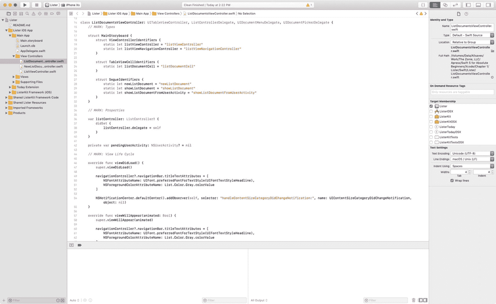

**图 2-1.** 带有 Swift 项目的 Xcode 集成开发环境

### 探索工作区窗口

工作区窗口，如图 2-2 所示，使你能够打开和关闭文件、设置应用程序偏好设置、开发和编辑应用，以及查看文本输出和错误控制台。

工作区窗口是你创建和管理项目的主要界面。该窗口会自动适应当前的任务，你还可以进一步配置窗口以符合你的工作风格。你可以根据需要打开任意数量的工作区窗口。

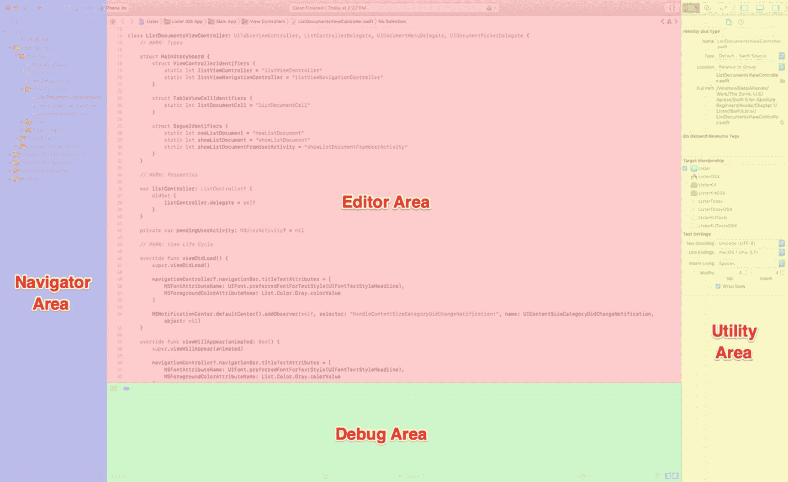

**图 2-2.** Xcode 的工作区窗口

工作区窗口有四个主要区域：**编辑器**、**导航器**、**调试**和**工具**。

当你选择一个项目文件时，其内容会显示在**编辑器**区域，Xcode 会在适当的编辑器中打开该文件。

你可以通过工具栏中视图选择器的按钮来隐藏或显示其他三个区域。这些按钮位于窗口的右上角。

*  点击此按钮可显示或隐藏**导航器**区域。在这里，你可以查看和浏览文件以及项目的其他方面。
* 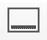 点击此按钮可显示或隐藏**调试**区域。在这里，你可以控制程序执行并调试代码。
* 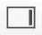 点击此按钮可显示或隐藏**工具**区域。你使用**工具**区域有多种用途，最常见的是查看和修改文件的属性。


### 导航您的工作区

您可以从导航器区域访问项目中的文件、符号、单元测试、诊断信息及其他功能。在导航器选择栏中，您可以选择适合当前任务的导航器。每个导航器的内容区域让您能访问项目的相关部分，而各导航器的过滤栏则允许您限制显示的内容。

在导航器选择栏中，您可以选择以下选项：

*    *项目导航器*：添加、删除、分组以及管理项目中的文件；或选择文件以在编辑器区域查看或编辑其内容。
*    *源代码控制导航器*：当使用像 Git 这样的版本控制系统 (VCS) 时，查看对项目文件所做更改的详细历史记录。
*    *符号导航器*：浏览项目中的类层次结构。
*    *查找导航器*：使用搜索选项和过滤器快速查找项目中的文本。
*    *问题导航器*：查看在打开、分析及构建项目时发现的诊断信息、警告和错误等问题。
*    *测试导航器*：创建、管理、运行和审查单元测试。
*    *调试导航器*：检查程序执行过程中指定时间点的运行线程及相关的堆栈信息。
*    *断点导航器*：通过指定触发条件等特性来微调断点，并在一个位置查看项目中的所有断点。
*    *报告导航器*：查看构建历史记录。

### 编辑项目文件

Xcode 中的大部分开发工作都在**编辑器**区域进行，该区域是工作区窗口中始终可见的主要区域。您最常使用的编辑器如下：

*   *源代码编辑器*：编写和编辑 Swift 源代码。
*   *界面构建器*：以图形方式创建和编辑用户界面文件（参见图 2-3）。
*   *项目编辑器*：查看和编辑如何构建应用，例如通过指定构建选项、目标架构和应用授权。

当您选择一个文件时，Xcode 会在相应的编辑器中打开它。在图 2-3 中，项目导航器中选中了 `Main.storyboard` 文件，该文件已在界面构建器中打开。

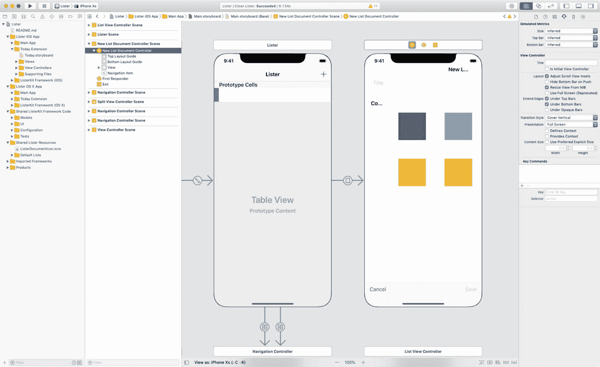

图 2-3. Xcode 的界面构建器显示一个故事板文件

该编辑器提供了三个控件：

*    点击此按钮打开**标准编辑器**。您会看到一个单独的编辑器窗格，其中显示所选文件的内容。
*    点击此按钮打开**助理编辑器**。您会看到一个单独的编辑器窗格，其中显示与标准编辑器窗格内容逻辑相关的内容。
*    点击此按钮打开**版本编辑器**。您会看到所选文件在一个窗格中与同一文件的另一个版本在第二个窗格中的差异。在配合源代码控制时使用。

## 创建您的第一个 Swift Playground 程序

既然您已经对 Xcode 有了一些了解，是时候编写您的第一个 Swift playground 程序，并开始理解 Swift 语言、Xcode 以及一些语法了。首先，您需要安装 Xcode。

### 安装并启动 Xcode 10.2

Xcode 10.2 可从 Mac App Store 免费下载，如图 2-4 所示。

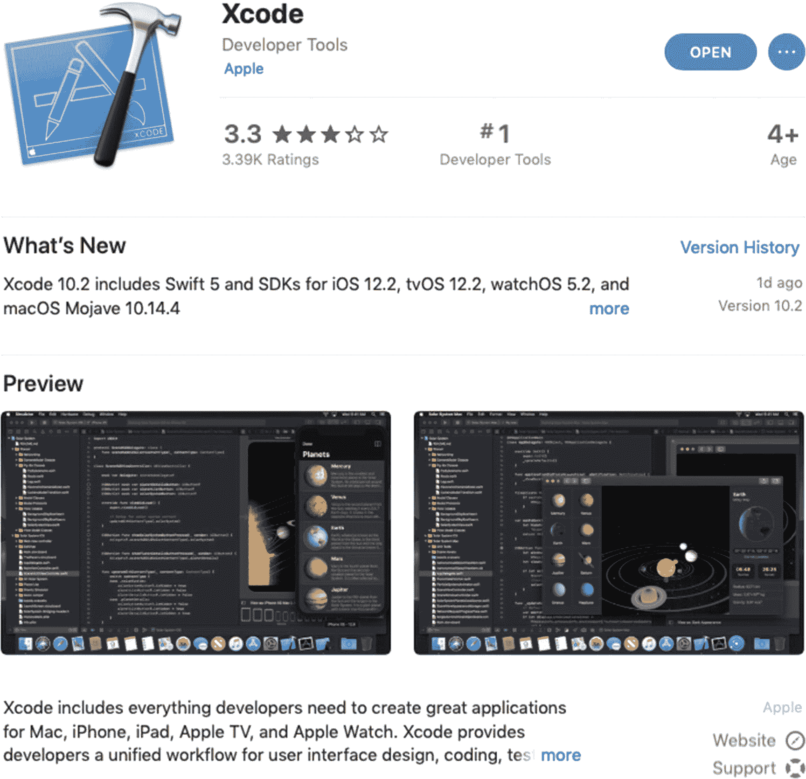

图 2-4. Xcode 10.2 可从 Mac App Store 免费下载

### 注意

该软件包包含编写 iOS、watchOS、tvOS 和 macOS 应用程序所需的一切。要在 iOS 或 macOS App Store 上发布应用，您需要申请 Apple Developer Program，并在准备提交时支付 $99。图 2-5 显示了 Apple Developer Program 网站 [`https://developer.apple.com/`](https://developer.apple.com/)。

现在您已安装 Xcode，让我们开始编写一个 Swift playground。


图 2-5. Apple Developer Program

现在您已安装  

启动 Xcode，然后点击“从 playground 开始”，如图 2-6 所示。

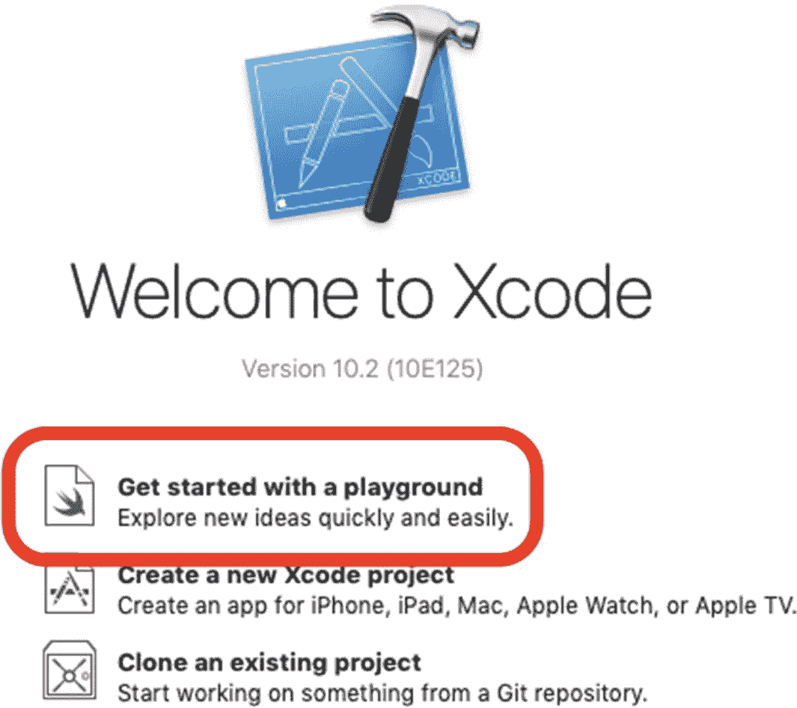

图 2-6. 创建您的第一个 Swift playground

### 使用 Xcode 10.2

在出现新的 Xcode 窗口后，请按照以下步骤操作：

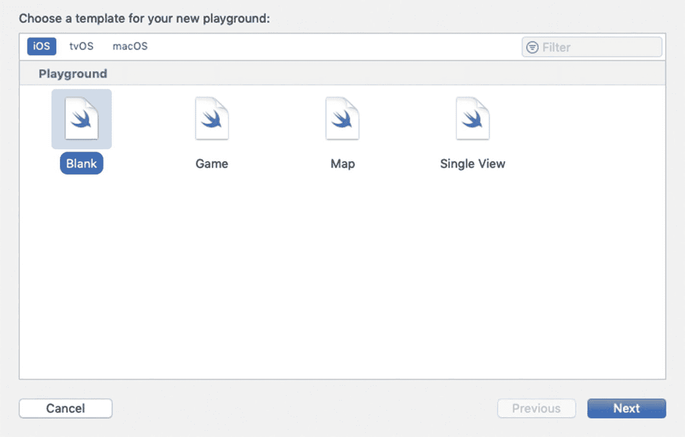

图 2-7. 选择一个空白的 iOS playground 模板

1.  选择一个空白的 iOS 模板，然后点击“下一步”，如图 2-7 所示。
2.  将 playground 命名为 `HelloWorld`，并创建在您选择的文件夹中，例如“文稿”或“桌面”。

Xcode 为您做了大量工作，并创建了一个包含可供使用代码的 playground 文件。它还会在 Xcode 编辑器中打开您的 playground 文件，以便您开始操作，如图 2-8 所示。

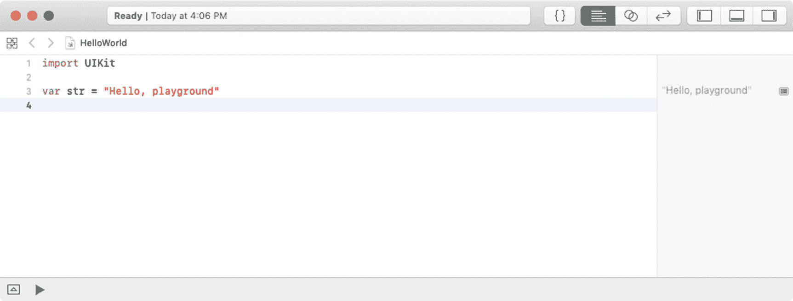

图 2-8. playground 窗口

现在您需要熟悉 Xcode playground IDE。让我们来看两个最常用的功能：

*   编辑器区域
*   结果区域

## Xcode Playground IDE：编辑器区域和结果区域

编辑器区域是 Xcode playground IDE 的核心功能区——您在此将梦想变为现实。这里也是您编写代码的地方。编写代码时，您会注意到代码颜色会发生变化。有时，Xcode 甚至会尝试为您自动补全单词。这些颜色具有含义，您在使用 IDE 时会逐渐明了。编辑器区域同样是您调试代码的地方。


### 注意

尽管我们已经提到过，但还是值得再说一遍：你将通过阅读本书学习 Swift 编程，但只有通过编写和调试代码，你才能*真正*学会 Swift。调试是开发者学习并成为优秀开发者的途径。

让我们添加一行代码，来感受一下 Swift playgrounds 的强大之处。在文件末尾的第 4 行添加以下代码：

```
print(str)
```

你一输入这行代码，Xcode 就会自动执行它，并显示结果 `"Hello, playground\n"`。

当你编写 Swift 代码时，一切都很重要——逗号、大小写和括号。使编译器能够将代码编译成可执行应用的那套规则被称为*语法*。

第 3 行创建了一个名为 `str` 的字符串变量，并将 `"Hello, playground"` 赋值给该变量。

第 4 行将 `str` 字符串变量打印到结果区域。

让我们通过将第 4 行改为 `print(stz)` 来创建一个语法错误，如图 2-9 所示。

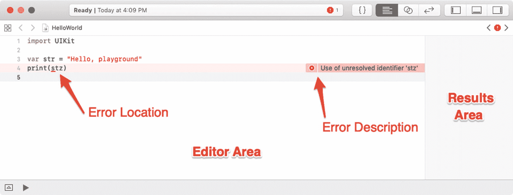

图 2-9. 被 Swift 编译器捕获到语法错误的 playground

在 Swift 中，`print` 是一个函数，它会将其参数的内容打印在结果区域。当你输入代码时，结果区域会自动更新，显示你输入的每一行代码的结果。

现在，让我们通过正确拼写 `str` 变量来修复这个应用，如图 2-10 所示。

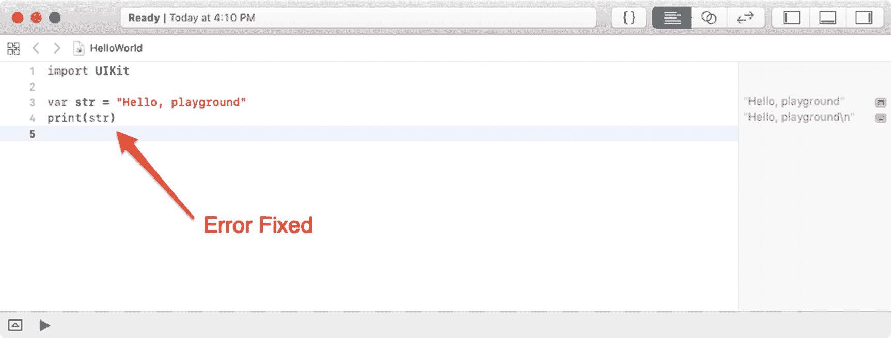

图 2-10. 语法错误已修复

请随意尝试并更改打印的文本。你也可以添加多个变量，或者将两个字符串拼接起来。祝你玩得开心！

## 总结

在这一章中，你构建了你的第一个基本的 Swift playground。我们还介绍了一些对你理解 Swift 至关重要的新 Xcode 术语。

你应该理解以下概念：

*   playground

*   编辑器区域

*   结果区域

### 练习

*   通过添加一行打印任意文本的代码来扩展你的 playground。

