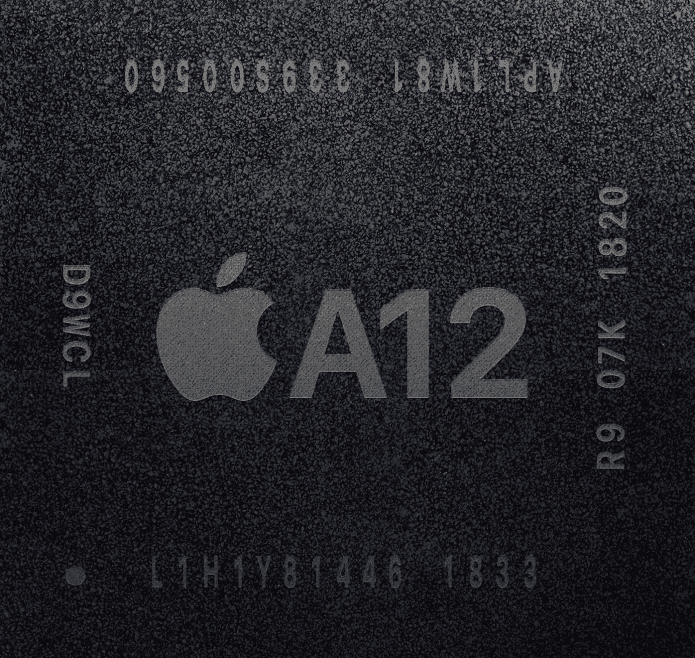
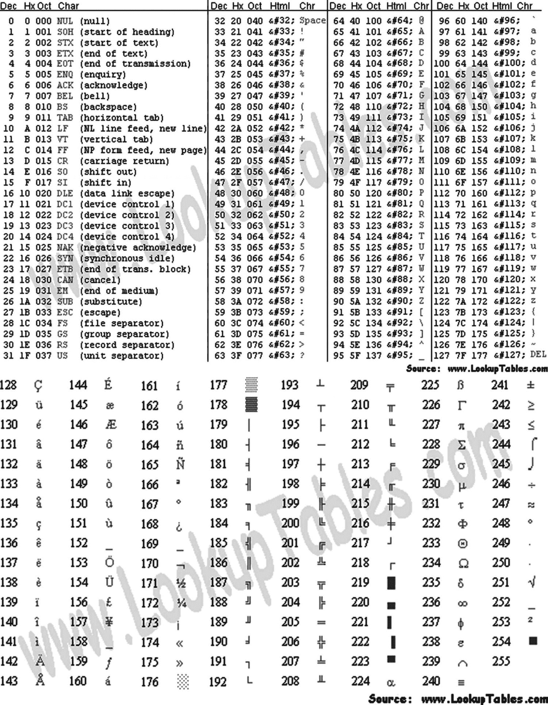
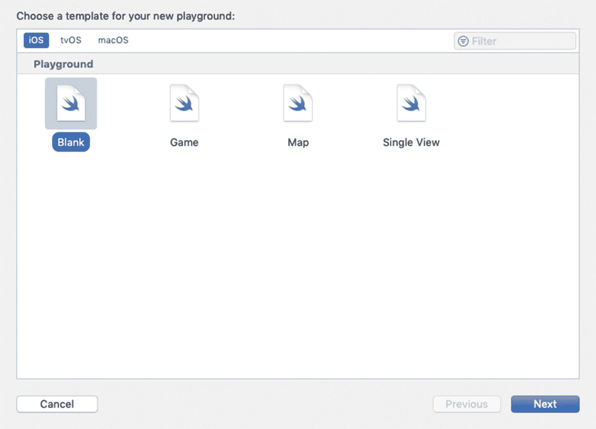
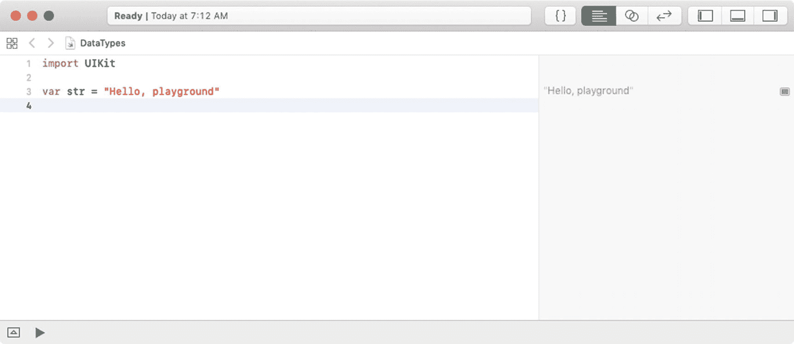
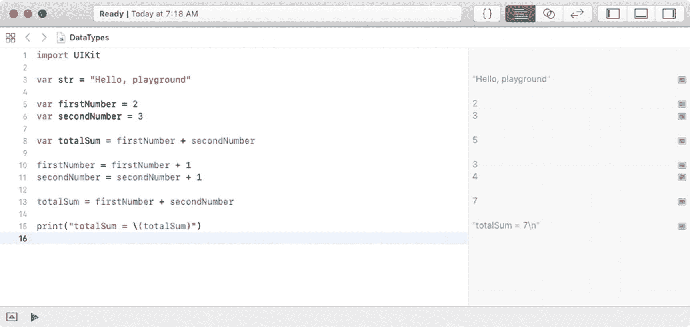
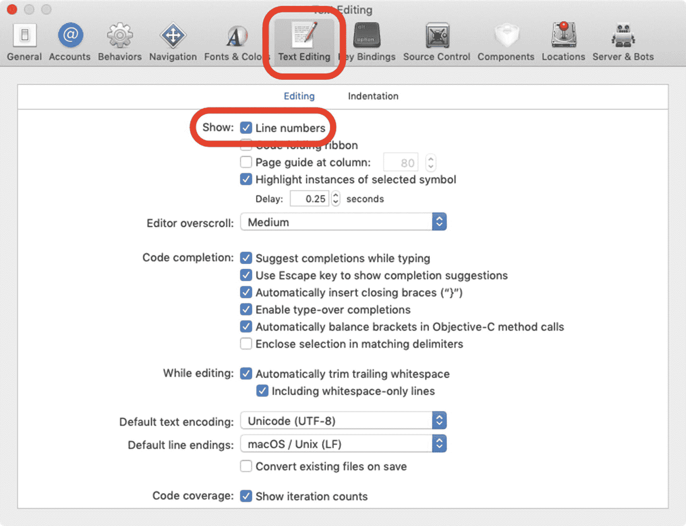

# 3. 一切都与数据有关

你可能知道，数据在计算机内存中是以 0 和 1 的形式存储的。然而，0 和 1 对开发者或应用用户来说并不实用，因此你需要了解程序如何使用数据，以及如何处理存储的数据。

在本章中，你将了解数据在计算机上是如何存储的，以及如何操作这些数据。然后，你将使用 playground 来了解更多关于数据存储的知识。

## 编程中使用的数制

计算机处理信息的方式与人类不同。本节将介绍信息在 iPhone 和 iPad 等设备中存储、计数和操作的各种方式。

### 位

*位*被定义为计算机用于存储和操作数据的基本信息单位。一个位的值要么是 **0**，要么是 **1**。在计算机刚问世时，晶体管和微处理器还不存在。数据是通过真空管的开启或关闭来操作和存储的。如果真空管开启，该位的值就是 `1`；如果真空管关闭，该值就是 `0`。计算机能够存储和操作的数据量，直接取决于它拥有多少真空管。

第一台被公认的计算机被称为电子数字积分计算机（ENIAC）。它占地超过 136 平方米，拥有 18,000 个真空管。它的算力大约相当于你手中的科学计算器。

如今，计算机使用晶体管来存储和操作数据。计算机处理器的性能取决于其芯片或 CPU 上集成了多少晶体管。与真空管类似，晶体管也有关闭或开启两种状态。当晶体管关闭时，其值为 `0`。若晶体管开启，其值为 `1`。在撰写本文时，为 iPhone XS、iPhone XS Max 和 iPhone XR 提供动力的苹果 A12 仿生处理器，是一款 6 核 ARM 处理器，拥有大约 69 亿个晶体管，而第一款 iPad 的 A4 处理器仅有 1.49 亿个晶体管。图 3-1 展示了苹果最新的 iPhone 处理器——A12 仿生。



图 3-1. 苹果专有的 A12 仿生处理器

#### 摩尔定律

iPhone 或 iPad 处理器中的晶体管数量，直接关系到设备的处理速度、图形性能、内存容量以及设备可用的传感器（加速度计、陀螺仪）。晶体管越多，设备就越强大。

1965 年，英特尔联合创始人戈登·E·摩尔描述了处理器中晶体管的趋势。他观察到，从 1958 年到 1965 年，处理器中的晶体管数量每 18 个月翻一番，并且很可能“至少再持续 18 个月”。这一观察结果后来广为人知，被称为摩尔定律，并且在超过 60 年的时间里被证明是准确的。

### 注意

摩尔定律也有不利的一面，你可能已经在钱包里感受到了。处理能力快速提升的问题在于，它会使技术迅速过时。所以，当你的 iPhone 两年合约结束时，市面上的新款 iPhone 的算力将是你签约时那台的两倍。这对大家来说是多么方便啊！

### 字节

字节是用于描述计算机信息存储的另一个单位。一个*字节*由八个位组成。一个位可以表示最多两种不同的值，而一个字节可以表示最多 2⁸，即 256 种不同的值。一个字节可以包含从 `0` 到 `255` 的值。

***二进制***数制用数字符号 `0` 和 `1` 来表示。为了说明数字 **71** 如何用二进制表示，你可以使用一个简单的八位（1 字节）表格，其中每一位都表示为 2 的幂次。要将字节值 **01000111** 转换为十进制，只需将开启的位相加，如表 3-1 所示。

表 3-1. 数字 71 表示为字节 (64 + 4 + 2 + 1)

| 2 的幂次 | 2⁷ | 2⁶ | 2⁵ | 2⁴ | 2³ | 2² | 2¹ | 2⁰ |
| --- | --- | --- | --- | --- | --- | --- | --- | --- |
| “开启”位的值 | 128 | 64 | 32 | 16 | 8 | 4 | 2 | 1 |
| 实际位 | 0 | 1 | 0 | 0 | 0 | 1 | 1 | 1 |

要在二进制中表示数字 **22**，请开启那些加起来等于 22 的位，即 **00010110**，如表 3-2 所示。

表 3-2. 数字 22 表示为字节 (16 + 4 + 2)

| 2 的幂次 | 2⁷ | 2⁶ | 2⁵ | 2⁴ | 2³ | 2² | 2¹ | 2⁰ |
| --- | --- | --- | --- | --- | --- | --- | --- | --- |
| “开启”位的值 | 128 | 64 | 32 | 16 | 8 | 4 | 2 | 1 |
| 实际位 | 0 | 0 | 0 | 1 | 0 | 1 | 1 | 0 |

要在二进制中表示数字 **255**，请开启那些加起来等于 255 的位，即 **11111111**，如表 3-3 所示。

表 3-3. 数字 255 表示为字节 (128 + 64 + 32 + 16 + 8 + 4 + 2 + 1)

| 2 的幂次 | 2⁷ | 2⁶ | 2⁵ | 2⁴ | 2³ | 2² | 2¹ | 2⁰ |
| --- | --- | --- | --- | --- | --- | --- | --- | --- |
| “开启”位的值 | 128 | 64 | 32 | 16 | 8 | 4 | 2 | 1 |
| 实际位 | 1 | 1 | 1 | 1 | 1 | 1 | 1 | 1 |

要在二进制中表示数字 **0**，请开启那些加起来等于 0 的位，即 **00000000**，如表 3-4 所示。

表 3-4. 数字 0 表示为字节

| 2 的幂次 | 2⁷ | 2⁶ | 2⁵ | 2⁴ | 2³ | 2² | 2¹ | 2⁰ |
| --- | --- | --- | --- | --- | --- | --- | --- | --- |
| “开启”位的值 | 128 | 64 | 32 | 16 | 8 | 4 | 2 | 1 |
| 实际位 | 0 | 0 | 0 | 0 | 0 | 0 | 0 | 0 |


### 十六进制

通常，我们需要用计算机识别的另一种格式来表示字符，即十六进制格式。十六进制格式本质上就是二进制的“压缩”版本，用两个字符（例如 `00`、`2A` 或 `FF`）代替八个字符来表示一个字节（八位）。你在调试应用时会遇到十六进制数。*十六进制*系统是一种基数为 16 的计数系统。它使用 16 个不同的符号：0 到 9 表示数值 0 到 9，A 到 F 表示数值 10 到 15。例如，十六进制数 `2AF3` 转换为十进制等于 `(2 × 16³) + (10 × 16²) + (15 × 16¹) + (3 × 16⁰)`，即 10,995。你可以试试 Mac 计算器应用的“编程器”模式，看看十六进制如何与十进制和二进制相互关联。

图 3-2 展示了 ASCII 字符表。由于一个字节可以表示 256 个字符，这非常适合西方字符。例如，十六进制 `20` 表示一个空格。十六进制 `7D` 表示一个右花括号（`}`）。你也可以通过 Mac 计算器应用的“编程器”模式看到这一点，因为它能将数值转换为 ASCII 字符。



**图 3-2** ASCII 字符

### Unicode

用字节表示字符的方式在计算机领域一直运行良好，直到 20 世纪 90 年代左右，个人电脑在非西方国家广泛普及，而那里的语言包含超过 256 个字符。Unicode 不再使用单字节字符集，而是最多可以使用四字节字符集。

为了促进快速采用，前 256 个码点与 ASCII 字符表保持一致。Unicode 可以有不同的字符编码。西方文本最常用的编码称为 UTF-8。其中的“8”表示每个字符使用的位数，因此它像 ASCII 一样，每个字符占用一个字节。

作为一名 iPhone 开发者，你可能会最常使用这种字符编码。

## 数据类型

既然我们已经讨论了计算机如何存储数据，接下来将介绍一个重要的概念，称为*数据类型*。人类通常可以直接查看数据及其使用上下文，来判断数据的类型以及如何使用它。但计算机需要被告知如何做这件事。因此，程序员需要告诉计算机它所接收的数据的类型。示例如下：`2 + 2 = 4`。

计算机需要知道你想要将两个数字相加。在这个例子中，它们是整数。你可能会认为，即使是最不经意的观察者也能明白这两个数相加的含义，更不用说一台先进的计算机了。然而，iOS 应用的用户通常会将数据存储为一系列字符，而不是一个计算式。例如，一条短信可能写着：“每个人都知道 2 + 2 = 4。”

在这种情况下，这个例子是一个由一系列字符组成的*字符串*。数据类型就是对程序的一种声明，用于定义你想要存储的数据。*变量*用于存储你的数据，并在声明时关联一个数据类型。所有数据都存储在变量中，并且变量必须有一个变量类型。例如，在 Swift 中，以下是带有相关数据类型的变量声明：

```
var x: Int = 10
var y: Int = 2
var z: Int = 0
var submarineName: String = "USS Nevada SSBN-733"
```

数据类型不能相互混合。你不能执行以下操作：

```
z = x + submarineName
```

混合数据类型会导致编译器警告或编译器错误，你的应用将无法运行。

表 3-5 给出了 Swift 中基本数据类型的示例。

**表 3-5** Swift 数据类型

| 类型 | 示例 |
| --- | --- |
| `Int` | 1, 5, 10, 100 |
| `Float` 或 `Double` | 1.0, 2.222, 3.14159 |
| `Bool` | `true`, `false` |
| `String` | `"Star Wars"`, `"Star Trek"` |
| `ClassName` | `UIView`, `UILabel` 等 |

## 声明常量和变量

Swift 的常量和变量必须在它们被使用之前声明。使用 `let` 关键字声明常量，使用 `var` 关键字声明变量。常量在初始化后永远不会改变，而变量可以根据需要多次更改。

声明常量和变量类型有两种方式：**显式** 和 **隐式**。

**显式**声明变量类型的语法如下：

```
var name: type = value
var firstNumber: Int = 5
```

然而，声明类型往往不是必需的。隐式声明类型可以缩短代码，使其更易于输入并最终维护。

**隐式**声明变量类型的语法如下：

```
var name = value
var firstNumber = 5
```

你大部分时间都可以使用隐式声明，因为 Swift 足够智能，能够根据你赋予变量的值来推断其类型。

如果一个变量不会改变，你应该将其声明为*常量*。常量永远不会改变。常量以关键字 `let` 开头，如下所示：

```
let secondNumber = 10
```

为了更好地理解变量和常量是如何声明的，这里有两个例子：

```
let maximumNumberOfStudents = 30
var currentNumberOfStudents = 5
```

这段代码可以这样解读：“声明一个名为 `maximumNumberOfStudents` 的新常量，并赋值为 30。然后，声明一个名为 `currentNumberOfStudents` 的新变量，并赋初始值 5。”

在这个例子中，最大学生数被声明为常量，因为最大值永远不会改变。当前学生数被声明为变量，因为在学生注册情况变化后，这个值需要递增或递减。

你在程序中使用的大部分数据可以分为四种不同类型——布尔值、数字、字符串和对象。在本章的剩余部分，我们将讨论如何使用数字和对象数据类型。在第 4 章中，当你学习编写带决策功能的应用时，我们将更多地讨论布尔数据类型。

### 说明

*本地化*你的应用是指编写应用的过程，以便用户能够以他们的母语购买和使用它。这个过程对于本书来说过于高级，但如果你从一开始就计划好，它就是一个简单的步骤。本地化你的应用可以极大地扩大潜在客户总数和应用的收入，而无需你为每种语言重写应用。务必本地化你的应用。这并不难做，而且可以轻松使购买人数翻倍或增加两倍。有关本地化应用的更多信息，请访问 Apple 的“为全世界构建应用”网站：[`https://developer.apple.com/internationalization/`](https://developer.apple.com/internationalization/)。


## 可选类型

Swift 引入了一个重要的概念，称为*可选类型*，开发者需要理解它。即使对于经验丰富的 Objective-C iOS 开发人员来说，这也是一个新概念。可选类型并非难以理解的话题，但需要一些时间来适应。

当某个值可能缺失时，可以使用可选类型。可选类型表示以下含义：

*   一个变量可能被赋值，也可能未被赋值。

有时，常量或变量可能没有值。清单 3-1 展示了一个名为 `Int()` 的整数初始化器的示例，它可以将 `String` 值转换为 `Int`。

```
1 let myString = "42"
2 let someInteger = Int(myString)
3 // someInteger 被推断为 "Int?" 类型，即 "可选 Int"
清单 3-1
将字符串转换为整数
```

常量 `someInteger` 被赋值为整数值 `42`。`someInteger` 也被赋予了 `Int?` 类型。问号表示它是一个可选类型，意味着该变量或常量的值可能缺失。参见清单 3-2。

```
1 let myString = "Hello World"
2 let someInteger = Int(myString)
3 // someInteger 的值现在缺失了
清单 3-2
无法将字符串转换为整数
```

清单 3-2 中的第 2 行有一个问题。无法将 "Hello World" 从 `String` 转换为 `Int`。因此，`someInteger` 的值被认为是缺失的，即 `nil`，因为在第 2 行，`someInteger` 被推断为可选 `Int` 类型。

### 注意

Objective-C 程序员可能曾使用 `nil` 从方法中返回一个对象，其中 `nil` 表示“缺少有效的对象”。这种做法适用于对象，但不适用于结构体、基础 C 类型或枚举值。Objective-C 方法通常会返回一个特殊值，比如 `NSNotFound`，来表示缺少有效的对象。这要求方法的调用者知道要检测的特殊值。可选类型指示了*任何类型*的值的缺失，而不需要使用特殊常量。

`Integer Int()` 初始化器可能无法返回值，因此该方法返回一个*可选* `Int`，而不是 `Int`。再次说明，问号表示其包含的值是可选的，意味着它可能包含*某个* `Int` 值，也可能*完全没有值*。该值要么是某个 `Int`，要么什么都不是。

Swift 的 `nil` 与 Objective-C 中的 `nil` 不同。在 Objective-C 中，`nil` 是指向一个不存在对象的指针。而在 Swift 中，`nil` 不是指针，它表示值的缺失。任何类型的可选值都可以被设置为 `nil`，而不仅仅是对象类型。

在第 4 章中，你将学习如何“解包”可选类型，并检查是否存在有效的对象。

## 在 Playground 中使用变量

现在你已经了解了数据类型，让我们在 playground 中编写代码来两个数字相加并显示结果。

1.  打开 Xcode 并选择“Get started with a playground”，如图 3-3 所示。

    

    图 3-3

    创建 playground

2.  选择一个空白的 iOS 模板，然后点击 Next，如图 3-4 所示。最后，将你的 playground 命名为 **DataTypes** 并点击 Create。

    

    图 3-4

    选择空白 iOS playground 模板

3.  当你的 playground 创建完成后，代码中已经为你放入了两行代码，如图 3-5 所示。

    

    图 3-5

    两行代码

4.  向此 playground 中添加代码，如清单 3-3 所示。

```
1 import UIKit

3 var str = "Hello, playground"

5 var firstNumber = 2
6 var secondNumber = 3

8 var totalSum = firstNumber + secondNumber

10 firstNumber = firstNumber + 1
11 secondNumber = secondNumber + 1

13 totalSum = firstNumber + secondNumber

15 print("totalSum = \(totalSum)")
清单 3-3
Playground 加法运算
```

你的 playground 应如图 3-6 所示。



图 3-6

显示 Swift 代码结果的 Playground

Playground 的其中一个巧妙功能是，当你输入代码时，Swift 会立即执行你输入的那行代码，这样你就可以立即查看结果。

Swift 编程中使用的 `//` 使程序员能够为他们的代码添加注释。注释不会被你的应用程序编译，而是用作程序员或（更重要的）后续开发者的笔记。注释有助于原始开发者及后来的开发者理解应用程序是如何开发的。

有时，注释需要跨越多行，或者仅覆盖一行的一部分。这可以通过 `/*` 和 `*/` 来实现。`/*` 和 `*/` 之间的所有文本都被视为注释，不会被编译。

`print` 是一个函数，它可以接受一个参数并打印其内容。

### 注意

如果你的编辑器没有之前截图中看到的相同菜单或装订线（包含程序行号的左列），你可以在 Xcode 偏好设置中开启这些设置。你可以通过点击菜单栏中的 Xcode 菜单，然后选择 Preferences 来打开 Xcode 偏好设置。参见图 3-7。



图 3-7

在装订线中添加行号

## 总结

在本章中，你学习了应用程序如何使用数据。你了解了如何初始化变量以及如何为它们赋值。我们解释道，当声明变量时，它们具有关联的数据类型，并且只有相同类型的数据才能赋值给变量。我们还讨论了变量和常量之间的区别，并介绍了可选类型。

在下一章中，我们将探索如何使用布尔逻辑来控制应用程序内的数据流。

### 练习

*   在一个 Swift playground 中编写代码，将两个整数相乘并显示结果。

*   在一个 Swift playground 中编写代码，计算一个浮点数的平方。显示得到的浮点数结果。

*   在一个 Swift playground 中编写代码，计算两个浮点数相减，并将结果存储为整数。注意，不会进行四舍五入。


