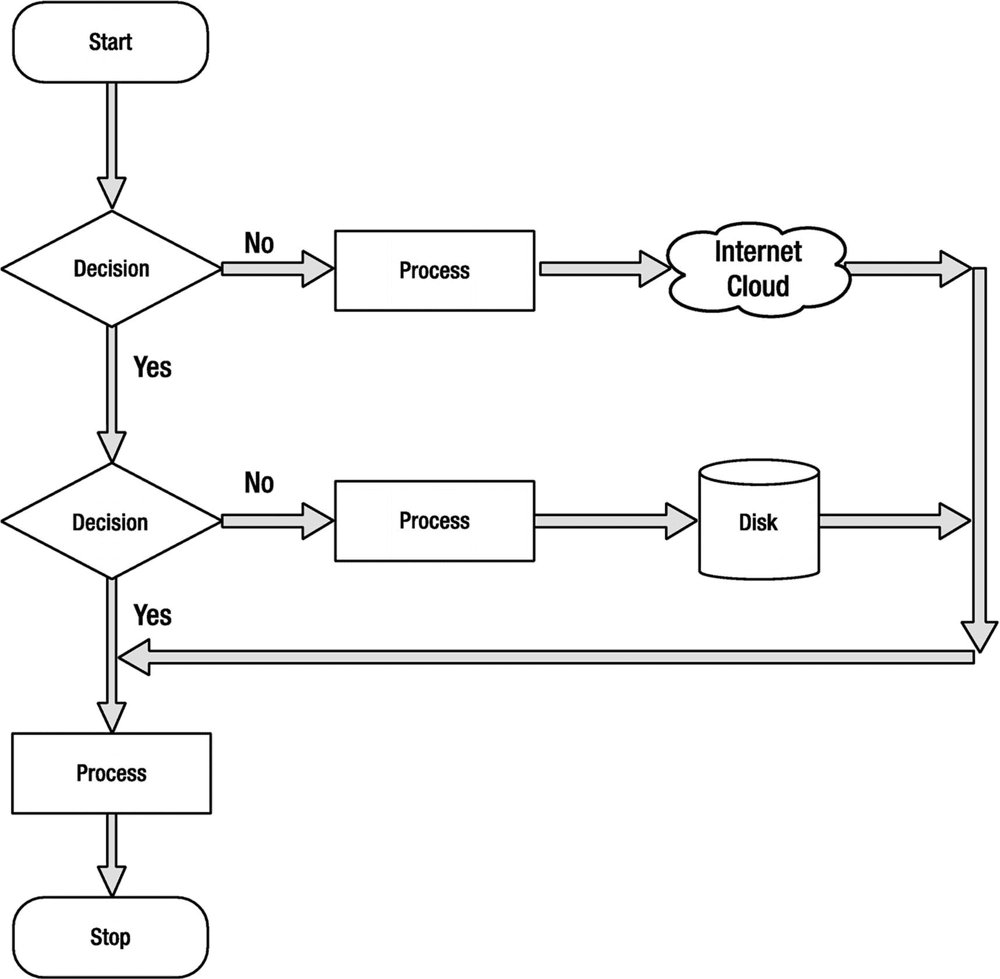
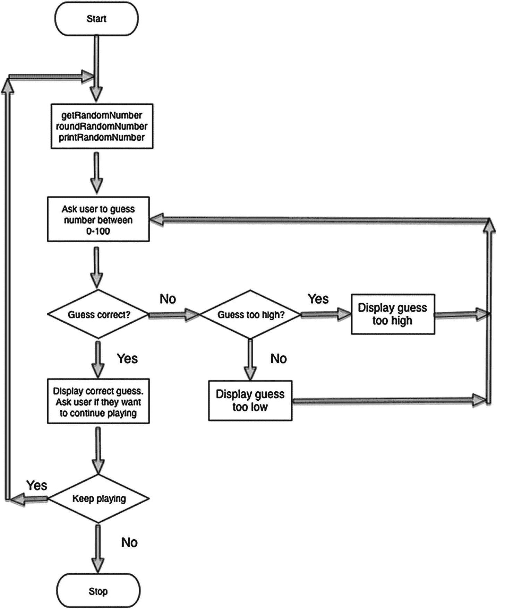
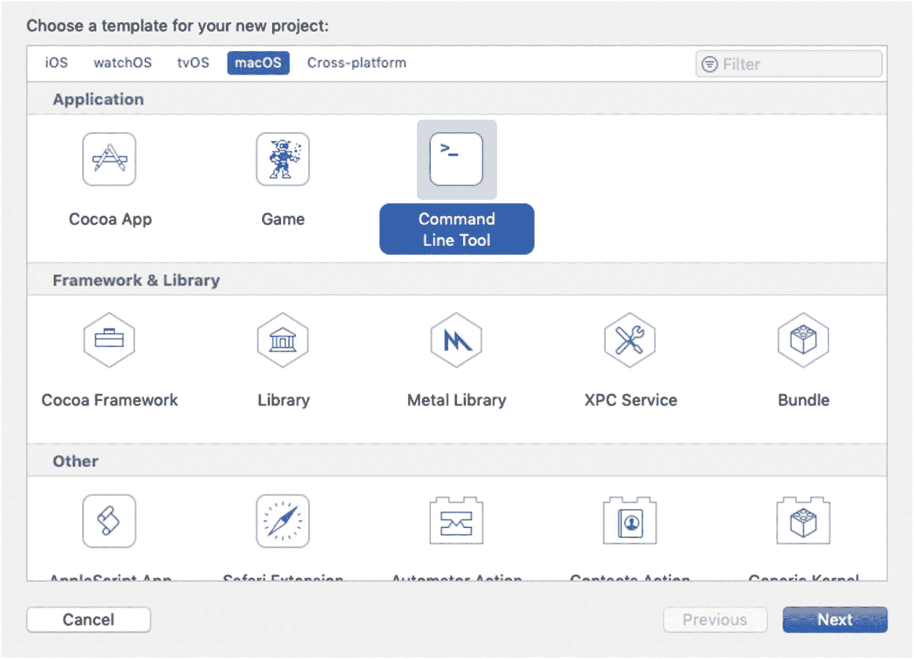
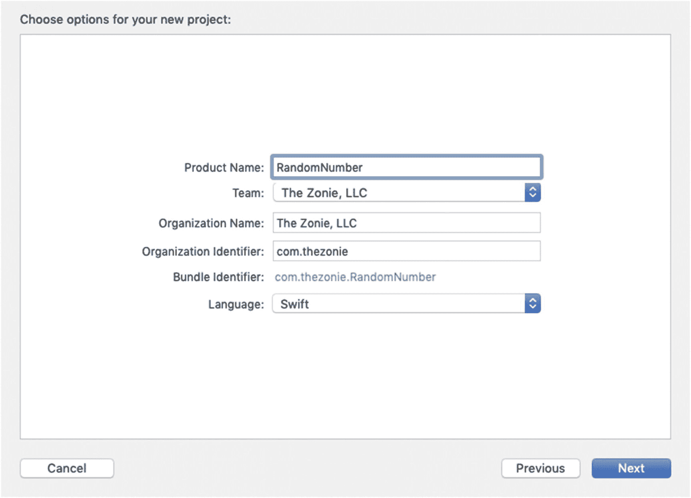
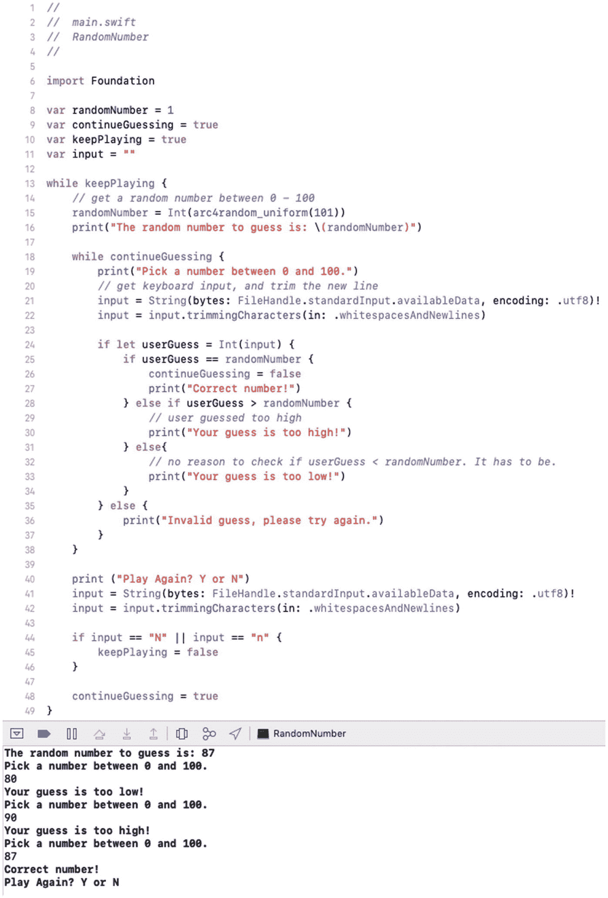
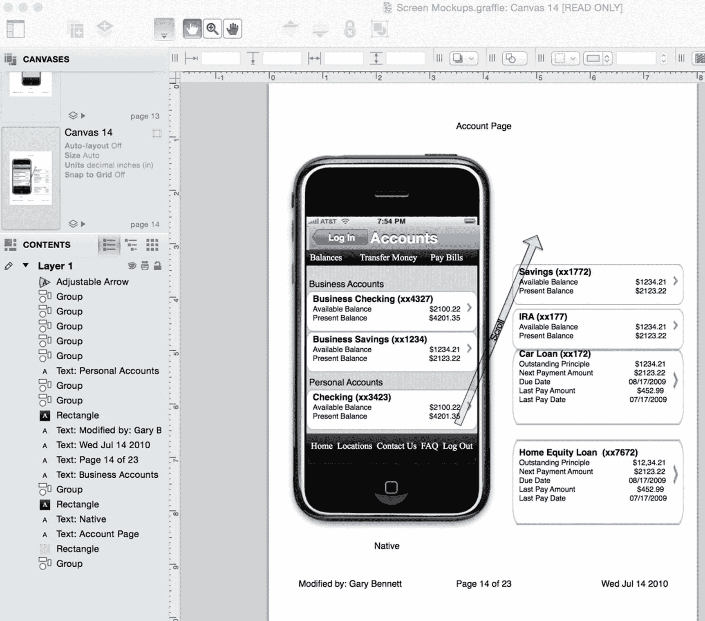
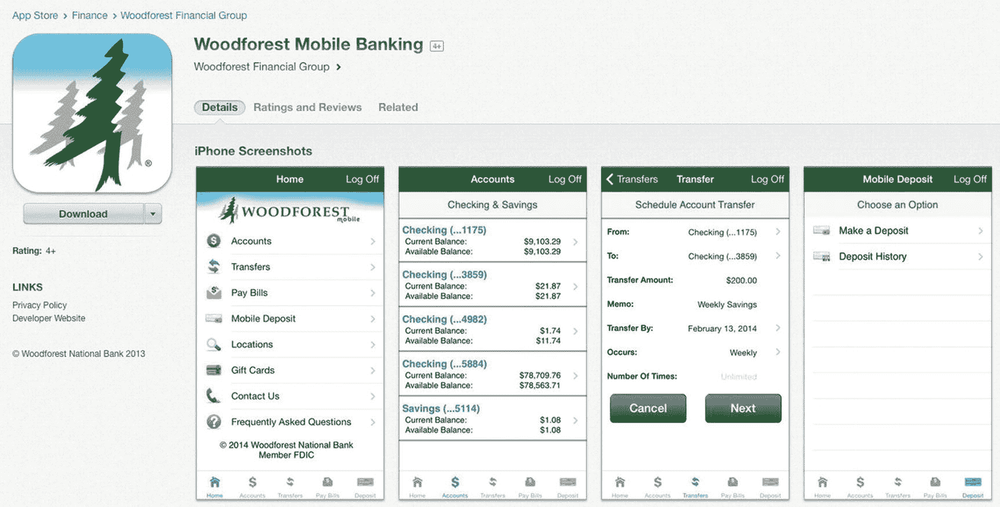
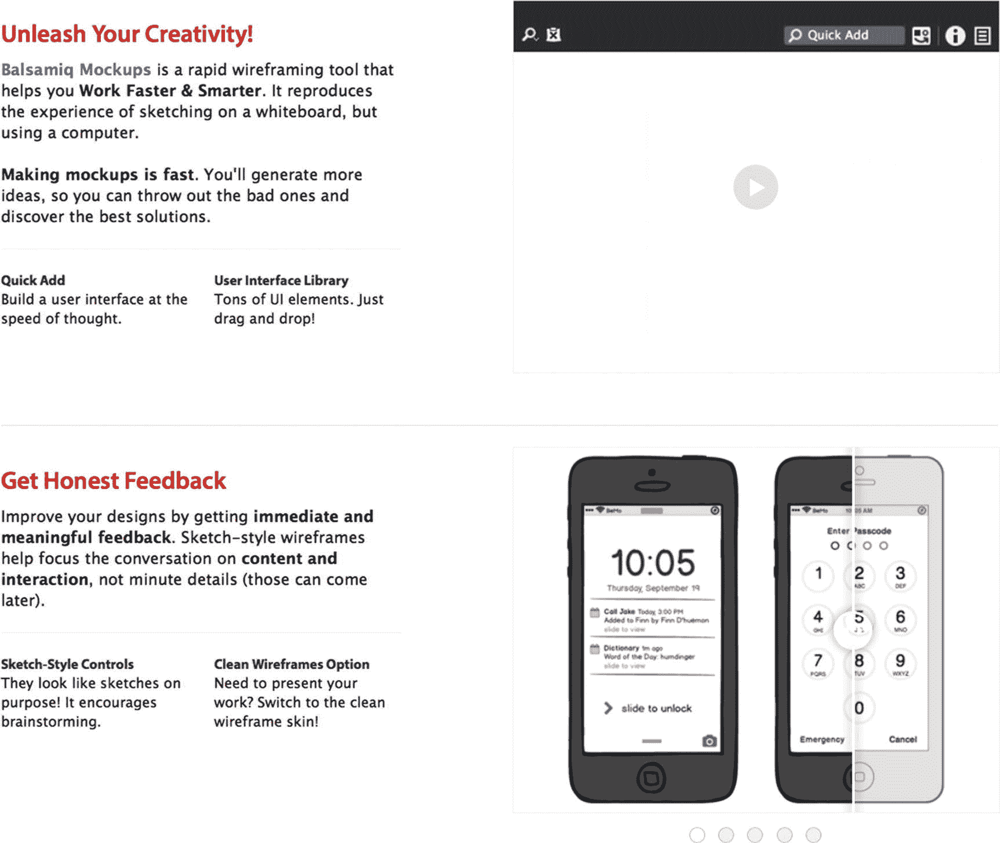

# 4. 决策、程序流程与应用设计

作为 iOS 开发者的一大好处是，你可以让设备精确地按照你的指令行事，它们会不厌其烦地反复执行任务。这是因为 iOS 设备不会在意昨天的辛劳，也不会被情绪左右。这些设备不需要拥抱。

作为开发者也有一个缺点：你必须在设计应用时考虑到所有可能的结果。许多开发者喜欢拥有这种掌控感，他们乐于专注于应用中的诸多细节；然而，处理如此多的细节也可能令人沮丧。正如本书引言中提到的，开发应用需要付出代价，这个代价就是时间。你投入开发和调试的时间越多，就越能掌握所有细节，你的应用性能也会越好。要成为一名成功的开发者，你必须付出这个代价。

计算机的世界是非黑即白的，没有灰色地带。你的设备产生的结果，很多都基于真与假的条件。

在本章中，你将学习计算机逻辑以及如何控制应用的流程。信息处理并得出结果是所有应用的核心。你的应用需要根据数值和条件来处理数据。为此，你需要理解计算机如何执行逻辑运算，并基于应用获取的信息来执行代码。

## 布尔逻辑

*布尔逻辑*是一种用于逻辑运算的系统。布尔逻辑使用二元运算符（如 `AND` 和 `OR`）以及一元运算符 `NOT` 来判断你的条件是否满足。二元运算符需要两个操作数，一元运算符需要一个操作数。

我们刚引入的几个新术语听起来可能有些令人困惑；不过，你可能每天都会用到布尔逻辑。让我们看几个使用二元运算符 `AND` 和 `OR` 的布尔逻辑例子，这些例子来自父母有时会与青春期孩子进行的对话：

“如果你的房间收拾干净了，**而且**碗碟也收纳好了，今晚你就可以去看电影。”

“如果你的房间收拾干净了，**或者**碗碟收纳好了，今晚你就可以去看电影。”

布尔运算符的结果要么是 `TRUE`，要么是 `FALSE`。在第 3 章中，我们简要介绍了布尔数据类型。定义为布尔类型的变量只能包含值 `TRUE` 和 `FALSE`。

```
var seeMovies: Bool = false
```

在前面的例子中，`AND` 运算符需要两个操作数：一个位于 `AND` 的左侧，一个位于右侧。每个操作数都可以独立地被评估为 `TRUE` 或 `FALSE`。

要使 `AND` 运算产生 `TRUE` 结果，`AND` 的两边都必须为 `TRUE`。在第一个例子中，青少年必须打扫干净房间，并且把碗碟收纳好。只要其中一个条件为 `FALSE`，结果就是 `FALSE`——青少年无法去看电影。

要使 `OR` 运算产生 `TRUE` 结果，只需一个操作数为 `TRUE`，或者两个条件都为 `TRUE` 也可产生 `TRUE` 结果。在第二个例子中，只要卧室干净了，就能去看电影。

### 注意

在 Objective-C 和其他编程语言中，布尔变量可以保存整数值；`0` 代表 `FALSE`，任何非零值代表 `TRUE`。Swift 的强类型检查不允许这样做。在 Swift 中，布尔变量只能被赋值为 `true` 或 `false`。

`NOT` 语句是一个一元运算符。它只需要一个操作数即可产生布尔结果。示例如下：

“你不可以去**看电影**。”

这个例子只使用了一个操作数。`NOT` 运算符将 `TRUE` 操作数变为 `FALSE`，将 `FALSE` 操作数变为 `TRUE`。此处的结果是 `FALSE`。

`AND`、`OR` 和 `NOT` 是三种常见的布尔运算符。有时，你需要使用更复杂的运算符。`XOR`、`NAND` 和 `NOR` 是 iOS 开发者常用的其他运算。

布尔运算符 `XOR` 表示*异或*。记住 `XOR` 运算符工作原理的一个简单方法是：`XOR` 运算符*只有当且仅当一个参数为 TRUE（而非两个都为 TRUE）时*，才会返回 `TRUE` 结果。

Swift 没有内置 `NAND` 和 `NOR` 运算符，但只需知道它们分别表示“与非”和“或非”即可。在评估完 `AND` 或 `OR` 的参数后，直接对结果取反即可。

### 真值表

你可以使用一种叫做*真值表*的工具来帮助评估所有布尔运算符。真值表是逻辑学中用于评估布尔运算符的数学表格。在尝试确定布尔运算符的所有可能性时，它们非常有用。让我们看看 `AND`、`OR`、`NOT`、`XOR`、`NAND` 和 `NOR` 的一些常见真值表。

在一个 `AND` 真值表中，有四种 `TRUE` 和 `FALSE` 的可能组合：

- `TRUE AND TRUE` = `TRUE`
- `TRUE AND FALSE` = `FALSE`
- `FALSE AND TRUE` = `FALSE`
- `FALSE AND FALSE` = `FALSE`

将这些组合放入真值表，结果如表 4-1 所示。

**表 4-1** AND 真值表

| A | B | A AND B |
| --- | --- | --- |
| `TRUE` | `TRUE` | `TRUE` |
| `TRUE` | `FALSE` | `FALSE` |
| `FALSE` | `TRUE` | `FALSE` |
| `FALSE` | `FALSE` | `FALSE` |

一个 `AND` 真值表仅在其两个操作数都为 `TRUE` 时，才产生 `TRUE` 结果。

表 4-2 展示了一个 `OR` 真值表及其所有可能的操作数。

**表 4-2** OR 真值表

| A | B | A OR B |
| --- | --- | --- |
| `TRUE` | `TRUE` | `TRUE` |
| `TRUE` | `FALSE` | `TRUE` |
| `FALSE` | `TRUE` | `TRUE` |
| `FALSE` | `FALSE` | `FALSE` |

一个 `OR` 真值表在其一个或两个操作数为 `TRUE` 时，产生 `TRUE` 结果。

表 4-3 展示了一个 `NOT` 真值表及其所有可能的操作数。

**表 4-3** NOT 真值表

| A | NOT A |
| --- | --- |
| `TRUE` | `FALSE` |
| `FALSE` | `TRUE` |

`NOT` *翻转比特位*，或者说取原始操作数布尔值的反值。

表 4-4 展示了一个 `XOR`（或异或）真值表及其所有可能的操作数。

**表 4-4** XOR 真值表

| A | B | A XOR B |
| --- | --- | --- |
| `TRUE` | `TRUE` | `FALSE` |
| `TRUE` | `FALSE` | `TRUE` |
| `FALSE` | `TRUE` | `TRUE` |
| `FALSE` | `FALSE` | `FALSE` |

运算符 `XOR` 仅当只有一个操作数为 `TRUE` 时，才产生 `TRUE` 结果。

表 4-5 展示了一个 `NAND` 真值表及其所有可能的操作数。

**表 4-5** NAND 真值表

| A | B | A NAND B |
| --- | --- | --- |
| `TRUE` | `TRUE` | `FALSE` |
| `TRUE` | `FALSE` | `TRUE` |
| `FALSE` | `TRUE` | `TRUE` |
| `FALSE` | `FALSE` | `TRUE` |

表 4-6 展示了一个 `NOR` 真值表及其所有可能的操作数。

**表 4-6** NOR 真值表

| A | B | A NOR B |
| --- | --- | --- |
| `TRUE` | `TRUE` | `FALSE` |
| `TRUE` | `FALSE` | `FALSE` |
| `FALSE` | `TRUE` | `FALSE` |
| `FALSE` | `FALSE` | `TRUE` |

看待 `NAND` 和 `NOR` 运算符最简单的方式，就是分别对 `AND` 和 `OR` 真值表中的结果直接取反。

### 比较运算符

在软件开发中，你可以使用*比较运算符*来比较不同的数据项。这些运算符会产生逻辑上的 `TRUE` 或 `FALSE` 结果。表 4-7 展示了比较运算符列表。

**表 4-7** 比较运算符

| 运算符 | 定义 |
| --- | --- |
| `>` | 大于 |
| `<` | 小于 |
| `>=` | 大于或等于 |
| `<=` | 小于或等于 |
| `==` | 完全等于 |
| `!=` | 不等于 |

### 注意

如果你总是忘记大于号和小于号的方向，不妨用我们小学时学的一个小窍门：将大于号和小于号想象成鳄鱼的嘴巴，鳄鱼总是吃掉更大的数值。听起来可能有点傻，但很管用。


## 设计应用

现在我们已经介绍了布尔逻辑和比较运算符，你可以开始设计自己的应用了。有时，向他人表达应用的全部或部分内容时，无需编写实际代码，这非常重要。

编写伪代码有助于开发者进行"出声思考"，并与其它开发者就代码中令人关注的部分进行头脑风暴。这有助于在编码开始之前分析问题和可能的解决方案。

## 伪代码

**伪代码**指的是编写一种代码，它是对你试图解决的算法的高级描述。伪代码不包含编码所需的编程语法；但它确实表达了解决当前问题所需的算法。

伪代码可以手写在纸上（或白板上），也可以在计算机上输入。

利用伪代码，你可以应用自己所了解的布尔数据类型、真值表和比较运算符。请参考清单 4-1 中的一些伪代码示例。

> **注意：** 伪代码用于表达和传授编程思想。伪代码无法执行！

```
x = 5
y = 6
isComplete = TRUE
if x < y
{
// 在此示例中，x 小于 6
执行某些操作
}
else
{
执行其他操作
}
if isComplete == TRUE
{
// 在此示例中，isComplete 等于 TRUE
执行某些操作
}
else
{
执行其他操作
}
// 另一种检查 isComplete == TRUE 的方法
if isComplete
{
// 在此示例中，isComplete 为 TRUE
执行某些操作
}
// 检查值是否为 false 的两种方法
if isComplete == FALSE
{
执行某些操作
}
else
{
// 在此示例中，isComplete 为 TRUE，因此将执行 else 块
执行其他操作
}
// 另一种检查 isComplete == FALSE 的方法
if !isComplete
{
执行某些操作
}
else
{
// 在此示例中，isComplete 为 TRUE，因此将执行 else 块
执行其他操作
}
清单 4-1
在 if-then-else 代码中使用条件运算符的伪代码示例
```

请注意，`!` 会翻转其所应用布尔值的状态，因此使用 `!` 可以将 `TRUE` 变为 `FALSE`，并将 `FALSE` 变为 `TRUE`。这就是 Swift 中的逻辑非运算符。

通常，需要组合多个比较测试。复合关系测试是指由一个或多个简单关系测试通过 `&&` 或 `||`（两个竖线字符）连接而成。

`&&` 和 `||` 在 Swift 中分别代表逻辑与和逻辑或。清单 4-2 中的伪代码演示了逻辑与和逻辑或运算符。

```
x = 5
y = 6
isComplete = TRUE
// 使用逻辑与
if x < y && isComplete == TRUE
{
// 在此示例中，x 小于 6 且 isComplete == TRUE
执行某些操作
}
if x < y || isComplete == FALSE
{
// 在此示例中，x 小于 6。
// 对于 OR 运算，只需一个操作数为 TRUE 即可得到 TRUE
// 参见表 4-2 列 A OR 真值表
执行某些操作
}
// 另一种测试 TRUE 的方法
if x < y && isComplete
{
// 在此示例中，x 小于 6 且 isComplete == TRUE
执行某些操作
}
// 另一种测试 FALSE 的方法
if x < y && !isComplete
{
执行某些操作
}
else
{
// isComplete == TRUE
执行其他操作
}
清单 4-2
使用 && 和 || 逻辑运算符的伪代码
```

## 可选类型与强制解包

第 3 章介绍了可选类型。可选类型是可能不包含值的变量。由于可选类型可能不包含值，因此在访问它们之前需要检查一下。

首先，你使用一个 `if` 语句，通过将可选类型与 `nil` 进行比较，来判断该可选类型是否包含值。如果可选类型有值，则被视为"不等于" `nil`，如清单 4-3 所示。

清单 4-3 中的第 4 行检查可选变量是否不等于 `nil`。在此示例中，`someInteger` 的值为空，并且等于 `nil`，因此执行了第 8 行的代码。

```
1 var myString = "Hello world"
2 let someInteger = Int(myString)
3 // someInteger 的值现在为空
4 if someInteger != nil {
5     print("someInteger 包含一个整数值。")
6 } else {
7     print("someInteger 不包含整数值。")
8 }
清单 4-3
检查可选类型是否有值
```

既然你已经添加了检查以确保可选类型有值或没有值，你可以通过在可选名称的末尾添加感叹号（`!`）来访问其值。`!` 意味着你已经检查过并确保可选变量有值，然后使用它。这称为可选值的**强制解包**。请参见清单 4-4。

```
1 var myString = "42"
2 let someInteger = Int(myString)
3 // someInteger 包含一个值
4 if someInteger != nil {
5     print("someInteger 包含一个值。它的值是：\(someInteger!)")
6 } else {
7     print("someInteger 不包含整数值。")
8 }
清单 4-4
强制解包
```

> **注意：** 在 `print` 函数中显示变量内容的语法是 `\()`。

### 可选绑定

你可以通过一个操作来判断可选类型是否包含值，如果包含，则将该值赋给一个临时常量或变量。（参见清单 4-5。）这称为**可选绑定**。可选绑定可以与 `if` 和 `while` 语句一起使用，以判断可选类型是否有值，如果有，则将该值提取到一个常量或变量中。

```
1 let someOptional: String? = "hello world"
2 if let constantName = someOptional {
3     print("constantName 包含一个值。它的值是：\(constantName)")
4 }
清单 4-5
可选绑定到常量的语法
```

如果你想将可选值赋给一个变量以便操作该变量，你可以将可选值赋给 `var`，如清单 4-6 所示。

```
1 let someOptional: String? = "hello world"
2 if var variableName = someOptional {
3    variableName += "!"            // 在字符串末尾追加一个 "!"
4     print("variableName 包含一个值。它的值是：\(variableName)")
5 }
清单 4-6
可选绑定到变量的语法
```

注意在清单 4-5 和 4-6 中，你不需要使用 `!` 进行强制解包。如果转换成功，变量或常量会用可选类型中包含的值进行初始化，因此不需要 `!`。

逻辑非运算符和强制解包运算符都使用 `!` 字符，这可能会造成混淆。只需记住，逻辑非运算符位于变量或常量之前，而强制解包运算符位于可选常量或变量之后。

### 隐式解包可选类型

在你的代码中，有时你知道某个可选类型始终会有一个值。在这种情况下，移除每次访问可选类型时都需要检查和解包的过程会非常有用。这类可选类型称为**隐式解包可选类型**。

由于程序的结构，你知道可选类型有值，因此可以允许该可选类型在需要访问时被安全地自动解包。你不必在每次使用时都加 `!`；相反，你在声明可选类型时，在类型后面加上 `!`。清单 4-7 展示了可选 `String` 和隐式解包可选 `String` 之间的对比。

```
1 var optionalString: String? = "My optional string."
2 var forcedUnWrappedString: String = optionalString! // 需要 !

4 var nextOptionalString: String! = "An implicitly unwrapped optional."
5 var implicitUnwrappedString: String = nextOptionalString // 不需要 !
清单 4-7
可选 String 与隐式解包可选 String 的对比
```


### 流程图

在之前章节讨论的设计需求定稿后，你可以为应用创建伪代码段，以解决复杂的开发问题。**流程图**是绘制算法的一种常见方法。算法由不同类型的方框通过线条和箭头连接而成。开发者经常使用流程图来直观地表示代码，如图 4-1 所示。



图 4-1. 示例流程图，展示常用图形及其对应名称

流程图必须始终有开始和结束。分支绝不能没有结束节点。这有助于开发者确保代码中的所有分支都已处理妥当，并能干净地结束执行。

### 设计并绘制示例应用的流程图

我们已经介绍了大量关于决策和程序流程的知识。现在该做程序员最擅长的事了：编写应用！

你要编写的应用会生成一个 0 到 100 之间的随机数，并要求用户猜这个数字。用户必须不断猜测，直到猜中为止。当用户猜中正确答案时，程序会询问他们是否想再玩一次。

### 应用设计

根据你的设计需求，可以为应用绘制一个流程图。见图 4-2。



图 4-2. 猜随机数应用的流程图

审视图 4-2，你会注意到，当流程图中的逻辑块接近末尾时，会有箭头指回之前的某个区域，并重复该区域，直到满足某个条件。这被称为**循环**。它让你能够重复执行程序逻辑的某些部分，而无需反复重写这些代码段，直到某个条件成立。

### 使用循环重复程序语句

**循环**是一系列程序语句，这些语句只需定义一次，但可以连续重复执行多次。循环可以重复指定的次数（计数控制），也可以重复直到某个条件发生（条件控制）。

在本节中，你将学习计数控制循环和条件控制循环。你还将学习如何用布尔逻辑控制循环。

#### 计数控制循环

计数控制循环重复执行指定的次数。在 Swift 中，这就是**for-in 循环**。`for-in`循环会遍历序列或集合中的元素，例如数字范围、数组中的元素或字符串中的字符。见代码清单 4-8。

```
for i in 0..<10 {
    print("索引值为：\(i)")
}
//....继续
代码清单 4-8. 计数控制循环
```

代码清单 4-8 中的循环将执行 10 次。“半开区间运算符”`..<`会返回一个从“下界”值 0 开始，到“上界”值 10 结束（但不包括 10）的值序列，因此`i`的取值在 0 到 9 之间。

另一种方式是，代码清单 4-9 通过使用“闭区间运算符”`...`来打印 10 乘法表的前 10 项。该运算符会返回一个从下界值 1 开始，到上界值 10 结束（包括 10）的值序列，因此`i`的取值在 1 到 10 之间。

```
for i in 1...10 {
    print("\(i) 乘以 10 等于 \(i * 10)")
}
//....继续
代码清单 4-9. 使用闭区间运算符的计数控制循环
```

#### 条件控制循环

Swift 能够重复执行循环，直到某个条件发生变化。你可能希望重复执行某段代码，直到某个变量达到假（false）条件。这种类型的循环称为`while`循环。`while`循环是一种控制流语句，它基于给定的布尔条件重复执行。你可以将`while`循环看作是一个重复执行的`if`语句。见代码清单 4-10。

```
var isTrue = true
while isTrue {
    // 执行某些操作
    isTrue = false // 某个条件发生，将 isTrue 设置为 FALSE
}
//....继续
代码清单 4-10. 一个重复执行的 Swift while 循环
```

代码清单 4-10 中的`while`循环首先检查变量`isTrue`是否为`true`——确实是——于是进入`{循环体}`并执行代码。最终，某个条件导致`isTrue`变为`false`。在循环体内的所有代码执行完毕后，会再次检查条件（`isTrue`），然后循环重复执行。这个过程会一直重复，直到变量`isTrue`被设置为`false`。

#### 无限循环

无限循环会无休止地重复执行，其原因可能是循环没有终止条件，或者循环的终止条件永远无法满足。

通常，无限循环会导致应用无响应。这通常是代码或逻辑中存在 bug 的副作用。

代码清单 4-11 是一个因终止条件永远无法满足而导致的无限循环示例。变量`x`在每次`while`循环迭代时都会被检查，但永远不会等于 5。变量`x`将始终是偶数，因为它被初始化为 0，并且在循环中每次递增 2。这将导致循环无休止地重复。见代码清单 4-12。

```
while true {
    // 永远执行某些操作
}
//....继续
代码清单 4-12. 由永远无法满足的终止条件导致的无限循环示例
```

```
var x = 0
while x != 5 {
    // 执行某些操作
    x = x + 2
}
//....继续
代码清单 4-11. 一个无限循环示例
```


## 用 Swift 编写示例应用

根据你的需求和所学知识，尝试用 Swift 编写一个随机数生成器。

要编写这个应用，你需离开 Playground 并将其作为 Mac 控制台应用来实现。遗憾的是，目前 Playground 无法让你与运行中的应用交互，因此你无法捕捉键盘输入。

你的 Swift 应用将通过命令行运行，因为它会要求用户猜一个随机数。

1. 打开 Xcode 并选择“创建新的 Xcode 项目”。选择 **命令行工具** macOS 项目（如图 4-3 所示），然后点击“下一步”。

   

   图 4-3. 新建一个命令行工具 macOS 项目

2. 将你的项目命名为 **RandomNumber**（见图 4-4）。确保“语言”下拉菜单选择的是 Swift，然后点击“下一步”。将项目保存在硬盘上你喜欢的任意位置，然后点击“创建”。

   

   图 4-4. `RandomNumber` 的项目选项

3. 打开 `main.swift` 文件。写入代码清单 4-13 中的代码。

```swift
1 //
2 //  main.swift
3 //  RandomNumber
4 //

6 import Foundation

8 var randomNumber = 1
9 var continueGuessing = true
10 var keepPlaying = true
11 var input = ""

13 while keepPlaying {
14     // 获取一个 0 - 100 之间的随机数
15     randomNumber = Int(arc4random_uniform(101))
16     print("要猜的随机数是：\(randomNumber)")

18     while continueGuessing {
19         print("选择一个 0 到 100 之间的数字。")
20         // 获取键盘输入，并去除换行符
21         input = String(bytes: FileHandle.standardInput.availableData, encoding: .utf8)!
22         input = input.trimmingCharacters(in: .whitespacesAndNewlines)

24         if let userGuess = Int(input) {
25             if userGuess == randomNumber {
26                 continueGuessing = false
27                 print("猜对了！")
28             } else if userGuess > randomNumber {
29                 // 用户猜得太高了
30                 print("你猜得太高了！")
31             } else{
32                 // 无需检查 userGuess < randomNumber，因为只能是这个情况
33                 print("你猜得太低了！")
34             }
35         } else {
36             print("无效的猜测，请重试。")
37         }
38     }

40     print("再玩一次？Y 或 N")
41     input = String(bytes: FileHandle.standardInput.availableData, encoding: .utf8)!
42     input = input.trimmingCharacters(in: .whitespacesAndNewlines)

44     if input == "N" || input == "n" {
45         keepPlaying = false
46     }

48     continueGuessing = true
49 }
```

代码清单 4-13 随机数生成器应用的源代码

在代码清单 4-13 中，有一些我们之前未讨论过的新代码。第一行新代码（第 15 行）如下：

```swift
randomNumber = Int(arc4random_uniform(101))
```

这一行会生成一个 0 到 100 之间的随机数。`arc4random_uniform()` 是一个返回随机数的函数。

下一行新代码位于第 21 行：

```swift
input = String(bytes: FileHandle.standardInput.availableData, encoding: .utf8)!
```

这使你能够获取用户的键盘输入。我们将在后续章节中讨论这种语法。

下一行新代码位于第 24 行：

```swift
if let userGuess = Int(input)
```

`Int` 接受一个字符串初始化器并将其转换为整数。

### 嵌套的 `if` 语句和 `else if` 语句

有时，需要嵌套 `if` 语句。这意味着你需要在已有的 `if` 语句内部嵌套 `if` 语句。此外，有时需要在 `if` 语句的 `else` 部分的第一步进行一个比较。这被称为 `else if` 语句（回想代码清单 4-13 中的第 28 行）。

```swift
else if userGuess > randomNumber
```

### 移除多余字符

代码清单 4-13 中的第 22 行如下：

```swift
input = input.trimmingCharacters(in: .whitespacesAndNewlines)
```

读取键盘输入可能会有些棘手。在本例中，它会在字符串末尾留下一个残余字符 `\n`，你需要将其移除。这是一个*换行*符，当用户按下键盘上的 Return 键时会产生。`trimmingCharacters(in: .whitespacesAndNewlines)` 方法会返回一个新字符串，其中原字符串开头或结尾的任意空格或换行符都被移除。

### 通过重构改进代码

通常，在代码运行成功后，你会检查代码并找到更高效的编写方式。重写代码使其更高效、更易维护和更易读的过程称为*代码重构*。

当你审查 Swift 代码时，经常会注意到可以删除一些不必要的代码。

> **注意**：作为开发者，我们发现最好的代码行就是你无需编写的那一行——代码越少，调试和维护的工作量就越少。

### 运行应用

要运行你的应用，请点击 Swift 项目屏幕左上角的“播放”按钮。见图 4-5。（注意：如果你在低于 10.14.4 版本的 macOS 上运行 Xcode 10.2，你首先需要安装适用于命令行工具的 Swift 5 运行时支持，该支持可从 [`https://developer.apple.com/download/more/`](https://developer.apple.com/download/more/) 下载。）



图 4-5. Swift 随机数生成器应用的控制台输出

> **注意**：如果运行应用时未看到输出控制台，请确保在编辑器右上角和右下角选择了相同的选项（选择“视图”➤“调试区”➤“激活控制台”）。


### 设计要求

正如第 1 章所讨论的，软件开发生命周期中最昂贵的环节是编写代码。而最便宜的环节则是收集应用程序的需求；然而，后者在软件开发中恰恰是最容易被忽视且运用最少的。

设计需求通常始于向客户、用户和/或利益相关者询问应用程序应如何工作、应解决哪些问题。

对于应用程序而言，需求可以包括长篇或短篇的叙述性描述、屏幕设计图稿以及公式。在编码开始前，打开文字处理软件修改需求和屏幕设计图稿，远比修改一个 iOS 应用要容易得多。以下是一个 iPhone 手机银行应用某个视图的设计需求：

- *视图*：账户视图。
- *描述*：显示用户拥有的账户列表。账户列表将包含以下部分：商业账户、个人账户、汽车贷款、个人退休账户以及房屋净值贷款。
- *单元格*：每个单元格将包含账户名称、账户后四位数字、可用余额和当前余额。

一图胜千言。屏幕设计图稿对开发者和用户都很有帮助，因为它们能展示视图完成后的样子。有许多工具可以快速设计界面模型，比如 Sketch 和 OmniGraffle。有关使用 OmniGraffle 生成的、用于设计需求的屏幕设计图稿示例，请参见图 4-6。



图 4-6. 使用 OmniGraffle 和 Ultimate iPhone Stencil 插件绘制的移动银行应用屏幕设计图稿。此设计图稿最初于 2010 年为 Woodforest 银行应用制作。

许多开发者认为设计需求耗时过长且不必要。事实并非如此。图 4-6 的“账户”屏幕上展示了大量信息。许多业务规则决定了信息如何展示给用户，以及在出现问题时所有错误处理的方式。在设计应用时，在开发过程初期就与所有业务利益相关者合作，对于第一次就做对至关重要。

图 4-7 展示了所有利益相关者参与应用开发的例子。从一开始就让所有利益相关者参与到每个视图中，将能消除多次重写和应用错误。



图 4-7. 2015 年 App Store 上线的 Woodforest 移动银行应用；将此图与应用需求中的“账户”屏幕（图 4-6）进行比较

此外，Apple 建议开发人员至少将 50%的开发时间用于用户界面的设计和开发。

Balsamiq 也提供了出色的工具来规划你的 iOS 应用外观。参见图 4-8。



图 4-8. Balsamiq.com 网站，用于创建线框图模型

## 总结

本章涵盖了关于如何控制应用程序的大量重要信息；程序流程和决策制定对每一个 iOS 应用都至关重要。请确保你已经完成了本章中的 Swift 示例。你可能会浏览这些示例并认为无需实际编写这个应用就能理解一切。这将是一个致命的错误，会阻碍你成为一名成功的 iOS 开发者。你必须花时间编写这个示例的代码。开发者通过实践学习，而不是通过阅读。

本章中的术语很重要。你应该能够描述以下内容：

- `AND`
- `OR`
- `XOR`
- `NAND`
- `NOR`
- `NOT`
- 真值表
- 否定
- 所有比较运算符
- 应用需求
- 逻辑与 (`&&`)
- 逻辑或 (`||`)
- 可选类型与强制解包
- 可选绑定
- 隐式解包可选类型
- 流程图
- 循环
- 计数控制循环
- For 循环
- 条件控制循环
- 无限循环
- `While` 循环
- 嵌套 `if` 语句
- 代码重构

### 练习

- 扩展随机数生成器应用，使其在控制台打印出用户在猜中随机数之前尝试了多少次。
- 扩展随机数生成器应用，使其在控制台打印出用户运行该应用的次数。当用户退出应用时，将此数值打印到控制台。

