# 使用 Swift 进行面向对象编程

在过去的 17 年里，编程界一直专注于面向对象编程（OOP）这一开发范式。大多数现代开发环境和语言都实现了 OOP。简而言之，OOP 构成了你今天所开发一切的基础。

你可能会问自己，既然 OOP 是当今主要的开发风格，为什么我们直到第 5 章才介绍使用 Swift 进行 OOP。简单的答案是，对于新手开发者来说，这并非一个容易理解的概念。本章将详细介绍 OOP 的不同方面，以及它们如何影响你的开发工作。

在你的应用程序中正确实施 OOP 需要进行一些前期规划，但在项目的整个生命周期中，你将因此节省大量时间。OOP 已经改变了开发的方式。在本章中，你将学习什么是 OOP。本书第一章已经初步讨论了 OOP，但本章将对其进行更深入的探讨。你将重新审视什么是对象，以及它们如何与你现实世界中的物理对象相关联。你将探究什么是类，以及它们如何与对象相关联。你还将学习在规划类时需要采取的步骤，以及可以用来完成这些步骤的一些可视化工具。当你阅读完本章并完成了练习后，你将更好地理解什么是 OOP，以及为什么它对你作为开发者来说是必要的。

起初，对象和面向对象编程可能看起来难以理解，但希望随着你深入学习本章内容，它们会开始变得有意义。


## 对象

正如第 1 章所述，面向对象编程基于对象。关于对象的部分讨论将是回顾，但也会更深入探讨。*对象*是任何可以被操作的事物。为了更好地理解编程中的对象是什么，你首先来看一下周围物理世界中的一些物品。一个物理对象可以是你周围任何可以触摸或感知到的东西。以电视机为例。电视机的一些特征包括类型（等离子、液晶或显像管）、尺寸（40 英寸）、品牌（索尼或 Vizio）、重量和价格。电视机还具有功能。它们可以打开或关闭。你可以切换频道、调节音量以及改变亮度。

其中一些特征和功能是电视机独有的，另一些则不是。例如，你家中的沙发可能不具备与电视机相同的特征。你可能会想了解关于沙发的不同信息，例如材质类型、座位容量和颜色。沙发可能只有少数几个功能，例如转换成床或调节靠背。

现在我们来专门讨论与编程相关的对象。对象是一个特定的条目。它可以描述像书这样的物理事物，也可以是像应用程序窗口这样的东西。对象具有属性和方法。属性描述了关于对象的某些特定信息，例如位置、颜色或名称。相反，方法描述了对象可以执行的动作，例如关闭或重新计算。在这个例子中，一个`TV`对象将拥有`type`、`size`和`brand`属性，而一个`Couch`对象将拥有诸如`color`、`material`和`comfort level`等属性。用编程术语来说，属性是对象的一部分的变量。例如，一台电视会使用字符串变量来存储品牌，并使用整数来存储高度。

对象还具有程序员可以用来控制它们的命令。这些命令被称为*方法*。方法是其他对象与特定对象交互的方式。例如，对于电视机来说，方法可以是遥控器上的任何一个按钮。这些按钮中的每一个都代表一种你可以与电视机交互的方式。方法可以并且经常被用于改变属性的值，但方法本身不存储任何值。

如第 1 章所述，对象具有*状态*，这基本上是在任何给定时间点对对象的快照。一个状态就是所有属性在特定时间点的值。

在第 8 章中，你将创建一个书店应用程序。一家书店包含许多不同的对象。它包含书本对象，这些对象具有诸如`title`、`author`、`page count`和`publisher`等属性。它还包括杂志，其属性如`title`、`issue`、`genre`和`publisher`。书店还有一些非物质对象，例如`销售`。一个`Sale`对象将包含关于所购书籍、客户、支付金额和支付类型的信息。一个`Sale`对象可能还有一些方法，用于计算税费、打印收据或作废该笔销售。一个`Sale`对象并不代表一个有形物体，但它仍然是一个对象，并且对于创建一个高效的书店来说是必需的。

因为对象是面向对象编程的基础，所以理解对象以及如何与之交互非常重要。本章剩余部分你将学习对象及其一些特征。

## 什么是类

我们讨论面向对象编程不能不讨论什么是类。一个类定义了对象将拥有哪些属性和方法。一个类基本上就是一个模具，可以用来创建具有相似特征的对象。某个特定类的所有对象将拥有相同的属性（请注意，属性的值很多时候是不同的）和相同的方法。这些属性的值会因对象而异。

类类似于动物世界中的物种。一个物种不是个别的动物，但它确实描述了这个动物的许多相似特征。为了更深入地理解类，让我们看一下自然界中类的例子。`Dog`类具有所有狗都共同拥有的许多属性。例如，一只狗可能有名字、年龄、主人、体重和最喜欢的活动。一个属于某个特定类的对象被称为该类的一个*实例*。如果你查看图 5-1，可以看到类与实际作为该类实例的对象之间的区别。例如，`来西`是`Dog`类的一个实例。在图 5-1 中，你可以看到一个具有四个属性（`品种`、`年龄`、`主人`和`最喜欢的活动`）的`Dog`类。在现实生活中，一只狗会有更多的属性，但这四个是用于此演示的。

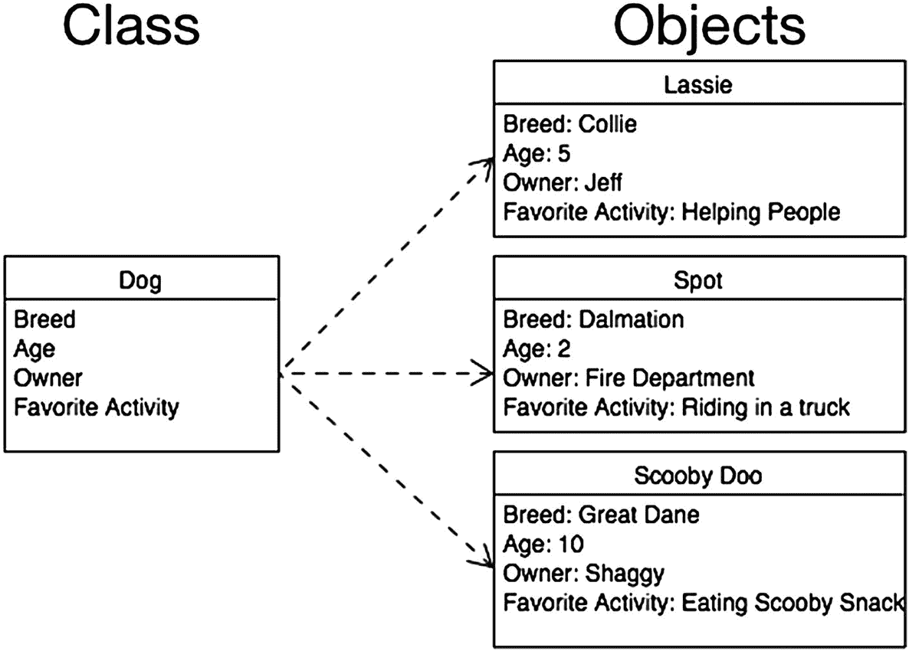

图 5-1. 一个类及其各个对象的示例

## 规划类

规划你的类是你开发过程中最重要的步骤之一。虽然事后回过头来添加属性和方法是可能的（而且你肯定需要这样做），但了解你的应用程序中将使用哪些类以及它们将拥有哪些基本属性和方法是至关重要的。在过程开始时花时间规划你的不同类非常重要。


### 规划属性

让我们来看看书店示例和一些你需要创建的类。首先，创建一个 `Bookstore` 类很重要。一个 `Bookstore` 类包含了每个 `Bookstore` 对象所存储信息的蓝图，例如书店的名称、地址、电话号码和徽标（见图 5-2）。将这些信息放在类中，而不是在你的应用程序中进行硬编码，将使你将来能够轻松地更改这些信息。你将在本章后面了解使用面向对象方法论的原因。此外，如果你的书店取得了巨大的成功，并且你决定再开一家，你将做好准备，因为你可以创建另一个 `Bookstore` 类的对象。

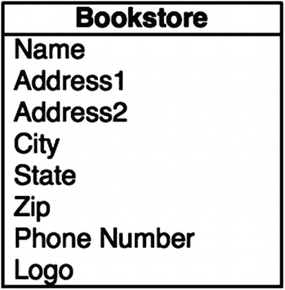

图 5-2. Bookstore 类

我们还来规划一个 `Customer` 类（见图 5-3）。注意名称是如何被分解为 `名` 和 `姓` 的。在你的项目中，有时你可能只想使用客户的名，如果没有提前规划，将名和姓分离开会很困难。假设你想给客户寄一封信，告知他们即将举行的促销活动。你肯定不希望问候语写成“亲爱的 John Doe”。写成“亲爱的 John”会显得更个性化。

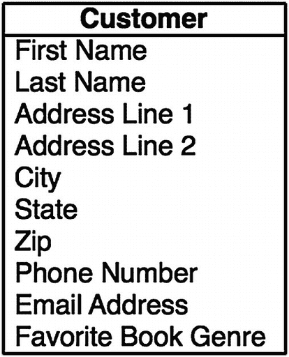

图 5-3. Customer 类

你还会注意到地址是如何被分解成不同部分，而不是全部组合在一起的。`地址行 1`、`地址行 2`、`城市`、`州` 和 `邮编` 是分开的。这一点很重要，并且会在你的应用程序中使用到。让我们回到你打算寄给客户关于即将举行促销活动的信函上。

你可能不想把它寄给所有居住在不同州的客户。通过分离地址，你可以轻松地筛选出那些你不想包含在邮寄名单中的客户。

我们还向 `Customer` 类添加了 `喜爱书籍类型` 这个属性。添加这个属性是为了向你展示如何在每个类中保存许多不同类型的信息。如果你有一本新的悬疑小说要出版，并且想发送一封电子邮件提醒那些对悬疑小说特别感兴趣的客户，那么这个字段可能会派上用场。通过存储这类信息，你将能够有针对性地定位客户群中的不同部分。

创建书店时，还需要一个 `Book` 类（见图 5-4）。你将存储关于这本书的信息，例如作者、出版商、类型、页数和版次（如果有多个版本的话）。`Book` 类还会包含这本书的价格。

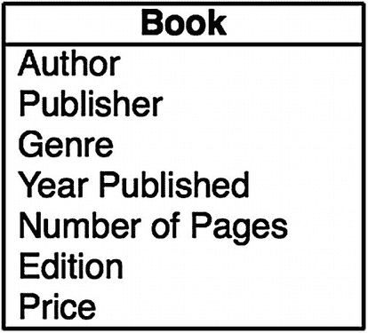

图 5-4. Book 类

你可以再添加一个名为 `Sale` 的类（见图 5-5）。这个类比之前讨论的其他类更抽象，因为它描述的不是一个具体的对象。你会注意到我们向 `Sale` 类添加了对一个客户和一本书的引用。因为 `Sale` 类将跟踪书籍的销售情况，你需要知道哪本书被卖给了哪个客户。

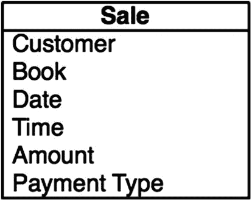

图 5-5. Sale 类

现在你了解了这些类的属性，接下来需要看看每个类将拥有的一些方法。

### 规划方法

你现在不会添加所有的方法，但是在开始时规划得越多，以后就越容易。并非你所有的类都会有很多方法。有些类可能根本没有方法。

> **注意：** 在规划方法时，请记住让它们专注于特定的任务。方法越具体，就越有可能被重用。

目前，你不会向 `Book` 类或 `Bookstore` 类添加任何方法。你将专注于其他两个类。

对于 `Customer` 类，你将添加方法来列出该客户的购买历史。未来可能还需要添加其他方法，但现在你只添加这一个。你完成的 `Customer` 类图应该如图 5-6 所示。靠近底部的线将属性与方法分开。

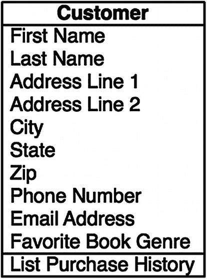

图 5-6. 完成的 Customer 类

对于 `Sale` 类，我们添加了三个方法。我们添加了 `信用卡扣款`、`打印发票` 和 `结账`（见图 5-7）。目前，你不需要知道如何实现这些方法，但你需要知道你计划将它们添加到你的类中。

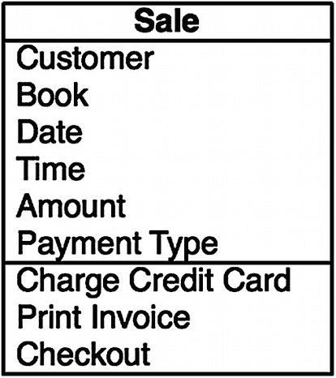

图 5-7. 完成的 Sale 类

现在你已经完成了对类以及将添加到其中的方法的规划，你便有了一个统一建模语言（UML）图的雏形。基本上，这是开发人员用来规划其类、属性和方法的一种图表。通过创建这样的图表来开始你的开发过程，从长远来看将对你大有裨益。对 UML 图的深入讨论超出了本书的范围。如果你想了解关于这个主题的更多信息，`smartdraw.com` 提供了非常出色的详细概述；请参见 [`www.smartdraw.com/uml-diagram/`](http://www.smartdraw.com/uml-diagram/)。Omnigroup ([`www.omnigroup.com`](http://www.omnigroup.com)) 提供了一个适用于 macOS 的优秀 UML 图表程序，名为 Omnigraffle。

图 5-8 显示了完整的图表。

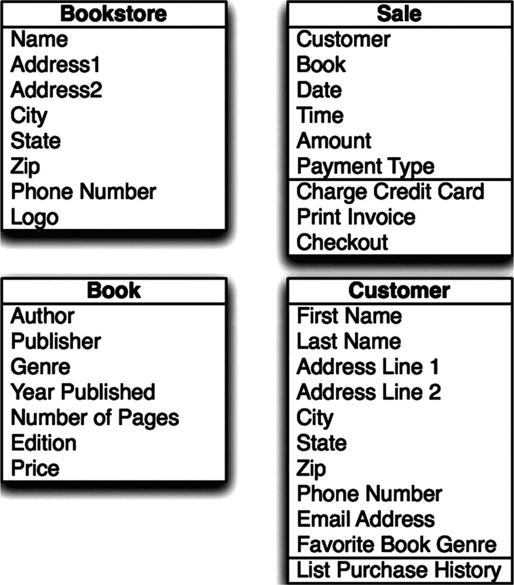

图 5-8. 书店的完整 UML 图


## 实现类

既然你已经了解了将要创建的对象，现在需要创建你的第一个对象。为此，你将从一个新项目开始。

1. 启动 Xcode。选择 文件 ➤ 新建 ➤ 项目。
2. 如果顶部菜单未选中 iOS，请点击选中它。在“应用程序”标题下，选择“主从应用”。对于本章的操作，你可以选择任何应用类型（见图 5-9）。点击“下一步”。

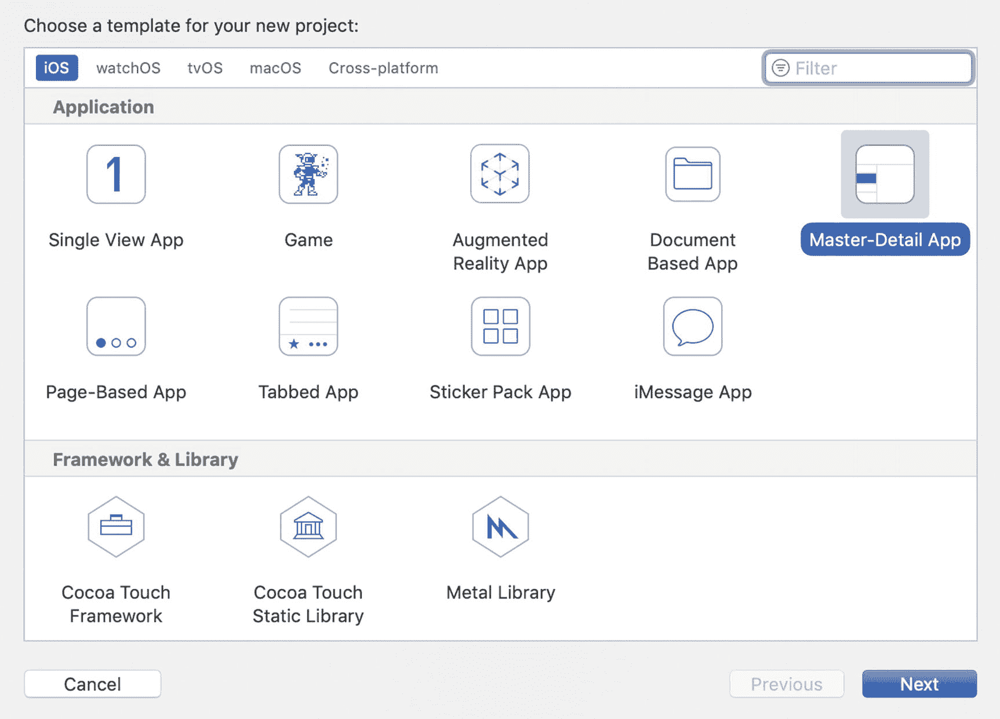

图 5-9. 创建新项目

3. 为你的项目输入产品名称。我们将使用 `BookStore` 这个名称。你还需输入组织名称和公司标识符。公司标识符通常是 `com.companyname`（例如 `com.inno`）。保持此屏幕上的复选框为默认状态。你现在无需关注 Core Data；它将在第 11 章讨论。同时，将当前语言选择保持为 Swift。点击“下一步”选择保存项目的位置，然后保存项目。
4. 从屏幕左侧的项目导航器中选择 `BookStore` 文件夹（见图 5-10）。你的大部分代码将存放在这里。

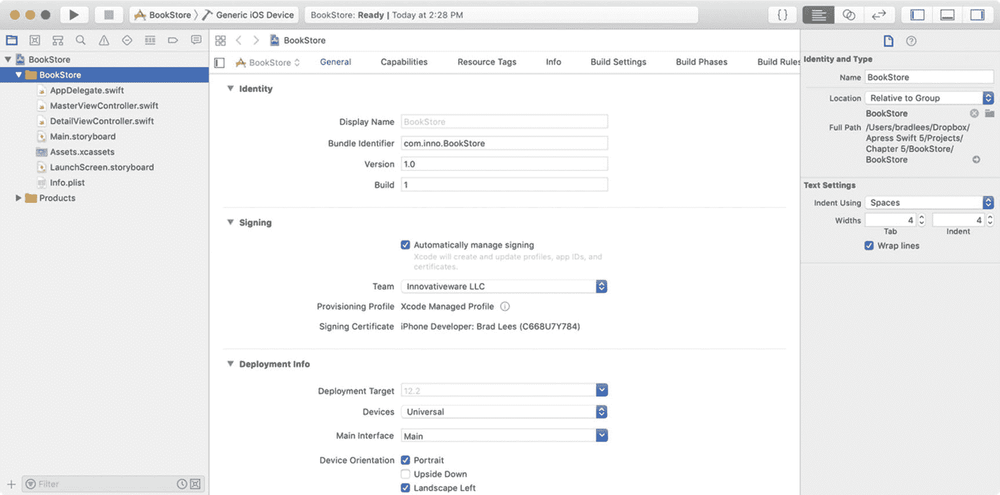

图 5-10. 选择 BookStore 项目

5. 选择 文件 ➤ 新建 ➤ 文件。
6. 在弹出的窗口中，确保顶部选中了 iOS，然后在“源”部分点击“Cocoa Touch 类”（见图 5-11）。然后点击“下一步”。

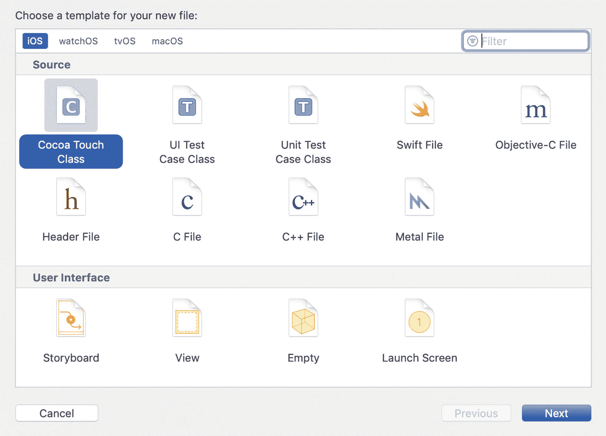

图 5-11. 创建一个新的 Swift 类文件

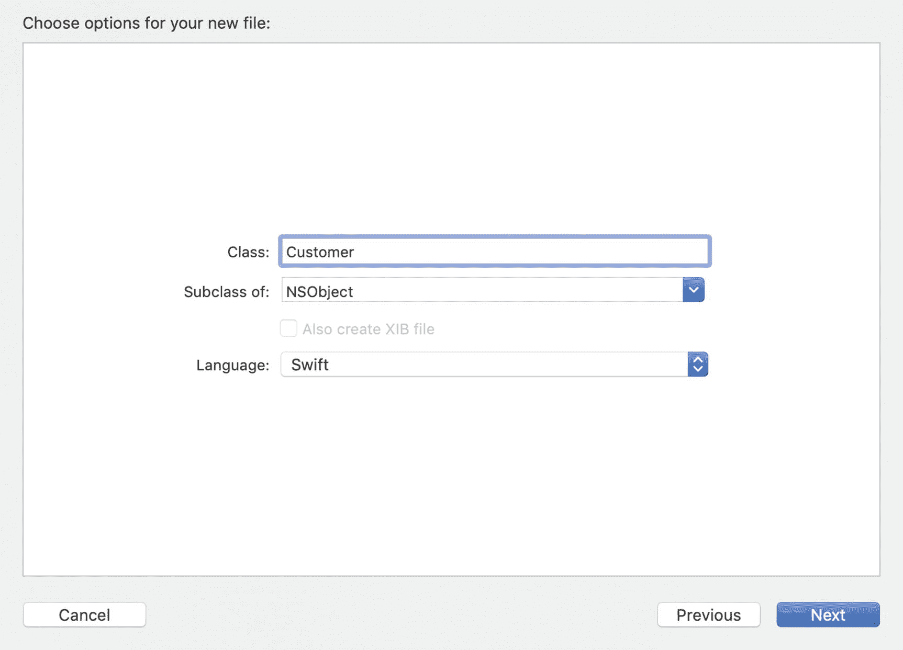

图 5-12. 创建文件

7. 现在你可以为类命名（见图 5-12）。在本练习中，你将创建 `Customer` 类。将“子类”下拉菜单改为 NSObject。确保语言设置为 Swift。点击“下一步”并将文件保存在默认位置。

**注意：** 为方便使用和理解代码，请记住在 Swift 中类名应始终以大写字母开头。对象名应始终以小写字母开头。例如，`Book` 是类的合适名称，而 `book` 是基于 `Book` 类的对象的好名字。对于由两个单词组成的对象，如书的作者，合适的名称是 `bookAuthor`。这种大小写格式称为小驼峰式。

8. 现在查看你的主项目文件夹；你应该会看到一个名为 `Customer.swift` 的新文件。

**注意：** 如果你用 Objective-C 创建了一个类，则会生成 `Customer.h` 和 `Customer.m` 文件。`.h` 文件是包含类信息的头文件。头文件列出了类中的所有属性和方法，但它并不实际包含相关代码。`.m` 文件是实现文件，你在此处编写方法的代码。在 Swift 中，整个类都包含在一个文件中。

9. 现在应选中 `Customer.swift` 文件，你会看到如图 5-13 所示的窗口。注意它目前包含的信息不多。第一部分带有双斜杠（`//`）的是注释，不属于代码部分。注释可以让你向可能阅读你代码的人说明每段代码的作用。文件的第二部分是你的新 Customer 类。新类的声明如下：

```
class Customer: NSObject {
}
```

**注意：** 在 Swift 中，一个类不需要独占一个文件。一个 Swift 文件中可以定义多个类，但当项目包含很多类时，这可能会难以维护。通常为每个类单独创建一个文件会更清晰、更有条理。

现在让我们将 UML 图中的属性转移到实际的类中。

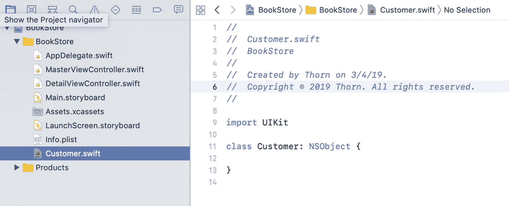

图 5-13. 空的 Customer 类

现在让我们将 UML 图中的属性转移到实际的类中。

**提示：** 属性应始终以小写字母开头。属性名中不能有空格。

对于第一个属性“名字”，将以下代码行添加到你的文件中：

```
var firstName = ""
```

这会在你的类中创建一个名为 `firstName` 的对象。注意你没有告诉 Swift `firstName` 是什么类型。在 Swift 中，你可以声明一个属性而不指定类型，属性类型会根据我们初始赋值来推断。通过给属性赋初始值 `""`，你告诉 Swift 编译器将 `firstName` 设为 String 类型。在 Swift 中，所有非可选属性都需要在声明时或在类初始化器中拥有默认值。我们将在本书后面讨论可选类型。

**注意：** 在 Objective-C 中，所有属性都必须声明类型。例如，要创建同样的 `firstName` 属性，你会使用以下代码：

```
NSString *firstName;
```

这声明了一个名为 `firstName` 的 `NSString`。在 Swift 中，你可以只声明一个变量，让系统决定类型。

由于所有属性都是变量，你只需对其他属性重复相同的过程。完成后，你的 Swift 文件应如图 5-14 所示。

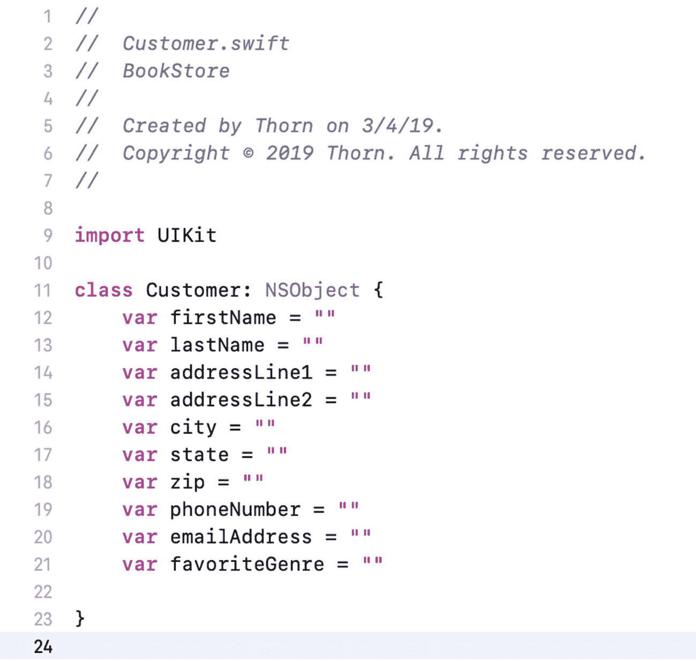

图 5-14. 包含属性的 Customer 类接口

类声明完成后，你需要添加方法。方法应包含在与属性相同的类文件和位置中。你将添加一个返回数组的新方法。代码如下所示：

```
func listPurchaseHistory() -> [String] {
    return ["Purchase 1", "Purchase 2"]
}
```

这段代码可能看起来有点令人困惑。空括号告诉编译器没有参数传递给该方法。`->` 告诉系统你从方法返回什么。`[String]` 表示你返回的是一个字符串数组。在最终版本中，你实际上会希望返回购买对象，但暂时使用 `String`。为了让代码能编译，你添加了一个返回简单数组的语句。显然，在真实应用中，这需要返回动态的购买历史。在 Swift 文件中创建类只需完成这些。图 5-15 显示了最终的 Swift 文件。

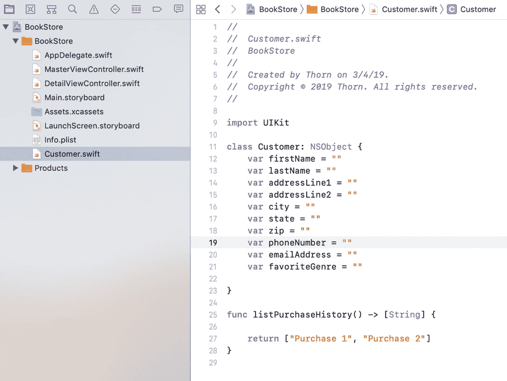

图 5-15. 完成的 Customer 类 Swift 文件

## 继承

OOP 的另一个主要特性是继承。编程中的继承类似于基因遗传。你可能从母亲那里继承了眼睛颜色，或从父亲那里继承了头发颜色，反之亦然。类可以以类似的方式继承父类的属性和方法，但与遗传学不同，你不会继承这些属性的值。在 OOP 中，父类称为超类，子类称为子类。


### 注意

在 Swift 中，除非特别声明，否则没有超类。在本章的示例中，我们使用了 `NSObject` 作为超类。

例如，你可以创建一个“印刷品”类，并为书籍、杂志和报纸创建子类。印刷品可能有许多共同之处，因此你可以在印刷品超类中定义属性，而不必在每个单独的类中重复定义这些属性。这样做可以进一步减少需要编写和调试的冗余代码量。

在图 5-16 中，你将看到 `Printed Material` 超类的属性布局，以及它将如何影响 `Book`、`Magazine` 和 `Newspaper` 这些子类。`Printed Material` 类的属性将被子类继承，因此无需在子类中显式定义它们。你会注意到 `Book` 类的属性显着减少了。通过使用超类，你将大幅减少程序中的冗余代码。

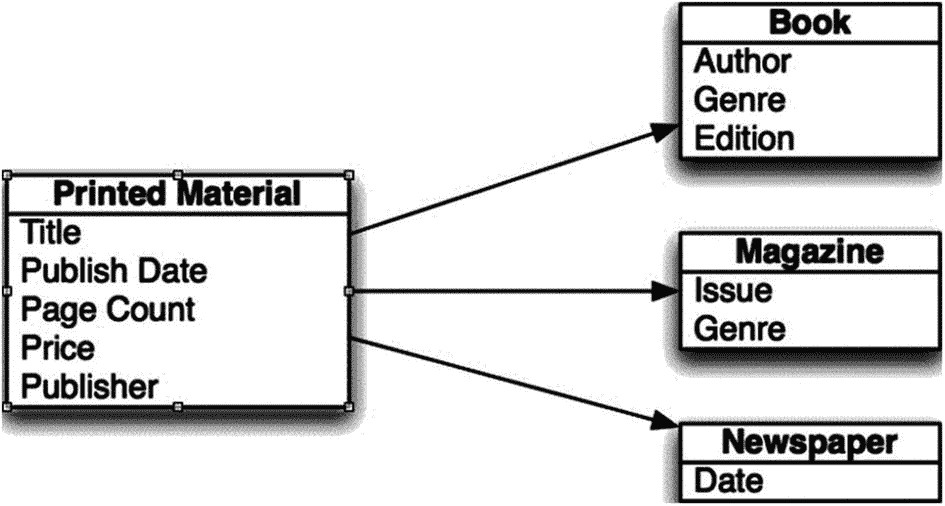

图 5-16. 超类和子类的属性

## 为什么要使用 OOP？

在本章中，我们讨论了什么是 OOP，甚至讨论了如何创建类和对象。然而，讨论为什么要在开发中使用 OOP 原则也同样重要。

如果你看看当今流行的编程语言，你会发现它们都在一定程度上使用了 OOP 原则。Swift、Objective-C、C++、Visual Basic、C# 和 Java 都要求程序员理解类和对象，才能成功使用这些语言进行开发。为了成为当今世界的一名开发者，你需要理解 OOP。但为什么要使用它呢？

### OOP 无处不在

今天你选择的几乎任何开发工作，都需要你理解面向对象的原则。在 macOS 和 iOS 中，你与之交互的每样东西都是一个对象。例如，简单的窗口、按钮和文本框都是对象，并且拥有属性和方法。如果你想成为一名成功的程序员，你需要理解 OOP。

### 消除冗余代码

通过使用对象，你可以减少必须重新输入的代码量。如果你编写了在客户结账时打印收据的代码，当需要重新打印收据时，你希望同样的代码也能直接使用。如果你将打印收据的代码放在了 `Sale` 类中，就不必再次重写这段代码了。这不仅节省了时间，还常常能帮助你消除错误。如果你不使用 OOP，并且发票有变动（哪怕是像图形更改这样简单的事情），你也必须确保在桌面应用和移动应用中同时进行更改。如果你遗漏了其中一个，就有可能导致两个界面的行为不一致。

### 易于调试

通过将所有与图书相关的代码放在一个类中，当图书出现问题时，你就知道该去哪里查找。这对于小型应用来说可能不算什么大事，但当你的应用代码量达到几十万甚至上百万行时，这会为你节省大量时间。

### 易于替换

如果你将所有代码都放在一个类中，那么随着应用中事物的变化，你可以替换掉某些类，并赋予新类完全不同的功能。然而，修改后的类仍然可以像原先的类一样，与应用的其余部分进行交互。这类似于汽车零件。如果你想更换汽车上的消音器，并不需要买一辆新车。如果你的发票相关代码散落在各处，那么修改一个类中的项目就会变得困难得多。

## 高级主题

我们已经在整章中讨论了 OOP 的基础知识，但还有一些其他主题对你的理解也很重要。

### 接口

正如本章所讨论的，其他对象与类交互的方式是通过方法。在 Swift 中，你可以为你的方法设置访问级别。将方法声明为 `private` 将使其只能被从其派生出的对象访问。默认情况下，Swift 方法是 internal 的，可以被当前模块中的任何对象或方法访问。这通常被称为*接口*，因为它告诉其他对象如何与你的对象进行交互。在你的应用中实现标准接口，将允许你的代码以相似的方式与不同的对象交互。这将显着减少你需要编写的、特定于对象的代码量。

### 多态性

*多态性*是指一个类的对象呈现为另一个类的对象并被像另一个类的对象一样使用的能力。这通常通过创建与另一个类相似的方法和属性来实现。你一直在使用的一个关于多态性的很好例子就是书店。在书店中，你有三个相似的类：`Book`、`Magazine` 和 `Newspaper`。如果你想对全部库存进行一次大促销，你可以遍历所有书籍并打折，然后遍历所有杂志并打折，接着再遍历所有报纸并打折。这样做的工作量比实际需要的要多得多。更好的做法是确保所有类都有一个打折方法。然后你可以对所有对象调用该方法，而无需知道它们属于哪个类，只要它们是包含所需方法的类的子类即可。这将节省大量的时间和编码工作。

在规划你的类时，要寻找不同类之间的共性以及可能适用于不止一种类型类的方法。从长远来看，这将节省你的时间并加速你的应用开发。

### 值导向编程

Apple 最近为 iOS 开发者引入了一种新范式。Apple 称之为值导向编程。Apple 现在建议开发者在处理某些简单的数据片段时，使用结构体（Structs）而不是类。结构体与类类似，不同之处在于结构体是通过值传递给方法的，并且结构体不能从任何超类继承。这意味着创建结构体所涉及的开销比创建类要少。结构体的实例化和使用方式与类相同。图 5-17 将本章中的客户类展示为结构体。

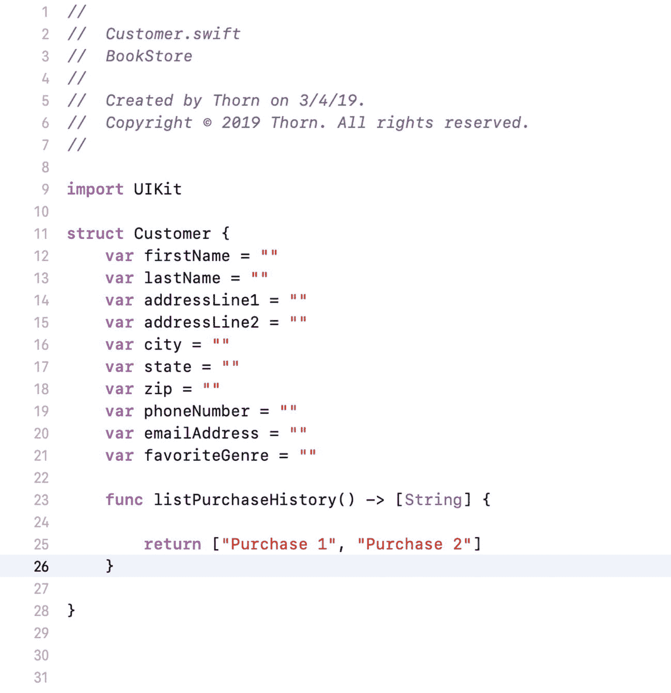

图 5-17. 客户结构体

决定使用结构体还是类，可能取决于多种因素。当不需要继承时，应该使用结构体。

## 总结

你终于读完了这一章！以下是本章所涵盖内容的总结：

*   *面向对象编程（OOP）*：你学习了 OOP 的重要性以及为什么所有现代代码都应该使用这种方法论。

*   *对象*：你学习了 OOP 对象以及它们如何对应现实世界中的对象。你还学习了不对应现实世界对象的抽象对象。

*   *类*：你学习了类决定了每个对象将拥有的数据类型（属性）和方法。每个对象都需要有一个类。它是对象的蓝图。

*   *创建类*：你学习了如何规划你类的属性和方法。

*   *创建类文件*：你使用 Xcode 创建了一个类文件。

*   *编辑文件*：你编辑了 Swift 文件来添加你的属性和方法。


### 练习

* 尝试为你映射出的其余类创建类文件。
* 映射出一个`Author`类。选择你需要存储的关于作者的信息类型。

对于大胆且进阶的读者：

* 尝试创建一个名为`PrintedMaterial`的超类，并映射出该类可能拥有的属性。
* 为商店可能销售的其他类型的印刷材料创建类。

