# 6. 学习 Swift 和 Xcode

在大多数情况下，所有编程语言都会执行任何计算机所需执行的典型任务——存储信息、比较信息、对信息做出决策，并根据这些决策执行某些操作。Swift 语言使这些任务更容易理解和完成。使用 Swift 的真正技巧（实际上，也是大多数编程语言的技巧）在于理解用于完成这些任务的符号和关键字。本章将继续探讨 Swift 和 Xcode，以便你更加熟悉它们。

## 新手入门

你可能知道，Swift 诞生时间并不长。Swift 语言大约在四年前由 Chris Lattner 开始开发，并于 2014 年 9 月 9 日正式发布了 Swift 1.0。Swift 从 Objective-C 借鉴了许多思想，同时也融合了现代编程语言使用的许多特性。Swift 从设计之初就致力于让普通程序员也能轻松上手。

目前，主要有两种类型的编程语言。编译型语言如 Objective-C 和 C++，以其严格和需要特定语法而闻名。编译型语言的执行速度也明显更快。解释型语言如 Ruby、PHP 和 Python，则以易于学习和编码而闻名，但执行速度较慢。Swift 是一种弥合两者之间差距的语言。Swift 融合了解释型语言广受欢迎的灵活性，以及要求苛刻的应用程序和游戏所需的性能。事实上，Apple 声称 Swift 应用程序的性能将优于用 Objective-C 编写的应用。在 Apple 的一些测试中，Swift 的性能几乎是 Python 的四倍，比 Objective-C 快 40%。

## 理解语言符号

理解符号是任何编程语言的基础。符号是用于在源代码中表达特定含义的标点符号。要使用一门语言，就必须理解其符号。以下是 Swift 中使用的一些符号和语言结构，其中大部分你都已经以某种方式接触过了：

*   `{`：这是**开始**大括号。它用于开始通常所说的***代码块***。代码块用于定义和包围一段代码，并界定其作用域。
*   `}`：这是**结束**大括号。它用于结束一个代码块。只要有开始大括号（`{`），就必须有一个配套的结束大括号（`}`）。
*   `[]`：这是开括号和闭括号。它们用于数组的声明和使用。
*   `func methodName() -> String`：这是 Swift 中定义函数的方式。当然，`methodName` 一词可以代表任何名称。`String` 一词也可以改变。它表示该方法返回的信息类型。在这个例子中，`String` 表示该方法将返回一个字符串，或一组字符（数据类型在第 3 章中介绍过，并将在后续章节中更深入地讲解）。本章稍后将更详细地讨论这一点。

图 6-1 展示了一个 Swift 代码的示例。

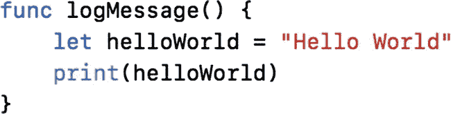

*图 6-1. Swift 代码示例*

第 1 行表示一个 Swift 函数。空括号`()`表示此函数不接受任何变量。括号后面没有`->`这一事实表明此函数不返回任何类型的数据，并且如果被调用，则不会向调用者返回值。

第 1 行和第 4 行的末尾是定义代码块的大括号。这个代码块定义了该方法。每个方法至少有一个代码块。

第 2 行创建了一个名为`hello`的常量。正如你在前几章中学到的，常量是一个值不能改变或恒定不变的量。常量`hello`的值被赋值为“Hello World!”。因为你将`hello`赋值为一个`String`值，所以`hello`变成了一个`String`，并且可以使用任何与`String`相关的方法（回想一下你第一次在第 3 章中看到字符串）。第 3 行可以重写为：

```
let helloWorld: String = "Hello World!"
```

第 3 行是对`print`函数的调用。你将对象传递给该方法，以便打印`hello String`对象。

虽然对于刚学习 Swift 的人来说，这看起来有点晦涩难懂，但这种简单而简洁的语法并不需要花太多时间就能学会。

## 在 Swift 中实现对象

Swift 从底层开始构建时就面向对象。它融合了 Objective-C 的最佳部分，同时摆脱了与 C 兼容的限制。它还吸收了脚本语言的一些最佳特性。以下是使 Swift 面向对象的一些概念。如果其中一些术语看起来不熟悉，请不要担心；它们将在后续章节中讨论（第 7 章和第 8 章将介绍基础知识）。

*   几乎所有东西都是一个*对象*。
*   对象包含***实例***变量。
*   对象和实例变量具有定义的*作用域*。
*   类隐藏了对象的*实现*。

### 注意

正如你在第 5 章中看到的，术语***类***通常用于表示对象的定义或类型。***对象***是从类创建出来的。例如，SUV 是车辆的一个*类*。类就像是一种蓝图。工厂生产 SUV。结果是人们驾驶的 SUV 对象。你不能驾驶一个*类*，但你可以驾驶一个从类构建的*对象*。

那么，这些概念如何转化到 Swift 中呢？Swift 在类的实现方面非常灵活。


### 注意

尽管在 Swift 中，单个文件可以包含多个不同的类，但程序员通常会将代码拆分到不同文件中，以便于访问。

下面我们来看一个名为 `HelloWorld` 的 Swift 类的完整定义（图 6-2）。

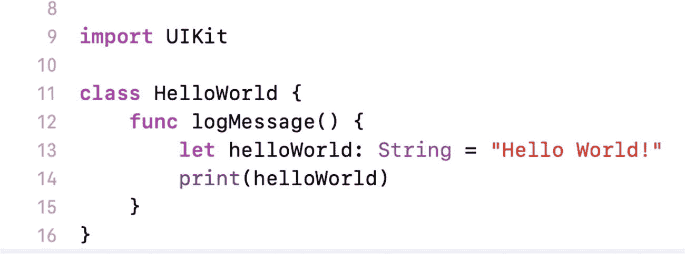

图 6-2. `HelloWorld` 类

在上述示例中，定义了一个名为 `HelloWorld` 的类。这个类只定义了一个方法：`logMessage`。这些奇怪的符号都代表什么意思？以行号为参考，你可以逐行审查这段代码。

第 1 行包含一条编译器指令：`import Foundation`。为了让这个小程序能识别某些其他对象，你需要让编译器读取其他接口文件。在本例中，`Foundation` 文件定义了 Foundation 框架的对象和接口。这个框架包含了 iOS 和 macOS 系统大部分非用户界面基类的定义。虽然在本例中不会用到任何 Foundation 框架特有的对象，但它是所有新 Swift 文件的默认组成部分。

对象的实际定义从第 4 行开始，如下所示：

```
class HelloWorld {
```

`HelloWorld` 就是类名。如果你想让 `HelloWorld` 成为你创建的一个日志类（例如 `LogFile`）的子类，你需要将声明修改如下：

```
class HelloWorld: LogFile  {
```

第 6 行包含了这个对象的一个方法定义，如下所示：

```
func logMessage() {
```

定义方法时，你必须决定该方法是类型方法还是实例方法。对于 `HelloWorld` 对象，使用的是默认的方法类型——实例方法。这个方法只能在对象创建*之后*使用。如果在 `func` 前加上 `class` 关键字，该方法就变成了类型方法，可以在对象创建*之前*使用，但此时无法访问对象中的属性。如果要将 `logMessage` 改为类型方法，则如下所示：

```
class func logMessage() {
```

第 7 行和第 8 行包含了方法的主体部分。关于这些语句的细节，你已经在前面章节中学过了。

这就是 `HelloWorld` 类的完整描述；内容并不复杂。更复杂的对象无非是拥有更多的方法和属性。

但别急，还有更多内容。既然你定义了一个新的 Swift 类，那么如何使用它呢？图 6-3 展示了一段使用这个新创建类的代码。

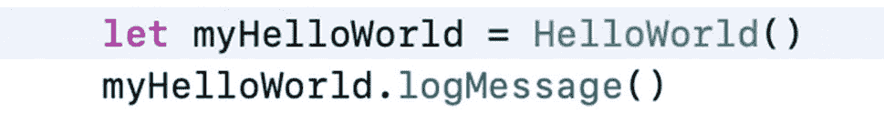

图 6-3. 调用 Swift 方法

第一行定义了一个名为 `myHelloWorld` 的常量。然后，将这个常量赋值为 `HelloWorld` 类的一个实例。第二行简单调用了 `myHelloWorld` 对象的 `logMessage` 方法。用过 Objective-C 的程序员会很快发现，在 Swift 中，无论是类的声明还是对象的创建，都更加简短高效。

### 注意

实例化会将类变成计算机内存中一个真实的对象。类本身在没有实例化之前是无法实际使用的。以 SUV 为例，在工厂生产出一辆（实例化该类）之前，SUV 毫无意义。只有在那之后，SUV 才能被使用。

方法调用也可以接受多个参数。例如，`myCarObject.switchRadioBandTo(FM, 104.7)`。这里的方法名是 `switchRadioBandTo`。两个参数放在圆括号内。保持方法命名的一致性至关重要。

## 在 Xcode 中编写另一个程序

当你首次打开 Xcode 时，会看到一个“欢迎使用 Xcode”屏幕。这个屏幕提供了一些方便的快捷方式，可以访问最近使用过的 Xcode 项目。在你熟悉 Xcode 之前，请保持勾选“启动 Xcode 时显示此窗口”复选框。


### 创建项目

现在需要开始一个新项目，请点击**“创建新 Xcode 项目”**图标。无论何时，你想开始一个新的 iOS 或 macOS 应用程序、库或其他项目，都可以使用这个图标。项目创建并保存后，它将显示在屏幕右侧的“最近使用的项目”列表中。

对于这个 Xcode 项目，你将选择一个简单的模板。确保选择了 iOS 应用程序，然后选择 **Single View Application**，如图 6-4 所示。接着，只需点击 **Next** 按钮。

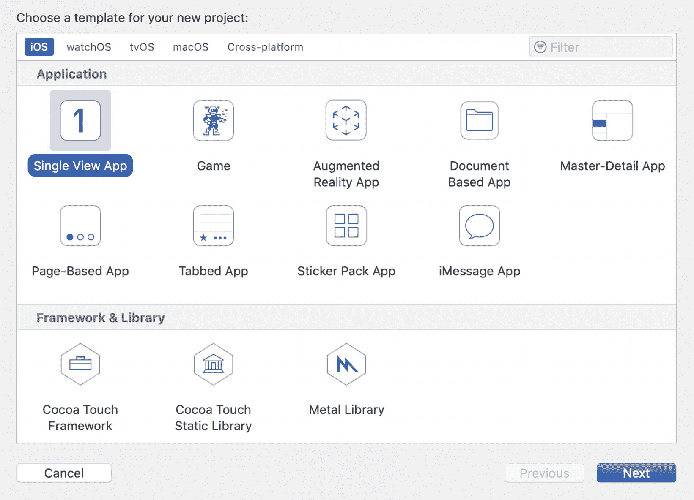

图 6-4. 从模板列表中选择新项目

这里有多种模板类型。这些模板通过自动创建简单的源文件来提供起点，从而更容易从零开始一个项目。

选择模板并点击 **Next** 按钮后，Xcode 会弹出一个对话框，要求输入项目名称和其他一些信息，如图 6-5 所示。在产品名称中输入 **Chapter6**。组织标识符（Organization identifier）必须填写一些内容，这里我们使用 `com.inno`。如果你计划在真实的 iOS 设备上运行此应用或将其提交到 App Store，则需要从下拉菜单中选择你的开发团队。如果现在不选择，也可以稍后添加到项目中。

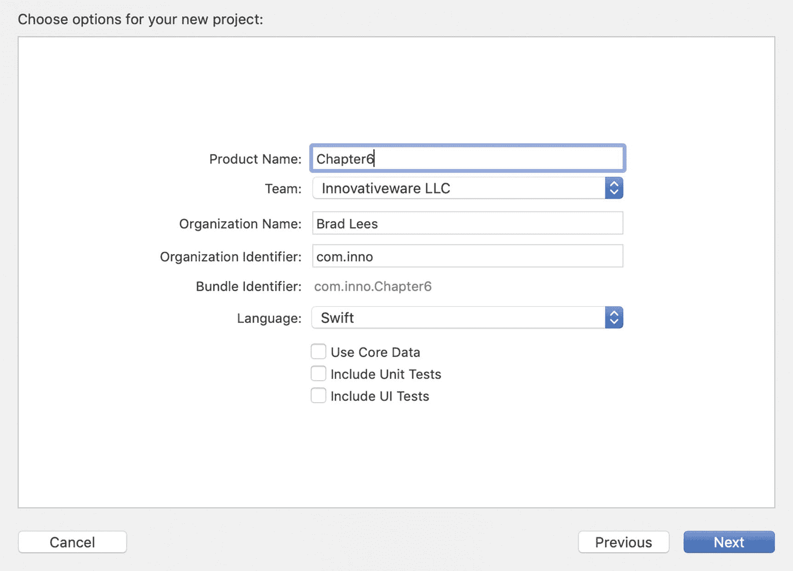

图 6-5. 设置产品名称、公司标识和类型

提供所有信息后，点击 **Next** 按钮。Xcode 会询问你保存项目的位置。你可以将其保存在任何地方，但桌面是个不错的选择，因为它总是可见的。

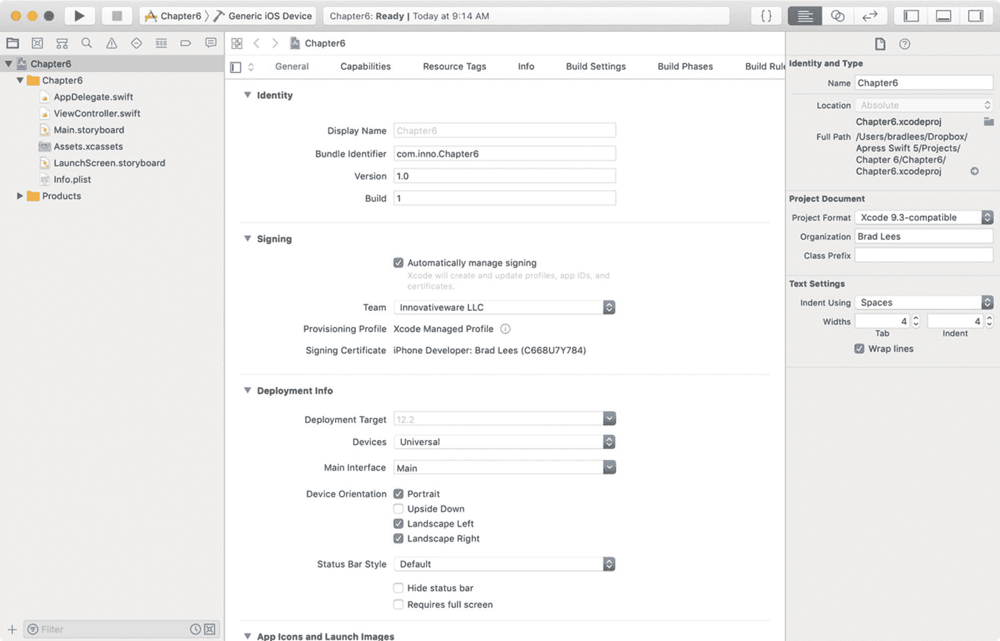

图 6-6. Xcode 10 主屏幕

选择好项目的保存位置后，Xcode 主屏幕就会出现（见图 6-6）。最左侧的窗格是源文件列表。屏幕右侧的三分之二是上下文相关的编辑器。点击一个源文件，编辑器会显示其源代码。点击一个 `.storyboard` 文件则会显示屏幕界面编辑器。

第一个应用将会很简单。这个 iPhone 应用将包含一个按钮。当点击按钮时，你的名字将显示在屏幕上。那么，让我们先更仔细地看看 Xcode 为你创建的一些框架（Stub）源代码。Xcode 的一个好处是，它会创建一个无需任何修改即可运行的框架应用。在开始添加代码之前，我们先看看 Xcode 的主工具栏，如图 6-7 所示。


图 6-7. Xcode 10 工具栏

乍看之下，工具栏有三个不同的区域。左侧区域用于运行和调试应用程序。中间区域显示编译错误和警告的摘要状态。最右侧区域包含一系列用于自定义编辑视图的按钮。

如图 6-8 所示，工具栏左侧部分包含一个*播放*按钮，用于编译和运行应用程序。如果应用程序正在运行，*停止*按钮将不会变灰。由于它现在是灰色的，可知应用程序并未运行。*方案选择*（Scheme selection）暂时可以保持默认。方案将在第 13 章详细讨论。

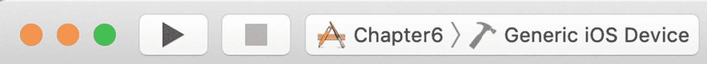

图 6-8. Xcode 工具栏左侧部分特写

Xcode 工具栏的右侧包含一些用于更改编辑器的按钮。这三个按钮分别代表*标准编辑器*（已选中）、*辅助编辑器*和*版本编辑器*。现在，只需点击*标准编辑器按钮*，如图 6-9 所示。

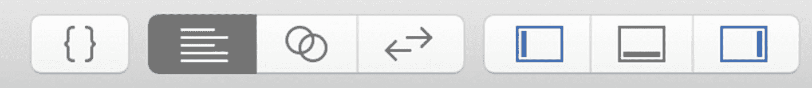

图 6-9. Xcode 工具栏右侧部分特写

编辑器选项旁边是一组视图按钮。这些按钮可以切换打开或关闭。例如，图 6-10 中选中的按钮对应于图 6-7 所示的当前视图：屏幕左侧三分之一显示程序文件列表，中间三分之一是主编辑器，右侧是实用工具区域。可以选择任何组合或都不选，以帮助自定义主工作区窗口。最后一个按钮用于打开*实用工具*区域。第 13 章将讨论这个按钮。现在，让我们回到你的第一个 iPhone 应用。

点击 `ViewController.swift` 文件，如图 6-10 所示。编辑器会显示一些定义了 `ViewController` 类的 Swift 代码。

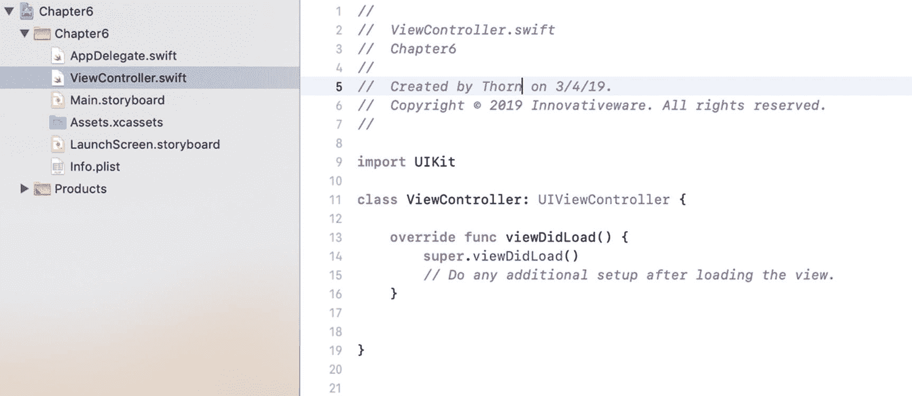

图 6-10. 在 Xcode 编辑器中查看源代码

你会注意到代码中有两个函数。`viewDidLoad` 在视图加载后立即被调用，可用于设置视图。这是放置设置标签、按钮、颜色等代码的好地方。`didReceiveMemoryWarning` 在你的应用程序内存不足时被调用。你可以使用此函数来减少应用程序所需的内存。

### 注意

现在，你只需要添加几行代码，看看它们的作用。不期望你现在就能理解这些代码的含义。重要的是通过动手操作来熟悉 Xcode。第 7 章会更深入地讲解 Swift 程序的构成，第 10 章则会更深入地讲解如何构建 iPhone 界面。

接下来，你将在该文件中添加几行代码，如图 6-11 所示。第 13 行定义了一个屏幕上的标签，你可以在其中放置一些文本。第 15 行定义了 `showName` 方法。你将调用此方法来填充 iPhone 标签。标签不过就是屏幕上可以放置一些文本信息的区域。

### 警告

请严格按示例所示键入代码，包括大小写。例如，`UILabel` 不能写成 `uilabel` 或 `UILABEL`。Swift 是区分大小写的语言，因此 `UILabel` 与 `uilabel` 完全不同。

你会注意到，你添加的代码前面有 `@IBOutlet` 和 `@IBAction`。这些属性在将对象与界面设计器连接时是必需的。`IBOutlet` 允许你通过代码控制界面对象。`IBAction` 允许你在界面上发生某些事件（如点击按钮）时执行代码。

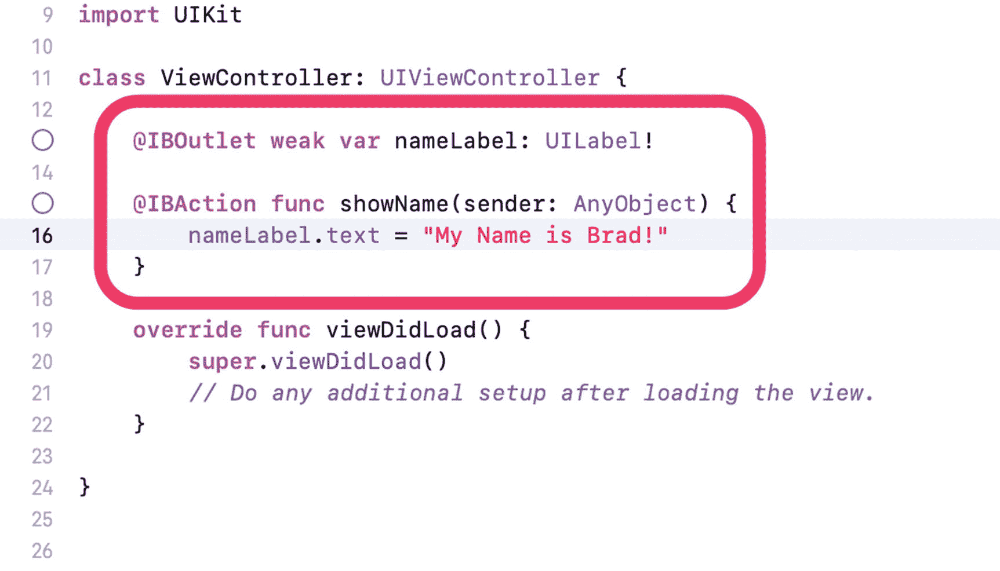

图 6-11. 添加到 `ViewController.swift` 文件中的代码

你会注意到，你添加的代码前面有


### 注意

`IBOutlet`和`IBAction`都以`IB`开头，这是 Interface Builder 的缩写。Interface Builder 是 NeXT 和苹果公司用于构建用户界面的工具。

现在代码已经就位，但你还没有在设备上看到界面。接下来，你将编辑界面，并往应用中添加两个界面对象。

要编辑 iPhone 的界面，你只需点击`Main.storyboard`文件一次。`.storyboard`文件包含单个窗口或视图的全部信息。Xcode 10 也支持`.xib`（读作*zib*）文件。

### 注意

每个`.xib`文件代表 iPhone 或 iPad 上的一个屏幕。包含多个视图的应用会有多个`.xib`文件，但每个故事板文件中可以存储多个不同的视图。

你将使用 Xcode 的界面编辑器将 UI 对象（例如 Label 对象）*连接*到你刚编写的代码中。连接操作只需点击并拖动即可。

点击屏幕右上角的最后一个视图按钮，如图 6-12 所示。这将打开界面的实用工具视图。其中，该实用工具视图会展示你可以在应用中使用的各种界面对象。你只需关注最右侧的两个对象：Button（按钮）和 Label（标签）。图 6-13 展示了对象库。还有其他库可用，但目前你只需使用从左数第三个库。

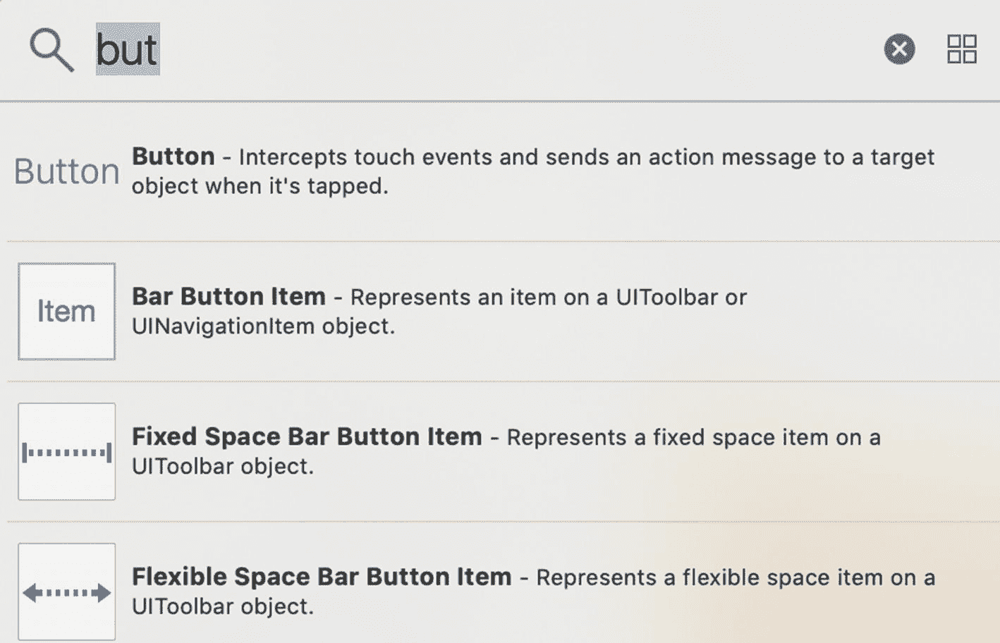

图 6-13. 对象库

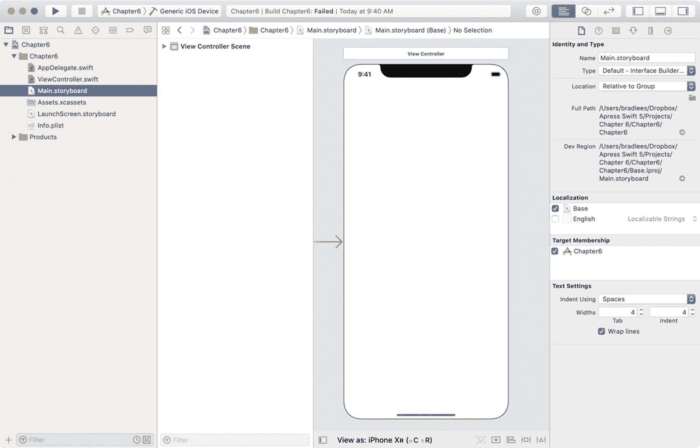

图 6-12. 你将要修改的界面

点击工具栏上的库按钮。它的图标看起来像一个圆圈里面的正方形。

现在在库的搜索栏中搜索，如图 6-13 所示。接着，将该对象拖到 iPhone 视图上，如图 6-14 所示。别担心，拖动对象并不会将其从实用工具视图的对象列表中移除。拖动操作会在 iPhone 界面上创建该对象的一个新副本。

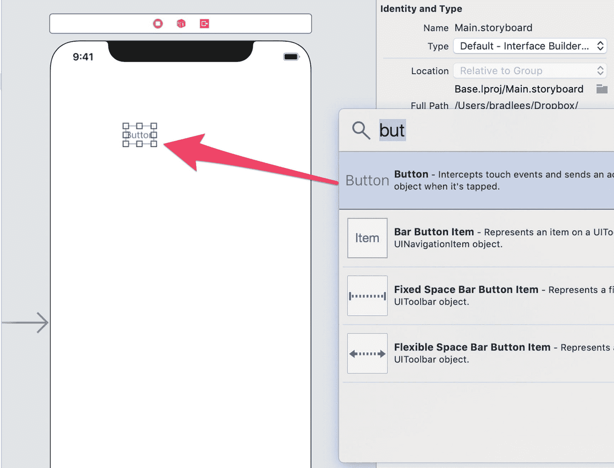

图 6-14. 将一个 Button 对象移动到 iPhone 视图上

接下来，双击刚刚添加到 iPhone 界面上的 Button 对象。这样你就可以修改按钮的标题，例如改为`Name`，如图 6-15 所示。许多不同的界面对象都是这样操作的。只需双击，对象的标题就可以被修改。这也可以在代码中实现，但在 Interface Builder 中操作要简单得多。

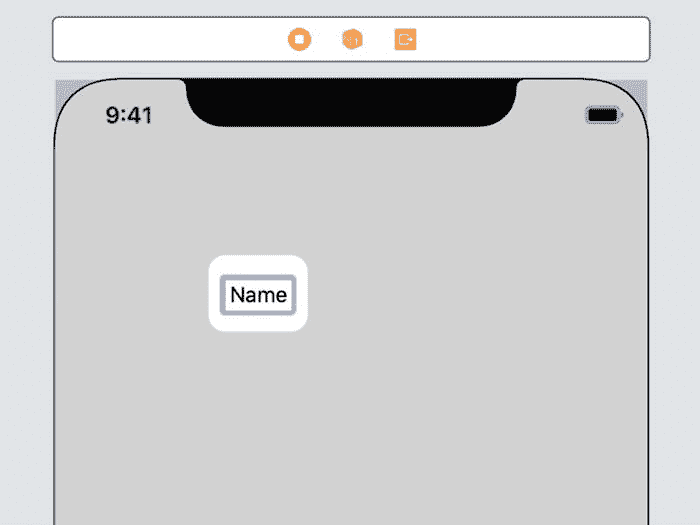

图 6-15. 修改 Button 对象的标题

标题修改完毕后，将一个 Label 对象拖到按钮的正下方，如图 6-16 所示。

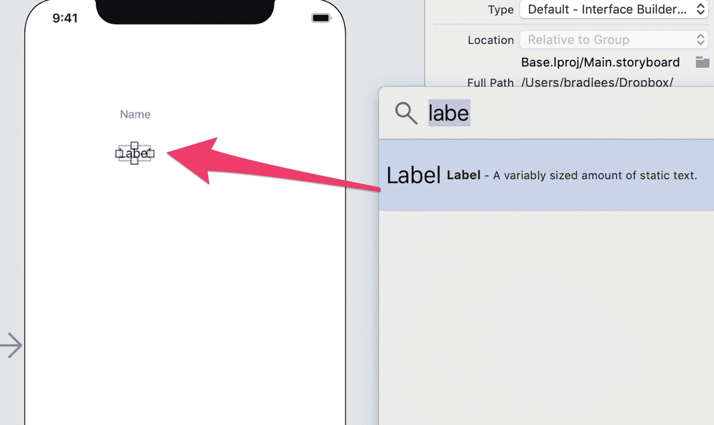

图 6-16. 向 iPhone 界面添加一个 Label 对象

目前，你可以将标签的文本保留为“Label”，这样便于在界面上找到它。如果你清除了标签的文本，对象仍然存在，但界面上没有任何可见的东西可以点击以选择它。通过拖动中央的白色方块向右，来展开标签的大小，如图 6-17 所示。

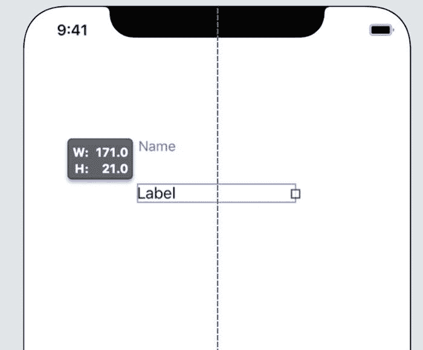

图 6-17. 展开标签的大小

现在你有了一个按钮和一个标签，可以将这些可视化对象连接到你的程序。首先，右键点击（或按住 Ctrl 键点击）Button 控件。这会弹出一个连接菜单，如图 6-18 所示。你也可以通过点击按钮并选择“连接检查器”来打开此菜单。

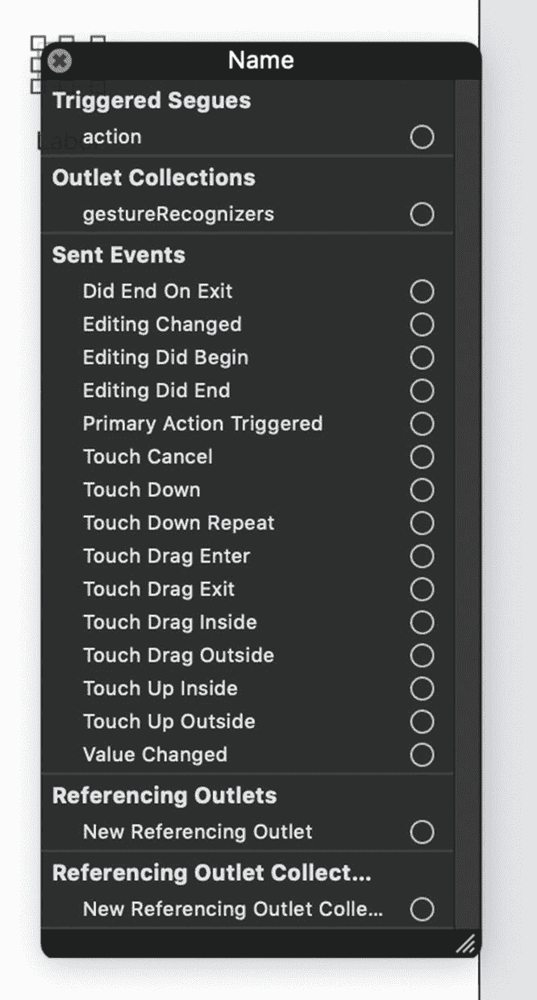

图 6-18. Button 对象的连接菜单


好的，作为高级文档工程师和翻译员，我将遵循您提供的注意事项和示例，将给定的英文文本翻译成中文。


接下来，从“Touch Up Inside”连接圆点点击并拖拽到“View Controller”图标，如图 6-19 所示。“Touch Up Inside”表示用户在`Button`对象*内部*点击。将连接拖拽到“View Controller”会将“Touch Up Inside”事件连接到`ViewController`对象。这样一来，每当`Button`对象被点击时，该对象便会收到通知。

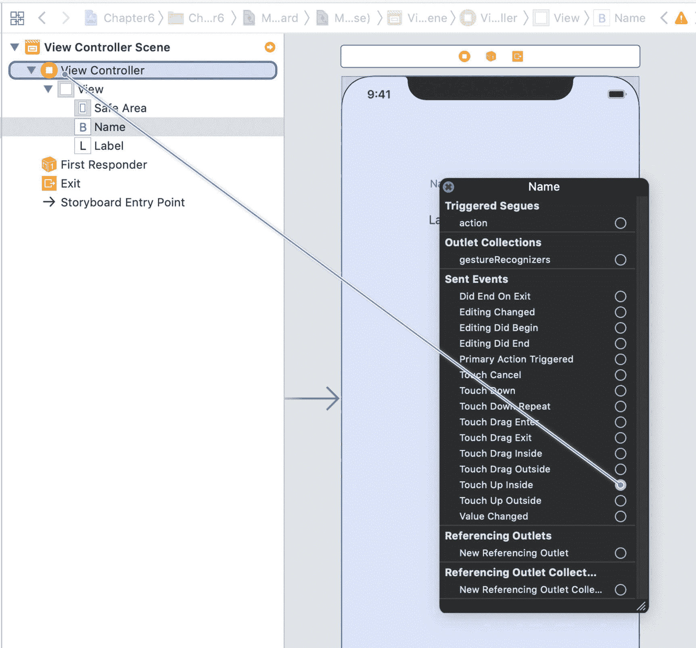

**图 6-19.** 将“Touch Up Inside”事件连接到对象

连接建立后，会显示一个可用于该连接的方法列表，如图 6-20 所示。在此示例中，只有一个方法`showNameWithSender:`。选择`showNameWithSender:`方法即可将“Touch Up Inside”事件连接到对象。

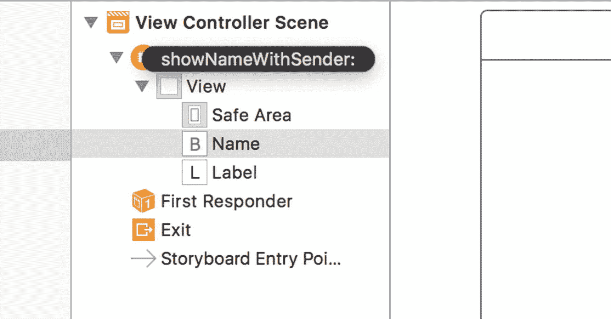

**图 6-20.** 选择处理“Touch Up Inside”事件的方法

连接完成后，详细信息会显示在按钮的连接菜单中，如图 6-21 所示。

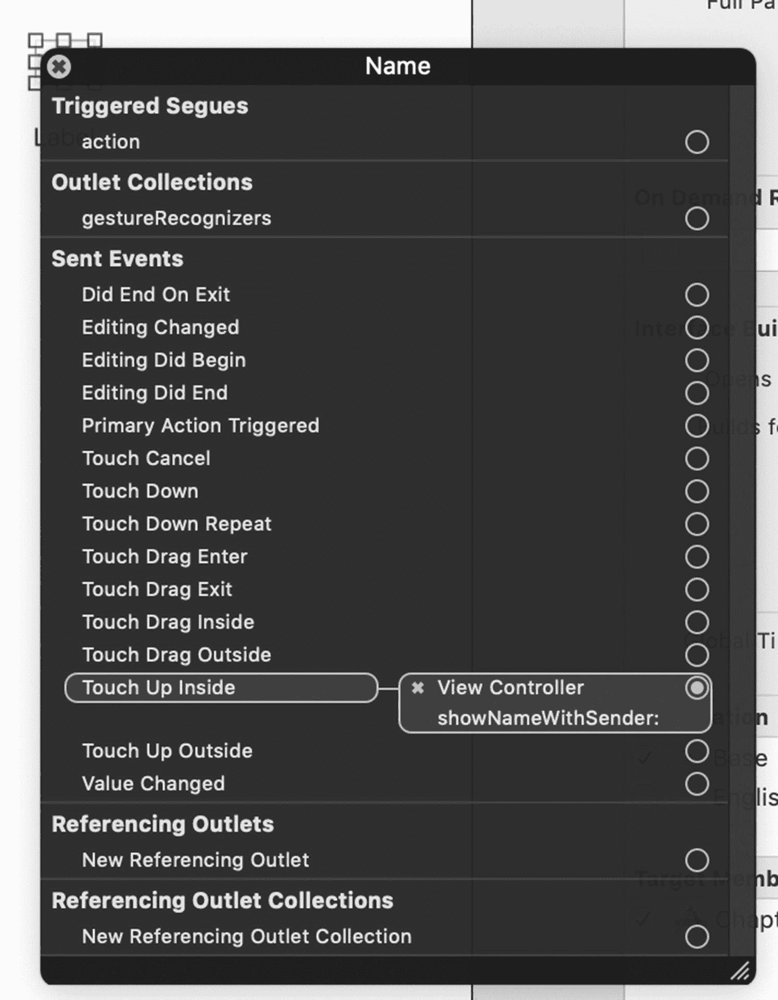

**图 6-21.** 连接已完成

接下来，你需要为`Label`对象创建连接。在本例中，你不关心`Label`的事件；相反，你要将`ViewController`的`nameLabel`插座变量连接到 iPhone 界面上的对象。这个连接本质上告诉对象：你想要设置文本的标签位于 iPhone 界面上。

首先，右键点击 iPhone 界面上的`Label`对象。这将弹出`Label`对象的连接菜单，如图 6-22 所示。`Label`对象的选项数量不如`Button`对象那么多。

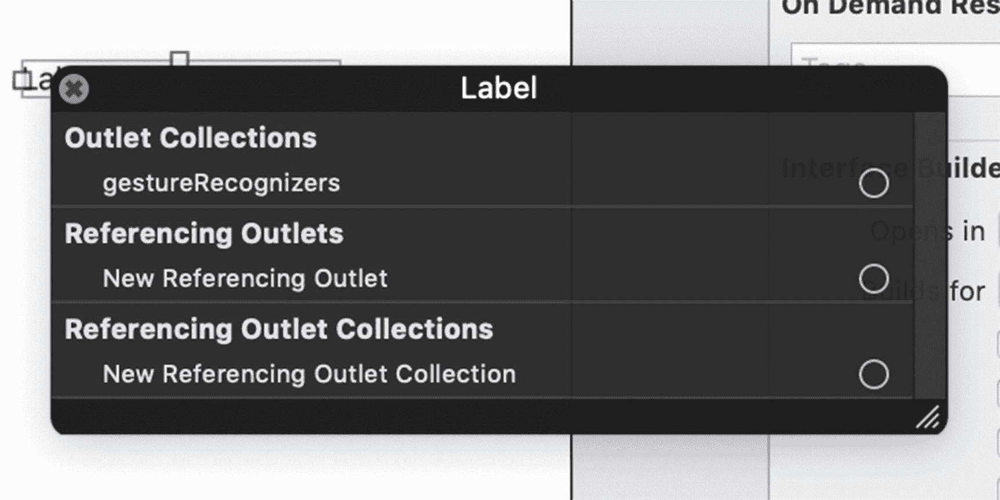

**图 6-22.** `Label`对象的连接菜单

如前所述，这里的目的不是连接事件，而是连接所谓的*引用插座变量*。这会将屏幕对象连接到`ViewController`对象中的一个变量。与按钮的操作类似，你应该将连接拖拽到“View Controller”图标，如图 6-23 所示。

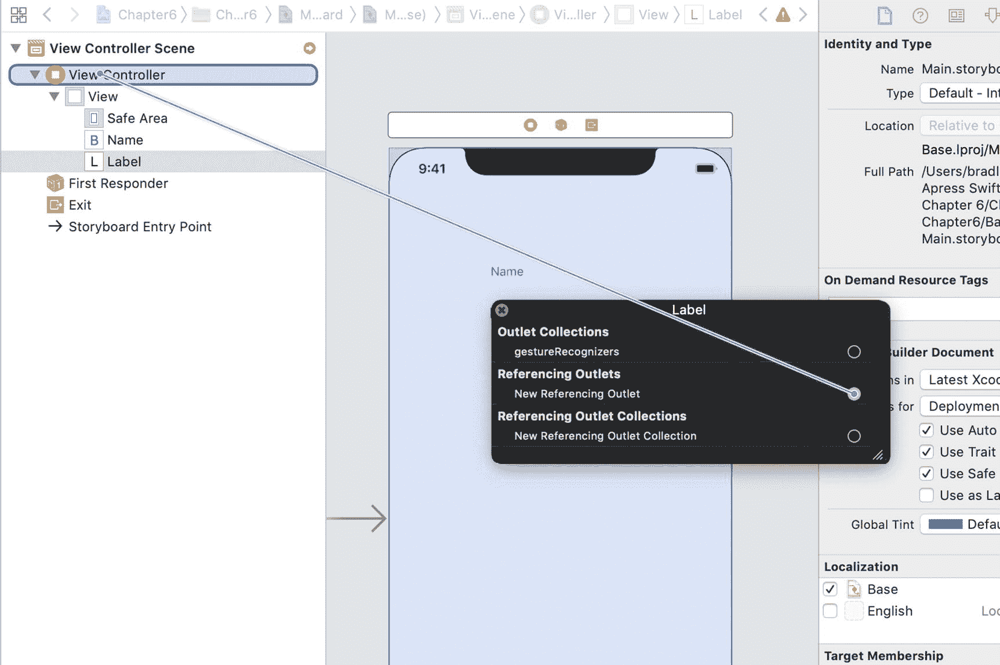

**图 6-23.** 将引用插座变量连接到对象

当连接被拖拽到“View Controller”图标上时，会显示`ViewController`对象中的一个插座变量列表，如图 6-24 所示。在两个选项中，你应该选择`nameLabel`。这就是你在`ViewController`对象中使用的变量名称。

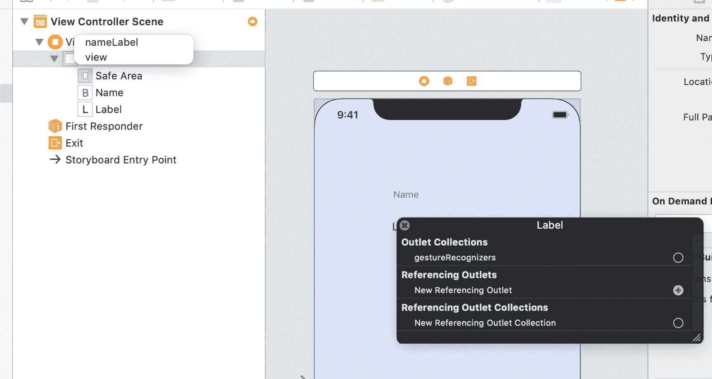

**图 6-24.** 选择对象的变量以完成连接

选择`nameLabel`后，你就可以运行程序了。点击 Xcode 窗口左上角的“运行”按钮（看起来像一个播放按钮），如图 6-8 所示。这将自动保存你的文件并在 iPhone 模拟器中启动应用程序。点击“Name”按钮，视图应如图 6-25 所示发生变化。

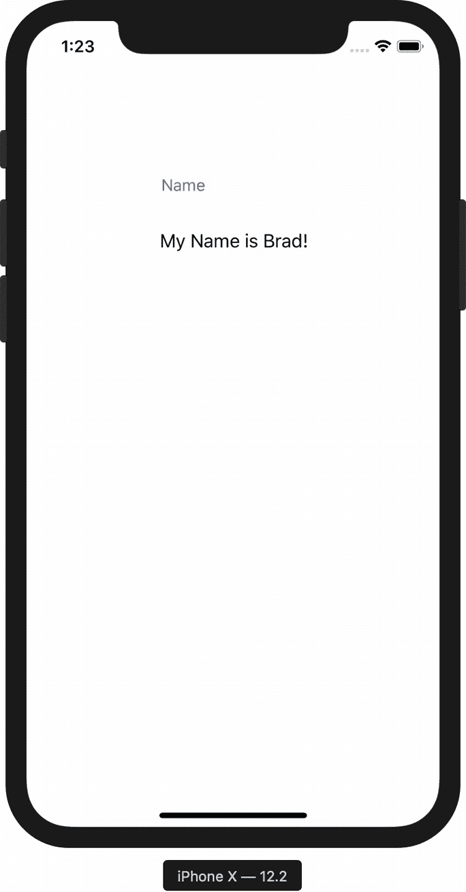

**图 6-25.** 按钮点击后应用运行的效果

通过点击“Name”按钮，标签的文本将从默认值“Label”更改为你输入的“My Name is Brad!”或其他任意值。如果需要，你可以回到界面中清除默认的标签文本。

## 总结

本章的示例虽然简单，但希望能激发你使用 Swift 和 Xcode 开发更复杂应用程序的兴趣。在后续章节中，你将学习更多关于面向对象编程的知识，以及 Swift 能实现的更多功能。值得表扬的是，你已经学到了很多内容。以下是本章讨论的主题总结：

*   Swift 语言的起源及简史
*   Swift 中常用的一些语言符号
*   一个 Swift 类示例
*   更深入地使用 Xcode，包括讨论`HelloWorld.swift`源文件
*   将可视化界面对象与应用程序对象中的方法和变量进行连接

### 练习

*   清除程序中“Label”的默认文本，然后重新运行示例。
*   将界面中`Label`对象的宽度改小。这会对你的文本信息产生什么影响？
*   删除标签的引用插座变量连接，然后重新运行项目。会发生什么？
*   如果你觉得自己已经掌握了这些操作，请向`ViewController`对象和界面添加一个新的按钮和标签。将标签的显示内容从你的名字改为其他内容。

