# 7. Swift 类、对象和方法

如果你还没有阅读第 6 章，请在阅读本章之前先阅读它，因为第 6 章为 Swift 的一些基础知识提供了很好的入门介绍。本章建立在此基础之上，特别是关于创建 Swift 类的内容。通过本章的学习，你将能更深入地理解 Swift 语言，并掌握如何使用基础知识编写简单程序。最好的学习方法是拿小项目并用 Swift 编写（或重写）它们，以观察语言的工作方式。

本章涵盖 Swift 类的组成以及如何通过方法与 Swift 对象进行交互。它以一个简单的广播电台类为例，说明如何编写 Swift 类，从而让你理解如何使用 Swift 类。本章还会教你如何针对解决问题所需的对象进行设计。本章涉及如何创建自定义对象，以及如何使用 Foundation 类中提供的现有对象。

本章扩展了第 6 章的主题，并介绍了第 8 章中会详细描述的一些概念。

## 创建 Swift 类

在 Swift 中，创建类很简单。通常，一个类会存放在其自身的文件中，但根据需要，单个文件也可以包含多个类。

下面是一个类声明第一行的示例：

```
class RadioStation
```

这里，类名是`RadioStation`。默认情况下，Swift 类不从父类继承。如果你希望你的 Swift 类继承自另一个类，可以像这样操作：

```
class RadioStation: Station
```

在这个例子中，`RadioStation`现在是`Station`的子类，并将继承`Station`的所有属性和方法。代码清单 7-1 展示了一个类的完整定义。

```
1 import UIKit

3 class RadioStation: NSObject {

5     var name: String
6     var frequency: Double

8     override init() {
9         name = "Default"
10         frequency = 100
11     }

13     static var minAMFrequency: Double = 520.0

15     static var maxAMFrequency: Double = 1610.0

17     static var minFMFrequency: Double = 88.3

19     static var maxFMFrequency: Double = 107.9

21     func isBandFM() -> Int {
22         if frequency >=
RadioStation.minFMFrequency && frequency <= RadioStation.maxFMFrequency {
23             return 1 //FM
24         } else {
25             return 0 //AM

27         }

29     }
30 }
代码清单 7-1
一个 Swift 类
```


## 属性

代码清单 7-1 展示了一个包含两个不同属性的示例类：`name` 和 `frequency`。第 1 行导入了 `UIKit` 类定义（稍后会详细介绍），因为这是 Xcode 在创建新类时默认添加的导入。第 3 行通过定义类的名称（有时也称为*类型*）开始类的定义。第 5 行和第 6 行为 `RadioStation` 类定义了两个属性。

每当 `RadioStation` 类被实例化时，生成的 `RadioStation` 对象都可以访问这些属性，而这些属性仅属于特定的实例。如果有十个 `RadioStation` 对象，每个对象都有自己独立的变量，互不影响。这也被称为*作用域*，即对象的变量位于每个对象的作用域内。

第 13–19 行也包含了一些属性。这些属性前面带有 `static` 关键字，意味着该值属于类本身，每个对象都将保持这些属性的完全相同的值。

## 方法

几乎每个对象都有方法。在 Swift 中，与对象交互的最常见方式是通过调用方法，如下所示：

```
myStation.isBandFM()
```

上面这行代码会在 `RadioStation` 类对象的一个实例上调用名为 `isBandFM` 的方法。

方法也可以带有参数。为什么要传递参数？传递参数有几个原因。首先（也是最常见的），可能性范围太大，无法将它们写成独立的方法。其次，你需要存储在对象中的数据是可变的——比如电台的名称。在下面的例子中，你会看到为每一种可能的无线电频率编写一个方法并不实际；相反，频率是作为参数传递的。电台名称也是如此。

```
myStation.setFrequency(104.7)
```

方法名是 `setFrequency`。方法调用可以有多个参数，如下例所示：

```
myStation = RadioStation.init(name: "KZZP", frequency: 104.7)
```

在上面的例子中，方法调用包含两个参数：电台名称及其频率。Swift 相对于其他语言的一个有趣之处在于，方法包含命名参数。如果这是一个 C++ 或 Java 程序，调用方式会是：

```
myObject = new RadioStation("KZZP", 104.7)
```

虽然 `RadioStation` 对象的参数可能看起来很明显，但拥有命名参数可以是一个优势，因为它们或多或少地说明了这些参数是什么。

## 使用类型方法

类并不总是必须实例化才能使用。在某些情况下，类拥有一些方法，它们可以在类实例化之前实际执行一些简单的操作并返回值。这些方法被称为*类型方法*。在代码清单 7-1 中，以 `static` 开头的方法名就是类型方法。

类型方法有局限性。它们最大的局限性之一是，不能使用任何实例变量。不能使用实例变量是合理的，因为你还没有实例化任何东西。一个类型方法可以在方法内部拥有自己的局部变量，但不能使用任何被定义为实例变量的变量。

对类型方法的调用如下所示：

```
RadioStation.minAMFrequency()
```

请注意，这个调用与在已实例化的对象上调用方法的方式类似。最大的区别在于，这里使用的是*类名*，而不是实例变量。类型方法在 macOS 和 iOS 框架中被广泛使用。它们主要用于返回一些固定的或众所周知类型的值，或者返回一个新的对象实例。这类类型方法被称为*初始化器*。以下是一些初始化器方法的例子：

```
1.  Date.addingTimeInterval()  // 返回一个 Date 对象
2.  String(format:"http://%@", "www.apple.com")    // 返回一个新的 String 对象
3.  Dictionary()                   // 返回一个新的 Dictionary 对象
```

上面所有的消息都是在调用类型方法。

第 1 行简单地返回一个值，该值表示自参考日期 2001 年 1 月 1 日以来的秒数。

第 2 行返回一个新的 `String` 对象，该对象已被格式化，其值为 `http://1000`。

第 3 行是一种常用的形式，因为它实际上分配了一个新对象。通常，这一行不会单独使用，而是会出现在像这样的代码行中：

```
var myDict = Dictionary()
```

那么，你什么时候会使用类型方法呢？作为一般规则，如果该方法返回的信息*不*特定于该类的任何特定实例，那么就让该方法成为一个类型方法。例如，前面例子中的 `minAMFrequency` 对于任何 `RadioStation` 的所有实例都是相同的。

对象——这是使用类型方法的绝佳候选。然而，电台的名称或其分配的频率对于该类的每个实例来说是不同的。这些不该（实际上也*不能*）是类型方法。原因在于，类型方法不能使用该类定义的任何实例变量。

## 使用实例方法

实例方法（代码清单 7-1 中的第 29–35 行）只有在类被实例化之后才可用。这里有一个例子：

```
1   var myStation: RadioStation         // 这声明了一个变量来持有 RadioStation 对象。
2   myStation = RadioStation()          // 这创建了一个新的 RadioStation 对象。
3   var band = myStation.band()         // 这个方法返回 RadioStation 的波段。
```

第 3 行在 `RadioStation` 对象上调用了一个方法。`band` 方法为 FM 返回 1，为 AM 返回 0。实例方法是指任何在其前面没有类声明的方法。

## 使用你的新类

你已经创建了一个简单的 `RadioStation` 类，但仅凭它本身并不能完成太多任务。在本节中，你将创建 `Radio` 类，并让它维护一个 `RadioStation` 类的列表。

### 创建项目

让我们启动 Xcode 并创建一个名为 `RadioStations` 的新项目。

1. 启动 Xcode 并选择“Create a new Xcode project.”。

2. 确保你选择了一个 iOS 应用程序，并选择 Single View App 模板，如图 7-1 所示。

   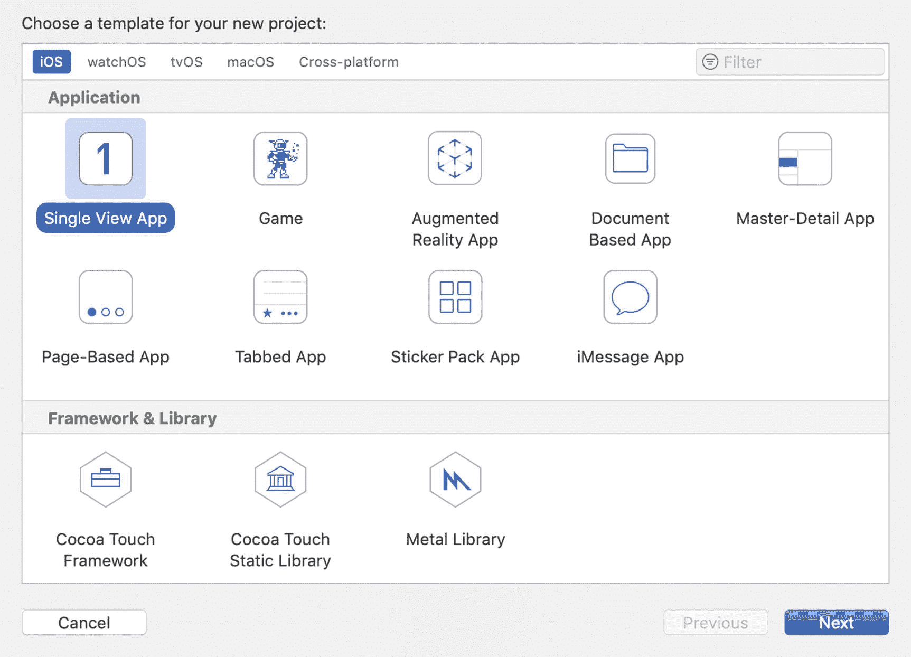

   图 7-1
   在新项目窗口中选定一个模板

3. 选择模板后，点击 Next 按钮。

4. 将产品名称（应用程序名称）设置为 `RadioStations`。

5. 设置公司标识符（可以使用一个虚构的公司），并将设备系列设置为 iPhone（如图 7-2 所示）。确保在语言下拉列表中选择了 Swift。

   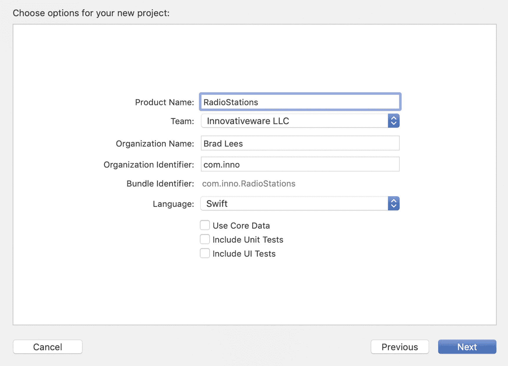

   图 7-2
   命名新的 iOS 应用程序

6. 点击 Next 按钮，Xcode 会询问你想要将新项目保存在哪里。你可以将项目保存到桌面或 home 文件夹中的任何位置。做出选择后，只需点击 Create 按钮。

7. 点击 Create 按钮后，Xcode 工作区窗口应该可见，如图 7-3 所示。

   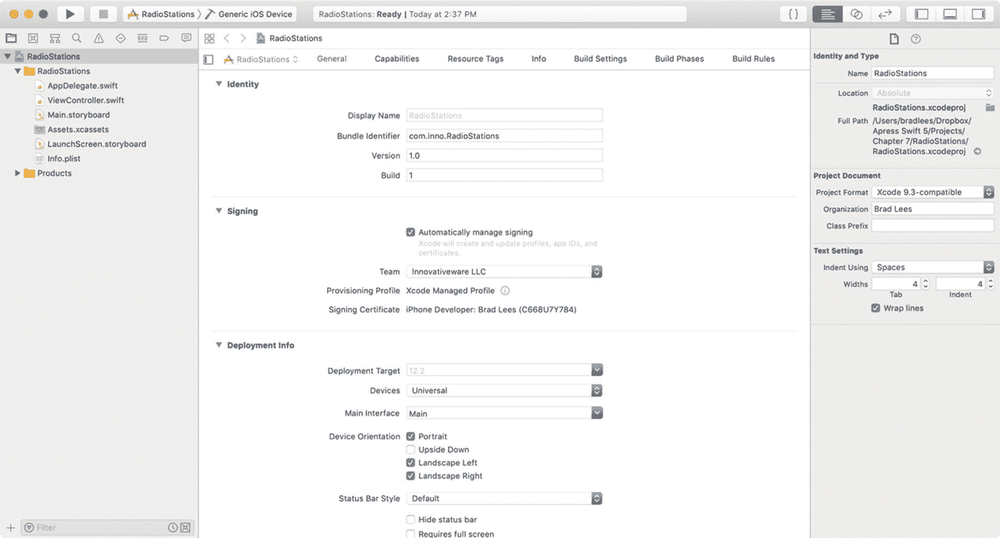

   图 7-3
   Xcode 中的工作区窗口


### 添加对象

现在你可以添加新对象了。

1.  首先，创建你的`RadioStation`对象。右键点击`RadioStations`文件夹，然后选择 New File（如图 7-4 所示）。

    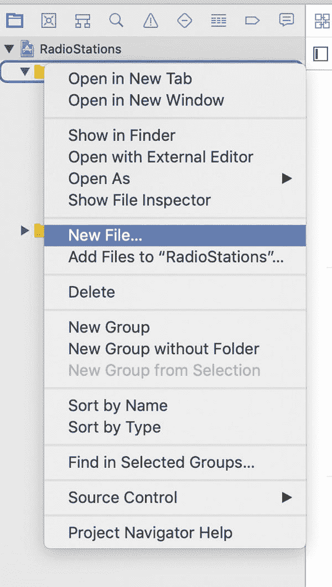

    图 7-4 添加新文件

2.  下一个屏幕如图 7-5 所示，会询问新文件的类型。只需从 Source 组中选择 Cocoa Touch Class，然后点击 Next。

    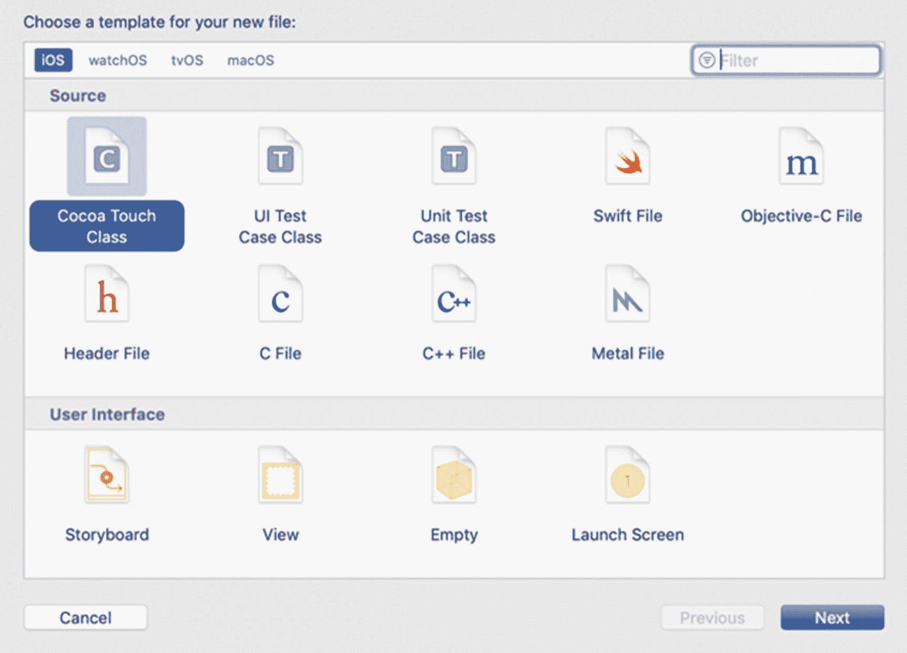

    图 7-5 选择新文件类型

3.  下一个屏幕会询问类的名称。输入`RadioStation`。将 Subclass 保持设置为`NSObject`，并确保 Language 设置为 Swift。参见图 7-6。

    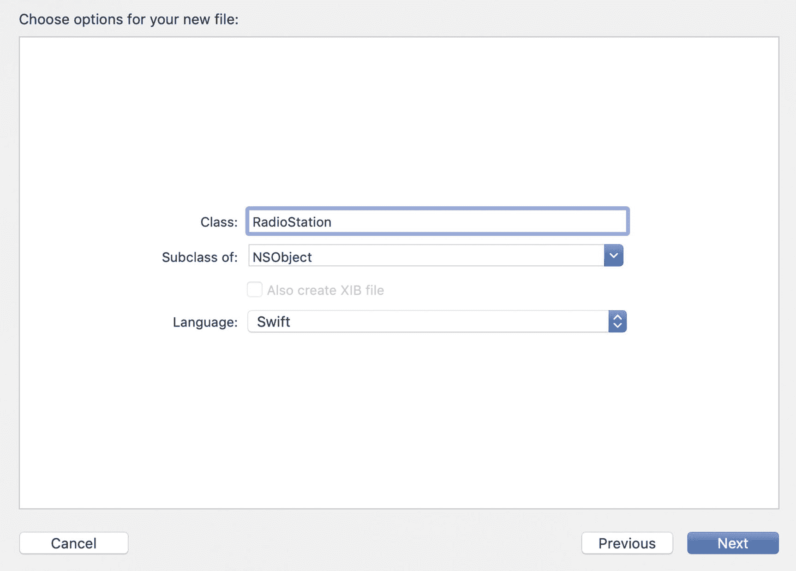

    图 7-6 命名新类

4.  Xcode 不会提示你保存文件。默认位置在你的项目文件夹内。点击 Create 按钮将文件保存到默认位置。

5.  你的项目窗口现在应该如图 7-7 所示。点击`RadioStation.swift`文件。注意，你的新`RadioStation`类的框架已经存在。现在，填充空类，使其看起来如清单 7-1 所示，即你的`RadioStation` Swift 文件。

    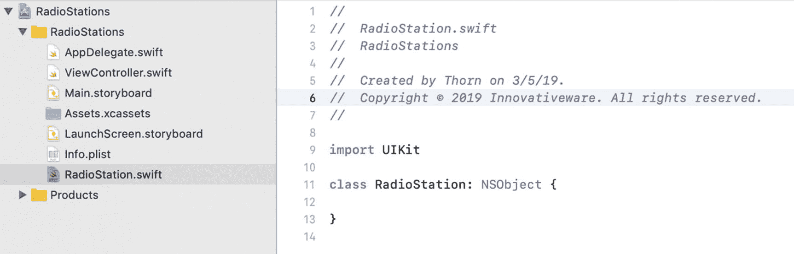

    图 7-7 工作区窗口中你新创建的文件

### 编写类

现在你已经创建了文件和类，可以开始对其进行自定义了。

1.  你将在此处使用的类文件与本章开头使用的文件相同，并且它非常适合电台应用程序。点击`RadioStation.swift`文件，并在你的类中输入代码，如图 7-8 所示。

    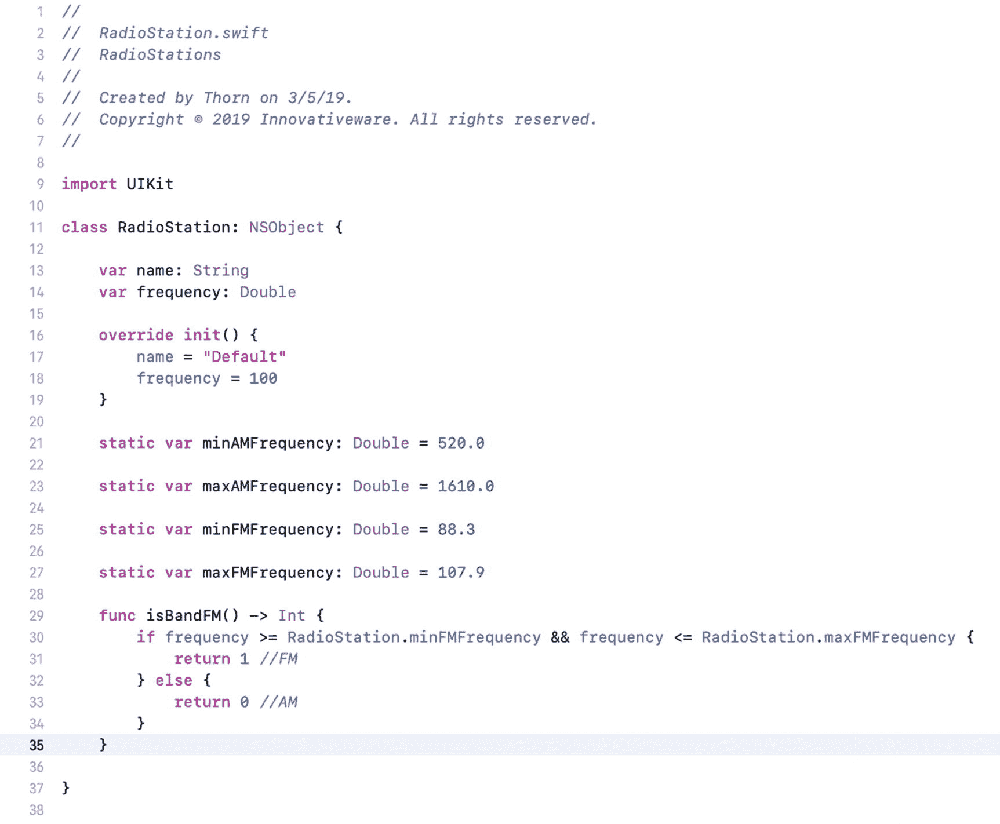

    图 7-8 RadioStation 类文件

稍后我们会回到图 7-8 中的几个项目并进一步解释；不过，在定义了`RadioStation`类之后，你现在可以编写实际使用它的代码了。

1.  点击`ViewController.swift`文件。你需要为此类定义几个变量以供使用，如图 7-9 所示。

    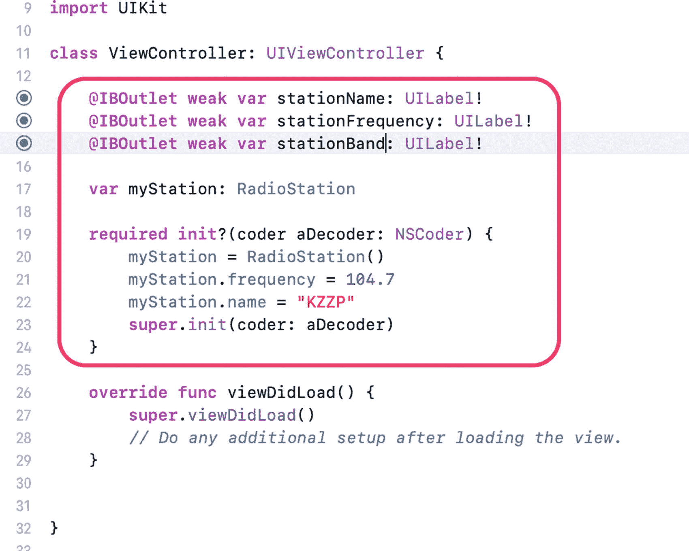

    图 7-9 向视图控制器添加 RadioStation 对象

第 13–15 行将由你的 iOS 界面用来在屏幕上显示一些值（稍后详细介绍）。第 17 行定义了类型为`RadioStation`的变量`myStation`。第 19–24 行包含必需的`init`方法。在 Swift 中，类不需要初始化方法，但这也是设置对象默认值的好地方。此方法设置了该类中使用的变量。另外，不要忘记包含花括号（`{ ... }`）。

### 创建用户界面

接下来，必须设置主窗口以显示你的电台信息。

1.  点击`Main.storyboard`文件。此文件生成 iPhone 主屏幕。点击对象库图标，如图 7-10 所示。

    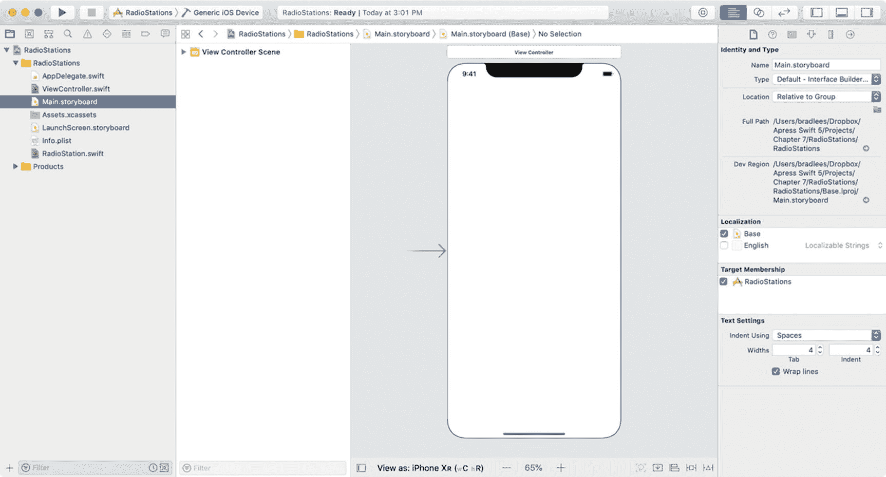

    图 7-10 向 iPhone 屏幕添加标签对象

2.  将三个标签对象拖放到屏幕上，如图 7-11 所示。这些标签可以任意对齐，或者按图 7-11 所示的方式进行对齐。

    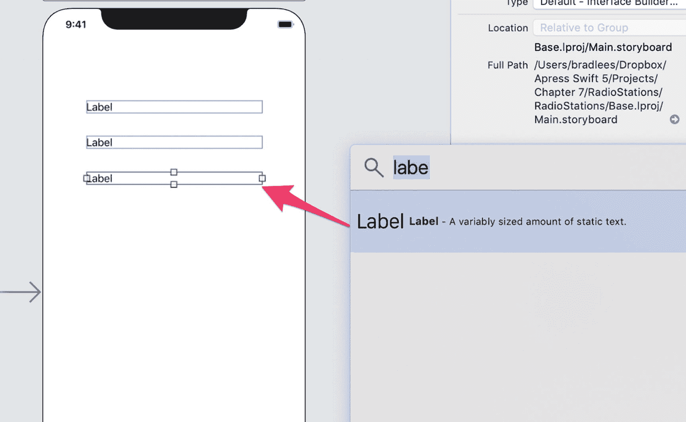

    图 7-11 iPhone 屏幕上的所有三个标签对象

3.  不过，你需要空间。将标签对象放到 iPhone 屏幕后，点击每个标签并拖动尺寸框以放大标签的尺寸，使 iPhone 屏幕看起来有点像图 7-11 所示。

4.  接下来，向屏幕添加一个按钮对象，如图 7-12 所示。点击此按钮后，屏幕将更新为你的电台信息。

    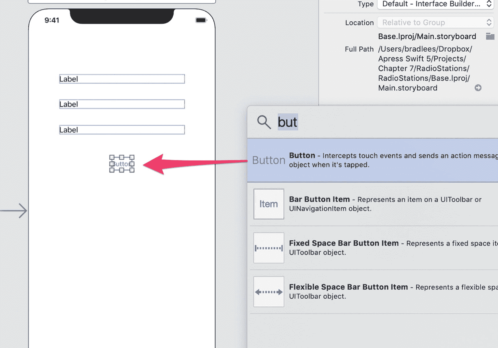

    图 7-12 向屏幕添加按钮对象

5.  与标签对象一样，只需双击按钮对象即可将其标题更改为 My Station。按钮应会自动调整大小以适合新标题。

6.  接下来，你需要添加用于保存电台信息的标签字段。这些字段位于现有标签对象的正后方。图 7-13 显示了第一个标签的放置位置。放置标签对象后，需要调整其大小，使其能够显示更多文本，如图 7-14 所示。

    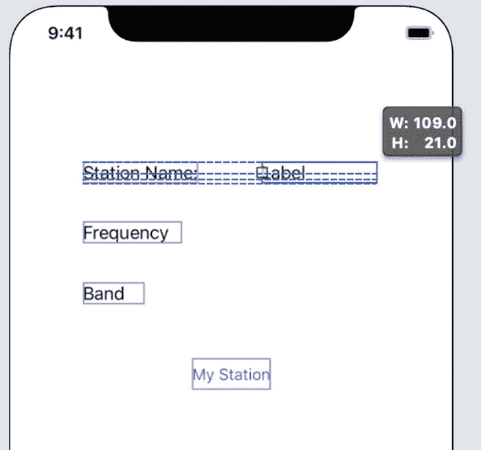

    图 7-14 拉伸标签对象

    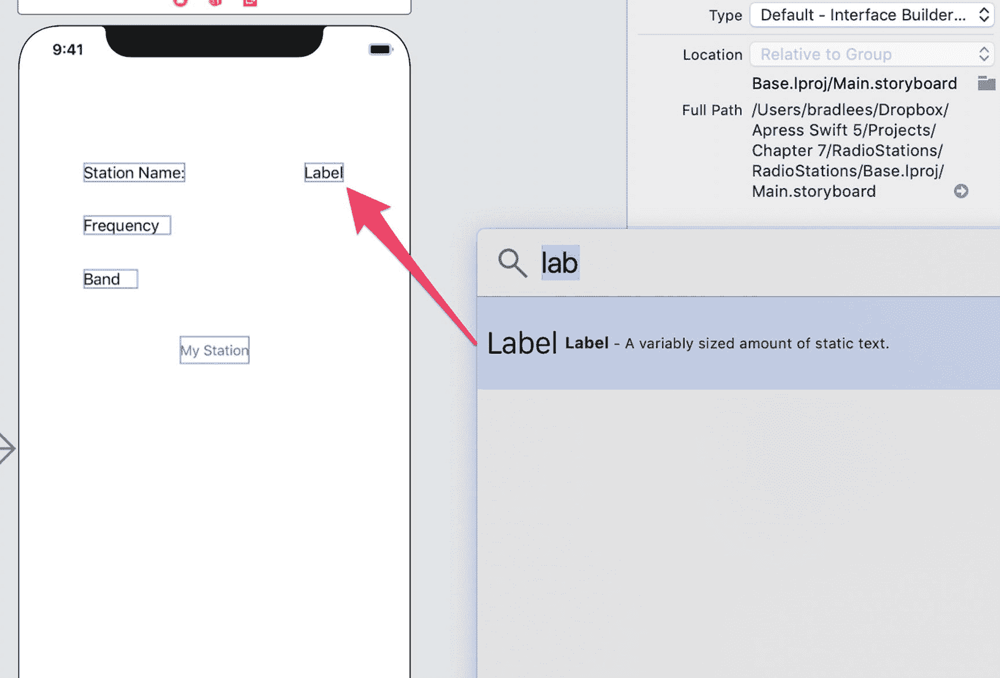

    图 7-13 添加另一个标签对象

    **注意** 拉伸标签对象允许标签的文本包含相当长的字符串。如果你没有调整标签对象的大小，文本可能会被截断（因为无法容纳），或者字体大小会变小。^(¹)

7.  在现有的频率和波段标签旁边重复添加和调整标签对象的大小，如图 7-15 所示。暂时将标签的默认文本保留为“Label”是可以的。

    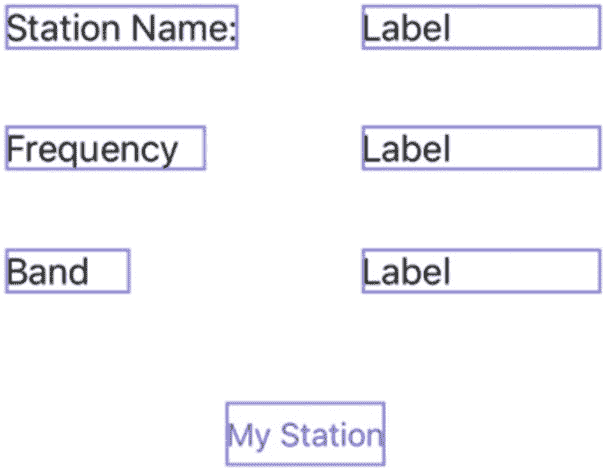

    图 7-15 添加另一个标签对象


### 连接代码

现在所有用户界面对象都已就位，你可以开始将这些界面元素连接到程序中的变量。正如你在第 6 章中所见，这是通过*连接*用户界面对象与程序中的对象来实现的。

1.  首先，将“电台名称”右侧的 `Label` 对象连接到你的变量，如图 7-16 所示。右键单击（或按住 Control 键单击）视图控制器对象，并将其拖拽至“电台名称”文本旁边的 `Label` 对象，以调出插座列表。

    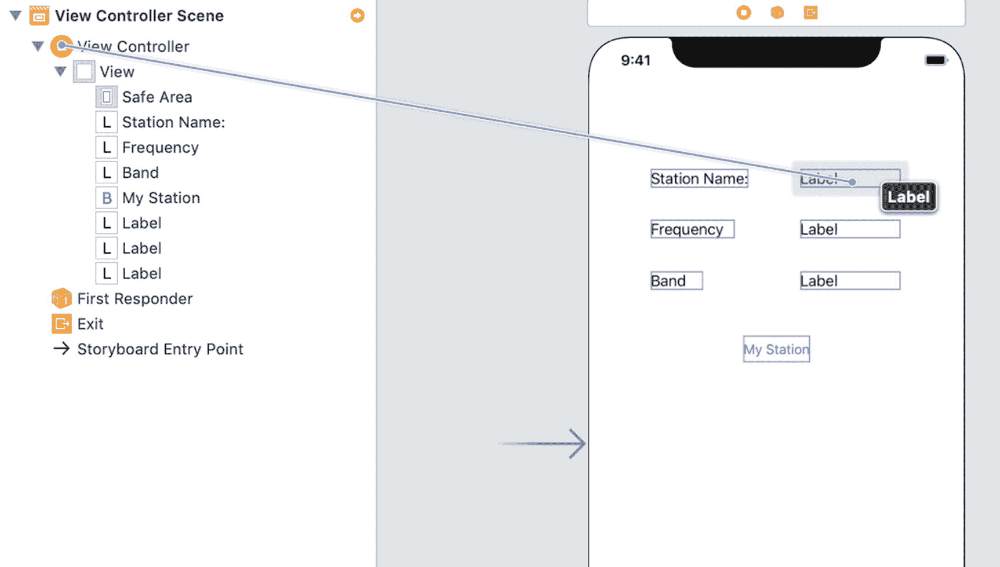

    图 7-16

    创建连接

2.  当从视图控制器图标释放连接时，将显示另一个小菜单。点击你希望在此 `Label` 对象中显示的属性名称——在本例中，你希望显示 `stationName` 属性，如图 7-17 所示。

    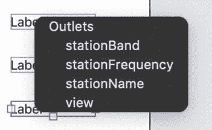

    图 7-17

    将 `Label` 连接到你的 `stationName` 属性

3.  现在，界面上的 `Label` 对象已*连接*到 `stationName` 属性。每当你设置该属性的值时，屏幕也会随之更新。对“频率”和“波段”重复上述连接步骤。

要连接按钮，你需要在 `ViewController` 类中有一个方法来处理此操作。你可以前往 `ViewController.swift` 文件并在其中添加。还有一种添加 `@IBOutlet` 属性和 `@IBAction` 方法的快捷方式。在 Xcode 工具栏的右侧，点击如图 7-18 所示的助理编辑器图标（看起来像两个圆环）。

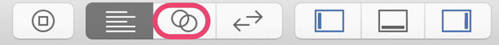

图 7-18

助理编辑器图标

点击助理编辑器图标后，将弹出第二个窗口并显示 `ViewController` 源代码。右键单击（或按住 Control 键单击）并将按钮拖拽到代码窗口中，如图 7-19 所示。

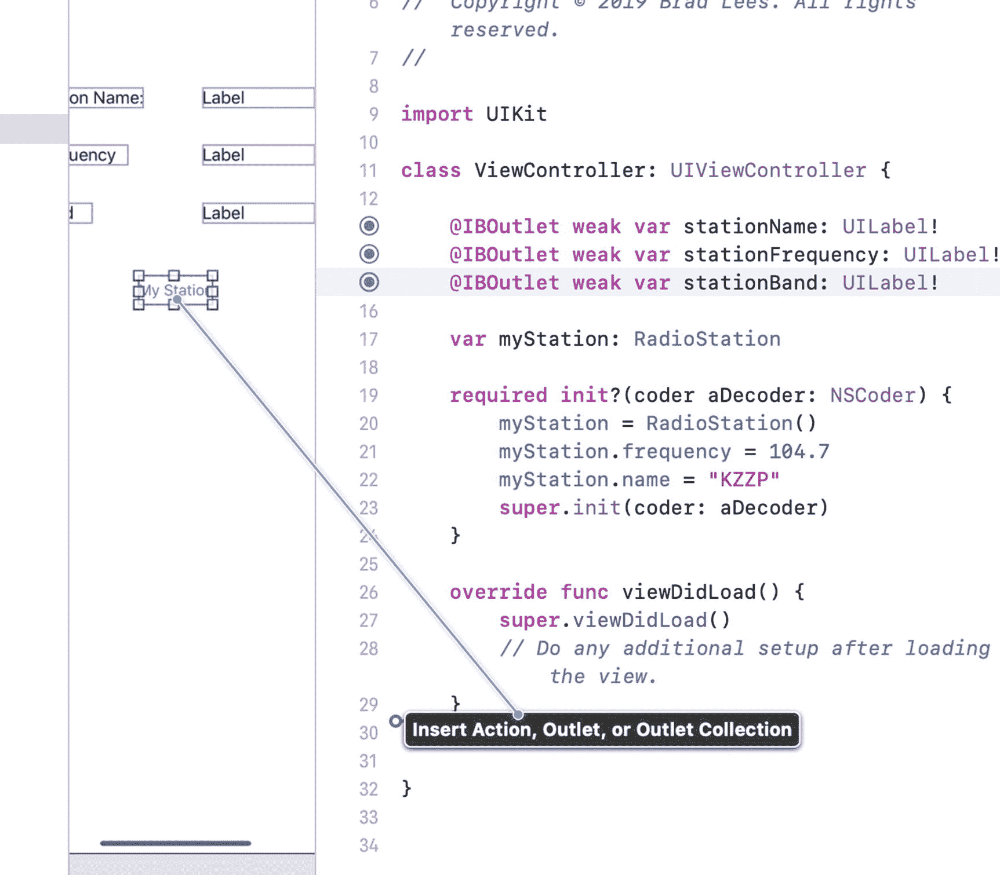

图 7-19

使用助理编辑器创建方法

1.  释放鼠标时，会弹出一个小窗口，如图 7-20 所示。

    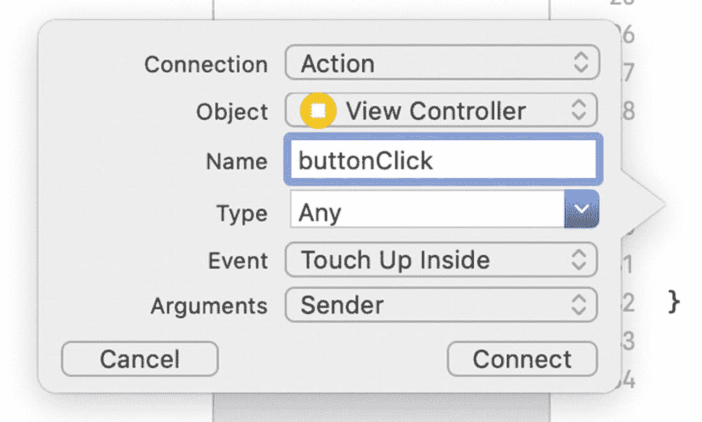

    图 7-20

    创建操作

选择“操作”（Action）并将名称设置为 `buttonClick`。Xcode 将为你创建方法。

通过添加图 7-21 所示的代码来完成你的方法。

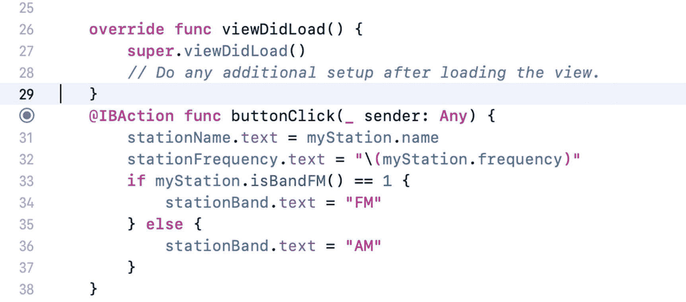

图 7-21

完成的 `buttonClick` 方法

让我们逐步了解你刚刚添加的代码。首先，在第 39 行，你会注意到 `IBAction` 属性。这告诉 Xcode 此方法可以作为操作的结果被调用。因此，当你将操作连接到你的应用程序时，你将看到此方法。

第 40 行和第 41 行都将文本字段设置为 `RadioStation` 类中找到的值。第 40 行如下所示：

```
stationName.text = myStation.name
```

`stationName` 变量是你刚刚连接到用户界面 `Label` 对象的变量，而 `myStation.name` 用于返回电台的名称。

第 41 行的作用与第 40 行基本相同，但你需要先将 double 值（电台的频率）转换为 `String`。`\(myStation.frequency)` 将 `frequency` 属性的值替换到字符串中。

第 42–46 行使用了 `RadioStation` 类的实例变量和类型方法。在这里，你只需对 `myStation` 对象调用 `isBandFM()` 方法。如果是，则该电台为调频（FM）电台，`isBandFM()` 将返回 1；否则，假定为调幅（AM）波段。第 43 行和第 45 行在屏幕上显示波段值。

### 提示

按钮在用户触摸按钮*内部*然后松开时发送“触摸结束内部”（Touch Up Inside）事件——在用户抬起手指之前，事件实际上不会被发送。

### 运行程序

连接完成后，你就可以运行和测试你的程序了！为此，只需点击 Xcode 窗口左上角的“运行”按钮，如图 7-22 所示。


图 7-22

点击“运行”按钮运行程序

如果没有编译错误，iPhone 模拟器将启动，你应该能看到你的应用程序。只需点击“我的电台”（My Station）按钮，电台信息就会显示出来，如图 7-23 所示。

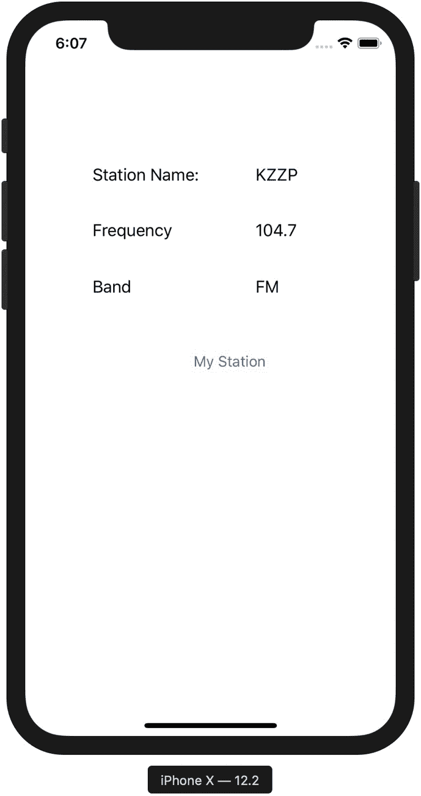

图 7-23

显示你的电台信息

如果显示或运行效果不正常，请回溯你的步骤，并确保本章中描述的所有代码和连接都已就位。

### 将类型方法提升到新水平

在你的程序中，你还没有充分利用 `RadioStation` 的所有类型方法，但本章确实描述了什么是类型方法以及如何使用它。利用这些知识尝试一下本章末尾提到的一些练习。只需在这个简单的可运行程序中进行操作，添加或更改类型方法或实例方法，以了解它们的工作原理。

## 访问 Xcode 文档

Xcode 开发人员文档中包含了丰富的信息。打开 Xcode 后，选择“帮助”➤“文档和 API 参考”（如图 7-24 所示）以打开文档窗口。

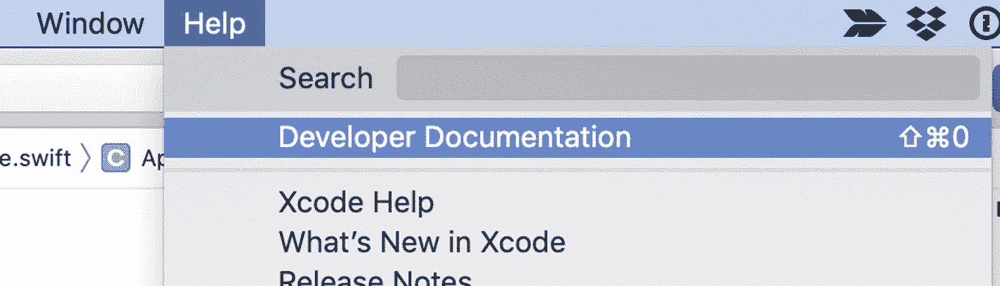

图 7-24

Xcode 帮助菜单

打开后，可以使用搜索窗口查找本章中使用过的任何 Swift 类，包括 `String` 类文档，如图 7-25 所示。

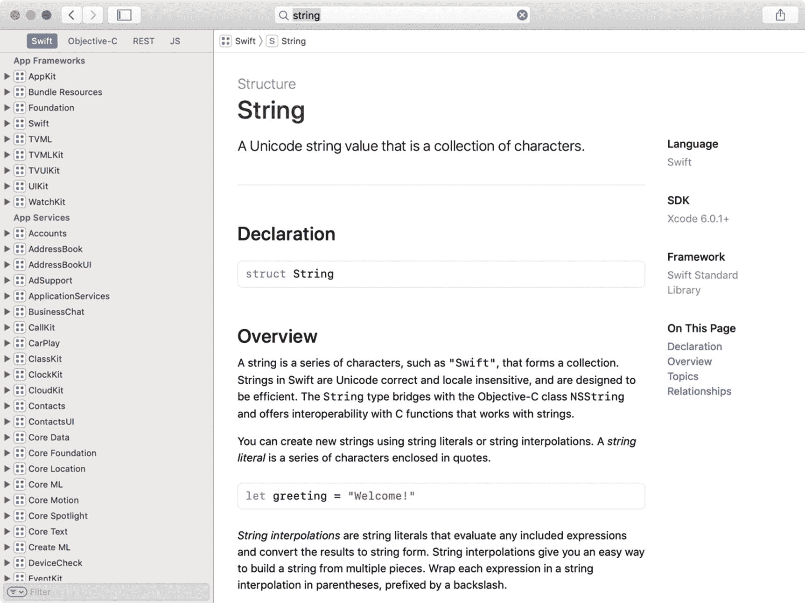

图 7-25

Xcode 文档

关于图 7-25 中显示的 `String` 类，有几点需要探索。通读苹果公司提供的文档和各种配套指南。这将使你更深入地理解各种类及其支持的各种方法。

## 总结

再次恭喜你能够独自把大量信息塞进大脑！以下是本章内容的总结：

* Swift 类回顾
  * 类型方法
  * 实例方法
* 创建类
  * 使用类型方法与实例方法的局限性
  * 初始化类并使用实例变量
* 使用你的新 `RadioStation` 对象
  * 构建一个使用新对象的 iPhone 应用程序
  * 将界面类连接到属性
  * 将用户界面事件连接到类中的方法


### 练习题

- 修改创建`RadioStation`类的代码，使电台名称远长于屏幕可显示的长度。观察会发生什么？
- 修改当前按钮，并添加一个新按钮。将按钮分别标记为"FM"和"AM"。如果用户点击"FM"按钮，显示一个 FM 电台；如果用户点击"AM"按钮，则显示一个 AM 电台。（提示：你需要在`ViewController.swift`文件中添加第二个`RadioStation`对象。）
- 通过确保用户首次启动 iPhone 应用时看不到文本"Label"，来稍微清理界面。
  - 使用界面工具修复此问题。
  - 如何通过向应用添加代码来修复此问题？
- 为`@IBAction func buttonClick(_ sender: AnyObject)`方法添加更多验证逻辑。目前它仅验证 FM 范围而未验证 AM 范围。修复代码使其也能验证 AM 范围。
  - 如果电台频率超出范围，使用现有标签显示某种错误信息。

脚注 1

