# 8. Swift 编程基础

Swift 是一种优雅的语言。它将编译型语言的效率与许多脚本语言的灵活性和现代特性相结合。

本章介绍 Swift 中一些更常见的概念，例如属性（properties）和集合类（collection classes）。同时展示在 Xcode 中处理用户界面元素时，属性是如何被使用的。这听起来任务量很大，但 Swift、Foundation 框架和 Xcode 工具提供了丰富的对象和方法，使得构建应用程序变得轻而易举。

## 使用`let`与`var`

如果你在 Swift 上花费了大量时间，你会看到关键字`var`出现在变量声明之前。你可能也在其他声明前看到过`let`。`var`用于定义变量，而`let`用于定义常量。这意味着如果你用`let`声明一个值，你将无法更改该值。以下代码定义了一个常量：

```
let myName = "Brad"
```

一旦你定义了常量，就无法更改其值。

### 注意

如果你声明了一个变量但从未更改其值，Xcode 现在会发出警告，并建议使用`let`代替`var`。

```
myName = "John"
```

这将会报错。如果你想创建一个可变或可更改的变量，你需要使用`var`。例如，你可以这样操作：

```
var myName = "Brad"
myName = "John"
```

这不会产生任何错误，因为`myName`现在是一个变量。这不仅适用于`String`和`Int`类型，也适用于集合和其他对象。

变量提供了更大的灵活性，那么为什么还会有人想要使用常量呢？答案是性能。如果你知道某个值不会改变，编译器可以将该值优化为常量。

## 理解集合

理解集合是学习 Swift 的基础部分。事实上，集合对象几乎是所有现代面向对象语言库中的基本结构（有时它们被称为*容器*）。简单来说，*集合*是一种能够持有和管理其他对象的类。集合的整个目的是提供一种通用的方式来高效地存储和检索对象。

集合有几种类型。虽然它们都满足能够持有其他对象的相同目的，但主要的区别在于对象的检索方式。Swift 中最常用的集合是`Array`和`Dictionary`。

这两种集合都可以创建为常量或常规变量。如果你将集合创建为常量，则必须在创建时用对象填充它，之后无法修改。

## 使用数组

`Array`类与其他任何集合一样，允许程序员管理一组对象。数组是一种*有序*集合，这意味着对象以特定顺序进入数组，并以相同顺序被检索。

### 注意

有一些处理数组的方法允许你更改对象的顺序，或在数组的特定位置添加对象。

`Array`类允许通过对象在数组中的*索引*来检索对象。索引是对象在数组中占据的数值位置。例如，如果数组中有三个元素，则对象可以通过索引 0 到 2 来引用。与 Swift 及其他编程语言中的大部分情况一样，索引从 0 开始，而不是 1。参见代码清单 8-1。

```
1    var myArray: [String] = ["One", "Two", "Three"]
2    print(myArray[0])
3    print(myArray[1])
4    print(myArray[2])
代码清单 8-1
访问数组中的对象
```

如你所见，数组中的对象可以通过其索引检索。索引从 0 开始，且不能超过数组大小减 1。你可以通过访问`Array`对象的`count`属性轻松计算数组的大小，如下所示：

```
var entries = myArray.count
```

实际上，每一种集合类型，包括`Array`和`Dictionary`，都包含一个`count`属性。

向数组末尾添加元素很简单。你只需在数组上调用`append`方法，如代码清单 8-2 所示。

```
1    var myArray: [String] = ["One", "Two", "Three"]
2    myArray.append("Four")
3    myArray.append("Five")
4    myArray.append("Six")
代码清单 8-2
向数组添加对象
```

Swift 提供了许多不同的方法用于向数组添加元素。如果你想向数组中添加多个对象，可以使用标准的`+=`（通常称为*加等于*）运算符。代码清单 8-3 创建了一个数组，然后在第二行向数组添加了三个`String`对象。注意新值放在方括号中而不是圆括号中。

```
1    var myArray: [String] = ["One", "Two", "Three"]
2    myArray += ["Four", "Five", "Six"]
代码清单 8-3
向数组添加多个对象
```

如前所述，数组实际上是有序的。数组中对象的顺序是重要的。有时你可能需要在数组的特定位置添加一个项目。你可以使用`insert(at:)`方法来实现，如代码清单 8-4 所示。

```
1    var myArray: [String] = ["Two", "Three"]
2    myArray.insert("One", at: 0)
代码清单 8-4
在数组开头添加一个字符串
```

数组现在包含`One`、`Two`、`Three`。

访问数组中的项目很简单。你可以使用标准方括号访问特定位置的对象。例如，`myArray[0]`会给你数组中的第一个对象。如果你想遍历数组中的每个项目，可以使用一种叫做*快速枚举*或*For-In 循环*的方法。代码清单 8-5 是一个快速枚举的例子。

```
1    var myArray: [String] = ["One", "Two", "Three"]
2    for myString in myArray {
3         print(myString)
4    }
代码清单 8-5
快速枚举
```

神奇之处发生在代码清单 8-5 的第二行。你告诉 Swift 将`myArray`的每个值赋给一个名为`myString`的新常量。然后你可以对`myString`做任何你想做的事情。在这个例子中，你只是打印它。它会遍历数组中的所有对象，而无需知道对象的总数。这是一种从数组中取出项目的快速有效的方式。

从数组中移除对象也很简单。你可以使用`remove(at:)`方法，如代码清单 8-6 所示。

```
1    var myArray: [String] = ["One", "Two", "Three"]
2    myArray.remove(at: 1)
3    for myString in myArray {
4         print(myString)
5    }
代码清单 8-6
移除一个对象
```


清单 8-6 的输出结果是 `One, Three`。这是因为你移除了索引为 1 的对象。请记住，这对应数组中的第二个对象，因为数组索引总是从 0 开始。

你已经见识到 Swift 在处理数组交互方面有多么灵活。数组是强大的集合，作为程序员，你会经常用到它们。本节涵盖了数组的基础知识，但数组能做的事情远不止这些。

## 使用字典类

Swift 的 `Dictionary` 类也是一种有用的集合类型。它与 `Array` 类一样允许存储对象，但 `Dictionary` 的不同之处在于，它允许将键与条目关联起来。例如，你可以创建一个字典来存储某人的属性列表，比如 `firstName`、`lastName` 等。与使用索引访问数组不同，字典可以使用诸如 `"firstName"` 这样的 `String` 来访问属性。不过，所有键必须是唯一的——也就是说，`"firstName"` 不能重复出现。根据你的程序需要，找到唯一的键名通常不是问题。

以下是创建字典的一个示例：

```
var person: [String: String] = ["firstName": "John", "lastName": "Doe"]
```

这会创建一个名为 `person` 的简单字典。声明的下一部分告诉字典键和值的对象类型。在这个例子中，键是 `String` 类型，值也是 `String` 类型。然后你向字典添加了两个键。第一个键是 `firstName`，对应的值为 `John`。第二个键是 `lastName`，对应的值为 `Doe`。你可以使用与数组类似的符号来访问字典中的值。

```
print(person["firstName"])
```

这段代码会打印出名称 `Optional("John")`，因为这是键 `firstName` 对应的值。前面的示例中出现了 `Optional`，因为字典中某个键对应的值是可选值。你可以使用相同风格的代码来修改字典中的值。假设在这个例子中，John 现在更喜欢让别人叫他 Joe。你可以通过一行简单的代码来修改字典中的值。

```
person["firstName"] = "Joe"
```

你可以使用相同的符号向字典添加新键。

```
person["gender"] = "Male"
```

如果你决定从字典中移除某个键，比如刚添加的 `gender` 键，可以通过将该键的值设置为 `nil` 来实现。

```
person["gender"] = nil
```

现在字典中将只包含 `firstName` 和 `lastName`。请注意，字典是无序的。你不能依赖其顺序，但有时你需要遍历字典。这可以通过与数组类似的方式实现。主要区别在于，数组中你只需分配一个变量，而在字典中你需要分配键和值。参见清单 8-7。

```
1    var person: [String: String] = ["firstName": "John", "lastName": "Doe"]
2    for (myKey, myValue) in person {
3         print(myKey + ": " + myValue)
4    }
```

这个示例会打印以下内容：

```
firstName: John
lastName: Doe
```

字典是组织无序数据的绝佳方式，也是基于特定键查找数据的好方法。它们在 Swift 中非常灵活，应被用于组织和优化代码。

## 创建 BookStore 应用

你将创建一个演示如何使用数组的应用程序。你将创建一个 `UITableView`，并使用数组填充 `UITableView` 的数据。让我们从创建基础应用项目开始。打开 Xcode 并选择一个新的 Master-Detail Application 项目，如图 8-1 所示。在这个项目中，你将为你即将打造的书店应用创建几个简单的对象：一个 `Book` 对象和一个 `BookStore` 对象。你将再次接触属性，并学习如何在项目中获取和设置它们的值。最后，你将实际使用这些书店对象，并学习在创建对象后如何使用它们。

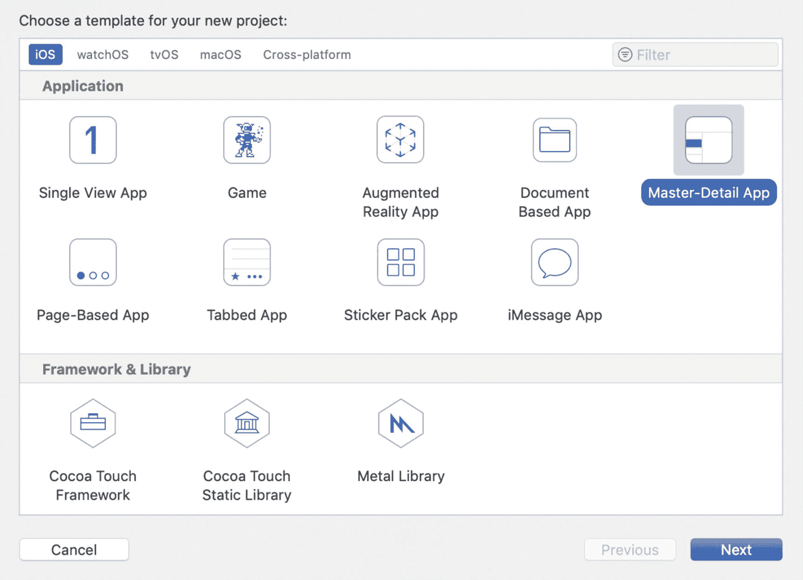

1.  点击 Next 按钮，并将项目命名为 **BookStore**，如图 8-2 所示。公司名称是必填项——你可以使用任何真实或虚构的公司名称。示例中使用的是 `com.innovativeware`，这完全没问题。确保语言设置为 Swift。不要勾选“使用 Core Data”复选框。

**注意：** 这类应用非常适合使用 Core Data，但 Core Data 要到第 11 章才会介绍。在本应用中，你将使用数组来存储数据。

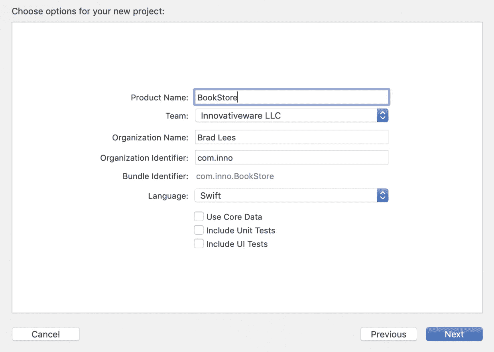

2.  一切填写完毕后，点击 Next 按钮。Xcode 会提示你指定项目的保存位置。选择你能记住的位置即可——桌面是个好选择。

3.  确定位置后，点击 Create 按钮创建新项目。这将创建基础的 `BookStore` 项目框架，如图 8-3 所示。

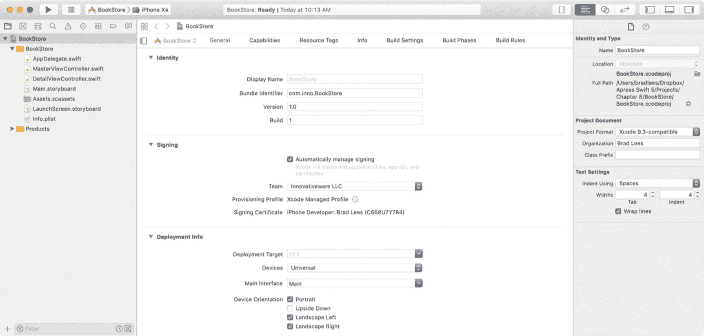

4.  点击导航区域左下角的加号（**+**），为项目添加一个新对象。选择 New File。然后选择顶部的 iOS 部分，并在右侧选择 Swift File，如图 8-4 所示。你也可以右键点击（或按住 Control 键点击）导航区域，然后选择 New File 菜单选项。这两种方式没有区别——选择你觉得更自然的方式即可。

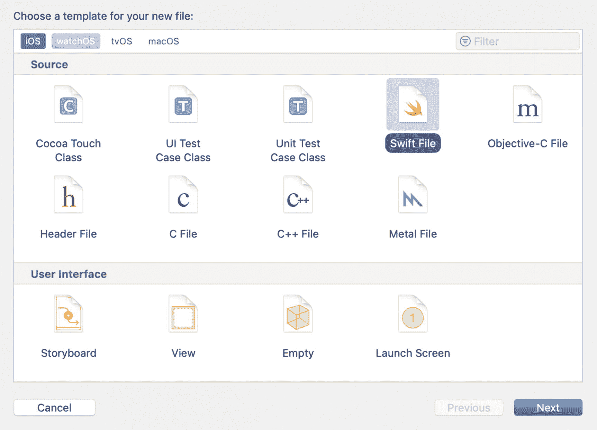

5.  你选择了一个普通的 Swift 文件，这将创建一个新的空 Swift 文件，你将用它来定义 `Book` 类。选择后，点击 Next 按钮。

6.  Xcode 会询问你要给文件取什么名字。请使用名称 `Book`。Xcode 还会询问应将新文件保存到哪个文件夹。为简单起见，请选择项目中的 `BookStore` 文件夹。项目中所有其他类文件也都存储在这里。

7.  双击 `BookStore` 文件夹，然后点击 Create 按钮。你将在 Xcode 的主编辑窗口中看到新文件 `Book.swift`，它也会出现在导航区域中，如图 8-5 所示。

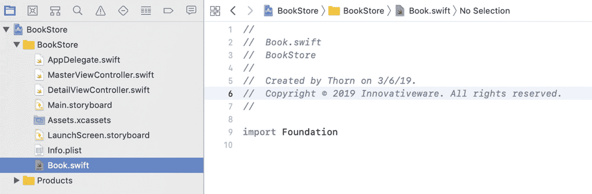

8.  重复之前的步骤，创建第二个名为 `BookStore` 的对象。这将生成一个 `BookStore.swift` 文件。本章稍后你将用到这个类。现在，我们先把注意力集中在 `Book` 类上。

9.  点击 `Book.swift` 文件，让我们开始定义这个新类！

### 创建你的类

通过添加一个普通的 Swift 文件（而非 Cocoa Touch 类），Xcode 创建了一个空的 Swift 文件。你可以向这个文件添加多个类。Swift 更加灵活，不要求每个文件只能有一个类。Xcode 允许你根据需要自由添加类。


好的，作为高级文档工程师和翻译员，我将严格遵循您提供的格式和注意事项，对以下英文文本进行翻译。


### 注意

将 Swift 类保存在单独的文件中仍然是一个好主意。这有助于更容易地组织和查找类，尤其是在处理大型项目时。但有时，一个较小的类只与另一个类一起使用，将它们放在同一个文件中是合理的。

让我们创建 `Book` 类。将以下代码输入到 `Book.swift` 文件中：

```
class Book {
}
```

现在你就有了这个类，如图 8-6 所示。这就是创建类所需要做的全部工作。

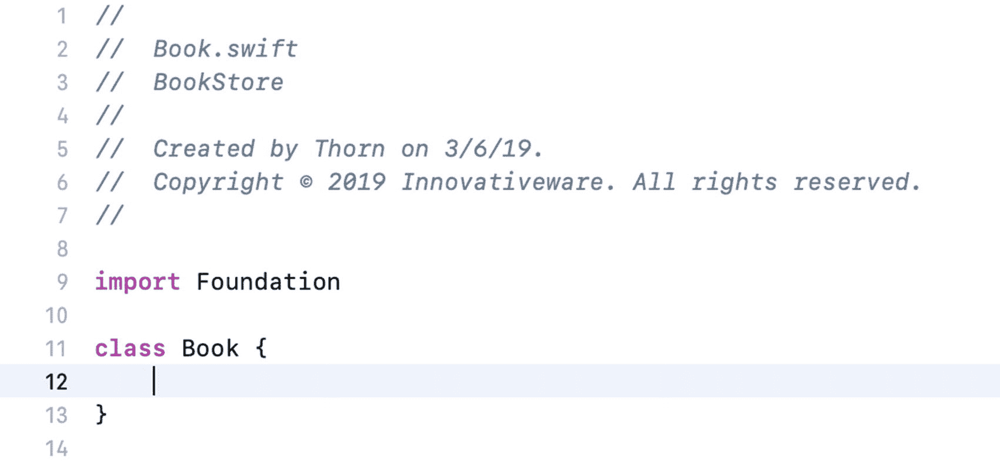

图 8-6. 空的 Book 类

### 引入属性

这个类简单地被命名为 `Book`。没错，你有了一个类，但目前它*不存储*任何东西。为了使这个类有用，它需要能够保存一些信息，这是通过属性来实现的。当使用一个对象时，它必须被实例化。一旦对象被实例化，它就可以访问其属性。只要对象保持在作用域内，这些变量就对对象可用。正如你在第 7 章中所了解的，作用域定义了对象存在的上下文。在某些情况下，对象的作用域可能是程序的整个生命周期。在其他情况下，作用域可能只是一个函数或方法。这完全取决于对象在哪里声明以及如何使用。作用域将在后面更详细地讨论。现在，让我们给 `Book` 类添加一些属性，使其更有用。

```
1   //
2   //  Book.swift
3   //  BookStore
4   //
5   //  Created by Thorn on 7/27/17.
6   //  Copyright © 2017 Innovativeware. All rights reserved.
7   //

9   import Foundation

11   class Book {
12       var title: String = ""
13       var author: String = ""
14       var description: String = ""
15   }
代码清单 8-8 向 Book.swift 文件添加实例变量
```

代码清单 8-8 展示了与之前相同的 `Book` 对象，但现在第 12-14 行的大括号内添加了三个新属性。这些都是 `String` 对象，这意味着它们可以为 `Book` 对象保存文本信息。因此，`Book` 对象现在有了存储标题、作者和描述信息的地方。注意，代码给属性赋予了一个初始值。如果没有赋予初始值，该类将需要一个 `init` 方法来赋予初始值。

### 访问属性

现在你已经有了一些属性，那么如何使用它们呢？它们如何被访问？不幸的是，仅仅声明一个属性并不一定能让你访问它。有两种方式可以访问这些变量：

*   当然，一种方式是在 `Book` 对象内部。
*   第二种方式是从对象外部——即程序中使用 `Book` 对象的其他部分。

如果你正在为 `Book` 对象内部的一个方法编写代码，访问其属性非常简单。例如，你可以简单地编写以下代码：

```
title = "Test Title"
```

从对象外部，你仍然可以访问 `title` 变量。这是通过使用点表示法来实现的。

```
myBookObject.title = "Test Title"
```

## 完成 BookStore 程序

理解了属性之后，现在你将着手创建实际的图书店程序。想法很简单——创建一个名为 `BookStore` 的类，它将存放一些 `Book` 对象。

## 创建视图

让我们先准备好视图。如果你需要复习如何在 Xcode 中构建界面，请参考第 6 章。

1.  在导航区点击 `Main.storyboard` 文件。这将显示 Xcode 的界面构建器，如图 8-7 所示。你将在 `Main.storyboard` 文件中看到五个场景。向右导航找到详细信息场景。

    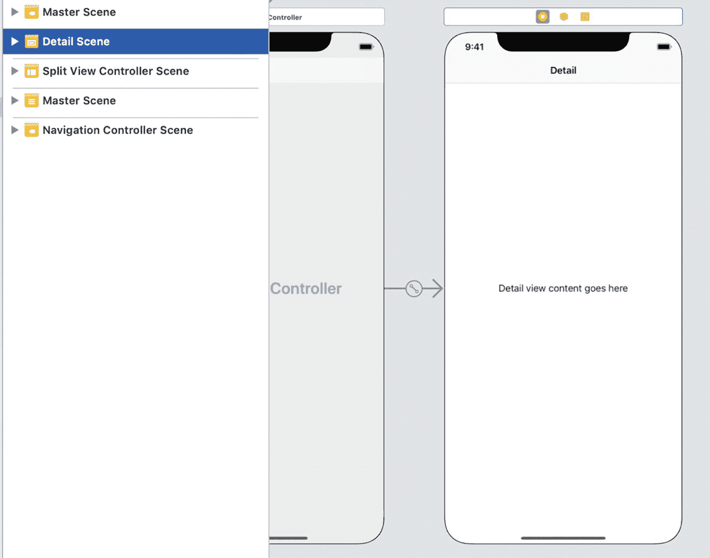

    图 8-7. 准备图书店的详细信息视图

2.  默认情况下，当你创建一个空的主-从应用程序时，Xcode 会添加一个文本为“Details view content goes here.”的标签。选择并删除这个标签对象，因为你要添加自己的标签。你将添加一些新的字段来显示所选书籍的详细信息。由于你删除了这个控件，你也需要移除引用它的代码。
    1.  在 `DetailViewController.swift` 文件中，移除下面一行：

        ```
        @IBOutlet weak var detailDescriptionLabel: UILabel!
        ```

    2.  在 `var detailItem: AnyObject?` 属性声明中，移除下面一行：

        ```
        configureView()
        ```

    3.  在名为 `configureView` 的方法中，移除以下几行：

        ```
        // 更新详细信息项的用户界面。
        if let detail = detailItem {
        if let label = detailDescriptionLabel {
        label.text = detail.description
        }
        }
        ```

        你的 `DetailViewController.swift` 文件现在应该看起来像图 8-8 所示。

    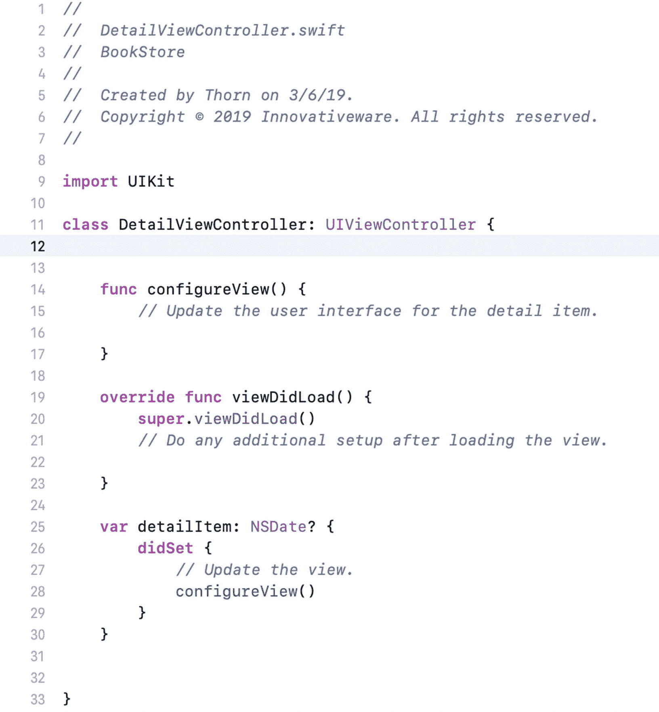

    图 8-8. 修改后的 DetailViewController

3.  从对象库中拖动一些标签对象到详细信息视图上，如图 8-9 所示。确保下方的标签控件比默认的宽。这是为了让它们能够容纳相当多的文本。两个文本为“Label”的标签对象是你要连接起来的，用于保存 `Book` 对象中的两个值：`Title` 和 `Author`。

    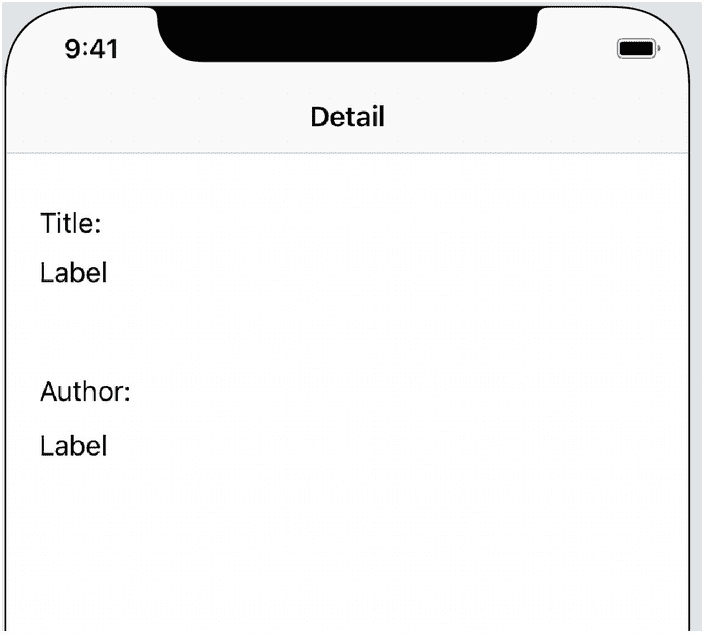

    图 8-9. 添加一些标签对象

### 添加属性

接下来，你将向 `DetailViewController` 类添加一些属性。这些属性将对应于详细信息视图的标签对象。

1.  点击 Xcode 右上角的助理编辑器图标（看起来像两个圆圈）以打开助理编辑器。确保编辑器中显示的是 `DetailViewController.swift` 文件。

2.  按住 Control 键，将第一个空白标签控件拖拽到右侧的代码中，如图 8-10 所示。将第一个命名为 `titleLabel`（见图 8-11），然后点击连接，接着对第二个重复此过程，将其命名为 `authorLabel`。这将向你的 `DetailViewController` 类添加两个变量，如代码清单 8-9 所示，并将它们连接到界面中的标签控件。

    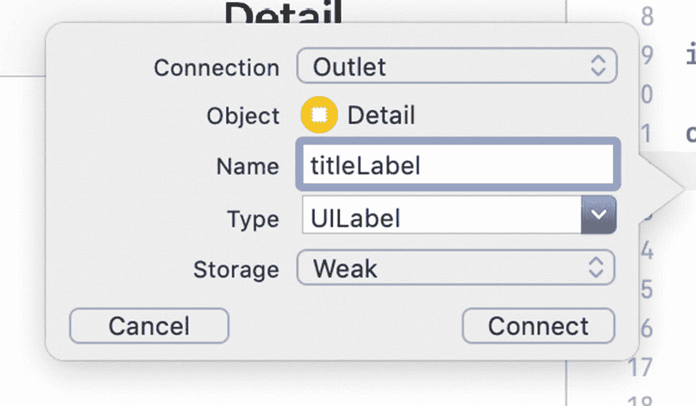

    图 8-11. 命名新属性

    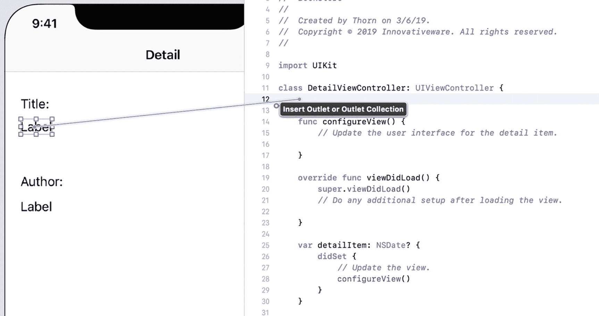

    图 8-10. 创建变量

```
1        @IBOutlet weak var titleLabel: UILabel!
2        @IBOutlet weak var authorLabel: UILabel!
代码清单 8-9 修改 DetailViewController.swift 文件以包含新的标签
```


### 添加描述

现在，您需要在视图中添加描述。描述略有不同，因为它可以跨越多行。为此，您将使用`Text View`对象。

1.  首先，将“描述：”标签添加到视图中，如图 8-12 所示。
   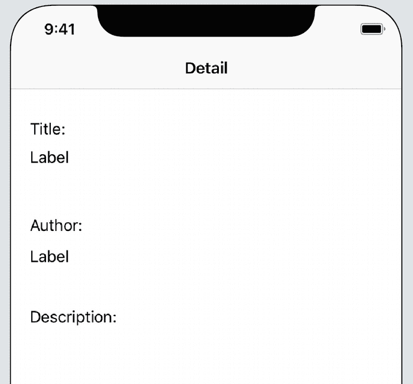
   图 8-12. 为描述添加新的`Label`对象

2.  接下来，将`Text View`对象添加到详细场景中，如图 8-13 所示。`Text View`对象的优势在于它能够轻松显示多行文本。虽然`Label`对象也可以显示多行，但不如`Text View`对象那么清晰。
   **注意** 默认情况下，`Text View`控件中填充了各种看似随机的文本。这种文本被称为*Lorem Ipsum*文本。如果您需要用文本填充页面，可以在网络上找到任意数量的 Lorem Ipsum 生成器。至于`Text View`控件，这些文本可以保持不变，因为您将在运行时将其移除。此外，如果将其清空，在屏幕上准确找到`Text View`控件的位置会变得更加困难——它是白底白字！
   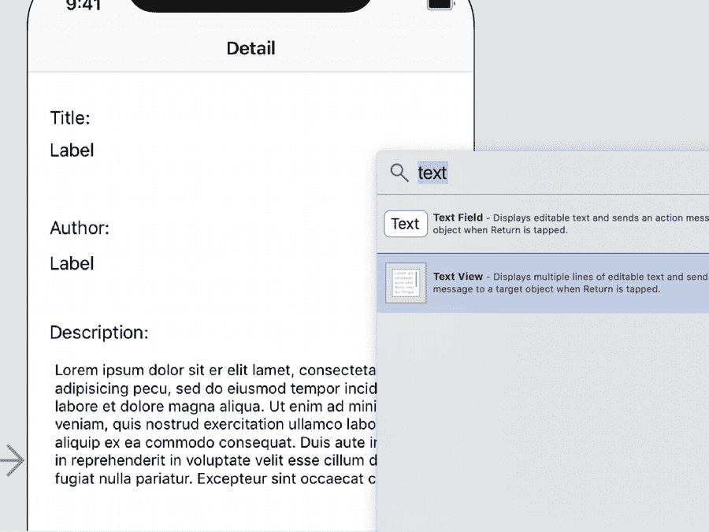
   图 8-13. 向详细视图中添加`Text View`

3.  为了让程序能够利用`Text View`，您需要像为标题和描述创建输出口那样，为其创建一个输出口。只需像之前一样，按住 Control 键并将`Text View`拖拽到`DetailViewController`文件中。将此变量命名为`descriptionTextView`。`DetailViewController`中完成后的变量部分将如代码 8-10 所示。
   1. 注意，其类型是`UITextView`而非`UILabel`——这一点很重要。

```
1    import UIKit
3    class DetailViewController: UIViewController {
5        @IBOutlet weak var titleLabel: UILabel!
6        @IBOutlet weak var authorLabel: UILabel!
8        @IBOutlet weak var descriptionTextView: UITextView!
代码 8-10
为 Text View 添加输出口以保存描述
```

### 注意事项

如前所述，将`descriptionTextView`属性设置为`UITextView`类型非常重要。例如，如果意外地将其设置为`UILabel`对象，那么在尝试将屏幕上的`Text View`连接到输出口时，Xcode 将无法找到`descriptionTextView`输出口。为什么？因为 Xcode 知道该控件是一个`UITextView`，并正在寻找一个类型为`UITextView`的输出口。

### 创建一个简单的数据模型类

为了使应用程序能够运行，它需要拥有一些要显示的数据。为此，您将使用之前创建的`BookStore`对象作为数据模型类。数据模型类并没有什么不同，只是其全部目的是允许应用程序通过对象访问数据。

修改`BookStore.swift`文件，使其内容如代码 8-11 所示。

```
1 //
2 //  BookStore.swift
3 //  BookStore
4 //
5 //  Created by Thorn on 03/06/19.
6 //  Copyright © 2019 Innovativeware. All rights reserved.
7 //
9    import Foundation
11    class BookStore {
12        var bookList: [Book] = []
13    }
代码 8-11
修改 BookStore.swift 类以包含一个数组
```

在第 12 行，您添加了一个变量用于保存书籍列表；该属性被简单命名为`bookList`。请注意，`bookList`是一个数组，它允许您添加一系列对象，在本例中是一组`Book`对象。

接下来，让我们继续向 Swift 文件`BookStore.swift`中添加代码，如代码 8-12 所示。

```
1 //
2 //  BookStore.swift
3 //  BookStore
4 //
5 //  Created by Thorn on 03/06/19.
6 //  Copyright © 2019 Innovativeware. All rights reserved.
7 //
9 import Foundation
11 class BookStore {
12     var bookList: [Book] = []
14     init() {
15         var newBook = Book()
16         newBook.title = "Swift for Absolute Beginners"
17         newBook.author = "Bennett and Lees"
18         newBook.description = "iOS Programming made easy."
19         bookList.append(newBook)
21         newBook = Book()
22         newBook.title = "A Farewell to Arms"
23         newBook.author = "Ernest Hemingway"
24         newBook.description = "The story of an affair between an English nurse and an American soldier on the Italian front during World War I."
25         bookList.append(newBook)
26     }
27 }
代码 8-12
实现 BookStore 数据对象
```

在代码 8-12 中，第 14 至 26 行定义了对象的`init`方法，该方法在对象首次初始化时被调用。在此方法中，您初始化了计划添加到书店中的两本书。第 15 行是第一个`Book`对象被分配和初始化的地方。第 16 至 18 行为您的第一本书添加了标题、作者和描述。最后，第 19 行将新的`Book`对象添加到`bookList`数组中。这里需要注意的重要一点是，一旦对象被添加到数组中，代码就可以不再关心它；现在数组拥有了该对象的所有权。因此，第 21 行不会出现问题。

第 21 行分配了一个新的`Book`对象，覆盖了旧值。这告诉编译器您不再需要使用旧值。

第 22 至 25 行简单地初始化了第二本书并将其添加到数组中。

就是这样！这就是定义一个简单数据模型类所需的全部内容。接下来，您需要修改`MasterViewController`以访问此类，使其能够开始显示一些数据。


### 修改 `MasterViewController`

这个简单应用包含两个视图控制器：主视图控制器 `MasterViewController` 和辅助视图控制器 `DetailViewController`。视图控制器是用于控制视图行为的对象。为了让应用开始从数据模型中显示数据，你需要首先修改 `MasterViewController`——这是应用导航的起点。以下代码已经存在于 Xcode 提供的模板中。你只需对其进行修改以添加你的数据模型。

首先，你需要修改 `MasterViewController.swift` 文件。需要添加一个变量来持有 `Bookstore` 对象。代码清单 8-13 显示第 15 行将实例变量作为属性添加。

```
1 //
2 //  MasterViewController.swift
3 //  BookStore
4 //
5 //  Created by Thorn on 03/06/19.
6 //  Copyright © 2019 Innovativeware. All rights reserved.
7 //

9 import UIKit

11 class MasterViewController: UITableViewController {

13     var detailViewController: DetailViewController? = nil
14     var objects = [Any]()
15     var myBookStore = BookStore()
代码清单 8-13
添加 BookStore 对象
```

现在 `BookStore` 对象已经初始化，你需要告诉 `MasterViewController` 如何显示书籍列表——不是详细信息，只是书籍标题。为此，你需要修改几个方法。幸运的是，Xcode 已经提供了一个不错的模板，因此修改量很小。

`MasterViewController` 是 `UITableViewController` 类的子类，该类负责在屏幕上显示数据行。在本例中，这些行是书籍标题（虽然对于这个简单程序只有两行，但依然是一个列表）。

控制 `UITableViewController` 中数据显示内容和方式的主要方法有三个：

*   第一个是 `numberOfSections(in:)`：由于该应用只有一个列表（即一个分区），该方法返回 1。
*   第二个是 `tableView(_:numberOfRowsInSection:)`：在该程序中，你返回 bookstore 数组中的书籍数量。由于这是唯一的分区，代码逻辑很直接。
*   第三个是 `tableView(_:cellForRowAt:)`：该方法针对屏幕上需要显示的每一行依次调用。

代码清单 8-14 详细列出了让视图显示书籍列表所需的修改。修改从源文件的第 63 行开始。

```
64      override func numberOfSections(in tableView: UITableView) -> Int {
65         return 1
66     }

68     override func tableView(_ tableView: UITableView, numberOfRowsInSection section: Int) -> Int {
69         return myBookStore.bookList.count
70     }

72     override func tableView(_ tableView: UITableView, cellForRowAt indexPath: IndexPath) -> UITableViewCell {
73         let cell = tableView.dequeueReusableCell(withIdentifier: "Cell", for: indexPath)
74         cell.textLabel!.text = myBookStore.bookList[indexPath.row].title
75         cell.accessoryType = .disclosureIndicator
76         return cell
77     }
代码清单 8-14
设置视图以显示书籍
```

在这段代码中，你只需修改几行。其他所有代码可以保持不变。这是使用 Xcode 模板的优势之一。第 68 行原本只返回 1；你需要将其改为返回 `BookStore` 类中的项目数量。

第 74 行看起来稍微复杂一些。基本上，`UITableView` 的每一行就是一个所谓的“*单元格*”（具体来说是 `UITableViewCell`）。第 74 行将单元格的文本设置为书籍的标题。我们来更具体地分析一下这段代码：

```
cell.textLabel!.text = myBookStore.bookList[indexPath.row].title
```

首先，`myBookStore` 是 `BookStore` 对象，这很清楚。你引用了 `BookStore` 对象中名为 `bookList` 的数组。由于 `bookList` 是一个数组，你可以通过 `indexPath.row` 在方括号中访问你想要的书籍。`indexPath.row` 的值指定了你要的是哪一行——`indexPath.row` 总是小于总数减一。因此，调用 `myBookStore.bookList[indexPath.row]` 会返回一个 `Book` 对象。最后一部分 `.title` 则访问返回的 `Book` 对象的 `title` 属性。以下代码与你刚才在一行中完成的操作等效：

```
1    var book: Book
2    book = myBookStore.bookList[indexPath.row]
3    cell.textLabel!.text = book.title
```

现在，你应该能够构建并运行应用，看到你在数据模型中创建的两本书，如图 8-14 所示。

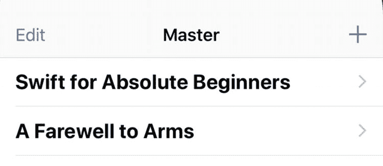

图 8-14. 首次运行应用

但工作还未完成。你需要让应用在点击其中一本书时显示其详情。为此，你需要对 `MasterViewController` 进行最后一项修改。

每当屏幕上某一行被触摸时，就会调用 `prepare(for:sender:)` 方法。每次应用在故事板中过渡到不同视图时，此方法都会被调用。代码清单 8-15 显示了将细节视图与书籍数据关联所需做的小修改。

```
50     override func prepare(for segue: UIStoryboardSegue, sender: Any?) {
51         if segue.identifier == "showDetail" {
52             if let indexPath = tableView.indexPathForSelectedRow {
53                 let selectedBook: Book = myBookStore.bookList[indexPath.row]
54                 let controller = (segue.destination as! UINavigationController).topViewController as! DetailViewController
55                 controller.detailItem = selectedBook
56                 controller.navigationItem.leftBarButtonItem = splitViewController?.displayModeButtonItem
57                 controller.navigationItem.leftItemsSupplementBackButton = true
58             }
59         }
60     }
代码清单 8-15
触摸时选择书籍
```

如果第 53 行看起来与代码清单 8-14 中的第 74 行很相似，那是因为它们本质上是相同的事情。根据 `indexPath.row`，你从 `BookStore` 对象中选出特定的书籍，并将其保存在一个名为 `selectedBook` 的常量中。

在第 55 行，你将 `selectedBook` 存储在一个名为 `detailItem` 的属性中，该属性已经是现有 `DetailViewController` 类的一部分。这就是你在 `MasterViewController` 中需要做的全部工作。你基本上已经将书籍对象传递给了 `DetailViewController`。工作即将完成。现在你需要对 `DetailViewController` 进行一些小的修改，以便它能正确显示 `Book` 对象。


### 修改 `DetailViewController`

在本章前面部分，你修改了 `DetailViewController`，使其能够显示某本书的详细信息。在你刚刚完成的代码中，你修改了 `MasterViewController`，使其将选中的图书传递给 `DetailViewController`。现在剩下的工作就是将 `DetailViewController` 中 `Book` 对象的信息简单地移动到屏幕上的相应字段中。所有这些操作都在一个方法——`configureView` 中完成，如代码清单 8-16 所示。

```
19     func configureView() {
20         if let myBook = detailItem {
21             titleLabel.text = myBook.title
22             authorLabel.text = myBook.author
23             descriptionTextView.text = myBook.description
24         }
25     }
代码清单 8-16
将 Book 对象数据移动到详情视图
```

`configureView` 方法是 Xcode 模板中包含的众多便捷方法之一，每当 `DetailViewController` 被初始化时，它就会被调用。正是在这里，你将把所选 `Book` 对象的信息移动到视图的字段中。

`DetailViewController.swift` 文件中的第 20–24 行，就是你将 `Book` 对象的信息移动到视图中的地方。如果你还记得，代码清单 8-15 中的第 55 行将选中的图书设置到了 `DetailViewController` 上一个名为 `detailItem` 的属性中。第 20 行则将该属性提取出来，放入一个名为 `myBook` 的 `Book` 对象中。

第 21–23 行只是将 `Book` 对象的每个属性移动到你在本章前面构建的视图控件中。

还有一行代码需要修改。第 40 行将 `detailItem` 声明为 `NSDate`。我们需要将其改为 `Book` 对象。同时，还需要移除第 43 行对 `configureView` 的调用。最终的声明应如代码清单 8-17 所示。

```
40  var detailItem: Book? {
41         didSet {
42             // 更新视图。
43         }
44     }
代码清单 8-17
修改 detailItem
```

现在，我们需要告诉视图在加载时调用 `configureView` 方法。请在 `viewDidLoad` 函数的末尾添加以下代码行：

```
configureView()
```

这就是你在该类中需要做的所有事情。如果你构建并运行项目，然后点击其中一本书，你应该会看到类似图 8-15 所示的内容。

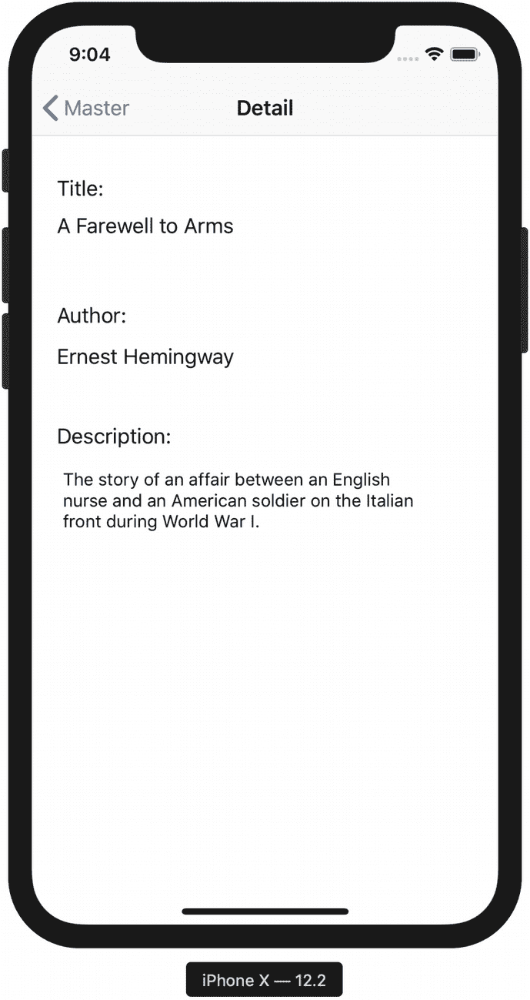

**图 8-15.** 首次查看图书详情

## 本章小结

你已经完成了本章的学习！以下是所涉及主题的总结：

- *理解集合类*：集合类是 Foundation 框架提供的一组强大的类，允许你高效地存储和检索信息。
- *使用属性*：属性是类实例化后可访问的变量。
- *使用 `for...in` 循环*：该特性提供了一种遍历枚举列表项的新方法。
- *构建主从应用*：你使用 Xcode 和主从应用模板构建了一个简单的图书商店程序，用于展示图书以及单本书的详细信息。
- *创建简单的数据模型*：利用你学到的集合类，你使用数组构建了一个 `BookStore` 对象，并将其用作 BookStore 应用中的数据源。
- *将数据连接到视图*：你使用 Xcode 将 `Book` 对象的数据连接到界面字段。

### 练习题

- 参考原始程序，向图书商店中添加更多图书。
- 在主场景中，移除“编辑”按钮，因为我们在本应用中不会用到它。
- 增强 `Book` 类，使其能够存储另一个属性——例如价格或类型。
- 修改 `DetailViewController`，以便显示新添加的字段。记得将界面控件连接到属性上。
- 修改 `BookStore` 对象，使其通过调用一个单独的方法来初始化 `Book` 对象列表（而不是将所有代码放在 `init` 方法中）。
- `UITableViewCell` 还有一个名为 `detailTextLabel` 的属性。尝试将其 `text` 属性设置为某些内容，以加以利用。
- 使用 Xcode 修改界面，在故事板文件中尝试更改 `DetailViewController` 的背景颜色。

更高难度的挑战：
- 对 `BookStore` 对象中的图书进行排序，使其在 `MasterDetailView` 上按升序显示。

