# 9. 比较数据

在本章中，我们将讨论编程时最基础、最频繁的操作之一：比较数据。在图书商店示例中，如果你的客户正在查找特定书籍，你可能需要比较书名。如果客户有兴趣购买特定作者的书，你可能还需要比较作者。比较数据是开发人员执行的常见任务。你在第 8 章学到的许多循环都需要你比较数据，以便知道代码何时应停止循环。

编程中的比较数据就像使用天平一样。一边是一个值，另一边是另一个值。中间是一个运算符。运算符决定了进行何种类型的比较。运算符的例子包括“大于”、“小于”或“等于”。

天平两边的值通常是变量。你在第 3 章中了解了不同类型的变量。通常，不同变量的比较函数会略有不同。熟悉比较数据的函数和语法至关重要，因为这将是你的开发基础。

就本章而言，我们将以图书商店应用为例。该应用将允许用户登录应用、搜索图书并购买。我们将介绍比较数据的不同方式，以展示它们在此类应用中如何使用。

## 重温布尔逻辑

在第 4 章中，我们介绍了布尔逻辑。由于它在编程中的普遍性，我们将在本章中再次探讨这个主题，并进行更详细的讨论。

你在编程应用时最常进行的比较就是使用布尔逻辑的比较。布尔逻辑通常以 *if/then* 语句的形式出现。布尔逻辑只能有两种答案之一：*是*或*否*。以下是一些你在应用中会使用的布尔问题的好例子：

- 5 是否大于 3？
- *now* 是否多于五个字母？
- 2010 年 6 月 1 日是否晚于今天？

注意，这些问题只有两种可能的答案：*是*和*否*。如果你提出的问题可能有超过这两种答案，那么为了编程，该问题需要以不同的方式措辞。

每个这些问题都将由一个 *if/then* 语句来表示。（例如，“如果 5 大于 3，则向用户打印一条消息。”）每个 *if* 语句都必须包含某种关系运算符。关系运算符可以是类似于“大于”或“等于”之类的。

要在你的程序中使用这类问题，你首先需要熟悉 Swift 语言中可用的不同关系运算符。我们将首先介绍它们。之后，你将学习不同的变量如何与这些运算符配合使用。


## 使用关系运算符

Swift 提供了六个标准比较运算符。这些是标准的代数运算符，只有一处真正的区别：与大多数其他编程语言一样，Swift 语言中，“等于”运算符由两个等号（`==`）组成。表 9-1 描述了可供开发人员使用的运算符。

**表 9-1.** 比较运算符

| 运算符 | 描述 |
| --- | --- |
| `>` | 大于 |
| `<` | 小于 |
| `>=` | 大于或等于 |
| `<=` | 小于或等于 |
| `==` | 等于 |
| `!=` | 不等于 |

### 注意

单个等号（`=`）用于给变量赋值。比较两个值则需要两个等号（`==`）。例如，`if(x=9)` 会尝试将值 9 赋值给变量 `x`，但现在 Xcode 在这种情况下会报错。`if(x==9)` 则会进行比较以判断 `x` 是否等于 9。

## 比较数字

开发人员面临的困难之一是在比较中处理不同的数据类型。本书前面讨论了不同的变量类型。你可能还记得 1 是一个整数。如果你想将整数与像 1.2 这样的浮点数进行比较，就会引发一些问题。这时，类型转换就派上用场了。

### 注意

类型转换是将一个对象或变量从一种类型转换为另一种类型。

在书店应用程序中，你需要以多种方式比较数字。例如，假设书店为单笔消费超过 30 美元的顾客提供折扣。你需要将顾客的总消费金额加起来，然后与 30 美元进行比较。如果消费金额大于 30 美元，就需要计算折扣。请看以下示例：

```
var discountThreshold = 30
var discountPercent = 0
var totalSpent = calculateTotalSpent()
if totalSpent > discountThreshold {
discountPercent = 10
}
```

我们来梳理一下这段代码。首先，你声明了变量（`discountThreshold`、`discountPercent` 和 `totalSpent`）并为其赋值。注意，你无需指定这些变量的数字类型。类型会在你为其赋值时被确定。你知道 `discountThreshold` 和 `discountPercent` 不会包含小数，因此编译器会将它们设定为 `Int` 类型。在这个例子中，可以假设有一个名为 `calculateTotalSpent` 的函数，它会计算当前订单的总消费额并以 `Int` 类型返回值。然后你只需检查总消费额是否大于折扣阈值；如果是，就设置折扣百分比。如果想让恰好消费 30 美元的顾客也享受同样的折扣，可以使用 `>=` 而不是 `>`。

另一个需要数字比较的操作是循环。正如第 4 章所讨论的，循环是开发中的核心操作，许多循环类型都需要某种比较来确定何时停止。让我们看一个 `for` 循环：

```
var numberOfBooks: Int = 50
for y in 0..<numberOfBooks {
doSomething()
}
```

在这个例子中，你遍历（或称*循环*）书店中书籍的总数。`for` 语句就是有趣的事情开始发生的地方。我们来分解一下。

`for` 循环声明了一个初始值为 0 的变量，并且只要该变量小于 `numberOfBooks`，它就会递增。相比于 Objective-C 中 for 循环的写法，这是一种快得多的方式。

## 创建示例 Xcode 应用

现在让我们创建一个 Xcode 应用程序，这样你就可以开始比较数值数据了。

1. 启动 Xcode 并选择 **File** ➤ **New** ➤ **Playground** 来创建一个新的 playground。本章将使用 playground，以便于你轻松实践比较操作。

2. 如图 9-1 所示，选择 **Blank**。点击 **Next**。

   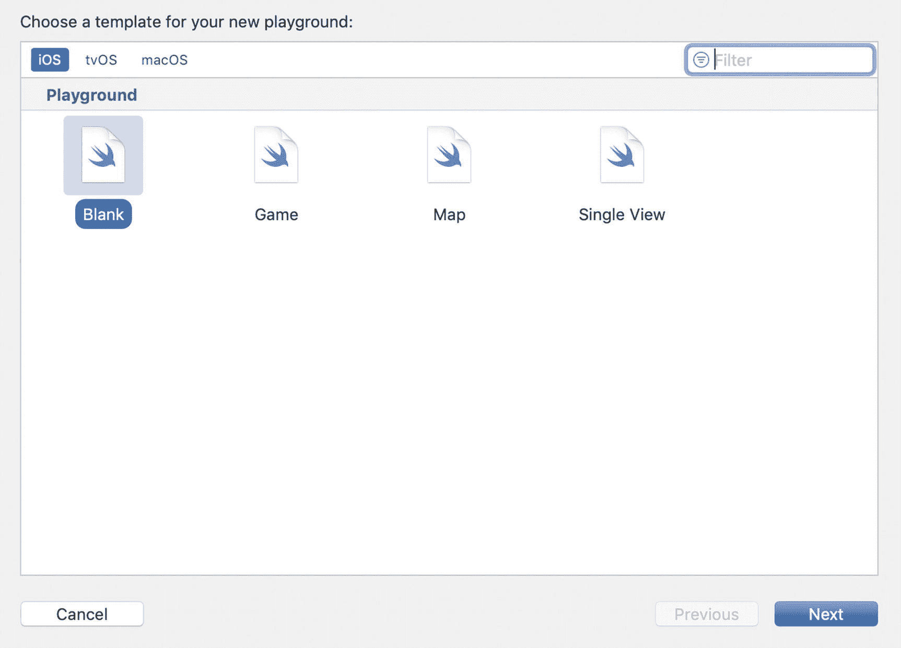

   **图 9-1.** 创建新的 playground

3. 在下一页，输入你的 playground 名称。这里我们使用了 **Comparison** 作为名称，但你可以选择任何你喜欢的名字。

   **注意：** Xcode Playgrounds 默认保存在用户主目录下的 `Documents` 文件夹中。

4. 新的 playground 创建完成后，你将看到标准的 Xcode 窗口。

5. 在 playground 的默认代码之后添加以下代码行：

   ```
   print("Hello World")
   ```

   这行代码创建了一个内容为 `Hello World` 的新 `String`，并将其传递给用于调试的 `print` 函数。

Xcode 会自动运行你添加的新代码行，并在右侧显示结果，如图 9-2 所示。

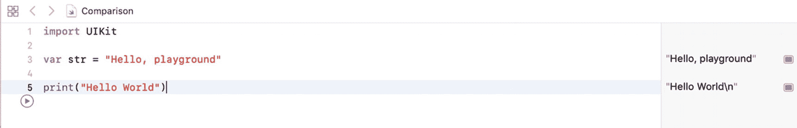

**图 9-2.** Playground 输出

6. 转到以 `print` 开头的代码行的开头。这一行负责打印 `Hello World` 字符串。你将通过在代码行前放置两个正斜杠（`//`）来注释掉这一行。注释代码是告诉 Xcode 在执行代码时忽略它。换句话说，被注释的代码将不会运行。

7. 一旦你注释掉这行代码，该代码将不再运行，因此 "Hello World" 将不再显示在 playground 中，如图 9-3 所示。

   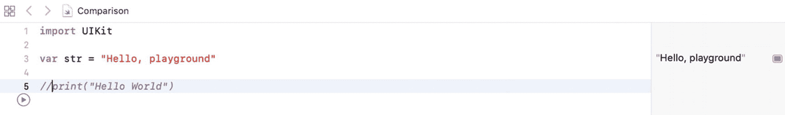

   **图 9-3.** 注释代码后的 Playground 输出

8. 我们想使用日志来输出比较结果。添加一行代码，如下所示：

   ```
   print("The result is \(6 > 5 ? "True" : "False")")
   ```

### 注意

上面的代码 `(6>5 ? "True" : "False")` 被称为*三元*运算。它本质上只是编写 `if/else` 语句的一种简化方式。

9. 将这行代码放入你的代码中。这行代码告诉你的应用程序打印 `The result is`。然后，如果 6 大于 5，它会打印 `True`；如果 5 大于 6，它会打印 `False`。见图 9-4。

因为 6 大于 5，所以会打印出 "The result is `True`。"

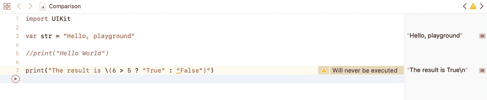

**图 9-4.** 三元输出

你可以修改这行代码，来测试我们在本章已经讨论过的任何比较，或者你稍后将执行的任何示例。

让我们试试另一个示例。

```
var i = 5
var y = 6
print("The result is \(y > i ? "True" : "False")")
```

在这个示例中，你创建了一个变量并将其值赋为 5。然后你创建了另一个变量并将其值赋为 6。接着你修改了 `print` 示例，使用变量 `i` 和 `y` 进行比较，而不是使用实际数字。

### 注意

在真实的 Xcode 项目中使用此代码时，你可能会收到编译器警告。编译器会告诉你三元运算符的 false 部分永远不会被执行。编译器在你输入代码时就能查看这些值，并知道该比较总会为 true。

你现在将探索其他类型的比较，然后你会回到这个应用程序并测试其中的一些。

## 使用布尔表达式

布尔表达式是所有比较中最简单的一种。布尔表达式用于确定一个值是 true 还是 false。示例如下：

```
var j = 5
if  j > 0 {
someCode()
}
```

`if` 语句的计算结果总是 `true`，因为变量 `j` 大于零。因此，程序会运行 `someCode()` 方法。


### 注意

在 Swift 中，如果变量是可选的，因此不能保证被赋值，你应该在变量声明后使用问号。例如，`var j` 变为 `var j: Int?`。

如果你将 `j` 的值改为 `0`，该语句将求值为 `false`，因为此时 `j` 为 `0`。

```swift
var j = 0
if j > 0 {
    someCode()
}
```

在布尔表达式前放置感叹号会将其值变为相反值（`false` 变为 `true`，`true` 变为 `false`）。

```swift
var j = 0
if !(j > 0) {
    someCode()
}
```

第二行现在询问“如果不满足 `j>0`”，在这种情况下，由于 `j` 等于 `0`，结果为 `true`。这是一个使用整数充当布尔变量的示例。如前所述，Swift 也有名为 `Bool` 的变量，它只有两个可能的值：`true` 或 `false`。

### 注意

与许多其他编程语言一样，Swift 在给布尔变量赋值时也使用 `true` 或 `false`。

让我们看一个与书店相关的示例。假设你有一个常客俱乐部，所有会员购书均可享受 15% 的折扣。这很容易检查。你只需将变量 `clubMember` 设置为 `true`（如果该人是会员），否则设置为 `false`。以下代码将仅为俱乐部会员应用折扣：

```swift
var discountPercent = 0
var clubMember = false
if clubMember {
    discountPercent = 15
}
```

### 比较字符串

对于大多数 C 语言来说，字符串是一种复杂的数据类型。在 ANSI C（或标准 C）中，字符串只是一个字符数组。Objective-C 进一步推动了字符串的发展，将其变为一个名为 `NSString` 的对象。Swift 则更进一步，使 `String` 类更易于使用。处理对象时，你可以使用更多的属性和方法。幸运的是，`String` 有许多用于比较数据的方法，这让你的工作更加轻松。

我们来看一个示例。这里，你在比较密码，以确定是否允许用户登录：

```swift
var enteredPassword = "Duck"
var myPassword = "duck"
var continueLogin = false
if enteredPassword == myPassword {
    continueLogin = true
}
```

第一行声明了一个 `String` 并将其值设置为 `Duck`。下一行声明了另一个 `String` 并将其值设置为 `duck`。在你的实际代码中，你需要从用户处获取 `enteredPassword` 字符串。

接下来是实际执行工作的代码部分。你只需比较这些字符串是否彼此相等。由于 `enteredPassword` 中的大写字母“D”与 `myPassword` 中的小写字母“d”不同，该示例代码的结果将始终为 `false`。

你可能还需要对字符串执行许多其他不同的比较。例如，你可能想检查某个字符串的长度。这很容易实现。

```swift
var enteredPassword = "Duck"
var myPassword = "duck"
var continueLogin = false
if enteredPassword.count > 5 {
    continueLogin = true
}
```

### 注意

`count` 是一个可用于计算字符串、数组和字典的属性。

此代码会检查输入的密码是否超过五个字符。

在其他情况下，你需要在字符串内搜索某些数据。幸运的是，Swift 让这变得简单。`String` 提供了一个名为 `contains` 的函数，它允许你在一个字符串中搜索另一个字符串。函数 `contains` 只接受一个参数，即你要搜索的字符串。

```swift
var searchTitle: String
var bookTitle: String
searchTitle = "Sea"
bookTitle = "2000 Leagues Under the Sea"
if bookTitle.contains(searchTitle) {
    addToResults()
}
```

此代码的起始部分与你见过的其他示例类似。我们创建了两个变量。然后，这个示例获取一个搜索词，并检查书名中是否包含该搜索词。如果包含，就将该书添加到结果中。这可以进行调整，以便用户搜索书名、作者甚至描述中的特定词汇。

有关 `String` 支持的方法的完整列表，请参阅 [`https://swift.org/documentation/#the-swift-programming-language`](https://swift.org/documentation/%2523the-swift-programming-language) 处的 Apple 文档。

## 使用 switch 语句

到目前为止，你已经看到了几个通过简单地使用 `if` 语句来比较数据的示例。

```swift
if someValue == SOME_CONSTANT {
    ...
} else if someValue == SOME_OTHER_CONSTANT {
    ...
} else if someValue == YET_SOME_OTHER_CONSTANT {
    ...
}
```

如果你需要将一个变量与多个常量值进行比较，可以使用另一种方法来简化比较代码：`switch` 语句。

### 注意

在 Objective-C 中，你只能在 `switch` 语句中使用值进行比较。Swift 允许开发者在 `switch` 语句的使用上拥有更多自由。使用 Swift，开发者现在可以比较大多数对象，包括自定义对象。

`switch` 语句允许你将一个或多个值与另一个变量进行比较。

```swift
var customerType = "Repeat"
switch customerType {     // switch 语句后面跟着一个左大括号
case "Repeat":           // 等同于 if (customerType == "Repeat")
    ...                  // 在 case 后面调用函数并放置其他语句。
    ...
case "New":
    ...
    ...
case "Seasonal":
    ...
    ...
default:                 // Swift 要求 switch 语句覆盖所有可能性。
}                        // switch 语句的结束处
```

`switch` 语句功能强大，它简化并精简了与多个不同值的比较过程。

在 Swift 中，`switch` 语句是一个强大的语句，可用于简化重复的 `if/else` 语句。


### 比较日期

在任何编程语言中，日期都是一种相当复杂的变量类型，而不幸的是，根据你编写的应用程序类型，它们又很常见。Swift 4 拥有自己的原生 `Date` 类型。Swift 的 `Date` 类提供了许多便捷的方法，使得比较日期变得简单。我们将重点介绍 `compare` 函数。`compare` 函数返回一个 `ComparisonResult`，它有三个可能的值：`orderedSame`、`orderedDescending` 和 `orderedAscending`。

```
// 今天的日期
let today: Date = Date()
// 促销日期 = 明天
let timeToAdd: TimeInterval = 60∗60∗24
let saleDate: Date = today.addingTimeInterval(timeToAdd)
var saleStarted = false
let result: ComparisonResult  = today.compare(saleDate)
switch result {
case ComparisonResult.orderedAscending:
// 促销日期在未来
saleStarted = false
case ComparisonResult.orderedDescending:
// 促销开始日期已过去，所以促销正在进行
saleStarted = true
default:
// 促销开始日期就是现在
saleStarted = true
}
```

仅仅为了比较一些日期，这看起来可能做了很多工作。让我们逐行分析代码，看看是否能理解它的含义。

```
let today: Date = Date()
let timeToAdd: TimeInterval = 60∗60∗24
let saleDate: Date = today.addingTimeInterval(timeToAdd)
```

在这里，你声明了两个不同的 `Date` 对象。第一个名为 `today`，使用系统日期或你的设备日期进行初始化。在创建第二个日期之前，你需要为第一个日期添加一些时间。通过创建一个 `TimeInterval` 来实现这一点。这是一个以秒为单位的数值。要增加一天，你需要添加 `60*60*24`。第二个日期名为 `saleDate`，使用未来的某个日期进行初始化。你将使用这个日期来判断促销是否已经开始。我们不会详细讨论 `Date` 对象的初始化。

使用 `Date` 对象的 `compare` 函数的结果是一个 `ComparisonResult`。你需要声明一个 `ComparisonResult` 来捕获 `compare` 函数的输出。

```
let result = today.compare(saleDate)
```

这一行简单地将两个日期进行比较，并将结果 `ComparisonResult` 放入名为 `result` 的常量中。

```
switch result {
case ComparisonResult.orderedAscending:
// 促销日期在未来
saleStarted = false
case ComparisonResult.orderedDescending:
// 促销开始日期已过去，所以促销正在进行
saleStarted = true
default:
// 促销开始日期就是现在
saleStarted = true
}
```

现在你需要查明变量 `result` 中的值是什么。为此，你执行一条 `switch` 语句，将结果与 `ComparisonResult` 的三种不同选项进行比较。第一行判断促销日期是否大于今天的日期。这意味着促销日期在未来，因此促销尚未开始。你将变量 `saleStarted` 设置为 `false`。下一行判断促销日期是否小于今天。如果是，则促销已开始，你将 `saleStarted` 变量设置为 `true`。下一行是 `default`。这捕获了所有其他选项。不过，你知道唯一的其他选项是 `orderedSame`。这意味着两个日期和时间相同，因此促销刚刚开始。

还有其他方法可以用于比较 `Date` 对象。每种方法在特定任务中效率更高。我们选择了 `compare` 方法，因为它能满足你大多数基本的日期比较需求。

### 注意

请记住，`Date` 既包含日期也包含时间。这会影响你的日期比较，因为它比较的不仅是日期，还有时间。

### 组合比较

如同第 4 章所讨论的，有时你需要比单一比较更复杂的条件。这时逻辑运算符就派上了用场。逻辑运算符允许你检查多个条件。例如，如果你为既是读书俱乐部会员*且*消费超过 30 美元的人提供特别折扣，你可以编写一条语句来检查。

```
var totalSpent = 31
var discountThreshhold = 30
var discountPercent = 0
var clubMember = true
if totalSpent > discountThreshhold && clubMember {
discountPercent = 15
}
```

我们组合了前面展示的两个示例。新的比较行解读如下：“如果 `totalSpent` 大于 `discountThreshold` **且** `clubMember` 为 `true`，则将 `discountPercent` 设置为 15。”要使此条件返回 `true`，两个条件都必须为真。你可以使用 `||` 替代 `&&` 来表示“或”。你可以将上一行代码改为：

```
if totalSpent > discountThreshhold || clubMember  {
discountPercent = 15
}
```

现在这一行解读如下：“如果 `totalSpent` 大于 `discountThreshold` ***或*** `clubMember` 为 `true`，则将折扣百分比设置为 15。”如果任一选项为 `true`，此条件将返回 `true`。

你可以继续使用逻辑运算符，根据需要组合任意多个比较。在某些情况下，你可能需要使用括号对比较进行分组。

## 总结

本章到此结束！以下是涵盖主题的总结：

*   *比较*：比较数据是任何应用程序中不可或缺的一部分。
*   *关系运算符*：你了解了六种标准关系运算符及其用法。
*   *数字*：数字是最容易比较的信息类型。你学习了如何在程序中比较数字。
*   *示例*：你创建了一个示例 playground，可以在其中测试你的比较并确保逻辑正确。然后你学习了如何修改 playground 以添加不同类型的比较。
*   *布尔值*：你学习了如何检查布尔值。
*   *字符串*：你了解了字符串与之前测试的其他信息类型的行为有何不同。
*   *日期*：你了解到比较日期可能相当困难，并且必须小心以确保得到你所期望的结果。

### 练习

*   修改示例 playground，比较一些字符串信息。
*   编写一个 Swift 应用程序，判断以下年份是否为闰年：1800、1801、1899、1900、2000、2001、2003 和 2010。输出应按照以下格式写入控制台：`公元 2000 年是闰年` 或 `公元 2001 年不是闰年`。判断年份是否为闰年的信息，请参见 [`http://en.wikipedia.org/wiki/Leap_year`](http://en.wikipedia.org/wiki/Leap_year)。

### 创建用户界面

Interface Builder 使 iOS 开发者能够使用强大的图形用户界面轻松创建其用户界面。它允许通过简单地将对象从 Interface Builder 的库中拖拽到编辑器来构建用户界面。

Interface Builder 将你的用户界面设计存储在一个或多个资源文件中，这些文件称为故事板。这些资源文件包含界面对象、它们的属性以及它们之间的关系。

要构建用户界面，只需将对象从 Interface Builder 的对象库面板拖拽到你的视图或场景上。动作（Actions）和出口（Outlets）是 Interface Builder 的两个关键组件，有助于简化开发流程。

你的对象会在视图中触发动作，而这些动作连接到应用代码中的方法。出口在你的 `.swift` 文件中声明，并作为属性连接到特定的控件。见图 10-1。

### 注意

Interface Builder 曾经是一个独立的应用程序，开发者用来设计他们的用户界面。从 Xcode 4.0 开始，Interface Builder 已集成到 Xcode 中。

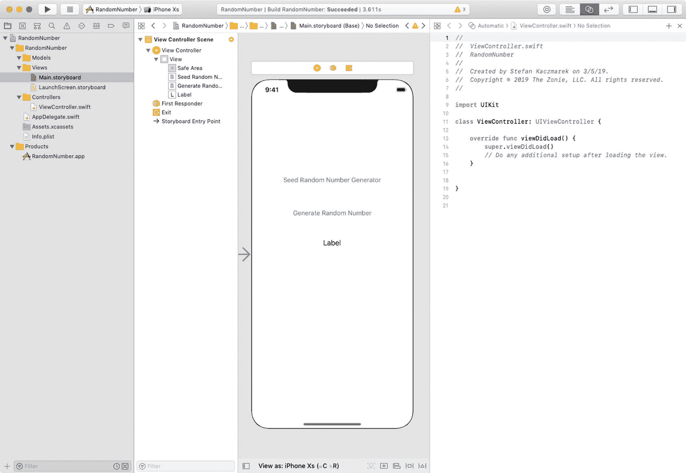

图 10-1. Interface Builder


## 理解 Interface Builder

Interface Builder 将用户界面文件保存为一个包，其中包含应用中使用的界面对象和关系。这些包最初的文件扩展名为 `".nib"`。Interface Builder 3.0 版本采用了一种新的 XML 文件格式，文件扩展名也随之变为 `".xib"`。然而，开发者们仍然称这些文件为 *nib* 文件。后来 Apple 引入了故事板（storyboards）。故事板使您可以将所有视图放在一个扩展名为 `".storyboard"` 的文件中。

与大多数其他图形用户界面应用程序不同，XIB 和故事板常被称为*冻干*文件，因为它们包含已归档的对象本身，并且已准备好运行。

这种 XML 文件格式便于与版本控制系统（如 Subversion 和 Git）配合进行存储。

在下一节中，我们将讨论一种名为“模型-视图-控制器”的应用设计模式。这种设计模式使开发者能够更轻松地维护代码，并在应用的整个生命周期中重用对象。

## 模型-视图-控制器模式

模型-视图-控制器（MVC）是在 iOS 开发中最流行的架构模式，学习它将会让您的开发者生涯轻松得多。

架构模式描述了开发者可以在其代码中使用的、针对软件设计问题的解决方案。MVC 模式并非 iOS 开发者独有；许多集成开发环境（IDE）的制造商都在采用它，包括那些运行在 Windows 和 Linux 平台上的 IDE。

对于企业而言，软件开发被认为是一项昂贵且充满风险的投资。通常情况下，应用开发所花费的时间超出预期、预算超支，并且无法按承诺运行。面向对象编程（OOP）曾引起大量炒作，并给人们留下一种印象：只要采用其方法论，公司就能节省成本，这主要是因为对象的可重用性和代码更易于维护。但起初，这种情况并未发生。

当工程师们审视 OOP 为何未能达到这些预期时，他们发现了开发者在设计对象方面的一个关键缺陷：开发者经常将对象混在一起，导致随着应用程序的成熟、代码迁移到不同平台或硬件显示发生变化，代码变得难以维护。

对象的设计往往会导致以下任何一项发生变化时，很难隔离受到影响的对象：

*   业务规则
*   用户界面
*   客户端-服务器或基于互联网的通信

对象可以被分解为三个与任务相关的类别。开发者的责任是确保每个类别都能使其对象不越界到其他类别。

随着对象被归入这些类别，应用程序可以随着时间的推移更容易地被开发和维护。以下是一个 iPhone 银行应用程序中的对象及其关联的 MVC 类别示例：

**模型**

*   账户余额
*   用户加密
*   账户转账
*   账户登录

**视图**

*   账户余额表格单元格
*   账户登录转圈控件

**控制器**

*   账户余额视图控制器
*   账户转账视图控制器
*   登录视图控制器

在 MVC 设计模式中，记住并对对象进行分类的最简单方法如下：

*   *模型*：代表现实世界的独特业务或应用规则及代码。数据驻留于此。
*   *视图*：独特的用户界面代码。
*   *控制器*：任何控制模型或视图对象或与之通信的东西。

图 10-2 展示了 MVC 范式。

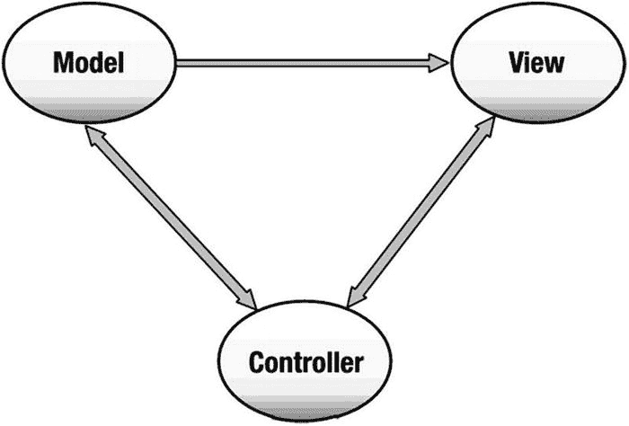

图 10-2. MVC 范式

无论是 `Xcode` 还是 `Interface Builder`，都不会强制开发者使用 MVC 设计模式。是否以这种方式组织对象以采用此设计模式，完全取决于开发者。

值得一提的是，Apple 非常推崇 MVC 设计模式，其所有框架都旨在 MVC 环境下工作。这意味着，如果您也采用 MVC 设计模式，使用 Apple 的类将会容易得多。如果您不这样做，那您就是在逆水行舟。

## 人机界面指南

在您过于兴奋并开始为您的应用设计动态用户界面之前，您需要了解一些基本规则。Apple 通过 iOS 开发出了世界上最先进的操作系统之一。此外，Apple 的产品以其直观和用户友好而闻名。Apple 希望用户在不同的应用之间拥有同样的体验。

为了确保一致的用户体验，Apple 为开发者提供了关于应用外观和感觉的指南。这套指南称为“人机界面指南”（HIG），适用于 iOS、macOS、watchOS 和 tvOS。您可以在 `https://developer.apple.com/design/human-interface-guidelines/` 查看这些指南，如图 10-3 所示。

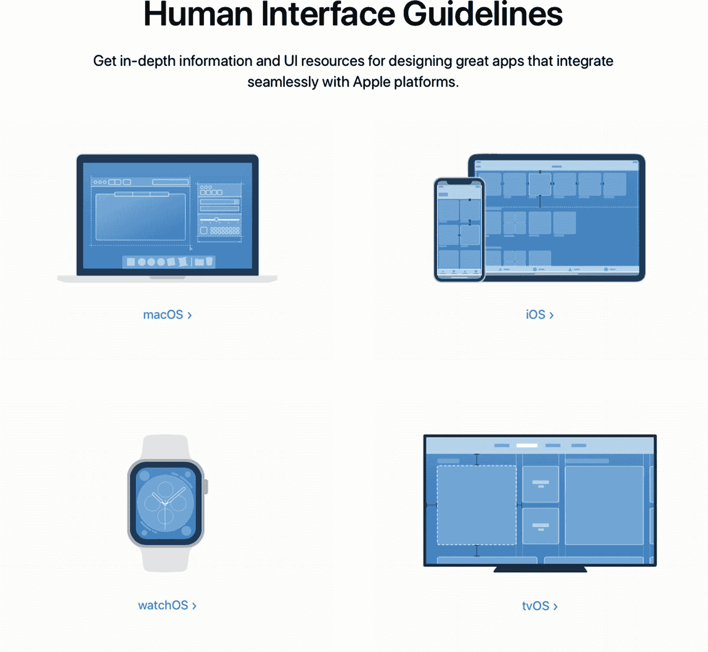

图 10-3. Apple 的人机界面指南

### 注意

Apple 的 HIG 不仅仅是建议或提议。Apple 对此非常重视。虽然 HIG 没有描述如何在代码中实现您的用户界面设计，但它对于理解实现视图和控件的正确方法非常有帮助。

以下是一些导致应用在 Apple App Store 被拒绝的主要原因：

*   应用崩溃。
*   应用违反了 HIG。
*   应用使用了 Apple 的私有 API。
*   应用的功能与 App Store 上宣传的不符。

### 注意

您可以在开发应用之前阅读、学习并遵循 HIG；也可以在应用被 Apple 拒绝后，不得不重写部分或全部代码时，再阅读、学习并遵循 HIG。无论哪种方式，所有 iOS 开发者最终都会熟悉 HIG。

许多新的 iOS 开发者是通过惨痛教训才认识到这一点的，但如果您从一开始就遵循 HIG，您的 iOS 开发体验将会愉快得多。


## 使用 Interface Builder 创建示例 iPhone 应用

让我们开始构建一个生成并显示随机数的 iPhone 应用，如图 10-4 所示。该应用与你之前在第四章中创建的应用类似，但你会看到，在添加了 iOS 用户界面（UI）后，这个应用变得有趣多了。

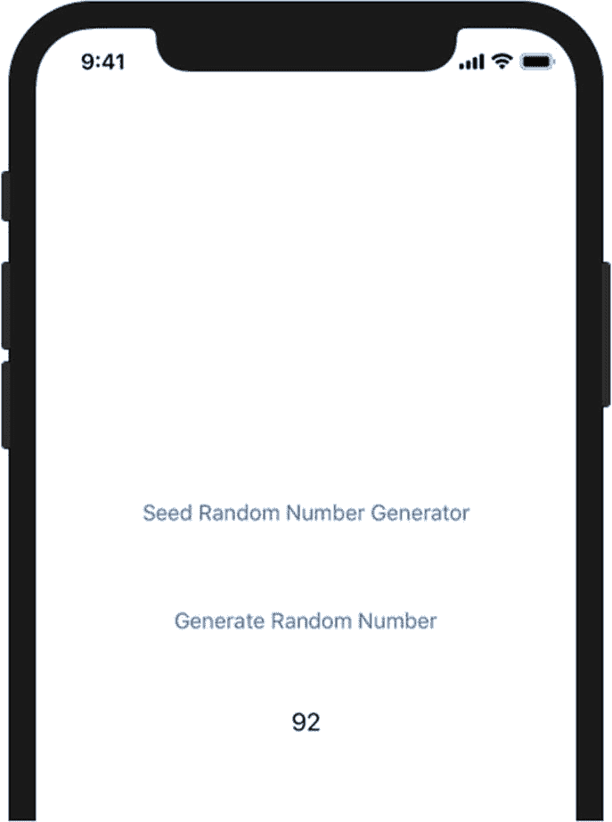

图 10-4. 完成的 iOS 随机数生成器应用

1.  打开 Xcode，选择“Create a new Xcode project”。确保你选择了 **iOS** 下的“Single View App”，然后点击“Next”，如图 10-5 所示。

    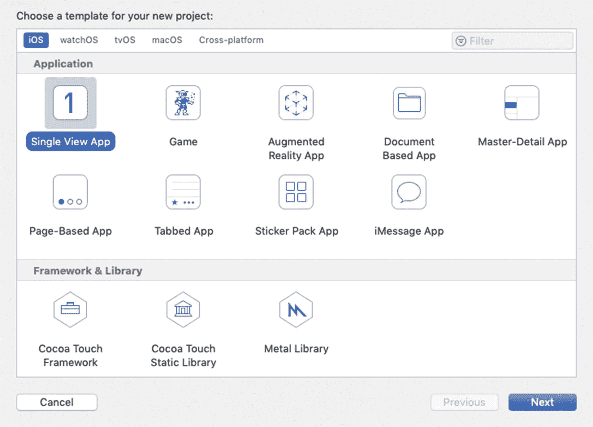

    图 10-5. 基于 Single View App 模板创建 iPhone 应用

2.  将你的项目命名为 `RandomNumber`，语言选择 **Swift**，然后点击“Next”创建项目，如图 10-6 所示。

    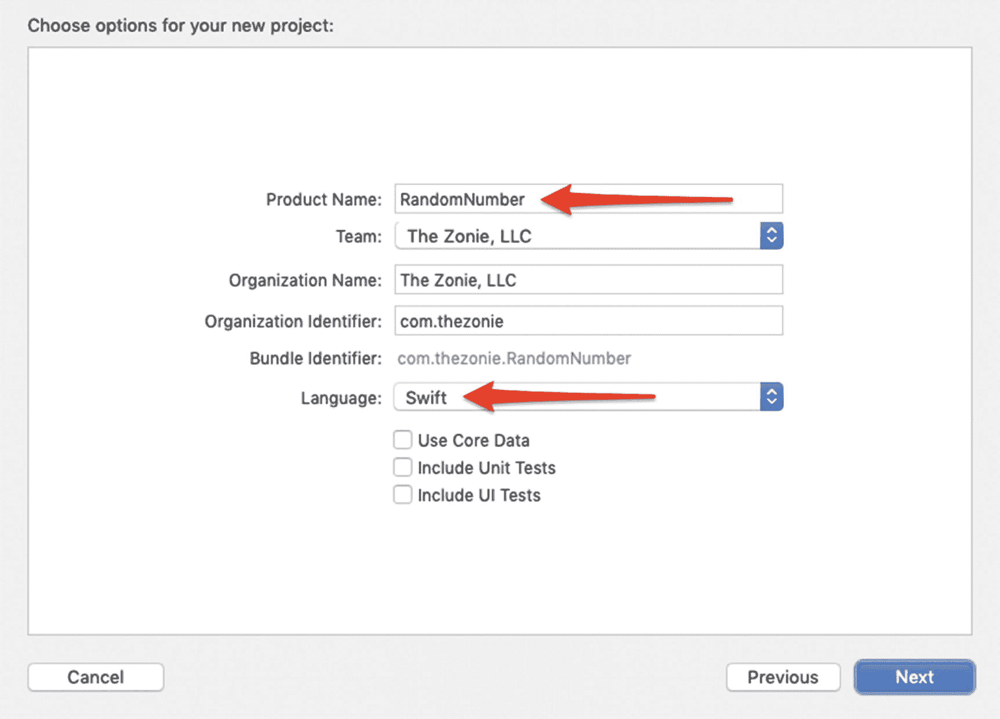

    图 10-6. 命名你的新 Swift 项目

3.  你的项目文件和设置将被创建并显示出来，如图 10-7 所示。

    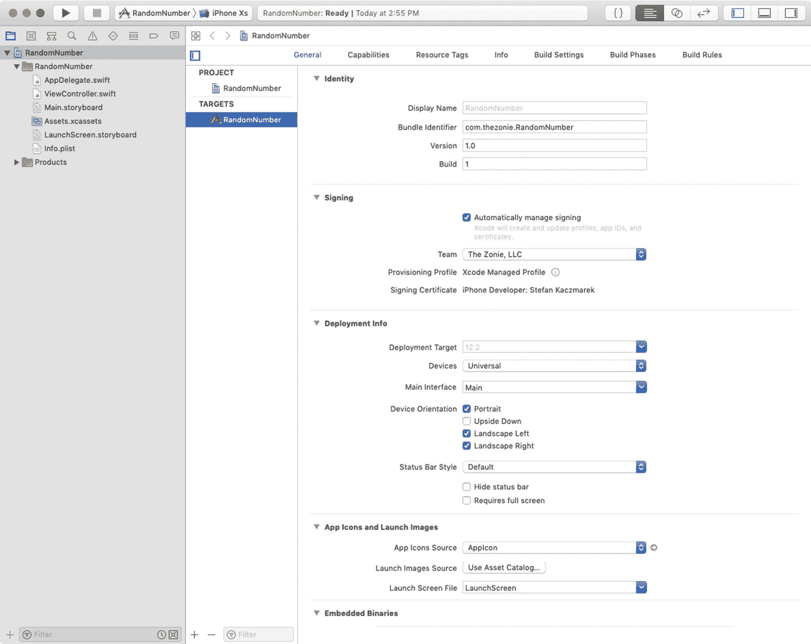

    图 10-7. 源文件

尽管这个项目中只有一个控制器，但在开发初期就创建好你的 MVC 分组仍是一个良好的编程实践。这有助于提醒你遵循 MVC 范式，避免将所有代码不必要地塞进你的控制器中。

1.  右键点击 `RandomNumber` 文件夹，然后选择“New Group”，如图 10-8 所示。

    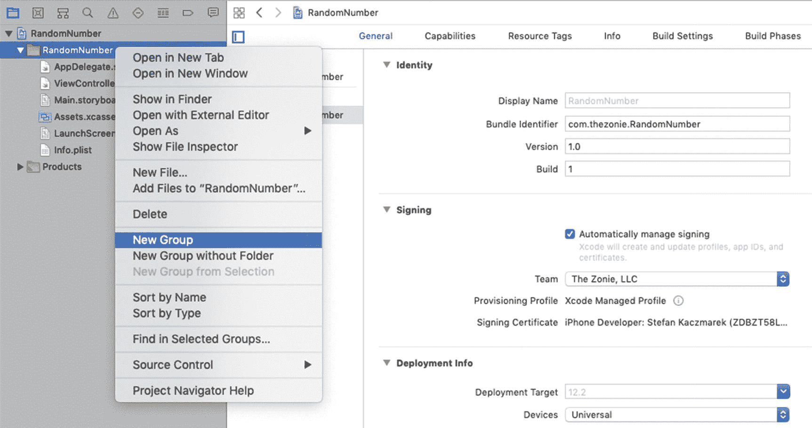

    图 10-8. 创建新分组

2.  创建一个 Models 分组、一个 Views 分组和一个 Controllers 分组。

3.  将 `ViewController.swift` 文件拖到 Controllers 分组。将 `Main.storyboard` 和 `LaunchScreen.storyboard` 文件拖到 Views 分组。拥有这些分组有助于在开发代码时提醒你遵循 MVC 设计模式，并防止你将所有代码都放在控制器中，如图 10-9 所示。

    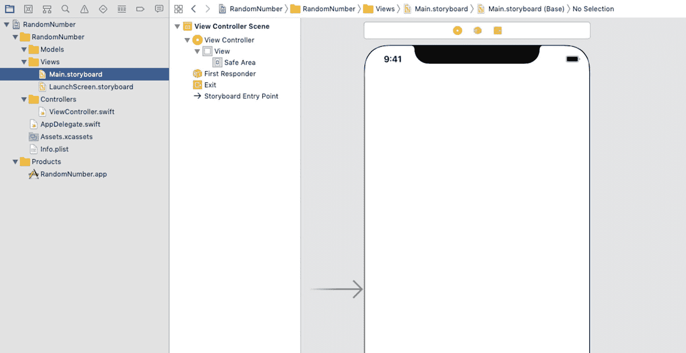

    图 10-9. 已整理好控制器和故事板文件的 MVC 分组

4.  点击 `Main.storyboard` 文件以打开 Interface Builder。

## 使用 Interface Builder

启动 Interface Builder 并开始处理视图的最常见方法是点击相关联的故事板文件，如图 10-10 所示。

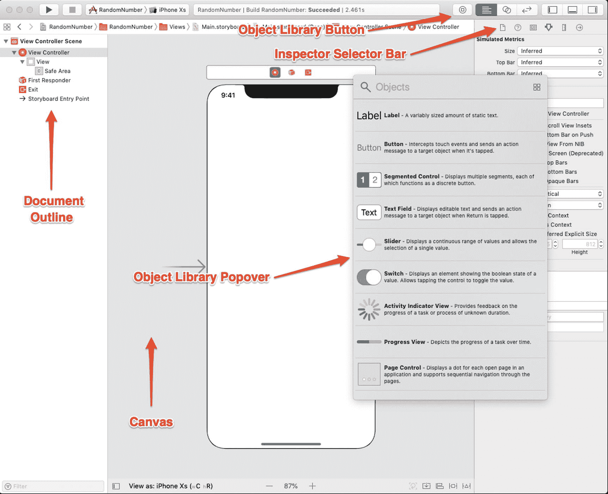

图 10-10. 工作区窗口中的 Interface Builder

当 Interface Builder 打开时，你可以看到画布上显示的场景。现在你可以设计你的用户界面了。首先，你需要了解 Interface Builder 中的一些子窗口。

## 文档大纲

故事板显示了视图包含的所有对象。以下是这些对象的一些示例：

*   按钮
*   标签
*   文本字段
*   Web 视图
*   地图视图
*   选择器视图
*   表格视图

### 注意

你可以展开文档大纲的宽度，以查看所有对象的详细列表，如图 10-10 所示。为了给画布腾出更多空间，你可以缩小或隐藏文件导航器。

## 对象库

对象库是你发挥创造力的地方。它是一个对象的大杂烩，你可以将这些对象拖放到视图中。

*   点击对象库按钮会显示“对象库弹出窗口”。通过调整弹出窗口的大小，对象库弹出窗口可以放大或缩小，如图 10-11 所示。

    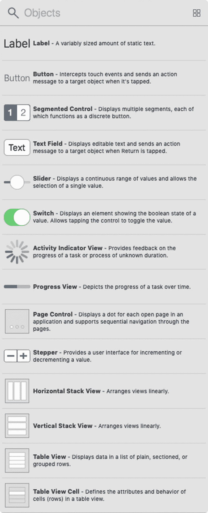

    图 10-11. 展开对象库弹出窗口以查看更多控件

点击图 10-12 中的“图标视图”按钮，可以让你以更紧凑的方式查看对象库的内容，如图 10-13 所示。

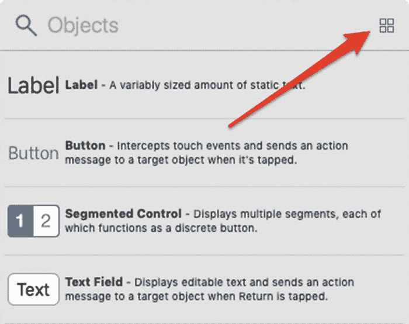

图 10-12. 对象库图标视图按钮

对于 Cocoa Touch 对象，库中包含以下内容：

*   控件
*   数据视图
*   手势识别器
*   对象和控制器
*   窗口和栏

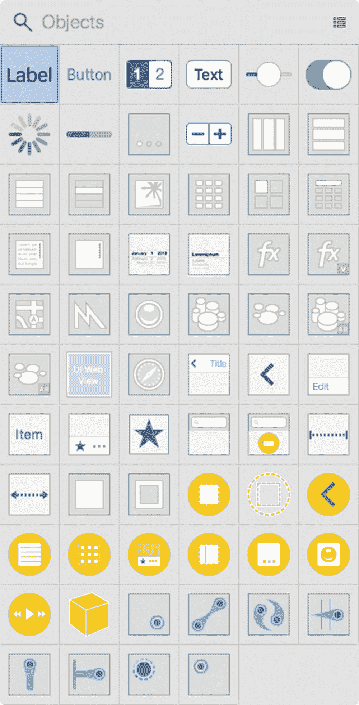

图 10-13. 对象库中的各种 Cocoa Touch 对象

## 检查器面板和选择器栏

检查器面板允许你更改控件的属性，使你的对象听从你的指令。检查器面板顶部有六个标签，如图 10-14 所示：

*   文件检查器
*   快速帮助检查器
*   标识检查器
*   属性检查器
*   大小检查器
*   连接检查器

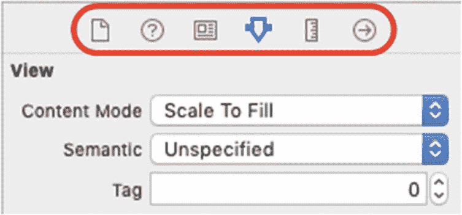

图 10-14. 属性检查器和选择器栏

## 创建视图

随机数生成器的视图中将包含三个对象：一个标签和两个按钮。一个按钮用于生成种子，另一个按钮用于生成随机数，标签则用于显示应用生成的随机数。

1.  在对象库中滚动，将两个按钮（Button）和一个标签（Label）拖到视图控制器场景中，如图 10-15 所示。

    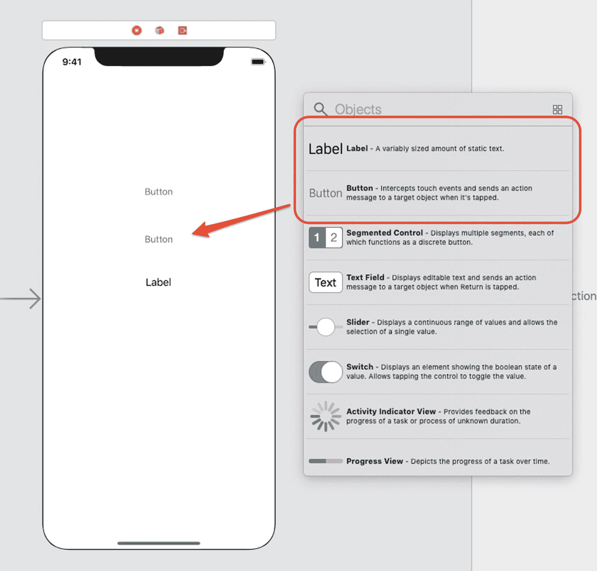

    图 10-15. 在视图中放置对象

2.  双击第一个按钮，将其标题改为 "Seed Random Number Generator"，然后双击第二个按钮，将其标题改为 "Generate Random Number"，如图 10-16 所示。

    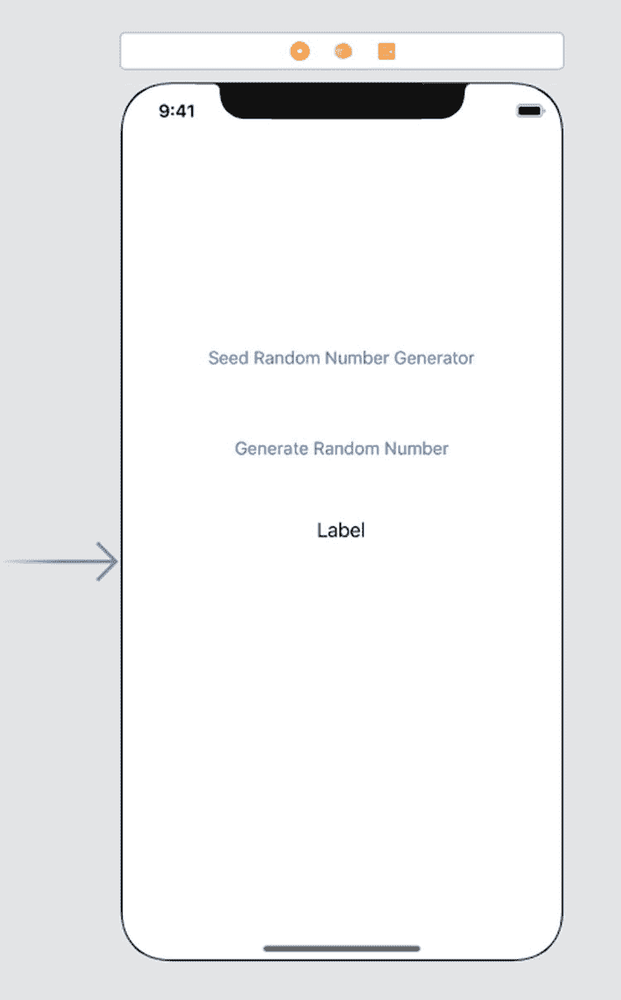

    图 10-16. 重命名按钮标题

现在，你将用到 Xcode 的一个强大功能。你可以快速轻松地将你的输出口（outlet）和动作（action）连接到代码。实际上，Xcode 更进一步；它会为你创建部分代码。你只需拖放即可。

1.  点击屏幕右上角的“助理编辑器”图标。这将显示故事板中选定视图关联的 `.swift` 文件，如图 10-17 所示。

### 注意

如果点击助理编辑器图标后没有显示正确的关联 `.swift` 文件，请确保你已经选中并高亮了该视图。同时，必须在助理编辑器的跳转栏中选择“Automatic”。

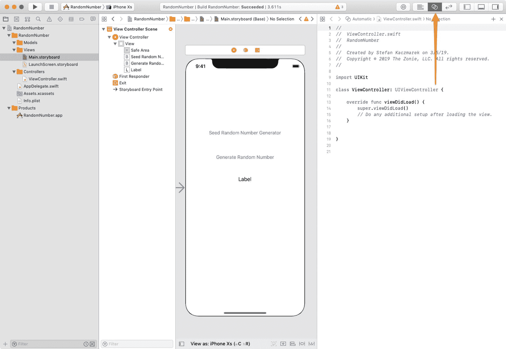

图 10-17. 使用助理编辑器显示 `.swift` 文件


### 使用 Outlet

现在，你可以通过创建 Outlet 将标签连接到代码。

1.  按住 Control 键，从视图中的标签拖拽到类文件的顶部，如图 10-18 所示。这是在键盘上按住 Control 键的同时，用鼠标点击并拖拽。你也可以右键点击并拖拽。

    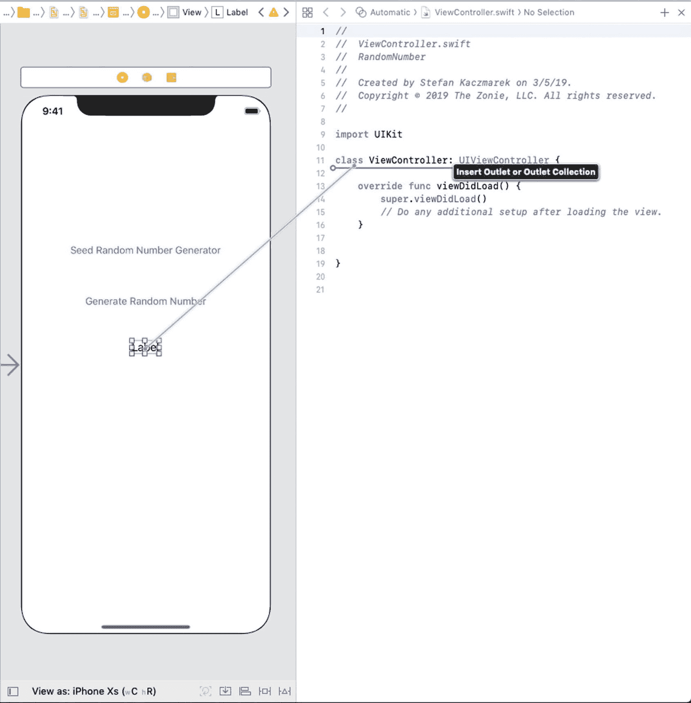

    **图 10-18.** Control-拖拽以创建 Outlet

2.  将会弹出一个窗口，让你可以命名并指定 Outlet 的类型。

3.  将 Outlet 命名为 `randomNumberLabel`，如图 10-19 所示，然后点击 **Connect** 按钮。

    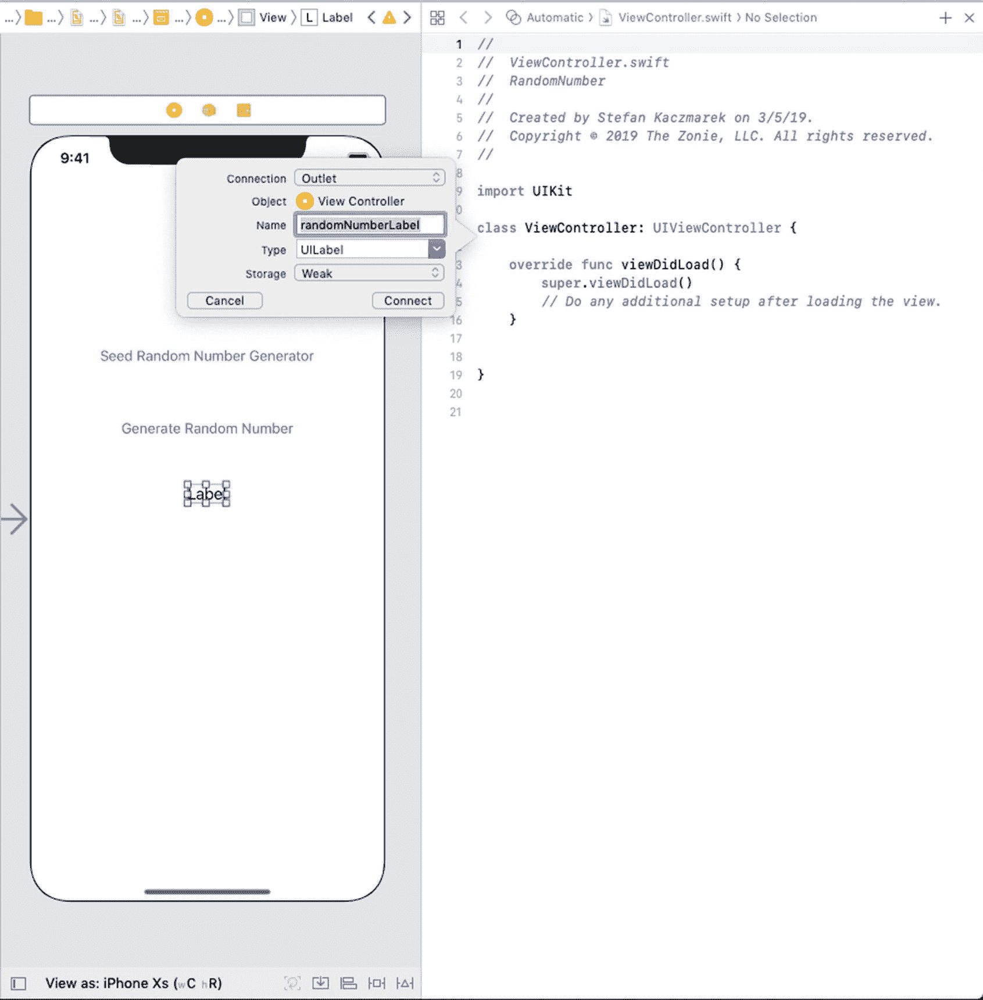

    **图 10-19.** `randomNumberLabel` Outlet 的弹出窗口

Outlet 的代码已创建，并且该 Outlet 现在已连接到 `Main.storyboard` 文件中的 `Label` 对象。第 12 行旁边的阴影圆圈表示该 Outlet 已连接到 `Main.storyboard` 文件中的一个对象，如图 10-20 所示。

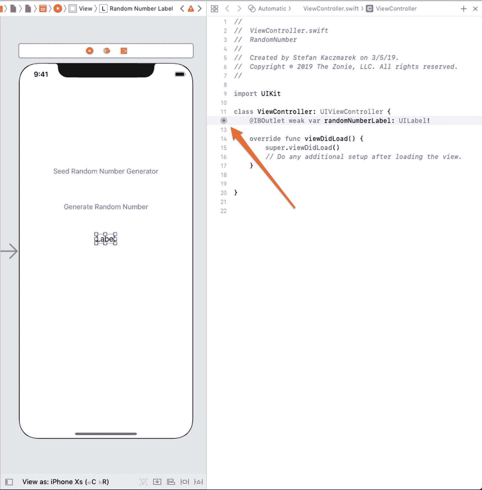

**图 10-20.** 已生成并连接到 `Label` 对象的 Outlet 属性代码

这里有一个你可能不熟悉的声明叫做 `IBOutlet`，通常简称为 *outlet*。Outlet 向你的控制器表明，该属性已连接到 Interface Builder 中的一个对象。`IBOutlet` 将使 Interface Builder 能够看到该 Outlet，并允许你将属性连接到 Interface Builder 中的对象。

借用墙上电源插座的类比，这些属性 Outlet 连接到对象上。使用 Interface Builder，你可以将这些属性连接到合适的对象。当你更改已连接 Outlet 的属性时，它所连接的对象将自动发生改变。

### 使用 Action

用户界面对象事件，也称为 *action*，可以触发方法。

现在，你需要将对象操作连接到按钮上。

1.  按住 Control 键，从“种子随机数生成器”按钮拖拽到类文件的底部。按照图 10-21 所示完成弹出窗口的填写，然后点击 **Connect** 按钮。确保连接类型是 Action，而不是 Outlet。

    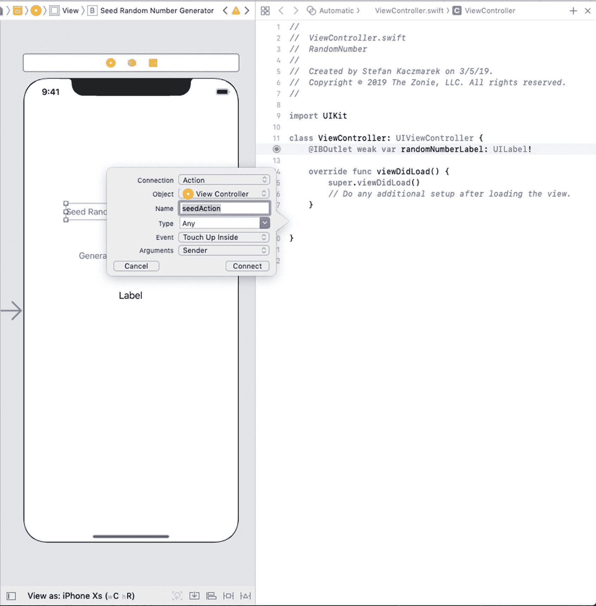

    **图 10-21.** 完成种子方法的弹出窗口

2.  对“生成随机数”按钮重复上述步骤，在 `ViewController` 类中创建一个 `generateAction` 方法。

### 类

剩下的工作就是为控制器的 `.swift` 文件中的 Outlet 和 Action 补全代码。

打开 `ViewController.swift` 文件，补全 `seedAction` 和 `generateAction` 方法，如图 10-22 所示。

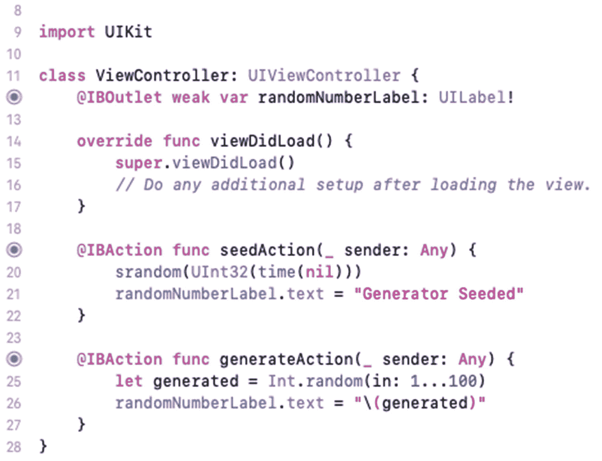

**图 10-22.** 补全后的 `seedAction` 和 `generateAction` 方法

有些代码需要你进一步研究。下面这行为随机数生成器设定了种子，这样每次运行应用程序时都能获得一个随机数。虽然有更简单的方法，但就本节而言，你只需要了解 Action 和 Outlet 是如何工作的。

```
srandom(UInt32(time(nil)))
```

在下面的代码中，属性 `text` 设置了视图中的 `UILabel` 值。你在 Interface Builder 中从 Outlet 到 `Label` 对象建立的连接替你完成了所有工作。

```
randomNumberLabel.text
```

现在只需要再做几件事就能完成你的应用程序了。选择 `Main.storyboard` 文件，然后选择你的视图控制器场景。点击并拖拽鼠标，选中视图中的两个按钮和标签，如图 10-23 所示。然后点击 **Embed In** 按钮，选择 **Stack View**，将这三个元素组合在一起。

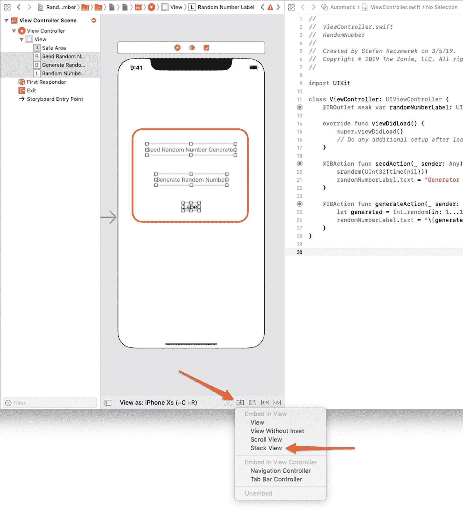

**图 10-23.** 嵌入 Stack View

最后，选择该栈视图，点击 **Align** 按钮，勾选 **Horizontally in Container** 和 **Vertically in Container** 两个复选框，然后点击 **Add 2 Constraints** 按钮，如图 10-24 所示。这将使你的控件在视图中正确居中。

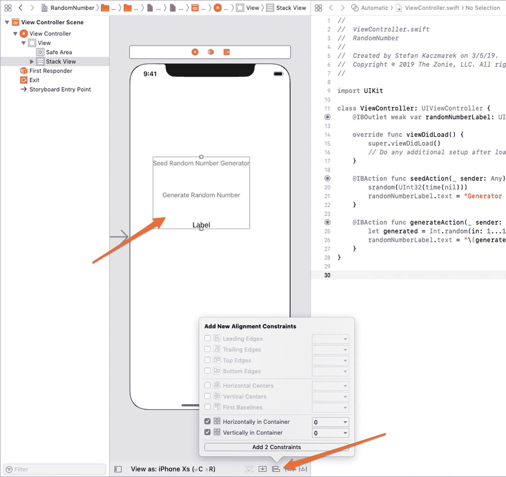

**图 10-24.** 居中 Stack View

大功告成！

要在 iPhone 模拟器中运行你的 iPhone 应用，请点击 **Play** 按钮。你的应用应该会在模拟器中启动，如图 10-25 所示。

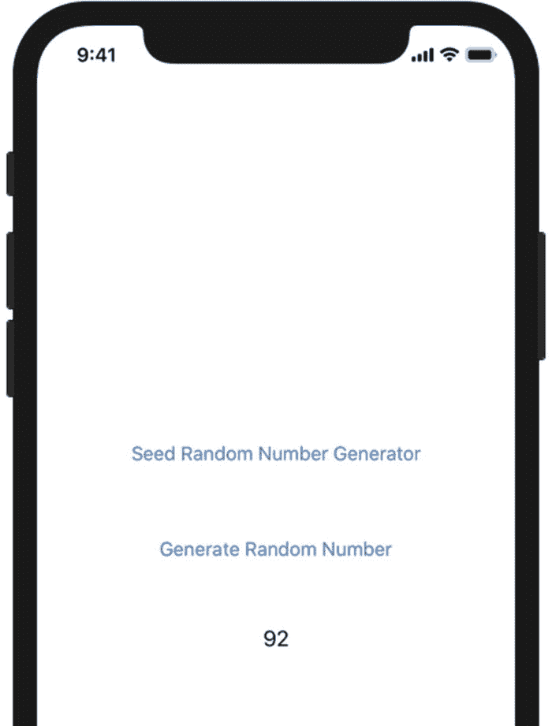

**图 10-25.** 在 iOS 模拟器中运行的完整随机数生成器应用

要生成随机数，请点击 **Generate Random Number** 按钮。

## 总结

干得好！Interface Builder 在创建用户界面时为你节省了大量时间。你的应用程序中拥有了一套强大的对象可供使用，并且只需要编写极少的代码。

Interface Builder 处理了许多通常需要你自己处理的细节。

你应该熟悉以下术语：

*   Storyboard 和 XIB 文件
*   模型-视图-控制器
*   架构模式
*   人机界面指南 (HIG)
*   Outlet
*   Action

### 练习

*   扩展随机数生成器应用，使其在应用启动时在 `Label` 对象中显示日期和时间。
*   在显示日期和时间标签后，添加一个按钮，用于用新时间更新日期和时间标签。

