# 11. 存储信息

作为一名开发者，你会遇到许多需要存储数据的不同场景。用户会期望你的应用在每次启动时记住偏好设置和其他信息。之前的章节讨论了 `BookStore` 应用。对于这个应用，用户会期望你的应用记住书店里的所有书籍。你的应用需要一种方法来存储这些信息、检索它们，并可能对这些数据进行搜索和排序。处理数据有时可能会很困难。幸运的是，Apple 提供了让这个过程更简便的方法和框架。

本章讨论需要存储数据的两种不同格式。它讨论了如何为 iOS 设备保存偏好文件，以及如何在你的应用程序中使用 SQLite 数据库来存储和检索数据。


## 存储注意事项

Mac 和 iPhone 在存储方面存在一些主要差异，这些差异会影响你处理数据的方式。我们首先讨论 Mac 以及你需要如何为其进行开发。

在 Mac 上，默认情况下，应用程序存储在 `Applications` 文件夹中。每个用户都有自己的个人文件夹，用于存储与该用户相关的偏好设置和信息。并非所有用户都有权限写入 `Applications` 文件夹或应用程序包本身。

在 iPhone 和 iPad 上，开发者无需处理不同用户的问题。每个使用 iPhone 的人都拥有相同的权限和相同的文件夹。不过，iPhone 还有其他一些因素需要考虑。iOS 设备上的每个应用程序都位于自己的沙盒中。这意味着一个应用写入的文件只能被该应用本身查看和使用。这为 iPhone、iPad、Apple TV 和 Apple Watch 提供了更安全的环境，但也带来了处理数据存储方式的某些变化。

### 警告

敏感数据不应在未进行额外加密的情况下存储在偏好设置文件或数据库中。幸运的是，Apple 提供了一种存储敏感信息的方法，称为钥匙串。在钥匙串中保护数据超出了本书的讨论范围。

### 说明

对于 macOS，偏好设置文件名为 `com.yourcompany.applicationname.plist`，位于 `/Users/username/Library/Preferences` 文件夹中。在 iOS 上，偏好设置文件位于应用程序容器内的 `/Library/Preferences` 文件夹中。

要写入偏好设置，你需要创建一个 `UserDefaults` 对象。这通过以下代码行完成：

```
var prefs: UserDefaults = UserDefaults.standard
```

这会实例化 `prefs` 对象，以便你使用它来设置偏好值。接下来，你需要为要保存的值设置偏好键。本章将使用 `BookStore` 应用示例来演示具体说明。在经营书店时，你可能希望将用户名保存在偏好设置中。你还可能希望保存诸如默认图书类别或最近搜索之类的信息。偏好设置文件是存储这类信息的绝佳位置，因为这类信息只需要在应用程序启动时读取。

此外，在 iOS 上，通常需要保存当前状态。如果某人正在使用你的应用，然后接到一个电话，你希望能在他们通话结束后，将他们带回应用中之前所处的确切位置。随着多任务处理的实现，这已经不那么必要了，但如果你的应用能记住他们上次在使用时正在做什么，用户仍然会对此表示赞赏。

一旦你实例化了对象，就可以调用 `set(_:forKey:)` 来设置一个对象。如果你想要保存用户名 `sherlock.holmes`，你可以调用以下代码行：

```
prefs.set("sherlock.holmes", forKey: "username")
```

过一段时间后，你的应用会自动将更改写入偏好设置文件。你可以通过调用 `synchronize` 函数来强制应用保存偏好设置，但这仅在你无法等待下一个同步间隔时使用，例如你的应用即将退出时。要调用 `synchronize` 函数，你可以编写以下代码行：

```
prefs.synchronize()
```

只需三行代码，你就能创建一个偏好对象，设置一个偏好值，并写入偏好设置文件。这是一个简单且干净的过程。以下是所有代码：

```
let prefs: UserDefaults = UserDefaults.standard
prefs.set("sherlock.holmes", forKey: "username")
prefs.set(10, forKey: "booksInList")
prefs.synchronize()
```

## 数据库

你已经学会了如何存储一些零散信息并在之后检索它们。如果你有更多需要存储的信息怎么办？如果你需要在这些信息中进行搜索或对其进行某种排序怎么办？这类情况就需要使用数据库。

数据库是一种以易于搜索或检索的方式存储大量信息的工具。从数据库读取数据时，返回的是数据片段，而不是整个文件。你日常生活中使用的许多应用程序都基于某种数据库。你的网上银行应用从数据库中检索你的账户活动。你的超市使用数据库来检索不同商品的价格。数据库的一个简单示例是电子表格。你的电子表格中可能有很多列和很多行。电子表格中的列代表你要存储的不同类型的信息。在数据库中，这些被视为属性。电子表格中的行则被视为数据库中的不同记录。

## 在数据库中存储信息

数据库对开发者来说通常是一个令人生畏的主题；大多数开发者会将数据库与企业级数据库服务器（如 Microsoft SQL Server 或 Oracle）联系在一起。这些应用程序需要花费时间来设置，并且需要持续管理。对于大多数开发者来说，像 Oracle 这样的数据库系统可能过于庞大。幸运的是，Apple 在 iOS、macOS 和 tvOS 中内置了一个小巧高效的数据库引擎，名为 SQLite。这让你能够获得复杂数据库服务器的许多特性，而无需承担其开销。

SQLite 将为你在应用中存储信息提供极大的灵活性。它将整个数据库存储在一个单一文件中。它快速、可靠，并且易于在你的应用中实现。SQLite 数据库的最大优点在于无需安装任何软件；Apple 已经为你处理好了一切。

然而，SQLite 确实存在一些限制，作为开发者你应该了解：

*   SQLite 被设计为单用户数据库。你不应在需要多人同时访问同一数据库的环境中使用 SQLite，这可能导致数据丢失或损坏。

*   在企业环境中，数据库可能变得非常庞大。数据库管理员处理高达半 TB 大小的数据库并不罕见，在某些情况下数据库甚至可能变得更大。SQLite 应该能够无问题地处理较小的数据库，但如果你的数据库开始变得过大，你就会开始遇到性能问题。

*   SQLite 缺乏企业级数据库解决方案中的一些备份和数据恢复功能。

就本章而言，你将专注于使用 SQLite 作为数据库引擎。如果你正在开发的应用程序中存在上述任何限制，你可能需要考虑企业级数据库解决方案，但此方案超出了本书的讨论范围。

### 说明

SQLite（发音为“sequel-lite”）的名称来源于结构化查询语言（SQL，发音为“sequel”）。SQL 是用于向数据库输入、搜索和检索数据的语言。

Apple 已经努力解决了数据库开发中的许多挑战。作为开发者，你无需熟悉 SQL，因为 Apple 已经通过一个名为 Core Data 的框架为你处理了直接的数据库交互，这使得与数据库的交互变得容易得多。Core Data 是 Apple 从 NeXT 的产品 Enterprise Object Framework 改编而来的，使用 Core Data 比直接与 SQLite 数据库交互要容易得多。通过 SQL 直接访问数据库超出了本书的讨论范围。


## Core Data 入门指南

让我们从创建一个新的 Core Data 项目开始。

1.  打开 Xcode，依次选择“文件”➤“新建”➤“项目”。要创建 iOS Core Data 项目，请从顶部菜单中选择 iOS。然后选择“单视图应用”，如图 11-1 所示。

    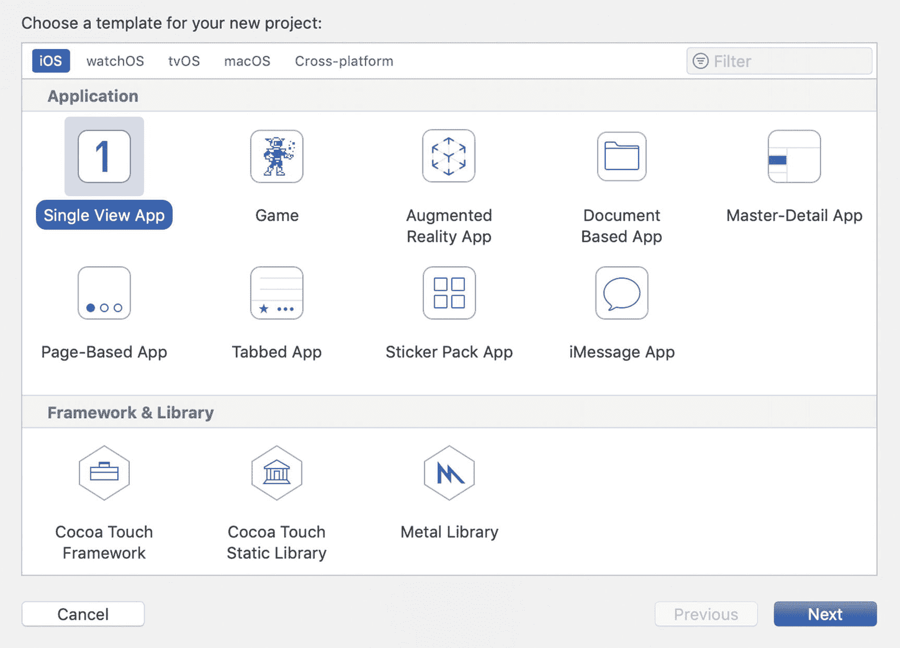

    图 11-1. 创建新项目

2.  完成后点击“下一步”按钮。下一个屏幕将允许你输入要使用的项目名称。在本章中，你需使用 `BookStore` 这个名称。

3.  靠近底部，你会看到一个名为“使用 Core Data”的复选框。请确保勾选此框，然后点击“下一步”，如图 11-2 所示。

    **注意** Core Data 可以在任何时候添加到任何项目中。在创建项目时勾选该框，会将 Core Data 框架和一个默认数据模型添加到你的应用程序中。如果你确定要使用 Core Data，勾选此框可以节省时间。

    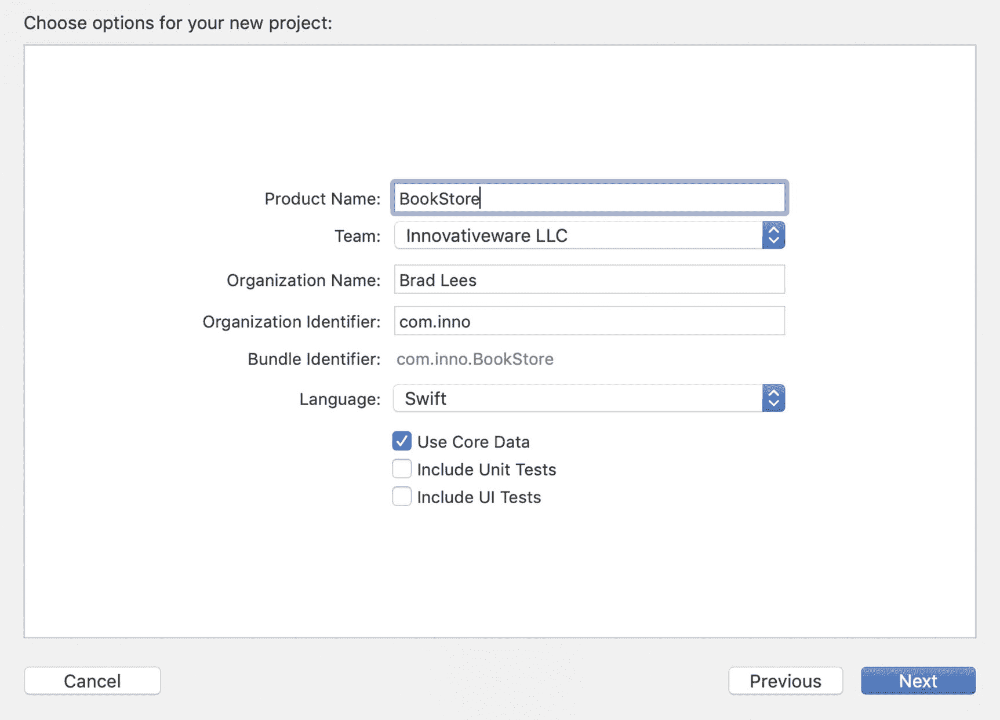

    图 11-2. 向项目添加 Core Data

4.  选择一个位置保存项目，然后点击“创建”。

完成之后，新项目将会打开。它看起来与标准应用程序类似，不同的是现在你会看到一个 `BookStore.xcdatamodeld` 文件。这个文件被称为*数据模型*，它将包含你将存储在 Core Data 中的数据的相关信息。

## 模型

点击模型文件（`BookStore.xcdatamodeld`）将其打开。你将看到一个类似于图 11-3 所示的窗口。

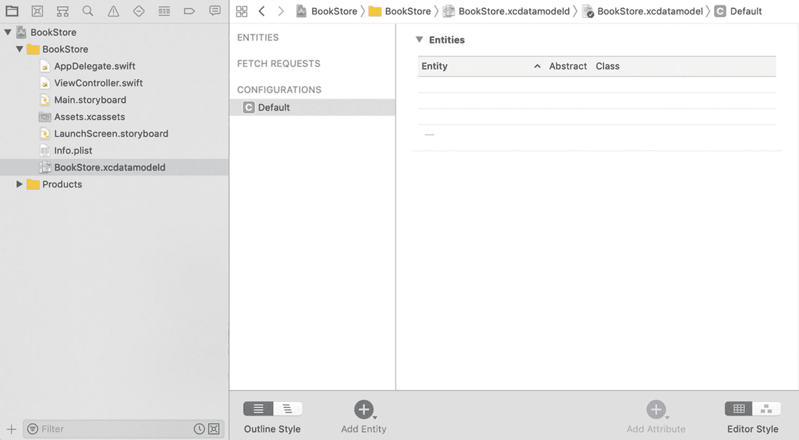

图 11-3. 空白的模型

窗口分为两个部分。左侧是实体。用更通俗的术语来说，这些是你想要存储在数据库中的对象或项目。获取请求和配置超出了本书的范围，可能会在更深入探讨 Core Data 时涉及。获取请求允许你为数据创建筛选条件或查询。

右侧部分在创建新实体后将包含该实体的属性。属性是关于实体的信息片段。例如，一本书就是一个实体，而书名是该实体的一个属性。

### 注意

在数据库术语中，实体就是你的*表*，实体的属性被称为*列*。从这些实体创建的对象被称为*行*。

右侧面板还会在实体创建后显示该实体的所有关系。关系将一个实体连接到另一个实体。例如，你将创建一个 `Book` 实体和一个 `Author` 实体。然后你将它们关联起来，这样每本书都可以有一个作者。

让我们创建一个实体。

1.  点击窗口底部的“添加实体”按钮，或者从菜单中选择“编辑器”➤“添加实体”，如图 11-4 所示。

    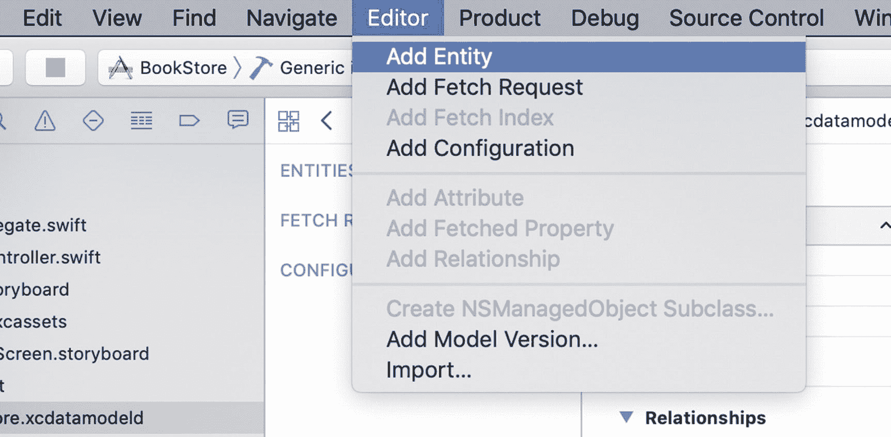

    图 11-4. 添加新实体

2.  在左侧，双击实体名称，并将其改为 `Book`。

    **注意** 你必须将实体名称的首字母大写。

3.  现在让我们添加一些属性。属性可以被看作是一本书的详细信息，因此你将存储书名、作者、价格和出版年份。显然，在你自己的应用程序中，你可能想存储更多信息，比如出版商、页数和类型，但这里我们从简单的开始。点击窗口右下角的“添加属性”按钮，或者选择“编辑器”➤“添加属性”，如图 11-5 所示。如果没有看到添加属性的选项，请确保你已在左侧选中了 `Book` 实体。

    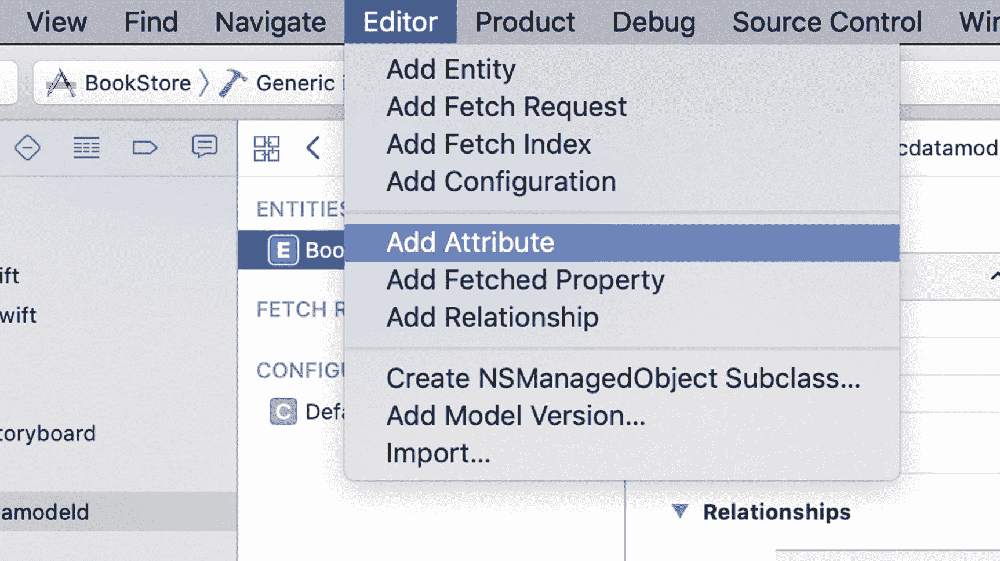

    图 11-5. 添加新属性

4.  对于属性，你只需提供两个选项：名称和数据类型。我们把这个属性命名为 `title`。与实体不同，属性名称必须小写。

5.  现在，你需要选择一种数据类型。选择正确的数据类型很重要。它将影响数据的存储方式以及从数据库中的检索方式。列表中有 13 个选项，可能让人有些不知所措。我们将讨论最常见的选项，随着你对 Core Data 越来越熟悉，你可以尝试其他选项。最常见的选项是 `String`（字符串）、`Integer 32`（32 位整数）、`Decimal`（小数）和 `Date`（日期）。对于书名，选择 `String`。

    - `String`：用于存储文本的属性类型。它应用于存储任何非数字或日期的信息。在本例中，书名和作者将是字符串。
    - `Integer 32`：属性有三种不同的整数值类型。这些整数类型的区别仅在于其最小值和最大值。`Integer 32` 应该能满足你存储整数时的大部分需求。整数是不带小数的数字。如果你试图将小数保存到整数属性中，小数部分将被截断。在本例中，出版年份将是一个整数。
    - `Decimal`：小数是一种可以存储带小数的数字的属性类型。`Decimal` 与双精度（`Double`）属性类似，但它们在最小值、最大值和精度上有所不同。`Decimal` 应当能够处理任何货币值。在本例中，你将使用 `Decimal` 来存储书的价格。
    - `Date`：日期属性正如其名。它允许你存储日期和时间，并基于这些值执行搜索和查找。在本例中你不会用到这个类型。

6.  让我们为这本书创建其余属性。现在，添加 `price`。它应该是 `Decimal` 类型。添加书的出版年份。对于由两个单词组成的属性，标准的命名方式是将第一个单词全部小写，第二个单词的首字母大写。例如，出版年份属性的理想名称是 `yearPublished`。选择 `Integer 32` 作为属性类型。添加完所有属性后，你的界面应如图 11-6 所示。

### 注意

属性名称不能包含空格。

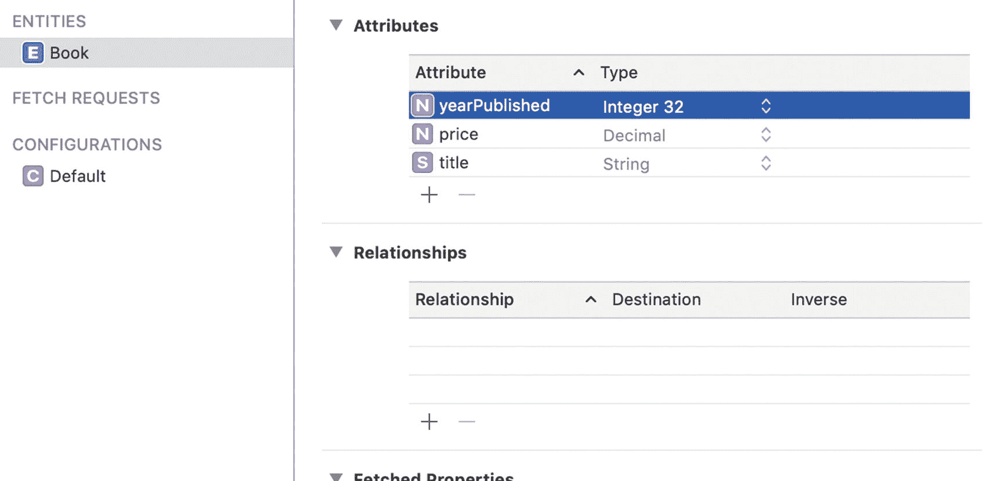

图 11-6. 完成后的 Book 实体


### 注意事项

如果你习惯使用数据库，会发现这里没有添加主键。主键是一个字段（通常是数字），用于唯一标识数据库中的每条记录。在 Core Data 数据库中，无需创建主键，框架会为你处理这一切。

现在你已完成了`Book`实体，让我们添加一个`Author`实体。

1. 添加一个新实体，命名为`Author`。
2. 为该实体添加`lastName`和`firstName`，两者均为字符串类型。

完成后，你的实体列表中应有两个实体。接下来需要添加关系。

1. 点击`Book`实体，然后长按屏幕右下角的“添加属性（Add Attribute）”按钮，选择“添加关系（Add Relationship）”，如图 11-7 所示。（你也可以点击 Core Data 模型中“Relationships”部分下的加号。）

   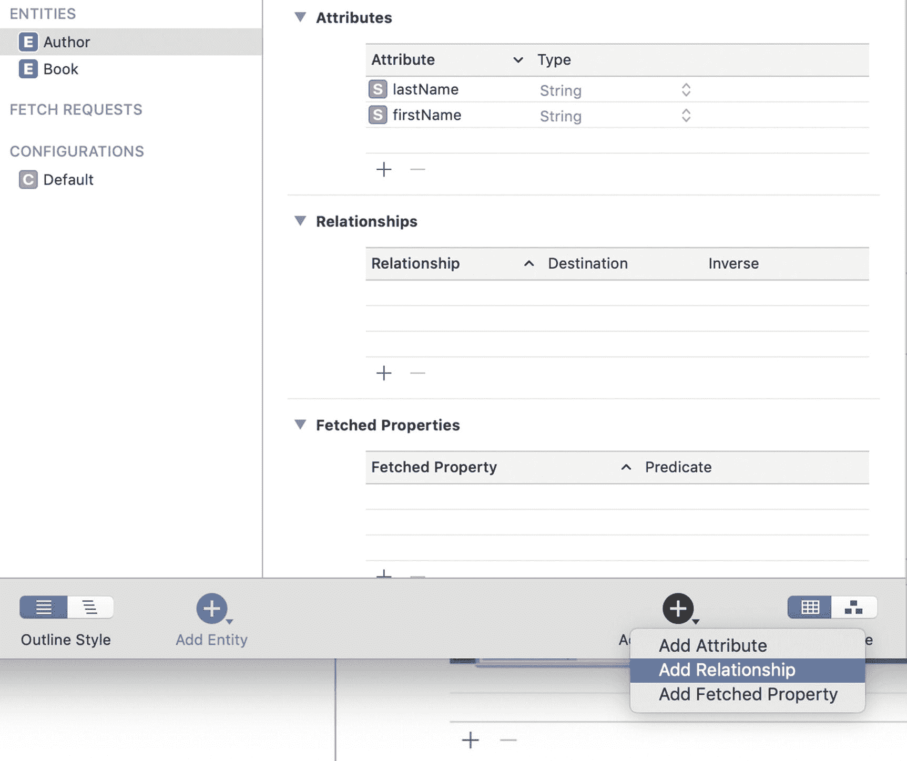

   图 11-7. 添加新关系

2. 系统会要求你命名该关系。通常将关系命名为你所引用的实体名称。输入`author`作为名称，并从“Destination”下拉菜单中选择`Author`。

3. 你已创建了关系的一半。要创建另一半，请点击`Author`实体。长按屏幕右下角的“添加属性”按钮，选择“添加关系”。你将使用要关联的实体名称作为此关系的名称，因此命名为`books`。（在关系名称后加了字母 *s*，因为一位作者可以有多本书。）在“Destination”下选择`Book`，在“Inverse”下选择你上一步创建的`author`关系。在屏幕右侧的“Utilities”窗口中，选择“Data Model Inspector”。将关系类型设置为“To Many”。此时你的模型应如图 11-8 所示。

   ### 注意事项

   有时在 Xcode 中操作模型时，需要按 Tab 键才能更新实体、属性和关系的名称。这个小毛病可以追溯到 WebObjects 工具时代。

   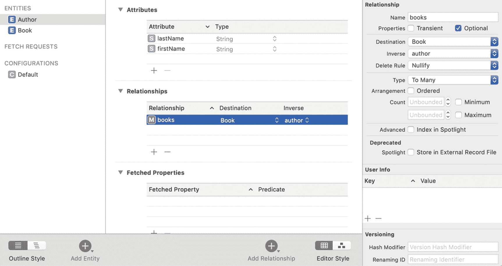

   图 11-8. 最终的关系

默认情况下，Xcode 现在会识别并使用你的新实体。如果你需要自定义 Core Data 对象（例如添加验证逻辑或自定义计算属性），则需告知 Xcode 为你生成`NSManagedObject`子类。本章我们将使用 Xcode 的默认实现。你可以通过点击实体并查看右侧的“Data Model Inspector”（如图 11-9 所示）来确认 Xcode 会在运行时自动生成这些文件。请确保“Codegen”设置为“Class Definition”。

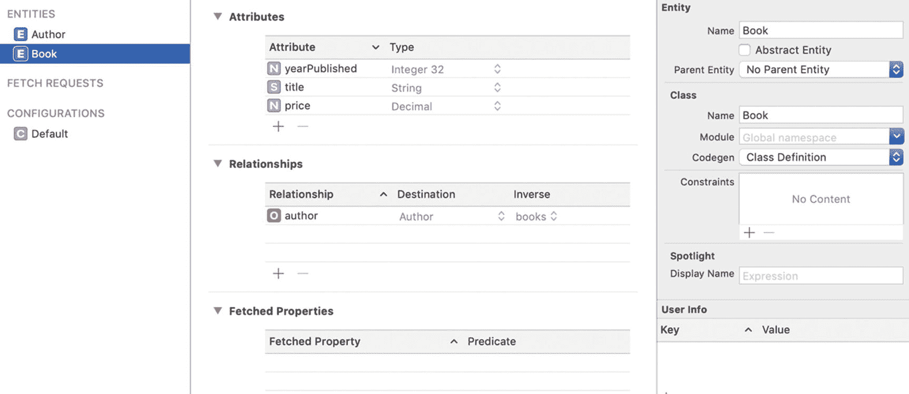

图 11-9. 检查实体的 Codegen 状态

当 Xcode 为你的实体生成类定义时，它会创建`NSManagedObject`的子类。`NSManagedObject`是一个对象，负责处理所有 Core Data 数据库的交互。它提供了本示例中将用到的方法和属性。

### 托管对象上下文

Xcode 将创建一个名为`Book`的托管对象类。在 Core Data 中，每个托管对象都应存在于一个托管对象上下文中。该上下文负责跟踪对象的更改、执行撤销操作以及将数据写入数据库。这非常有用，因为你可以一次性保存多组更改，而不是逐条单独保存，从而加快记录保存的速度。作为开发者，你无需跟踪对象何时被修改，托管对象上下文将为你处理所有这些工作。


### 设置界面

以下步骤将帮助你完成界面设置：

1.  在你的项目的 `BookStore` 文件夹中，应该有一个 `Main.storyboard` 文件。点击该文件，Xcode 会在编辑窗口中将其打开，如图 11-10 所示。

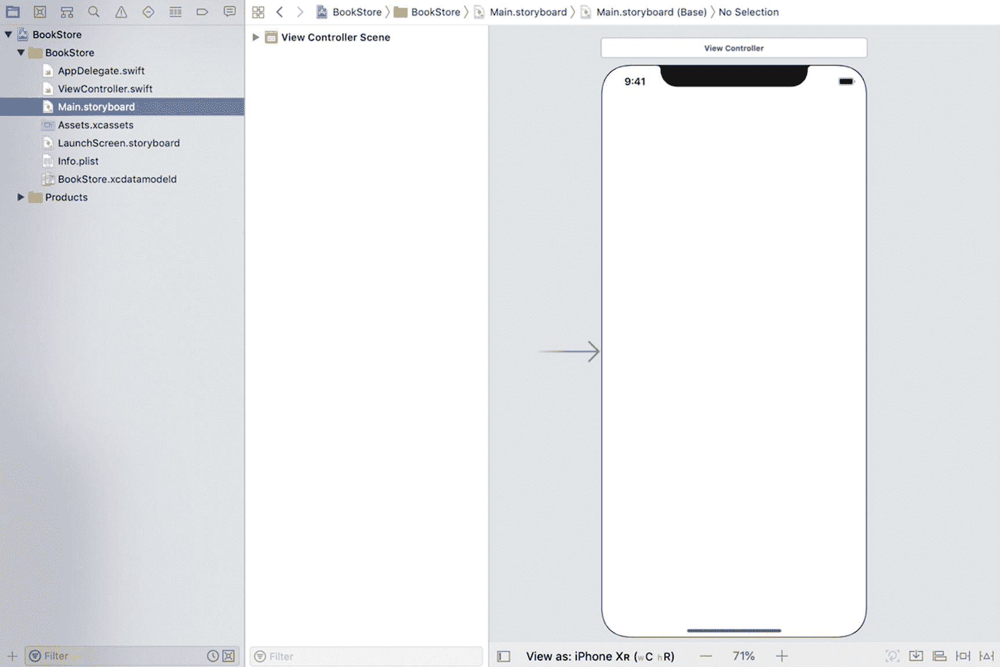

图 11-10. 创建界面

2.  此时应该会出现一个空白窗口。为了给窗口添加一些功能，你需要从对象库中添加一些对象。点击对象库按钮，并在搜索栏中输入 `table`。这应该会缩小对象范围，你会看到“Table View Controller”（表格视图控制器）和“Table View”（表格视图）。将“Table View”拖拽到视图中，如图 11-11 所示。

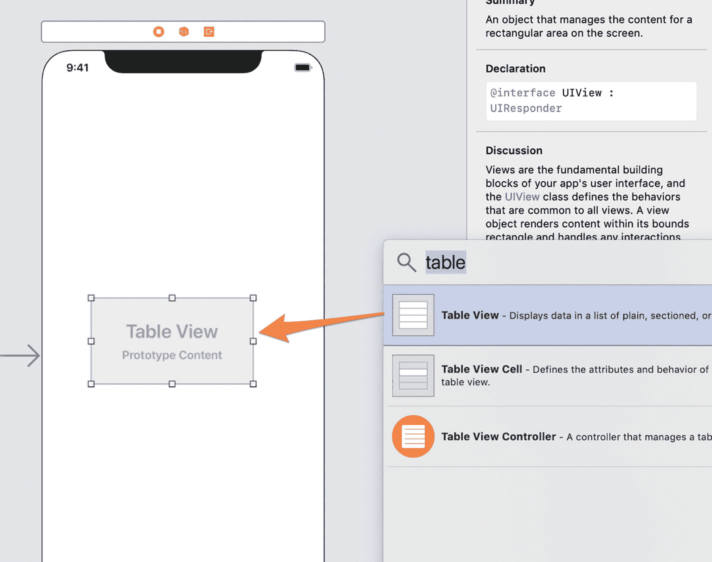

图 11-11. 添加表格视图

3.  现在你有了一个表格视图。你需要拉伸表格视图使其填满整个视图。拖拽表格视图的四个角，使其覆盖整个视图，如图 11-12 所示。

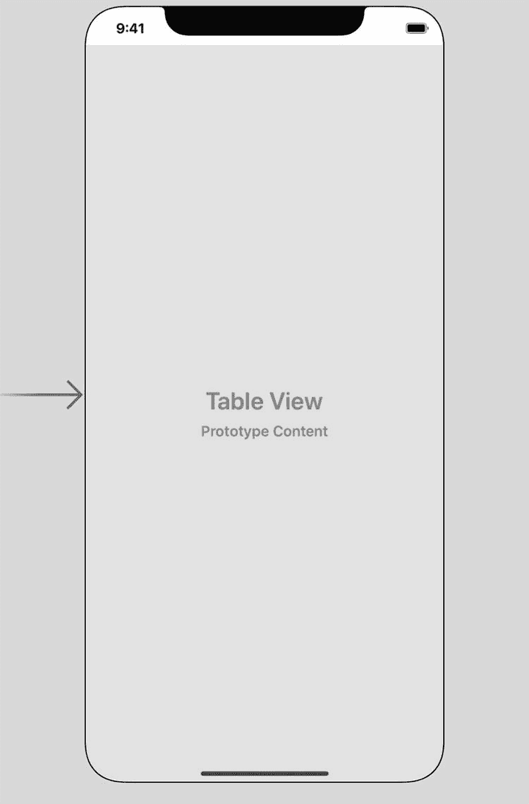

图 11-12. 拉伸表格视图

4.  为了在表格视图中创建单元格，你需要添加一个 `UITableViewCell`。在当前的 `table` 搜索结果中，表格视图对象下方应该会显示一个“Table View Cell”（表格视图单元格）。将一个“Table View Cell”拖拽到你的表格中。现在你的视图上就有了一个表格和一个单元格，如图 11-13 所示。

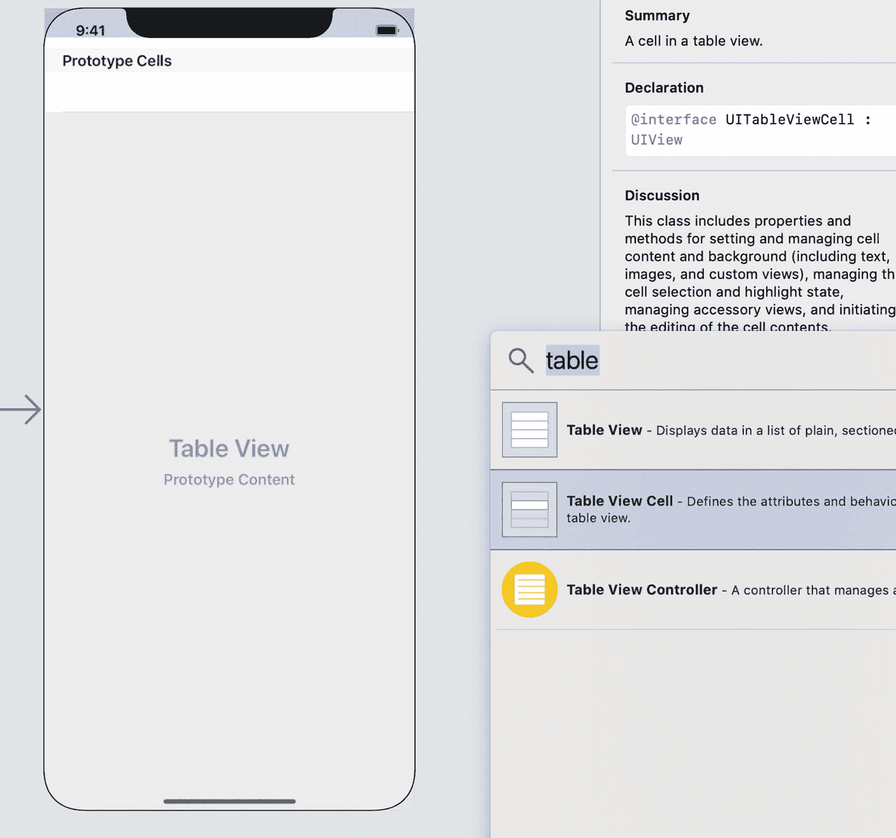

图 11-13. 添加表格视图单元格

5.  选中该单元格，在实用工具区域的属性检查器中，将“Style”设置为“Basic”。同时，将“Identifier”设置为 `Cell`。当你的表格视图中包含多种样式的单元格时，需要使用标识符，并需要用唯一的标识符来区分它们。对于简单的项目，你可以将其设置为 `Cell` 而无需过多考虑，如图 11-14 所示。

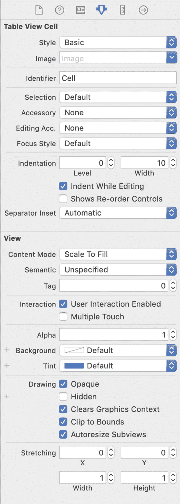

图 11-14. 修改单元格的样式和标识符

6.  使用表格视图时，通常将其嵌入一个导航控制器中是个好主意。你将使用导航控制器来为你的表格视图腾出空间，以便放置一个“添加”按钮。要添加导航控制器，请在场景列表（即故事板左侧显示所有视图控制器的窗口，你的视图控制器旁边会有一个黄色图标）中选中你的视图控制器。从应用程序菜单中，选择 `Editor` ➤ `Embed In` ➤ `Navigation Controller`，如图 11-15 所示。

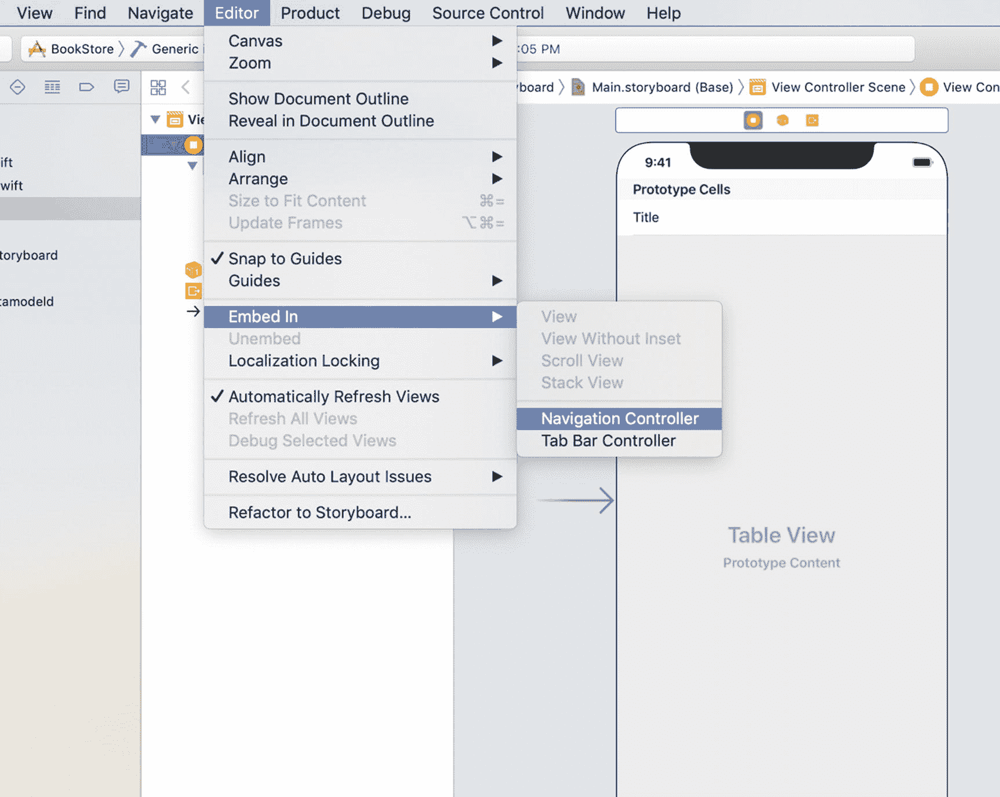

图 11-15. 嵌入导航控制器

7.  现在，你的视图顶部会有一个导航栏。接下来，你要在导航栏上添加一个按钮。这种类型的按钮被称为 `UIBarButtonItem`。在对象库中搜索 `bar button`，然后将一个“Bar Button Item”（栏按钮项）拖拽到导航栏上视图的右上角，如图 11-16 所示。

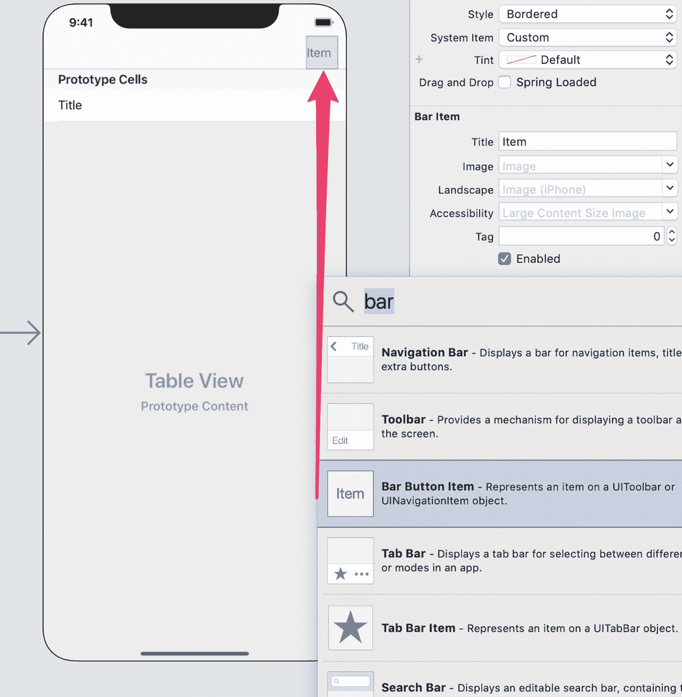

图 11-16. 在导航栏上添加栏按钮项

8.  选中该栏按钮项，将“System Item”（系统项目）从“Custom”（自定义）更改为“Add”（添加），如图 11-17 所示。这将使你的栏按钮项外观从*Item*（项目）文字变成一个加号图标。


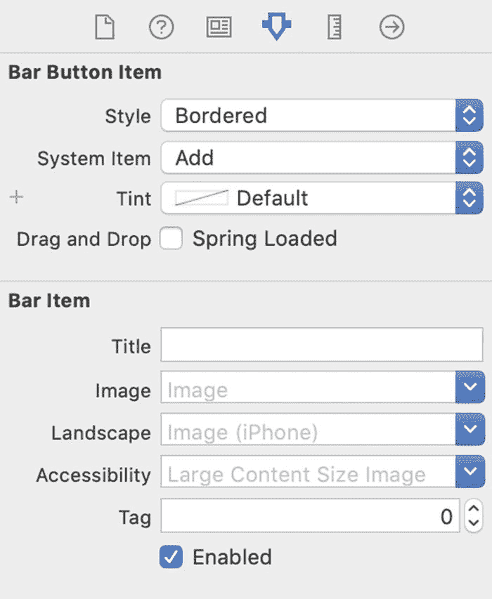

图 11-17. 更改栏按钮项

9. 现在你已经创建了界面，需要将其与代码连接起来。按住 Control 键，将你的 Table View 拖拽到文档大纲中的 View Controller，如图 11-18 所示。

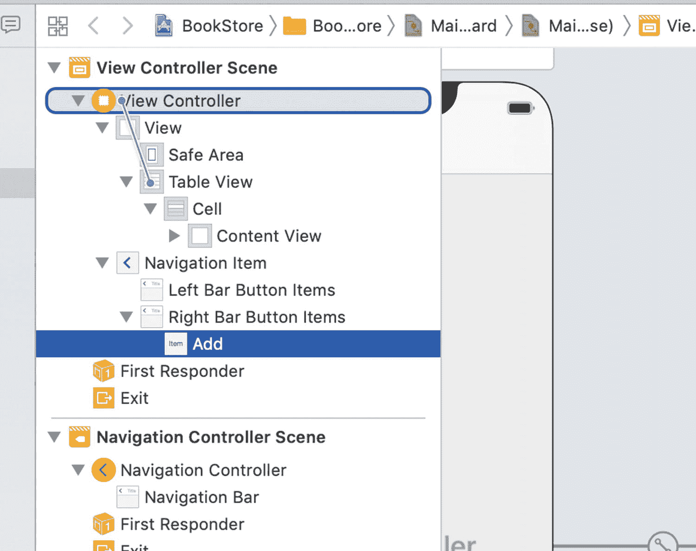

图 11-18. 连接 Table View

10. 将会出现一个弹出窗口，允许你选择 `dataSource` 或 `delegate`，如图 11-19 所示。你需要将两者都分配给 View Controller。选择项目的顺序无关紧要，但你需要两次 Control-拖拽 Table View。

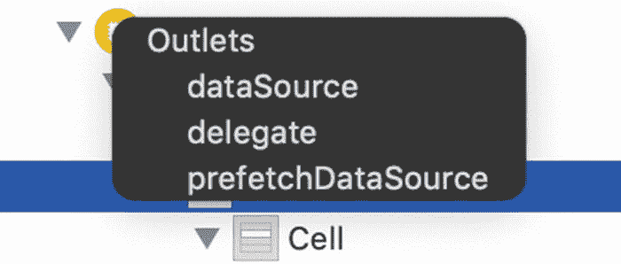

图 11-19. 连接 Table View

11. 现在你的 Table View 应该可以正常使用了。你需要连接你的按钮，使其能够执行某些操作。在 Xcode 窗口的右上方，点击助手编辑器按钮（看起来像两个圆圈）。这将在右侧打开你的代码，并在左侧打开你的 storyboard。现在，Control-拖拽你的 Add 按钮到右侧的 View Controller 代码中，如图 11-20 所示。

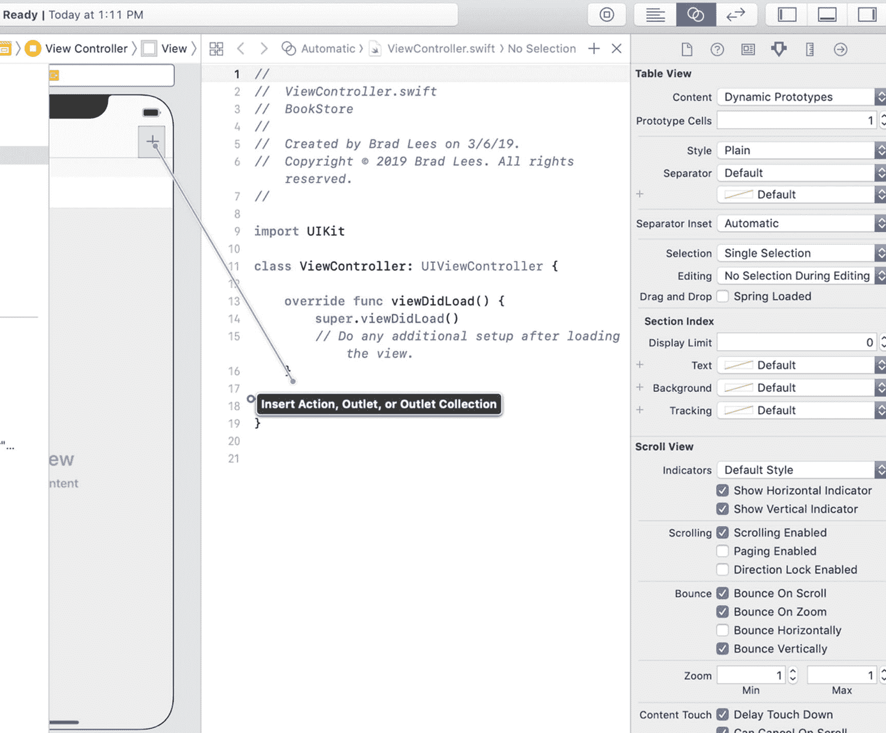

图 11-20. 为你的按钮对象添加操作

12. 只要将 Add 按钮放在你的类中且在任何方法之外，放在哪里并不重要。为了整洁，它应该放在你的类属性之后。当你松开时，系统会提示你正在创建的连接类型。将 Connection 设置为 Action。然后为你新方法添加一个名称，例如 `addNew`，如图 11-21 所示。点击 Connect 完成连接。

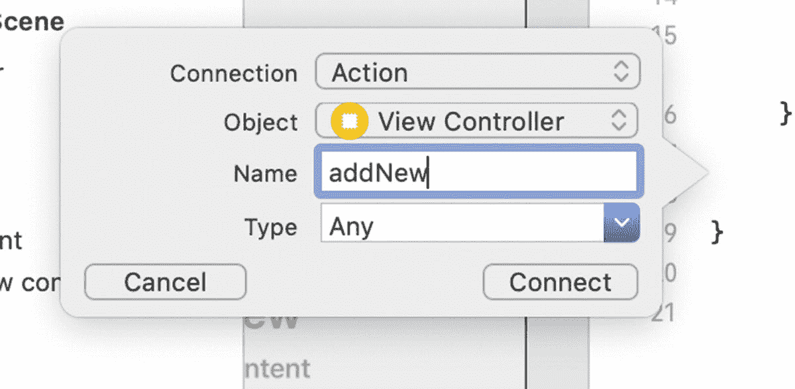

图 11-21. 更改连接的类型和名称

13. 你还需要为你的 Table View 创建一个 outlet。将 Table View 从 View Controller 场景拖拽到代码顶部（就在类定义下方，如图 11-22 所示）。确保连接设置为 Outlet，并将 Table View 命名为 `myTableView`。稍后你将需要这个 outlet 来告诉你的 Table View 刷新。点击 Connect 完成连接。

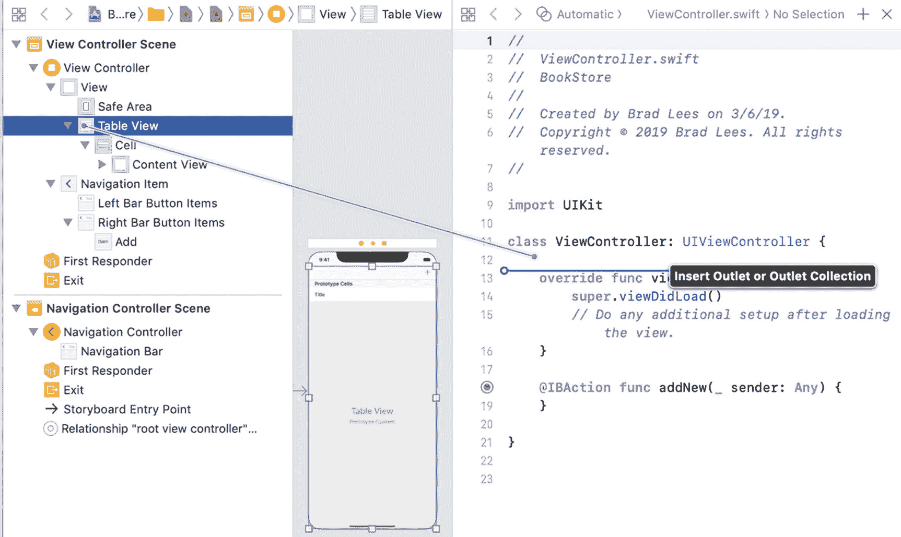

图 11-22. 为 Table View 创建 outlet

现在界面已经完成，但你仍然需要添加代码来使界面执行操作。回到标准编辑器（点击 Xcode 工具栏右上角两个圆圈图标左侧的列表图标），然后从左侧文件列表中选择 `ViewController.swift` 文件。因为你现在有一个需要处理的 Table View，所以你需要告诉你的类它可以处理 Table View。将文件顶部的类声明更改为以下内容：

```
class ViewController: UIViewController, UITableViewDelegate, UITableViewDataSource {
```

你在声明中添加了 `UITableViewDelegate` 和 `UITableViewDataSource`。这告诉你的控制器它可以充当表格视图的委托和数据源。这些被称为 ***协议***。协议告诉对象它们必须实现某些方法才能与其他对象交互。例如，要遵循 `UITableViewDataSource` 协议，你需要实现以下方法：

```
func tableView(_ tableView: UITableView, numberOfRowsInSection section: Int) -> Int
```

没有这个方法，Table View 将不知道要绘制多少行。

在继续之前，你需要告诉你的 `ViewController.swift` 文件关于 Core Data 的信息。为此，在文件顶部 `import UIKit` 下方添加以下行：

```
import CoreData
```

你还需要向你的 `ViewController` 类中添加一个托管对象上下文。在 `class ViewController` 行之后立即添加以下行：

```
var managedObjectContext: NSManagedObjectContext!
```

既然你有了一个变量来保存你的 `NSManagedObjectContext`，你需要实例化它，以便可以向其中添加对象。为此，你需要将以下行添加到你的 `override func viewDidLoad()` 方法中：

```
let appDelegate: AppDelegate = UIApplication.shared.delegate as! AppDelegate
managedObjectContext = appDelegate.persistentContainer.viewContext as NSManagedObjectContext
```

第一行创建了一个指向你的应用程序委托的常量。第二行将你的 `managedObjectContext` 变量指向应用程序委托的 `managedObjectContext`。在整个应用程序中使用相同的托管对象上下文通常是一个好主意。

你要添加的第一个新方法是查询数据库记录的方法。将此方法命名为 `loadBooks`。

```
1 func loadBooks() -> [Book] {
2     let fetchRequest: NSFetchRequest = Book.fetchRequest()
3     var result: [Book] = []
4     do {
5          result = try managedObjectContext.fetch(fetchRequest)
6     } catch {
7          NSLog("My Error: %@", error as NSError)
8     }
9     return result
10 }
```

这段代码比你之前看到的稍微复杂一些，所以让我们逐步分析一下。第 1 行声明了一个名为 `loadBooks` 的新函数，它返回一个 `Books` 的数组。然后，一旦加载完成，你就返回该数组。

现在你需要为你的 Table View 添加数据源方法。这些方法告诉你的 Table View 有多少个分区，每个分区有多少行，以及每个单元格应该是什么样子。将以下代码添加到你的 `ViewController.swift` 文件中：

```
1 func tableView(_ tableView: UITableView, numberOfRowsInSection section: Int) -> Int {
2     return loadBooks().count
3 }

5 func tableView(_ tableView: UITableView, cellForRowAt indexPath: IndexPath) -> UITableViewCell {
6     guard let cell = tableView.dequeueReusableCell(withIdentifier: "Cell") else { return UITableViewCell() }
7     let book: Book = loadBooks()[indexPath.row]
8     cell.textLabel?.text = book.title
9     return cell
10 }
```

在第 2 行中，你调用了你的 `Book` 数组的计数，以确定 Table view 中的行数。在第 5-9 行中，你创建了你的单元格并返回它。第 6 行创建了一个供你使用的单元格。这是创建单元格的标准代码。标识符允许你在 Table View 中使用多种类型的单元格，但这更复杂。第 7 行从你的 `loadBooks()` 数组中获取你的 `Book` 对象。第 8 行将书名分配给你单元格中的 `textLabel`。`textLabel` 是单元格中的默认标签。这就是在 Table view 中显示你的 `loadBooks` 方法结果所需的一切。你仍然有一个问题。你的数据库中还没有任何书籍。

要解决此问题，你将向之前创建的 `addNew` 方法添加代码。在你创建的 `addNew` 方法内部添加以下代码：

```
1     @IBAction func addNew(_ sender: Any) {
2         let book: Book = NSEntityDescription.insertNewObject(forEntityName: "Book", into: managedObjectContext) as! Book
3         book.title = "My Book" + String(loadBooks().count)
4         do {
5             try managedObjectContext.save()
6         } catch let error as NSError {
7             NSLog("My Error: %@", error)
8         }
9         myTableView.reloadData()
10     }
```


第 2 行根据 `Entity` 名称在数据库中为你的图书创建了一个新的 `Book` 对象，并将该对象插入到你之前创建的 `managedObjectContext` 中。请记住，一旦对象被插入到托管对象上下文中，其更改就会被跟踪，并且可以被保存。第 3 行将图书标题设置为 `My Book`，并添加数组中项目的数量。显然，在实际应用中，你会希望将其设置为由用户提供或来自其他列表的名称。第 4-8 行保存了托管对象上下文。

在 Swift 3.0 中，苹果改变了错误处理方式。Swift 4.0 的错误处理方式与 Swift 3.0 几乎相同。现在，当你执行一个可能引发错误的操作时，你使用 `try` 关键字，然后抛出（`throw`）一个错误。第 9 行通知 `UITableView` 重新加载自身，以显示新添加的 `Book`。现在构建并运行应用程序。点击 + 按钮几次。你将向对象存储中添加新的 `Book` 对象，如图 11-23 所示。如果你退出应用并重新启动，你会发现数据仍然存在。

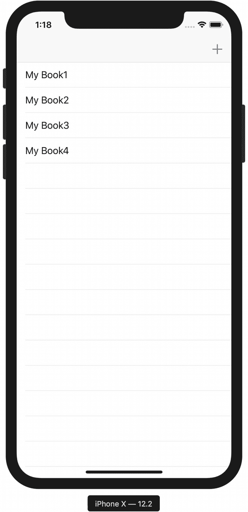

图 11-23.

最终应用程序

以上是对 iOS 中 Core Data 的简要介绍。Core Data 是一个强大的 API，但也需要花费大量时间来掌握。

## 本章小结

以下是本章涵盖主题的总结：

*   *偏好设置*：你学会了使用 `UserDefaults` 在 iOS、macOS、tvOS 和 watchOS 上保存和读取来自文件的偏好设置。
*   *数据库*：你了解了什么是数据库，以及为什么使用数据库比将信息保存在偏好设置文件中更可取。
*   *数据库引擎*：你了解了苹果集成到 macOS、tvOS 和 iOS 中的 SQLite 数据库引擎及其优点和局限性。
*   *Core Data*：苹果提供了一个用于与 SQLite 数据库交互的框架。该框架使接口更易于使用。
*   *书店应用*：你创建了一个简单的 Core Data 应用，并使用 Xcode 为你的书店创建了一个数据模型。你还学习了如何在两个实体之间创建关系。最后，你使用 Xcode 为你的 Core Data 模型创建了一个简单的界面。

### 练习

*   为应用添加一个新视图，允许用户输入书名。
*   提供一种从列表中移除图书的方法。
*   创建一个 `Author` 对象，并将其添加到一个 `Book` 对象中。

