# 12. 协议与委托

恭喜你！你正在掌握成为 iOS 开发者所需的技能！然而，iOS 开发者还需要理解另外两个主题才能成功：**协议** 和 **委托**。新开发者常常会被这些主题搞得不知所措，所以我们首先介绍了 Swift 语言的基础主题。阅读本章后，你会发现协议和委托非常有用，并且不难理解和实现。

## 多重继承

我们曾在第 5 章中讨论过对象继承。简而言之，对象继承意味着子类可以继承其父类的所有特征，如图 12-1 所示。

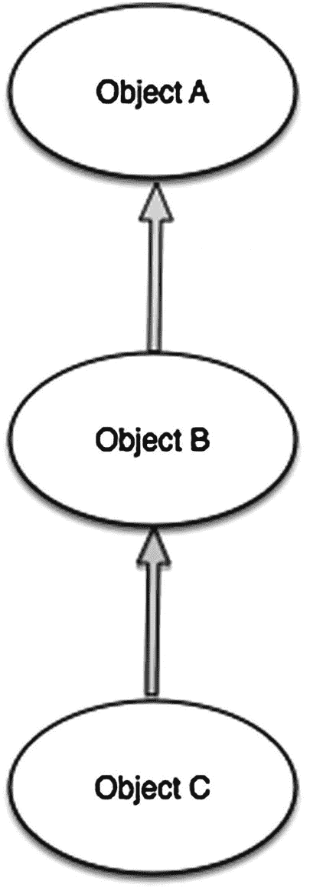

图 12-1.

典型的 Swift 继承

C++、Perl 和 Python 都有一个名为 *多重继承* 的特性，它允许一个类从多个父类继承行为和特性，如图 12-2 所示。

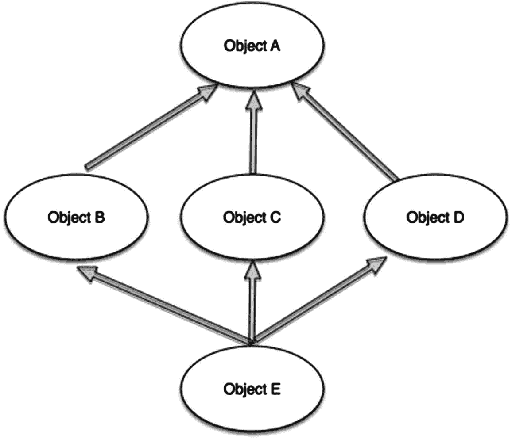

图 12-2.

多重继承

多重继承可能会带来问题，因为它可能产生歧义。因此，Swift 没有实现多重继承。相反，它实现了一种称为 **协议** 的机制。

## 理解协议

苹果将 *协议* 定义为一系列函数声明的列表，不附加到任何类定义上。协议类似于类，但区别在于协议不提供任何需求的实现；它只描述了一个实现应该是什么样子的。

一个类可以采用该协议，以提供这些需求的实际实现。任何满足协议需求的类型，我们都称之为 *遵循* 该协议。

## 协议语法

协议的定义方式类似于类，如代码清单 12-1 所示。

```
protocol RandomNumberGenerator {
    var mustBeSettable: Int { get set }
    var doesNotNeedToBeSettable: Int { get }
    func random() -> Double
}
```

代码清单 12-1. 协议定义

如果一个类有父类，你需要在列出的任何协议之前先列出父类的名称，后跟逗号，如代码清单 12-2 所示。

```
class MyClass: MySuperclass, RandomNumberGenerator, AnotherProtocol {
    // 类定义写在这里
}
```

代码清单 12-2. 协议列在父类之后

协议还指定了每个属性必须具有可获取（gettable）或既可获取又可设置（gettable *and* settable）的实现。可获取的属性是只读的，而既可获取又可设置的属性则不是（如前面的代码清单 12-1 所示）。

属性总是声明为变量属性，并以 `var` 为前缀。可获取和可设置的属性在其类型声明后用 `{ get set }` 表示，而可获取的属性则用 `{ get }` 表示。

## 委托

**委托** 是一种设计模式，它允许一个类或结构体将其部分职责移交给（或 *委托* 给）另一个类型的实例。这种设计模式通过定义一个封装了委托职责的协议来实现。委托可以用于响应特定操作，或从外部来源检索数据，而无需了解该来源的底层类型。

代码清单 12-3 定义了两个用于随机数字猜测游戏的协议。

```
protocol RandomNumberGame {
    var machine: Machine { get }
    func play()
}

protocol RandomNumberGameDelegate {
    func gameDidStart(game: RandomNumberGame)
    func game(game: RandomNumberGame, didStartNewTurnWithGuess randomGuess: Int)
    func gameDidEnd(game: RandomNumberGame)
}
```

代码清单 12-3. 协议定义

`RandomNumberGame` 协议可以被任何涉及随机数生成和猜测的游戏所采用。`RandomNumberGameDelegate` 协议可以被任何类型的类采用，以跟踪 `RandomNumberGame` 协议的进展。

## 协议与委托示例

本节将向你展示如何创建一个更复杂的随机数字猜测应用，以说明如何使用协议和委托。该应用的主视图显示用户的猜测以及该猜测是高了、低了还是正确，如图 12-3 所示。

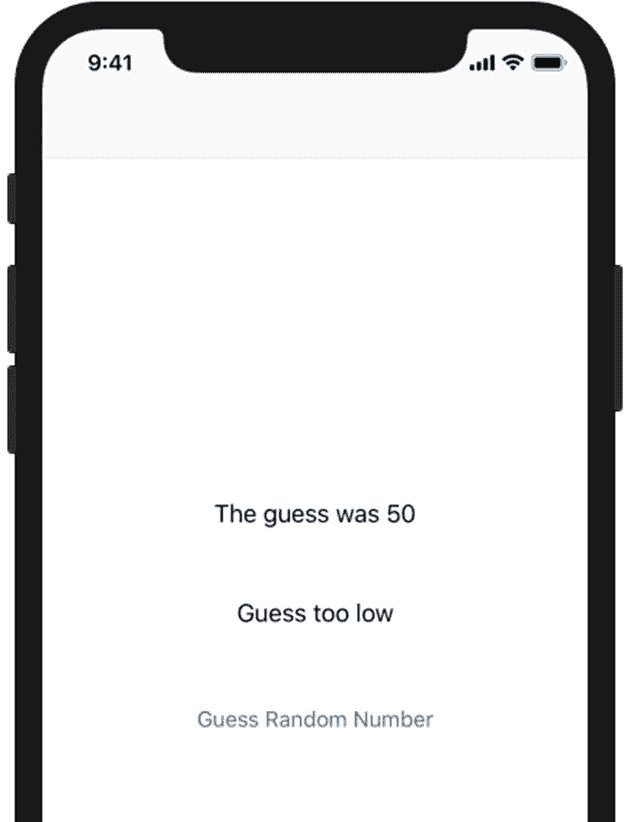

图 12-3.

猜测游戏应用主视图

当用户点击“猜测随机数字”按钮时，他们会被带到输入屏幕以输入他们的猜测，如图 12-4 所示。

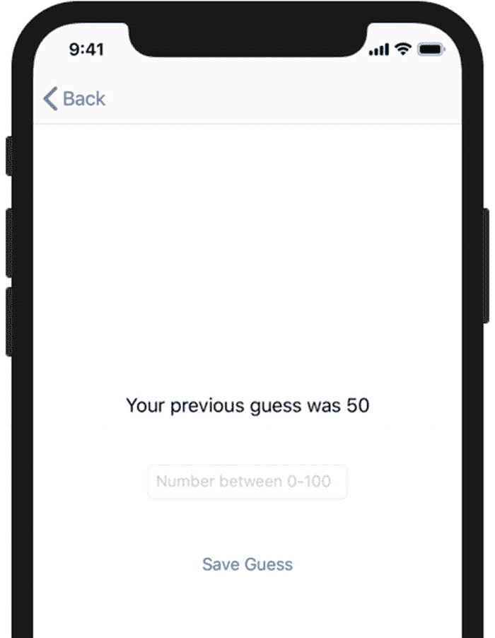

图 12-4.

猜测游戏应用用户输入视图

当用户输入他们的猜测时，委托方法会将猜测传回主视图，然后主视图显示结果。


## 开始入门

请按照以下步骤创建应用：

1.  基于“单视图应用”模板创建一个新的 Swift 项目，将其命名为 `RandomNumberDelegate`，并保存，如图 12-5 所示。

    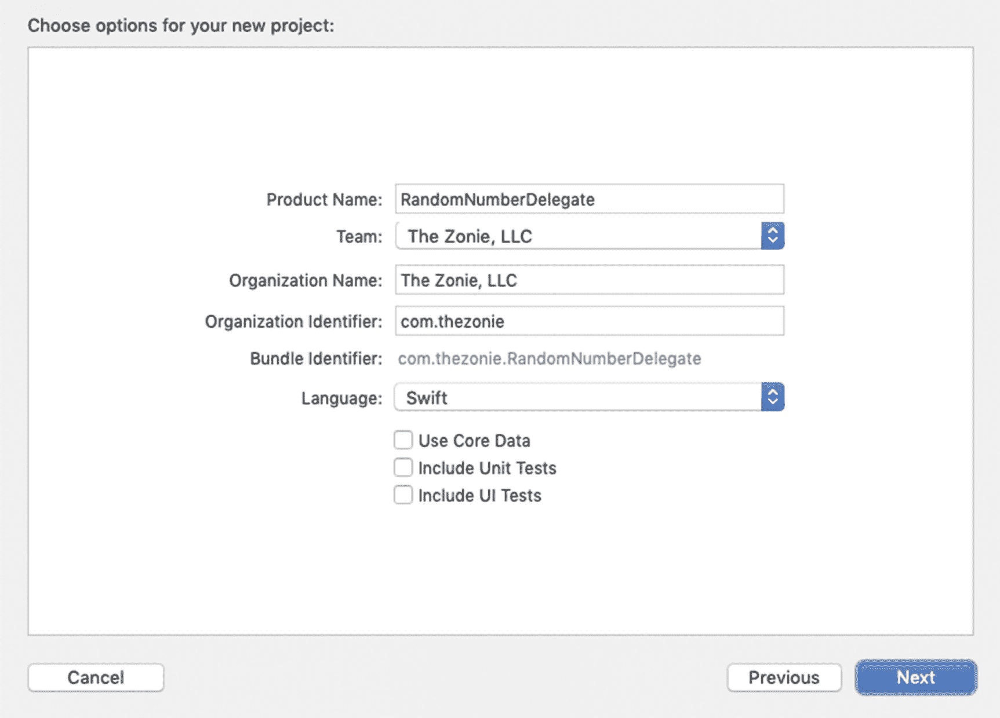

    图 12-5. 创建项目

2.  从文档大纲中，选择 `Main.storyboard`，然后选择视图控制器场景。接着选择“编辑器”➤“嵌入于” ➤“导航控制器”。这将把您的视图控制器嵌入到导航控制器中，并使您能够轻松地在其他视图控制器之间来回切换，如图 12-6 所示。

    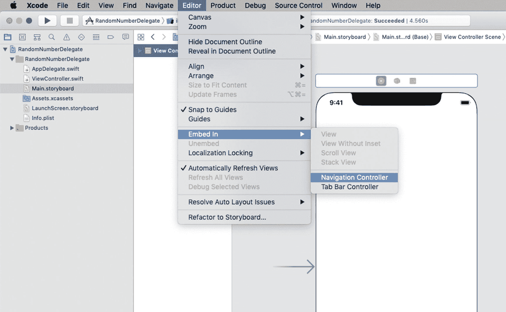

    图 12-6. 将视图控制器嵌入导航控制器

3.  在视图控制器中，添加两个`标签`对象和两个`按钮`对象，以及它们对应的四个出口来操控视图，如图 12-7 所示。(务必像你在第 10 章中所做的那样，将这些标签和按钮嵌入到一个水平和垂直都居中对齐的堆栈视图中。)

    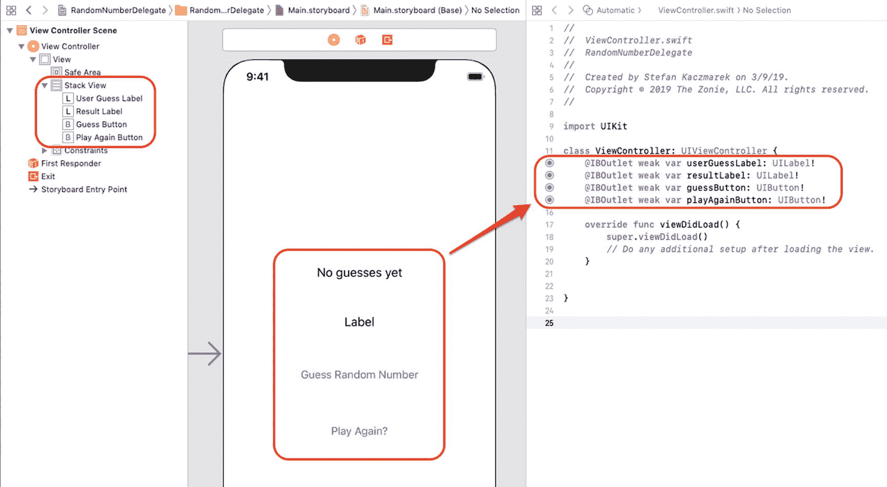

    图 12-7. 操控视图所需的出口

4.  接下来，将代码清单 12-4 中的操作连接到 `playAgainButton`。

5.  添加代码清单 12-5 中的代码，用于处理用户猜测数字以及创建随机数的函数。

    ```
    22     // 由 playAgainButton 触发的事件
    23     @IBAction func playAgain(_ sender: Any) {
    24         createRandomNumber()
    25         // 仅在用户猜对数字时显示按钮
    26         playAgainButton.isHidden = true
    27         // 显示按钮
    28         guessButton.isHidden = false
    29         resultLabel.text = ""
    30         userGuessLabel.text = "New Game"
    31         previousGuess = ""
    32     }
    ```

    代码清单 12-4 `IBAction` 函数

6.  在代码清单 12-6 的第 12 行和第 13 行声明并初始化这两个变量。

    ```
    34     // 当用户点击“保存按钮”时，从 GuessInputViewController
    35     // 调用的函数
    36     func userDidFinish(_ controller: GuessInputViewController, guess:  String) {
    37         userGuessLabel.text = "猜测结果是 " +  guess
    38         previousGuess = guess
    39         if let numberGuess = Int(guess) {
    40             if (numberGuess > randomNumber) {
    41                 resultLabel.text = "猜大了"
    42             } else if (numberGuess < randomNumber) {
    43                 resultLabel.text = "猜小了"
    44             } else {
    45                 resultLabel.text = "猜对了"
    46                 //显示“再玩一次”按钮
    47                 playAgainButton.isHidden = false
    48                 //隐藏“再次猜测”按钮
    49                 guessButton.isHidden = true
    50             }
    51         }

    53         // 将 GuessInputViewController 从栈中弹出
    54         if let navController = self.navigationController {
    55             navController.popViewController(animated: true)
    56         }
    57     }

    59     // 创建随机数
    60     func createRandomNumber() {
    61         // 获取一个 0-100 之间的随机数
    62         randomNumber = Int(arc4random_uniform(100))
    63         // 方便我们调试 :)
    64         print("随机数是: \(randomNumber)")
    65         return
    66     }
    ```

    代码清单 12-5 用户猜测委托函数和 `createRandomNumber` 函数

7.  修改函数 `viewDidLoad()`，以处理视图首次出现时的外观，并创建要猜测的随机数，如代码清单 12-7 所示。

    ```
    11 class ViewController: UIViewController {
    12     var previousGuess = ""
    13     var randomNumber = 0

    15     @IBOutlet weak var userGuessLabel: UILabel!
    16     @IBOutlet weak var resultLabel: UILabel!
    17     @IBOutlet weak var guessButton: UIButton!
    18     @IBOutlet weak var playAgainButton: UIButton!
    ```

    代码清单 12-6 变量声明和初始化

8.  现在，您需要创建一个视图，以便用户能够输入他们的猜测。在 `Main.storyboard` 文件中，将一个“新视图控制器”拖放到主页视图控制器旁边，并在另一个居中对齐的堆栈视图中添加一个“标签”、一个“文本字段”和一个“按钮”。对于“文本字段”对象，在其“占位符”属性中键入“`0-100 之间的数字`”，如图 12-8 所示。

    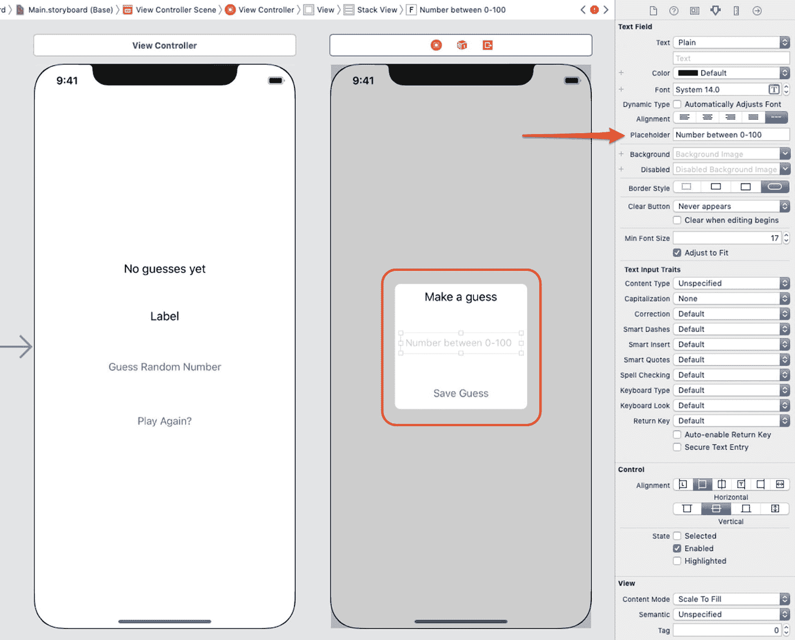

    图 12-8. 创建“猜测”视图控制器和对象

9.  接下来，您需要为“猜测输入视图控制器”创建一个类。创建一个 Swift 文件，并通过选择“文件”➤“新建” ➤“文件”将其保存为 `GuessInputViewController.swift`。然后选择 iOS 和 Cocoa Touch Class，并将该类命名为 `GuessInputViewController`，作为 `UIViewController` 的子类，如图 12-9 所示。

    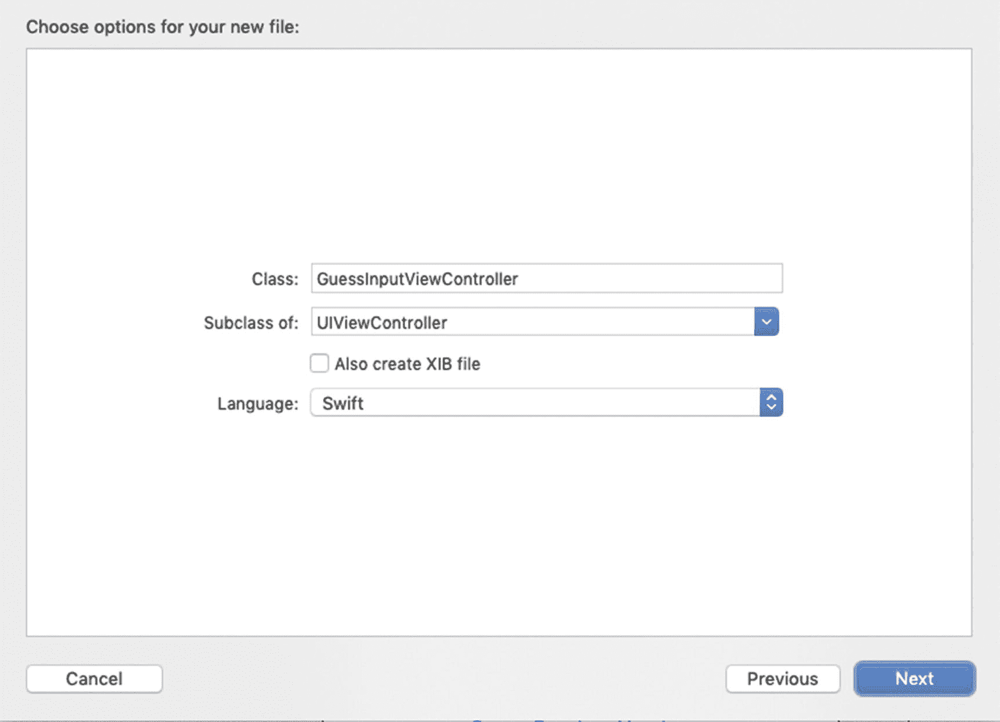

    图 12-9. 创建 `GuessInputViewController.swift` 文件

10. 让我们将 `GuessInputViewController` 类与步骤 8 中创建的“猜测”视图控制器关联起来。从 `Main.storyboard` 文件中，选择“猜测输入视图控制器”，选择“身份检查器”，然后在“类”字段中选择或输入 `GuessInputViewController`，如图 12-10 所示。

    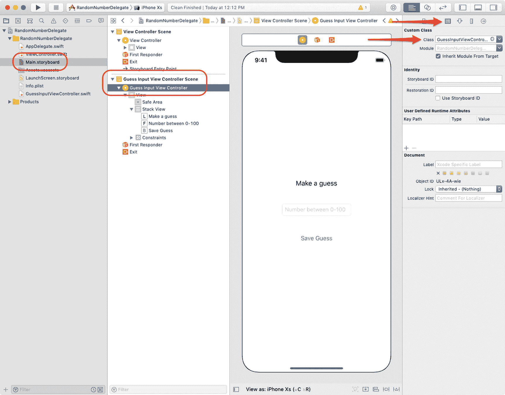

    图 12-10. 设置猜测输入视图控制器类

    ```
    20     override func viewDidLoad() {
    21         super.viewDidLoad()
    22         // 载入视图后的其他设置，通常来自 nib 文件

    24         createRandomNumber()
    25         playAgainButton.isHidden = true
    26         resultLabel.text = ""
    27     }
    ```

    代码清单 12-7 `viewDidLoad` 函数

现在，让我们创建并连接 `GuessInputViewController` 类中的操作和出口，如代码清单 12-8 所示。

11. 您就快完成了。您需要通过一个 segue 来连接场景。一个*segue* 能让您从一个场景过渡到另一个场景。按住 Control 键从“猜测随机数字”按钮拖拽到“猜测输入视图控制器”，并选择“显示”作为“操作 Segue”的类型，如图 12-11 所示。

    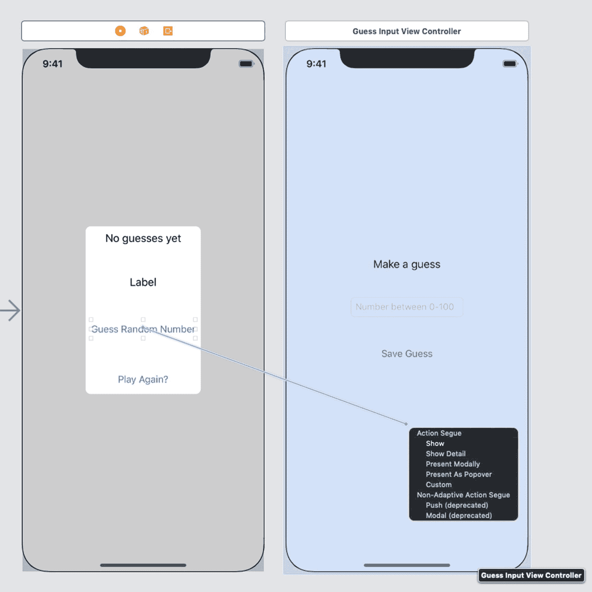

    图 12-11. 创建在点击“猜测随机数字”按钮时转换场景的 segue

12. 现在，您需要为这个 segue 提供一个标识符。点击 segue 箭头，选择“属性检查器”，并将该 segue 命名为 `MyGuessSegue`，如图 12-12 所示。

    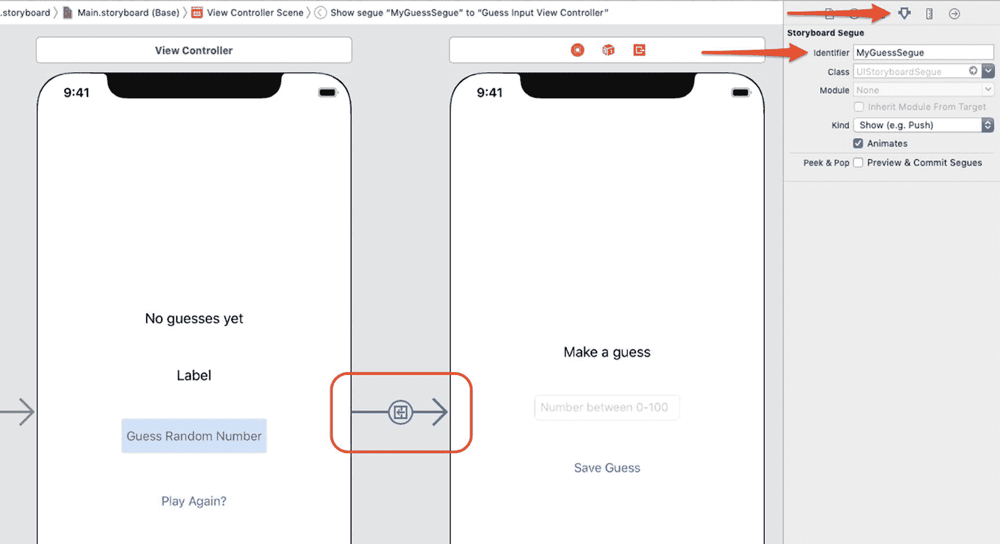

    图 12-12. 创建 segue 标识符

    ```
    9 import UIKit

    11 // 用于将数据发送回主页视图控制器的 userDidFinish 协议的协议
    12 protocol GuessDelegate {
    13     func userDidFinish(_ controller:GuessInputViewController, guess: String)
    14 }

    16 class GuessInputViewController: UIViewController {
    17     var delegate: GuessDelegate?
    18     var previousGuess: String = ""

    20     @IBOutlet weak var guessLabel: UILabel!
    21     @IBOutlet weak var guessTextField: UITextField!

    23     override func viewDidLoad() {
    24         super.viewDidLoad()
    ```


```swift
26         // 加载视图后进行任何额外设置
27         if(!previousGuess.isEmpty) {
28             guessLabel.text = "你之前的猜测是 \(previousGuess)"
29         }
30         guessTextField.becomeFirstResponder()
31     }

33     @IBAction func saveGuess(_ sender: AnyObject) {
34         if let delegate = delegate, let guessText = guessTextField.text {
35             delegate.userDidFinish(self, guess: guessText)
36         }
37     }
38 }
```
**代码清单 12-8**  
类清单

### 注意
输入 Segue 标识符后，务必按回车键或 Tab 键。如果不按回车键，Xcode 可能无法识别属性更改。

现在，你需要编写代码来处理 Segue。在 `ViewController` 类中，添加代码清单 12-9 中的代码。

```swift
75     override func prepare(for segue: UIStoryboardSegue, sender: Any!) {
76         if segue.identifier == "MyGuessSegue" {
77             let vc = segue.destination as! GuessInputViewController
78             // 将 previousGuess 属性传递给 GuessInputViewController
79             vc.previousGuess = previousGuess
80             vc.delegate = self
81         }
82     }
```
**代码清单 12-9**  
`prepareForSegue` 方法

当用户点击“猜测随机数”按钮时，会调用 Segue，从而触发 `prepareForSegue` 方法。你首先检查它是否为 `MyGuessSegue`。然后将 `vc` 变量赋值为 `GuessInputViewController`。

第 79 行和第 80 行将 `previousGuess` 数字和委托传递给了 `GuessInputViewController`。

1.  如果你尚未将 `GuessDelegate` 添加到 `ViewController` 类，请立即添加，如代码清单 12-10 所示。

```swift
11 class ViewController: UIViewController, GuessDelegate {
12     var previousGuess = ""
13     var randomNumber = 0
```
**代码清单 12-10**  
声明了 `GuessDelegate` 的 `ViewController` 类

## 工作原理

以下是代码的工作原理：

*   当用户点击“猜测随机数”链接时，会调用 `prepareForSegue`。请参阅代码清单 12-9 中的第 75 行。
*   由于 `ViewController` 遵循 `GuessDelegate` 协议（请参阅代码清单 12-10 中的第 11 行），你可以将 `self` 作为委托传递给 `GuessInputViewController`。
*   `GuessInputViewController` 场景将显示。
*   当用户猜测一个数字并点击“保存猜测”时，会调用 `saveGuess` 方法（请参阅代码清单 12-8 中的第 33 行）。
*   由于你将 `ViewController` 作为委托传递，因此它可以通过 `userDidFinish` 方法将 `guess` 传递回 `ViewController.swift` 文件（请参阅代码清单 12-8 中的第 35 行）。
*   现在，你可以确定用户是否猜对了，并将 `GuessInputViewController` 视图从堆栈中弹出（请参阅代码清单 12-5 中的第 55 行）。

## 总结

本章介绍了为什么 Swift 不使用多重继承，以及协议和委托的工作原理。当你想到委托时，可以想象成一个辅助类。当你的类遵循某个协议时，委托的函数可以帮助你的类。

你应该熟悉以下术语：

*   多重继承
*   协议
*   委托

### 练习

*   将计算机猜测的随机数范围从 0–100 改为 0–50。
*   在主场景中，显示用户为猜测随机数而进行的尝试次数。
*   在主场景中，显示用户已经玩过的游戏次数。

