# 13. Xcode 调试器入门

Xcode 不仅在苹果开发者网站和 Mac App Store 上免费提供，而且本身也是一个出色的工具。除了能用来创建下一个伟大的 Mac、iPhone、iPad、Apple TV 和 Apple Watch 应用之外，Xcode 还内置了调试器。

调试器究竟是什么？好吧，让我们先明确一点——程序会 *精确地* 按照编写的指令执行，但有时编写的指令并非程序真正想要实现的目标。这可能导致程序崩溃或无法完成预期操作。无论哪种情况，当程序不能按计划工作时，我们就说程序存在 ***bug***。而检查代码并修复这些问题的过程被称为 ***调试***。

关于 *bug* 这个术语的真正起源仍存在争议，但有一个 1947 年有据可查的案例涉及已故的海军少将格蕾丝·赫柏，她当时是海军预备役军官和程序员。赫柏和她的团队当时正试图解决哈佛马克 II 型计算机的一个问题。一名团队成员在电路中找到了一只飞蛾，它导致其中一个继电器出现故障。赫柏后来有句名言：“从那时起，每当计算机出问题，我们就说里面有 bug。”^(²)

无论起源如何，这个术语流传了下来，全世界的程序员都使用调试器（例如 Xcode 内置的调试器）来帮助查找程序中的 bug。但真正进行调试的是人；调试工具只是帮助程序员定位问题。没有任何调试器（无论其名称暗示什么）可以自行修复问题。

本章重点介绍 Xcode 调试器的一些更重要的功能，并解释如何使用它们。学完本章后，你将充分理解 Xcode 调试器以及一般的调试过程，从而能够查找并修复大部分的编程问题。

## 调试入门

如果你曾为了捕捉到某个在全速播放时看不到的细节而慢速播放电影，那么你就使用了一种类似于调试的工具。逐帧播放电影以揭示你正在寻找的细节，这种思路与你调试程序时的思路类似。对于程序，有时也需要放慢速度来观察正在发生的事情。调试器允许你通过两个主要功能做到这一点：设置断点和逐行单步执行程序——稍后将详细介绍这两个功能。先来看看如何进入调试器以及它的界面。

首先，你需要加载一个应用程序。本章的示例使用第 8 章的 `BookStore` 项目，因此请打开 Xcode 并加载 `BookStore` 项目。

其次，确保为“运行”方案选择了“调试”构建配置，如图 13-1 所示。要编辑当前方案，请从主菜单中选择“产品”➤“方案”➤“编辑方案”。“调试”是默认选项，因此你可能无需更改。这一步很重要，因为如果配置设置为“发布”，调试将完全无法工作。

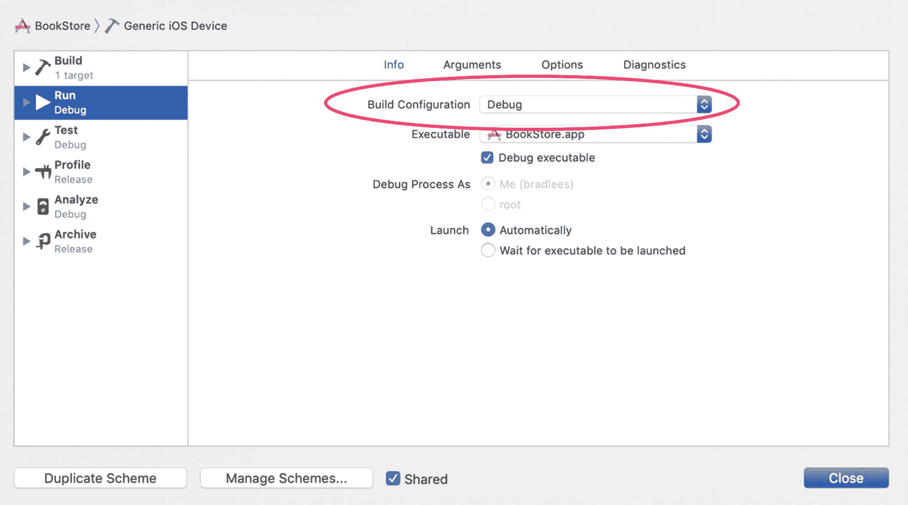

**图 13-1.** 选择调试配置

虽然本书不会讨论 Xcode 方案，但只需知道，默认情况下，Xcode 为你创建的任何 macOS、iOS、watchOS 或 tvOS 项目都提供了发布配置和调试配置。就本章而言，主要区别在于发布配置不会添加调试应用程序所需的任何程序信息，而调试配置则会。


## 设置断点

要查看程序中正在发生的事情，你需要让程序在你作为程序员感兴趣的特定位置暂停。*断点* 可以实现这一点。在图 13-2 中，程序的第 24 行设置了一个断点。要设置断点，只需将鼠标光标悬停在该行号上（不是程序文本，而是程序文本左侧的数字 24）并单击一次。你会看到行号后面出现一个蓝色的小箭头。这表示已设置了一个断点。

如果没有显示行号，只需从主菜单中选择 Xcode ➤ 偏好设置，点击“文本编辑”标签页，然后选中“行号”复选框。

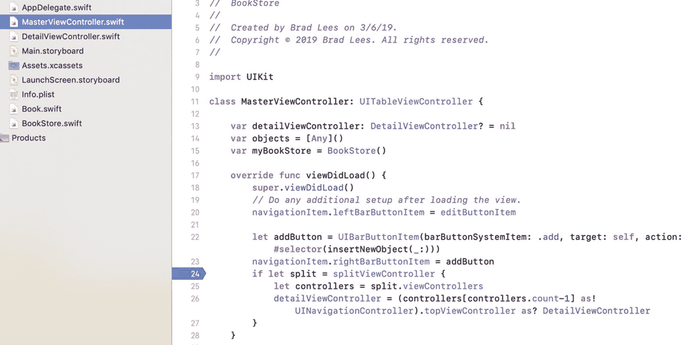

图 13-2. 你的第一个断点

可以通过将断点拖拽到行号列的左侧或右侧然后释放来移除它。你也可以右键点击（或按住 Control 键点击）该断点，然后会出现删除或禁用断点的选项。图 13-3 展示了断点的右键菜单。如果你认为将来可能还会用到该断点，禁用它会很方便。

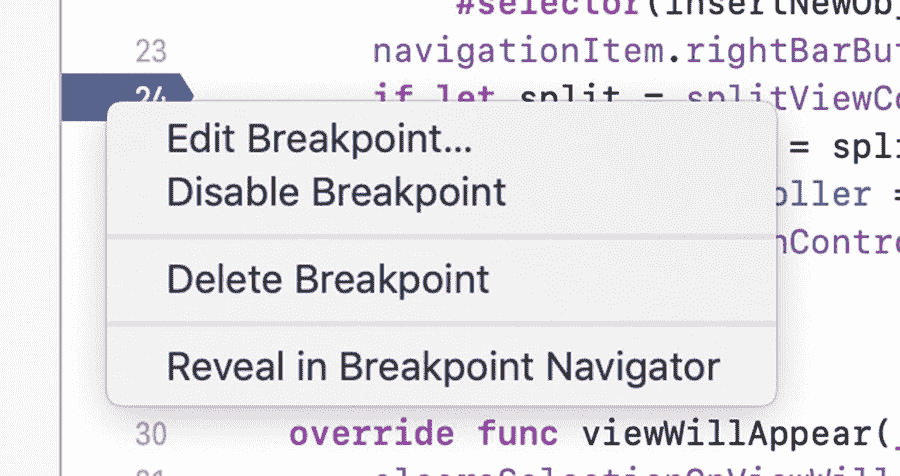

图 13-3. 右键点击一个断点

设置和删除断点是非常直接明了的操作。

## 使用断点导航器

对于小项目，了解所有断点的位置并不困难。然而，一旦项目变得比你的小型 `BookStore` 应用更大时，管理所有断点可能会变得有点复杂。幸运的是，Xcode 提供了一种简单的方法来列出应用程序中的所有断点，它被称为断点导航器。只需点击导航选择栏中的断点导航器图标，如图 13-4 所示。

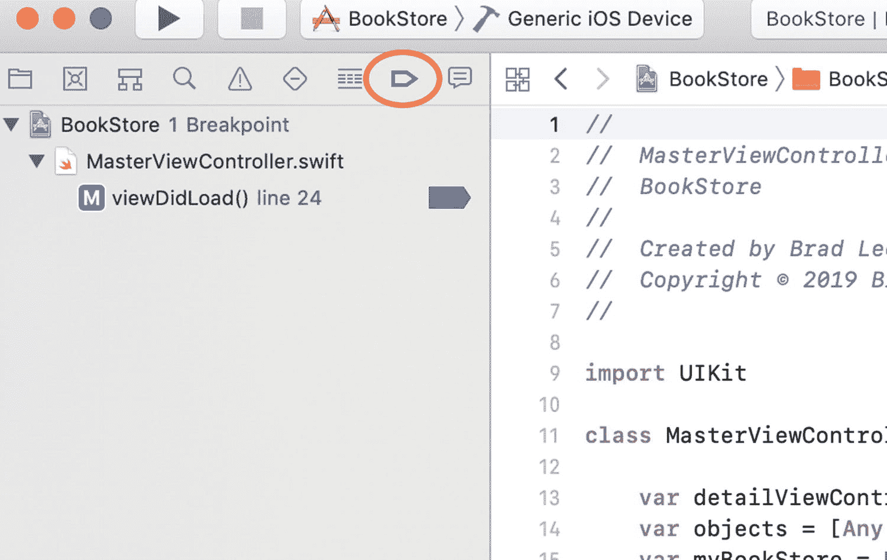

图 13-4. 在 Xcode 中访问断点导航器

点击该图标后，导航器将按源文件分组列出应用程序中当前定义的所有断点。你可以使用展开箭头来显示或隐藏断点。从这里，点击一个断点会跳转到包含该断点的源文件。你也可以在此处轻松地删除和禁用断点。

要在断点导航器中禁用/启用一个断点，请点击列表中（或任何出现的地方）的蓝色断点图标。不要点击行；必须点击那个蓝色的小图标，如图 13-5 所示。

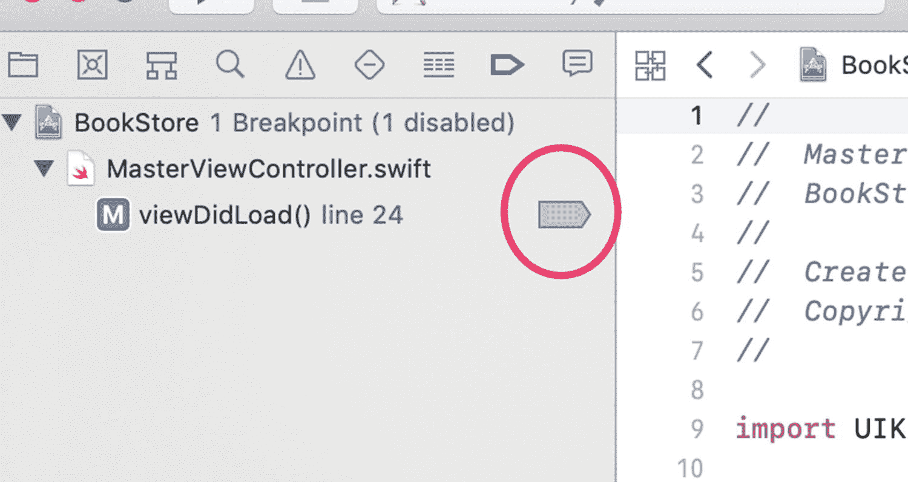

图 13-5. 使用断点导航器启用/禁用断点

有时禁用一个断点比删除它更方便，特别是当你计划在同一个位置再次设置断点时。调试器不会在这些变灰的断点上暂停，但它们会保留在原位，从而可以方便地重新启用，并作为代码中重要区域的标记。

也可以从断点导航器中删除断点。只需选择一个或多个断点，然后按 Delete 键即可。请确保选择了正确的要删除的断点，因为此操作没有撤销功能。

还可以选择与断点关联的文件。在这种情况下，如果你在断点导航器中选中列出的文件并按 Delete 键，那么该文件中的所有断点都将被删除。

请注意，断点是根据它们所在的文件进行分类的。在图 13-5 中，文件是 `DetailViewController.swift` 和 `MasterViewController.swift`，断点列在这些文件名下方。图 13-6 展示了一个包含多个断点的文件的示例。

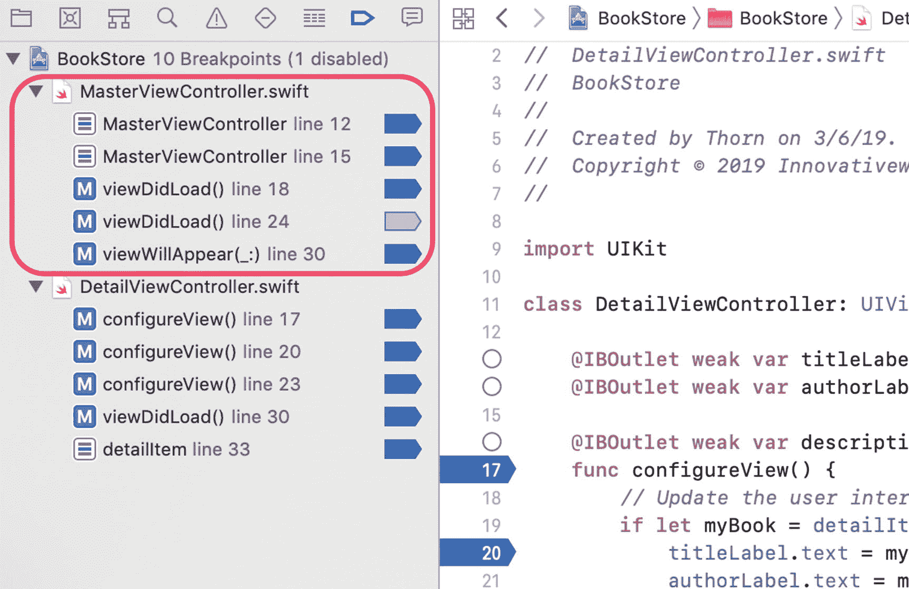

图 13-6. 包含多个断点的文件

## 调试基础

在图 13-2 所示的语句处设置一个断点。接下来，如图 13-7 所示，点击“运行”按钮来编译项目，并在 Xcode 调试器中启动它。


图 13-7. Xcode 工具栏中的“构建并运行”和“停止”按钮

项目构建完成后，调试器将启动。屏幕会显示调试窗口，程序将在带有断点的行处停止执行，如图 13-8 所示。

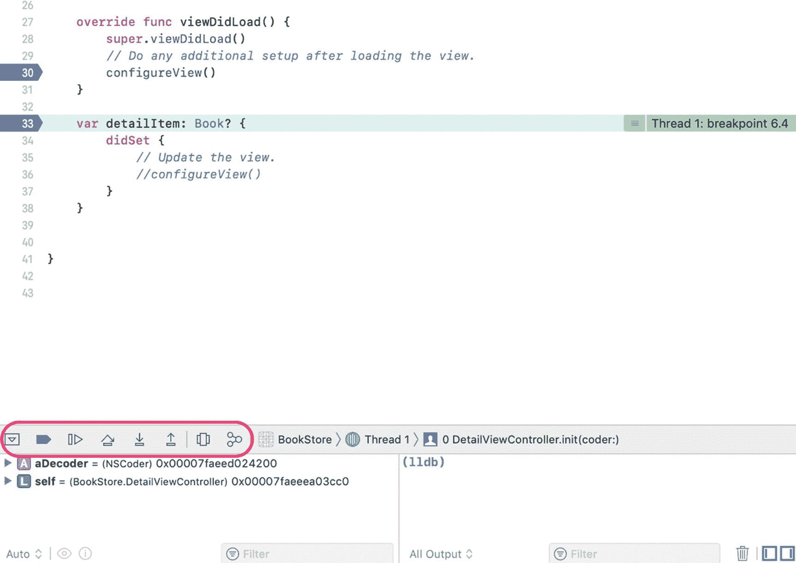

图 13-8. 调试器视图，执行停在第 33 行

调试器视图增加了一些额外的窗口。以下是图 13-8 中调试器视图的不同部分：

- **调试器控制（在图 13-8 中用圆圈标出）**：调试控制可以暂停、继续、单步跳过、单步进入和单步跳出程序中的语句。步进控制最为常用。左侧第一个按钮用于显示或隐藏调试器视图。在图 13-8 中，显示了调试器视图。图 13-9 标出了调试器视图的不同部分。

    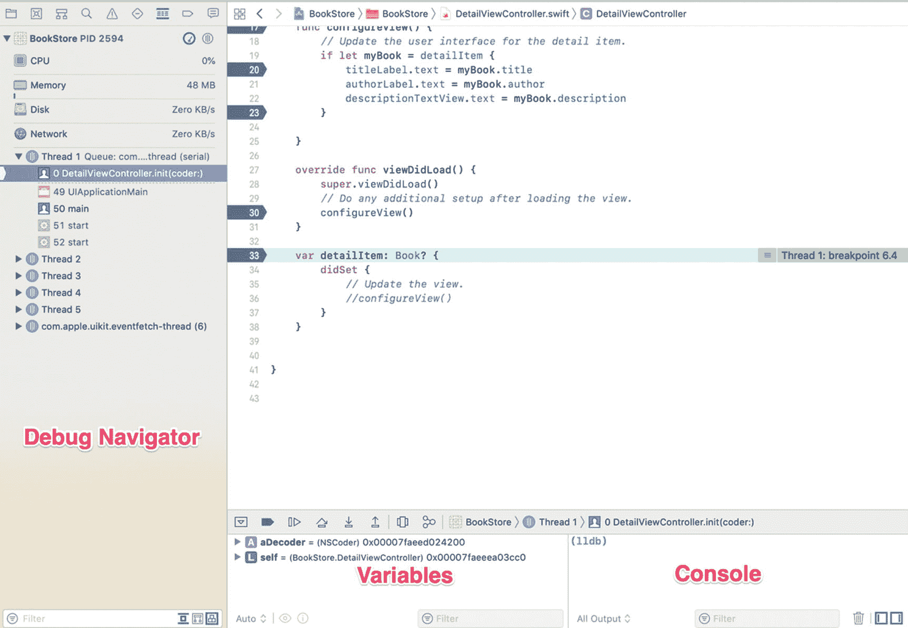

    图 13-9. 调试器位置

- **变量**：变量视图显示当前作用域内的变量。点击变量名左侧的小三角形可以展开它。

- **控制台**：当发生崩溃或异常时，输出窗口会显示有用信息。此外，所有 `NSLog` 或 `print` 输出都会在这里显示。

- **调试导航器**：堆栈跟踪显示调用栈以及程序中当前活动的所有线程。栈是所调用方法的层次视图。例如，`UIApplicationMain` 调用了 `UIViewController` 类。这些方法调用会“堆叠”起来，直到它们最终返回。


### 使用调试器控件

如前所述，调试器启动后，视图会发生变化。显示的是调试控件（如图 13-8 中圆圈标记处）。这些控件非常直观，其说明见表 13-1。

**表 13-1.** Xcode 调试控件

| 控件 | 说明 |
| --- | --- |
|  | 点击**停止**按钮将停止程序的执行。如果 iPhone 或 iPad 模拟器正在运行该应用程序，它也会停止，就像用户强制退出应用一样。点击**运行**按钮（看起来像播放按钮）会启动调试。如果应用程序当前处于调试模式，再次点击**运行**按钮将从头重新开始调试应用程序；这相当于先停止再重新开始。 |
| 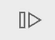 | 点击此按钮会导致程序**继续**执行。程序将继续运行，直到结束、**停止**按钮被点击，或程序遇到另一个断点。 |
|  | 当调试器停在某个断点时，点击**单步跳过**按钮将导致调试器执行当前代码行，并停在下一行代码。 |
| 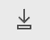 | 点击**单步进入**按钮将导致调试器进入指定的函数或方法。如果需要在代码中跟踪到特定的方法或函数，这一点很重要。只有项目拥有源代码的方法才能单步进入。 |
|  | **单步跳出**按钮将导致当前方法完成执行，然后调试器将返回到最初调用它的方法。 |

### 使用步进控件

为了练习使用步进控件，让我们单步进入一个方法。顾名思义，**单步进入**按钮会跟随程序执行进入高亮显示的方法或函数。从项目管理器中选择 `DetailViewController.swift` 文件。然后在第 31 行（即调用 `self.configureView()` 的位置）设置一个断点。点击**运行**按钮，并从列表中选择一本书。您的屏幕应类似于图 13-10。

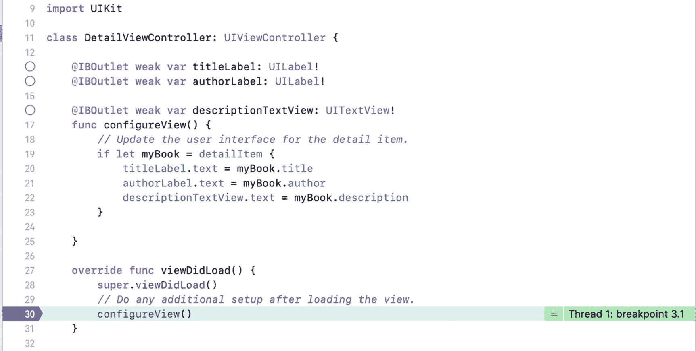

**图 13-10.** 调试器停在 30 行

点击**单步进入**按钮，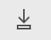，这将导致调试器进入 `DetailViewController` 对象的 `configureView()` 方法。屏幕应类似于图 13-11。

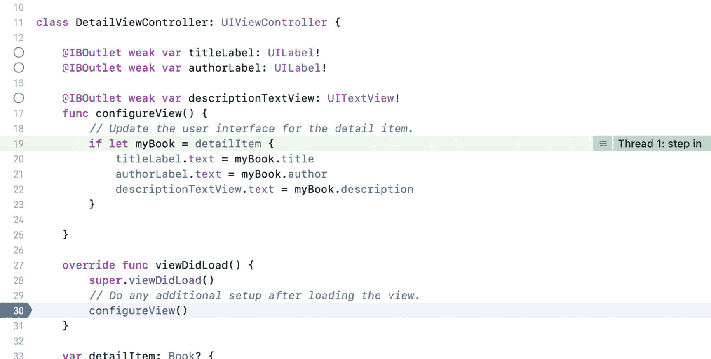

**图 13-11.** 单步进入 `DetailViewController` 对象的 `configureView()` 方法

**单步跳过**控件，，会继续执行程序，但不会进入方法内部。它只是执行该方法并继续执行到下一行。**单步跳出**，，有点像**单步进入**的反向操作。如果点击了**单步跳出**按钮，当前方法会继续执行直到完成。然后调试器会返回到点击**单步进入**之后的那一行。例如，如果在图 13-9 所示的代码行上点击了**单步进入**按钮，然后又点击了**单步跳出**按钮，调试器将返回到 `DetailViewController.swift` 文件的 `viewDidLoad()` 方法中，位于图 13-9 所示语句之后（示例中为第 31 行），也就是点击**单步进入**时所在的那一行。

### 查看线程窗口和调用栈

如前所述，调试导航器会显示当前线程。但是，它也会显示调用栈。如果你对比图 13-9 和图 13-10 在线程窗口方面的差异，可以看到图 13-10 列出了 `configureView()` 方法，这是因为 `DetailViewController` 调用了 `configureView()` 方法。

现在，调用栈并不仅仅是一个*已经*被调用的函数列表；相反，它是一个当前*正在*被调用的函数列表。这是一个重要的区别。一旦 `configureView()` 方法执行完毕并返回（第 26 行），`configureView()` 将不再出现在调用栈中。你可以把调用栈想象成一条面包屑轨迹。这条轨迹显示了如何返回你的起点。

### 调试变量

当应用程序正在调试并暂停时，可以通过将鼠标光标悬停在代码中的变量上来查看该变量的某些信息（除了其内存地址之外）。当你在局部作用域中，变量被赋值后，你很可能会在底部的变量视图中看到该变量。在图 13-12 中，你可以看到 `newBook` 变量，它的标题是 Swift for Absolute Beginners。你也可以看到没有分配作者或描述。在调试中，当你停在一行代码上时，是在该行代码执行之前。这意味着，即使你停在准备为 `author` 属性赋值的行上，该属性也尚未被赋值。

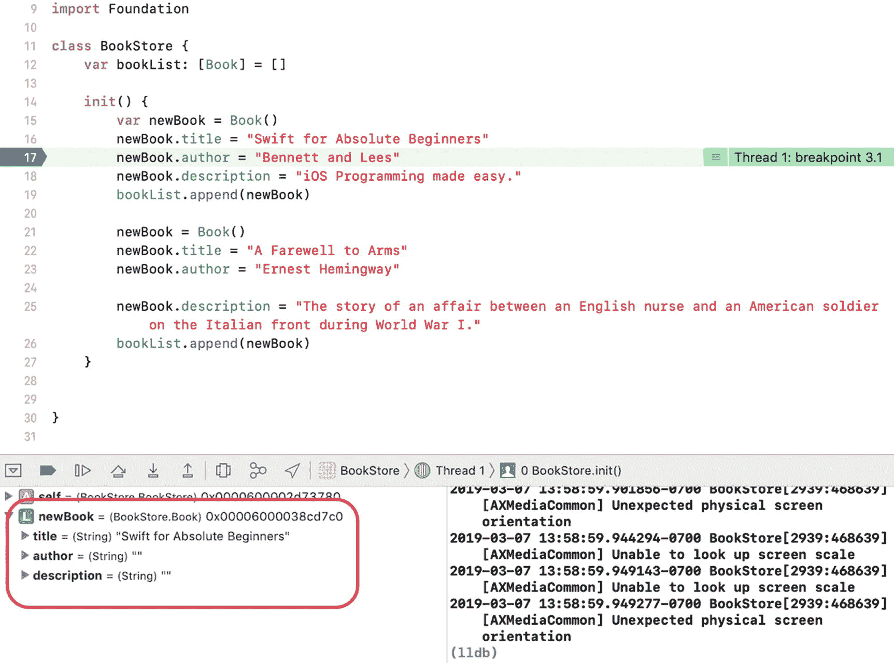

**图 13-12.** 查看变量值

将鼠标光标定位到代码中 `newBook` 变量出现的任何位置，点击展开三角以显示 `Book` 对象。你应该会看到图 13-13 中显示的内容。

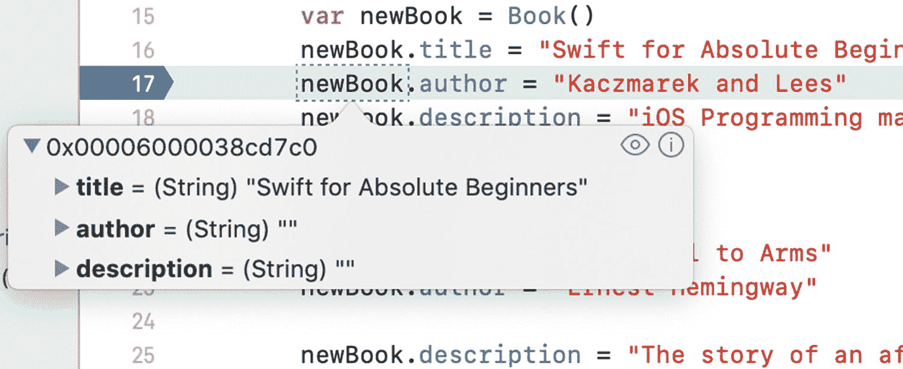

**图 13-13.** 悬停在 `newBook` 变量上可显示一些信息

将鼠标悬停到 `newBook` 变量上会显示其信息。在图 13-13 中，你可以看到 `newBook` 变量已展开。

## 处理代码错误和警告

虽然编码错误和警告并不完全是 Xcode 调试器的一部分，但修复它们却是整个调试过程中的一个环节。在程序可以运行（无论是否使用调试器）之前，必须修复所有错误。警告不会阻止程序构建，但它们可能在程序执行期间导致问题。最好是完全没有任何警告。


### 错误

让我们先来看几种类型的错误。首先，在代码中添加一个错误。在 `MasterViewController.swift` 文件的第 15 行，将以下代码：

```
var myBookStore: BookStore = BookStore()
```

修改为：

```
var myBookStore: BookStore = BookStore[]
```

保存更改，然后按 `⌘+B` 构建项目。此时会出现一个错误，如图 13-14 所示，该错误可能立即显示，也可能在构建后出现。

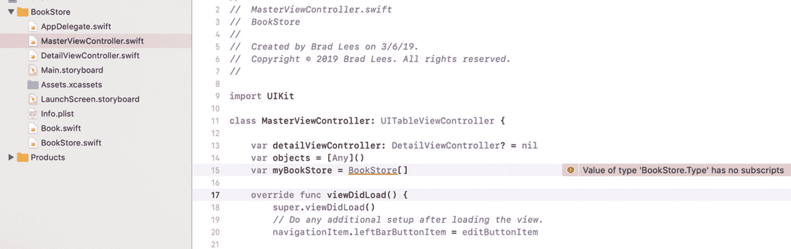

图 13-14. 在 Xcode 中查看错误

接下来，点击带有感叹号的三角形图标，切换到问题导航器窗口，如图 13-15 所示。此视图显示程序中当前的所有错误和警告——不仅限于当前文件 `MainViewController.swift`，而是所有文件。错误以红色八边形内的白色感叹号显示。在本例中，您有一个错误。如果错误无法在屏幕上完全显示或难以阅读，只需将鼠标悬停在问题导航器中的错误上，即可显示完整错误信息。

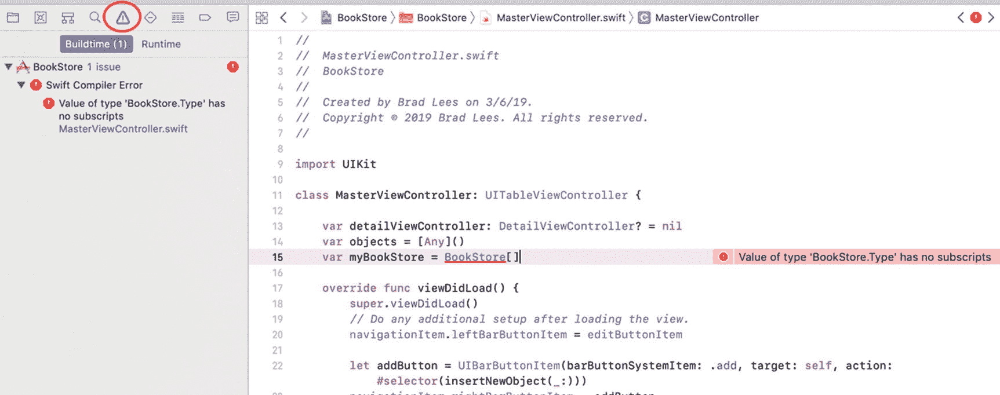

图 13-15. 查看问题导航器

通常，错误会指向问题所在。在上述情况中，`BookStore` 对象被初始化为数组而非对象。

请继续修复此错误，将 `[]` 改为 `()`。

### 警告

警告表示程序存在潜在问题。如前所述，警告不会阻止程序构建，但可能在程序执行时引发问题。本书不讨论那些在程序执行过程中可能或可能不会引发问题的警告；然而，消除程序中的所有警告是一个良好的实践。

将以下代码添加到 `MasterViewController.swift` 的 `viewDidLoad` 方法中：

```
if false {
print("False")
}
```

由于 `false` 永远不会等于 `true`，`print` 命令将永远不会被执行。按 `⌘+B` 构建项目，将会显示一个警告，如图 13-16 所示。

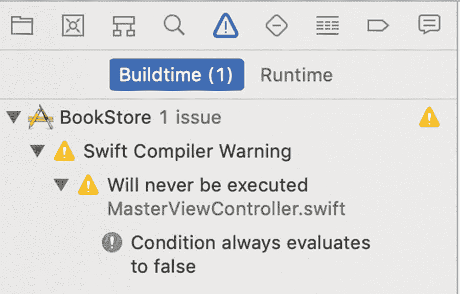

图 13-16. 在问题导航器中查看警告

点击问题导航器中的第一个警告，将显示导致该问题的代码，如图 13-17 所示。

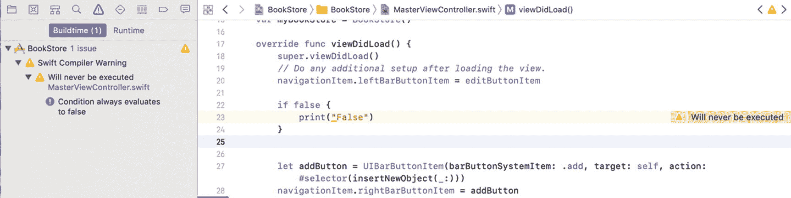

图 13-17. 查看第一个警告

在主窗口中，您可以查看警告。事实上，此警告给出了代码问题的线索。警告内容如下：

> *“Will never be executed”*

这是一个简单的警告示例。您可能会收到各种情况的警告，例如未使用的变量、不完整的委托实现以及不可执行的代码。清理代码中的警告以避免将来出现问题是一个良好的实践。

## 总结

本章介绍了免费的 Apple Xcode 调试器的高级功能。无论价格如何，Xcode 都是一款出色的调试器。具体而言，在本章中，您学习了以下内容：

- 术语 *bug* 的起源以及调试器的定义
- Xcode 调试器的高级功能，包括断点设置和程序单步执行
- 使用名为继续、单步跳过、单步跳入和单步跳出的调试控制
- 处理各种调试器视图，包括线程（调用堆栈）、变量视图、文本编辑器和控制台输出
- 查看程序变量
- 处理错误和警告

脚注 1

