# 14. 一个 Swift 语言编写的 iPhone 应用

在第 8 章中，您使用 Swift 创建了一个基本的书店 iPhone 应用。在本章中，您将为该应用添加一些功能，使其更加实用，并运用您在本中学到的许多技术，例如创建类、使用委托和协议、以及使用动作和出口。您还将学习一些新技术，如开关控制器、`UIAlertController` 和地标。

## 开始动手

第 8 章中的书店示例允许您在表格视图中查看书店中的书籍，然后点击书籍查看其详细信息。在本章中，您将为第 8 章的书店应用添加以下功能：

- 添加书籍
- 删除书籍
- 修改书籍

请参见图 14-1 和图 14-2。

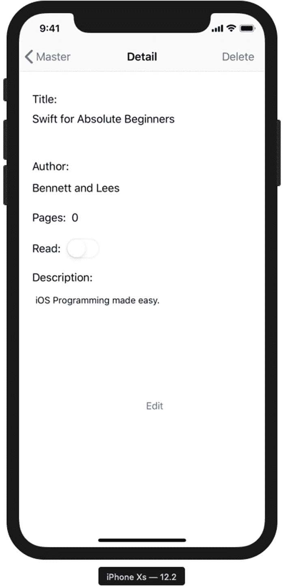

图 14-2. 添加编辑和删除功能，同时使用 UISwitch

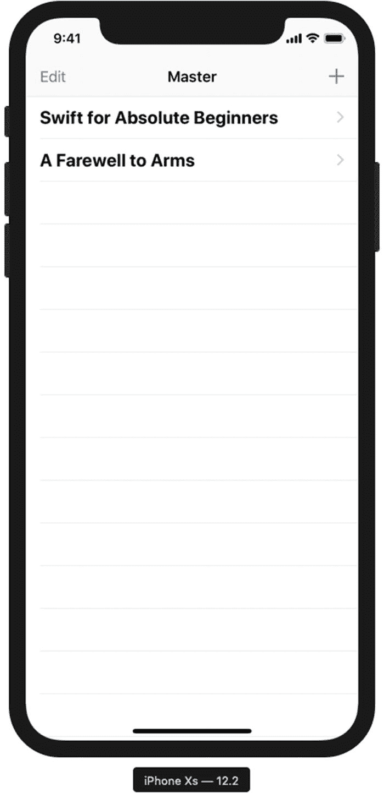

图 14-1. 添加书籍功能

用户将能够使用新的 `AddBookViewController` 将书籍添加到他们的 `BookStore` 中。首先，将代码清单 14-1 中的代码添加到 `MasterViewController.swift` 文件的 `prepareForSegue` 方法中。

```
42     // MARK: - Segues

44     override func prepare(for segue: UIStoryboardSegue, sender: Any?) {
45         if segue.identifier == "showDetail" {
46             if let indexPath = tableView.indexPathForSelectedRow {
47                 let selectedBook: Book = myBookStore.bookList[indexPath.row]
48                 let controller = (segue.destination as! UINavigationController).topViewController as! DetailViewController
49                 controller.detailItem = selectedBook
50                 controller.delegate = self
51                 controller.navigationItem.leftBarButtonItem = splitViewController?.displayModeButtonItem
52                 controller.navigationItem.leftItemsSupplementBackButton = true
53             }
54         } else if segue.identifier == "addBookSegue" {
55             let vc = segue.destination as! AddBookViewController
56             vc.delegate = self
57         }
58     }
```

代码清单 14-1. `prepareForSegue` 方法


### 备注

第 42 行的 `// MARK: - Segues` 有助于组织你的代码。

`// MARK:` 被称为**地标**（landmark）。它是 Objective-C 中使用的 `#pragma mark` 的替代品。地标有助于在跳转栏中分割代码，让你能够快速定位到地标所指示的代码段。当你在 `// MARK:` 后面输入内容时，Xcode 会将该地标放置在跳转栏的下拉列表中，如图 14-3 所示。如果只输入 `// MARK: -`，Xcode 会在跳转栏的下拉列表中添加一条分隔线。Swift 还支持 `// TODO:` 和 `// FIXME:` 地标，用于注释代码，并使其显示在跳转栏中。

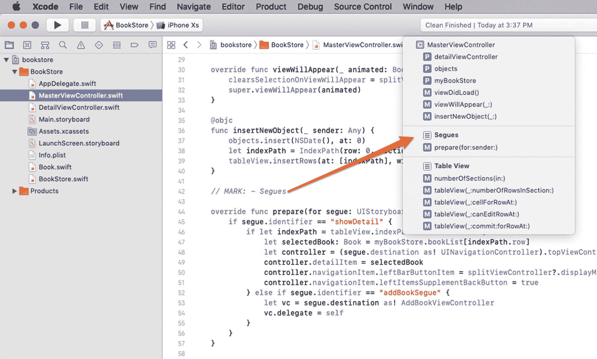

图 14-3. Swift 的地标

现在，添加清单 14-1 第 53 行提到的新视图控制器 `AddBookViewController`。通过将一个视图控制器拖拽到 `Main.storyboard` 文件中，向故事板添加一个“视图控制器”对象。然后添加图 14-4 中的对象，以使用户能够添加新书。可以自由移动场景，使其相互关系更清晰，如图 14-4 所示。

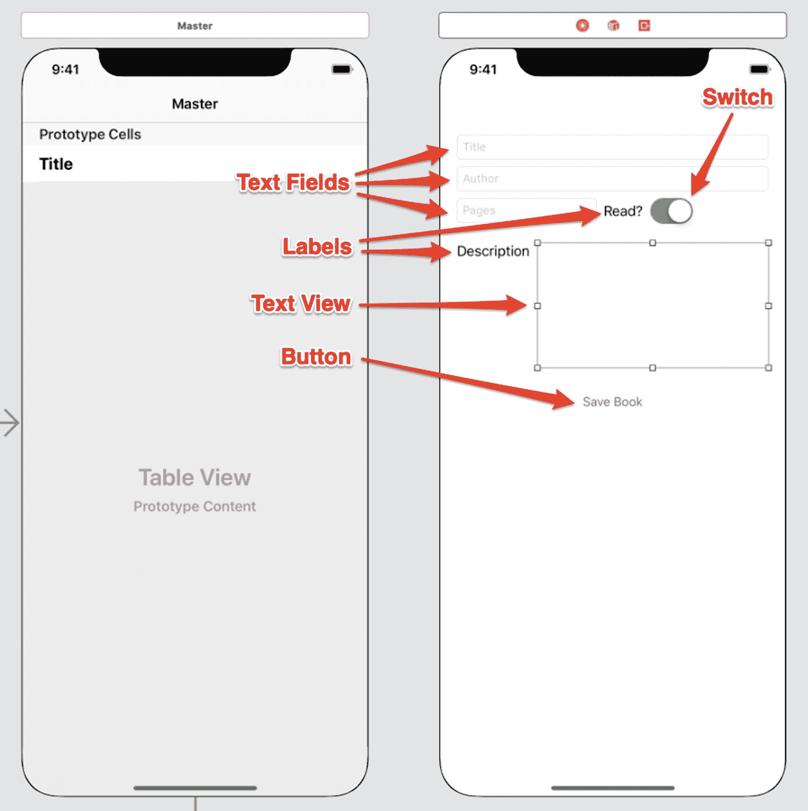

图 14-4. 添加 `AddBookViewController` 和对象

从对象库中拖拽一个“栏按钮项”到 `MasterViewController` 导航栏的右上角，如图 14-5 所示。

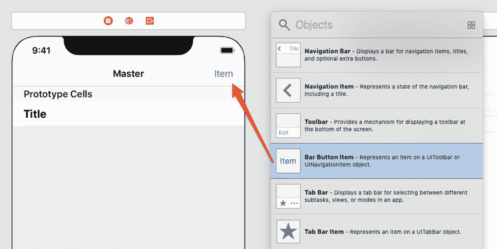

图 14-5. 向 `MasterViewController` 添加一个栏按钮项

接下来，选择新添加的“栏按钮项”，打开属性检查器，将系统项从“自定义”更改为“添加”，如图 14-6 所示。

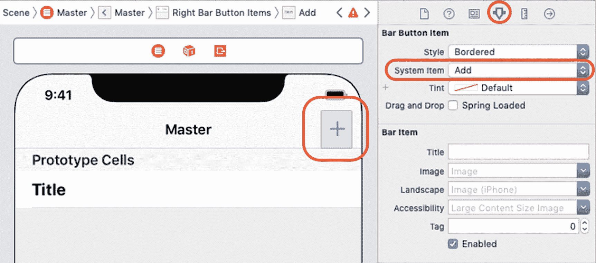

图 14-6. 将栏按钮项从“自定义”更改为“添加”

通过按住 Control 键拖拽（或右键拖拽）从“添加”按钮栏项到新的视图控制器，为“添加”按钮栏项添加一个“展示 Segue”对象，如图 14-7 所示。

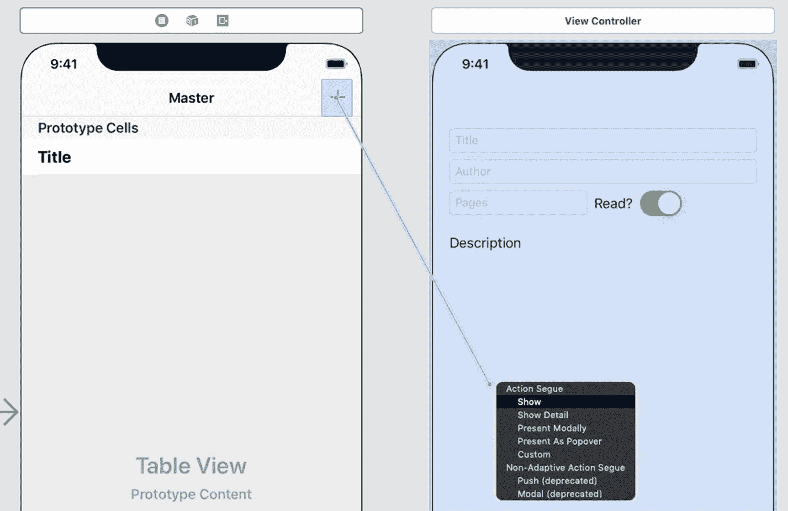

图 14-7. 向新的视图控制器添加一个“展示 Segue”对象

修改 `MasterViewController.swift` 中的 `insertNewObject` 函数，如清单 14-2 所示。

```
35     @objc
36     func insertNewObject(_ sender: Any) {
37         performSegue(withIdentifier: "addBookSegue", sender: nil)
38     }
清单 14-2
insertNewObject 函数
```

通过点击 segue 箭头，并将标识符设置为 `addBookSegue` 来识别“Segue”对象，如图 14-8 所示。

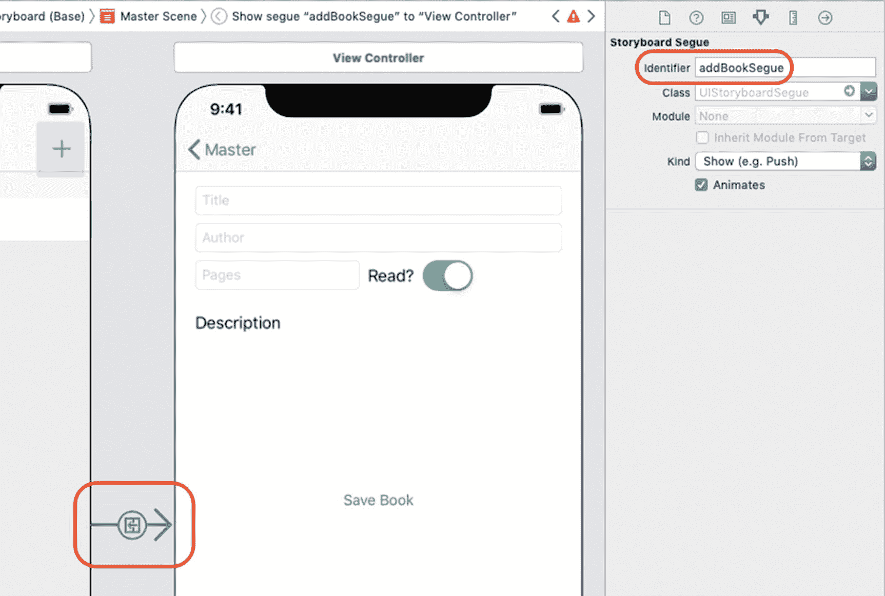

图 14-8. 将 Segue 命名为 `addBookSegue`

设置好 segue 标识符后，选择 `AddBookViewController` 场景，点击 Xcode 右下角的“解决自动布局问题”按钮，然后选择“添加缺失的约束”，如图 14-9 所示。

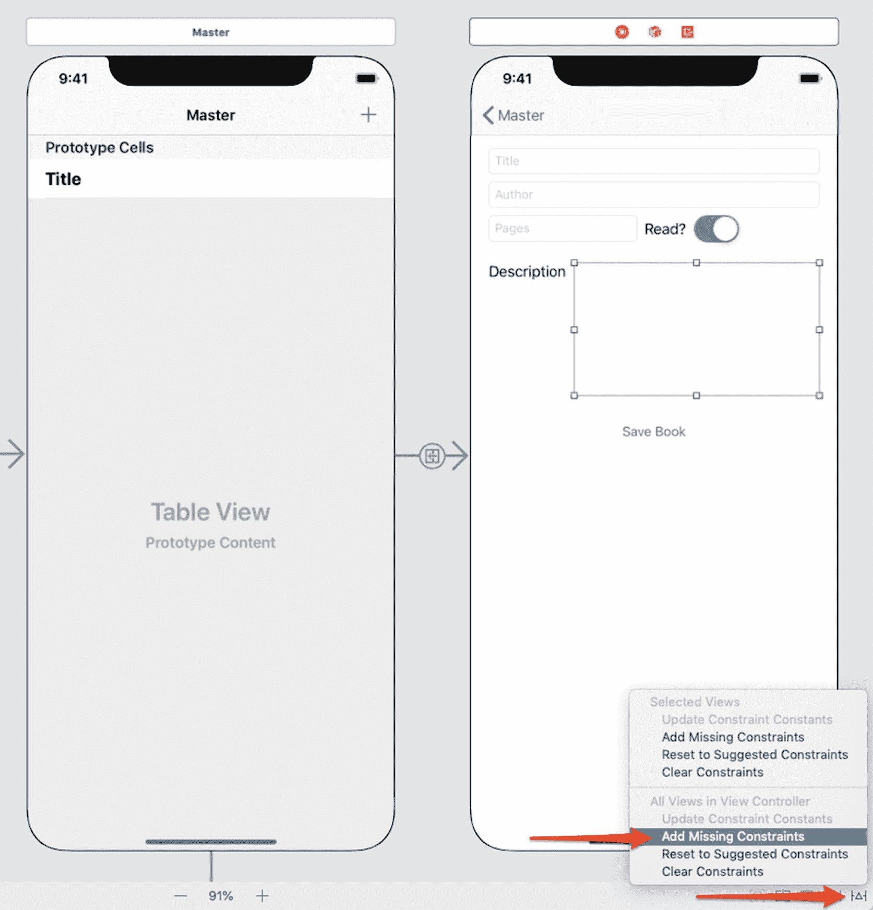

图 14-9. 添加缺失的约束

现在你需要创建一个 Swift 类来配合新的视图控制器。创建一个新的 iOS Cocoa Touch 类文件，并将其命名为 `AddBookViewController`，如图 14-10 所示。确保你选择 `UIViewController` 作为其子类。

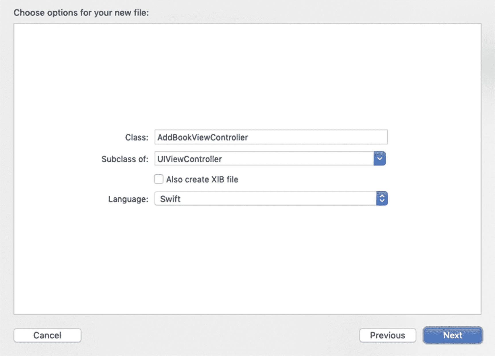

图 14-10. 添加 `AddBookViewController` 类

现在你需要将新的 `AddBookViewController` 类关联到新的视图控制器。在 `Main.storyboard` 中选择该视图控制器，然后在身份检查器中将类设置为 `AddBookViewController`，如图 14-11 所示。

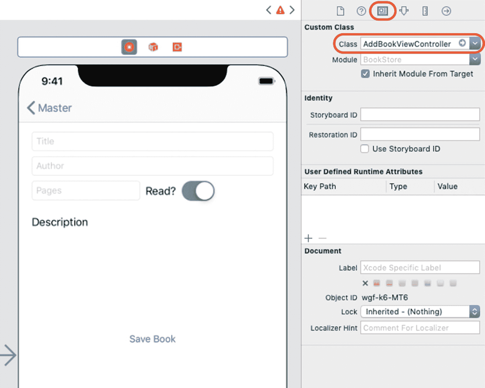

图 14-11. 将 `AddBookViewController` 类关联到新的视图控制器

接下来，选择属性检查器，将视图控制器的标题更改为“添加图书”，如图 14-12 所示。

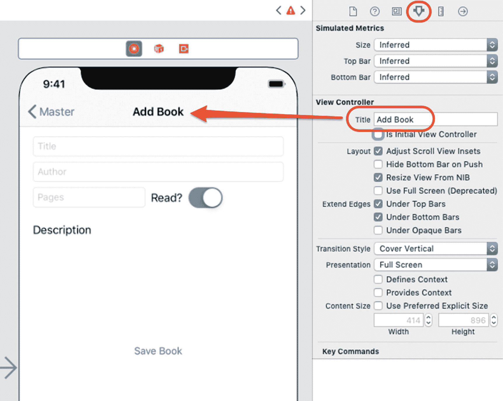

图 14-12. 将视图控制器的标题更改为“添加图书”

打开 `AddBookViewController.swift` 文件，并添加清单 14-3 中所示的代码。

```
9 import UIKit

11 protocol BookStoreDelegate {
12     func newBook(_ controller: AnyObject, newBook: Book)
13     func editBook(_ controller: AnyObject, editBook: Book)
14     func deleteBook(_ controller: AnyObject)
15 }

17 class AddBookViewController: UIViewController {
18     var book = Book()
19     var delegate: BookStoreDelegate?
20     var read = false
21     var editBook = false

23     @IBOutlet weak var titleText: UITextField!
24     @IBOutlet weak var authorText: UITextField!
25     @IBOutlet weak var pagesText: UITextField!
26     @IBOutlet weak var switchOutlet: UISwitch!

28     @IBOutlet weak var descriptionText: UITextView!

30     override func viewDidLoad() {
31         super.viewDidLoad()
32         if editBook == true {
33             self.title = "编辑图书"
34             titleText.text = book.title
35             authorText.text = book.author
36             pagesText.text = String(book.pages)
37             descriptionText.text = book.description
38             if book.readThisBook {
39                 switchOutlet.isOn = true
40             }
41             else {
42                 switchOutlet.isOn = false
43             }
44         }

46         // 在此处执行任何额外的视图加载后设置。
47     }

49     override func didReceiveMemoryWarning() {
50         super.didReceiveMemoryWarning()
51         // 处理任何可以重新创建的资源。
52     }

54     @IBAction func saveBookAction(_ sender: UIButton) {
55         book.title = titleText.text!
56         book.author = authorText.text!
57         book.description = descriptionText.text
58         if let text = pagesText.text, let pages = Int(text) {
59             book.pages = pages
60         }
61         if switchOutlet.isOn {
62             book.readThisBook = true
63         } else {
64             book.readThisBook = false
65         }
66         if (editBook) {
67             delegate?.editBook(self, editBook:book)
68         } else {
69             delegate?.newBook(self, newBook:book)
70         }
71     }
72 }
清单 14-3
AddBookViewController.swift 文件

向 `Book` 类添加两个属性：`pages` 和 `readThisBook`。这些属性显示在清单 14-4 的第 15 行和第 16 行。

```
11 class Book {
12     var title: String = ""
13     var author: String = ""
14     var description: String = ""
15     var pages: Int = 0
16     var readThisBook: Bool = false
17 }
清单 14-4
Book 类的更改
```


### 开关

在`AddBookViewController`类中连接插座，将插座圆圈拖到对应控件上，如图 14-13 所示。

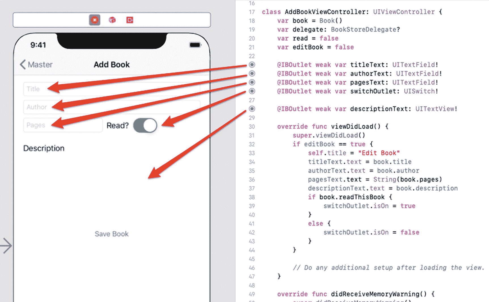

*图 14-13 连接插座*

通过将插座圆圈拖到“保存图书”按钮上来连接`s` `aveBookAction`动作，如图 14-14 所示。

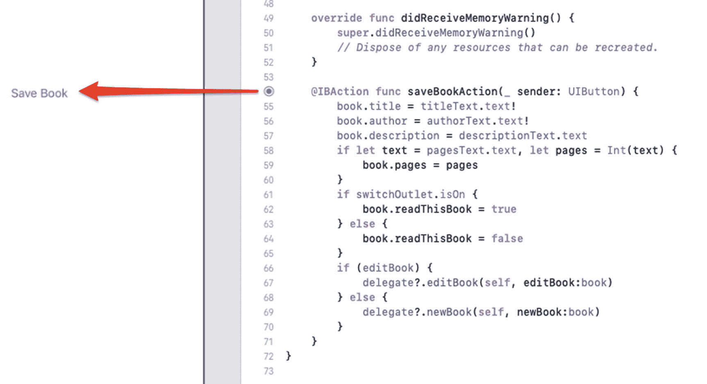

*图 14-14 连接`s` `aveBookAction`*

在`DetailViewController`类中，在`configureView`方法上方添加如代码清单 14-5 所示的代码。

```
17     @IBOutlet weak var pagesLabel: UILabel!
18     @IBOutlet weak var readSwitch: UISwitch!

20     var delegate: BookStoreDelegate? = nil

22     var myBook = Book()
代码清单 14-5
新属性
```

### 警告控制器

为`DetailViewController`添加“页码”、“已读”和“编辑”控件。通过将插座圆圈拖到对应控件上来连接插座，如图 14-15 所示。

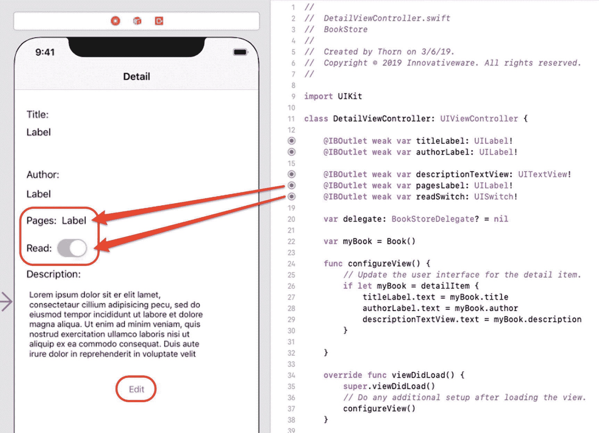

*图 14-15 添加“页码”和“已读”插座*

在此视图中，通过取消选中属性检查器中的`Enabled`属性来禁用“已读”开关。

当在`DetailViewController`上点击“删除”按钮时，添加显示`UIAlertController`的代码，如代码清单 14-6 所示。

```
47     @IBAction func deleteBookAction(_ sender: UIBarButtonItem) {
48         let alertController = UIAlertController(title: "Warning",message:
49                                                 "Delete this book?",
50                                                 preferredStyle: .alert)

52         let noAction = UIAlertAction(title: "No", style: .cancel) { (action) in
53             print("Cancel")
54         }
55         alertController.addAction(noAction)

57         let yesAction = UIAlertAction(title: "Yes", style: .destructive) { (action) in
58             self.delegate?.deleteBook(self)
59         }
60         alertController.addAction(yesAction)

62         present(alertController, animated: false, completion: nil)
63     }
代码清单 14-6
显示`UIAlertController`
```

将“删除”条按钮项添加到右侧导航位置，并将其连接到该动作，如图 14-16 所示。

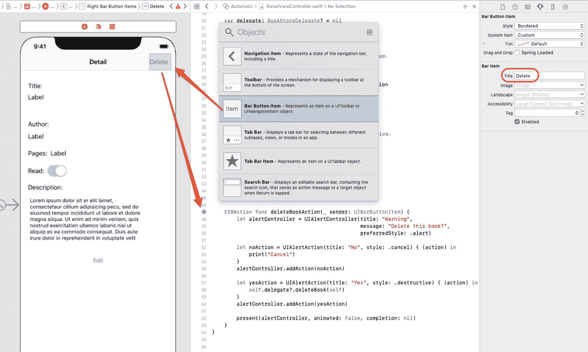

*图 14-16 添加右侧“删除”条按钮项及动作*

`UIAlertController`将警告用户当前显示在`DetailViewController`中的图书即将被删除，并允许用户决定是否删除。`UIAlertController`有两个按钮：“是”和“否”。当用户点击右侧条按钮项（删除）时，`UIAlertController`将如图 14-17 所示（完成时）。

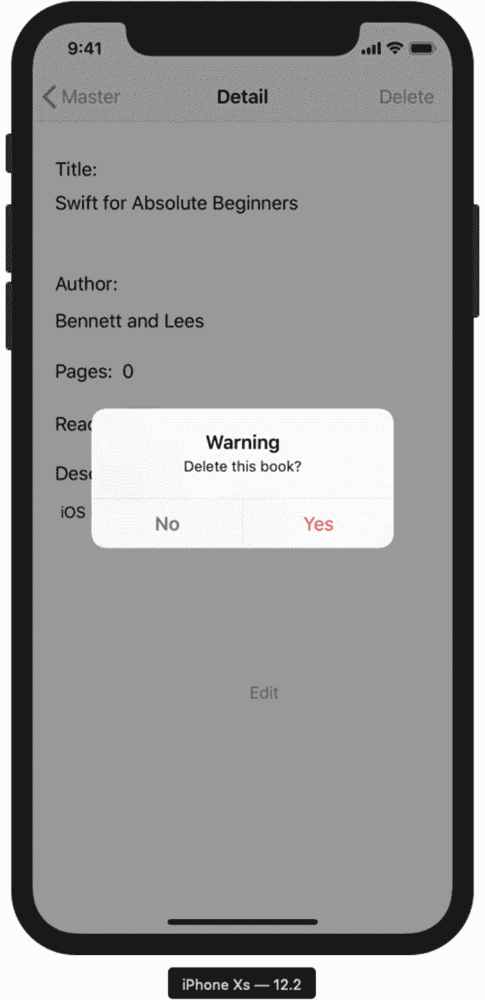

*图 14-17 显示的`UIAlertController`*

当用户点击“是”来删除图书时，你需要调用`deleteBook`委托方法，如`MasterViewController`类中所述。添加`BookStoreDelegate`，如代码清单 14-7 所示。

```
11 class MasterViewController: UITableViewController, BookStoreDelegate {
代码清单 14-7
添加`BookStoreDelegate`
```

现在我们来讨论三个委托方法：`newBook`、`deleteBook`和`editBook`，它们定义在`AddBookViewController`类的代码清单 14-3 中（第 11–15 行）。在`MasterViewController`类的末尾添加这三个方法，如代码清单 14-8 所示。

```
90     // MARK: - BookStoreDelegate Methods

92     func newBook(_ controller: AnyObject,newBook: Book) {
93         myBookStore.bookList.append(newBook)
94         tableView.reloadData()
95         navigationController?.popToRootViewController(animated: true)
96     }

98     func deleteBook(_ controller: AnyObject){
99         if let row = tableView.indexPathForSelectedRow?.row {
100             myBookStore.bookList.remove(at: row)
101         }
102         tableView.reloadData()
103         navigationController?.popToRootViewController(animated: true)
104     }


```swift
106     func editBook(_ controller: AnyObject, editBook: Book){
107         if let row = tableView.indexPathForSelectedRow?.row {
108             myBookStore.bookList[row] = editBook
109         }
110         tableView.reloadData()
111         navigationController?.popToRootViewController(animated: true)
112     }
```
代码清单 14-8
遵循该协议

---

`newBook` 方法通过将 `newBook` 追加到 `bookList` 数组中，向书店添加一本新书，如第 92 行所示。第 93 行随后通过调用所有表格视图委托方法重新加载表格视图：

```
numberOfSectionsInTableView
numberOfRowsInSection
cellForRowAtIndexPath
```

最后，通过调用 `popToRootViewController` 将 `DetailViewController` 从导航堆栈中弹出。从导航堆栈中弹出视图意味着该视图被移除，类似于点击返回按钮。

`deleteBook` 方法从 `bookList` 数组中移除书籍。首先，确定在 `tableView` 中选中的行，并使用该索引通过调用 `remove(at:)` 删除数组中的书籍，如第 99 行所示。

`editBook` 方法允许用户编辑 `bookList` 数组中现有的书籍。为此，该方法在选中的行处用编辑后的书籍替换数组中的对应元素，如第 107 行所示。

现在，将“添加书籍”场景向下移动到“详情”场景旁边，并从“编辑”按钮添加一个 Show Segue 到 `AddBookViewController`，如图 14-18 所示。

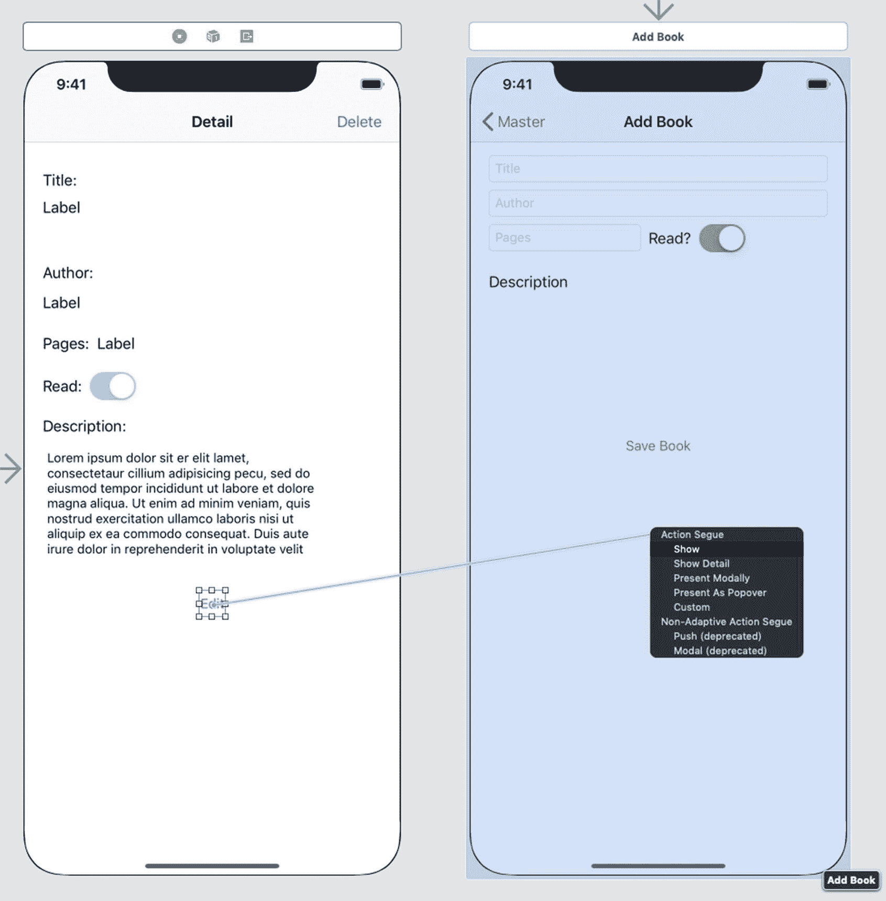

**图 14-18.** 添加编辑 Show Segue

选择您刚刚创建的 Segue，选择属性检查器，并将标识符命名为 `editDetail`。见图 14-19。

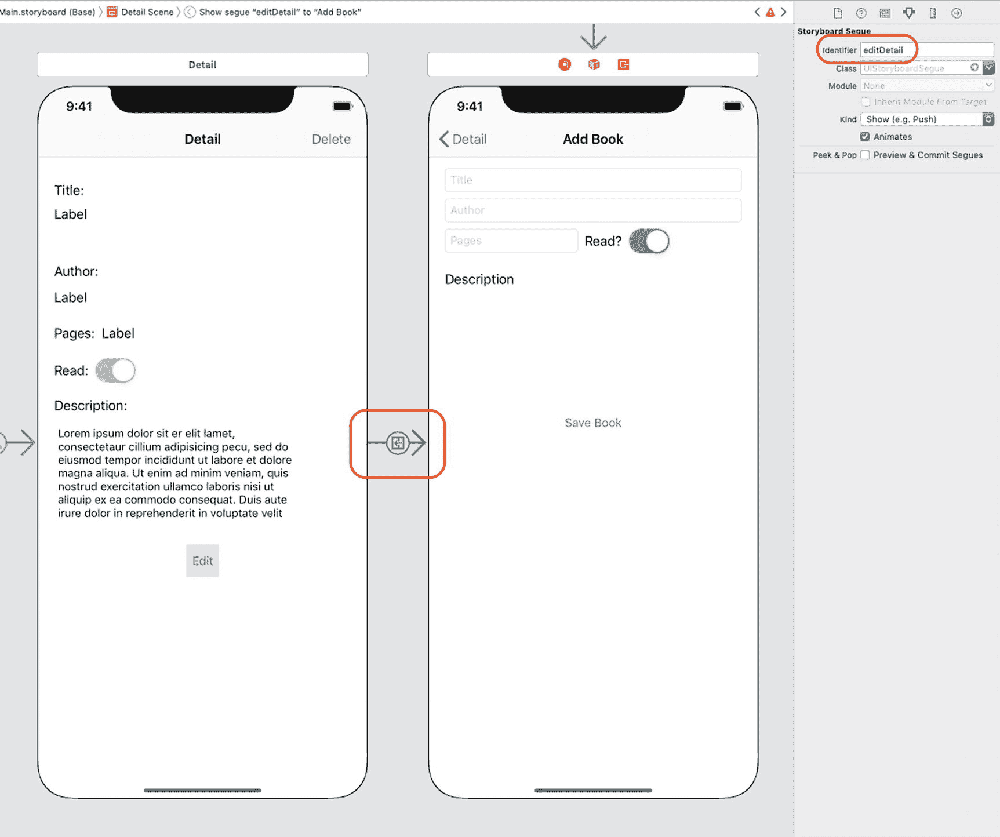

**图 14-19.** 命名 Segue 的标识符

在 `DetailViewController` 中，在 `configureView` 方法之前添加 `prepareForSegue` 方法，如代码清单 14-9 所示。

```swift
24     override func prepare(for segue: UIStoryboardSegue, sender: Any?) {
25         if segue.identifier == "editDetail" {
26             if let vc = segue.destination as? AddBookViewController {
27                 vc.delegate = delegate
28                 vc.editBook = true
29                 vc.book = myBook
30             }
31         }
32     }
```
代码清单 14-9
添加 `prepareForSegue` 方法

最后，修改 `DetailViewController` 中的 `configureView` 函数，以正确填充“页数”和“已读”开关的输出口，如代码清单 14-10 所示。

```swift
34     func configureView() {
35         if let detail = self.detailItem {
36             myBook = detail
37             titleLabel.text = myBook.title
38             authorLabel.text = myBook.author
39             descriptionTextView.text = myBook.description
40             pagesLabel.text = String(myBook.pages)
41             if myBook.readThisBook {
42                 readSwitch.isOn = true
43             }
44             else {
45                 readSwitch.isOn = false
46             }
47         }
48     }
```
代码清单 14-10
修改 `configureView`

## 应用总结

编译并运行该应用。您应该在 `delegate` 函数处设置断点以观察程序流程。这是一个很好的应用，用于了解如何利用委托将信息从一个视图传递到另一个视图。

此外，您还可以通过使用 Core Data 或 `UserDefaults` 为应用添加功能，使信息持久化。

### 练习

- 以原始程序为指导，向书店添加更多书籍。
- 增强 `Book` 类，使其能够存储另一个属性——例如价格或 ISBN。
- 通过使用 Core Data 或 `UserDefaults` 为应用添加持久化功能。

