# 15. Apple Watch 与 WatchKit

2014 年 9 月，苹果公司发布了 Apple Watch，并将其视为苹果历史上的新篇章。这款手表不仅能处理电话和短信，还能通过追踪心率和运动来评估佩戴者的健康状况。同时，苹果宣布了 WatchKit，这是一个专为开发 Apple Watch 应用而设计的框架。对于已经熟悉 UIKit 的开发者来说，WatchKit 会非常熟悉。

最初，Apple Watch 在开发方面存在一些严重限制。手表充当着 iPhone 应用的附加屏幕。这要求手表靠近手机才能运行，也导致应用运行缓慢。2015 年 6 月，苹果发布了 watchOS 2.0。这次更新包含了许多新功能，但对开发者来说最大的变化是能够创建代码在 Apple Watch 上运行而非在手机上运行的应用。开发者能够创建独立应用，这些应用性能更好，响应更迅速。现在，苹果已经发布了 watchOS 4.0，为开发者带来了更多改进。

## 创建 watchOS 应用时的注意事项

为 watchOS 进行开发的一大优势在于，所有开发工作都使用 Swift 或 Objective-C 完成，就像其他 iOS 设备一样。Apple Watch 确实有一些不同之处，在开始开发之前需要考虑：

- Apple Watch 的屏幕非常小。屏幕尺寸限制为 40 毫米或 44 毫米，具体取决于手表尺寸。这意味着您没有太多空间放置不必要的 UI 元素。您的界面需要紧凑且组织良好。此外，由于这两种尺寸相近，您需要创建一个界面，使其在两种尺寸上都能呈现良好效果。
- 在手机和手表之间共享数据需要一些规划。随着 watchOS 3.0 及现在的 5.0 版本，苹果使数据共享变得更加容易。主要是苹果增强了 `WCSession` 类。此类别的使用超出了本书的范围。
- watchOS 5.0 的 WatchKit 提供了多种与用户交互的方式，不仅通过应用，还通过速览、可操作的通知和复杂功能。编写良好的应用可以在合理的范围内利用多种交互方式。这些交互方式超出了本书的范围。

## 创建 Apple Watch 应用

第一步是在 Xcode 中创建一个新项目。在顶部，选择 watchOS 标题下的 Application 作为项目类型。然后选择 iOS App with WatchKit App，如图 15-1 所示。

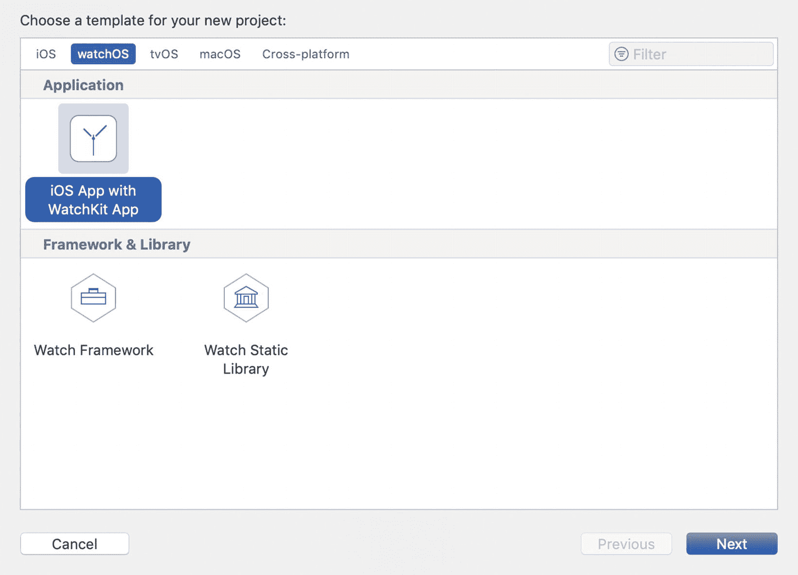

**图 15-1.** 创建 watchOS 应用

接下来，您将可以选择命名项目。我们将本章中的项目命名为 `BookStore`。您还会注意到 watchOS 应用与标准 iOS 应用有不同的选项。我们不会为此应用添加通知或复杂功能场景，因此请确保它们都未被选中，如图 15-2 所示。


### 注意

WatchKit 提供了 iOS 应用中不可用的额外交互类型。Glance 能让用户快速预览你的应用。例如，一个书店应用可以在 Glance 中显示畅销书排行榜。Glance 使用手表上的特殊界面。Complication 则允许你的应用在表盘本身上提供简洁信息。

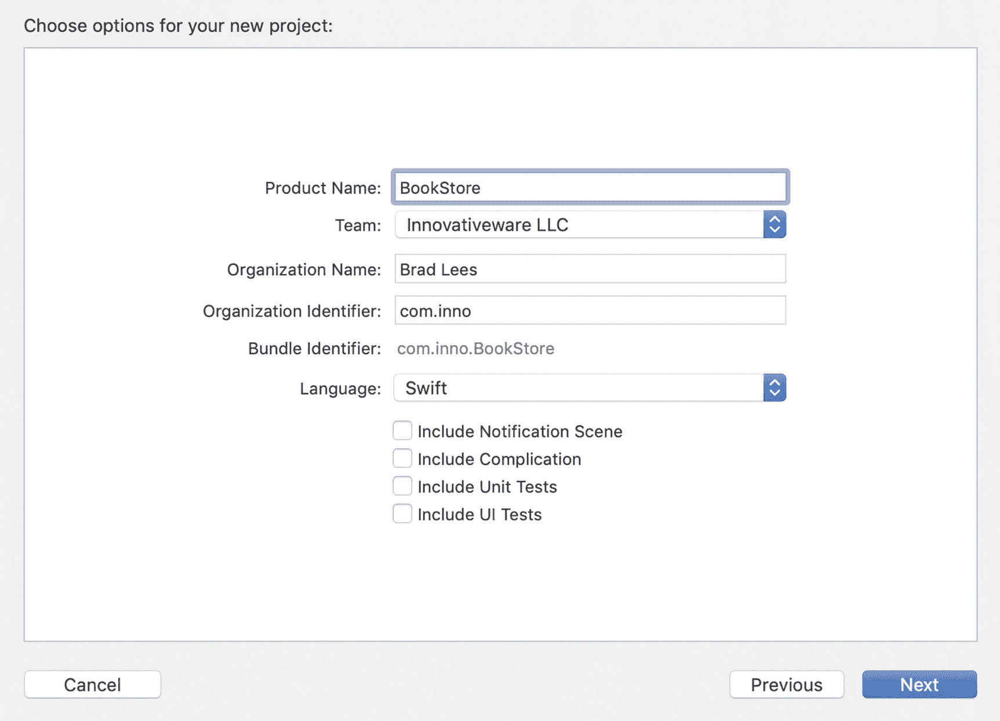

图 15-2. watchOS 应用选项

随后 Xcode 会提示你保存项目。保存后，你将看到新建的项目。在左侧，你会注意到项目中多了两个目标。一个是 BookStore WatchKit App，它包含应用的界面（故事板和资源）。第二个新目标是 BookStore WatchKit Extension，它将包含应用在 watchOS 上运行所需的所有代码。参见图 15-3。

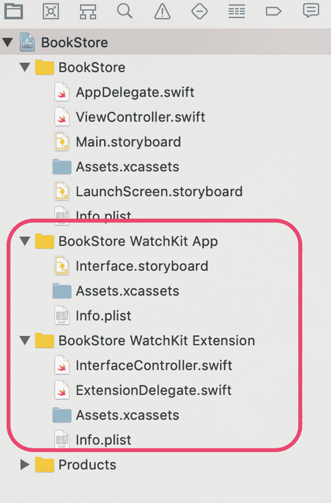

图 15-3. 新的 watchOS 目标

点击 BookStore WatchKit App 目标中的 `Interface.storyboard`，你应该会看到一个类似于图 15-4 的界面。这就是你空白的 watchOS 应用故事板。你会注意到其尺寸比标准的 iOS 故事板明显小很多。

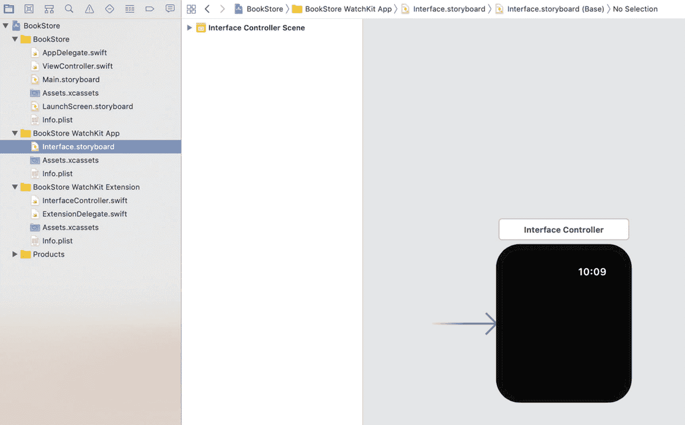

图 15-4. 界面故事板

因为你要为 watchOS 应用创建一个书籍列表，所以需要在故事板中添加一个表格。在右下角搜索“table”，然后将表格拖拽到“Interface Controller Scene”中，如图 15-5 所示。

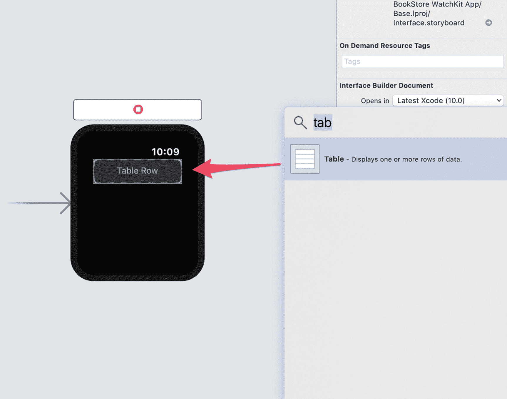

图 15-5. 添加一个表格

Xcode 现在会为你提供 Table Row 作为表格的一部分。这类似于你在 iOS 应用中创建表格视图时使用的原型行。你需要创建一个类来控制它，但目前，你只需添加一个标签。在对象库中搜索“label”，然后将一个标签拖拽到该行上。参见图 15-6。

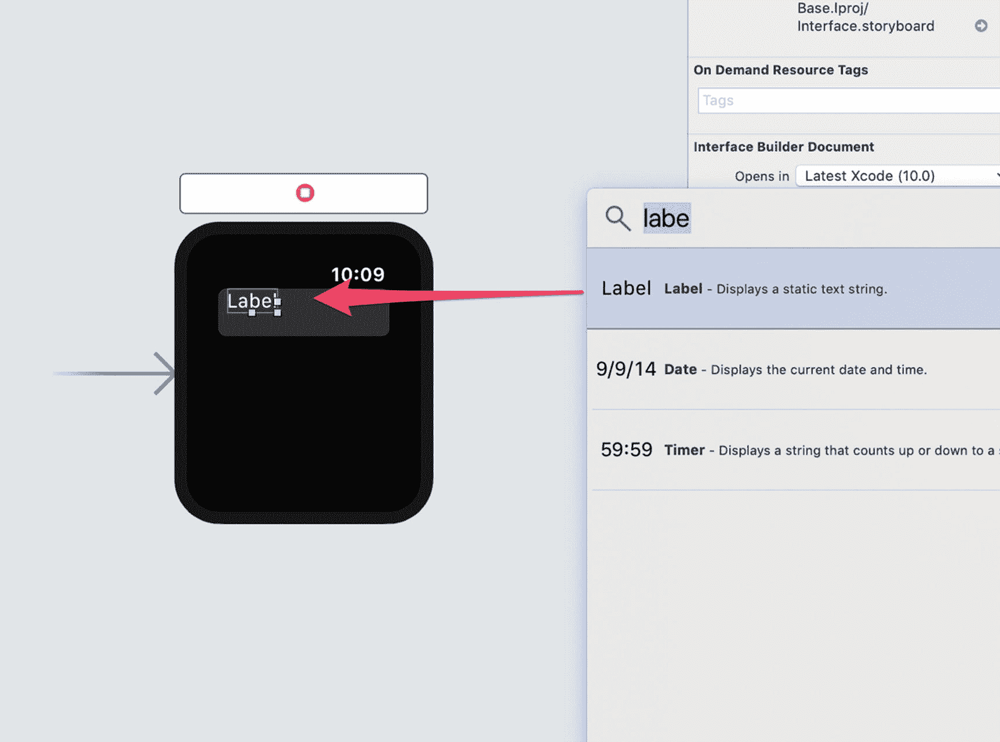

图 15-6. 向表格行添加标签

默认情况下，标签会位于 Table Row 的左上角。检查属性检查器，确保高度和宽度可以根据内容自动调整大小（参见图 15-7）。这将有助于确保你的应用能在多种尺寸的 Apple Watch 上良好运行。

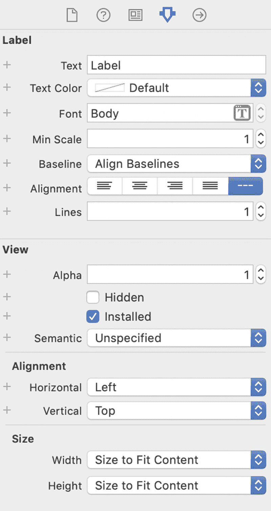

图 15-7. 让标签自适应大小

现在，标签会扩展以填满整行。但默认情况下，标签只显示一行文本。由于你要添加书名，可能需要多行才能容纳所有文本。选中标签后，在右侧的属性检查器中找到 `Lines` 属性并将其设置为 0，如图 15-8 所示。将行数设置为 0 告诉 Xcode，它可以使用任意多的行数。

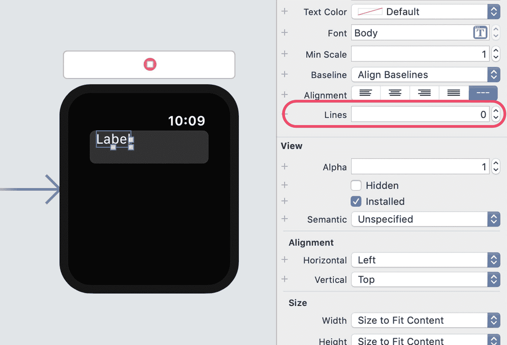

图 15-8. 设置 Lines 属性

现在你需要添加一些代码来让用户界面工作起来。在左侧，展开 BookStore WatchKit Extension 文件夹并选择 `InterfaceController.swift` 文件，如图 15-9 所示。`InterfaceController` 是 WatchKit 故事板中初始场景的默认控制器。

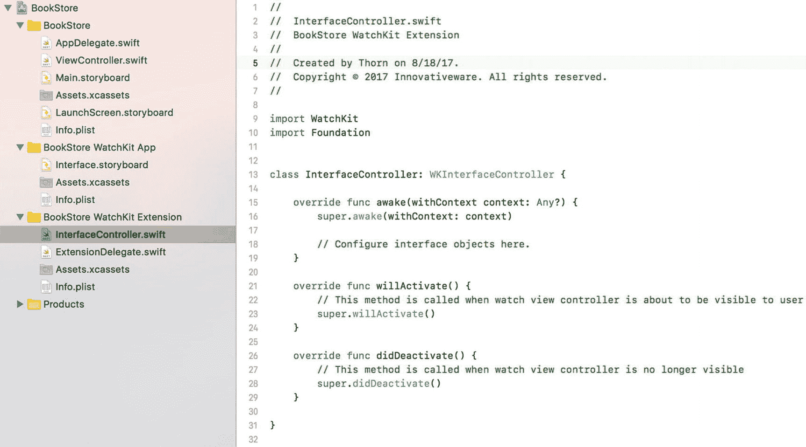

图 15-9. 打开 `InterfaceController.swift` 文件

你会注意到这个新控制器文件中的默认方法与标准的 `UIViewController` 有所不同。`willActivate()` 等同于 `viewWillAppear()`。

你需要做的第一件事是为行添加一个类定义。为此，将以下代码添加到文件底部，位于 `InterFaceController` 类的闭花括号（`}`）之外。

```
1   class BookRow: NSObject {
2       @IBOutlet weak var bookLabel: WKInterfaceLabel!
4   }
```

第 1 行声明了一个名为 `BookRow` 的新类。它是 `NSObject` 的子类。第 2 行创建了一个名为 `bookLabel` 的属性。`bookLabel` 的类是 `WKInterfaceLabel`。这与你之前使用过的 `UILabel` 类似，但它是与 WatchKit 配合使用的。


### 说明

Swift 允许在同一个 Swift 文件中声明多个类。当你仅在该文件内与其他类一起使用该类时，这种做法的效果很好。在本例中，我们只会将行类与 `InterfaceController` 类一起使用。

`InterfaceController.swift` 文件现在将如图 15-10 所示。

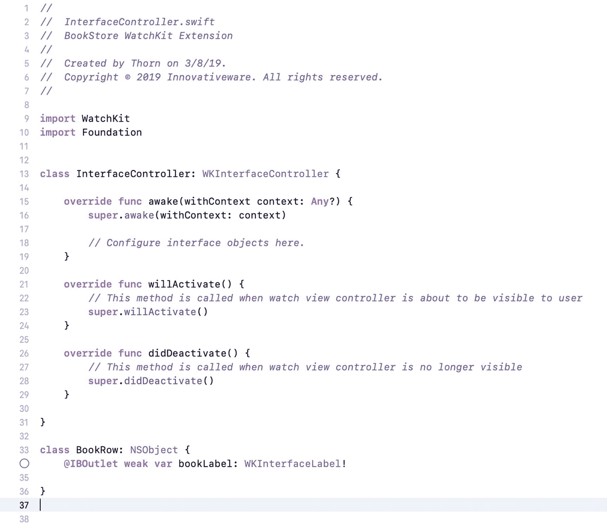

*图 15-10. 修改后的 InterfaceController.swift 文件*

现在你可以将输出口连接到界面。选择 `Interface.storyboard`。然后选择 Xcode 窗口右上角带有两个圆圈的图标来打开助理编辑器，如图 15-11 所示。


*图 15-11. 打开助理编辑器*

借助助理编辑器，Xcode 为开发者提供了一种快速创建对象并将其与界面中的输出口关联的方法。你首先需要创建一个代表表格的表格属性。按住 Control 键并从“Interface Controller Scene”中的表格拖向右侧的 `InterfaceController` 类，如图 15-12 所示。

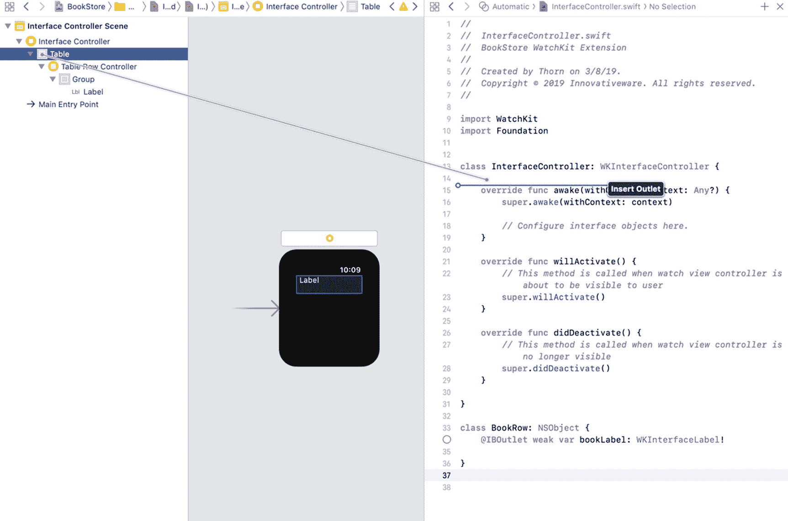

*图 15-12. 按住 Control 键拖动以创建输出口*

当你在 `InterfaceController` 类上释放 `Table` 对象时，Xcode 会提示你输入正在创建的输出口类型。保持默认设置不变，只需将名称改为 `mainTable`，如图 15-13 所示。

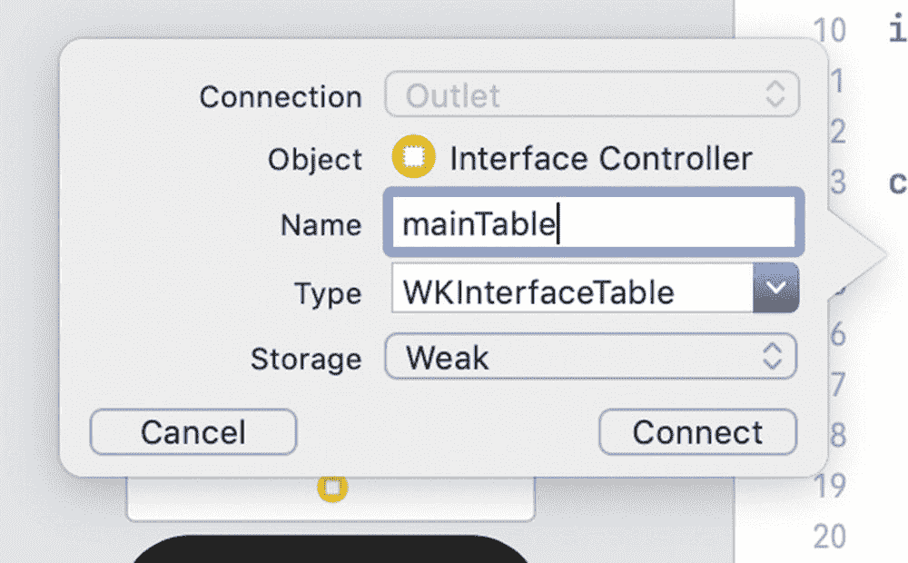

*图 15-13. 命名你的输出口*

选择 Xcode 窗口右上角的“文本行”图标以返回到标准编辑器。在“Interface Controller Scene”下，选择“Table Row Controller”，如图 15-14 所示。

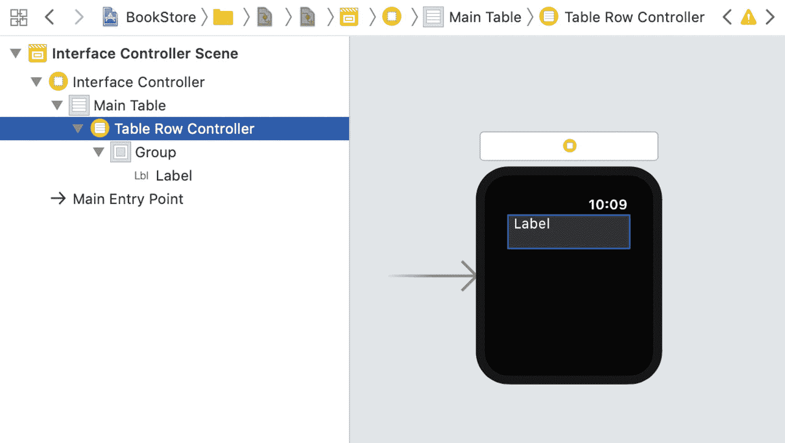

*图 15-14. 选择 Table Row Controller*

通过选择右侧的身份检查器，并在“Class”下拉菜单中选择 `BookRow`，来设置 Table Row Controller 的类，如图 15-15 所示。

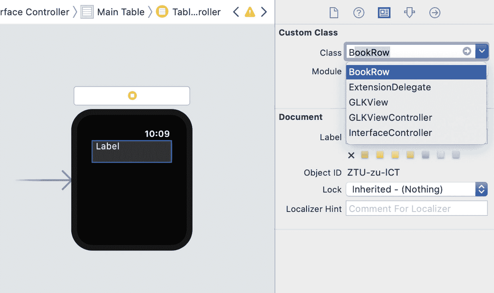

*图 15-15. 将表格行类更改为 `BookRow`*

既然你的应用知道了你在代码中使用的表格行类型，你需要为该行添加一个标识符。这在单个表格有多个行类型时会很有帮助。选择属性检查器，并输入 `MyBookRow` 作为标识符，如图 15-16 所示。

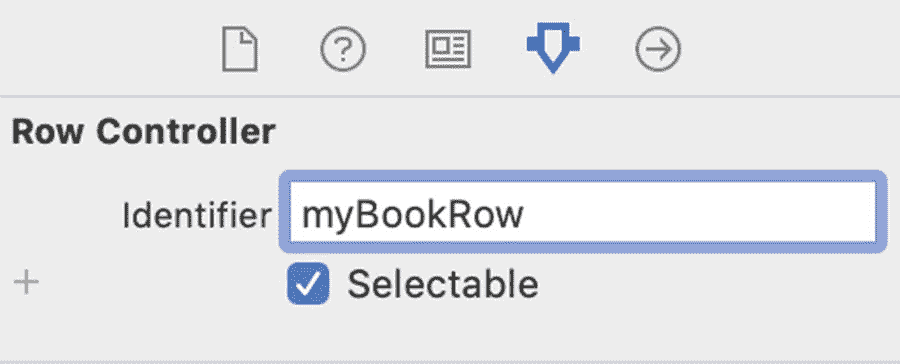

*图 15-16. 更改表格行标识符*

现在你可以连接之前创建的 `WKInterfaceLabel`。在“Interface Controller Scene”下，按住 Control 键从图书行拖向标签，如图 15-17 所示。

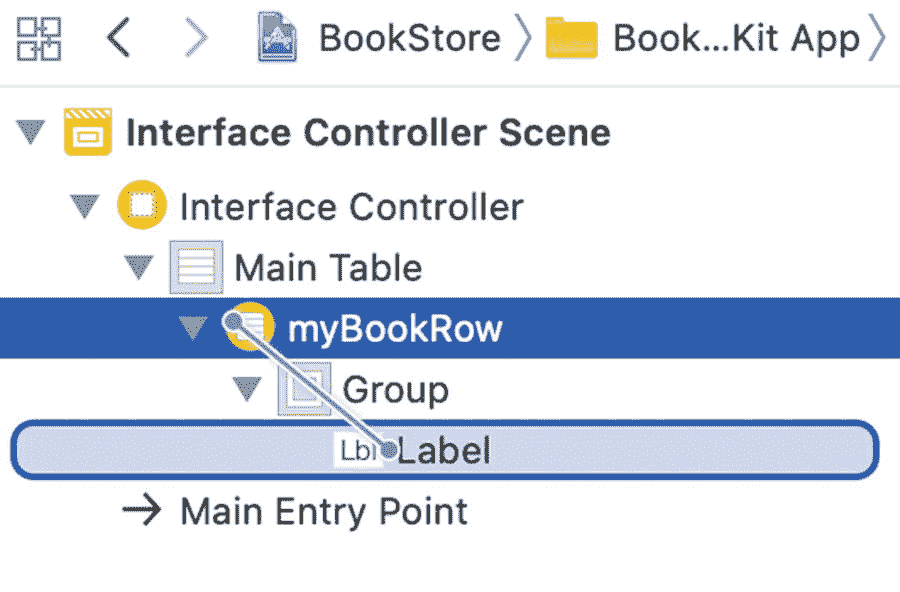

*图 15-17. 按住 Control 键从行拖向标签*

系统会提示你从可用的输出口中选择一个输出口，如图 15-18 所示。目前只有一个可用的输出口，所以选择 `bookLabel`。

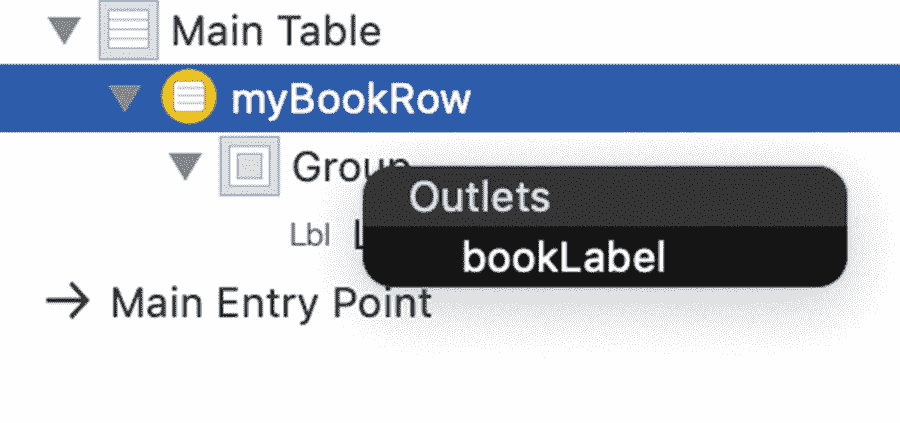

*图 15-18. 连接 `bookLabel` 输出口*

你的表格和标签现在已经全部连接好了。现在你需要一些数据来显示。你将重用你在第 8 章中创建的一些数据。使用 Mac 上的“访达”，将第 8 章文件夹中的 `Book.swift` 和 `BookStore.swift` 文件拖入 Xcode 中的 `BookStore WatchKit Extension` 文件夹。勾选“需要时拷贝项目”复选框，将文件复制到新项目中。完成后，你的目标中就会有 `Book.swift` 和 `BookStore.swift` 文件，如图 15-19 所示。

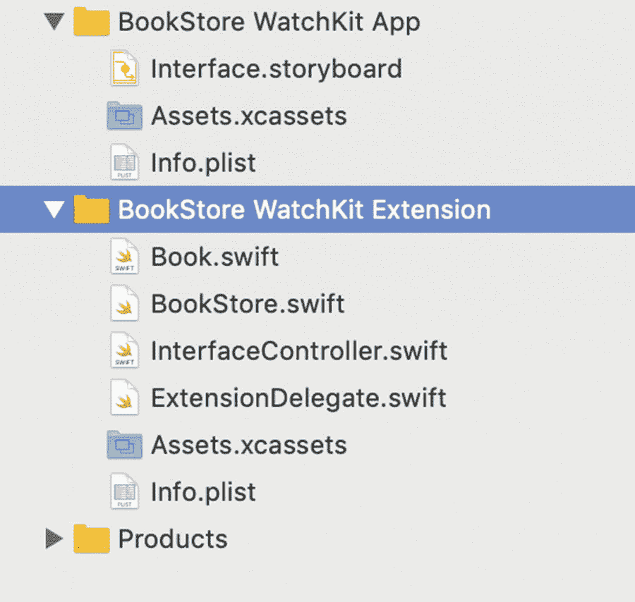

*图 15-19. 添加数据文件*

数据和界面都已经准备好了。现在你需要将它们连接起来，以便界面能够识别数据。你需要声明一个新的属性来持有 `BookStore` 对象。在 `InterfaceController.swift` 文件中，`mainTable` 对象的声明下方，需要添加以下代码行：

```
var myBookStore: BookStore = BookStore()
```

这将创建一个类型为 `BookStore`、名为 `myBookStore` 的属性，并将其初始化为 `BookStore` 的一个实例。

我们将使用 `configureTable()` 方法来设置表格。在类的其他方法之外，添加以下代码：

```
1     func configureTable() {
2         mainTable.setNumberOfRows(myBookStore.bookList.count, withRowType: "myBookRow")
3         for index in 0..<myBookStore.bookList.count {
4             if let myRow = mainTable.rowController(at: index) as? BookRow {
5                 myRow.bookLabel.setText(myBookStore.bookList[index].title)
6             }
7         }
8     }
```

第 1 行声明了新方法。第 2 行将表格的行数设置为书店中书的总数。你将使用 `myBookStore.bookList.count` 来获取该数字。我们还告诉表格要使用哪个行标识符。第 3 行是一个循环，它将 `index` 赋值为 0 并一直增加到书本数量减 1。之所以需要将书本数量减 1，是因为 Swift（以及大多数现代编程语言）的数组索引从 0 开始。这意味着，如果你有一个包含两个元素的数组，元素将位于位置 0 和 1。如果你尝试访问位置 2，将会收到错误。

第 4 行尝试使用你在上一行创建的 `index` 变量为表格创建一个新行。第 5 行获取该行并将 `Book` 的标题赋值给 `bookLabel`。现在我们需要在视图激活时调用 `configureTable()`。在 `willActivate` 函数中添加以下代码行：

```
configureTable()
```

输入这些代码行后，`InterfaceController.swift` 文件将如图 15-20 所示。

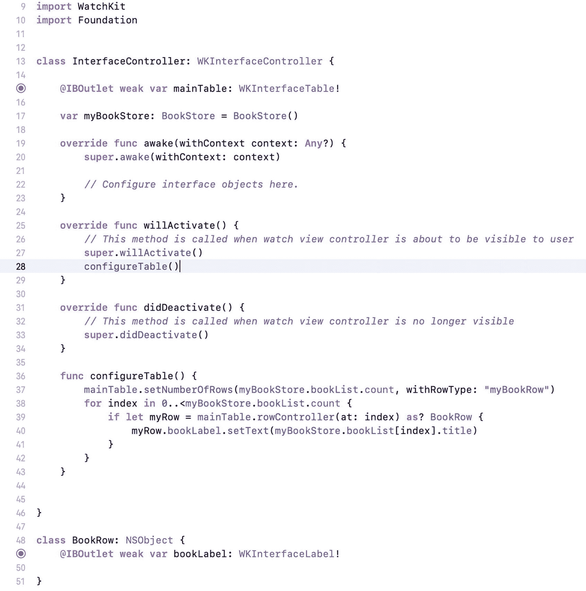

*图 15-20. InterfaceController.swift 文件*

现在，你已经具备了运行应用所需的一切。在目标菜单中，选择 `BookStore WatchKitApp`，然后选择你希望模拟器使用的 Apple Watch 尺寸，如图 15-21 所示。如果这是你第一次启动 Watch 模拟器，可能需要一些时间，并且应用在成功运行之前可能会在手机模拟器上请求权限。

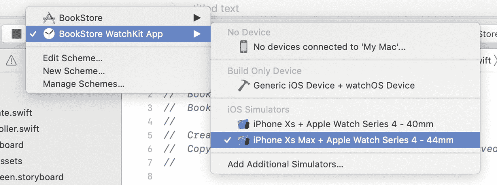

*图 15-21. 选择 WatchKit 目标*

一旦应用启动，你将看到一个手表屏幕，其中显示 `myBookStore` 对象中的两本书。如果你想体验滚动效果，可以返回 `BookStore.swift` 文件并添加更多书籍。应用最终应如图 15-22 所示。


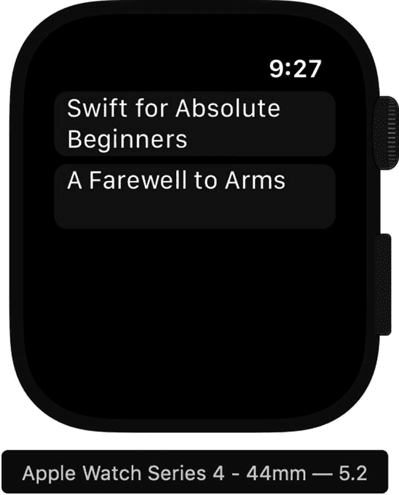

**图 15-22.** 首次启动 WatchKit 应用

## 添加更多功能

在上一节中，您创建了一个 WatchKit 应用，但其功能非常有限。在本节中，您将向应用添加一个新场景，以便在选中书籍时显示书籍详情。因为要添加一个场景，所以您将使用一个额外的控制器文件。右键点击 `BookStore WatchKit Extension` 文件夹，选择“新建文件”，如图 15-23 所示。

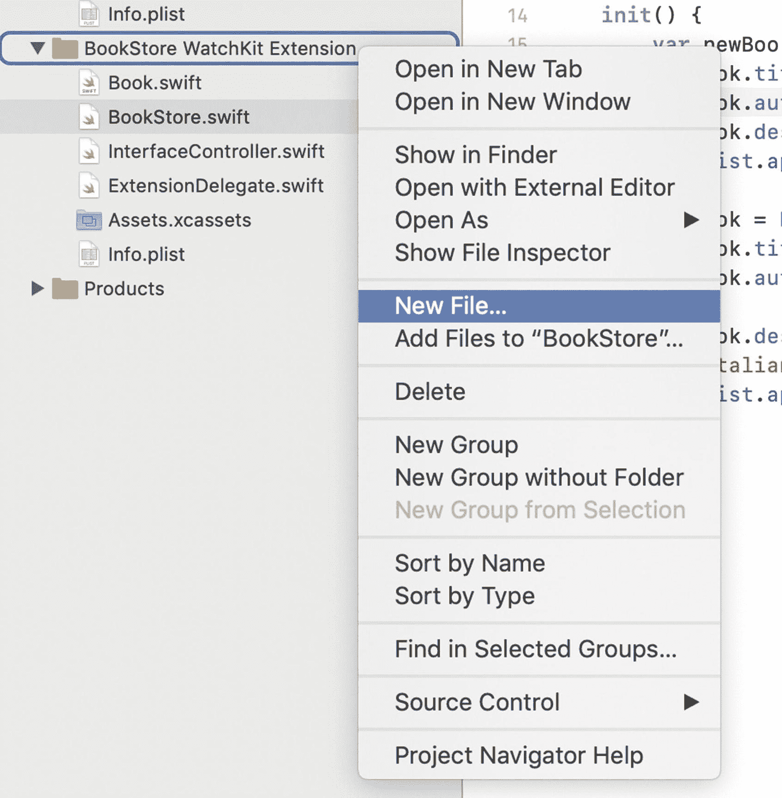

**图 15-23.** 添加新控制器文件

确保新文件是 Swift 文件，并将其命名为 `DetailController.swift`。它现在应该出现在您的文件列表中。在 `import Foundation` 行之后添加以下代码：

```
10      import WatchKit

13      class DetailController: WKInterfaceController {
14           @IBOutlet var labelTitle: WKInterfaceLabel!
15           @IBOutlet var labelAuthor: WKInterfaceLabel!
16           @IBOutlet var labelDescription: WKInterfaceLabel!

18           var book: Book!

20           override func awake(withContext context: Any?) {
21                super.awake(withContext: context)
22                if let book = context as? Book {
23                     labelTitle.setText(book.title)
24                     labelAuthor.setText(book.author)
25                     labelDescription.setText(book.description)
26                }
27           }
28      }
```

第 10 行导入了 `WatchKit` 框架。这在处理任何 WatchKit 类（例如 `WKInterfaceController` 或 `WKInterfaceLabel`）时是必需的。第 13 行声明了一个新的 `WKInterfaceController` 子类，名为 `DetailController`。第 14-16 行创建了您将用于显示书籍信息的标签输出口。第 18 行声明了名为 `book` 的 `Book` 属性。第 20 行是 `awakeWithContext` 方法。它接收一个名为 `context` 的对象，类型为 `Any`。`Book` 对象将在此处被传递。第 22 行获取上下文并将其赋值给一个 `book` 对象。第 23-25 行从书中获取信息并将其赋值给标签。

现在，您需要将以下方法添加到 `InterfaceController` 类中：

```
override func contextForSegue(withIdentifier segueIdentifier: String,
in table: WKInterfaceTable,
rowIndex: Int) -> Any? {
return myBookStore.bookList[rowIndex]
}
```

当此方法接收到选中行的 `rowIndex` 时，它负责将书籍传递给 `DetailController`。现在您需要创建界面。选择左侧的 `Interface.storyboard`。从对象库中拖拽一个 Interface Controller 到故事板上，如图 15-24 所示。

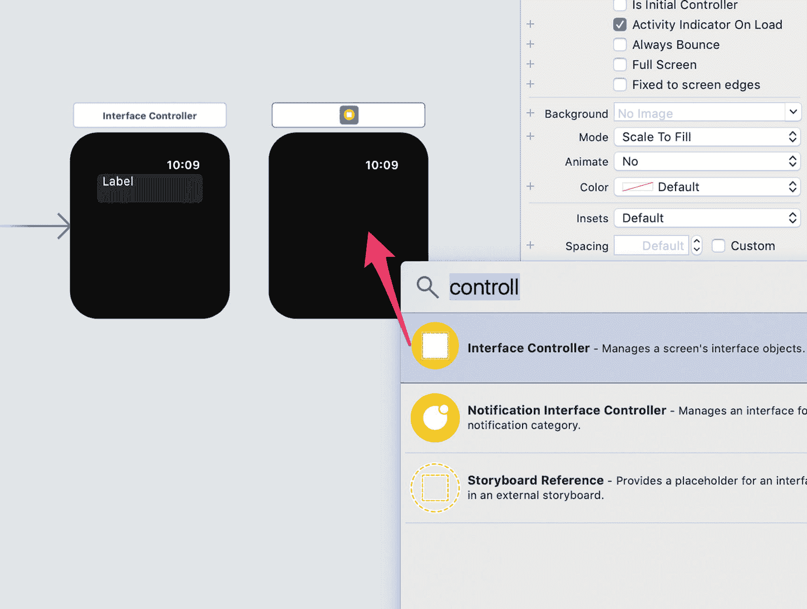

**图 15-24.** 添加控件

选择第二个 Interface Controller 场景，并将其类设置为 `DetailController`，如图 15-25 所示。

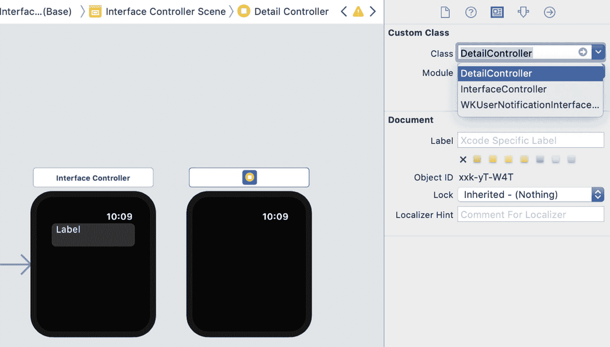

**图 15-25.** 设置新控制器类

现在，将三个标签对象拖拽到界面上。这些标签将分别用于显示书籍标题、作者和描述。参见图 15-26。`watchOS` 并未提供 `iOS`、`tvOS` 或 `macOS` 所具备的所有布局选项。作为开发者，您将需要花费时间设计简单的 `watchOS` 界面。

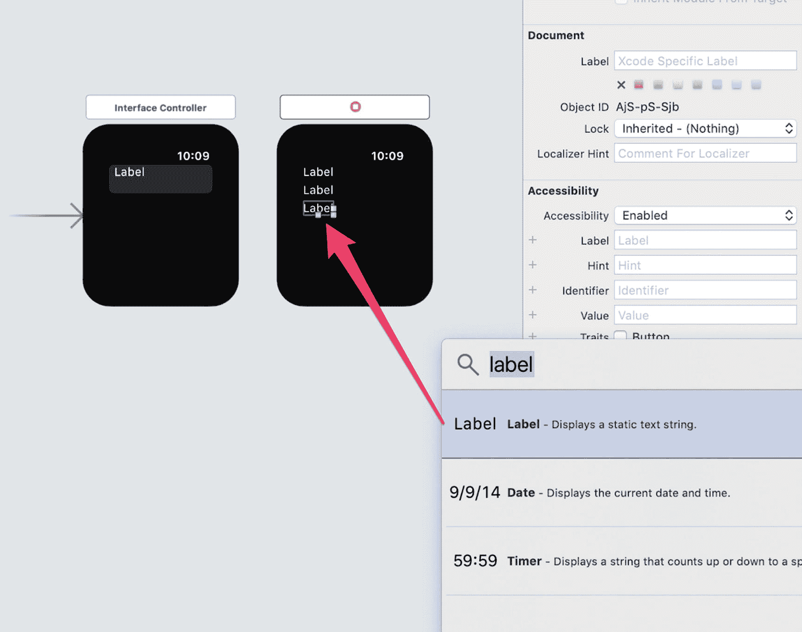

**图 15-26.** 新标签

现在，您需要连接新标签的输出口。按住 Control 键从 Detail Controller 场景拖拽到每个标签上，并将它们分配给各自的属性。参见图 15-27。

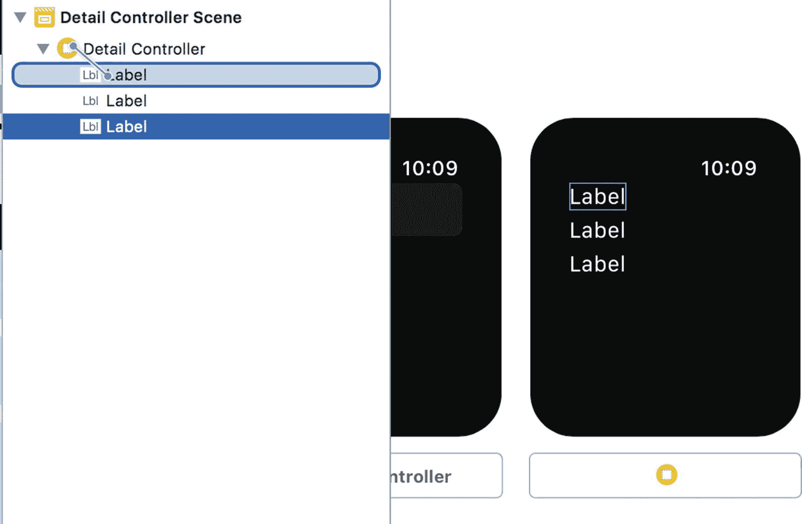

**图 15-27.** 连接输出口

现在，所有数据应该都能正常显示了。您需要创建 Segue 并再次测试应用。按住 Control 键从 Interface Controller 场景下的 `MyBookRow` 拖拽到 Detail Controller。系统会提示您选择 Segue 的类型。选择“Push”。参见图 15-28。

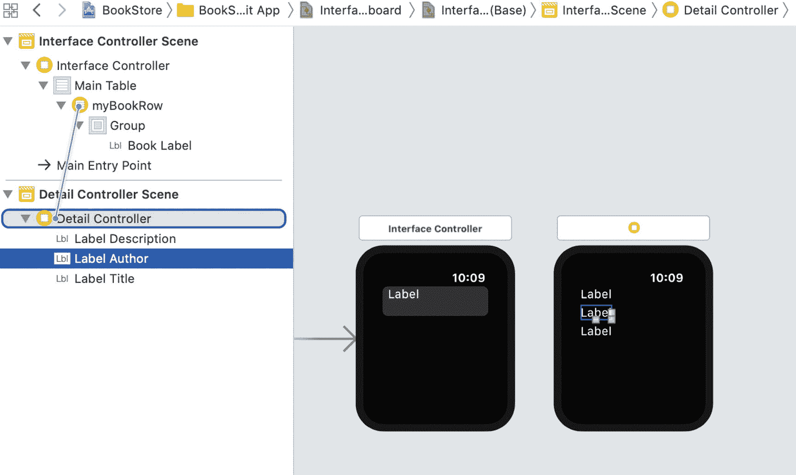

**图 15-28.** 创建 Segue

现在运行应用并选择一行。您应该会看到您刚刚创建的 Detail Controller，如图 15-29 所示。

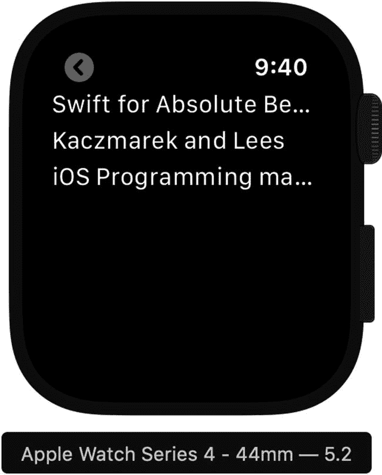

**图 15-29.** Detail Controller 场景

## 总结

本章介绍了 Apple Watch 开发的基础知识。具体来说，在本章中，您学习了以下内容：

*   如何创建一个新的 WatchKit 应用

*   如何使用 WatchKit 控件 `WKInterfaceController`、`WKInterfaceTable` 和 `WKInterfaceLabel`

*   如何创建多个场景并在它们之间添加 Segue

*   如何处理从一个场景到下一个场景的数据传递

### 练习

*   设置详情场景上的标签，使其显示所有数据，而不是截断部分内容。

*   向您的 `BookStore` 添加更多书籍，以便您可以在应用中体验滚动效果。

