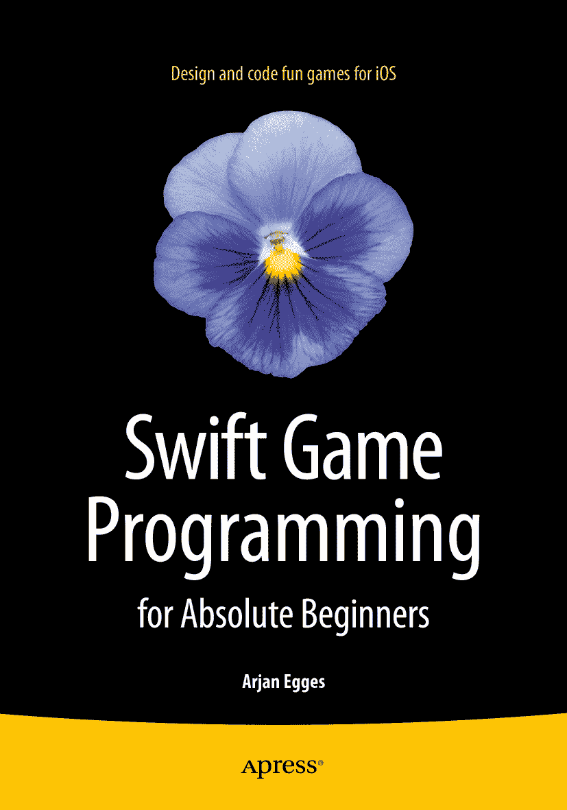

阿尔扬·埃格斯《零基础 Swift 游戏编程》

文中作者所提及的任何源代码或其他补充材料，读者均可于[`www.apress.com`](http://www.apress.com/)获取。有关如何查找本书源代码的详细信息，请访问[`www.apress.com/source-code/`](http://www.apress.com/source-code/)。ISBN 978-1-4842-0651-5 e-ISBN 978-1-4842-0650-8 DOI 10.1007/978-1-4842-0650-8 © Apress 2015 《零基础 Swift 游戏编程》 常务董事：Welmoed Spahr 首席编辑：Jonathan Gennick 开发编辑：Douglas Pundick 技术审阅：Stefan Kaczmarek 编辑委员会：Steve Anglin, Mark Beckner, Gary Cornell, Louise Corrigan, Jim DeWolf, Jonathan Gennick, Robert Hutchinson, Michelle Lowman, James Markham, Susan McDermott, Matthew Moodie, Jeffrey Pepper, Douglas Pundick, Ben Renow-Clarke, Gwenan Spearing, Matt Wade, Steve Weiss 协调编辑：Jill Balzano 文字编辑：Mary Behr 排版：SPi Global 索引编制：SPi Global 美工：SPi Global 封面设计：Anna Ishchenko 有关翻译事宜，请发送电子邮件至`rights@apress.com`，或访问[`www.apress.com`](http://www.apress.com/)。Apress 及 friends of ED 图书可批量购买用于学术、企业或促销用途。大多数图书也提供电子书版本和许可证。更多信息，请参阅我们的特殊批量销售–电子书授权网页：[`www.apress.com/bulk-sales`](http://www.apress.com/bulk-sales)。本文部分内容摘自《通过游戏编程学习 C#》，作者：Egges, Arjan, Fokker, Jeroen D., Overmars, Mark H.，© Springer-Verlag Berlin Heidelberg 2013，经许可使用。本作品受版权保护。出版商保留所有权利，无论涉及全部或部分材料，特别是翻译、转载、插图重用、朗诵、广播、以缩微胶卷或任何其他物理方式复制、传输或信息存储与检索、电子改编、计算机软件、或目前已知或今后开发的任何类似或不同方法的权利。不在此法律保留范围内的例外情况包括：与评论或学术分析相关的简短摘录，或专门为输入和执行于计算机系统而提供的材料，仅供购买者个人使用。只有在出版商所在司法管辖区现行版权法的规定下，且始终须获得 Springer 的许可，才允许复制本出版物或其部分内容。可通过位于 Copyright Clearance Center 的 RightsLink 获取使用许可。违反者将根据相应版权法受到起诉。本书中可能出现商标名称、标识和图像。我们不会在每次出现商标名称、标识或图像时都使用商标符号，而仅以编辑方式使用这些名称、标识和图像，以利于商标所有者，并无意侵犯商标权。本出版物中使用的商品名称、商标、服务标记及类似术语，即使未明确标识，也不应被视为对其是否受专有权利保护的表达意见。尽管本书中的建议和信息被认为在出版之日是真实准确的，但作者、编辑和出版商均不对可能存在的任何错误或遗漏承担法律责任。出版商不对本书所载内容作任何明示或暗示的担保。本书通过 Springer Science+Business Media New York 在全球图书贸易中发行，地址：233 Spring Street, 6th Floor, New York, NY 10013。电话：1-800-SPRINGER，传真：(201) 348-4505，电子邮件：orders-ny@springer-sbm.com，或访问 www.springeronline.com。Apress Media, LLC 是一家加利福尼亚有限责任公司，其唯一成员（所有者）是 Springer Science + Business Media Finance Inc (SSBM Finance Inc)。SSBM Finance Inc 是一家特拉华州公司。致 Yfa

