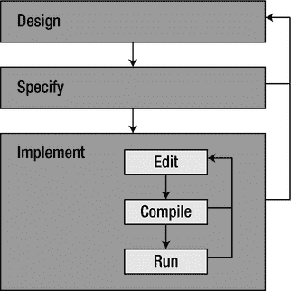
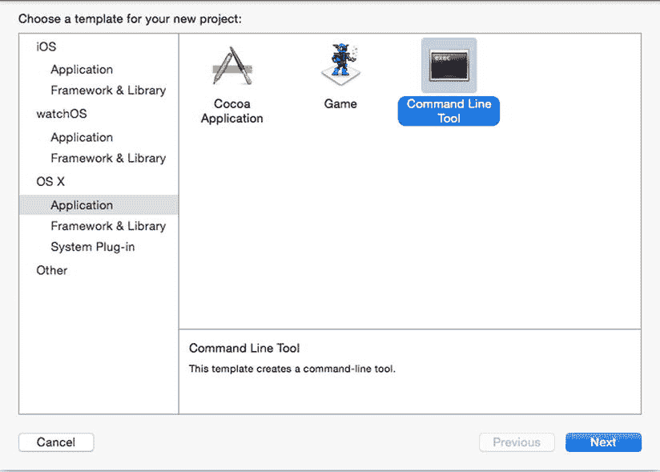
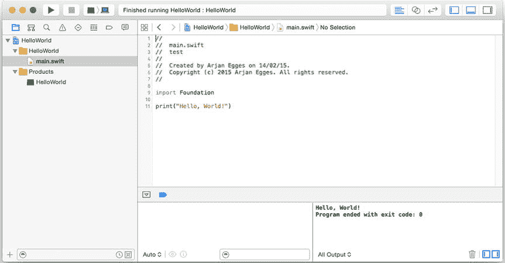
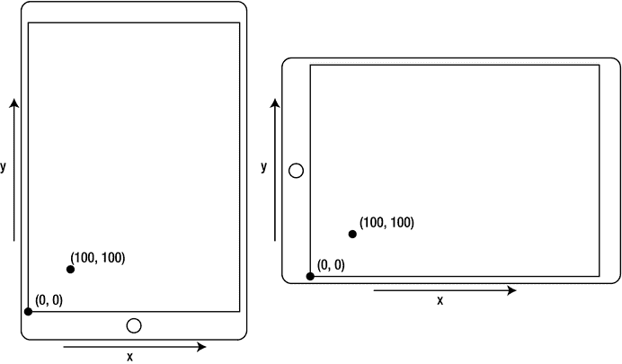
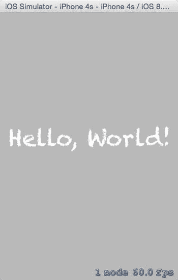

# 1. Swift 语言

电子补充材料：本章在线版本（doi:[10.1007/978-1-4842-0650-8_1](http://dx.doi.org/10.1007/978-1-4842-0650-8_1)）包含仅供授权用户使用的补充材料。

本章将介绍 Swift 编程语言。Swift 是编程语言发展历程中较新的成果之一。要理解 Swift，你首先需要了解计算机（包括 iPad 或 iPhone 等 iOS 设备）的工作原理，以及用于给它们编程的语言是如何演变的。在简要讨论计算机和程序（包括应用程序）之后，我将介绍 Swift，以及如何利用它的一些基本特性来创建你的第一个程序。

## 计算机与程序

本节将简要介绍计算机和编程的一般概念。之后，你将开始使用 Swift 编写第一个应用程序。

### 处理器与内存

一般而言，计算机由一个或多个处理器以及多种形式的内存组成。所有现代计算机（包括游戏机、智能手机和平板电脑）都是如此。我定义内存为可以从中读取信息和/或写入信息的东西。内存有多种类型，主要区别在于数据传输速度和数据访问速度。例如，一台计算机可能拥有（相对较慢的）硬盘内存、快得多的 RAM（随机存取内存）、连接到机器的 USB 闪存驱动器，或者连接到拥有自身内存的服务器的开放网络连接。计算机中的主处理器称为中央处理器（CPU）。计算机上另一种最常见的处理器是图形处理器（GPU）。

处理器的主要任务是执行指令。执行这些指令的效果是改变内存。特别是根据我对内存非常宽泛的定义，处理器执行的每一条指令都会以某种方式改变内存。你很可能不希望计算机只执行一条指令。通常，你会有一长串待执行的指令——“把这部分内存移到那边，清除这部分内存，在屏幕上绘制这张图像，检查玩家是否按下了手柄上的某个键，顺便泡杯咖啡”——而（正如你可能预料的）计算机执行的这一系列指令就称为程序。

### 程序

总之，程序是操作计算机内存的一长串指令。然而，程序本身也存储在内存中。在程序中的指令被执行之前，它们被存储在硬盘、DVD、USB 闪存盘或任何其他存储介质上。当需要执行时，程序会被移动到机器的 RAM 内存中。

组成程序的指令需要以某种方式进行表达。你可以使用手势，或者发出奇怪的声音。遗憾的是，计算机对此理解得并不好（尽管借助当今的运动追踪设备，或许几年后它就能理解了）。计算机（目前）也无法理解纯英文输入的指令，这就是为什么你需要诸如 Swift 之类的编程语言。在实践中，指令以文本形式编写，但你需要根据定义编程语言的一套规则，以非常严格的方式编写它们。存在许多编程语言，因为当有人想到一种稍好一点的表达某类指令的方式时，他们的方法往往会成为一门新的编程语言。很难说一共有多少种编程语言，因为这取决于你是否统计一门语言的所有版本和方言；但可以说有数千种之多。

幸运的是，没有必要学习所有这些不同的语言，因为它们有许多相似之处。在早期，编程语言的主要目标是利用计算机的新功能。然而，较新的语言则侧重于为编写程序可能造成的混乱带来一些秩序。


### 编程语言

在早期，编写电脑游戏是一项极具挑战性的任务，需要高超的技巧。像当时流行的雅达利 2600 这样的游戏机，仅有 128 字节的内存，这与今天的电脑相比（4GB 内存大约是 128 字节的 33000 倍）实在是微不足道。它使用的卡带也只拥有最多 4096 字节的 ROM（只读存储器），并且程序与游戏数据都必须存放在其中。这极大地限制了可能性，而且当时的机器运行速度也极其缓慢。

编写这类游戏使用的是`汇编语言`，这是一种非常基础的编程语言，它定义了一组处理器可以执行的指令。不同的处理器可能拥有不同的指令集，从而衍生出不同的汇编语言。因此，每当出现一款新的处理器，所有现有的程序都必须为其完全重写。于是，对独立于处理器的编程语言的需求应运而生。由此诞生了诸如`Fortran`（公式翻译系统）和`BASIC`（初学者通用符号指令代码）这样的语言。`BASIC`在 20 世纪 70 年代非常流行，因为它随早期的个人电脑一同推出，如 1978 年的苹果 II、1979 年的 IBM-PC 及其后续机型。遗憾的是，这种语言从未被标准化，因此每个电脑品牌都使用了自己版本的`BASIC`方言。

随着程序日益复杂，显然需要一种更好的方式来组织所有这些指令。于是，过程式语言被创造出来；它们将指令分组到过程（也称为函数或方法）中。过程式语言的一个著名例子是`C`，它由贝尔实验室在 20 世纪 70 年代末定义。`C`至今仍被广泛使用，尽管它正逐渐但坚定地被更现代的语言所取代，尤其是在游戏行业。

多年来，游戏程序变得庞大得多，并且是由团队而非个人来创建。代码的可读性、可复用性和易于调试变得至关重要。面向对象的编程语言满足了这一需求，它允许程序员将方法分组到一种称为`类`的结构中。与方法组相关联的内存区域被称为`对象`。一个`类`可以描述像《吃豆人》游戏中的幽灵这样的东西。那么每个单独的幽灵就对应于该`类`的一个`对象`。这种编程思维方式应用于游戏时非常强大。面向对象编程的另一个强大方面是继承，它允许开发者扩展现有代码并为其添加功能。你将在第 10 章中了解更多关于继承以及如何在游戏中使用它的内容。

在 80 年代早期，两位名为布拉德·考克斯和汤姆·洛夫的程序员创造了一种名为`Objective-C`的语言，它是`C`语言的扩展，能够实现面向对象编程。1988 年，`Objective-C`语言被授权给 NeXT 公司，这家公司由史蒂夫·乔布斯在 1985 年被苹果公司排挤出走后创立。NeXT 围绕`Objective-C`语言开发了大量工具，例如一个用于构建界面的工具，以及一个名为 Project Builder 的开发环境，也就是我们现在称为`Xcode`的前身。当乔布斯在 90 年代重返苹果时，NeXT 开发的这些工具成为了 Mac OS X 的基础。

在过去的二十年里，像`Java`和`C#`这样的新语言进一步引入了许多有用的特性。苹果意识到其平台需要一种能够受益于过去几十年编程语言进步的新语言。于是，在 2014 年 6 月 2 日，苹果发布了`Swift`编程语言，作为 OS X 和 iOS 的新编程语言。`Swift`是比`Objective-C`更现代的替代方案。它吸收了`C#`或`JavaScript`等语言的许多特性，这使得为 OS X 或 iOS 编写程序变得高效得多。由于 iOS 应用市场巨大，`Swift`将对整个行业产生重大影响。本书将深入教授你`Swift`语言，并特别侧重于游戏开发。读完本章后，你将用`Swift`创建你的第一个程序。

### 编程游戏

本书的目标是教你如何编写游戏程序。游戏是非常有趣（有时也颇具挑战性！）的程序。它们涉及大量不同的输入和输出设备，并且游戏所创造的虚构世界可能极其复杂。

直到 20 世纪 90 年代初，游戏都是针对特定平台开发的。例如，为某款特定游戏机编写的游戏，如果没有程序员付出巨大努力来使其适应不同的硬件，就无法在其他任何设备上运行。在 80 年代，街机游戏极为流行，但由于计算机硬件不断变化和改进，为它们编写的代码几乎无法复用于更新的游戏。

随着游戏变得日益复杂，并且操作系统变得更加独立于硬件，游戏公司开始复用先前游戏中的代码便显得合情合理。如果你可以直接使用先前发布游戏中的渲染程序或碰撞检测程序，何必为每个新游戏从头编写全新的程序呢？“游戏引擎”这个术语诞生于 20 世纪 90 年代，当时像《毁灭战士》和《雷神之锤》这样的第一人称射击游戏变得非常流行。这些游戏如此受欢迎，以至于其制造商`id Software`决定将部分游戏代码作为独立的软件，授权给其他游戏公司使用。

如今有许多不同的游戏引擎可供使用。现代游戏引擎为游戏开发者提供了大量功能，例如 2D 和 3D 渲染引擎、粒子特效和光照特效、声音、动画、人工智能、脚本等等。本书游戏主要使用的引擎是`SpriteKit`。`SpriteKit`是苹果公司开发的一款面向游戏开发的引擎。读完本书后，你将了解该引擎的所有主要方面，并知道如何使用它来创建自己的游戏。

### 开发游戏

游戏开发通常采用两种方法。图 1-1 展示了这两种方法：外环包含内环。当人们初次学习编程时，他们通常会立刻开始编写代码，这会导致一个编写、测试、然后修改的紧密循环。相比之下，专业程序员在编写第一行代码之前，会花大量前期时间进行设计工作。



图 1-1. 小规模编程与大规模编程


### 小规模：编写-编译-运行

当你想用 Swift 构建游戏时，需要编写一个包含许多行指令的程序。借助 Xcode 框架，你可以编辑正在开发的程序。一个程序通常由不同的文本文件组成，每个文件都包含指令。写完这些指令后，你告诉 Xcode 程序编译所编写的代码并执行该程序。一切顺利的话，程序会完成编译并正常运行。

然而，大多数时候事情并不那么简单。首先，你提供给编译器的文本文件必须包含有效的 Swift 代码，因为你不能指望计算机去编译那些毫无意义的胡乱内容。Xcode 程序会检查源代码是否符合 Swift 语言规范。如果不符合，就会报错并停止编译过程。当然，程序员会努力编写正确的 Swift 程序，但很容易出现拼写错误，而且正确程序的编写规则非常严格。因此，你在编译阶段几乎肯定会遇到错误。

经过几轮修正小错误后，源代码终于能顺利编译通过。下一步，计算机就会执行或运行刚刚创建的程序。这时你常常会发现，程序并没有完全按照你的预期工作。当然，你确实努力准确地表达了期望程序做什么，但概念上的错误很容易出现。

于是你回到文本编辑器，修改代码。然后再次尝试编译并运行程序，希望自己没有犯新的拼写错误。你可能会发现之前的问题解决了，但很快又意识到，虽然程序表现不同了，却依然没有完全达到你的要求。于是你再次回到编辑器。欢迎来到程序员的世界！

### 大规模：设计-规格-实现

一旦你的游戏变得复杂，就不再适合直接埋头码代码直到完成。在开始实现（编写和测试游戏）之前，还有两个阶段。

首先，你需要设计游戏。你在构建什么类型的游戏？目标受众是谁？是 2D 游戏还是 3D 游戏？你想要模拟什么样的游戏玩法？游戏中包含哪些角色，他们有哪些能力？尤其是当你在与他人共同开发游戏时，必须撰写某种包含所有这些信息的设计文档，以确保大家对正在开发的游戏达成共识！即使是独自开发游戏，写下设计思路也是一个好主意。设计阶段实际上是游戏开发中最困难的任务之一。

当明确了游戏应该做什么之后，下一步就是为程序提供全局结构。这被称为规格说明阶段。你还记得面向对象编程范式将指令组织成方法，并将方法组织成类吗？在规格说明阶段，你需要概览游戏所需的类以及这些类中的方法。在此阶段，你只需描述方法将做什么，而不需要关心如何实现。但请记住，不能对方法提出不切实际的要求：它们之后必须被实现。

当游戏规格说明完成后，就可以开始实现阶段了，这通常意味着要多次经历编写-编译-运行的循环。之后，你可以让其他人试玩你的游戏。大多数情况下，你会意识到游戏设计中的某些想法效果并不好。于是，你从头开始，修改设计，接着修改规格说明，最后进行新的实现。然后再次让别人试玩你的游戏，接着……嗯，你懂的。编写-编译-运行这个循环被包含在一个更大规模的循环中：设计-规格说明-实现循环（见图 1-1）。虽然本书主要侧重于实现阶段，但你会在各章节中看到关于游戏设计的技巧和窍门。


## 构建你的第一个 Swift 程序

在本节中，你将学习如何使用 Swift 语言创建一个简单的程序（另请参见本章附带的 `HelloWorld` 示例）。由于你将使用 Xcode 开发环境，请先启动 `Xcode` 程序。点击欢迎屏幕上显示的 **Create a new Xcode Project**。此时会弹出一个对话框，允许你在多个模板项目之间进行选择。默认情况下，Xcode 提供了 iOS 项目（在 iPhone 或 iPad 上运行的应用程序）、watchOS 项目（在 Apple Watch 上运行的应用程序）和 OS X 项目（在 Mac 上运行的应用程序）的模板。我们先创建一个简单的 OS X 控制台应用程序。为此，请单击 OS X 下的 **Application** 项，然后选择 **Command Line Tool** 项目模板（见图 1-2）。



**图 1-2.** 项目模板选择对话框

命令行工具（也称为控制台应用程序）是现有最基本的程序类型之一。命令行工具是一个简单的程序，用于读取和/或输出文本。

选择 **Command Line Tool** 选项后，点击 **Next** 按钮。然后，选择一个产品名称（例如 `HelloWorld`）。在同一个窗口中，确保为项目选择的语言是 Swift。点击 **Next** 后，你必须选择一个用于存放项目和代码的文件夹；例如，你可以将其保存到桌面。选定项目位置后，点击 **Create**。你就创建好了一个可以编写代码的基本项目。

在左侧，你会看到与项目关联的项。有两个文件夹。一个文件夹包含一个名为 `main.swift` 的项，这是一个包含程序指令的文本文件。第二个文件夹（名为 `Products`）包含一个项，其名称就是你为产品选择的名称。此项带有一个命令行工具图标，这意味着该项目创建出的产品是一个命令行工具。

如果你点击 `main.swift` 项，会看到该文件在编辑器中打开。模板项目已经为你添加了几行代码作为起点。其中最重要的一行是：

`print("Hello, World!")`

这条指令告诉计算机向控制台写入一行文本。需要写入的文本位于括号之间。在 Swift 中，任何文本表达式都始终写在双引号之间。要查看此程序的作用，请点击 Xcode 窗口左上角的 **Play** 按钮（见图 1-3）。这会编译并运行该程序。程序运行时，你将在 Xcode 窗口底部的调试区域看到其输出（也显示在图 1-3 中）。如果你看不到调试区域，请点击 Xcode 窗口右上角对应的视图按钮来激活它。在图 1-3 中，你可以在窗口右上角看到三个视图按钮。左侧按钮显示或隐藏列出项目中文件和文件夹的窗口部分。右侧按钮切换显示项目属性的面板。中间的按钮显示或隐藏调试区域。程序运行后，你会看到文本 `Hello, World!` 出现在那里，同时还有一条消息显示程序已执行完毕。



**图 1-3.** `HelloWorld` 程序执行后 Xcode 环境的截图

现在你可以开始修改代码来改变程序的行为。例如，在你的代码中添加以下一行：

`print("Goodbye, World!")`

当你运行此程序时，调试区域会打印出两行。现在将代码修改为以下两行：

`print("Hello, World!", appendNewline: false)`

`print("Goodbye, World!")`

运行此程序后，你会看到两段文本被写在一起。这是因为 `print` 函数会在向控制台写入文本后添加一个换行符，除非你另有指定（这就是我在上面第一个 `print` 指令中所做的）。你执行的最后一个程序由两个指令组成。每个指令告诉编译器执行一个由其他指令组成的函数（或方法）。`print` 就是一个函数的例子。这里你可以清楚地看到 Swift 确实是一种过程式语言。指令被分组到函数/方法中。

你可以非常轻松地将自己的指令分组到自己的函数/方法中。看一下下面的程序：

```
func printData() {
    print("Name: Shirley")
    print("Age: 26")
    print("Profession: Teacher")
    print("Married: yes")
    print("Children: 2")
}

printData()
printData()
printData()
```

在这个例子中，我创建了一个将五个指令组合在一起的函数。你可以使用 `func` 关键字和一个名称来创建函数。在名称之后，写上括号（关于这一点稍后会详细介绍）。属于该函数的指令写在花括号 `{` 和 `}` 之间。定义此函数后，你可以通过编写函数名加一对括号来调用它。在这个例子中，我调用了 `printData` 函数三次。结果是构成该函数的指令全部被执行了三次。在编辑器中输入上面的代码，亲自看看它的作用。你能修改程序，使数据被打印六次吗？现在修改程序，使其也打印出人物所在的国家。尝试添加第二个函数，用于显示另一个人的数据。你能修改程序，使其交替显示这两个不同人物的数据吗？

如果你再看一下这个程序，或许会意识到定义函数和执行函数内部编写的指令之间存在区别。在上面的程序中，第一部分定义了一个函数；第二部分执行（或调用）了一个函数。每当你调用一个函数时，你总需要在函数调用的后面写上括号，就像这样：

`printData()`

之所以有这些括号，是因为有时函数需要额外的信息才能完成其工作。`print` 函数就是一个很好的例子，它需要文本作为额外信息。毕竟，如果一个打印函数无法被告知它应该打印什么，那它还有什么用呢？和 `printData` 函数一样，`print` 函数在被调用时后面也有括号。区别在于，对于 `print` 来说，括号之间确实有信息，即要打印的文本：

`print("Hello, World!")`

稍后，你会看到更多关于函数以及如何调用它们的示例。由于本书是关于编写游戏程序的，现在让我们实际制作一个 iOS 游戏应用程序。


## 构建你的首个 Swift 游戏

要开始编写 iOS 游戏程序，你需要先创建一个合适的项目。由于 iOS 游戏的功能远不止打印文本，因此需要创建一个游戏项目。这非常简单。在 Xcode 中，进入主菜单并选择**文件** ➤ **新建** ➤ **项目**。然后，在 iOS 类别中选择**游戏**模板。点击**下一步**后，为你的游戏输入一个合适的名称，例如 `BasicGame`。同样，确保已选择 `Swift` 作为主要语言。同时，确保已选择 `SpriteKit` 作为将要使用的游戏技术。`SpriteKit` 是一组由 Apple 创建、对游戏开发很有用的函数和类的集合。最后，选择一个用于存储游戏项目及其源代码的文件夹，然后点击**创建**。或者，你也可以查看本章附带的 `BasicGame` 示例，该示例已经采用了正确的格式。

如果你查看刚创建的游戏项目中的文件，就会发现基础的 iOS 游戏比命令行工具应用程序要复杂得多。你将要修改代码的主要文件是名为 `GameScene.swift` 的文件。其他文件则用于为 iOS 游戏设置正确的环境。在 `GameScene.swift` 文件中，你可以编写特定于自己游戏的代码。代码中最重要的部分是指令如下：

```
import SpriteKit

class GameScene: SKScene {

    override func didMoveToView(view: SKView) {
        /* Setup your scene here */
        let myLabel = SKLabelNode(fontNamed:"Chalkduster")
        myLabel.text = "Hello, World!"
        myLabel.fontSize = 65
        myLabel.position = CGPoint(x:CGRectGetMidX(self.frame),
        y:CGRectGetMidY(self.frame))

        self.addChild(myLabel)
    }

    ...

}
```

在不深入细节的前提下，让我们看看这段代码的结构。第一条指令 `import SpriteKit` 用于告诉编译器，程序需要 `SpriteKit` 中的函数和类。这与使用 `print` 这样的函数不同。`print` 函数是内置于语言本身的。而处理精灵（图像）的函数和类则相当具体，因此它们被放在一个单独的集合中，也称为框架（framework）。在程序的开头，你可能会看到一条或多条这样的 `import` 指令，具体取决于程序需要用到哪些功能。

在框架导入指令之后，你可以看到一个类。从这里可以看出 Swift 是一种面向对象的语言。指令被分组为方法，而方法又被分组为类。在这个示例中你也可以看到同样的结构。有三条指令被分组到一个名为 `didMoveToView` 的方法中。这个方法属于一个名为 `GameScene` 的类。当我们定义函数或方法时，使用 `func` 关键字。当我们定义类时，使用 `class` 关键字。程序员使用方法和类来更好地组织代码，以便更容易理解每个部分的作用以及它们与程序其他部分的关联。在这个例子中，`GameScene` 类将对游戏场景（即游戏世界）进行操作的方法分组。`didMoveToView` 方法包含了当游戏出现在设备屏幕上时需要执行的指令。

### 函数还是方法？

正如本章所讨论的，过程式编程语言将指令分组为函数/方法。在面向对象语言中，函数和方法又被分组为类。那么函数和方法之间有什么区别呢？实际上，并没有真正的区别。在本书中，只有当函数是类的一部分时，我才称之为方法。因此，iOS 示例中的 `didMoveToView` 是一个方法，而 `printData`（来自命令行工具示例）是一个函数。它们都是对指令进行分组，但 `didMoveToView` 属于一个类（`GameScene`），而 `printData` 则不属于任何类。

`didMoveToView` 方法中的第一行代码（`/* Setup your scene here */`）是一条 Xcode 程序会忽略的注释。第二行是一条创建名为标签节点的指令。标签节点代表一个你可以放置在屏幕任意位置的文本标签。它之后的两条指令为标签设置了文本和字体大小。接着，你会看到一条为该标签节点分配位置的指令。这条指令看起来相当复杂，因为它定义位置时计算了屏幕的中心点。你也可以编写一条更简单的指令：

`myLabel.position = CGPoint(x:500, y:300)`

尝试为文本在屏幕上的 x 和 y 位置设置几个不同的值。请注意，当你使用 `SpriteKit` 框架时，屏幕的原点位于左下角，并跟随设备的方向，如图 1-4 所示。



**图 1-4.** iDevice 的坐标系将原点置于屏幕左下角，无论设备方向如何

另外要注意，当您设置文本标签等对象的位置时，位置 `(500, 300)` 将位于屏幕上所放置文本的底部中央。

该方法中的最后一条指令告诉游戏引擎，该标签应该是场景的一部分。如果省略了这条指令，文本标签将不会被绘制出来。你可以按下屏幕左上角的**播放**按钮来启动应用程序。在该按钮的右侧，你可以选择要为哪个设备构建应用程序。当你运行应用程序时，Xcode 会启动一个模拟器程序，向你展示应用程序在你所选设备上的外观。例如，图 1-5 展示了应用程序在 iPhone 4s 模拟器中运行的样子。尝试在几个不同的平台上模拟应用程序。如果模拟器屏幕太大，你可以通过按 **Command+1**、**Command+2** 或 **Command+3** 来选择其他缩放比例。你也可以通过在 iOS 模拟器菜单中选择**窗口** ➤ **缩放**来更改缩放比例。



**图 1-5.** 一个基础的 iOS 游戏应用程序（以 iPhone 4s 模式运行）

再次尝试使用这个程序。你能在屏幕上绘制不同的文本吗？更改文本的位置，看看不同的 `x` 和 `y` 值如何导致文本在屏幕上处于不同的位置。


## 几点观察

在 iOS 游戏示例中，代码包含许多你可能尚未识别的元素。例如，在类名（`GameScene`）后面有一个冒号和单词`SKScene`。这意味着`GameScene`类基于一个名为`SKScene`的现有类。也可以说`GameScene 是 SKScene 的一个特殊版本`。请注意，`SKScene`包含了一些方法。`GameScene`复制了这些方法，但替换了其中一个，即`didMoveToView`方法。这就是为什么该方法定义前面有`override`关键词。如果你觉得信息量很大，别担心。我将在本书的第 10 章中详细讲解这一方面。

这些指令本身可能对你而言也意义不大。在接下来的章节中，我会进一步解释这些指令的含义。无论如何，你会发现创建一个简单的 iOS 应用比简单的命令行工具要复杂得多。还有其他类型的应用程序也可以用 Swift 开发，例如带有窗口、按钮等的 OS X 应用。这类应用需要另一种方式来设置所需的类和方法（但这已超出本书范围）。

你可能还注意到，指令或方法的执行顺序不再那么清晰。当你查看最简单的命令行工具时，只有一条指令向控制台输出"Hello, World!"。执行时，程序只运行那一条指令。而当你的程序包含多个类，这些类又分组了多个方法，而方法内部则分组了指令时，要确定哪些指令会执行以及执行顺序就不再那么直观了。以本书中的 iOS 示例为例，幕后发生了许多事情，以确保最终`didMoveToView`方法会被调用。然而，仅从代码本身无法清晰地看到这一点。在这种情况下，你必须依赖 Apple 的 SpriteKit 文档，该文档说明`didMoveToView`方法会被调用，并且你可以将自己的游戏初始化代码放在其中。作为游戏开发者，你并不总能理解游戏应用程序的所有代码。你通常会使用其他开发者编写的代码，并且希望这些代码中错误不要太多。另一种选择是自己从头开发一切。但在游戏行业这样一个快速发展的领域中，这样做并不明智。引用著名作家卡尔·萨根的话："如果你想从头制作一个苹果派，你必须先发明宇宙。"

## 本章所学

在本章中，你学习了以下内容：

*   计算机的工作原理，以及它们由负责计算的处理器和负责存储的内存组成
*   编程语言如何从汇编语言发展到 Swift 等现代编程语言
*   如何使用 Swift 语言创建一个简单的应用程序

