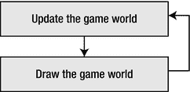
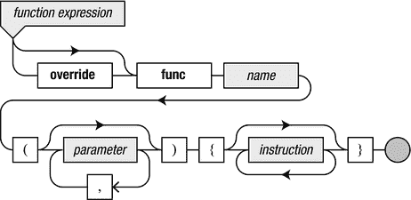

# 游戏编程基础

电子补充资料：本章在线版本 (doi:[10.​1007/​978-1-4842-0650-8_​2](http://dx.doi.org/10.1007/978-1-4842-0650-8_2)) 包含补充资料，仅供授权用户使用。

本章涵盖游戏编程的基本要素，并为后续章节提供起点。首先，你将学习任何游戏的基本框架，包括游戏世界和游戏循环。你将通过查看各种示例（例如一个改变背景颜色的简单应用程序）了解如何在 Swift 中创建这个框架。最后，我将讨论如何通过合理使用注释、布局和空白来使代码更清晰。

## 游戏的构建模块

本节讨论游戏的构建模块。我将首先概述游戏世界，然后向你展示使用游戏循环改变游戏世界的过程，该循环在将游戏世界绘制到屏幕之前不断更新它。

### 游戏世界

游戏之所以成为一种有趣的娱乐形式，是因为你可以探索一个虚构的世界，并在其中做一些现实生活中永远不会做的事情。你可以骑在龙背上，摧毁整个太阳系，或者创造一个使用虚构语言交流的复杂文明。这个你玩游戏时所处的虚拟领域被称为**游戏世界**。游戏世界可以像俄罗斯方块世界那样简单，也可以像《侠盗猎车手》和《魔兽世界》中复杂的虚拟世界那样庞大。

当游戏在计算机或智能手机上运行时，设备会维护一个游戏世界的内部表示。这种表示看起来完全不像你在玩游戏时屏幕上显示的内容。它主要由数字组成，描述对象的位置、敌人对玩家能造成多少伤害、玩家背包中有多少物品等等。幸运的是，程序也知道如何创建这个世界的视觉上令人愉悦的表示，并将其显示在屏幕上。否则，玩电脑游戏可能会变得极其无聊，玩家需要在成堆的数字中翻找，才能知道自己是否救出了公主，还是惨死了。玩家从未见过游戏世界的内部表示，但游戏开发者却会看到。当你想要开发一款游戏时，你也需要设计如何在内部表示你的游戏世界。而自己编写游戏程序的乐趣之一，就在于你可以完全控制这一切。

另一个需要认识到的重要点是：就像现实世界一样，游戏世界也在不断变化。怪物会移动到不同的位置、天气会变化、汽车会用完汽油、敌人会被消灭，等等。此外，玩家实际上也在影响着游戏世界的变化！因此，仅仅在计算机内存中存储游戏世界的表示是不够的。游戏还需要持续记录玩家的操作，并据此更新这个表示。此外，游戏还需要通过在计算机显示器、电视或智能手机屏幕上显示，将游戏世界呈现给玩家。处理这一切的过程被称为**游戏循环**。


### 游戏循环

游戏循环负责处理游戏中的动态方面。在游戏运行期间，会发生很多事情。玩家按下游戏手柄上的按钮或触摸设备屏幕，一个不断变化的游戏世界（包含关卡、怪物和其他角色）需要保持同步更新。此外，还有爆炸特效、音效以及更多其他内容。所有这些由游戏循环处理的不同任务可以归纳为两类：

-   与更新和维护游戏世界相关的任务
-   与向玩家展示游戏世界相关的任务

游戏循环会连续不断地依次执行这些任务（见图 2-1）。举个例子，让我们看看在像《吃豆人》这样简单的游戏中如何处理玩家导航。游戏世界主要由一个迷宫构成，里面有几个讨厌的鬼魂在移动。吃豆人位于迷宫的某个位置，并朝着特定方向移动。在第一个任务（更新和维护游戏世界）中，你需要检查玩家是否按下了方向键。如果是，则需要根据玩家希望吃豆人移动的方向来更新其位置。此外，由于这次移动，吃豆人可能吃掉了一个白点，这会增加分数。你需要检查这是否是关卡中的最后一个白点，因为那意味着玩家已完成了本关。如果是较大的白点，则需要让鬼魂失效。接着，你需要更新游戏世界的其余部分：鬼魂的位置需要更新，你必须决定是否应在某处显示水果以获取奖励分数，还需要检查吃豆人是否与某个鬼魂相撞（如果该鬼魂尚未失效）等等。你可以看到，即使是在像《吃豆人》这样简单的游戏中，第一个任务中也需要完成大量工作。从现在开始，我将这一系列与更新和维护游戏世界相关的不同任务称为“更新操作”。



图 2-1. 游戏循环，持续更新并绘制游戏世界

第二组任务与向玩家展示游戏世界相关。在《吃豆人》游戏中，这意味着绘制迷宫、鬼魂、吃豆人以及玩家需要了解的重要游戏信息，例如他们已获得多少分数、还剩几条命等等。这些信息可以显示在游戏屏幕的不同区域，例如顶部或底部。这部分显示内容也称为抬头显示。现代 3D 游戏拥有一套更为复杂的绘制任务。这些游戏需要处理光照与阴影、反射、剔除、爆炸等视觉效果，以及更多内容。我将把游戏循环中处理所有与向玩家展示游戏世界相关的任务部分称为“绘制操作”。

### Swift 中的游戏循环

上一章展示了如何创建一个简单的 Swift iOS 游戏应用程序。在该应用程序中，你看到指令被分组到某个方法中，而该方法又作为某个类的一部分，如下所示：

```
class GameScene: SKScene {

    override func didMoveToView(view: SKView) {
        /* 在此处设置你的场景 */
        let myLabel = SKLabelNode(fontNamed:"Chalkduster")
        myLabel.text = "Hello, World!"
        myLabel.fontSize = 65
        myLabel.position = CGPoint(x:CGRectGetMidX(self.frame),
                                   y:CGRectGetMidY(self.frame))
        self.addChild(myLabel)
    }

    ...
}
```

基本上，`didMoveToView` 方法在此处只完成一项工作：创建一个游戏世界。这个游戏世界非常简单，因为它只包含一个文本标签。那么，游戏循环在这个示例中是如何发挥作用的呢？事实上，游戏循环的绘制部分已经由 SpriteKit 引擎处理了。`didMoveToView` 方法中的最后一条指令确保了 SpriteKit 引擎内部的绘制代码知道它应该绘制这个文本标签。如果你想创建一个更复杂的游戏世界，只需在 `didMoveToView` 中添加更多指令来创建游戏世界中的对象即可。因此，创建和绘制游戏世界似乎是可行的。但是，如何更改游戏世界呢？这就是“更新操作”的用武之地。看看下面的示例程序（另请参阅本章附带的 BackgroundColor 项目）：

```
import SpriteKit

class GameScene: SKScene {

    override func didMoveToView(view: SKView) {
        let myLabel = SKLabelNode(fontNamed:"Chalkduster")
        myLabel.text = "Hello, World!"
        myLabel.fontSize = 65
        myLabel.position = CGPoint(x:CGRectGetMidX(self.frame),
                                   y:CGRectGetMidY(self.frame))
        addChild(myLabel)
    }

    override func update(currentTime: NSTimeInterval) {
        backgroundColor = UIColor.blueColor()
    }
}
```

如你所见，该程序与上一个示例的重大区别在于，`GameScene` 类现在包含了以下两个方法：一个名为 `didMoveToView`，另一个名为 `update`。后者是将作为游戏循环一部分执行的方法。由于 `GameScene` 类是 `SKScene` 类的一个特殊版本，我们本书中使用的 SpriteKit 框架已经负责创建游戏循环并调用 `update` 方法。在此示例中，`update` 方法包含一条指令：

```
backgroundColor = UIColor.blueColor()
```

这条指令将应用程序的背景颜色更改为蓝色。运行本章附带的 BackgroundColor 示例，查看程序的效果。现在，看看你是否能将背景颜色更改为其他颜色。你能把它改成红色吗？或者黄色？

当你运行程序时，实际上无法看到 `update` 方法每秒被调用多次。在 `update` 方法的花括号内的指令之间添加以下指令：

```
print(currentTime)
```

现在运行程序，你会看到一个缓慢增长的数字被打印到控制台。这个数字表示当前系统时间，以设备上次重启后经过的秒数计算。每次调用 `update` 方法时，系统时间都会打印到控制台。

如果你想了解 `update` 方法每秒被调用的频率，有一种简单的方法可以找到答案。点击名为 `GameViewController.swift` 的文件。在 `viewWillLayoutSubviews` 方法中，紧邻结束花括号之前，添加以下指令：

```
skView.showsFPS = true
```

现在运行程序，你会看到一个数字显示在屏幕上。这个数字也称为帧率，表示游戏世界每秒被更新并绘制到屏幕上的次数。为了实现流畅的游戏体验，游戏世界需要持续不断地更新和绘制：更新、绘制、更新、绘制、更新、绘制、更新、绘制、更新、绘制，如此循环。而且，这以非常高的速度进行。苹果设备（如 iPad 或 iPhone）所能处理的帧率最高为每秒 60 帧（或 60 Hz）。高于此值是不可能的，因为设备屏幕的刷新率为 60 Hz。不过，帧率可能会因为 `update` 方法中的计算耗时过多而下降。在第 6 章中，我将更详细地讨论这个问题，以及你可以采取哪些措施来确保你的游戏在旧款和新款苹果设备上都能流畅运行。

本书将向你展示多种方法，让你能够将游戏所需执行的任务填充到 `update` 方法中。在此过程中，我还会介绍许多对游戏（以及其他应用程序）有用的编程技术。下一节将更详细地介绍基本的游戏应用程序。然后，你将用额外的指令填充这个游戏的基本骨架。


## 程序的结构

本节将更详细地讨论程序的结构。早期，许多计算机程序仅在屏幕上输出文本，不使用图形。这种基于文本的应用程序称为控制台应用程序。除了在屏幕上打印文本外，这些应用程序还可以读取用户在键盘上输入的文本。因此，与用户的任何交流都以问答序列的形式进行（例如：是否要格式化硬盘（Y/N）？是否确定（Y/N）？等等）。在基于窗口的操作系统普及之前，这种基于文本的界面在文本编辑程序、电子表格、数学应用程序甚至游戏中都非常常见。这些游戏被称为基于文本的冒险游戏，它们以文本形式描述游戏世界。玩家随后可以输入命令与游戏世界互动，例如：`go west`（向西走）、`pick up matches`（捡起火柴）或`Xyzzy`。此类早期游戏的例子有`Zork`和`Adventure`。尽管它们现在看起来可能过时了，但玩起来仍然很有趣！

如前一章所述，我们仍然可以编写控制台应用程序，即使是用像 Swift 这样的语言。虽然了解如何编写此类应用程序很有趣，但本书主要专注于使用图形进行现代游戏编程。

### 应用程序的类型

控制台应用程序只是应用程序类型中的一种。另一种非常常见的类型是窗口应用程序。这种应用程序会显示一个包含窗口、按钮和其他图形用户界面（GUI）组件的屏幕。此类应用程序通常是事件驱动的：它对诸如点击按钮或选择菜单项等事件做出反应。

另一种应用程序是运行在手机或平板电脑上的 App。这类应用程序的屏幕空间通常有限，但提供了新的交互可能性，例如用于定位设备的 GPS、检测设备方向的传感器以及触摸屏。

在开发应用程序时，编写一个能在所有不同平台上运行的程序是相当具有挑战性的。创建窗口应用程序与创建 App 有很大不同，并且在不同类型的应用程序之间重用代码也很困难。因此，基于 Web 的应用程序正变得越来越流行。在这种情况下，应用程序存储在服务器上，用户通过 Web 浏览器运行程序。此类应用程序的例子很多：想想基于 Web 的电子邮件程序或社交网站。然而，创建一个纯基于 Web 的应用程序并不总能产生最快的代码。原生 App 通常要快得多。此外，通过基于 Web 的应用程序赚钱比通过 App 更难。一旦你创建了自己的游戏 App，将其发布到 App Store 就很容易了。读完本书后，你将能够自己创建这样的游戏 App。

注意

并非所有程序都严格属于某一种应用程序类型。一些 Windows 应用程序可能包含控制台组件，例如游戏引擎中的脚本接口。游戏通常也包含窗口组件，例如物品栏界面、配置菜单等。如今，程序的实际界限已变得不那么清晰。想象一个拥有数万名玩家的多人在线游戏，每个玩家在平板电脑上运行一个 App 或在一台台式电脑上运行一个应用程序，同时这些程序与一个同时在许多服务器上运行的复杂程序进行通信。在这种情况下，什么构成了程序？它又是什么类型的程序？

### 函数

请记住，在命令式程序中，指令执行着程序的实际工作：它们一条接一条地被执行。这会改变内存和/或屏幕，从而让用户注意到程序正在执行某些操作。在`BackgroundColor`程序中，并非所有行都是指令。例如，下面这一行不是指令，而是函数定义的开始：

`override func didMoveToView(view: SKView) {`

指令的一个例子是行`print(currentTime)`，它将当前系统时间打印到控制台。由于 Swift 是一种过程式语言，指令可以分组为函数或方法。在 Swift 中，指令不必是函数或方法的一部分。请看下面的程序：

```
import SpriteKit

class GameScene: SKScene {

    let myLabel = SKLabelNode(text:"Hello, World!")

    override func didMoveToView(view: SKView) {
        myLabel.position = CGPoint(x: 100, y: 100)
        addChild(myLabel)
    }

    override func update(currentTime: NSTimeInterval) {
        backgroundColor = UIColor.blueColor()
    }

}
```

如你所见，我将一条指令从`didMoveToView`方法中移出，并放在了类级别。虽然你不能总是这样做，但在本例中是允许的。在下一章中，我将更详细地讨论这一点。

函数和方法非常有用。它们避免了代码的重复，因为指令只存在于一个地方，并且允许程序员通过调用一个名称来轻松执行这些指令。使用花括号（`{`和`}`）将指令分组到一个函数中。这样一组分组在一起的指令块被称为函数体。在函数体上方，编写函数头。函数头示例如下：

`func printData()`

函数头包含函数名称（本例中为`printData`）以及其他内容。作为程序员，你可以为函数选择任意名称。在某些情况下，函数名称已经为你指定了。请看下面的函数头：

`override func update(currentTime: NSTimeInterval)`

你不能将名称（`update`）改为其他内容，因为此方法替换了在`SKScene`中定义的原始方法（因此方法头前面有`override`这个关键字）。你替换该函数是因为你想在更新`SKScene`中的游戏世界时执行一些不同于标准行为（即什么也不做）的操作，具体来说，你想改变背景颜色。

函数或方法的名称前面总是带有`func`这个词，并且在名称后面有一对圆括号。这些括号用于向函数内部执行的指令提供信息。例如，再次查看`update`的函数头。在此函数头中，圆括号内看到文本`currentTime: NSTimeInterval`。这意味着`update`方法需要当前系统时间。这是合理的，因为如果你想计算游戏对象的速度（通常是在更新游戏世界时要做的事情），你需要知道经过了多少时间。


### 语法图

如果你不了解一门语言的规则，使用 Swift 这样的语言进行编程可能会比较困难。本书使用所谓的语法图来解释语言的结构。编程语言的语法是指定义什么是有效程序（即编译器或解释器能够读取的程序）的正式规则。相比之下，程序的语义指的是其实际含义。为了说明语法和语义之间的区别，请看短语“all your base are belong to us”。从语法上讲，这个短语无效（英语语言的解释器肯定会对此提出异议）。然而，这个短语的含义是明确的：你显然把你的所有基地都输给了一群说着蹩脚英语的外星种族。

**注意：** 短语“all your base are belong to us”源自视频游戏 *Zero Wing*（1991 年，世嘉 Mega Drive）的开场动画，是对原始日文版的拙劣翻译。此后，这个短语出现在我的文章、电视剧、电影、网站和书籍（比如本书！）中。

编译器可以检查程序的语法：任何违反规则的程序都会被拒绝。不幸的是，编译器无法检查程序的语义是否符合程序员的意图。因此，即使程序在语法上正确，也不能保证其在语义上正确。但如果程序连语法都不正确，它根本无法运行。语法图帮助你形象化地理解 Swift 等编程语言的规则。例如，图 2-2 是一个简化的语法图，展示了如何在 Swift 中定义一个函数。



**图 2-2.** 函数表达式的语法图

你可以使用语法图来构建 Swift 代码：从图的左上角开始，在本例中是 `function expression` 这个词，然后沿着箭头走。当你到达灰色的圆点时，你的代码片段就完成了。在这里你可以清楚地看到，函数定义以 `func` 关键字开始，其前面可选地有 `override` 这个词；然后你编写函数的名字。之后，你编写括号。在这些括号之间，你可以（可选地）编写任意数量的参数，用逗号分隔。接下来，你编写一些指令，全部放在花括号内。在那之后，你就完成了，因为你已经到达了灰色的圆点。在本书中，我将使用语法图来展示如何根据 Swift 语言的语法规则来组织你的代码。

### 调用函数

当执行像 `print("Hello, World!")` 这样的指令时，你正在调用 `print` 函数。换句话说，你希望程序执行 `print` 函数中分组的指令。这组指令正好满足这个示例的需要：即向控制台写入文本。你需要向这个函数提供一些额外信息，因为它需要知道应该向控制台写入什么。（在这种情况下，单一的）参数提供了这个额外信息。如你在语法图中所见，一个函数可以有不止一个参数。当调用一个函数时，你总是在它后面写上括号，而括号内就是参数（如果需要的话）。

要使用 `print` 函数，你是否需要知道哪些指令被分组在一起？不，你不需要！这是将指令分组到函数中的好处之一。你（或其他程序员）可以在不了解其工作原理的情况下使用该函数。通过巧妙地将指令分组到函数中，可以编写出可重用的程序片段，并在多种不同的场景中使用。`print` 函数就是一个很好的例子。它可以用于各种应用程序，并且你不需要知道该函数如何工作就能使用它。你唯一需要知道的是，当你调用该函数时，需要提供文本作为参数。

### 程序布局

本节讨论程序源代码的布局。你首先会看到如何向代码中添加清晰的注释。然后你将学习如何通过使用单行或多行、空白和缩进，尽可能清晰地编写指令。

## 注释

对于程序的人类读者（另一个程序员，或者几个月后当您忘记程序工作细节时的自己）来说，向程序添加一些说明性的注释是非常有用的。这些注释完全被编译器忽略，但它们能使程序更易于理解。在 Swift 中，有两种标记代码注释的方法：

-   符号组合 `/*` 和 `*/` 之间的所有内容都将被忽略（可以是多行注释）。
-   符号组合 `//` 到行尾之间的所有内容都将被忽略。

在你的代码中放置注释来解释属于同一组的指令、参数的含义或完整的类是非常有用的。如果你使用注释，请用它来阐明代码，而不是用文字重写代码：你可以假设你的代码读者懂 Swift。为了说明这一点，下面的注释行增加了指令的清晰度：

```
// 将当前系统时间写入控制台
print(currentTime)
```

下面也是一条注释，但它并没有阐明指令的作用：

```
/* 将 currentTime 值传递给 print 函数并执行该函数 */
print(currentTime)
```

在测试程序时，你也可以使用注释符号来临时从程序中移除指令。在完成程序后，不要忘记删除代码中被注释掉的部分，因为当其他开发者查看你的源代码时，它们可能会导致混淆。

## 指令与行

关于如何将 Swift 程序的文本分布到文本文件的行中，没有严格的规则。通常，你将每条指令写在单独的一行。Swift 允许你在同一行中编写多条指令，只要用分号将它们分隔开。有时，为了使程序更清晰，程序员会在同一行中编写多条指令。另外，有时一条非常长的指令（包含函数/方法调用和许多不同的参数）可以分布在多行中（你将在本书后面看到这一点）。考虑以下示例：

```
let myLabel = SKLabelNode(fontNamed:"Chalkduster")
myLabel.text = "Hello, World!"; myLabel.fontSize = 65
myLabel.position = CGPoint(x:CGRectGetMidX(self.frame),
    y:CGRectGetMidY(self.frame))
```

在这里，第二行包含两条指令：一条修改标签上的文本，另一条修改字体大小。在这种情况下，将这两条指令写在单独一行算不上一个坏主意。两条指令都相当简短，并且它们都修改了标签的某个属性。但应避免将过多指令放在同一行，因为这可能导致代码不可读，如下所示：

```
let myLabel = SKLabelNode(fontNamed:"Chalkduster"); myLabel.text = "Hello, World!"; myLabel.fontSize = 65; myLabel.position = CGPoint(x:CGRectGetMidX(self.frame), y:CGRectGetMidY(self.frame))
```


### 空格与缩进

如你所见，`BackgroundColor` 示例中大量使用了空格。每个方法之间有一个空行，等号两侧以及表达式两侧也都留有空格。间距有助于程序员理解代码。对于编译器来说，空格没有意义。唯一真正需要空格的地方是单词之间：不能将 `func update()` 写成 `funcupdate()`。同样，也不能在单词中间插入额外空格。在按字面解释的文本中，空格也会被按字面处理。以下两种情况是有区别的：

```
print("blue")
```

和

```
print("b l u e")
```

但除此之外，任何地方都可以加入额外空格。以下是适合添加额外空格的位置：

*   每个逗号和分号之后（但不要放在前面）
*   等号（`=`）的左右两侧，如下例所示：

```
backgroundColor = UIColor.blueColor()
```

*   行首，使方法和类的主体相对于包围它的花括号进行缩进（通常为四个空格）

你会注意到，一旦开始编辑代码，Xcode 会自动为你做一些代码格式化，例如正确缩进代码或将左花括号和右花括号放在标准位置。

## 本章小结

在本章中，你学到了以下内容：

*   游戏的骨架由游戏循环以及循环所作用的游戏世界组成
*   如何构建一个由几个不同方法组成的游戏程序，这些方法负责初始化和更新游戏世界
*   Swift 程序的基本布局规则，包括如何在代码中放置注释，以及在何处添加额外空格以提高代码可读性

