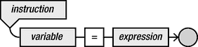
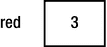
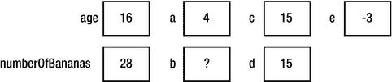
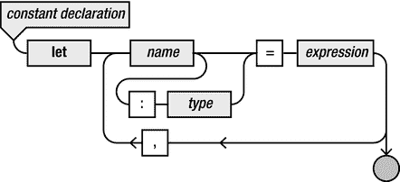
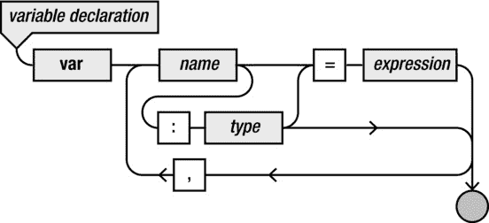
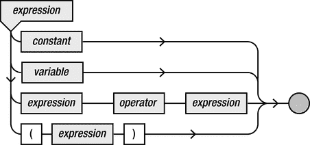
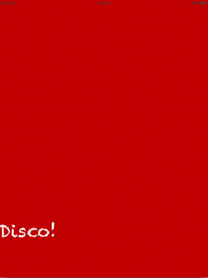

# 3. 创建游戏世界

电子补充材料 本章的在线版本（doi：[10.1007/978-1-4842-0650-8_3](http://dx.doi.org/10.1007/978-1-4842-0650-8_3)）包含补充材料，仅供授权用户使用。

本章将向你展示如何通过在内存中存储信息来创建游戏世界。我将介绍基本类型和变量，以及如何使用它们来存储或更改信息。接下来，你将看到如何在由成员变量和方法组成的对象中存储更复杂的信息。

## 基本类型和变量

前几章多次讨论了内存。你已经了解了如何执行像 `backgroundColor = UIColor.blueColor()` 这样的简单指令，将应用屏幕的背景色设置为特定值。在本章的示例中，你将使用内存来临时存储信息，以便记住一些简单计算的结果。

### 类型

类型（或数据类型）表示不同种类的结构化信息。前面的示例使用了传递给函数的不同种类的信息作为参数。例如，函数 `print` 需要文本，`BasicGame` 示例中的 `update` 方法需要当前系统时间，而第 1 章示例中的 `printData` 函数则不需要任何信息即可执行任务。编译器可以区分所有这些不同种类的信息，在某些情况下，甚至可以将一种类型的信息转换为另一种类型。例如，再看一下以下 Swift 指令：

```
print(currentTime)
```

`print` 函数需要文本，但提供的是一个以秒为单位的时间值，这不是文本，而是一个数字。在这种情况下，Swift 编译器能够自动将这个数字转换为可打印的文本。然而，一般来说，Swift 是一种相当严格的语言，因此通常不允许在不同类型的信息之间进行自动转换。大多数情况下，你必须明确告诉编译器需要进行类型转换。这种类型转换也称为强制类型转换。

为什么在类型转换方面要有如此严格的策略？一方面，明确定义函数或方法期望的参数类型，有助于其他程序员理解如何使用该函数。以下面的头部为例：

```
func playAudio(audioFileId)
```

仅看这个头部，你无法确定 `audioFileId` 是数字还是文本。因此，在 Swift 中，你必须指明期望的参数类型：

```
func playAudio(audioFileId: Int)
```

你可以看到，在这个头部中，不仅提供了名称，还提供了属于该名称的类型。这里的类型是 `Int`，在 Swift 中表示整数。


### 变量的声明与赋值

在 Swift 中存储信息并在后续使用是很简单的。你只需为这些信息提供一个名称，以便在需要时引用它们。这个名称被称为变量。变量是内存中一个有名称的位置。当你想在程序中使用变量时，必须先声明它，然后才能实际使用。声明变量的方式如下：

`var red: Int`

在这个例子中，`var` 关键字表示你正在声明一个变量。变量的名称是 `red`。最后，冒号后面的 `Int` 表示这个变量可以存储整数值。声明变量后，你就可以在程序中使用它来存储信息，并在需要时访问它。

在 Swift 中，你可以一次性声明多个变量。例如：

`var red: Int, green: Int, fridge: Int, grandMa: Int, applePie: Int`

这里你声明了五个不同的变量，可以在程序中使用。当你声明这些变量时，它们会包含任意值。Swift 不允许你在声明后直接访问变量。你需要先通过赋值来初始化变量。你可以使用赋值指令来给变量赋值。例如，我们给变量 `red` 赋值如下：

`red = 3`

赋值指令由以下部分组成：

- 需要被赋值的变量名称
- `=` 符号
- 变量的新值

你可以通过中间的等号来识别赋值指令。不过，在 Swift 中，最好将这个符号理解为“变为”，而不是“等于”。毕竟，变量在当前时刻并不等于等号右边的值——而是在指令执行后变为那个值。描述赋值指令的语法图如图 3-1 所示。



图 3-1. 赋值指令的语法图

所以，你现在已经看到了声明变量的指令和在其中存储值的指令。但如果你在声明变量时就已经知道要存储什么值，你可以将变量声明和首次赋值合并起来：

`var red: Int = 3`

当这条指令执行后，内存将包含值 3，如图 3-2 所示。



图 3-2. 变量声明和赋值后的内存状态

当你将声明与变量初始化合并时，无需提供类型信息，因为从你赋的值已经可以明确类型。所以指令

`var x = 12`

等同于

`var x: Int = 12`

这种通过查看你赋给变量的值来自动定义变量类型的过程称为类型推断。一旦变量的类型被定义（无论是显式指定还是推断得出），就不能再更改。有些语言（例如 JavaScript）允许在任何时候更改变量的类型。与 Swift 相反，这些语言因此被称为弱类型语言。

除了变量，Swift 还允许你声明和初始化常量。常量对于定义诸如重力（除非你的游戏发生在不同的星球上，否则不会改变）、游戏包含的固定关卡数量或数学常量（如 π）等非常有用。声明常量时，将 `var` 替换为 `let`，例如：

`let numberOfLevels = 50`

或者使用显式的类型指示，例如：

`let numberOfLevels: Int = 50`

以下是有关数值变量声明和赋值的更多示例：

```
let age = 16
var numberOfBananas: Int
numberOfBananas = 2
var a: Int, b: Int
a = 4
var c = 4, d = 15, e = -3
c = d
numberOfBananas = age + 12
```

在这个示例的第四行，你可以看到可以在一次声明中声明多个变量。你甚至可以在一次声明中完成多个带赋值的声明，如示例代码的第六行所示。在赋值号的右侧，你可以放置其他变量或数学表达式，正如最后两行所示。指令 `c = d` 的结果是，变量 `d` 中存储的值也被存储到变量 `c` 中。因为变量 `d` 包含值 15，在指令执行后，变量 `c` 也包含值 15。最后一条指令获取变量 `age` 中存储的值（16），将其加 12，然后将结果存储在变量 `numberOfBananas` 中（现在它的值是 28——好多香蕉！）。总之，在这些指令执行后，内存的状态大致如图 3-3 所示。



图 3-3. 多个变量声明和赋值后的内存概览。变量 b 包含一个任意的整数值

声明变量（带可选的初始化）的语法如图 3-4 中的图表所示。在图 3-5 中，你可以看到常量声明的语法图。注意，这两张图唯一的两个区别是使用的关键字以及变量/常量初始化的可选性或强制性。



图 3-5. 常量声明和初始化的语法图



图 3-4. 带可选初始化的变量声明语法图

### 指令与表达式

如果你查看语法图中的元素，可能会注意到赋值号右侧的值或程序片段被称为表达式。那么表达式和指令之间有什么区别呢？两者的区别在于，指令会以某种方式改变内存，而表达式则有一个值。指令的例子包括方法调用和赋值，正如你在上一节中看到的。指令通常使用表达式。以下是一些表达式的例子：

```
16
numberOfBananas
2
a + 4
numberOfBananas + 12 - a
-3
"Hello, World!"
```

所有这些表达式都代表某种类型的值。除了最后一行，所有表达式都是数字。最后一个表达式是一个字符串（字符序列）。除了数字和字符串，还有其他类型的表达式，例如使用运算符的表达式。

## 运算符与更复杂的表达式

本节讨论 Swift 中已知的不同运算符。你必须了解每个运算符的优先级，以便知道计算的执行顺序。

### 算术运算符

在数值表达式中，可以使用以下算术运算符：

- `+`（加法）
- `-`（减法）
- `*`（乘法）
- `/`（除法）
- `%`（取余，或“模运算”）

乘法使用星号，因为数学中通常使用的符号（∙ 和 ×）在计算机键盘上找不到。完全省略这个运算符（就像数学中也常做的，例如公式 f(x)=3x）在 Swift 中是不允许的，因为它会与由多个字符组成的变量产生混淆。

取余运算符 `%` 给出除法的余数。例如，`14%3` 的结果是 2，`456%10` 的结果是 6。结果始终在 0 和运算符右侧的值之间。如果除法的结果是整数，则结果为 0。


### 运算符优先级

当表达式中使用多个运算符时，适用常规的算术优先级规则：先乘除，后加减。因此，表达式 `1+2*3` 的结果是 7，而不是 9。加法和减法具有相同的优先级，乘法和除法也是如此。

如果一个表达式包含多个优先级相同的运算符，则表达式从左到右进行运算。所以，`10-5-2` 的结果是 3，而不是 7。当你希望偏离这些标准的优先级规则时，可以使用括号：例如 `(1+2)*3` 和 `3+(6-5)`。在实际应用中，这类表达式通常还包含变量；否则你可以自己计算出结果（分别是 9 和 4）。

使用多于必要的括号是允许的：例如 `1+(2*3)`。如果你愿意，甚至可以随心所欲地使用括号，比如 `((1)+(((2)*3)))`。但是，这样做会大大降低程序的可读性。

概括来说，一个表达式可以是一个常量值（如 12），可以是一个变量，可以是括号内的另一个表达式，也可以是一个表达式后跟一个运算符再跟另一个表达式。图 3-6 展示了表示表达式的（部分）语法图。



图 3-6. 表达式的部分语法图

## 其他数值类型

除了整数类型之外，Swift 还支持其他数值类型。例如，Swift 有一种名为 `Double` 的类型。这种类型的变量可以包含带小数的数字。在声明

`var d: Double`

之后，你可以通过赋值操作给该变量一个值：

`d = 2.18`

`Double` 类型的变量也可以包含整数：

`d = 10`

在后台，编译器会自动在小数点后面放置一个零。与 `Int` 类型不同，对 `Double` 变量进行除法运算只会产生很小的舍入误差：

`d = d / 3`

现在变量 `d` 的值为 3.33333333。

除了 `Int` 和 `Double` 之外，Swift 中还有 10 种其他类型用于数值变量。其中 8 种可用于表示整数。这些类型之间的区别在于它们所能表示的数值范围。某些类型可以表示更大范围的数值，但缺点是需要更多内存。内存是有限的，尤其是在为智能手机开发游戏时。因此，在存储数字时，应事先考虑哪种类型最合适。例如，如果要存储当前关卡索引，使用 `Double` 类型就没有意义，因为关卡索引是整数。在这种情况下，只保存正整数的类型会更合适。有些类型可以同时包含负数和正数；其他类型只能包含正数。表 3-1 概述了 Swift 中使用的各种整数类型。

表 3-1. Swift 中可用的整数数值类型概览

| 类型 | 占用空间 | 最小值 | 最大值 |
| --- | --- | --- | --- |
| `Int8` | 8 位/1 字节 | -128 | 127 |
| `Int16` | 16 位/2 字节 | -32,768 | 32,767 |
| `Int32` | 32 位/4 字节 | -2,147,483,648 | 2,147,483,647 |
| `Int64` | 64 位/8 字节 | -9,223,372,036,854,775,808 | 9,223,372,036,854,775,807 |
| `UInt8` | 8 位/1 字节 | 0 | 255 |
| `UInt16` | 16 位/2 字节 | 0 | 65,535 |
| `UInt32` | 32 位/4 字节 | 0 | 4,294,967,295 |
| `UInt64` | 64 位/8 字节 | 0 | 18,446,744,073,709,551,615 |

仅当计划使用极高或极低（负数）值时，才需要使用 `Int64` 类型。如果数值范围有限，则使用 `Int8` 类型。通常，只有当需要大量此类变量（数千甚至数百万）时，节省的这些内存才有意义。每个整数类型也有一个无符号版本，其名称以 U 开头。无符号类型只能包含大于或等于 0 的值。最后，`Int` 在 32 位平台上占用 32 位，在 64 位平台上占用 64 位。

对于实数，有三种不同的类型可用。它们不仅在于可存储的最大值不同，还在于小数点后的精度不同。你已经看到过 `Double` 类型，其精度至少为 15 位。`Float` 类型的精度可能只有 6 位小数，但 `Float` 类型变量占用的空间也只有 `Double` 的一半。最后，还有一种高精度的 `Float80` 类型，最多可处理 19 位精度。

每种类型都有自己的适用场景。例如，`Float80` 类型可能适用于需要非常精确物理计算的游戏。`Double` 类型用于许多数学计算。`Float` 用于精度不那么重要但需要节省内存的情况。

当你将某种类型的表达式转换为另一种类型的表达式时，这称之为类型转换。你可以通过在要转换的目标类型写在表达式前面，并将表达式放在括号内，来将一个值转换为另一种类型。例如，下面是将 `Double` 转换为 `Float` 的方法：

```
let pi: Double = 3.141592653589793
var smallPi: Float = Float(pi) // 值为 3.1415927
```

如上面的示例所示，如果将 `Double` 转换为 `Float`，则会丢失精度。这就是为什么当你想要转换一种类型为另一种类型时，必须向编译器明确指出的原因。如果你想将 `Float` 转换为 `Double`，不会丢失精度，但你仍然需要明确表示你希望编译器转换该值，如下所示：

```
var myDouble: Double = 12.34
var myFloat: Float = 56.78
var anotherDouble: Double = myFloat // 错误
var yetAnotherDouble: Double = Double(myFloat) // 正确
var anotherFloat: Float = myDouble             // 错误
var yetAnotherFloat: Float = Float(myDouble)   // 正确
```


### DiscoWorld 游戏

在前面的小节中，我讨论了不同的变量类型以及如何声明和赋值它们。我举了几个例子，说明如何声明和赋值 `Int` 和 `Double` 等类型的变量。除了数值类型，Swift 中还有许多其他类型。例如，`NSTimeInterval` 也是一种类型，它表示以秒为单位的时间间隔。这用于游戏循环的更新部分，以确定已经过去了多少时间。然后，你可以利用这些信息来改变游戏对象的位置或执行其他操作。

上一章的例子中有一个如下所示的更新方法：

```
override func update(currentTime: NSTimeInterval) {

    backgroundColor = UIColor.blueColor()

}
```

如你所见，`update` 方法有一个名为 `currentTime` 的参数，它包含了当前系统时间。在方法体内部，你可以像使用变量一样使用 `currentTime`。`currentTime` 变量的类型是 `NSTimeInterval`，它实际上是 `Double` 的类型别名。这意味着你可以对 `currentTime` 执行计算，并将这些计算的结果存储到另一个变量中：

```
var time: Double = currentTime % 1
```

表达式 `currentTime % 1` 的结果是 0 到 1 之间的一个数字，因为它是将 `currentTime` 除以 1 后的余数。例如，如果 `currentTime` 包含值 512.34，那么 `currentTime / 1 = 512`，而余数 `currentTime % 1 = 0.34`。

现在，让我们使用变量 `time` 来动态改变背景颜色。在上一章的示例中，你是这样做的：

```
backgroundColor = UIColor.blueColor()
```

在这条指令中，你为名为 `backgroundColor` 的属性赋值。该值的类型为 `UIColor`。`UIColor` 是由 UIKit 框架提供的一种新类型，该框架包含在 SpriteKit 框架内。可以通过几种不同的方式创建该类型的值。第一种方式如上所示。`blueColor` 是 `UIColor` 的一个方法，它创建一个值：蓝色。你也可以通过提供 0 到 1 之间的颜色值来自己创建颜色：

```
backgroundColor = UIColor(red: 0, green: 0, blue: 1, alpha: 1)
```

如果以这种方式构造一个 `UIColor` 变量，你需要提供四个不同的值：红色、绿色、蓝色和透明度。红色、绿色和蓝色值决定了颜色，透明度值决定了透明度。上面的示例创建了一种蓝色。以下是其他一些颜色的示例：

```
var greenColor: UIColor = UIColor(red: 0, green: 1, blue: 0, alpha: 1)
var redColor: UIColor = UIColor(red: 1, green: 0, blue: 0, alpha: 1)
var grayColor: UIColor = UIColor(red: 0.7, green: 0.7, blue: 0.7, alpha: 1)
var whiteColor: UIColor = UIColor(red: 1, green: 1, blue: 1, alpha: 1)
```

如这些示例所示，颜色强度值的范围在 0 到 1 之间，其中 1 为最高颜色强度。通过将红色值设为 1，其他两个值设为 0，你可以创建红色。将所有强度值设为 1，即可得到白色。类似地，将所有值设为 0 即可得到黑色。使用这些 RGB 值，可以创建多种颜色。

在 DiscoWorld 示例中，你将使用经过的游戏时间来改变颜色。你已经将一个值在 0 和 1 之间变化的时间变量存储起来了，如下所示：

```
var time: Double = currentTime % 1
```

现在，你可以像下面这样使用这个变量来改变背景颜色：

```
backgroundColor = UIColor(red: CGFloat(time), green: 0, blue: 0, alpha: 1)
```

当你创建一个 `UIColor` 值时，它需要类型为 `CGFloat` 的参数。`CGFloat` 类型主要针对图形应用程序（类型中的字母 “CG” 代表 Core Graphics）。所有与图形相关的 Apple 类和库都使用这种类型，包括 `UIColor`。如果应用程序为 64 位平台编译，则 `CGFloat` 类型是 `Double` 的别名。对于 32 位平台，`CGFloat` 是 `Float` 的别名。这就是为什么有时需要将表达式转换为 `CGFloat` 的原因。在这个例子中，`time` 是一个 `Double` 值，因此你需要先将其转换为 `CGFloat` 值。对于其他参数，则无需转换，因为诸如 0 或 1 这样的数字常量会自动转换为 `Float` 或 `Double` 值。

这个示例的妙处在于，你可以看到游戏循环是如何工作的，从而动态地改变游戏世界。当你运行 DiscoWorld 示例时，你会看到颜色每秒从黑色变为红色。作为练习，你能让颜色每秒从红色变为黑色吗？你能将其改为不同的颜色吗？或者从红色过渡到蓝色呢？你能修改代码，让颜色过渡持续两秒而不是一秒吗？尝试用这个示例做一些不同的尝试。

为了完成这个示例，请在 `update` 方法中添加以下指令：

```
myLabel.position = CGPoint(x: 100, y: CGFloat(time * 200))
```

这条指令根据 `time` 变量的值改变文本标签的位置。`CGPoint` 是另一种你将经常使用的类型。它表示空间中的一个二维点。如果你创建一个类型为 `CGPoint` 的值，你需要提供 `CGFloat` 类型的参数，类似于 `UIColor`。不同之处在于，要创建一个 `CGPoint` 值，你需要提供像素空间中的 x 和 y 坐标。如果运行程序，你会看到文本标签每秒向上移动 200 像素，然后重置到屏幕底部。这是因为 `time` 变量的值始终在 0 到 1 之间，而你将该值乘以了 200。图 3-7 显示了 DiscoWorld 示例的屏幕截图。尝试尝试使用几个不同的值。你能让标签向下移动而不是向上移动吗？或者你能让它向右移动吗？如何让它沿对角线移动？



图 3-7. DiscoWorld 示例的屏幕截图

## 变量的作用域

声明变量的位置会影响你可以在何处使用该变量。看看 DiscoWorld 示例中的变量 `time`。这个变量是在 `update` 方法中声明（并赋值）的。因为它是在 `update` 方法中声明的，所以你只能在这个方法中使用它。例如，你不能在 `didMoveToView` 方法中使用这个变量。当然，你可以在 `didMoveToView` 方法中声明另一个名为 `time` 的变量，但重要的是要认识到，在这种情况下，在 `update` 中声明的 `time` 变量与在 `didMoveToView` 方法中声明的 `time` 变量并不相同。

或者，如果你在类级别声明一个变量，则可以在该类中的任何地方使用它。`myLabel` 变量是在类级别声明的，该类中的两个方法 `didMoveToView` 和 `update` 都在访问它。`didMoveToView` 方法需要访问它，因为标签需要添加到游戏世界中。`update` 方法需要访问它以便改变其位置。因此，很合乎逻辑的是，这个变量需要在类级别声明，这样属于该类的所有方法都可以使用该变量。

变量可以被使用的地方统称为变量的作用域。在这个例子中，变量 `time` 的作用域是 `update` 方法，而变量 `myLabel` 的作用域是类的范围。

## 你学到的内容

在本章中，你学到了以下内容：

*   如何使用变量在内存中存储基本信息
*   如何创建数值以及更复杂类型的值，例如 `UIColor` 或 `CGPoint`
*   如何使用 `update` 方法通过操作变量来改变游戏世界


