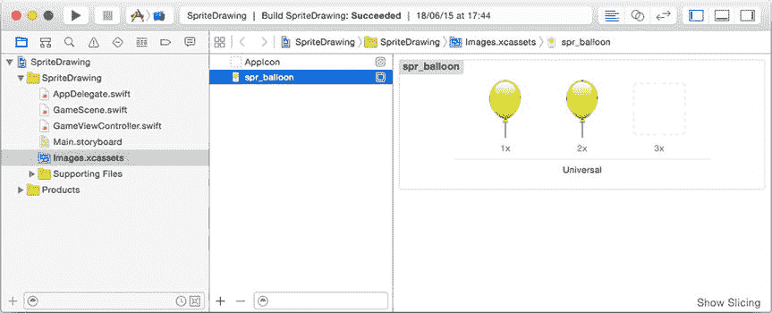
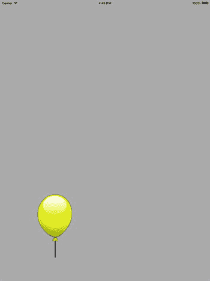
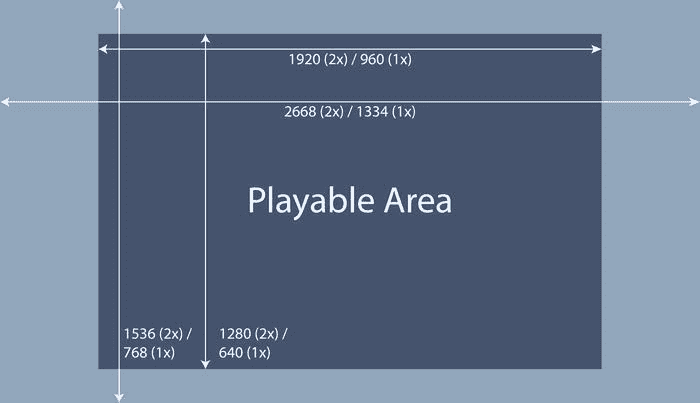
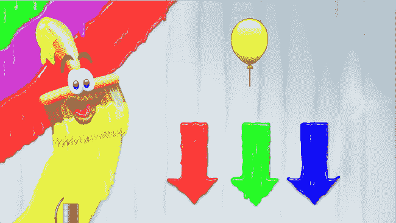
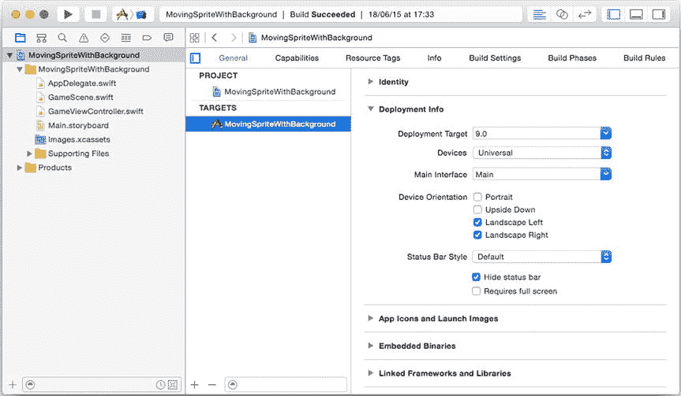

# 4. 游戏资源

电子补充材料 本章在线版本（doi:[10.​1007/​978-1-4842-0650-8_​4](http://dx.doi.org/10.1007/978-1-4842-0650-8_4)）包含补充材料，仅供授权用户使用。

前几章展示了如何在 Swift 中制作一个非常基础的游戏应用。你学习了如何在 Xcode 中创建游戏项目，然后编写几行代码来更改应用的背景颜色或显示文本标签。你还了解了游戏循环，并利用游戏循环的更新部分随时间改变背景颜色。本章将向你展示如何在屏幕上绘制图像，这是制作精美游戏的第一步。在计算机图形学中，这些图像也被称为精灵（sprites）。精灵通常从文件中加载。这意味着任何绘制精灵的程序都不再仅仅是一组孤立的指令，而是依赖于存储在某个位置的游戏资源。这立即引入了一些你需要考虑的问题：

-   精灵位于何处？
-   如何加载并在屏幕上绘制精灵？
-   如何处理各种 iDevice 的分辨率和宽高比？

本章将解答这些问题。

声音是另一种游戏资源。在本章末尾，你还会学习如何在游戏中播放音乐和音效。

> **注**  
> 精灵（sprite）这个名称源于精灵绘制（spriting）技术，即创建用于视频游戏的二维、部分透明的光栅图形。早期，创建这些二维图像需要大量手工工作，但这形成了一种独特的图像风格，激发了人们创作类似图像的热情，最终发展出一种被称为像素艺术（pixel art）或精灵艺术（sprite art）的艺术技巧。

## 定位精灵

在程序使用任何类型的资源之前，它需要知道去哪里寻找这些资源。默认情况下，Xcode 中的游戏项目有一个名为 `Images.xcassets` 的文件夹。查看本章附带的 SpriteDrawing 示例。当你在 Xcode 中打开此项目并左键单击 `Images.xcassets` 时，你会看到它列出了两个文件：一个代表应用图标，另一个名为 `spr_balloon`。后者指的是一个可在屏幕上绘制的气球图像。如果你左键单击气球，你会看到该图像包含多个不同分辨率的子图像（见图 4-1）。由于不同 iOS 设备的技术规格差异（例如配备 Retina 屏幕的 iPad Air 比 iPhone 4 的分辨率高得多），这些不同的分辨率是必要的。本章稍后会详细讨论这个问题。



**图 4-1.** SpriteDrawing 示例中使用的图像

## 加载和绘制精灵

`Images.xcassets` 文件夹中的任何图像都可以加载并绘制在屏幕上。其方式与在屏幕上绘制文本标签非常相似。以下是本章附带的 SpriteDrawing 示例中的 `GameScene` 类：

```swift
class GameScene: SKScene {
    var balloonSprite = SKSpriteNode(imageNamed: "spr_balloon")
    override func didMoveToView(view: SKView) {
        backgroundColor = UIColor.lightGrayColor()
        balloonSprite.position = CGPoint(x: 200, y: 200)
        addChild(balloonSprite)
    }
}
```

可以看到，这里创建了一个名为 `balloonSprite` 的变量。该变量指向一个类型为 `SKSpriteNode` 的值。为了创建这个值，你需要传入一个参数：要加载的精灵的名称。在 `didMoveToView` 方法中，你为 `balloonSprite` 变量分配了一个位置，最后将其添加到场景中。图 4-2 显示了 SpriteDrawing 程序的输出结果。



**图 4-2.** SpriteDrawing 程序的输出结果


## 分辨率和宽高比

在为 iOS 开发游戏时，一个重大挑战是确保你的游戏在不同 iOS 设备上都能呈现良好视觉效果。仅设计精美的精灵图是不够的，你还必须确保其尺寸和分辨率符合平台要求。屏幕分辨率为 1024x768 像素的 iPad 2 与配备 Retina 显示屏、分辨率高达 2048x1536 的 iPad Air 相比，所需的精灵图质量存在巨大差异。不仅分辨率不同，各设备间的宽高比也有所差异。iPad 采用更接近方形的 4:3 宽高比，而 iPhone 6 则采用 16:9 的宽屏比例。那么，该如何应对 iOS 设备之间的这些差异呢？

当然，一个可能的解决方案是将你的游戏设计成仅适用于单一设备。这样一来，你完全无需处理不同 iOS 设备间的差异。然而，这样做会流失大量玩家。在接下来的段落中，我将向你展示一种方法，确保你的精灵图能在多种设备上良好运行，且无需修改代码。你需要关注的主要事项是，确保内部游戏世界的尺寸不会变化过大。例如，考虑 iPhone 4 的 960x640 分辨率和 iPad Air 的 2048x1536 分辨率。处理这两种差异巨大的分辨率的一种方法是，让 iPad Air 比 iPhone 4 显示更多的游戏世界区域（因为其屏幕能容纳更多内容）。然而，这并不是一个好主意。当你设计一款游戏，它应该始终显示单一屏幕，例如本书中的大多数示例游戏，你就无法运用这个技巧。在某些设备上显示更大的游戏世界区域会影响游戏玩法。如果你开发一款策略游戏，你肯定不希望 iPhone 4 玩家因无法像 iPad Air 玩家那样清晰地察觉即将到来的攻击而处于劣势。

另一种处理这些不同分辨率的方法是将游戏世界尺寸与屏幕尺寸分离。这正是苹果公司所采用的方式。在内部，当你为游戏编写代码时，你操作的是点（points），而不是直接操作像素。然而，在某些情况下，点与像素是直接对应的。例如，考虑对 `SpriteDrawing` 示例进行如下修改：

`balloonSprite.position = CGPoint(x: 201, y: 200)`

这个精灵图在 x 正方向移动了一个点。在 iPhone 3GS 或 iPad 2 上，这意味着精灵图将沿该方向移动一个像素。然而，在 iPad Air 上，精灵图将沿 x 正方向移动两个像素。为了获得大致相同的视觉尺寸，你需要创建两种精灵图：一种标准分辨率版本（苹果称之为 "1x"），适用于 iPhone 3GS 或 iPad 2；另一种 Retina 分辨率版本（称为 "2x"），适用于 iPad Air 和新款 iPhone。当你查看气球精灵图时，你会发现其为 1x 和 2x 分辨率都准备了精灵图。Retina（2x）分辨率的精灵图尺寸是标准（1x）分辨率的双倍。这样一来，无论你是在 iPad 2 还是 iPad Air 上玩游戏，你的游戏尺寸都保持不变。在后一种情况下，由于你可以提供 2x 分辨率格式的更高品质美术资源，游戏画面会看起来好得多。

自从 iPhone 6 Plus 问世以来，还提供了一种 3x 分辨率选项，也称为 Retina HD。这种分辨率目前仅由 iPhone 6 Plus 使用，它允许你以更高的分辨率创作美术资源，即标准（1x）分辨率尺寸的三倍。

本书中的游戏使用的美术资源已针对除 iPhone 6 Plus 之外的所有 iDevice 进行了优化。如果你打开任意一个示例，你会看到所有精灵图都以 1x 和 2x 分辨率提供。请注意，即使图像未针对 iPhone 6 Plus 进行优化，示例游戏在其上也能正常运行；不过，如果使用 3x 分辨率的图像，图形效果会更加清晰。

除了使用的分辨率之外，你还需要考虑宽高比。在你的代码中，你可以做的一件事是确保诸如按钮或生命值条之类的覆盖层始终相对于屏幕尺寸进行定位。唯一需要小心处理的区域是设计背景图像时。如果你的背景图像不够大，在某些设备上你会看到黑色的空白区域。

在本书中，我使用的背景图像尺寸为 2668x1536 像素，采用 Retina（2x）分辨率。相应的标准（1x）分辨率则为 1334x768 像素。如此大小的背景图像足够大，使得没有任何设备会显示黑色空白区域。由于 iPhone 屏幕比 iPad 屏幕小得多，iPhone 将仅显示背景的一小部分。例如，横屏模式下的 iPhone 6 宽度为 667 点，并使用 2x 分辨率（1334 像素）。这仅仅是 Retina 分辨率下（2668 像素）整个背景图像的一半。为了更紧密地匹配 iPhone 和 iPad 的点，我在本书使用的每个示例游戏中添加了以下几行代码：

```
var viewSize = skView.bounds.size

if UIDevice.currentDevice().userInterfaceIdiom == .Phone {

    viewSize.height *= 2

    viewSize.width *= 2

}
```

在不深入细节的情况下，这段代码在应用运行于 iPhone 时将点的分辨率加倍。这样做的结果是，一个 2668x1536 的背景现在在 iPhone 6 上几乎可以完整显示。在创建应同时适用于 iPad 和 iPhone 的应用时，你无需再过于谨慎地考虑游戏运行在哪个设备上。

大多数设备将只能显示背景图像的一部分。在 iPad 上，背景的左右两侧将不可见。在 iPhone 6 上，顶部和底部的一部分条带将不会显示（如果应用了上述点分辨率加倍的技巧）。在考虑了所有不同设备后，你最终会得到一个可玩区域：即无论宽高比和分辨率如何，在所有设备上始终可见的背景区域。图 4-3 展示了标准（1x）和 Retina（2x）分辨率下的可玩区域概览。



图 4-3. 背景图像的可玩区域

你可以利用这一信息来正确设计你的背景。如果你希望背景中的某个元素在所有设备上可见，请确保它位于可玩区域内。再次强调，这仅是背景设计时需要关注的问题。游戏的其他元素（例如菜单、覆盖层、玩家角色等）可以有其他不同的处理方式。如果你添加这些元素，只需根据屏幕尺寸确定它们的位置。在阅读本书并开发游戏的过程中，你将看到这种方法的几个示例。

> **注意**：本书中游戏的背景和精灵图均以适用于大多数 iDevice 的方式进行设计。这样做需要做出一些权衡。例如，在某些设备上，只会显示背景的一部分。此外，游戏对象在诸如 iPhone 4 或 5 的小屏幕上可能看起来相当小。如果你设计一款游戏，可以考虑为特定设备使用完全不同的资源，甚至分别为 iPhone 和 iPad 版本设计不同的关卡。设计一款在有限设备上运行效果出色的游戏，总比设计一款在任何设备上运行效果都不太理想的游戏要好。

本章附带的 `ScreenSizeTest` 示例通过将图 4-3 作为背景图像显示，向你展示每个设备会显示游戏世界的哪一部分。在 iOS 模拟器中尝试在不同设备上运行它，看看效果。以下是该示例中一行有趣的代码，你可以在 `GameScene.swift` 文件的 `didMoveToView` 方法中找到它：


`anchorPoint = CGPoint(x: 0.5, y: 0.5)`

请记住，场景中坐标系的原点位于屏幕的左下角。上述代码更改了这一设定，使得原点位于屏幕的中心。坐标系原点的设置值是相对于屏幕的总宽度和总高度来指定的。例如，值 `(1.0, 1.0)` 表示屏幕的右上角。因此，值 `(0.5, 0.5)` 就代表了屏幕的中心。

尤其是在处理背景时，将原点设置为屏幕中心非常有用，因为这样计算不同设备上的背景位置会变得容易得多。由于精灵默认以其中心点作为绘制位置，而位置 `(0, 0)` 现在又是屏幕的中心，因此精灵默认情况下会居中显示在屏幕上。请删除这行代码（或将其注释掉），然后运行示例程序，看看会发生什么。

上面这行代码是一条赋值指令。名为 `anchorPoint` 的变量被赋予了一个值。被赋予的值是 `CGPoint(x: 0.5, y: 0.5)`。你也可以说，这行代码将一个 `CGPoint` 类型的值赋值给了 `anchorPoint`。一个 `CGPoint` 类型的值是通过编写该类型的名称，然后在括号内提供创建该值所需的参数来创建的。在此例中，需要提供 x 和 y 的值。这里你还可以看到它与简单的内置类型（如 `Int`）之间的区别。对于那些类型，你只需直接编写你想要赋值的值：

```
var age: Int = 12
```

对于更复杂的类型（例如 `CGPoint`），你需要编写类型名称，然后在括号内提供创建该值所需的参数。另一个复杂类型的例子是 `UIColor`。下面是一个使用 `UIColor` 类型进行赋值的示例：

```
backgroundColor = UIColor(red: CGFloat(time), green: 0, blue: 0, alpha: 1)
```

这里你看到了相同的语法：编写类型名称，然后在括号内提供所需的参数。其中一个参数是 `red`。而该参数被赋予的值，本身也是由一个名为 `CGFloat` 的非内置类型创建的。同样，你会看到编写了类型名称（`CGFloat`），并在括号内提供了所需的参数（`time`）。每当你使用像 `UIColor` 或 `CGPoint` 这样的复杂类型创建值时，这个值也被称为一个对象，或者该类型的一个实例。

类型非常有用。它们提供了一种蓝图，描述了值应该是什么样子。例如，`CGPoint` 类型描述了一个用于二维点的数据结构。你无需考虑如何创建这样一个数据结构；`CGPoint` 会为你完成。你只需要在创建 `CGPoint` 实例时提供正确的参数值即可。

## 移动精灵

现在你可以在屏幕上绘制精灵了，接下来就可以使用游戏循环来让它移动，就像你在[第 3 章](https://example.org/zh/chapter3)的 DiscoWorld 示例中对文本标签所做的那样。在 SpriteDrawing 程序中，你在屏幕上绘制了一个气球。让我们对程序进行一点小扩展，根据经过的时间来改变气球的位置。首先，你需要在 `GameScene` 类中添加 `update` 方法，使其成为游戏循环的一部分。在 DiscoWorld 示例中，你获取并存储当前时间的方式如下：

```
var time: Double = currentTime % 1
```

让我们尝试改变气球的位置，让它从屏幕左侧飞到右侧。一个简单的方法是使用 `time` 变量来改变位置。为了避免过多的类型转换，你可以将时间存储为 `CGFloat` 类型，而不是 `Double` 类型，`CGFloat` 是 SpriteKit 中用于表示浮点值的主要类型：

```
var time = CGFloat(currentTime % 1)
```

现在，你可以像下面这样使用 `time` 变量来改变气球的位置：

```
balloonSprite.position = CGPoint(x: time * 200, y: 200)
```

由于 `time` 变量的值总在 0 到 1 之间，因此 x 值的范围将在 0 到 200 之间（因为你将 `time` 乘以了 200）。然而，你的 iDevice 上可视区域的宽度可能不是 200 点，而是其他数值。此外，宽度还取决于你是横向还是纵向握住设备。幸运的是，`GameScene` 类有一个名为 `size` 的变量，它包含另外两个变量 `width` 和 `height`。请看下面这行代码：

```
balloonSprite.position = CGPoint(x: time * size.width, y: 200)
```

这条指令没有将时间乘以一个固定值，而是将时间乘以了屏幕的当前宽度。因此，气球将从屏幕左侧移动到右侧。本章附带的 MovingSprite 示例展示了以这种方式改变气球位置的结果。如果你旋转设备（例如，在 iOS 模拟器中，选择 Hardware ➤ Rotate left），你会看到无论设备方向或屏幕宽度如何，气球仍会从设备左侧移动到右侧。尝试一些不同的操作，看看如何修改这个程序。你能让精灵从右向左移动吗？你能让精灵移动得更快或更慢吗？


### 加载与绘制多个精灵

只能显示单个精灵的游戏构建起来多少有些乏味。通过显示一个背景精灵，可以让你的游戏在视觉上更具吸引力。这意味着你需要加载并定位两个精灵，而不是一个。`MovingSpriteWithBackground` 示例展示了如何实现这一点。在这个示例中，你会看到现在有两个变量引用着两个精灵：

`var backgroundSprite = SKSpriteNode(imageNamed: "spr_background")`

`var balloonSprite = SKSpriteNode(imageNamed: "spr_balloon")`

当你处理多个精灵时，需要考虑哪个精灵应该绘制在最上层。在这个示例中，你希望气球绘制在背景之上，反之则不行。如何实现呢？到目前为止，你已经知道游戏世界拥有 x 轴和 y 轴，其默认原点位于屏幕左下角。实际上，游戏世界还有一个 z 轴，它垂直于屏幕指向你。你可以改变精灵在这个 z 轴上的位置。由于它垂直于屏幕，z 位置值越高，意味着精灵离你越近。因此，如果你为气球选择比背景更高的 z 位置，气球将会绘制得离你更近，从而在背景之上可见。以下是实现此目的的两个赋值指令：

`backgroundSprite.zPosition = 0`

`balloonSprite.zPosition = 1`

当精灵的 z 位置设置正确后，你就可以将它们添加到场景中（见图 4-4）：



*图 4-4. MovingSpriteWithBackground 示例*

`addChild(backgroundSprite)`

`addChild(balloonSprite)`

为了让气球正确地从左向右移动，你需要修改 `update` 方法中计算其位置的代码。这是必要的，因为您已经将坐标系统的原点更改为屏幕中心。你唯一需要做的就是从 x 位置减去屏幕宽度的一半，如下所示：

`balloonSprite.position = CGPoint(x: time * size.width – size.width/2, y: 200)`

这里你可以看到，可以使用 `size` 来获取屏幕的尺寸。虽然它看起来像一个变量，但它实际上是别的东西：一个属性。属性与方法一样，属于类。不同之处在于属性不需要括号内的参数；它们只是表示某种数值。在这种情况下，该值就是屏幕的尺寸。这个值又分为两部分：宽度和高度。每个部分都代表一个 `CGFloat` 数值。由于 `time` 也是 `CGFloat` 类型，你可以将这些值相互结合使用，而无需进行任何类型转换。

你之前已经使用过属性。例如，你使用过 `anchorPoint` 来改变坐标系统的原点，它也是一个属性。你甚至已经定义过自己的属性。如果一个变量在类级别定义（例如 `backgroundSprite` 或 `balloonSprite`），那么这个变量就被称为类的属性。稍后，我将更详细地讨论属性。

每次你想在屏幕上绘制一个精灵时，都可以定义一个 `SKSpriteNode` 属性并将其添加到场景中。例如，如果你想在背景上不同位置绘制几个气球，只需为你想要添加到场景中的每个气球定义一个属性：

`var balloonSprite2 = SKSpriteNode(imageNamed: "spr_balloon")`

`var balloonSprite3 = SKSpriteNode(imageNamed: "spr_balloon")`

`var balloonSprite4 = SKSpriteNode(imageNamed: "spr_balloon")`

你需要确保在 `didMoveToView` 方法中将每个精灵添加到场景中，如下所示：

```
override func didMoveToView(view: SKView) {
    anchorPoint = CGPoint(x: 0.5, y: 0.5)
    backgroundSprite.zPosition = 0
    balloonSprite.zPosition = 1
    balloonSprite2.zPosition = 1
    balloonSprite3.zPosition = 1
    balloonSprite4.zPosition = 1

    addChild(backgroundSprite)
    addChild(balloonSprite)
    addChild(balloonSprite2)
    addChild(balloonSprite3)
    addChild(balloonSprite4)
}
```

这里你还可以看到，所有气球精灵都绘制在背景之前。你也可以同时绘制多个移动的精灵。对于每个气球，你需要在 `update` 方法中改变其位置：

```
override func update(currentTime: NSTimeInterval) {
    var time = CGFloat(currentTime % 1)

    balloonSprite.position = CGPoint(x: time * size.width - size.width/2, y: 200)
    balloonSprite2.position = CGPoint(x: time * size.width - size.width/2 – 100, y: 200)
    balloonSprite3.position = CGPoint(x: time * size.width - size.width/2, y: 0)
    balloonSprite4.position = CGPoint(x: time * size.width - size.width/2 – 100, y: 0)
}
```

你可以尝试这个示例。思考在屏幕上绘制移动气球的不同方法。尝试一些不同的位置值。你能让一些气球比其他气球移动得更快或更慢吗？

## 配置设备方向

尤其是在开发游戏时，考虑设备的方向非常重要。你是要创建一个横屏模式还是竖屏模式的游戏？有些游戏在竖屏模式下表现更好，而另一些则在横屏模式下更好。这也取决于玩家与游戏世界的交互方式。例如，竖屏模式的游戏设计方式是：你像平常一样拿着手机，用另一只手操作屏幕。这对于像《神庙逃亡》这样需要在屏幕上滑动的游戏来说是个好方法。另一方面，横版卷轴游戏通常更适合横屏，因为你希望尽可能多地显示一个关卡的宽度，以避免过多滚动。在本书中，你将同时开发竖屏和横屏游戏。

默认情况下，Xcode 中的项目允许任何设备方向，并且它会相应地旋转图形。对于大多数游戏来说，这并不可取，因为你通常创建的布局要么适合竖屏模式，要么适合横屏模式，而不是两者都适合。在 Xcode 的项目设置中，有一种简单的方法可以更改允许的设备方向。点击屏幕左上角的项目，然后选择目标（例如，`MovingSpriteWithBackground`）。在 “Deployment Info” 下，你可以选择允许的方向。在 “Devices” 选择框中，选择是要更改 iPad 版本、iPhone 版本还是 Universal 版本（如果你想要创建一个同时适用于 iPhone 和 iPad 的应用程序，可以选择这个选项）的允许方向。图 4-5 显示了 Xcode 中的方向选择屏幕。运行程序，看看当你在 iOS 模拟器中模拟设备旋转时，应用程序如何响应。你可以通过进入模拟器中的 “Hardware” 菜单，然后选择向左或向右旋转来旋转设备。



*图 4-5. 选择应用程序支持的设备方向。如果项目和目标列表不可见，请点击 “General” 菜单项左侧的图标以打开面板*


## 音乐与音效

多数游戏都包含音效和背景音乐。这些元素因多种原因而至关重要。音效提供关键提示，向用户表明发生了某些事件。例如，当用户点击按钮时播放点击声，可向用户反馈按钮确实已被按下。听到脚步声则暗示敌人可能就在附近，即便玩家尚未看到他们。而远处传来的铃声能预示某事即将发生。经典游戏《神秘岛》在这方面堪称典范，因为许多关于如何推进游戏的线索都是通过声音传递给玩家的。

环境音效，如滴水声、林间风声和远处车声，能增强体验并带来身临游戏世界的感觉。即便屏幕上没有任何实际活动，它们也能让环境显得更加生动。

**注意**

音乐在玩家体验环境和动作的方式中扮演着关键角色。音乐可用于营造紧张、悲伤、欢乐等多种情绪。然而，在游戏中处理音乐比在电影中困难得多。在电影中，事件走向是确定的，因此音乐可以完美契合。但在游戏中，部分动作由玩家控制。现代游戏采用自适应音乐，这种音乐会根据游戏故事的推进而不断变化。

在 Swift 中，播放背景音乐或音效相对简单。要使用声音，你首先需要一个可以播放的声音文件。在属于本章的 SoundTest 示例程序中，文件 `snd_music.mp3` 被用作背景音乐。为了处理音乐和音效，你需要导入 `AVFoundation` 库，该库包含处理媒体的各种类：

```
import AVFoundation
```

下一步是声明一个指向可播放音频对象的变量，如下所示：

```
var audioPlayer = AVAudioPlayer()
```

现在，你可以在 `didMoveToView` 方法中初始化音频播放器，使其开始播放某个音频文件。这需要三步完成。第一步是构建一个所谓的 URL，表示声音文件的位置。这个 URL 的构建方式需要确保它在所有 iDevice 上都能正常工作。以下是实现这一目标的代码行：

```
let soundURL = NSBundle.mainBundle().URLForResource("snd_music", withExtension: "mp3")
```

这看起来像一个复杂的指令。`NSBundle` 对象是文件系统中一个对可在程序中使用的代码和资源进行分组的位置。`mainBundle` 方法返回一个对应应用程序可执行文件位置的 `NSBundle` 对象。最后，`URLForResource` 方法在 bundle 位置内构建一个文件位置（URL）。因此，最终你所做的只是创建一个计算机可以轻松解释的文件位置表示。

既然已经构建了这个文件 URL，你就可以用对该文件的引用来初始化音频播放器：

```
audioPlayer = try! AVAudioPlayer(contentsOfURL: soundURL!)
```

最后，你可以通过调用 `play` 方法来开始播放音频，如下所示：

```
audioPlayer.play()
```

你可能希望降低背景音乐的音量，以便稍后在其上播放（更响亮的）音效。通过以下指令设置音量：

```
audioPlayer.volume = 0.4
```

`volume` 属性的值介于 0 和 1 之间，其中 0 表示静音，1 表示以最大音量播放声音。

从技术上讲，背景音乐和音效之间没有区别。通常，背景音乐以较低的音量播放；许多游戏会循环播放背景音乐，以便歌曲结束时从头开始重新播放。为此，你可以使用 `numberOfLoops` 属性：

```
audioPlayer.numberOfLoops = 0 // 默认行为：音频仅播放一次
audioPlayer.numberOfLoops = 1 // 音频重复一次（= 音频播放两次）
audioPlayer.numberOfLoops = -1 /* 负值表示循环播放次数无限，
因此音频将始终持续播放 */
```

你在本书中开发的所有游戏都会使用两种类型的声音（背景音乐和音效）来让游戏更刺激。对于每个音效或背景音乐对象，你需要创建一个单独的音频播放器对象。尝试使用示例进行实验。你能为音乐添加一些循环吗？也可以尝试更改声音的音量。

**注意**

在游戏中使用声音和音乐时，需要注意一些事项。声音可能会让某些玩家感到厌烦，因此如果你确实使用了音效或音乐，请确保提供让玩家关闭它们的途径。另外，不要强迫玩家等待声音播放完毕才能继续。你可能创作了一首很棒的音乐，希望在显示介绍画面时播放，但玩家启动你的游戏不是为了听音乐——他们是想玩游戏！同样的原则也适用于游戏内的视频序列。始终为用户提供跳过这些内容的方式（即使你让你最喜欢的家庭成员提供了僵尸音效）。最后，一些玩家的 iPhone 或 iPad 存储空间可能有限，因此请尽可能使用较小的声音文件。

## 本章小结

在本章中，你学习了以下内容：

*   如何将游戏资源（如精灵和声音）加载到内存中
*   如何在屏幕上绘制多个精灵并移动它们
*   如何在游戏中播放背景音乐和音效

