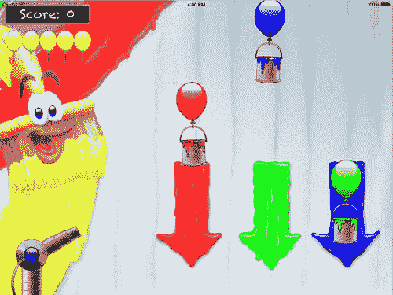

# 第 II 部分 画家

画家

在本部分中，你将开发一个名为“画家”的游戏（见图 II-1）。在开发这个游戏的过程中，我还会介绍一些在编程游戏时非常有用的新技术，例如将指令组织成类和方法、条件指令、迭代等等。

图 II-1. 画家游戏

画家游戏的目标是收集三种不同颜色的颜料：红色、绿色和蓝色。颜料从天空中以罐子形式掉落，这些罐子由气球托浮着，你必须确保每个罐子在从屏幕底部掉落之前具有正确的颜色。你可以通过向掉落的罐子发射所需颜色的颜料球来改变颜料的颜色。你可以使用键盘上的 R、G 和 B 键来选择发射的颜色。你可以通过左键点击游戏屏幕来发射颜料球。如果你点击的位置离颜料炮越远，你赋予球的速度就越高。你点击的位置也决定了炮的射击方向。每个落入正确箱子的罐子将获得 10 分。每个颜色错误的罐子将损失一条生命（由屏幕左上角的黄色气球指示）。你可以通过下载示例代码并运行第 11 章的 PainterFinal 示例来运行此游戏的最终版本。

