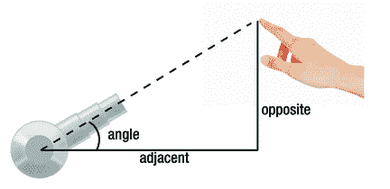
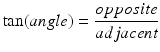
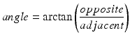
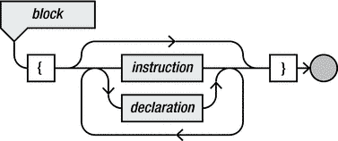
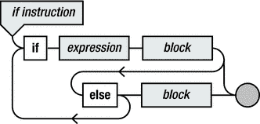
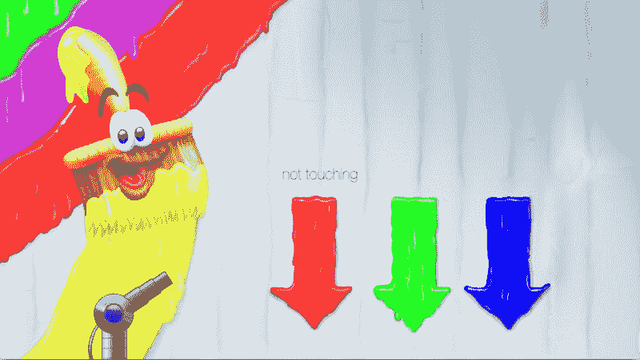
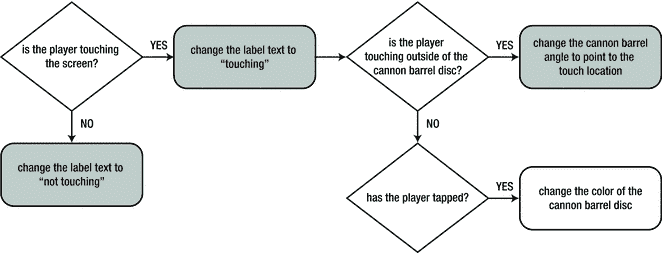

# 5 对玩家输入做出反应

电子补充材料 本章的在线版本 (doi:10.1007/978-1-4842-0650-8_5) 包含补充材料，仅供授权用户使用。

游戏的一个重要元素是它对玩家的操作做出反应。在 iPhone 或 iPad 上，游戏主要响应玩家的触摸输入，这同样适用于你在阅读本书时开发的游戏。一些游戏还使用其他输入数据，例如内置的加速度计，我将在本章中简要讨论。为了处理输入数据，你需要一些新的编程概念，例如 `if` 指令，这将在本章中介绍。


## 处理触摸输入

所有使用触摸屏的 Apple 设备都能追踪多根手指及其在屏幕上的移动轨迹。用户的手指动作可被解读为手势（例如滑动切换页面，或捏合手势进行缩放），也可直接用手指位置来控制游戏元素。要处理触摸输入，你需要在程序中处理三个重要事件：

- 玩家开始用手指触碰屏幕的某个位置。
- 玩家在屏幕上移动手指。
- 玩家停止用手指触碰屏幕。

由于触摸屏能同时处理多个触点，这些事件有时涉及单根手指，有时涉及多根手指。针对这三个事件，你可以在 `GameScene` 类中分别添加一个方法来处理。在这些方法内部，你可以访问触摸屏检测到的各个手指位置。现在，我们创建一个非常简单的触摸处理程序，无论玩家在屏幕上有多少根手指，程序都只记住单个触摸位置。在本章 Painter1 示例中打开 `GameScene.swift` 文件，即可查看相关代码。

你需要将触摸位置存储在某处，因此我们先在 `GameScene` 类中添加一个 `CGPoint` 类型的属性：

`var touchLocation = CGPoint(x: 0, y: 0)`

为了了解多点触摸的工作原理，我们再添加一个属性来记录玩家触碰屏幕的手指数量（初始值设为 0）：

`var nrTouches = 0`

现在，每当玩家与触摸屏交互时，你都需要更新 `touchLocation` 和 `nrTouches` 属性的值。完成这些操作后，你就可以对游戏世界进行相应修改，例如移动精灵或处理玩家点击按钮的操作。

为了处理触摸输入，你需要在 `GameScene` 类中添加三个方法与前述三类事件对应。这些方法分别命名为 `touchesBegan`、`touchesMoved` 和 `touchesEnded`。以下是 `touchesBegan` 方法：

```
override func touchesBegan(touches: Set<UITouch>, withEvent event: UIEvent?) {

   let touch = touches.first!

   touchLocation = touch.locationInNode(self)

   nrTouches = nrTouches + touches.count

}
```

该方法接收两个参数。第一个参数是名为 `touches` 的变量，类型为 `Set<UITouch>`，表示一个或多个触摸位置。`Set` 是一种泛型类型，可表示多种集合。类型名后的尖括号表示该集合的具体类型，例如 `Set<Int>` 表示整数集合。而这里的 `Set<UITouch>` 则表示 `UITouch` 对象的集合。`UITouch` 对象包含了触摸的所有相关信息，例如触摸位置、用户开始触摸的时间等。第二个参数（在方法体中未使用）包含事件的其他信息，如事件发生的具体时间。你还会发现第二个参数有两个名称：第一个名称（`withEvent`）在调用该方法时使用，第二个名称（`event`）用于在方法体内部访问事件对象。在 Swift 中编写方法或函数时，还有许多其他特性和选项。第 6 章 将更详细地讨论方法和函数。

该方法体由三条指令组成。第一条指令声明一个名为 `touch` 的常量，并将表达式 `touches.first!` 的结果赋值给它。该表达式的前半部分是 `touches`，即玩家触摸屏幕的位置集合。其后是点号与属性名 `first`。点号的用法你之前已经见过，例如：


`background.zPosition = 0`

在 Swift 中，点（`.`）通常表示从某个对象中获取信息，或以某种方式修改该对象。当前正在操作的对象写在点之前。点之后，你指明要如何操作该对象。在上面的例子中，`background`对象有一个名为`zPosition`的信息片段（或称为属性），你通过将值`0`赋值给`zPosition`来修改该对象。以下是另一个使用点的示例：

`var myVariable: Int = background.position.x`

在此示例中，你从背景精灵获取位置，然后从该位置获取其 x 值。除了直接访问信息，你还可以调用操作对象的方法，例如：

`background.removeFromParent()`

`removeFromParent`方法通过将背景对象从游戏场景中移除来操作它。基本上，它撤销了以下指令的效果：

`addChild(background)`

回到触摸输入示例，`first`是`Set<UITouch>`类型的一个属性，它返回触摸集合中的第一个元素。整个表达式以感叹号结尾。这与`touches`对象可能为空有关，这意味着`first`属性无法获取位置，因为没有任何位置。感叹号表示程序员知道这一点，并保证`touches`永远不会为空——这是合理的，因为如果玩家没有开始触摸屏幕，`touchesBegan`方法永远不会被调用。第 12 章详细讨论了感叹号的用法，也称为解包。

`touchesBegan`方法中的第二条指令将值赋给`touchLocation`属性。该值是调用`touch`变量中的`locationInNode`方法（参数为`self`）的结果。这会计算在游戏场景内触摸位置的位置。单词`self`指的是游戏场景对象。`self`的确切含义将在后面详细讨论。

所以，总结一下，前两条指令从一组触摸中检索触摸信息对象，计算其在游戏场景中的位置，然后将该位置赋给`touchLocation`属性。第三条也是最后一条指令简单得多；它将集合中的触摸次数（使用`count`属性获取）加到`nrTouches`属性上，如下所示：

`nrTouches = nrTouches + touches.count`

这条指令再次说明，在 Swift 中，你永远不应将`=`符号读作“等于”，而应始终读作“赋值”。因此，此赋值的右侧是`nrTouches`当前值与已开始的新触摸次数之和。此赋值有一个简写版本，如下所示：

`nrTouches += touches.count`

你可以将这条指令理解为“将`touches.count`加到`nrTouches`上”。类似地，Swift 也支持减法（`-=`）、乘法（`*=`）和除法（`/=`）等操作的简写符号。

你可以看到，减法简写符号用于`touchesEnded`方法，该方法仅包含一条指令：

```
override func touchesEnded(touches: Set<UITouch>, withEvent event: UIEvent?) {

nrTouches -= touches.count

}
```

在此方法中，你只需从`nrTouches`变量中减去已结束的触摸次数。这样，`nrTouches`变量现在可以跟踪玩家当前放置在触摸屏上的手指数量。

你需要定义的最后一个方法是`touchesMoved`。它处理玩家的任何手指移动。由于触摸次数没有变化，该方法包含两条指令：一条用于检索触摸信息，另一条用于更新触摸位置：

```
override func touchesMoved(touches: Set<UITouch>, withEvent event: UIEvent?) {

let touch = touches.first!

touchLocation = touch.locationInNode(self)

}
```

再次说明，请注意这种方法不兼容玩家在屏幕上多个点触摸的情况，因为你只从集合中检索了一个触摸位置。在第 12 章中，我将向你展示一个更优雅的解决方案，该方案能正确处理多点触摸和触摸移动。


### 利用触摸位置改变游戏世界

在上一节中，你已经了解了如何读取触摸输入并将触摸位置存储到属性中。你可以利用这个触摸位置来对游戏世界做出改变。例如，你可以根据触摸位置绘制一个精灵。Painter 游戏的特点之一是包含一个可旋转的炮管，它会根据玩家触摸屏幕的位置进行旋转。这个炮管由玩家控制，用于发射油漆球。在本节中，你将学习如何为游戏添加这样一个可旋转的炮管。

要实现这一功能，你需要声明几个属性。无论如何，你都需要用属性来存储背景和炮管精灵。如下所示，代码中已经声明并初始化了以下属性：

`var background = SKSpriteNode(imageNamed: "spr_background")`

`var cannonBarrel = SKSpriteNode(imageNamed: "spr_cannon_barrel")`

在 `didMoveToView` 方法中，你需要将这些对象放置到正确的位置，确保炮管绘制在背景之上，并将这些对象添加到游戏场景中。你还需要为炮管选择正确的原点（锚点），因为旋转精灵时，它会围绕其原点旋转。以下是实现这一功能的指令：

`background.zPosition = 0`

`cannonBarrel.zPosition = 1`

`cannonBarrel.position = CGPoint(x:-412, y:-220)`

`cannonBarrel.anchorPoint = CGPoint(x:0.24, y:0.5)`

`addChild(background)`

`addChild(cannonBarrel)`

炮管的位置经过精心选择，使其能够完美契合已经绘制在背景上的炮座。炮管图片包含一个圆形部分，实际的炮管附着其上。你希望炮管围绕该圆形部分的中心旋转。这意味着你必须将这个中心点设置为原点。由于圆形部分位于精灵的左侧，且该圆的半径是炮管精灵高度的一半，因此你将炮管原点设置为 `(0.24, 0.5)`，正如你在代码中看到的那样。你可以尝试在 Painter1 示例中更改这些值，以观察旋转精灵时会发生什么。

下一步是计算炮管根据触摸位置应具有的旋转角度。由于每次玩家移动时都需要执行此操作，因此最好的实现位置是在 `update` 方法中。那么如何计算这个角度呢？请看图 5-1。



图 5-1. 根据触摸位置计算炮管角度

如果你还记得数学课上学过的知识，可能会回忆起三角形中的角度可以用三角函数来计算。在这种情况下，你可以使用正切函数来计算角度，公式如下：



换句话说，角度由下式给出：



你可以通过计算触摸位置与炮管位置之间的差值，来得到对边和邻边的长度，如下所示：

```
let opposite = touchLocation.y - cannonBarrel.position.y
let adjacent = touchLocation.x - cannonBarrel.position.x
```

现在你需要使用这些值来计算反正切。该怎么做呢？幸运的是，Swift 拥有许多有用的数学函数，包括正弦、余弦、正切等三角函数，以及它们的反函数（反正弦、反余弦和反正切）。有两个函数可以计算反正切。第一个版本接受一个单一值作为参数。但在本例中，你不能使用这个版本：当触摸位置正好位于炮管正上方时，`adjacent` 为零，会导致除以零的错误。

针对需要计算反正切并考虑此类可能奇点的情况，有一个替代的反正切函数。`atan2` 函数将对边和邻边长度作为单独的参数，并在这种情况下返回相当于 90 度的弧度值。你可以使用此函数来计算角度，如下所示：

`cannonBarrel.zRotation = atan2(opposite, adjacent)`

如你所见，你让炮管绕 z 轴旋转，该轴是从屏幕指向玩家的方向。

## 基于触摸的条件执行

为了进一步测试触摸输入的处理，我们来添加一个文本标签，用于指示玩家当前是否正在触摸屏幕。Painter1 示例中已经为此声明了一个属性：

`var touchingLabel = SKLabelNode(text:"not touching")`

如你所见，该标签被初始化为文本“not touching”。你需要做的是在 `update` 方法中检查 `nrTouches` 属性的值是否大于零。如果是，则应将文本更改为“touching”。如果 `nrTouches` 等于零，则文本应为“not touching”。因此，你需要设法仅在满足某些条件时才执行指令。你可以通过条件指令来实现这一点，它使用了一个新关键字 `if`。

使用 `if` 指令，你可以提供一个条件，并在该条件为真时执行一组指令（整体而言，这也被称为**分支**）。以下是一些条件的示例：

- 玩家已触摸屏幕。
- 自游戏开始以来经过的秒数大于 1,000。
- 炮管的旋转角度在 0 到 90 度之间。
- 怪物吃掉了你的角色。

这些条件要么为真，要么为假。条件是一个表达式，因为它具有一个值（要么为真，要么为假）。这个值也被称为**布尔值**。使用 `if` 指令，你可以在条件为真时执行一组指令。请看下面这个 `if` 指令示例：

```
if nrTouches > 0 {
    touchingLabel.text = "touching"
}
```

条件紧跟在 `if` 关键字之后。后面跟着一组由花括号括起来的指令。在这个例子中，一旦记录的触摸次数大于 0，标签的文本就被更改为“touching”。如果愿意，你还可以在花括号中放置多条指令：

```
if nrTouches > 0 {
    touchingLabel.text = "touching"
    let opposite = touchLocation.y - cannonBarrel.position.y
    let adjacent = touchLocation.x - cannonBarrel.position.x
    cannonBarrel.zRotation = atan2(opposite, adjacent)
}
```

在这个例子中，只有当玩家实际触摸屏幕时，你才改变炮管的旋转角度。下面是另一个 `if` 指令的示例：

```
if nrTouches == 0 {
    touchingLabel.text = "not touching"
}
```

这条指令会在玩家未触摸屏幕时将触摸标签的文本更改为“not touching”。你还可以在编写 `if` 指令时定义一个替代情况：

```
if nrTouches > 0 {
    touchingLabel.text = "touching"
    let opposite = touchLocation.y - cannonBarrel.position.y
    let adjacent = touchLocation.x - cannonBarrel.position.x
    cannonBarrel.zRotation = atan2(opposite, adjacent)
} else {
    touchingLabel.text = "not touching"
}
```

在这个例子中，如果触摸次数大于零，标签文本被设置为“touching”，并计算炮管的旋转角度。在所有其他情况（如果 `nrTouches` 等于零或更小）下，触摸标签文本被设置为“not touching”。


### 判断备选情况

当存在多个值类别时，可以通过`if`指令判断当前属于哪种情况。第二个测试放在第一个`if`指令的`else`之后，这样只有当第一个测试失败时，才会执行第二个测试。第三个测试可以放在第二个`if`指令的`else`之后，以此类推。

以下代码片段用于判断玩家得分等级，以便显示不同的消息：

```
if score < 100 {
    print("哎呀，你绝对需要多练练！")
} else if score < 500 {
    print("干得好，表现不错。")
} else if score < 1000 {
    print("非常高的分数！")
} else {
    print("太棒了，你简直无敌！")
}
```

每个`else`（最后一个除外）后面都跟着另一个`if`指令。如果玩家得分非常低（低于 100 分），会显示一条消息（“哎呀...”），其余指令将被忽略（它们毕竟位于`else`之后）。而表现较好的玩家则会依次通过所有测试（是否低于 500 分？是否低于 1000 分？），最终得出玩家获得高分的结论。

我在代码片段中使用了缩进来表明哪个`else`属于哪个`if`。当存在多个不同类别时，程序代码的可读性会越来越差。因此，作为`else`后指令应缩进这一常规规则的例外，对于这种复杂的`if`指令，你可以使用更简洁的布局：

```
if score < 100 {
    print("哎呀，你绝对需要多练练！")
} else if score < 500 {
    print("干得好，表现不错。")
} else if score < 1000 {
    print("非常高的分数！")
} else {
    print("太棒了，你简直无敌！")
}
```

这种布局的另一个优势在于，能更轻松地看出指令处理了哪些情况。除了`if`指令，还有一种名为`switch`的指令，更适合处理多种备选情况。关于如何使用`switch`，请参阅第 19 章。

带备选情况的`if`指令的语法如图 5-2 的语法图所示。`if`指令的主体由花括号内的一个或多个指令组成，因为主体是一个指令块，其定义见图 5-3 的语法图。在`else`关键字之后，有一个箭头指回`if`关键字，以便定义备选链，正如本节前面所解释的。



图 5-3. 指令块的语法图



图 5-2. `if`指令的语法图

### 比较运算符

`if`指令头部中的条件是一个返回真值的表达式：真或假。当表达式的结果为真时，将执行`if`指令的主体。在这些条件中，你可以使用比较运算符。以下是可用的运算符：

- `<`（小于）
- `<=`（小于或等于）
- `>`（大于）
- `>=`（大于或等于）
- `==`（等于）
- `!=`（不等于）

这些运算符可以用于任意两个值之间。在这些运算符的左侧和右侧，你可以放置常量值、变量，或者包含加法、乘法等的完整表达式。测试两个值是否相等时使用双等号（`==`）。这与表示赋值的单等号截然不同。这两个运算符之间的区别非常重要：

`x = 5` 表示将值 5 赋给`x`。  
`x == 5` 表示判断`x`是否等于 5？

### 逻辑运算符

在逻辑术语中，条件也称为谓词。Swift 中也可以使用逻辑中连接谓词的运算符（与、或、非）。它们有特殊的表示法：

- `&&` 是逻辑与运算符。
- `||` 是逻辑或运算符。
- `!` 是逻辑非运算符。

你可以使用这些运算符来检查复杂的逻辑语句，从而仅在特定情况下执行指令。例如，只有当玩家拥有超过 10,000 分、敌人生命值为 0 且玩家生命值大于 0 时，才显示“你赢了！”消息：

```
if playerPoints > 10000 && enemyLifeForce == 0 && playerLifeForce > 0 {
    print("你赢了！")
}
```


### 布尔类型

使用比较运算符或通过逻辑运算符连接其他表达式的表达式也拥有类型，这与使用算术运算符的表达式类似。毕竟，这类表达式的结果是一个值，即 `true` 或 `false` 这两个真值之一。在 Swift 中，这些真值由 `true` 和 `false` 关键字表示。

除了用于在 `if` 指令中表达条件外，逻辑表达式还可以应用于许多不同的场景。逻辑表达式与算术表达式类似，区别仅在于其类型不同。例如，你可以将逻辑表达式的结果存储在变量中、将其作为参数传递，或在另一个表达式中再次使用该结果。

真值的类型是 `Bool`（即布尔型），以英国数学家和哲学家乔治·布尔（George Boole，1815–1864）的名字命名。以下是布尔变量声明和赋值的示例：

```
var test: Bool
test = x > 3 && y < 5
```

例如，如果 `x` 的值为 6，`y` 的值为 3，那么布尔表达式 `x > 3 && y < 5` 的结果为 `true`，该值将存储在变量 `test` 中。你也可以直接将布尔值 `true` 和 `false` 存储在变量中：

```
var isAlive: Bool = false
```

布尔变量在存储游戏中不同对象的状态时极为方便。例如，你可以使用布尔变量来存储玩家是否还活着、玩家当前是否在跳跃、某个关卡是否已完成等信息。你可以在 `if` 指令中将布尔变量用作表达式，如下所示：

```
if isAlive {
    // 执行某些操作
}
```

在这种情况下，如果表达式 `isAlive` 的结果为 `true`，则会执行 `if` 指令的主体。你可能会认为这段代码会引发编译器错误，并且你需要对布尔变量进行如下比较：

```
if isAlive == true {
    // 执行某些操作
}
```

然而，这种额外的比较并非必需。`if` 指令中的条件表达式必须得出 `true` 或 `false` 的结果。由于布尔变量本身已经代表了这两个值之一，因此你无需进行这种比较。

你可以使用布尔类型来存储结果为 `true` 或 `false` 的复杂表达式。让我们再看几个例子：

```
var a = 12 > 5
var b = a && 3 + 4 == 8
var c = a || b
if !c {
    a = false
}
```

在继续往下读之前，请尝试确定执行这些指令后变量 `a`、`b` 和 `c` 的值。在第一行中，你声明并初始化了一个布尔变量 `a`。存储在其中的真值由表达式 `12 > 5` 得出，结果为 `true`。该值随后被赋值给变量 `a`。在第二行中，你声明并初始化了一个新变量 `b`，其中存储了一个更复杂的表达式的结果。该表达式的第一部分是变量 `a`，其值为 `true`。表达式的第二部分是比较表达式 `3 + 4 == 8`。此比较结果为假（3 + 4 不等于 8），因此这一部分的值为 `false`，所以逻辑与运算的结果也是 `false`。因此，执行该指令后，变量 `b` 的值为 `false`。

第三条指令将对变量 `a` 和 `b` 进行逻辑或运算的结果存储在变量 `c` 中。由于 `a` 的值为 `true`，该运算的结果也为 `true`，该结果被赋值给 `c`。最后有一条 `if` 指令，仅当 `!c` 的结果为 `true` 时，才会将值 `false` 赋给变量 `a`。在本例中，`c` 的值为 `true`，因此 `!c` 的结果为 `false`，这意味着 `if` 指令的主体不会被执行。因此，所有指令执行完毕后，`a` 和 `c` 的值均为 `true`，而 `b` 的值为 `false`。

做这类练习表明，逻辑错误的产生非常容易。这个过程类似于你调试代码时所做的事情。逐步执行指令，并确定各个阶段变量的值。一次疏忽就可能让你本以为是 `true` 的值变成了 `false`！

### 更改加农炮的颜色

在前面的章节中，你了解了如何使用 `if` 指令来检查玩家是否触摸了屏幕。现在，让我们扩展程序，使其在点击加农炮管中央时改变加农炮可发射的彩弹颜色。你可以通过运行本章附带的 Painter2 示例来观察此行为。

要编写此行为的代码，你将需要三个额外的精灵，每种颜色一个。如果你在 Xcode 中打开 Painter2 项目中的 `Images.xcassets` 文件夹，就会在列表中看到这三个额外出现的精灵。在 `GameScene` 类中，你添加属性来引用这些精灵，如下所示：

```
var cannonRed = SKSpriteNode(imageNamed: "spr_cannon_red")
var cannonGreen = SKSpriteNode(imageNamed: "spr_cannon_green")
var cannonBlue = SKSpriteNode(imageNamed: "spr_cannon_blue")
```

这些精灵应位于加农炮管的相同位置（加农炮管的原点设置在旋转盘的中心）：

```
cannonRed.position = cannonBarrel.position
cannonGreen.position = cannonBarrel.position
cannonBlue.position = cannonBarrel.position
```

你还必须确保这些精灵绘制在炮管的上方，而不是其后面。为此，你可以将它们的高度位置属性设置得比加农炮管（其高度位置为 1）更高：

```
cannonRed.zPosition = 2
cannonGreen.zPosition = 2
cannonBlue.zPosition = 2
```

问题在于，你并不希望同时绘制这三个精灵，而只是根据加农炮当前将要发射的彩弹颜色绘制其中一个。为此，你可以使用 SpriteKit 框架中每个（精灵）节点都具备的 `hidden` 属性。首先，你隐藏 `cannonGreen` 和 `cannonBlue` 精灵：

```
cannonGreen.hidden = true
cannonBlue.hidden = true
```

现在，只有 `cannonRed` 精灵将绘制在屏幕上。当然，需要将这些精灵添加到场景中才能使其正常工作：

```
addChild(cannonRed)
addChild(cannonGreen)
addChild(cannonBlue)
```

下一步是处理玩家点击加农炮管旋转盘中央以改变加农炮应发射颜色的事件。你需要解决的一个挑战是如何检测点击动作。到目前为止，程序仅存储了触摸位置。我们无法知道玩家是刚刚将手指放在屏幕上，还是已经触摸屏幕上的同一点持续了数秒。一个非常简单的解决方案是添加一个额外的变量，用于记录玩家是否刚刚点击过。该变量为 `Bool` 类型，你将其初始化为 `false`：

```
var hasTapped: Bool = false
```

现在，每当玩家开始触摸屏幕时，你就将此属性设置为 `true`。这在 `touchesBegan` 方法中完成：

```
override func touchesBegan(touches: Set<UITouch>, withEvent event: UIEvent?) {
    let touch = touches.first!
    touchLocation = touch.locationInNode(self)
    nrTouches = nrTouches + touches.count
    hasTapped = true
}
```

为了仅处理一次点击，你需要在 `update` 方法结束时将此属性再次重置为 `false`。这样，当玩家开始触摸屏幕时，`hasTapped` 属性变为 `true`，你可以在 `update` 方法中处理它，随后该属性立即又变为 `false`。


如果玩家正在触摸屏幕，你需要处理两种情况。第一种情况是玩家触摸屏幕的位置不在炮管圆盘中心。在这种情况下，你需要计算炮管的角度。第二种情况是玩家点击了炮管圆盘中心。在这种情况下，你需要通过隐藏或显示添加到游戏场景中的彩色精灵来改变炮管中心的颜色。

如何检测玩家是否点击了炮管圆盘中心？你可以通过判断触摸位置是否位于某个彩色精灵的边界内来实现。每个精灵节点都有一个属性，用于计算包围该精灵的矩形（也称为边界框）。以下是获取`cannonRed`精灵边界框的方法：

`let rect = cannonRed.frame`

`rect`变量的类型是`CGRect`。`CGRect`类型有一些有用的方法和属性。例如，它有一个名为`contains`的方法，用于指示一个点是否位于矩形内部。以下是如何使用它：

```
if rect.contains(touchLocation) {
    // the player is touching the screen inside the cannonRed bounding box!
}
```

那么，让我们使用这个方法来处理 Painter 游戏中的各种情况。第一种情况是玩家触摸屏幕的位置在炮管圆盘之外：

```
if !cannonRed.frame.contains(touchLocation) {
    let opposite = touchLocation.y - cannonBarrel.position.y
    let adjacent = touchLocation.x - cannonBarrel.position.x
    cannonBarrel.zRotation = atan2(opposite, adjacent)
}
```

注意，你使用了逻辑非运算符来构造`if`指令的条件。在另一种情况下（玩家触摸位置在`cannonRed`的边界框内），你只需要在玩家也进行了点击时才执行某些操作，如下所示：

```
if !cannonRed.frame.contains(touchLocation) {
    // update the cannon barrel angle
}
else if cannonRed.frame.contains(touchLocation) && hasTapped {
    // change the color of the cannon barrel disc
}
```

因为仅当`if`指令中的条件不成立时（换句话说，`cannonRed`的框架包含触摸位置），才会执行另一种情况，所以你可以编写一个更短的`if`指令来完成相同的事情：

```
if !cannonRed.frame.contains(touchLocation) {
    // update the cannon barrel angle
}
else if hasTapped {
    // change the color of the cannon barrel disc
}
```

在另一种情况下，你需要改变炮管圆盘的颜色。如果它当前是红色，则需要变为绿色。如果它是绿色，则需要变为蓝色。最后，如果它是蓝色，则需要再次变为红色。这样，玩家就可以通过多次点击炮管圆盘来切换颜色。改变颜色的方法是改变三个炮管圆盘精灵的`hidden`属性。其中一个应始终为`false`，另外两个应为`true`。看一下以下几行代码：

```
let tmp = cannonBlue.hidden
cannonBlue.hidden = cannonGreen.hidden
cannonGreen.hidden = cannonRed.hidden
cannonRed.hidden = tmp
```

在这段代码的第一行中，你将`cannonBlue`的`hidden`状态存储在一个临时变量中。然后，将`cannonGreen`的`hidden`状态复制给`cannonBlue`。因此，如果绿色圆盘可见，那么蓝色圆盘现在也将可见。然后，`cannonRed.hidden`状态被赋值给`cannonGreen.hidden`状态。最后，`cannonRed.hidden`状态被设置为存储在`tmp`变量中的`hidden`状态，即原来的`cannonBlue.hidden`状态。通过这种方式在变量之间移动`hidden`值，结果恰恰是所需的行为。你可以自己尝试一下。假设红色、绿色、蓝色的`hidden`状态分别是`true`、`false`、`true`（换句话说，绿色可见）。确定执行上述指令的结果。你会看到结果是`true`、`true`、`false`（蓝色可见）。再次对这些指令运行，你将得到`false`、`true`、`true`（红色可见）。依此类推。运行 Painter2 程序以查看最终结果（截图见图 5-4）。



图 5-4。Painter2 示例

## 几句结束语

既然你已经编写了实现此游戏所需行为的代码，你可能已经注意到，这导致`update`方法内部的代码相当复杂：

```
if nrTouches > 0 {
    touchingLabel.text = "touching"
    if !cannonRed.frame.contains(touchLocation) {
        let opposite = touchLocation.y - cannonBarrel.position.y
        let adjacent = touchLocation.x - cannonBarrel.position.x
        cannonBarrel.zRotation = atan2(opposite, adjacent)
    } else if hasTapped {
        let tmp = cannonBlue.hidden
        cannonBlue.hidden = cannonGreen.hidden
        cannonGreen.hidden = cannonRed.hidden
        cannonRed.hidden = tmp
    }
} else {
    touchingLabel.text = "not touching"
}
hasTapped = false
```

这段代码看起来复杂的原因在于，有一个`if`指令在其内部包含了另一个`if`指令。如果你看看将要执行代码的可能路径总数，其实并没有那么多。如果玩家正在触摸屏幕，那么触摸标签文本将被更改，并且要么旋转炮管，要么（如果玩家也进行了点击）改变炮管圆盘颜色。如果玩家没有触摸屏幕，则只更改触摸标签文本。因此，总共有三条所谓的控制路径。图 5-5 用图表描绘了这三条控制路径。这些图表称为流程图，它们为开发者提供了关于程序某部分正在做什么的可视化反馈。如果你想阐明一段代码的工作原理，或者想规划出程序应该处理的不同情况，你可以自己绘制这些图表。另一种阐明此类代码的方法是添加注释，就像 Painter2 示例中所做的那样。



图 5-5。描绘 Painter2 中处理触摸输入的多种方式的流程图

随着你的程序变得越来越复杂，理解一段代码处理哪些情况也将变得越来越困难。这常常会导致错误。程序员可能认为他的代码处理了所有不同的情况，但当然，程序员也是人，是人就会犯错。测试代码工作量很大，这意味着并非所有错误都会被找到。这就是许多游戏公司发布已发布游戏的补丁，以修复只有在许多人玩过游戏后才明显出现的错误的原因。

## 本章所学内容

在本章中，你学习了以下内容：

*   如何使用`if`指令响应触摸输入，例如点击或手指移动
*   如何使用布尔值公式化这些指令的条件
*   如何使用具有不同分支的`if`指令

