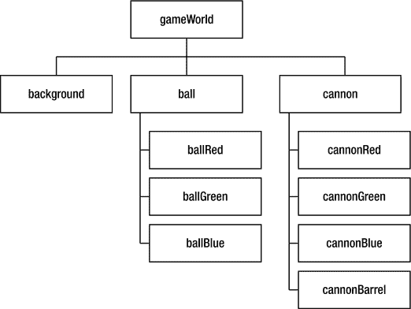
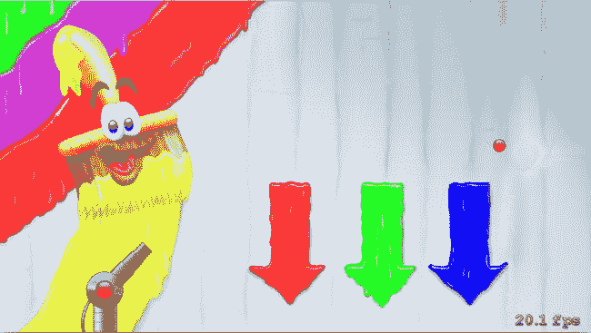

# 6. 飞行的球

电子补充材料 本章的在线版本 (doi:[10.​1007/​978-1-4842-0650-8_​6](http://dx.doi.org/10.1007/978-1-4842-0650-8_6)) 包含补充材料，可供授权用户使用。

在本章中，你将开始进一步组织 Painter 游戏的源代码。这是必要的，因为随着你向游戏中添加越来越多的内容，源代码会变得更加复杂。你将探索使用方法来更逻辑地组织代码。本章结束后，你将向游戏中添加一个移动的球。


## 方法

你已经见过并使用过许多不同类型的方法和函数。例如，`UIColor.blackColor()` 方法和 `print()` 函数之间存在明显区别：后者需要一个参数（一个字符串），而前者则不需要。`blackColor` 方法隶属于 `UIColor`，而 `print` 则是一个独立的函数。此外，某些函数/方法可以返回一个结果值，该结果值可用于执行方法调用的指令中，例如将结果存储在一个变量中，如下所示：

`var myColor = UIColor.blackColor()`

在这里，你调用了定义为 `UIColor` 一部分的 `blackColor` 方法，并将其结果存储在变量 `myColor` 中。显然，`blackColor` 提供了一个可以存储的结果值。另一方面，`print` 函数并不提供可以存储在变量中的结果。当然，它确实会产生某种效果，因为它会将文本打印到控制台，这也可以被视为函数调用的一种结果。然而，当我谈论函数的结果时，我指的不是函数在屏幕上产生的某种效果，而是指函数调用返回了一个可以存储在变量中的值。这也被称为方法或函数的**返回值**。在数学中，函数通常都有一个结果。数学函数 f(x)=x² 将 x 值作为参数传入，并返回其平方作为结果。你可以像下面这样在 Swift 中编写这个数学函数：

```
func square(x : Int) -> Int {
    return x*x
}
```

如果你查看这个方法的头部，会看到它接受一个名为 `x` 的参数。在右括号之后，你会看到一个箭头和单词 `Int`。这意味着该方法返回一个整数值，该值可以存储在一个变量中，如下所示：

`var sx = square(10)`

执行这条指令后，变量 `sx` 将包含值 100。在函数体中，你使用关键字 `return` 来指示函数返回的实际值。以 `square` 为例，该函数返回表达式 `x*x` 的结果。请注意，执行 `return` 指令也会终止函数中其余指令的执行。放置在 `return` 指令之后的任何指令都不会被执行。例如，考虑下面的函数：

```
func square(x : Int) -> Int {
    return 12
    var tmp = 45
}
```

在这个例子中，第二条指令（`var tmp = 45`）永远不会被执行，因为它前面的指令结束了函数。这是 `return` 指令一个非常方便的特性，你可以利用它来为自己服务，如下面的代码所示：

```
func squareRoot(x : Int) -> Int {
    if x < 0 {
        print("错误：无法计算负数的平方根！")
        return 0
    }
    // 计算平方根，现在我们确定 x >= 0。
    return ...
}
```

在这个例子中，你将 `return` 指令用作防范方法调用者错误输入的保障。你无法计算负数的平方根，因此在进行任何计算或引发令人讨厌且可能难以调试的错误之前，你先处理 `x` 为负数的情况。请注意，**一个返回值的函数必须通过所有可能的逻辑路径返回一个值**。所以，如果你编写一个包含处理几种备选情况的 `if` 指令的函数，你必须确保函数在每个分支中都返回一个值。在上面的例子中，有两个分支，并且在每个分支中都返回了一个值。

`atan2` 函数是另一个既有参数又返回值的函数示例，其返回值可以存储在变量中，就像你在 Painter2 示例中所做的那样：

`cannonBarrel.zRotation = atan2(opposite, adjacent)`

一个没有返回值的**方法**示例是 `GameScene` 类中的 `update` 方法：

```
override func update(currentTime: NSTimeInterval) {
    if nrTouches > 0 {
        touchingLabel.text = "touching"
        if !cannonRed.frame.contains(touchLocation) {
            let opposite = touchLocation.y - cannonBarrel.position.y
            let adjacent = touchLocation.x - cannonBarrel.position.x
            cannonBarrel.zRotation = atan2(opposite, adjacent)
        } else if hasTapped {
            let tmp = cannonBlue.hidden
            cannonBlue.hidden = cannonGreen.hidden
            cannonGreen.hidden = cannonRed.hidden
            cannonRed.hidden = tmp
        }
    } else {
        touchingLabel.text = "not touching"
    }
    hasTapped = false
}
```

由于这个方法没有返回值，你无需在方法体中使用 `return` 关键字，尽管在某些情况下使用它仍然有用。例如，你可以通过移除嵌套的 `if` 指令来使用 `return` 关键字提高代码可读性，如下所示：

```
override func update(currentTime: NSTimeInterval) {
    if nrTouches <= 0 {
        hasTapped = false
        touchingLabel.text = "not touching"
        return
    }
    touchingLabel.text = "touching"
    if !cannonRed.frame.contains(touchLocation) {
        let opposite = touchLocation.y - cannonBarrel.position.y
        let adjacent = touchLocation.x - cannonBarrel.position.x
        cannonBarrel.zRotation = atan2(opposite, adjacent)
    } else if hasTapped {
        let tmp = cannonBlue.hidden
        cannonBlue.hidden = cannonGreen.hidden
        cannonGreen.hidden = cannonRed.hidden
        cannonRed.hidden = tmp
    }
    hasTapped = false
}
```

在这个方法中，你首先检查玩家是否触摸了屏幕。如果不是这种情况，你就重置 `hasTapped` 标志，更改文本标签，并从这个方法中返回。此后的任何指令将不再执行。

请注意，每当调用一个没有返回值的方法时，它就没有可以存储在变量中的结果。例如，在

`var what = print("hello!")`

中，`print` 没有返回值，因此如果你在程序中编写这样的指令，编译器会发出警告。

如果一个方法或函数有返回值，这个值不一定要存储在变量中。你也可以直接在 `if` 指令中使用它，就像你在 `update` 方法中所做的那样：

`if !cannonRed.frame.contains(touchLocation) {`
`    // 执行某些操作`
`}`

在这里，`contains` 方法返回一个布尔值，如果这个值是 false，`if` 指令的主体将会被执行（由于感叹号表示“非”）。有值的对象和没有值的对象之间的区别，是你之前已经见过的：这与你在指令（没有值）和表达式（有值）之间看到的区别是一样的。所以，这意味着 `!cannonRed.frame.contains(touchLocation)` 是一个表达式，而 `print("hello")` 是一条指令。

总而言之，有带参数或不带参数的方法/函数，方法/函数可以有返回值也可以没有。你可以使用函数和方法将代码组织成属于同一逻辑块的相关指令组。例如，创建一个名为 `atan2` 的函数来组合计算三角形两条边反正切所需的所有指令是合理的。这样一来，你只需编写这些指令一次，之后就不必再考虑如何计算；只需简单地调用你之前编写的函数即可。游戏通常有许多这样有用的函数和方法。例如，有一个检查图像是否位于屏幕之外的方法是不是很有用？这在对象飞入或飞出屏幕的游戏中，或者在一个玩家可能从屏幕底部掉下并死亡（很多平台游戏都是这种情况）的游戏中会很有用。根据你的需要，作为程序员的你来决定是否要编写一个带参数或不带参数的方法，以及该方法是否具有返回值。


## 参数名称与标签

让我们更详细地了解一下参数、如何声明它们以及如何调用它们。请看以下函数：

```
func sign(val: Int) -> Int {
    if val < 0 {
        return -1
    } else if val > 0 {
        return 1
    } else {
        return 0
    }
}
```

这个函数计算一个整数值的符号。如果作为参数传入的值大于 0，函数返回 1。如果值为负数，函数返回-1。如果值为 0，函数调用的结果也是 0，如下所示：

```
var someVariable = sign(3)  // someVariable 将包含值 1
someVariable = sign(-12)    // someVariable 现在将包含值 -1
someVariable = sign(0)      // someVariable 现在包含值 0
```

当你查看函数头时，会看到参数有一个名称（`val`）。在函数体内，你通过该名称引用参数。调用函数时，只需在括号内写入你需要的参数值。如果一个函数有多个参数，你只需在括号内写入这些参数值。例如，这是 `atan2` 函数的函数头：

```
func atan2(lhs: CGFloat, rhs: CGFloat) -> CGFloat
```

这个函数有两个参数，调用方式如下：

```
cannonBarrel.zRotation = atan2(opposite, adjacent)
```

除了函数，Swift 还认识方法。回想一下，方法就像函数一样组织指令。但与函数不同的是，方法也是类的一部分。Swift 对方法处理参数的方式有不同的规则。对于只有一个参数的方法，其工作方式通常与函数相同：调用方法时只需将参数值写在括号内。如果方法有多个参数，情况就不同了。假设你在 `GameScene` 类中定义了以下方法：

```
func max(val1: Int, val2: Int) -> Int {
    if val1 < val2 {
        return val2
    } else {
        return val1
    }
}
```

这个方法期望两个参数，并返回两者中较大的数。因为有两个参数，调用方法时需要明确指出哪个参数值对应哪个参数名称，如下所示：

```
var maxValue = max(3, val2: 12)
```

在 Swift 语言中，通常不需要在第一个参数前写标签，但第二个、第三个及后续参数需要写标签。这对于所有方法都适用，除了创建对象的方法。在这种情况下，你还需要显式地写出第一个参数的标签。示例如下：

```
var background = SKSpriteNode(imageNamed: "spr_background")
```

这里你创建了一个 `SKSpriteNode` 类型的对象并存储在一个变量中。Swift 要求提供参数标签 `imageNamed`。

Swift 区分内部和外部参数标签。让我们稍微重写一下 `max` 方法，如下所示：

```
func max(val1: Int, b val2: Int) -> Int {
    if val1 < val2 {
        return val2
    } else {
        return val1
    }
}
```

如你所见，第二个参数现在有两个标签。第一个标签（`b`）是外部参数标签名称。调用该方法时，你应该使用这个标签而不是 `val2` 来引用第二个参数，如下所示：

```
var result = max(12, b: 3)
```

标签 `val1` 和 `val2` 是内部标签名称。这些是方法体内应该使用的标签名称。你可以使用外部标签名称来强制用户也为第一个参数提供标签，方法如下修改 `max` 方法的函数头：

```
func max(firstValue val1: Int, secondValue val2: Int) -> Int
```

现在调用 `max` 方法时需要提供两个标签：

```
result = max(firstValue: 12, secondValue: 3)
```

如果你认为完全不需要标签，可以通过在函数头中使用下划线作为外部标签名称来指示，如下所示：

```
func max(val1: Int, _ val2: Int) -> Int
```

现在你可以在不提供任何标签的情况下调用 `max` 方法：

```
result = max(12, 3)
```

请注意，你只需要在第二个标签前写下划线，因为第一个标签名称默认已经被省略了。如你所见，Swift 为你提供了许多定义参数名称的选项，以及许多在函数或方法体内外引用参数的方式。此外，由于函数和方法有所有这些不同的规则，有时很难知道在调用方法或函数时是否应该写标签名称。幸运的是，Xcode 开发环境会自动检测错误并建议修复。你可以通过在 `Painter2` 程序中向 `atan2` 调用添加标签来亲自尝试。你会看到 Xcode 建议移除这些标签以修复编译器错误。

考虑在不同情况下使用何种参数标签是一个好主意。显式的参数标签有助于使参数的含义更清晰。例如，本章前面 `max` 函数中的 `firstValue` 和 `secondValue` 标签有助于阐明参数的含义：它们代表函数返回最大值的那些值。作为另一个例子，考虑以下函数：

```
func calculateAgeInMonths(years y: Int, months m: Int) {
    return y * 12 + m
}
```

调用这个函数时，知道两个参数分别是什么是很有用的。显式的年、月标签有助于澄清这一点：

```
var myAgeInMonths = calculateAgeInMonths(years: 18, months: 3)
```

另一方面，有时参数标签会使你的指令变得不必要地冗长。例如，`max` 方法并不真正需要其参数的显式标签。参数叫什么名字并不重要；该方法只是简单地返回最大值。通过仔细决定哪些参数需要标签、哪些不需要，你的代码会变得清晰得多，也更容易被他人理解。

### 声明 vs 参数

变量的声明与写在方法头中的参数有很多共同之处。事实上，这些参数本身也是声明，但存在一些差异：

- 变量在方法体内声明；参数在方法头的括号内声明。
- 变量通过赋值指令获取值；参数在方法被调用时自动获取值。
- 变量声明以关键字 `var` 开头；参数声明不以 `var` 开头。


## 默认参数值

在方法或函数体中，你也可以为某些参数指定默认值。这很有用，因为它为常用情况提供了一种便捷、更简短的方法调用方式。例如，考虑一个让玩家角色跳跃的 `jump` 方法。它的头部可能如下所示：

`func jump(speed: Int = 200, animate: Bool = true)`

在这个头部中，你可以看到该方法有两个参数：角色跳跃的速度，以及角色在跳跃时是否应该有动画效果。每个参数都有一个默认值。在这种情况下，编写该方法的程序员预期，玩家最常以 200 的速度跳跃，并且角色应该有动画效果。由于这些默认值的存在，你可以按如下方式调用此方法：

`jump()`

这与以下调用方式完全等效：

`jump(speed: 200, animate: true)`

每当一个参数有默认值时，如果你为该参数传入不同的值来调用方法，你总是需要在其前面写上标签，如上方的调用所示。这是另一个例子：

`jump(animate: false)`

这行代码以默认速度 200 调用 `jump` 方法，但关闭了动画效果。使用默认参数值能让你的方法调用更简单，但它们并非总是必需的。例如，你可以将本章前面定义的 `max` 方法的头部改写如下：

`func max(val1: Int = 12, b val2: Int = 34) -> Int`

在这个头部中，你为两个参数都定义了默认值，但它们并无实际意义，因为 `max` 方法并没有一组经常被调用的值。如果某个参数的默认值确实有意义（如 `jump` 方法的情况），强烈建议在头部中将其写出。这不仅能使调用方法时代码更简短，还能让方法的使用者了解程序员预期该方法将如何使用。如果方法有很多非常底层的参数，而使用者不知道该如何选择值，后一点尤其重要。在这种情况下，默认参数值为用户提供了一个良好的基础，使他们无需了解所有参数的详细含义就能使用方法。

## 将指令重组为方法

上一章的 Painter2 示例仍然相对简短，因为它只显示了一个背景和一个旋转的大炮。商业游戏显然比这复杂得多。它们包含许多不同的对象，这些对象可能具有复杂的行为和交互。这正是方法的用武之地。请查看本章的 Painter3 示例。你会发现，属于同一组的指令现在被组织到了方法中。例如，名为 `initCannon` 的方法包含了所有用于初始化大炮游戏对象的指令：

```
func initCannon() {
    cannonRed.zPosition = 1
    cannonGreen.zPosition = 1
    cannonBlue.zPosition = 1
    cannonBarrel.anchorPoint = CGPoint(x:0.233, y:0.5)
    cannon.position = CGPoint(x:-430, y:-280)
    cannon.zPosition = 1
    cannonGreen.hidden = true
    cannonBlue.hidden = true
    cannon.addChild(cannonRed)
    cannon.addChild(cannonGreen)
    cannon.addChild(cannonBlue)
    cannon.addChild(cannonBarrel)
}
```

你可以看到，现在有一个被引用为 `cannon` 的对象，它是存储在 `GameScene` 类中的一个属性：

`var cannon = SKNode()`

大炮的所有部件（炮管和三个颜色指示器）现在都是这个对象的一部分。而 `cannon` 对象本身又是 `gameWorld` 对象的一部分。这是通过 `didMoveToView` 方法中的以下代码行实现的：

`gameWorld.addChild(cannon)`

你也可以在图 6-1 中看到这一点，该图展示了本例中游戏对象的完整层级结构。将属于同一组的对象组合在一起很有用，因为它使操作这些对象整体变得更加容易。例如，现在在 `initCannon` 方法中，只需一条指令即可完成大炮（包括其炮管和三个颜色指示器）的定位，如下所示：



图 6-1. Painter3 示例的游戏对象层级结构

`cannon.position = CGPoint(x:-430, y:-280)`

因为你在一个独立的方法中初始化大炮对象，所以初始化游戏场景的方法（`didMoveToView`）现在也变得更容易阅读：

```
override func didMoveToView(view: SKView) {
    anchorPoint = CGPoint(x: 0.5, y: 0.5)
    background.zPosition = 0
    gameWorld.addChild(background)
    initCannon()
    gameWorld.addChild(cannon)
    initBall()
    gameWorld.addChild(ball)
    addChild(gameWorld)
    delta = NSTimeInterval(view.frameInterval) / 60
}
```

在 Painter3 中，游戏对象都有自己的初始化方法，背景除外，因为它是一个非常基础的对象。并且如你所见，Painter3 示例不仅包含一个大炮，还包含一个球（这将在本章后续部分讨论）。

## 在局部坐标与世界坐标之间移动

一个附带影响是，你需要考虑到游戏对象现在拥有不同的局部坐标系。将以下代码行添加到 Painter3 程序的 `GameScene.swift` 文件中 `didMoveToView` 方法的末尾：

`print(cannonRed.position)`

你会发现，当应用运行时，它会在控制台打印出位置 (0, 0)。然而，`cannonRed` 节点绘制在位置 (-430, -280)。为什么呢？因为那是 `cannon` 对象的位置。在 `cannon` 对象内部，`cannonRed` 节点的局部位置是 (0, 0)。那么，如何获取 `cannonRed` 节点的世界位置呢？你可以通过将 `cannonRed` 的局部位置转换到代表世界的节点来实现。在这个例子中，那个节点是 `gameWorld`。将上面的 `print` 调用替换为以下两行代码：

```
let worldCannonRedPos = gameWorld.convertPoint(cannonRed.position, fromNode: cannonRed)
print(worldCannonRedPos)
```

第一行代码调用了一个名为 `convertPoint` 的方法。这个方法将点从一个局部坐标系转换到另一个坐标系。被转换的点是 `cannonRed.position`。被转换点所处的坐标系是属于 `cannonRed` 节点的。最后，目标坐标系是属于 `gameWorld` 的。转换的结果存储在一个变量中，然后在第二条指令中打印到屏幕上。当你运行这段代码时，你会看到现在 `cannonRed` 对象的世界坐标被打印出来了。

`convertPoint` 方法有两个版本，一个从坐标系转换，另一个转换到坐标系。有时转换到坐标系会很有用，例如当你需要处理触摸输入时。触摸输入以世界坐标表示。如果你想检查玩家是否点击了大炮的颜色指示器，你需要将触摸位置转换到大炮颜色指示器对象的局部坐标框架中。以下是使用 `convertPoint` 方法实现的方法：

`let localTouch: CGPoint = gameWorld.convertPoint(touchLocation, toNode: cannonRed)`

然后你可以将此局部触摸位置与大炮颜色指示器进行比较，以判断玩家是否点击了它：

```
if !cannonRed.frame.contains(localTouch) {
    // 将大炮转向玩家触摸位置
} else if hasTapped {
    // 更改大炮颜色
}
```

你可以通过查看 Painter3 示例 `GameScene.swift` 文件中的 `handleInputCannon` 方法来了解处理大炮输入的完整代码。


## 向游戏世界添加一个球

在 Painter 游戏中，玩家通过手指在屏幕上的滑动来瞄准大炮。当玩家将手指从屏幕上抬起时，大炮应发射一个与大炮当前颜色相匹配的球。因此，你需要为球准备三种不同的精灵：红色、绿色和蓝色。在 Painter3 示例中，这些精灵作为 `GameScene` 类的属性存储，如下所示：

`var ballRed = SKSpriteNode(imageNamed: "spr_ball_red")`

`var ballGreen = SKSpriteNode(imageNamed: "spr_ball_green")`

`var ballBlue = SKSpriteNode(imageNamed: "spr_ball_blue")`

这三个精灵节点被存储为一个名为 `ball` 的节点的子节点。在 `initBall` 方法中，你可以看到初始化球的指令：

`func initBall() {`  
    `ball.zPosition = 1`  
    `ball.addChild(ballRed)`  
    `ball.addChild(ballGreen)`  
    `ball.addChild(ballBlue)`  
    `ball.hidden = true`  
`}`

初始状态下，球是隐藏的。一旦玩家发射球，它就会变得可见。由于球会移动，你还需要存储它的速度。这个速度是一个向量，定义了球的位置随时间变化的方式。例如，如果球的速度为 (0,1)，那么每秒钟球的 y 坐标会增加 1 点（这意味着球向上飞行）。在 Painter3 中，速度由 `ballVelocity` 属性表示。

当玩家想要发射球时，需要执行两个步骤。首先，玩家通过在屏幕上滑动手指来瞄准大炮。然后，在将手指从屏幕上抬起后，球就会被发射。为了跟踪球何时准备好发射，你添加了一个布尔属性 `readyToShoot`：

`var readyToShoot = false`

在本书中你开发的游戏中，大多数对象都有位置和速度。由于本书只涉及 2D 游戏，因此位置和速度都是由 `x` 和 `y` 变量组成的变量。当你更新这些游戏对象时，你需要根据速度向量和经过的时间来计算新的位置。在本章后面，你将看到如何做到这一点。

虽然你不会在这个特定游戏中使用它，但 SpriteKit 框架内置了一个物理引擎。这使得为你的游戏添加物理效果变得非常容易且有趣。在本书开发的第二个游戏中，你将学习如何使用这个物理引擎来创建一个依赖物理交互的游戏，类似于《割绳子》或《蜡笔物理学》这类游戏。

### 发射球

当玩家将手指从屏幕上抬起时，球就会被发射。球的速度和移动方向由玩家最后触摸屏幕的位置决定。球应该朝该位置的方向移动；并且玩家触摸屏幕的位置离大炮越远，球的速度就越高。这对用户来说是一种直观的控制球速的方式。在设计任何游戏时，请仔细思考如何接收用户的指令，以及处理这些指令最自然或最高效的方式。

为了处理输入，你在 `GameScene` 类中添加了一个 `handleInputBall` 方法。在这个方法内部，第一步是检查玩家当前是否正在触摸屏幕。如果是这种情况，并且玩家没有触摸到大炮颜色指示器，那么你就知道玩家正在瞄准大炮。只有当球尚未发射时，玩家才能开始发射它；换句话说，球也应该是隐藏的。如果所有这些条件都成立，则将 `readyToShoot` 属性设置为 `true`：

`let localTouch: CGPoint = gameWorld.convertPoint(touchLocation, toNode: cannonRed)`  
`if nrTouches > 0 && !cannonRed.frame.contains(localTouch) && ball.hidden {`  
    `readyToShoot = true`  
`}`

第二个 `if` 指令检查玩家是否已将手指从屏幕上抬起。如果 `nrTouches` 等于零，并且 `readyToShoot` 属性为 `true`，则属于这种情况：

`if (nrTouches <= 0 && readyToShoot && ball.hidden) {`  
    `// 发射球！`  
`}`

在 `if` 指令内部，你需要做几件事情。你已经知道玩家触摸过某个位置，并且球必须从大炮中发射。你要做的第一件事是改变球的 `hidden` 状态，因为当你发射球时，它应该是可见的：

`ball.hidden = false`

接下来，你也将 `readyToShoot` 属性重置为 `false`，因为球正在被发射：

`readyToShoot = false`

由于球现在正在移动，你需要给它一个速度。这个速度是一个指向玩家最后触摸屏幕位置的向量。你可以通过从触摸位置减去球的位置来计算这个方向。因为速度有 x 分量和 y 分量，你需要对两个维度都进行计算：

`ballVelocity.x = touchLocation.x - cannon.position.x`  
`ballVelocity.y = touchLocation.y - cannon.position.y`

以这种方式计算速度也带来了期望的效果：当玩家触摸的位置离大炮越远，速度就越大，因为触摸位置与球位置之间的差值也更大。然而，如果你现在运行游戏，球的移动速度会有点慢。因此，你需要将这个速度乘以一个常量，使球获得一个在游戏上下文中可用的速度：

`let velocityMultiplier = CGFloat(1.4)`  
`ballVelocity.x = (touchLocation.x - cannon.position.x) * velocityMultiplier`  
`ballVelocity.y = (touchLocation.y - cannon.position.y) * velocityMultiplier`

在通过不同数值进行游戏测试后，我选择了常量值 1.4。每个游戏中都会有一些这样的游戏参数，你需要在游戏试玩过程中进行调整，以确定它们的最佳值。为这些参数找到合适的数值对于实现平衡且流畅的游戏体验至关重要，并且你需要确保所选的数值不会使游戏变得过于简单或困难。例如，如果你选择常量值 0.3 而不是 1.4，球的移动速度会慢得多。这会使游戏变得困难得多，甚至可能使游戏无法进行，因为球可能永远无法到达屏幕的另一端。


#### 更新球的位置

在本节中，您将开始定义球的行为。基本上有两种可能：要么球等待被发射，要么球正在空中飞行。为了将这种行为转化为更新球的速度继而更新其位置的指令，让我们编写一个名为`updateBall`的方法，在其中组合这些指令。这是完整的方法：

```
func updateBall() {
    if !ball.hidden {
        ballVelocity.x *= 0.99
        ballVelocity.y -= 15
        ball.position.x += ballVelocity.x * CGFloat(delta)
        ball.position.y += ballVelocity.y * CGFloat(delta)
    }
    else {
        // 计算球的位置
        let opposite = sin(cannonBarrel.zRotation) * cannonBarrel.size.width * 0.6
        let adjacent = cos(cannonBarrel.zRotation) * cannonBarrel.size.width * 0.6
        ball.position = CGPoint(x: cannon.position.x + adjacent,
            y: cannon.position.y + opposite)
        // 设置球的颜色
        ballRed.hidden = cannonRed.hidden
        ballGreen.hidden = cannonGreen.hidden
        ballBlue.hidden = cannonBlue.hidden
    }
    if isOutsideWorld(ball.position) {
        ball.hidden = true
        readyToShoot = false
    }
}
```

如您所见，此方法使用`if`指令来区分球所处的两种可能状态。如果球未被隐藏，那么它一定是在空中飞行。在这种情况下，将执行`if`指令的主体。该主体由四条指令组成。前两条指令更新速度，后两条指令更新位置。第一条指令更新速度的 x 方向分量。您将速度乘以 0.99，其效果是速度缓慢降低。这是为了模拟空气摩擦。第二条指令在每次更新中增加 y 方向的速度。这是为了模拟重力对球的影响。x 和 y 方向上的速度变化共同作用，产生了合理的球体行为。当然，在现实世界中，重力并非 15。但话说回来，您的现实世界也不由像素构成。游戏世界中的物理并不总是精确模拟现实世界中的物理。当您想在游戏中加入某种形式的物理机制时（无论非常简单还是极其复杂），最重要的部分并非物理机制是否逼真，而是游戏是否具有可玩性。这就是为什么在策略游戏中，飞机的移动速度可能与地面上行走的士兵一样快。如果游戏为这两种对象使用现实的速度，将导致游戏无法进行。

球当前的位置通过将速度的 x 和 y 分量加到其当前位置上来更新。以下是实现此操作的指令：

```
ball.position.x += ballVelocity.x * CGFloat(delta)
ball.position.y += ballVelocity.y * CGFloat(delta)
```

如您所见，速度乘以了一个因子`delta`。这是为什么呢？

#### 固定时间步长 vs 可变时间步长

`delta`因子是定义在`GameScene`中的一个属性，如下所示：

```
var delta: NSTimeInterval = 1/60
```

它表示 1/60 秒的时间间隔。这对应于 SpriteKit 中设置的默认帧率，即每秒 60 帧。因此，实际上，`delta`表示游戏循环周期之间经过的时间量。

通过将速度乘以这个因子`delta`，您实际上是在计算中考虑了游戏引擎的帧率。帧率与 iOS 设备刷新屏幕的频率密切相关。该频率固定为 60Hz（换句话说，就像帧率一样，每秒 60 次）。在 SpriteKit 中，可以通过更改`SKView`类中的`frameInterval`属性将帧率更改为其他值。例如，在`didMoveToView`方法中，您可以将帧间隔设置为 2，这意味着帧率将降至每秒 30 帧，如下所示：

```
view.frameInterval = 2
```

显然，您还需要更新`delta`因子以匹配新的帧率：

```
delta = NSTimeInterval(view.frameInterval) / 60
```

但是，当您在一台速度非常慢的设备上运行游戏，并且引擎无法以每秒 60 次执行游戏循环，而是以每秒 50 帧的速度运行时，会发生什么？嗯，由于`delta`与实际经过的时间毫无关联，这意味着您的整个游戏将会变慢，因为游戏逻辑仍然认为自上次调用`update`以来，已经过了`delta`变量中设置的固定时间量（1/60 秒）。由于`delta`值是固定的，这种游戏循环也称为固定时间步长方法。

有时候让游戏稍微变慢本身并不一定是坏事。不过，您必须注意不要让游戏结构性运行得太慢。它可能会产生负面副作用。其一，玩家可能会因为物体移动不再逼真且玩游戏耗时过长而对游戏失去兴趣。另一个副作用可能是游戏变得过于简单，从而使使用较旧设备的玩家获得不公平的优势。

处理此问题的一种方法是跟踪自上次更新以来实际经过了多少时间。这就是为什么`GameScene`中的`update`方法有一个名为`currentTime`的参数。该参数为您提供当前系统时间。您可以通过一些计算来找出自上次更新周期以来经过了多少时间。首先，添加一个属性来存储上次更新的时间：

```
var lastUpdateTimeInterval: NSTimeInterval = 0
```

然后，在`update`方法中，您可以按如下方式计算经过的时间：

```
let timePassed: NSTimeInterval = currentTime - lastUpdateTimeInterval
lastUpdateTimeInterval = currentTime
```

现在您可以做的是计算`delta`值与实际经过时间之间的差值。如果该值太大，您可以决定增加帧间隔并计算新的`delta`值，以便游戏玩法更好地匹配设备。如果您愿意，可以编写一个更高级的版本，计算过去几帧中与`delta`的平均差值，然后根据该差值决定是需要降低还是提高帧率。

与使用固定`delta`值完全不同的另一种方法是，在每次调用`update`方法时简单地计算`delta`值，然后在游戏中使用该`delta`值。这被称为可变时间步长方法。

```
delta = currentTime - lastUpdateTimeInterval
lastUpdateTimeInterval = currentTime
```


### 变长时间步长 vs 固定时间步长

`变长时间步长`相较于之前的方法具有若干优势。首先，你无需再担心帧率问题。`delta`值将始终对应实际经过的时间。这意味着无论实际帧率如何，你的游戏世界都会自动以相同的速度运行。如果帧率下降，游戏世界速度会自动调整。`变长时间步长`在追求高帧率的游戏中尤其有用，例如第一人称射击游戏中，由于摄像机直接由玩家控制，镜头运动可能非常快速。在这种情况下，变长时间步长能带来更流畅的移动和更愉悦的游戏体验。

使用变长时间步长的缺点在于，你的游戏逻辑需要足够稳健以应对`delta`值的大幅波动。例如，假设有一支箭在空中飞射，此时系统出现短暂卡顿导致`delta`值非常大，而你仅通过将速度乘以`delta`再加上当前位置来计算箭的新位置，就可能导致箭意外穿过本不该穿过的物体（如对手），并且未触发碰撞处理。这也可能使玩家进入游戏世界中本不可及的区域。因此，在使用`delta`值时需格外小心，否则可能导致意外行为。

变长时间步长的另一个缺点是，即使玩家临时进行其他操作（如打开游戏菜单或保存游戏），时间仍在继续。通常，如果玩家发现自己在浏览物品栏时角色已在游戏世界中被击杀，他们不会感到高兴。当玩家临时切换到其他应用时也会出现类似情况：系统时间继续流逝，游戏世界也随之推进。而使用固定时间步长时，游戏只会从暂停处继续运行——因为游戏对象不关心真实经过的时间，只关心固定的`delta`值。

> **注意**：在早期，计算机速度较慢，固定时间步长的概念尚未出现。游戏开发者假定所有人的电脑都同样缓慢，因此尽可能频繁地调用游戏循环方法，仅用恒定速度系数更新物体位置。结果，当计算机速度提升后，这些游戏变得越来越难玩！玩家对此很不满。因此，在计算速度和位置等属性时，务必考虑经过的时间，并确保游戏的帧率与运行设备的性能相匹配。

## 更新球体颜色

如果球体当前未处于发射状态，玩家可以更改其颜色。具体做法是获取大炮的当前颜色，并相应更改球体的颜色。这样就能确保球体颜色始终与大炮颜色一致。最简单的解决方案是将大炮颜色指示器对象的`hidden`状态直接映射到不同颜色的球体：

```
ballRed.hidden = cannonRed.hidden
ballGreen.hidden = cannonGreen.hidden
ballBlue.hidden = cannonBlue.hidden
```

还需要更新球体的位置。这是必要的，因为当球体未在空中时，玩家可以通过旋转炮管来调整发射位置。因此，需要在此处计算正确的球体位置，使其与大炮炮管的当前朝向匹配。使用正弦和余弦函数，按如下方式计算新位置：

```
let opposite = sin(cannonBarrel.zRotation) * cannonBarrel.size.width * 0.6
let adjacent = cos(cannonBarrel.zRotation) * cannonBarrel.size.width * 0.6
ball.position = CGPoint(x: cannon.position.x + adjacent, y: cannon.position.y + opposite)
```

如你所见，将对边和邻边乘以系数 0.6，使球体绘制在旋转炮管大约一半以上的位置。

`updateBall`方法的第二部分同样是一个`if`指令：

```
if isOutsideWorld(ball.position) {
    ball.hidden = true
    readyToShoot = false
}
```

这部分处理球体飞出游戏世界的事件。为了判断是否发生这种情况，需要在`GameScene`中添加一个名为`isOutsideWorld`的方法。该方法的目标是检查给定位置是否超出游戏世界边界，并通过几条简单规则定义游戏世界边界。请记住，SpriteKit 的原点位于屏幕左下角。本书开发的游戏中，游戏场景的原点（或锚点）被设置到屏幕中心，以便更好地适配不同设备。在这种设置下，如果对象的 x 坐标小于屏幕宽度的一半负值，或大于屏幕宽度的一半正值，则该对象位于游戏世界之外；如果对象的 y 坐标小于屏幕高度的一半负值，也属同样情况。注意，我并未说 y 坐标非常大时对象会超出游戏世界——这是为什么？我这样设计是为了让玩家能将球射向空中，使球暂时出现在屏幕上方，然后再次下落。在平台游戏中经常能看到类似效果：角色可以向上跳跃，部分消失于屏幕之外，而不会从屏幕底部掉落（后者通常意味着角色立即死亡）。

查看该方法的头部，可以看到它需要一个参数，即位置：

```
func isOutsideWorld(pos: CGPoint) -> Bool
```

该方法的返回值是布尔值。要检查位置是否在屏幕之外，需要知道屏幕的宽度和高度。Painter3 在`GameScene`类中添加了一个名为`gameSize`的属性。该属性在`GameScene`的`init`方法中被赋值：

```
override init(size: CGSize) {
    super.init(size: size)
    gameSize = size
}
```

稍后我会更详细地讨论此方法的含义。目前，假设该方法在应用启动时被调用。

在`isOutsideWorld`方法中，使用`gameSize`属性判断位置是否在游戏世界之外。方法体由一条使用`return`关键字计算布尔值的指令构成。通过逻辑或运算覆盖位置超出游戏世界的不同情况：

```
return pos.x < -gameSize.width/2 || pos.x > gameSize.width/2 || pos.y < -gameSize.height/2
```

如你所见，y 坐标大于`gameSize.height/2`的情况未被纳入条件。这使得球体能够飞至屏幕上方后再次落回。

让我们回到`updateBall`方法。第二个`if`指令在其条件中调用了`isOutsideWorld`方法；如果该方法返回`true`，则球体再次隐藏，并将`readyToShoot`属性重置为`false`（以便玩家可以再次发射球体）。

像`isOutsideWorld`这样的方法可以在程序的不同部分重复使用，这既节省了开发时间，也使得程序更简短、更易读。例如，在后续游戏中，`isOutsideWorld`可能同样适用于检测油漆罐是否掉落出屏幕。

运行 Painter3 示例时，可以看到现在可以瞄准大炮、选择颜色并发射球体（见图 6-2）。下一章将向此游戏添加油漆罐。



**图 6-2.** Painter3 示例


## 本章小结

在本章中，你学习了以下内容：

- 不同类型的方法/函数（带/不带参数，以及带/不带返回值）
- 固定时间步长与可变时间步长的区别
- 如何向游戏世界添加一个飞行球

