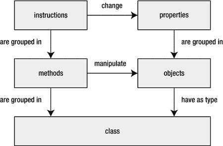
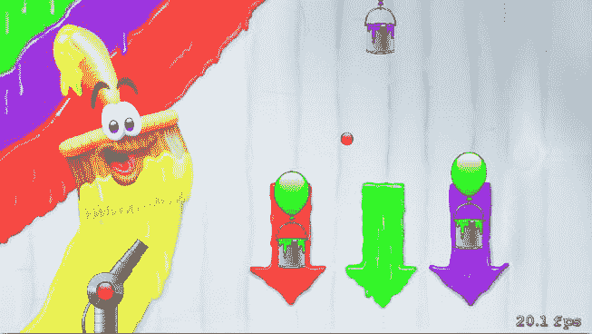

# 7. 游戏对象类型

电子补充材料 本章在线版（doi:[10.1007/978-1-4842-0650-8_7](http://dx.doi.org/10.1007/978-1-4842-0650-8_7)）包含补充材料，仅供授权用户使用。

在前几章中，你已经了解了如何创建一个包含几种不同游戏对象（例如大炮和球）的游戏世界。你还了解了如何让游戏对象之间进行交互。例如，`ball`对象会根据大炮的颜色更新其颜色。在本章中，你将向游戏世界添加掉落的油漆罐。但在实现这个功能之前，你需要重新审视如何在 Swift 中创建和管理对象。我将介绍**类**这一概念，将其作为一种创建特定类型多个游戏对象的手段。然后，你将把类的概念应用到 Painter 游戏应用程序的其他部分。此外，你还将学习如何在游戏中融入随机性。

## 创建同一类型的多个对象

到目前为止，在 Painter 中每个游戏对象只需要一个实例。只有一门大炮，也只有一个球。在您之前看到的 Painter 示例中，这些对象由 `GameScene` 类中的一系列属性表示。例如，以下属性组成了大炮对象：

```
var cannon = SKNode()
var cannonBarrel = SKSpriteNode(imageNamed:"spr_cannon_barrel")
var cannonRed = SKSpriteNode(imageNamed: "spr_cannon_red")
var cannonGreen = SKSpriteNode(imageNamed: "spr_cannon_green")
var cannonBlue = SKSpriteNode(imageNamed: "spr_cannon_blue")
```

类似地，球对象也有几个与之关联的属性：

```
var ball = SKNode()
var ballRed = SKSpriteNode(imageNamed: "spr_ball_red")
var ballGreen = SKSpriteNode(imageNamed: "spr_ball_green")
var ballBlue = SKSpriteNode(imageNamed: "spr_ball_blue")
var ballVelocity = CGPoint.zeroPoint
var readyToShoot = false
```

假设你想在 Painter 游戏中同时发射多个球。如果你仍然沿用之前处理对象的方法，那么你每向游戏添加一个球，就需要为它复制一份上述属性。结果，`GameScene` 类会变得非常庞大，从而难以理解。此外，复制代码通常不是一个好主意。如果将来你想给球增加第四种颜色，你就需要更新添加到游戏中的每一个球的属性列表。

## 类作为类型

在 Swift 中，可以通过使用类将属性组合成一个新的类型。Painter4 示例向你展示了如何使用类来将逻辑上属于一起的属性进行分组。请看一下下面的类定义：

```
class Cannon {
    var node = SKNode()
    var barrel = SKSpriteNode(imageNamed:"spr_cannon_barrel")
    var red = SKSpriteNode(imageNamed: "spr_cannon_red")
    var green = SKSpriteNode(imageNamed: "spr_cannon_green")
    var blue = SKSpriteNode(imageNamed: "spr_cannon_blue")
}
```

一个类创建了一个新的类型。因此，在你定义了 `Cannon` 类之后，你就可以创建 `Cannon` 类型的实例。`Cannon` 类的定义规定了一个大炮包含一个节点（表示场景图中的对象）、一个炮管精灵图和三个分别代表大炮颜色的精灵图。在 Painter4 示例中，这个类定义写在 `GameScene` 类的上方。在 `GameScene` 内部，你不再需要编写所有组成大炮的那些属性；你可以简单地创建一个 `Cannon` 类型的属性，如下所示：

```
var cannon = Cannon()
```

现在，`cannon` 属性包含了 `Cannon` 类中定义的数据。你可以使用点号来访问这些数据。例如，这是 `initCannon` 方法的新版本，它现在初始化了 `cannon` 属性：

```
func initCannon() {
    cannon.red.zPosition = 1
    cannon.green.zPosition = 1
    cannon.blue.zPosition = 1
    cannon.barrel.anchorPoint = CGPoint(x:0.233, y:0.5)
    cannon.node.position = CGPoint(x:-430, y:-280)
    cannon.node.zPosition = 1
    cannon.green.hidden = true
    cannon.blue.hidden = true
    cannon.node.addChild(cannon.red)
    cannon.node.addChild(cannon.green)
    cannon.node.addChild(cannon.blue)
    cannon.node.addChild(cannon.barrel)
}
```

因此，与你在 Painter3 中直接访问属性不同，现在你是将它们作为 `cannon` 对象的一部分来访问。类似地，你也可以定义一个 `Ball` 类：

```
class Ball {
    var node = SKNode()
    var red = SKSpriteNode(imageNamed: "spr_ball_red")
    var green = SKSpriteNode(imageNamed: "spr_ball_green")
    var blue = SKSpriteNode(imageNamed: "spr_ball_blue")
    var velocity = CGPoint.zeroPoint
    var readyToShoot = false
}
```

同样，你现在只需要在 `GameScene` 中定义一个属性：

```
var ball = Ball()
```

并且访问 `ball` 对象中的数据的方式与访问 `cannon` 对象完全相同。以下是新 `updateBall` 方法的一个片段：

```
if !ball.node.hidden {
    ball.velocity.x *= 0.99
    ball.velocity.y -= 15
    ball.node.position.x += ball.velocity.x * CGFloat(delta)
    ball.node.position.y += ball.velocity.y * CGFloat(delta)
}
```

这种方法的妙处在于，向游戏中添加更多球变得很容易：

```
var ball2 = Ball()
var ball3 = Ball()
var ball4 = Ball()
```


与其为每个球定义所有属性，你只需创建一个`Ball`类的实例。目前唯一的问题是`updateBall`方法只更新`ball`引用的对象。如果你添加了`ball2`、`ball3`和`ball4`，它们不会自动更新。一个解决此问题的朴素方法是简单地将`updateBall`中的代码复制三次，并在每个副本中将`ball`替换为`ball2`、`ball3`和`ball4`。但这并非理想方案。首先，复制代码意味着你必须处理版本管理问题。例如，如果你在`updateBall`方法代码中发现了一个错误，你需要确保将改进后的代码复制到其他`Ball`对象。如果你忘记复制一份，那么在你以为已解决问题时，那个错误仍然存在。另一个问题是这种方法无法很好地扩展。如果你想扩展游戏，让玩家可以同时发射 20 个球，你打算把代码复制 20 次吗？此外，你的 Swift 文件越大，编译器将其翻译成机器码所需的时间就越长。最后，重复的代码看起来不美观，会使你的源代码文件杂乱无章，并让你难以找到所需的其他代码段，导致过度滚动，从而普遍降低你的编码效率。

解决这个问题一个稍微不那么朴素的方法是将`Ball`对象作为参数传递给`updateBall`方法：

```
func updateBall(aBall: Ball) {

    if !aBall.node.hidden {

        aBall.velocity.x *= 0.99

        aBall.velocity.y -= 15

        aBall.node.position.x += aBall.velocity.x * CGFloat(delta)

        aBall.node.position.y += aBall.velocity.y * CGFloat(delta)

    }

    else {

        // 更多的操作 aBall 对象的代码

    }

}
```

然后，在`update`方法中，你可以简单地调用此方法，将每个球作为参数传递：

```
override func update(currentTime: NSTimeInterval) {

    ...

    updateBall(ball)

    updateBall(ball2)

    updateBall(ball3)

    updateBall(ball4)

    ...

}
```

你需要为初始化每个球以及处理球的输入做同样的事情。虽然这是一个可以接受的解决方案，但从长远来看，它同样难以扩展。在 Painter 游戏中，只有少数几个不同的游戏对象：一个加农炮、一个球和三个油漆罐。商业游戏可能有数百个不同的游戏对象。如果你必须为每种对象类型向`GameScene`类添加初始化、输入处理和更新方法，那么该类会变得非常庞大，这反过来会使编辑代码变得极其麻烦。

更好的处理方式是将`initBall`、`handleInputBall`和`updateBall`方法变成`Ball`类的一部分，而不是`GameScene`类的一部分。看看属于本章的 Painter5 示例。与之前的示例相比，有一些变化。首先，`Ball`和`Cannon`类现在定义在单独的文件中。这是一件好事，因为它将使你的源代码更易于浏览。另一个变化是，用于初始化球、处理球输入和更新球的方法现在属于`Ball`类。同样，`Cannon`类现在也有了自己的方法。从现在开始，我将使用`handleInput`和`updateDelta`作为游戏循环方法中处理输入和更新游戏世界的默认名称。

## 在独立类中进行输入处理

当你将处理输入的方法放入`Ball`和`Cannon`类时，你需要某种方式来访问玩家触摸屏幕的位置。一种方法是也定义一个独立的类来处理输入。我们称这个类为`InputHelper`。在这个类内部，你放置用于跟踪玩家触摸输入的属性。你还添加一个用于检查玩家是否正在触摸屏幕某处的方法。这是完整的类：

```
class InputHelper {

    var touchLocation = CGPoint(x: 0, y: 0)

    var nrTouches = 0

    var hasTapped: Bool = false

    func isTouching() -> Bool {

        return nrTouches > 0

    }

}
```

在`GameScene`类中，你添加一个`InputHelper`类型的属性，如下所示：

```
var inputHelper = InputHelper()
```

然后，当你调用球和加农炮的`handleInput`方法时，你可以将`InputHelper`对象作为参数传递，如下所示：

```
cannon.handleInput(inputHelper)

ball.handleInput(inputHelper)
```

因此，你可以在每个游戏对象类中访问触摸信息。例如，在`Cannon`类中，你使用`InputHelper`类的`isTouching`方法来确定是否应该旋转加农炮。如果玩家没有触摸，你不需要做任何操作，只需从`handleInput`方法返回：

```
if !inputHelper.isTouching() {

    return

}
```


### 初始化对象

每当你创建一个类的实例（例如 `Ball` 或 `Cannon`）时，所创建的对象都需要以某种方式进行初始化。例如，当你创建一个球时，你需要加载一些精灵图像、设定一个初始速度、确保球处于隐藏状态等等。在 Swift 中，每个类都有自己的构造器来执行此工作。你可以通过名称来识别一个方法是构造器。构造器始终被命名为 `init`。此外，在定义构造器时，需要省略关键字 `func`。以下是 `Ball` 类的构造器：

```
init() {
    node.zPosition = 1
    node.addChild(red)
    node.addChild(green)
    node.addChild(blue)
    node.hidden = true
}
```

在构造器的函数体中，可以看到 `node` 属性被操作了。其 z 轴位置被改变（以便球体始终显示在背景之前）；添加了红色、绿色和蓝色球的精灵图像；并且节点被设为隐藏状态。当你创建 `Ball` 的实例时，这个 `init` 方法会被自动调用：

```
var b = Ball()
```

像这样的指令会完成几件事：

- 内存被预留用于存储 `Ball` 的一个实例。
- `Ball` 内部的存储属性被赋予值，这些值被存储在内存中。
- 调用了 `Ball` 的构造器。
- 对新创建的实例的引用被赋值给变量 `b`。

由于构造器与方法非常相似，你也可以向其添加参数。例如，考虑以下构造器：

```
init(position: CGPoint) {
    node.zPosition = 1
    node.addChild(red)
    node.addChild(green)
    node.addChild(blue)
    node.hidden = true
    node.position = position
}
```

这个构造器接受一个位置参数，你可以像下面这样使用它来创建一个 `Ball` 实例：

```
var ballPosition = CGPoint(x: 10, y: -50)
var anotherBall = Ball(position: ballPosition)
```

注意，在调用构造器时，构造器参数始终需要提供标签。当然，你也可以显式指定不使用标签，就像在方法中可以做的那样：

```
init(_ position: CGPoint) {
    // 构造器代码放在这里
}
```

一个类可以有多个不同的构造器，每个构造器都有不同的参数，用于创建类的实例。也可以定义一个类而不显式添加 `init` 方法。在这种情况下，Swift 会使用内置的默认构造器，它仅仅为属性设置已定义的默认值。实际上，这正是 Painter4 示例中所发生的情况，其中 `Ball` 类的定义如下：

```
class Ball {
    var node = SKNode()
    var red = SKSpriteNode(imageNamed: "spr_ball_red")
    var green = SKSpriteNode(imageNamed: "spr_ball_green")
    var blue = SKSpriteNode(imageNamed: "spr_ball_blue")
    var velocity = CGPoint.zeroPoint
    var readyToShoot = false
}
```

这个 `Ball` 类中的每一个属性都有一个默认值。例如，`readyToShoot` 的默认值是 `false`，而球的速度默认值是零。当创建这个 `Ball` 类的实例时，默认构造器被调用，它将默认值赋给这些属性。Swift 编译器要求，在创建类的实例时，类中的每一个属性都必须被初始化。这一要求迫使开发者确保实例中的所有数据都已被正确赋值，从而减少了与未初始化数据相关的错误。

最后，了解构造器可以调用其他构造器是很有益处的。Swift 区分了指定构造器和便利构造器。指定构造器能够完整地初始化一个实例，包括其所有属性。`Ball` 中的 `init` 方法就是这类构造器的一个很好的例子。便利构造器的语法略有不同：

```
convenience init(position: CGPoint) {
    self.init()
    node.position = position
}
```

如你所见，它使用 `convenience` 关键字来表明这不是一个指定构造器。便利构造器的用途是在指定构造器之上提供一层封装，以便更容易地创建类的实例。便利构造器必须在其函数体中调用另一个构造器，并且必须在它可以为任何属性赋值之前完成这一调用。在这个例子中，第一行代码调用了指定构造器。它使用了关键字 `self`，稍后我会更详细地介绍这个关键字。除了调用指定构造器，你也可以调用另一个便利构造器（而这个便利构造器又会调用另一个构造器）。这就形成了一条便利构造器的调用链。唯一需要记住的重要事项是，最终必须调用一个指定构造器。便利构造器能够调用另一个构造器是非常有用的特性。它允许你编写更简短的代码。这个便利构造器只包含两行代码，而下面的指定构造器有六行代码：

```
init(position: CGPoint) {
    node.zPosition = 1
    node.addChild(red)
    node.addChild(green)
    node.addChild(blue)
    node.hidden = true
    node.position = position
}
```

此外，基本的对象初始化代码现在被编写在类中的一个单一位置：即指定构造器中。这意味着，如果那段代码存在错误，并且你为该构造器修复了它，那么对于任何依赖于这个指定构造器的便利构造器，该错误也会自动得到修复。

**注意**  
构造器的另一个名称是构造函数。后者是 C# 和 Java 等语言中常用的术语。


### Self 关键字

既然你已经为 Painter 中的几种对象类型定义了类，现在让我们重新审视一下描述对象行为的代码。例如，在 Painter4 中，炮管的输入处理是在 `GameScene` 类的 `handleInputCannon` 方法中定义的。以下是该方法主体部分的代码片段：

`let opposite = touchLocation.y - cannon.node.position.y`

`let adjacent = touchLocation.x - cannon.node.position.x`

`cannon.barrel.zRotation = atan2(opposite, adjacent)`

看这段代码，很容易就能看出哪些对象正在被操作。第一行中，你从 `cannon` 对象所属的节点获取了 y 坐标，并用它来计算三角形的对边。在最后一行代码中，你正在将属于该炮管的 barrel 精灵绕 z 轴的旋转角度设置为某个特定值，这个值是利用同一个三角形的对边和临边计算得出的。之所以能轻易看出操作的是哪些对象，是因为在这个简单的情境中，每个对象都有一个你用来引用它的唯一名称。

现在让我们看看同样的代码片段在 `Cannon` 类中是什么样子：

`let opposite = touchLocation.y - node.position.y`

`let adjacent = touchLocation.x - node.position.x`

`barrel.zRotation = atan2(opposite, adjacent)`

这段代码看起来几乎相同，只是不再有对 `cannon` 对象的引用。这是因为在 `Cannon` 类的方法中，你不知道该对象的名称。说不定开发者可能在 `GameScene` 类中写过下面这些代码行：

```
var cannon = Cannon()
var anotherCannon = Cannon()
var chrisTheCrazyCannon = Cannon()
var aVariableNameWayTooLongForSuchASimpleThingAsACannon = Cannon()

cannon.handleInput()
anotherCannon.handleInput()
chrisTheCrazyCannon.handleInput()
aVariableNameWayTooLongForSuchASimpleThingAsACannon.handleInput()
```

`handleInput` 方法被调用了四次，每次都是针对不同的对象。这意味着在 `handleInput` 的方法体中，`barrel` 有时可能指向 `anotherCannon.barrel`，有时指向 `cannon.barrel`，有时又指向属于另一个 `Cannon` 实例的 `barrel` 对象。换句话说，在 `handleInput` 的方法体中，你永远无法知道该方法正在操作的对象名称。

现在让我们再次审视 `handleInput` 方法体中的这一行代码：

`let opposite = touchLocation.y - node.position.y`

`node` 指向什么？如果调用的是 `cannon.handleInput`，它就指向 `cannon.node`。如果调用的是 `anotherCannon.handleInput`，它就指向 `anotherCannon.node`。当你在一个对象上调用方法时，编译器会在该对象与方法之间建立绑定，并确保在方法执行时，对属性的引用能够被正确地解析。

即使你不知道在方法内部操作的对象名称，你仍然可以使用关键字 `self` 来引用该对象。换句话说，`self` 指向的是你当前正在操作的对象。因此，你可以用以下代码代替上面的指令：

`let opposite = touchLocation.y – self.node.position.y`

所以，例如，如果调用了 `cannon.handleInput`，你在 `handleInput` 的方法体中使用 `self` 来引用 `cannon` 所指向的实例。那么，为什么不干脆完全避免使用 `self`，而写成下面这样呢？

`let opposite = touchLocation.y – cannon.node.position.y`

这段代码会因几个原因而失败。首先，这意味着你的代码现在只能适用于一个名为 `cannon` 的 `Cannon` 实例。这是不可取的。使用类来定义类型的全部意义在于，你可以创建任意多个你需要的类实例。其次，这根本行不通，因为 `cannon` 实际上是 `GameScene` 类的一部分。所以，如果你使用名称 `cannon` 来引用该对象，你需要指明它属于哪里。在 Painter4 中，它属于 `GameScene` 的一个实例对象，因此你还需要知道该实例的名称。这个实例是在哪里创建的呢？查看 `GameViewController` 类，你会看到这一行：

`let scene = GameScene(size: viewSize)`

好吧，那么你能否在 `Cannon` 类的 `handleInput` 方法中写成 `scene.cannon` 呢？不幸的是，不能。`scene` 变量是 `GameViewController` 类中 `viewWillLayoutSubviews` 方法里的一个局部变量，所以在该方法之外无法访问它。

这就是 `self` 关键字如此有用的原因。它让你能够轻松引用在方法中操作的对象，而不会对你所编写的类的使用者施加任何限制。他们可以随意命名实例，也可以创建任意多个类的实例。

然而，你可能现在已经意识到，一旦在游戏中引入了多个类，确保能够访问到你所需的对象可能会很有挑战性。例如，看看 Painter4 中 `updateBall` 方法的以下指令：

`ball.red.hidden = cannon.red.hidden`

这使事情变得复杂了。似乎 `ball` 需要访问 `cannon` 对象。那么，你如何在 `Ball` 类的 `updateDelta` 方法中获取那个对象呢？让我们重新设计代码，以便妥善解决这个问题。


### 使用静态变量访问其他对象

将代码拆分到不同类之间的主要问题之一，就是你将需要访问游戏中的其他对象。这些对象（例如球或油漆桶）作为属性存储在类中。要访问这些属性，你需要该类的一个实例，而该实例又存储在别处。这就导致了一个庞大的对象链，一个对象属于另一个对象，另一个对象又属于其他对象。你需要以某种方式编写代码，使其有一个根对象，然后你可以从这个根对象访问其他所有内容。

我们首先创建一个代表游戏世界的对象。在 Painter5 示例中，你可以看到一个名为 `GameWorld` 的类。这个类包含了与游戏世界相关的所有属性，并确保所有游戏循环方法在需要时都能在对象上被调用。如果你能创建一个可以在任何地方访问的 `GameWorld` 实例，那么无休止的对象链问题就解决了。

在 Swift 中有几种方法可以做到这一点。其中一种方法是创建一个所谓的类属性（有时也称为类型属性）。类属性与常规属性的不同之处在于，它不依附于对象，而是依附于类。请看下面的简单示例：

```
class Car {
    static var nrOfCars: Int = 0
    var nrOfSeats: Int = 4
    init() {
        Car.nrOfCars++
    }
}
```

如你所见，其中一个属性（`nrOfCars`）前面有关键字 `static`。现在看下面的指令：

```
Car.nrOfCars++
```

要访问这个变量，你并不需要实际的 `Car` 实例。该属性是绑定到类本身的。这也意味着无论你创建了多少辆汽车，内存中始终只有一个位置指向 `Car.nrOfCars`。在 `init` 方法中，类属性 `nrOfCars` 会增加。因此，你现在可以使用这个属性来跟踪创建了多少个 `Car` 对象。

你可以应用类属性的原理，在 `GameScene` 类中创建一个 `GameWorld` 实例：

```
static var world = GameWorld()
```

由于 `world` 是 `GameScene` 的一个类属性，你可以通过 `GameScene.world` 来访问它。之后，一旦有了这个实例，你就可以访问它的属性。例如，你可以在 `Ball` 的 `updateDelta` 方法中编写以下指令：

```
red.hidden = GameScene.world.cannon.red.hidden
```

类属性的另一个名称是静态变量，这是 Java 或 C# 等编程语言中使用的术语（这也解释了为什么在 Swift 中使用 `static` 关键字来定义类属性）。

### 类的双重角色

类在程序中有两个角色。第一个角色是，类将属于一起的方法进行分组。第二个角色是，类代表一种类型。也可以说，类是对象的蓝图，因此它描述了两件事：

*   对象中包含的数据。以球为例，这些数据包括一个节点、一个速度、代表每种颜色的精灵，以及一个指示球是否正在发射的变量。初始化器用于建立该类的一个实例。
*   操作数据的方法。在 `Ball` 类中，这些方法是游戏循环方法（`handleInput` 和 `updateDelta`）。

类和对象的概念极其强大，构成了面向对象编程范式的基础。Swift 是一种非常灵活的语言，它不强制你使用类。如果你想，你可以仅使用函数和全局变量来编写代码。但由于类是一种非常强大的编程概念，并且在（游戏）行业中广泛使用，本书将尽可能地利用它们。SpriteKit 框架在很大程度上建立在面向对象范式之上，许多其他针对游戏开发的库或引擎也是如此。通过学习如何正确使用类，你可以在任何面向对象编程语言中设计出更好的软件。关于类的角色及其与其他编程概念的联系，请参见图 7-1。



图 7-1。

类概念的双重角色 注意

在编写游戏程序时，你经常需要在完成某件事所需的时间和执行的频率之间做出权衡。以 Painter 为例，如果你只打算创建一两个球，那么为球单独创建一个类可能不值得费心。然而，事情通常都是慢慢扩大的。在你意识到之前，你可能就因为当初没有创建一个更简单的方法来一次性完成，而需要复制粘贴几十行代码。在设计类时，请考虑一个合理设计所带来的长期收益，即使这需要一些短期的牺牲，例如需要额外做点编程工作以使类设计更加通用。


## 编写拥有多个实例的类

作为本章的最后一步，让我们为 Painter 游戏添加几个油漆罐。这些油漆罐应被赋予随机颜色，并从屏幕顶部向下坠落。当它们掉出屏幕底部后，你需要为其分配新颜色并将其移回顶部。对于玩家而言，每次看到的仿佛是不同油漆罐在掉落。实际上，你只需要三个可重复使用的油漆罐对象。在 `PaintCan` 类中，你定义了油漆罐的属性和行为。然后可以创建该类的多个实例。在 `GameWorld` 类中，你将这三个实例存储在不同的属性中。以下是 `GameWorld` 中所有存储属性的完整列表：

`var node = SKNode()`

`var background = SKSpriteNode(imageNamed: "spr_background")`

`var cannon = Cannon()`

`var ball = Ball()`

`var can1 = PaintCan(pOffset: -10)`

`var can2 = PaintCan(pOffset: 190)`

`var can3 = PaintCan(pOffset: 390)`

在 `GameWorld` 的初始化器中，你通过将所有游戏对象添加到节点来设置游戏世界：

```
init() {
    background.zPosition = 0
    node.addChild(background)
    node.addChild(cannon.node)
    node.addChild(ball.node)
    node.addChild(can1.node)
    node.addChild(can2.node)
    node.addChild(can3.node)
}
```

`PaintCan` 类与 `Ball` 和 `Cannon` 类的一个区别在于，油漆罐拥有不同的位置。这就是为什么在创建油漆罐时，你要将一个坐标值作为参数传入。该值指定了油漆罐所需的 x 坐标位置。由于油漆罐的 y 坐标会根据其 y 轴速度计算得出，因此无需提供 y 坐标。为了让游戏更有趣，你让油漆罐以不同的随机速度下落。（具体方法将在本章后面解释。）为了计算这个速度，你需要知道油漆罐的最小速度，以确保它不会下落得太慢。为此，你添加了一个存储该数值的属性 `minVelocity`。因此，`PaintCan` 类拥有以下属性：

`var node = SKNode()`

`var red = SKSpriteNode(imageNamed: "spr_can_red")`

`var green = SKSpriteNode(imageNamed: "spr_can_green")`

`var blue = SKSpriteNode(imageNamed: "spr_can_blue")`

`var velocity = CGPoint.zeroPoint`

`var positionOffset = CGFloat(0)`

`var minVelocity = CGFloat(40)`

与炮台和球一样，油漆罐也有特定的颜色。默认情况下，你选择红色油漆罐的精灵图片。初始时，你将油漆罐的 y 坐标设置为刚好位于屏幕顶部之外，这样在后续游戏中，你就能看到它下落。在 `GameWorld` 初始化器中，你创建了三个 `PaintCan` 对象，每个对象具有不同的 x 坐标。

由于油漆罐不处理任何输入（只有球和炮台需要处理），因此该类不需要 `handleInput` 方法。然而，油漆罐需要被更新。你需要实现的一个功能是让油漆罐以随机的时刻和速度下落。但这该如何实现呢？

## 处理游戏中的随机性

油漆罐行为中最重要的部分之一，是其某些方面应具有不可预测性。你不希望每个罐子都以可预测的速度或时间下落。你需要增加随机性因素，这样每次玩家开始新游戏时，游戏都会有所不同。当然，你也需要控制好这种随机性。你不希望一个罐子从顶部跌到底部需要三个小时，而另一个罐子只需一毫秒。速度应该是随机的，但必须在一个可玩的范围内。

随机性究竟意味着什么？通常，游戏和其他应用程序中的随机事件或数值由随机数生成器管理。在 Swift 中，有一个名为 `arc4random()` 的函数，每次调用它都会返回一个随机的正整数：

`var i = arc4random()`

`/* i 现在包含一个范围在 0 到 Uint32.max（= 4294967295）之间的随机整数值 */`

计算机是如何生成完全随机的数字的呢？计算机难道不是一种只能执行由预定指令构成的程序的确定性设备吗？确实，从理论上讲，在游戏世界和计算机程序中，你可以精确预测将要发生的事情，因为计算机只能严格按照你的指令行事。因此，严格来说，计算机无法产生完全随机的数字。一种假装能生成随机数字的方法是从一个预定义的、非常大的数字表中选取一个数字。因为你实际上并没有生成随机数字，所以这被称为伪随机数生成器。有时随机数生成器能生成某个范围内的数字，例如 0 到 1 之间，但通常它们也能生成任意数字或其它范围内的数字。该范围内的每个数字都有相同的被生成概率。在统计学中，这种分布称为均匀分布。

假设当你开始一个游戏时，你通过遍历数字表开始生成“随机”数字。由于数字表不变，每次你玩游戏时，都会生成相同的随机数序列。为了避免这个问题，一些随机数生成器允许你在开始时指定想要从表中的不同位置开始。你在表中开始的位置也被称为随机数生成器的种子。通常，你会选择一个每次启动程序时都不同的值作为种子，比如当前系统时间。对于 `arc4random` 函数，你无需提供种子值，因为该函数会自动为你处理。

如何使用随机数生成器在你的游戏世界中创造随机性呢？假设你希望用户每通过一扇门时，有 75% 的概率生成一个敌人。在这种情况下，你生成一个介于 0 和 1 之间的随机数。如果该数字小于等于 0.75，则生成敌人；否则不生成。由于均匀分布，这恰好能实现你所需的行为。以下 Swift 代码对此进行了说明：

```
var spawnEnemyProbability = CGFloat(arc4random()) / CGFloat(UInt32.max)
if spawnEnemyProbability >= 0.75 {
    // 生成一个敌人
} else {
    // 执行其他操作
}
```

在这个例子中，你首先将随机数转换为浮点值。然后，将其除以一个常量 `UInt32.max`，该常量表示 32 位整数能表示的最大值。因此，`spawnEnemyProbability` 的值将始终在 0 到 1 之间。

让我们再看一个例子。假设你想计算一个介于 0.5 和 1 之间的随机速度。为此，你生成一个介于 0 和 1 之间的随机数，将其除以 2，再加上 0.5，如下所示：

```
var randomNr = CGFloat(arc4random()) / CGFloat(UInt32.max)
var newSpeed = randomNr / 2 + 0.5
```

为了使随机数的生成更简单，Painter5 包含了以下函数（定义在 `PaintCan.swift` 文件中）：


`func randomCGFloat() -> CGFloat {`

`return CGFloat(arc4random()) / CGFloat(UInt32.max)`

`}`

在理解“真正的”随机性方面，人类并不比计算机高明多少。这就是为什么你的 MP3 播放器在随机播放模式下，有时似乎会反复播放同一首歌。你本能地认为自然发生的连续重复是不随机的，但实际上它们是随机的。这意味着程序员有时需要创建一个对人类来说看似随机的函数——尽管它并不是真正随机的。

在游戏中，你必须非常谨慎地处理随机性。一个设计不当的随机单位生成机制，可能会导致某些类型的单位更频繁地出现在特定玩家手中，从而给他们带来不公平的（劣势）优势。此外，在设计游戏时，请确保随机事件不会对游戏结果产生过大影响。例如，不要让玩家在完成你极具挑战性的平台游戏第 80 关后，还要掷骰子，并让掷骰子的结果决定玩家是否死亡。

### 计算随机速度和颜色

每当一个油漆罐下落时，你都需要为其生成随机的速度和颜色。你可以使用`arc4random`和自定义的`randomCGFloat`函数来实现这一点。我们先来看看如何创建随机速度。为了设置油漆罐的速度，你需要考虑一个最小速度，这样罐子就不会下落得太慢。为此，你可以使用`minVelocity`属性。这个属性在创建`PaintCan`实例时会赋予一个初始值：

`var minVelocity = CGFloat(40)`

在计算随机速度时，你会用到这个最小速度值，如下所示：

`velocity = CGPoint(x: 0.0, y: randomCGFloat() * -40 - minVelocity)`

`x`方向的速度为零，因为油漆罐不会水平移动——它们只会垂直下落。`y`方向的速度通过随机数生成器计算得到。你将这个随机值乘以`-40`，再减去`minVelocity`属性中存储的值，从而得到一个介于`-minVelocity`和`-minVelocity-40`之间的负`y`速度。如果`minVelocity`等于`40`，那么结果将是一个介于`-40`和`-80`之间的`y`速度。

要计算随机颜色，你同样会使用随机数生成器，但你需要在少数几个离散选项（红色、绿色或蓝色）中进行选择。这正是原始`arc4random_uniform`函数的用武之地。该函数允许传入一个可选参数来指定范围：`arc4random_uniform(x)`返回一个介于`0`和`x-1`之间的数字。例如，请看这条指令：

`let randomval = arc4random_uniform(3)`

变量`randomval`现在将包含`0`、`1`或`2`中的一个值。利用一些布尔逻辑，现在就可以很直接地设置油漆罐的颜色了：

`red.hidden = randomval != 0`

`green.hidden = randomval != 1`

`blue.hidden = randomval != 2`

既然你已经能够生成随机颜色和速度，那么是时候定义油漆罐的最终行为了。

### 更新油漆罐

`PaintCan`类中的`updateDelta`方法至少应该完成以下工作：

*   如果油漆罐当前尚未下落，则为其设置随机生成的速度和颜色
*   通过将速度叠加到位置上来更新罐子位置
*   检查罐子是否已完全落下，并在这种情况下重置它

对于第一个任务，你可以使用一个`if`指令来检查罐子当前是否处于隐藏状态。此外，你还需要为罐子的出现引入一点不可预测性。为了实现这种效果，只有当`randomCGFloat`函数生成的某个随机数小于阈值`0.01`时，你才分配随机的速度和颜色。由于是均匀分布，大约每`100`个随机数中，只有`1`个会小于`0.01`。以下是实现此功能的`if`指令：

```
if node.hidden {
    if randomCGFloat() > 0.01 {
        return
    }
    // 到达此处的代码将仅偶尔执行
}
```

除了这个罐子初始化步骤，你还需要通过将当前速度叠加到位置上来更新罐子位置，并像处理球那样考虑经过的游戏时间：

```
node.position.x += velocity.x * CGFloat(delta)
node.position.y += velocity.y * CGFloat(delta)
```

现在你已经初始化了罐子并更新了它的位置，你需要处理一些特殊情况。对于油漆罐，你必须检查它是否已经落到了游戏世界之外。如果是这样，你需要重置它。好消息是，你已经编写了一个方法来检查某个位置是否在游戏世界之外：`GameWorld`类中的`isOutsideWorld`方法。你现在可以再次使用该方法来检查油漆罐的位置是否在游戏世界之外。如果是这种情况，你需要重置罐子，使其再次被放置在屏幕顶部的上方。为了确保油漆罐在重置前完全离开屏幕，你首先需要计算罐子的顶部位置：

```
let top = CGPoint(x: node.position.x, y: node.position.y + red.size.height/2)
```

然后，你使用一个`if`指令来检查罐子是否已经落出屏幕。如果是这种情况，你就隐藏该罐子：

```
if GameScene.world.isOutsideWorld(top) {
    node.hidden = true
}
```

最后，为了让游戏更具挑战性，每次执行`updateDelta`方法时，你都稍微增加罐子的最小速度：

```
minVelocity += 0.02
```

由于最小速度缓慢增加，游戏会随着时间推移而变得愈发困难。

Painter5 示例的所有代码都可以在本章附带的示例文件夹中找到。图 7-2 展示了 Painter5 示例的截图，其中现在有了三个下落的油漆罐。



**图 7-2.**  
Painter5 示例，含有一个大炮、一个球和三个下落的油漆罐

## 本章所学内容

在本章中，你学习了以下内容：

*   如何在游戏中定义和使用多个类
*   如何创建类型/类的多个实例
*   如何向游戏中添加随机性以增加重复可玩性


