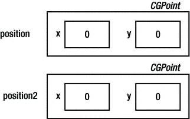
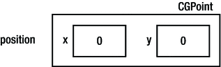
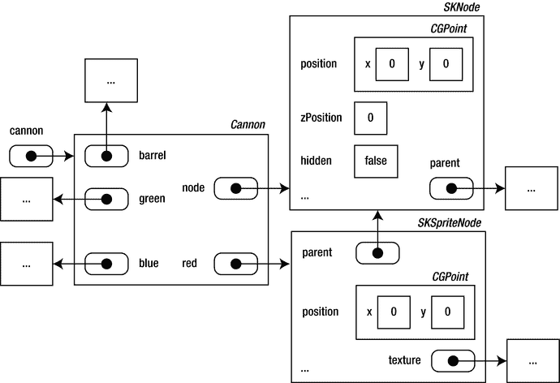

# 颜色与碰撞

**电子补充材料** 本章的在线版本（doi:[10.1007/978-1-4842-0650-8_8](http://dx.doi.org/10.1007/978-1-4842-0650-8_8)）包含补充材料，仅供授权用户使用。

到目前为止，你已经实现了 Painter 游戏的很大一部分。你已经了解了如何通过使用类机制来定义游戏对象类。通过使用类，你可以更好地控制游戏对象的结构以及如何创建特定类型的游戏对象。每个类都在其自己的 Swift 文件中定义。这样，当你今后开发的某个游戏中需要具有相同行为的大炮或球时，只需复制这些文件并创建这些游戏对象的实例即可。

当你更仔细地查看类的定义时，你会发现类定义了对象的内部结构（它由哪些属性组成），以及以某种方式操作该对象的方法。这些方法有助于更精确地定义对象的可能性和局限性。例如，如果有人想重用 `Ball` 类，他们不需要了解球结构的很多详细信息。只需创建一个实例并调用游戏循环方法，就足以向游戏中添加一个飞行的球。通常，在设计程序时（无论是游戏还是完全不同类型的应用程序），清晰地定义某个类的对象可以做什么是非常重要的。方法是一种实现方式。本章向你展示另一种定义对象可能性的方式：通过定义计算属性。本章还介绍了用于表示颜色的类型，并展示了如何处理球与颜料罐之间的碰撞（如果发生碰撞，颜料罐需要改变颜色）。

## 表示颜色的另一种方式

在之前版本的 Painter 中，你相当实用地处理了颜色。例如，在 `Cannon` 类中，你通过使用红色、绿色和蓝色大炮精灵的隐藏状态来跟踪当前颜色。你在 `Ball` 类中也做了类似的事情，只不过你使用的是彩色球精灵而不是大炮颜色指示精灵。例如，以下是根据当前大炮颜色更新球颜色的指令：

```
red.hidden = GameScene.world.cannon.red.hidden
green.hidden = GameScene.world.cannon.green.hidden
blue.hidden = GameScene.world.cannon.blue.hidden
```

由于这些指令的工作方式，`Ball` 类需要了解 `Cannon` 类内部使用的精灵。这很遗憾，因为类本应有助于分离代码，而不是引入依赖关系。另一个问题是，并不容易理解代码的含义。对于一个查看 `Cannon` 或 `Ball` 类代码的外部人员来说，这看起来就像是在无缘无故地复制精灵的隐藏状态。当然，你可以为代码添加注释来解释你在做什么，但这并不能解决问题的核心。理想情况下，代码应以一种逻辑性强、几乎能自我解释的方式编写。

如果能够更统一地定义颜色，并在所有游戏对象类中使用该定义来表示不同的颜色，那岂不是更好？当然是这样！现在开始统一游戏中颜色使用的另一个原因是：如果你决定增加游戏中可能的颜色数量（增加到 4、6、10 或更多），当前方法的编程时间将会长得多。

属于本章的 Painter6 示例是 Painter 游戏的一个新版本，其中通过使用你之前见过的 `UIColor` 类型，以不同的方式处理颜色。`UIColor` 有一些有用的类方法可以生成不同的颜色：

```
let redColor = UIColor.redColor()
let greenColor = UIColor.greenColor()
let blueColor = UIColor.blueColor()
```

## 对象的受控数据访问

有三个游戏对象类表示某种颜色的对象：`Cannon`、`Ball` 和 `PaintCan`。为简单起见，让我们从如何修改 `Cannon` 类以使用上一节中的颜色定义开始。这是 `Cannon` 类中的属性列表：

```
var node = SKNode()
var barrel = SKSpriteNode(imageNamed: "spr_cannon_barrel")
var red = SKSpriteNode(imageNamed: "spr_cannon_red")
var green = SKSpriteNode(imageNamed: "spr_cannon_green")
var blue = SKSpriteNode(imageNamed: "spr_cannon_blue")
```

你可以做的是添加另一个存储属性来表示大炮的当前颜色：

```
var color = UIColor.redColor()
```

如果你想了解大炮的颜色，那么只需检查这个属性的值即可。然而，这并不是一个理想的解决方案。你现在存储了冗余数据，因为颜色信息既由颜色属性表示，也由三个大炮精灵的隐藏状态表示。如果你在颜色发生变化时忘记更改其中一个属性，就可能会引入错误。

另一种解决方案是定义两个方法，允许 `Cannon` 类的用户检索和设置颜色信息。然后你可以保留属性列表不变，但添加读取和写入颜色值的方法。例如，你可以在 `Cannon` 类中添加以下两个方法：

```
func getColor() -> UIColor {
    if (!red.hidden) {
        return UIColor.redColor()
    } else if (!green.hidden) {
        return UIColor.greenColor()
    } else {
        return UIColor.blueColor()
    }
}

func setColor(col : UIColor) {
    if col != UIColor.redColor() && col != UIColor.greenColor()
        && col != UIColor.blueColor() {
        return
    }
    red.hidden = col != UIColor.redColor()
    green.hidden = col != UIColor.greenColor()
    blue.hidden = col != UIColor.blueColor()
}
```

现在 `Cannon` 类的用户无需知道内部你使用精灵隐藏状态来确定大炮的当前颜色。用户只需传递一个颜色定义来读取或写入大炮的颜色：

```
myCannon.setColor(UIColor.blueColor())
var cannonColor = myCannon.getColor()
```

请注意，这些方法内部的代码包含一个安全机制。`getColor` 方法永远不会返回除红色、绿色或蓝色之外的颜色。同样，`setColor` 除非传递的参数是红色、绿色或蓝色，否则不会执行任何操作。这是一种很好的方法，因为它提供了某种保障，确保 `Cannon` 类型的对象将保持一个一致的状态。例如，`setColor` 确保始终有一个精灵没有被隐藏。当然，目前这并不意味着太多，因为 `Cannon` 类的用户仍然可以通过直接访问精灵属性来更改隐藏状态。在第 16 章中，你将看到一种保护对象内部数据的方法，使得这种操作不再可能。

有时，读取和写入对象数据的方法被程序员称为 getter 和 setter。在许多面向对象的编程语言中，方法是访问对象内部数据的唯一方式，因此对于每个需要在类外部访问的属性，程序员都会添加一个 getter 和一个 setter。Swift 提供了一个在面向对象编程语言中相对较新的功能：计算属性。计算属性是 getter 和 setter 的替代品。它定义了当你从对象中检索数据时会发生什么，以及当你为对象内的数据赋值时会发生什么。


### 向类中添加计算属性

在 Swift 中，为类添加计算属性非常容易。例如，你可以添加一个名为 `color` 的计算属性，而不是使用上述两个方法（`getColor` 和 `setColor`），具体如下：

```
var color: UIColor {
    get {
        if (!red.hidden) {
            return UIColor.redColor()
        } else if (!green.hidden) {
            return UIColor.greenColor()
        } else {
            return UIColor.blueColor()
        }
    }
    set(col) {
        if col != UIColor.redColor() && col != UIColor.greenColor()
            && col != UIColor.blueColor() {
            return
        }
        red.hidden = col != UIColor.redColor()
        green.hidden = col != UIColor.greenColor()
        blue.hidden = col != UIColor.blueColor()
    }
}
```

计算属性的定义包含以下几个部分：

- 属性名称（例如 `color`）
- 属性类型（本例中为 `UIColor`）
- `get` 部分和/或 `set` 部分

计算属性与存储属性非常相似：它既有名称又有类型。存储属性与计算属性的区别在于，使用计算属性时，你可以控制读取或写入值时的行为。对计算属性 `color` 的读写操作如下所示：

```
myCannon.color = UIColor.redColor()

if myCannon.color == UIColor.redColor() {
    // 执行某些操作
}
```

在此代码示例的第一行中，将值（`UIColor.redColor()`）赋给了该属性。这意味着属性 `set` 部分中的指令将被执行。第二行包含一个 `if` 指令。在该指令的条件中，读取了 `color` 属性的值。`color` 属性的 `get` 部分决定了读取属性时会发生什么。

在 `set` 部分后面，你可以在括号内指定在主体中使用的参数名称（对于 `color` 属性，此参数名为 `col`）。如果省略参数名称，则默认使用名称 `newValue`：

```
var color: UIColor {
get {
    ...
}
set {
    if newValue != UIColor.redColor() && newValue != UIColor.greenColor() && newValue != UIColor.blueColor() {
        return
    }
    red.hidden = newValue != UIColor.redColor()
    green.hidden = newValue != UIColor.greenColor()
    blue.hidden = newValue != UIColor.blueColor()
}
}
```

并非所有计算属性都必须同时包含 `get` 和 `set` 部分。例如，请看 `Painter6` 示例中 `Cannon` 类的以下属性：

```
var ballPosition: CGPoint {
    get {
        let opposite = sin(barrel.zRotation) * barrel.size.width * 0.6
        let adjacent = cos(barrel.zRotation) * barrel.size.width * 0.6
        return CGPoint(x: node.position.x + adjacent, y: node.position.y + opposite)
    }
}
```

此属性根据炮管的方向计算球的位置。它的类型为 `CGPoint`。在 `Ball` 类中，该属性用于计算球的位置：

`node.position = GameScene.world.cannon.ballPosition`

`ballPosition` 属性没有 `set` 部分。换句话说，这个计算属性是只读的。以下指令会导致编译器报错：

`GameScene.world.cannon.ballPosition = CGPoint(x: 0, y: 0)`

根据你的需求，你可以定义只读属性，也可以定义允许读写操作的属性。通过在类中定义有用的属性和方法，游戏代码通常会变得更简短且更易读。在本书中，你将使用存储属性、计算属性和方法来定义对象的行为和数据访问。

## 处理球与罐子之间的碰撞

`Painter6` 示例通过处理球与罐子之间的碰撞来扩展游戏。如果两个物体发生碰撞，你必须在其中一个对象的 `update` 方法中处理此次碰撞。在这种情况下，你可以选择在 `Ball` 类或 `PaintCan` 类中处理碰撞。`Painter6` 在 `PaintCan` 类中处理碰撞，因为如果你在 `Ball` 类中这么做，就需要重复相同的代码三次，每个油漆罐一次。通过在 `PaintCan` 类中处理碰撞，你可以自动获得此行为，因为每个罐子都会自行检查是否与球发生碰撞。

在 `SpriteKit` 框架中检测是否发生碰撞非常简单。作为构建游戏世界基础的 `SKNode` 类，包含了用于计算节点边界框（包围节点的矩形框）的方法和属性。为了表示矩形框，有一个名为 `CGRect` 的类型。例如，这行代码使用 `frame` 属性计算节点的边界框：

`let boundingBox = node.frame`

不幸的是，`frame` 属性只关注节点本身，而不考虑其子节点。这意味着如果节点包含子节点（例如红色、绿色和蓝色的精灵），在计算边界框时不会考虑这些子节点。这不是你想要的行为。除了 `frame` 属性，`SKNode` 还有一个名为 `calculateAccumulatedFrame` 的方法，该方法会考虑节点的子节点：

`let accumulatedBoundingBox = node.calculateAccumulatedFrame()`

`CGRect` 类型有一个名为 `intersects` 的方法，用于指示两个矩形是否相交。你可以在 `PaintCan` 类中使用该方法来判断油漆罐是否与球发生碰撞，如下所示：

```
let paintCanBox = node.calculateAccumulatedFrame()
let ballBox = GameScene.world.ball.node.calculateAccumulatedFrame()

if paintCanBox.intersects(ballBox) {
    // 处理碰撞
}
```

如果球与罐子之间发生碰撞，你需要将罐子的颜色更改为球的颜色。接着，你必须重置球，以便可以再次射击。以下两条指令正好实现了这一点：

`color = GameScene.world.ball.color`

`GameScene.world.ball.reset()`

在 `Ball` 类的 `reset` 方法中，你隐藏了球并重置了 `readyToShoot` 变量，以便玩家可以再次射击球：

```
func reset() {
    node.hidden = true
    readyToShoot = false
}
```

你可以尝试运行 `Painter6` 示例，看看球与油漆罐之间的碰撞是否得到了正确处理。

你可能已经注意到，这里使用的碰撞检测方法并不十分精确。在第 13 章中，你将看到一种更好的处理碰撞的方法，该方法直接使用精灵的形状，不过如果你不加注意，这可能会使你的游戏运行得更慢。

**注意**

最终，像本节所编写的这样简单的代码行，对玩家体验的影响却至关重要。在构建游戏应用程序时，你会发现，有时对玩家来说最微不足道的小事，编程时却耗时最长；而最大的改变，可能仅需一两行代码就能实现！


## 结构体

在上一节中，你了解到变量和常量是根据其类型按值或按引用传递的。诸如 `Int` 或 `Bool` 这类按值传递的类型在 Swift 中也被称为结构体。与结构体相反，以类为类型的变量是按引用传递的。

按值传递的结构体通常用于更基础类型的对象。例如，`CGPoint` 类型是一个结构体，`UIColor` 类型也是如此。考虑下面的变量声明和初始化：

`var position = CGPoint()`

在图 8-6 中，你可以看到内存的状态。请注意，`position` 变量不是一个引用，而是一个值。这意味着下面的指令会完整地复制一份 `CGPoint` 对象，如图 8-7 所示：


图 8-7. 两个结构体变量——一个是另一个的副本


图 8-6. 一个结构体变量

`var position2 = position`

一般来说，类在内存中的表示可能相当复杂。它们可以包含其他类或结构体的属性。这些类型中的任何一个又可能由其他属性组成，以此类推。

图 8-8 展示了当你创建一个 `Cannon` 对象的新实例时，内存可能的样子。你可以看到一个 `Cannon` 实例中包含的各种对象。每个对象由其他对象组成。例如，`node` 引用的 `SKNode` 对象有一个 `CGPoint` 结构体来表示位置，一个布尔值指示节点是否隐藏，一个指向其父节点的链接，它的 z 位置等等。在某些情况下，引用会指向同一个对象，就像 `parent`（红色显示）和 `node` 的情况一样。当你创建自己的类时，绘制此类图表有时会很有帮助，以便了解哪个对象属于哪里，以及这些对象的引用存储在哪里。


图 8-8. 表示 `Cannon` 对象的内存结构示意图

就像你可以创建自己的类一样，你也可以创建自己的结构体。例如，你可以定义一个表示人的结构体，包含姓名和年龄，如下所示：

```
struct Person {
    var name: String = ""
    var age: Int = 0
}
```

## 你学到的内容

在本章中，你已经学到了以下内容：

- 如何向类中添加属性
- 如何处理游戏对象之间的基本碰撞
- 如何定义具有不同颜色的游戏对象
- 值与引用之间的区别

