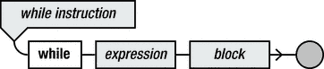
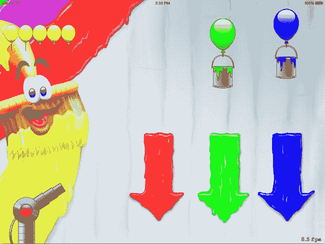
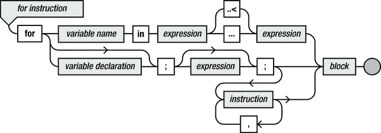
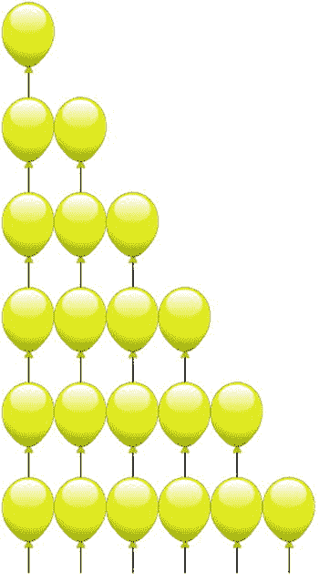
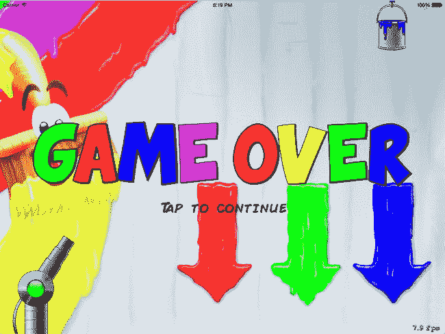

# 9. 有限的生命

电子补充材料 本章的在线版本 (doi:[10.1007/978-1-4842-0650-8_9](http://dx.doi.org/10.1007/978-1-4842-0650-8_9)) 包含补充材料，仅供授权用户使用。

在本章中，你将通过给予玩家有限次数的生命，让 Painter 游戏变得更加有趣。如果玩家错过了太多油漆罐，游戏就结束了。本章将讨论如何处理这种情况，以及如何向玩家显示当前剩余的生命数。为了做到后者，你将学习几种重复执行一组指令的编程结构。

## 维护生命数量

为了引入一些危险元素并激励玩家在游戏中努力表现，你需要限制玩家允许错误颜色的油漆罐掉落到屏幕底部的数量。Painter7 示例向游戏添加了这种机制，并使用了五次的上限。

选择五次上限是你作为游戏设计师和开发者必须做出的众多决策之一。如果你只给玩家一条命，游戏会变得太难。而给玩家上百条命，则会消除玩家好好表现的动机。确定这类参数通常通过游戏测试并确定合理的参数值来实现。除了自己测试游戏外，你还可以请朋友或家人试玩，以便对这些参数选择什么值有所了解。

为了存储生命上限，你在 `GameWorld` 类中添加了一个额外的（存储型）属性：

`var lives = 5`

当你在类中声明该属性时，初始将其设置为 5。现在，每当油漆罐掉出屏幕时，你就可以更新这个值。你在 `PaintCan` 类的 `updateDelta` 方法中执行此检查。因此，你需要在那个方法中添加一些指令来处理这个问题。你需要做的只是检查当油漆罐掉出屏幕底部时，其颜色是否与目标颜色相同。如果不是，你必须减少 `GameWorld` 类中的 `lives` 计数器。

在执行此操作之前，你必须扩展 `PaintCan` 类，以便 `PaintCan` 对象知道它们需要有一个目标颜色，以便在掉出屏幕底部时使用。Painter7 在 `GameWorld` 中创建 `PaintCan` 对象时，将此目标颜色作为参数传递：

`var can1 = PaintCan(positionOffset: -10, targetColor: UIColor.redColor())`
`var can2 = PaintCan(positionOffset: 190, targetColor: UIColor.greenColor())`
`var can3 = PaintCan(positionOffset: 390, targetColor: UIColor.blueColor())`

你将目标颜色存储在每个油漆罐的变量中，如你在 `PaintCan` 的初始化器中看到的那样：

```
init(positionOffset: CGFloat, targetColor: UIColor) {
    self.positionOffset = positionOffset
    self.targetColor = targetColor
    node.zPosition = 1
    node.addChild(red)
    node.addChild(green)
    node.addChild(blue)
    node.hidden = true
}
```

你现在扩展 `PaintCan` 的 `updateDelta` 方法，使其处理油漆罐掉出屏幕底部的情况。如果发生这种情况，你需要将油漆罐移回屏幕顶部。如果油漆罐的当前颜色与目标颜色不匹配，你将生命数量减一：

```
let top = CGPoint(x: node.position.x, y: node.position.y + red.size.height/2)
if GameScene.world.isOutsideWorld(top) {
    if color != targetColor {
        GameScene.world.lives = GameScene.world.lives - 1
    }
    node.hidden = true
}
```

你可能希望在某些情况下减少多于一条生命。为了方便实现这一点，你可以将惩罚值改为一个变量：

```
let penalty = 1
if GameScene.world.isOutsideWorld(top) {
    if color != targetColor {
        GameScene.world.lives = GameScene.world.lives - penalty
    }
    node.hidden = true
}
```

这样，你可以在需要时引入更严厉的惩罚，或者动态惩罚（第一次失误扣除一条命，第二次失误扣除两条命，以此类推）。你还可以引入一种特殊的油漆罐；如果玩家用正确颜色的球击中这个罐子，那么因油漆罐颜色不匹配而产生的惩罚会暂时清零。你能想到在 Painter 游戏中处理惩罚的其他方法吗？


### 向玩家显示剩余生命数

显然，玩家想知道自己的游戏状态。因此，你需要在屏幕上以某种方式指示玩家还剩多少条命。在《画家》游戏中，这是通过在屏幕左上角显示多个气球来实现的。利用你已有的知识，最初你可以添加五个气球进行绘制：

```
var livesNode = SKNode()
let livesSpr1 = SKSpriteNode(imageNamed: "spr_lives")
livesSpr1.position = CGPoint(x: 0, y: 0)
livesNode.addChild(livesSpr1)
let livesSpr2 = SKSpriteNode(imageNamed: "spr_lives")
livesSpr2.position = CGPoint(x: Int(livesSpr2.size.width), y: 0)
livesNode.addChild(livesSpr2)
let livesSpr3 = SKSpriteNode(imageNamed: "spr_lives")
livesSpr3.position = CGPoint(x: 2 * Int(livesSpr3.size.width), y: 0)
livesNode.addChild(livesSpr3)
let livesSpr4 = SKSpriteNode(imageNamed: "spr_lives")
livesSpr4.position = CGPoint(x: 3 * Int(livesSpr4.size.width), y: 0)
livesNode.addChild(livesSpr4)
let livesSpr5 = SKSpriteNode(imageNamed: "spr_lives")
livesSpr5.position = CGPoint(x: 4 * Int(livesSpr5.size.width), y: 0)
livesNode.addChild(livesSpr5)
```

通过将精灵的宽度乘以一个数字并以此作为精灵的 x 坐标位置，你最终得到了五个并排绘制的精灵。现在，你可以在 update 方法中添加几行代码来更改这些精灵的隐藏状态，从而正确显示生命数：

```
livesSpr5.hidden = lives > 4
livesSpr4.hidden = lives > 3
livesSpr3.hidden = lives > 2
livesSpr2.hidden = lives > 1
livesSpr1.hidden = lives > 0
```

虽然这样可行，但这并不是一个很好的解决方案。你多次编写了相似的指令。如果决定让玩家初始拥有十条命而不是五条，会发生什么？你需要编写两倍于此的代码。而且，如果你决定让最大生命数完全动态化，例如让玩家可以赢得额外生命，这个解决方案就完全行不通了。幸运的是，有一种更好的方法：迭代。

## 多次执行指令

Swift 中的迭代是一种重复执行指令多次的方法。请看下面的代码片段：

```
var x = 10
while x >= 3 {
    x = x – 3
}
```

第二条指令被称为 `while` 循环。这条指令由一个类似头部的部分（`while x >= 3`）和一个用花括号括起来的循环体（`x = x - 3`）组成，这与 `if` 指令的结构非常相似。头部由关键字 `while` 后跟一个条件组成。循环体本身是一条指令。在本例中，该指令从一个变量中减去 3。然而，它也可以是其他类型的指令，例如调用方法或访问属性。图 9-1 展示了 `while` 指令的语法图。



图 9-1. `while` 指令的语法图

当执行 `while` 指令时，其循环体会被执行多次。实际上，只要头部中的条件结果为 `true`，循环体就会被执行。在这个例子中，条件是变量 `x` 包含的值大于或等于 3。开始时，该变量包含值 10，因此它肯定大于 3。于是，`while` 指令的循环体被执行，之后变量 `x` 包含值 7。然后再次评估条件。变量仍然大于 3，因此循环体再次被执行，之后变量 `x` 包含值 4。再次，该值大于 3，所以循环体又被执行一次，`x` 将包含值 1。此时，条件被评估，但不再是 `true`。因此，重复指令结束。所以，在这段代码执行后，变量 `x` 包含值 1。实际上，你在这里使用 `while` 指令实现的是整数取余运算。当然，在这种情况下，简单地使用下面这行代码就能达到相同效果，并且更简单：

```
var x = 10 % 3
```

如果你想在屏幕上绘制玩家的生命数，你可以使用 `while` 指令来更高效地创建生命精灵：

```
var livesNode = SKNode()
var index = 0
while index < lives {
    let livesSpr = SKSpriteNode(imageNamed: "spr_lives")
    livesSpr.position = CGPoint(x: index * Int(livesSpr.size.width), y: 0)
    livesNode.addChild(livesSpr)
    index = index + 1
}
```

在这个 `while` 指令中，只要变量 `index` 包含的值小于 `lives`（这是一个假设在其他地方已声明并初始化为特定值的变量），循环体就会被执行。每次执行循环体时，你都会在游戏世界的某个位置添加一个精灵，然后将 `index` 递增 1。结果是你恰好创建了 `lives` 次精灵对象！因此，你在这里将变量 `index` 用作计数器。

**注意：** 你从 `index` 等于 0 开始，一直持续到 `index` 达到与 `lives` 相同的值。这意味着对于 `index` 的 0、1、2、3、4 这些值，`while` 指令的循环体会被执行。因此，循环体被执行了五次。

正如你在本例中所看到的，`while` 指令的循环体可能包含不止一条指令。

绘制精灵的位置取决于 `index` 的值。这样，你可以将每个精灵绘制得稍微靠右一点，从而使它们整齐地排列成一行。第一次执行循环体时，你会在 x 坐标为 0 的位置绘制精灵，因为 `index` 是 0。下一次迭代，你在 x 坐标为 `livesSpr.size.width` 的位置绘制精灵，再下一次则在 `2 * livesSpr.size.width` 的位置，依此类推。在这种情况下，你不仅使用计数器来确定指令的执行次数，还用它来改变指令所做的事情。这是迭代指令（如 `while`）一个非常强大的特性。由于它的循环行为，`while` 指令也被称为 `while` 循环。图 9-2 展示了《画家》游戏在屏幕左上角显示生命数的效果。



图 9-2. 《画家》游戏向玩家显示剩余的生命数

## 递增计数器的简写符号

许多 `while` 指令，尤其是那些使用计数器的指令，其循环体中都包含一条递增变量的指令。这可以通过以下指令完成：

```
i = i + 1
```

顺便提一下，正因为这种指令的存在，将赋值表述为“等于”是不明智的。变量 `i` 的值当然永远不可能等于 `i + 1`，但是 `i` 的值变成了 `i` 的旧值加 1。这类指令在程序中非常常见，因此存在一种特殊的简写符号，可以完成完全相同的操作：

```
i++
```

`++` 可以理解为“自增”。因为这个运算符放在它所操作的变量之后，所以 `++` 运算符被称为后缀运算符。要将一个变量增加大于 1 的值，还有另一种符号：

```
i += 2
```

其含义与以下相同：

```
i = i + 2
```

其他基本算术运算也有类似的符号：

```
i -= 12          // 等同于 i = i – 12
i *= 0.99        // 等同于 i = i * 0.99
i /= 5           // 等同于 i = i / 5
i--              // 等同于 i = i – 1
```

这种符号非常有用，因为它允许你编写更短的代码。例如，

```
lives = lives – penalty
```

变为

```
lives -= penalty
```

如果你查看本书这一章及后续章节附带的示例代码，你会发现许多不同的类都使用了这种简写符号，以使代码更加紧凑。


## 更紧凑的循环语法

许多 `while` 指令都使用计数变量，因此具有以下结构：

```
var i = 起始值
while i < 结束值 {
    // 使用 i 做一些有用的事情
    i++
}
```

由于这种指令相当常见，因此有一种更简洁的表示法：

```
for var i = 起始值; i < 结束值; i++ {
    // 使用 i 做一些有用的事情
}
```

这条指令的含义与之前的 `while` 指令完全相同。在这种情况下使用 `for` 指令的好处是，所有与计数器相关的内容都整齐地组合在指令的头部。这降低了忘记编写计数器递增指令（导致无限循环）的可能性。在“使用 `i` 做一些有用的事情”只包含一条指令的情况下，可以省略大括号，这使得表示法更加紧凑。此外，还可以将变量 `i` 的声明移到 `for` 指令的头部。例如，请看以下代码片段：

```
for var index = 0; index < lives; index++ {
    let livesSpr = SKSpriteNode(imageNamed: "spr_lives")
    livesSpr.position = CGPoint(x: index * Int(livesSpr.size.width), y: 0)
    livesNode.addChild(livesSpr)
}
```

这是一个非常紧凑的指令，它递增计数器并将精灵添加到不同位置。该指令等价于本章前面展示的 `while` 指令。

另一个例子：

```
for var index = 0; index < livesNode.children.count; index++ {
    var livesSpr = livesNode.children[index] as SKNode
    livesSpr.hidden = lives <= index
}
```

在不完全理解循环体作用的情况下，你能（作为练习）将这个 `for` 指令重写为等价的 `while` 指令吗？

如果你更仔细地观察这个 `for` 指令的功能，你会发现它将计数器 `index` 从零递增到 `livesNode.children.count`。后一个表达式表示节点 `livesNode` 的子节点数量。在 `for` 循环内部，有两条指令。第一条指令从节点中检索特定的子对象。这条指令涉及一个称为数组的概念。在第 12 章中，你将了解更多关于数组的知识。无需深入细节，你可以假设这条指令使用计数器 `index` 的值从 `livesNode` 节点中检索一个子节点。结果是，`for` 循环逐个检索 `livesNode` 的所有子节点。循环体中的第二条指令设置所检索节点的隐藏状态。换句话说，这个 `for` 循环替代了 `GameWorld` 的 `update` 方法中的以下指令：

```
livesSpr5.hidden = lives <= 4
livesSpr4.hidden = lives <= 3
livesSpr3.hidden = lives <= 2
livesSpr2.hidden = lives <= 1
livesSpr1.hidden = lives <= 0
```

使用 `for` 循环的新解决方案有一个很好的特性，即现在改变程序中的最大生命数非常容易。你只需修改 `GameWorld` 类中 `lives` 变量的值即可！代码的其余部分独立于为 `lives` 选择的初始值运行。以易于修改的方式设计代码是一个好主意。这只是一个简单示例，说明如何做到这一点。好处不仅是代码更容易修改，而且也更加健壮。初始生命数在一个地方设置，而不是多个地方。因此，当你改变生命数时引入错误的可能性要小得多。

`while` 或 `for` 循环中的条件不一定非要是与计数器相关的。例如：

```
for var nr = 8; !isPrimeNumber(nr); nr++ {
    print(nr)
}
```

这个 `for` 循环打印所有大于等于 8 的数，直到遇到下一个质数（即 11）。因此，这段代码的输出是：

```
8
9
10
```

由于在许多情况下你确实需要一个计数器，Swift 还提供了一种更短的语法来处理计数器。请看以下示例：

```
for index in 0...9 {
    // 做某事
}
```

这个 `for` 循环等价于：

```
for var index = 0; index <= 9; index++ {
    // 做某事
}
```

你也可以定义一个排除最后一个值的范围，如下所示：

```
for index in 0..<5 {
    // index 将依次取值 0, 1, 2, 3, 4
}
```

这等价于：

```
for var index = 0; index < 5; index++ {
    // 做某事
}
```

范围表示法用于递增计数器的一个优点是，它与对列表中的对象执行某些任务等操作配合得很好。也可以使用变量名而不是常量来确定范围：

```
for index in 0..<lives {
    let livesSpr = SKSpriteNode(imageNamed: "spr_lives")
    livesSpr.position = CGPoint(x: index * Int(livesSpr.size.width), y: 0)
    livesNode.addChild(livesSpr)
}
```

如果你只是想重复执行一段代码块若干次，而不需要计数器，那么可以省略变量名，并用下划线替换。例如，以下代码会在屏幕上打印十次"Hello!"：

```
for _ in 1...10 {
    print("Hello!")
}
```

在 `for` 循环中使用范围有一个限制：范围的起始值必须小于结束值。换句话说，以下写法是不允许的：

```
for index in 3...1 {
    // 做某事
}
```

当你在代码中写下这样的指令时，Xcode 编译器不会产生编译错误。相反，当你运行程序时，会生成一个运行时错误，立即停止程序。编译器未检测到此问题的原因是，范围也可以通过变量表达式来定义。因此，语法上无法定义这个约束。图 9-3 包含了 `for` 指令的语法图。如你所见，它包含了范围表示法和完整表示法的语法。



**图 9-3.** `for` 指令的语法图

## 几个特殊情况

在处理 `while` 和 `for` 循环时，有几个特殊情况需要了解。以下小节将讨论这些情况。

### 完全不执行

有时 `while` 指令头部的条件在开始时就已经是 `false`。请看以下代码片段：

```
var x = 1
var y = 0
while x < y {
    x++
}
```

在这种情况下，`while` 指令的循环体根本不会执行——一次也不会！因此，在此例中，变量 `x` 保持值 1 不变。


### 无限循环

使用`while`指令（以及较小程度上的`for`指令）的一个危险之处在于，如果你不小心，它们可能永远不会结束。你很容易写出这样的指令：

```
while 1 + 1 == 2 {
    x = x + 1
}
```

在这个例子中，变量`x`的值会无限递增。这是因为无论指令体内部执行什么操作，条件`1 + 1 == 2`总是返回`true`。这个例子很容易避免，但通常`while`指令会因编程错误而陷入无限循环。请看下面的例子：

```
var x = 1
var n = 0
while n < 10 {
    x = x * 2
}
```

这段代码的本意是将`x`的值翻倍十次。但不幸的是，程序员忘记了在`while`指令体中递增计数器。结果，`n`的值永远不会大于或等于十，因此`while`循环体被无限重复执行。程序员实际想写的是：

```
var x = 1
var n = 0
while n < 10 {
    x = x * 2
    n++
}
```

如果你的电脑或移动设备因为你在`while`指令体中忘记递增计数器而陷入“昏迷”状态，最后不得不扔掉它，那将是一件很遗憾的事。幸运的是，大多数设备（包括 Mac、iPad 和 iPhone）的操作系统即使程序尚未完成，也能强制停止其执行。一旦停止，你就可以开始查找程序卡死的原因。虽然程序中偶尔会出现此类卡死现象，但作为游戏程序员，你的职责是确保游戏公开发布时，这些编程错误已从游戏代码中移除。这就是充分测试如此重要的原因。

通常，如果你编写的程序启动后似乎没有任何反应，或者无限期卡死，请检查`while`指令中发生了什么。一个非常常见的错误是忘记递增计数器变量，导致`while`指令的条件永远不会变成`false`，从而无限循环下去。许多其他编程错误也可能导致无限循环。事实上，无限循环非常常见，以至于加利福尼亚州库比蒂诺市的一条街道就以它们命名——而苹果公司总部就坐落在这条街上！

### 嵌套循环

`while`指令或`for`指令的体是一个由花括号定界的指令块。在块内部，你可以编写任何类型的指令：赋值语句、方法调用，或者另一个`while`或`for`循环。例如：

```
for y in 0...5 {
    for x in 0...y {
        let livesSpr = SKSpriteNode(imageNamed: "spr_lives")
        livesSpr.position = CGPoint(x: x * Int(livesSpr.size.width),
            y: y * -Int(livesSpr.size.height))
        livesNode.addChild(livesSpr)
    }
}
```

在这个片段中，变量`y`从 0 计数到 5。对于每个`y`值，其循环体（包含一个`for`指令）都会被执行。这第二个`for`指令使用计数器`x`，其上限是`y`的值。因此，随着外层`for`指令的每次推进，内层`for`指令执行的时间会更长。被重复执行的指令会在由`x`和`y`计数器值计算出的位置放置一个黄色气球精灵。这个循环的结果是许多气球被放置成三角形（见图 9-4）。



图 9-4. 呈三角形排列的气球

## 重新开始游戏

当玩家失去所有生命时，游戏结束。你如何处理这种情况？在 Painter 游戏中，你希望显示一个游戏结束画面。玩家可以点击屏幕，然后游戏将重新开始。为了在游戏中实现这一点，你需要在游戏启动时加载一个代表游戏结束画面的额外精灵。你将此精灵作为`GameWorld`类的一个属性存储：

```
var gameover = SKSpriteNode(imageNamed: "spr_gameover")
```

在`GameWorld`的初始化方法中，你将此精灵添加到代表游戏世界的主节点上。其次，你为这个精灵分配一个更高的 z 轴位置，以便它会被绘制在所有其他内容之上。最后，你设置精灵的隐藏标志，使其暂时不对玩家显示：

```
node.addChild(gameover)
gameover.zPosition = 2
gameover.hidden = true
```

现在，你可以在每个游戏循环方法中使用`if`指令来决定该做什么。如果游戏结束，你不想让大炮和球再处理输入；你只想检查玩家是否点击了屏幕。如果发生了点击，你就重置游戏。因此，`GameWorld`类中的`handleInput`方法现在包含以下指令：

```
if (lives > 0) {
    cannon.handleInput(inputHelper)
    ball.handleInput(inputHelper)
} else if (inputHelper.hasTapped) {
    reset()
}
```

你向`GameWorld`类添加一个`reset`方法，以便将游戏重置到初始状态。这意味着重置所有游戏对象。你还需要将生命数量重置为五。以下是`GameWorld`中完整的`reset`方法：

```
func reset() {
    lives = 5
    cannon.reset()
    ball.reset()
    can1.reset()
    can2.reset()
    can3.reset()
}
```

对于`updateDelta`方法，你只需要在游戏未结束时更新游戏对象。因此，你首先用一个`if`指令检查是否需要更新游戏对象。如果不需要（换句话说，生命数量已降至零），你就从该方法返回，如下所示：

```
if (lives <= 0) {
    return
}
// 因为你知道玩家还活着，所以可以在这里更新游戏对象
```

**注意：** 检查生命数量是否小于或等于零。是否存在生命数量小于零的情况？这很可能非常罕见，但有可能在一个游戏循环迭代中，两罐油漆同时掉落出屏幕，导致生命数量被减两次。如果当时生命数量是 1，那么新的生命数量就是 -1。

只有在玩家不再存活时，才应显示游戏结束覆盖层，因此在`updateDelta`方法中，作为第一条指令，你需要相应地设置 game over 精灵的`hidden`状态：

```
gameover.hidden = lives > 0
```

换句话说，只要玩家的生命数量大于零，该精灵就保持隐藏状态。图 9-5 显示了绘制在游戏世界顶部的游戏结束覆盖层。



图 9-5. 游戏结束！

在图 9-5 中，请注意游戏结束覆盖层并没有完全隐藏其他对象和背景。原因是游戏结束精灵有一些透明像素。通常，精灵带有透明部分，以便它们看起来像是游戏世界的一个组成部分。气球、球、油漆罐和大炮管都有部分是透明的，这就是它们能无缝融入游戏世界的原因。在设计精灵时，你需要确保图像正确设置了这些透明度值。虽然正确完成这一点可能需要大量工作，但像 Adobe Photoshop 这样的现代图像编辑工具为你提供了许多定义图像透明度的方法。只需确保将图像保存为支持透明度的格式，例如 PNG。

**注意：** 你可以利用覆盖层的（不）透明度来控制玩家看到的内容。在某些情况下，你可能希望某些东西被遮挡（例如，在时间敏感的游戏中显示“暂停”画面）或者能够被看到（例如 Painter 游戏中的游戏结束画面）。


## 本章小结

在本章中，你已经学习了以下内容：
- 如何存储并显示玩家的当前生命数
- 如何使用 `while` 或 `for` 指令重复执行一组指令
- 如何在玩家生命值归零时重启游戏

