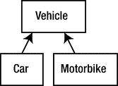
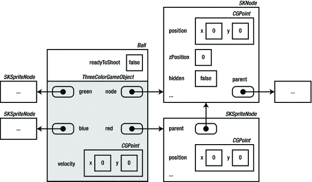
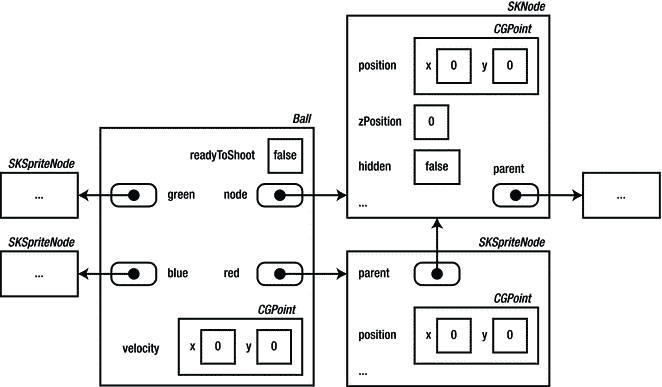
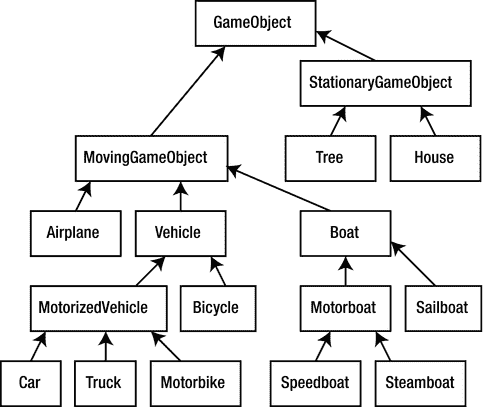

# 第 10 章 组织游戏对象

电子补充材料 本章在线版本（doi:[10.1007/978-1-4842-0650-8_10](http://dx.doi.org/10.1007/978-1-4842-0650-8_10)）包含补充材料，仅供授权用户使用。

在前几章中，你已经了解了如何使用类来组合相关的变量。本章将探讨不同类型游戏对象之间的相似性，以及如何在 Swift 中表达这些相似性。

## 游戏对象间的相似性

观察 Painter 游戏中的不同游戏对象，你会发现它们有很多共同点。例如，球、大炮和颜料罐都使用了三个精灵来分别表示三种不同颜色。此外，游戏中大多数物体都具有速度属性。而且，部分游戏对象具有处理输入的方法，部分具有 `updateDelta` 方法，还有一些具有 `reset` 方法。这些类之间存在相似性本身并不是问题——编译器或游戏玩家不会因此抱怨。但令人困扰的是，你不得不反复复制同样的代码。举例来说，`Cannon`、`Ball` 和 `PaintCan` 类都包含以下名为 `color` 的计算属性：

```
var color: UIColor {
    get {
        if (!red.hidden) {
            return UIColor.redColor()
        } else if (!green.hidden) {
            return UIColor.greenColor()
        } else {
            return UIColor.blueColor()
        }
    }
    set(col) {
        if col != UIColor.redColor() && col != UIColor.greenColor()
            && col != UIColor.blueColor() {
                return
        }
        red.hidden = col != UIColor.redColor()
        green.hidden = col != UIColor.greenColor()
        blue.hidden = col != UIColor.blueColor()
    }
}
```

这段代码完全相同，但你必须在三个类中分别复制它。每次你想添加一种不同颜色的游戏对象时，很可能都需要再次复制这个属性。如果只是为单个属性这样做，问题还不算太大。但 Painter 游戏中的类之间还存在更多相似性。例如，Painter 游戏中多数游戏对象类都拥有相同的存储属性：`velocity`、`red`、`green` 和 `blue`。

总的来说，最好避免大量复制代码。原因何在？因为如果某天你发现这部分代码存在错误，就必须在每一个复制过它的地方进行修正。对于 Painter 这样的小型游戏，这还算不上大问题。但当你开发一个包含数百个不同游戏对象类的商业游戏时，这将演变成一个严重的维护难题。而且，你永远不知道一个简单小游戏会发展到什么规模。如果不加注意，最终可能会复制大量代码（以及随之而来的错误）。随着游戏不断成熟，留意何处可以优化代码是个好习惯——即使这意味着需要额外工作来发现这些重复代码并进行整合。针对当前情况，你需要思考不同类型的游戏对象之间有何相似之处，以及是否能够像在前几章中整合属性那样，将这些相似性整合起来。

从概念上讲，很容易说出球、颜料罐和大炮之间的共同点：它们都是游戏对象。基本上，它们都位于某个位置，都具有速度（大炮也有速度，只不过速度为零），并且都具有红色、绿色或蓝色中的一种颜色。此外，它们大多能处理某种输入并执行更新操作。

## 继承

在 Swift 中，你可以将这些相似性组合到一个通用类中，然后定义其他类作为这个通用类的特殊版本。在面向对象术语中，这被称为继承，它是一种非常强大的语言特性。请看以下示例：

```
class Vehicle {
    var numberOfWheels = 4
    var brand = ""
    func what() -> String {
        return "nrOfWheels = \(numberOfWheels), brand = \(brand)"
    }
}
```

这里有一个非常简单的类示例，用于表示交通工具（可以想象，这可能对交通模拟游戏很有用）。为简单起见，交通工具由轮子数量和品牌来定义。`Vehicle` 类还有一个名为 `what` 的方法，该方法返回一个描述交通工具的 `String` 值（文本）。如果你想创建一个在表格中展示交通工具列表的应用，这个方法会很实用。注意，我在 Swift 中使用了一种特殊机制来组合文本和变量：

```
return "nrOfWheels = \(numberOfWheels), brand = \(brand)"
```

在 Swift 中，这种通过将常量或变量与文本混合来创建 `String` 值的过程称为**字符串插值**。如果要在文本字符串中插入变量的值，只需将变量名写在 `\(` 和 `)` 之间即可。下面是一个创建 `Vehicle` 类型变量并将车辆数据输出到控制台的示例：

```
var v = Vehicle()
v.brand = "volkswagen"
print(v.what()) // 输出 "nrOfWheels = 4, brand = volkswagen"
```

让我们为类添加一个接受品牌名称作为参数的初始化器：

```
init(_ b: String) {
    brand = b
}
```

现在你可以创建一辆交通工具并立即为其指定品牌名称：

```
var v = Vehicle("volkswagen")
print(v.what())
```

交通工具存在不同类型，例如汽车、自行车、摩托车等。对于其中某些类型，你可能希望存储额外信息。例如，对于汽车，存储它是否为敞篷车可能很有用；对于摩托车，则可能需要存储其气缸数等。你可以利用 Swift 中的继承机制来实现这一点。以下是一个名为 `Car` 的类示例：

```
class Car: Vehicle {
    var convertible = false
}
```

如你所见，类名后面有一个冒号和单词 `Vehicle`。这意味着 `Car` 类继承自 `Vehicle`。本质上，这意味着 `Car` 复制了 `Vehicle` 的功能，包括 `what` 方法：

```
var c = Car("mercedes")
print(c.what()) // 输出 "nrOfWheels = 4, brand = mercedes"
```

继承的妙处在于你可以替换或扩展功能。例如，假设你希望 `what` 方法返回的字符串也能包含汽车是否为敞篷车的信息。为此，你可以覆盖（override）原 `what` 方法，并用另一个方法替换它。以下是覆盖了 `what` 方法的 `Car` 类新版本：

```
class Car : Vehicle {
    var convertible = false
    override func what() -> String {
        return "nrOfWheels = \(numberOfWheels), brand = \(brand),
                convertible = \(convertible)"
    }
}
```

之后使用 `Car` 类时：

```
var c = Car("mercedes")
print(c.what()) // 输出 "nrOfWheels = 4, brand = mercedes,
                // convertible = false"
```

由于 `Car` 类继承自 `Vehicle`，这意味着 `Car` 类型的对象也是 `Vehicle` 类型的对象。因此，继承有两个重要方面：
- 对象之间存在关系（`Car` 对象同时也是 `Vehicle`）。
- 继承自另一个类的类会复制其功能（`Car` 对象具有与 `Vehicle` 对象相同的（存储和计算）属性和方法）。


因为`Car`继承自`Vehicle`，你也可以说`Car`是`Vehicle`的子类或派生类，或者说`Vehicle`是`Car`的超类、父类或基类。类之间的继承关系被广泛使用；在良好的类设计中，这种关系可以被理解为“是一种”（is a kind of）。在这个例子中，关系很明确：汽车（car）是一种交通工具（vehicle）。但反过来却不一定成立：交通工具不总是汽车。`Vehicle`可能有其他子类，例如：

```
class MotorBike: Vehicle {
    var cylinders = 4
    override init(_ b: String) {
        super.init(b)
        numberOfWheels = 2
    }
}
```

摩托车也是一种交通工具。`Motorbike`类继承自`Vehicle`，并添加了自定义属性来表示气缸数量。如你所见，`MotorBike`类重写了`Vehicle`类的构造器。这很有必要，因为摩托车没有四个轮子。因此，当创建`MotorBike`实例时，需要确保轮子数量被正确设置。尽管重写方法或重写构造器非常相似，但有一个关键区别：当你重写构造器时，Swift 强制要求你调用超类的一个指定构造器。此外，你必须在访问超类的任何属性之前调用该构造器。这是为了确保在访问数据之前，对象已被正确初始化。`Vehicle`类包含一个唯一的（指定）构造器。下面这行代码调用了该构造器：

```
super.init(b)
```

这是`Car`构造器主体中的第一条指令，它确保`Car`对象中属于`Vehicle`的部分被初始化。关键字`super`用于表示你调用的是属于超类的构造器。`super`指向一个对象，就像`self`一样。`self`和`super`的主要区别在于：`self`指向当前方法（或构造器）正在操作的对象，而`super`指向同一个对象，但仅限对象中属于超类的部分。在这个例子中，这意味着`self`的类型是`Car`，而`super`的类型是`Vehicle`。

图 10-1 展示了汽车/交通工具示例中使用的类层次结构。关于该层次结构的更详细版本，请参见图 10-4。



图 10-1. `Vehicle`及其子类的继承关系图

## 游戏对象与继承

“是一种”的关系同样适用于 Painter 游戏中的游戏对象。球是一种游戏对象，油漆罐和大炮也是。你可以通过在程序中定义一个名为`ThreeColorGameObject`的泛型基类，并让你的实际游戏对象类继承自该泛型类，来明确这种继承关系。然后，你可以将所有定义三色游戏对象特征的内容放入该类中，而球、大炮和油漆罐将成为该类的特化版本。属于本章的`Painter8`示例展示了如何做到这一点。

让我们更详细地了解一下`ThreeColorGameObject`类。你将游戏中不同类型的游戏对象常用的属性放入此类。你可以定义该类的骨架如下：

```
class ThreeColorGameObject {
    var node = SKNode()
    var red = SKSpriteNode()
    var green = SKSpriteNode()
    var blue = SKSpriteNode()
    var velocity = CGPoint.zeroPoint
    ...
}
```

每个继承自`ThreeColorGameObject`的类都将拥有一个`node`、三个`sprite`和一个`velocity`。这很好，因为现在你只需在一个地方定义这些属性，它们就可以在任何继承自`ThreeColorGameObject`的类中使用。

你需要做的一件事是提供一种用三个不同的精灵来初始化一个三色游戏对象的方法。当你定义`ThreeColorGameObject`类时，你还不知道要使用哪些精灵，因为它们取决于最终的游戏对象类型（大炮使用的精灵与球或油漆罐不同）。为了解决这个问题，我们添加以下构造器：

```
init(_ spriteRed: String, _ spriteGreen: String, _ spriteBlue: String) {
    red = SKSpriteNode(imageNamed: spriteRed)
    green = SKSpriteNode(imageNamed: spriteGreen)
    blue = SKSpriteNode(imageNamed: spriteBlue)
    node.addChild(red)
    node.addChild(green)
    node.addChild(blue)
}
```

当你继承此类时，通过将图片名称作为参数传递给`ThreeColorGameObject`构造器，来定义精灵属性`red`、`green`和`blue`应为何值。

接下来，你需要定义基本的游戏循环方法。该类的`updateDelta`方法仅包含根据速度更新游戏对象当前位置的指令：

```
func updateDelta(delta: NSTimeInterval) {
    node.position.x += velocity.x * CGFloat(delta)
    node.position.y += velocity.y * CGFloat(delta)
}
```

为了完整性，我们还可以添加处理输入和重置游戏对象的方法，这些方法可以在后续被重写：

```
func handleInput() {
}

func reset() {
}
```

如果你查看`Painter8`示例中的`ThreeColorGameObject`类，你还会看到一些添加的计算属性。第一个是`color`，它读取和写入游戏对象的颜色。第二个属性叫做`box`，它计算游戏对象的边界框。这是一个很有用的（只读）属性，用于判断两个游戏对象是否碰撞。以下是该属性的定义：

```
var box: CGRect {
    get {
        return node.calculateAccumulatedFrame()
    }
}
```

向`ThreeColorGameObject`添加方法和属性的好处在于，任何继承自它的类现在也拥有这些方法和属性。这为你省去了大量代码复制的工作！关于完整的`ThreeColorGameObject`类，请参阅属于本章的`Painter8`示例。


### 作为 `ThreeColorGameObject` 子类的 Cannon

既然你已经为彩色游戏对象创建了一个非常基础的类，你可以通过继承这个类，在你的游戏对象中复用这些基础行为。我们首先来看看 `Cannon` 类。因为你已经定义了基础的 `ThreeColorGameObject` 类，你就可以将 `Cannon` 类创建为该类的子类。以下是 `Cannon` 类定义的一部分：

```
class Cannon: ThreeColorGameObject {

    var barrel = SKSpriteNode(imageNamed:"spr_cannon_barrel")

    init() {
        super.init("spr_cannon_red", "spr_cannon_green", "spr_cannon_blue")
        red.zPosition = 1
        green.zPosition = 1
        blue.zPosition = 1
        barrel.anchorPoint = CGPoint(x:0.233, y:0.5)
        node.position = CGPoint(x:-430, y:-280)
        node.zPosition = 1
        green.hidden = true
        blue.hidden = true
        node.addChild(barrel)
    }

    ...
}
```

`Cannon` 类引入了一个额外的属性，名为 `barrel`。此外，该类拥有自己的初始化器。`Cannon` 初始化器中的第一条指令调用了父类的指定初始化器。在括号中，你可以看到这个初始化器所期望的三个精灵参数。然后，`Cannon` 对象的其余部分被初始化。

既然新版本的 `Cannon` 类已经定义完成，你可以像之前一样开始向该类添加属性和方法。例如，下面是 `handleInput` 方法：

```
override func handleInput(inputHelper: InputHelper) {
    if !inputHelper.isTouching {
        return
    }
    let localTouch: CGPoint = GameScene.world.node.convertPoint(inputHelper.touchLocation, toNode: red)
    if !red.frame.contains(localTouch) {
        let opposite = inputHelper.touchLocation.y - node.position.y
        let adjacent = inputHelper.touchLocation.x - node.position.x
        barrel.zRotation = atan2(opposite, adjacent)
    } else if inputHelper.hasTapped {
        let tmp = blue.hidden
        blue.hidden = green.hidden
        green.hidden = red.hidden
        red.hidden = tmp
    }
}
```

如你所见，你可以毫无问题地访问诸如 `node` 和 `red` 这样的属性。因为 `Cannon` 继承自 `ThreeColorGameObject`，它包含了相同的（存储属性和计算属性）和方法。同样你可以看到，`override` 这个词表明该方法替换了 `ThreeColorGameObject` 中的原始方法（该方法原本有一个空实现）。

如果你查看本章配套 Painter8 示例中的 `Cannon` 类，你会发现其类定义比之前的版本更小、更易读了，因为所有通用的游戏对象属性和方法都被放在了 `ThreeColorGameObject` 类中。将代码组织在不同的类和子类中有助于减少代码重复，从而带来更清晰的设计。然而，这里有一个注意事项：你的类结构（哪个类继承自哪个类）必须是正确的。请记住，只有当类之间存在“is a kind of”（是一种）的关系时，才应该从一个类继承到另一个类。为了说明这一点，假设你想在屏幕顶部添加一个指示器来显示球的当前颜色。你可以为此创建一个类，并让它继承自 `Cannon` 类，因为它需要以类似的方式处理输入：

```
class ColorIndicator : Cannon {
    ...
}
```

然而，这是一个非常糟糕的主意。颜色指示器显然不是一种大炮，以这种方式设计你的类会让其他开发者非常不清楚这些类的用途。此外，颜色指示器现在也会有一个炮管，这毫无意义。类的继承图应该是逻辑清晰且易于理解的。每次你编写一个继承自其他类的类时，都要问问自己，该类是否真的“是一种”你所继承的类。如果不是，那么你必须重新考虑你的设计。

### `Ball` 类

你以与 `Cannon` 类非常相似的方式定义新的 `Ball` 类。就像在 `Cannon` 类中一样，你继承自 `ThreeColorGameObject` 类。唯一的区别是你添加了一个额外的属性，用于指示球是否准备好发射：

```
class Ball : ThreeColorGameObject {
    var readyToShoot = false

    init() {
        super.init("spr_ball_red", "spr_ball_green", "spr_ball_blue")
        node.zPosition = 1
        node.hidden = true
    }

    convenience init(position: CGPoint) {
        self.init()
        node.position = position
    }

    ...
}
```

当创建 `Ball` 实例时，你需要调用指定的 `ThreeColorGameObject` 初始化器，就像你对 `Cannon` 类所做的那样。在这种情况下，你将球的精灵作为参数传递进去。

`Ball` 类清晰地说明了当你继承自另一个类时会发生什么。每个 `Ball` 实例由两部分组成：一部分继承自 `ThreeColorGameObject`，另一部分定义在 `Ball` 类中。图 10-2 展示了不使用继承时，一个 `Ball` 对象的内存布局。图 10-3 也展示了一个 `Ball` 实例，但它使用了本章介绍的继承机制。



图 10-3. `Ball` 类的一个实例（继承自 `ThreeColorGameObject`）



图 10-2. `Ball` 类实例的内存使用概览（无继承）

`ThreeColorGameObject` 类中的 `updateDelta` 方法只包含两条指令，用于根据游戏对象的速度、经过的时间以及当前位置来计算其新位置：

```
node.position.x += velocity.x * CGFloat(delta)
node.position.y += velocity.y * CGFloat(delta)
```

球的运行逻辑应该更复杂一些。应该更新球的速度以包含阻力和重力；如果需要，应该更新球的颜色；如果球飞出了屏幕，它应该重置到原始位置。你可以简单地从之前版本的 `Ball` 类中复制 `updateDelta` 方法，使其覆盖 `ThreeColorGameObject` 的 `updateDelta` 方法。一个稍微好一点的方式是在 `Ball` 类中定义 `updateDelta` 方法，但复用 `ThreeColorGameObject` 中的原始 `updateDelta` 方法。这可以通过使用 `super` 关键字来实现，其方式与你用它来调用父类初始化器非常相似。以下是 `Ball` 类中 `updateDelta` 方法的新版本：

```
override func updateDelta(delta: NSTimeInterval) {
    if !node.hidden {
        velocity.x *= 0.99
        velocity.y -= 15
        super.updateDelta(delta)
    } else {
        // 计算球的位置
        node.position = GameScene.world.cannon.ballPosition
        // 复制球的颜色
        self.color = GameScene.world.cannon.color
    }

    if GameScene.world.isOutsideWorld(node.position) {
        reset()
    }
}
```

在 `if` 指令的主体中，你更新了速度，然后调用了父类的 `updateDelta` 方法，该方法会更新游戏对象的位置。这种方式的好处在于，它允许你将（本例中的）更新过程的不同部分分离开来。任何拥有位置和速度的游戏对象，都需要在游戏循环的每次迭代中根据其速度更新其位置。你在 `ThreeColorGameObject` 的 `updateDelta` 方法中定义了这种行为，这样你就可以在继承自 `ThreeColorGameObject` 的任何类中复用该方法！


### `PaintCan` 类

最后一个继承自 `ThreeColorGameObject` 的类是 `PaintCan`。请查看 `Painter8` 示例以了解完整的类定义。`PaintCan` 重写了 `updateDelta` 方法和 `reset` 方法。与之前一样，它不处理任何输入，因此你无需重写 `handleInput` 方法。

`PaintCan` 类中有一个有趣的部分，那就是使用了 `box` 计算属性。由于任何继承自 `ThreeColorGameObject` 的类都拥有该属性，现在你可以用它来轻松检查两个游戏对象是否发生碰撞。请看以下几行代码：

```
var ball = GameScene.world.ball

if self.box.intersects(ball.box) {
    color = ball.color
    ball.reset()
}
```

这几行代码虽少，但幕后发生了很多事情。边界框以及它们之间的交集被计算出来，彩色精灵的隐藏状态也随之改变。由于代码的设计方式，你只需编写几行代码就能完成这些任务！

观察游戏对象类时，你会发现另一件有趣的事情。由于每个游戏对象类都继承自 `ThreeColorGameObject`，`ThreeColorGameObject` 类中的定义决定了方法和属性的形态。从某种意义上说，`ThreeColorGameObject` 对任何继承自它的游戏对象类施加了约束。例如，它强制要求处理输入的方法名为 `handleInput`（而不是 `HandleInput`、`handleinput` 或 `handle_input`）。这是继承有助于提升代码质量的另一种方式：它带来了更一致的类定义。

## 多态性

由于继承机制，你无需总是知道一个变量指向哪种类型的对象。考虑以下声明和初始化：

```
var someKindOfGameObject : Cannon = Cannon()
```

而在代码的其他地方，你执行以下操作：

```
someKindOfGameObject.updateDelta(delta)
```

现在假设你像下面这样更改声明和初始化：

```
var someKindOfGameObject : ThreeColorGameObject = Cannon()
```

这是允许的，因为 `Cannon` 是 `ThreeColorGameObject` 的子类。反过来（将 `ThreeColorGameObject` 实例赋值给 `Cannon` 类型的变量）则不被允许，因为并非每个 `ThreeColorGameObject` 都是加农炮（其中一些是球或油漆罐）。

那么，如果 `someKindOfGameObject` 是 `ThreeColorGameObject` 类型，会调用哪个版本的 `updateDelta` 方法？这取决于该变量所引用的实例。如果该实例恰好是 `Cannon` 实例，则会调用 `Cannon` 的 `updateDelta` 方法。如果是 `Ball` 实例，则会调用 `Ball` 的 `updateDelta` 方法。程序执行时，会自动调用正确的 `updateDelta` 方法版本。

这种效果称为多态性，有时非常有用。多态性允许你更好地分离代码。假设一家游戏公司想要发布其游戏的扩展包。例如，它可能想引入一些新敌人，或者玩家可以学习的技能。该公司可以将这些扩展作为通用 `Enemy` 和 `Skill` 类的子类来提供。实际的游戏代码随后会使用这些对象，而无需知道它正在处理的是哪个特定的技能或敌人。它只需调用在通用类中定义的方法即可。

## 继承现有类

除了创建自己编写的类的子类外，你还可以继承其他开发者编写的类。在 `Painter8` 示例中，存在两个游戏对象层级结构。一个层级结构由你创建的类表示：`GameWorld` 实例包含对加农炮、球和油漆罐对象的引用。第二个层级结构由场景图中的节点定义。通常情况下，这不是理想的解决方案。由于要维护两个层级结构，很容易出现不一致，导致错误和其他不期望的行为。

解决这个问题的一种方法是合并这两个层级结构。`Painter9` 示例展示了如何做到这一点。`Painter8` 和 `Painter9` 的主要区别在于，在 `Painter9` 中，游戏对象类都（间接地）是 `SKNode` 的子类，而 `SKNode` 是 SpriteKit 框架中场景图节点的主要表示。`ThreeColorGameObject` 类现在是 `SKNode` 的子类。这意味着不再需要 `node` 属性，因为任何游戏对象本身已经是一个节点。

如果你查看 `Painter9` 中的 `ThreeColorGameObject` 类，会发现它现在是 `SKNode` 的子类。因此，你需要额外做几件事。其一，你需要在自定义的初始化器中调用父类的初始化器：

```
override init() {
    super.init()
    self.addChild(red)
    self.addChild(green)
    self.addChild(blue)
}

init(_ spriteRed: String, _ spriteGreen: String, _ spriteBlue: String) {
    super.init()
    red = SKSpriteNode(imageNamed: spriteRed)
    green = SKSpriteNode(imageNamed: spriteGreen)
    blue = SKSpriteNode(imageNamed: spriteBlue)
    self.addChild(red)
    self.addChild(green)
    self.addChild(blue)
}
```

第一个初始化器重写了父类的初始化器，并确保将三个精灵节点添加到此游戏对象中，以保证一致性，无论调用哪个初始化器。第二个初始化器与之前相同，只是它调用了父类的初始化器，并且精灵现在被添加到游戏对象本身，而不是一个单独的节点。

最后，你会看到以下初始化器：

```
required init?(coder aDecoder: NSCoder) {
    fatalError("init(coder:) has not been implemented")
}
```

当你继承 `SKNode` 时，你必须添加这个初始化器（代码中的 `required` 关键字也表明了这一点）。需要这个初始化器的原因是 `SKNode` 类支持一种称为序列化的功能。序列化意味着可以从数据（例如，存储在文件中）初始化对象。这对许多游戏来说是一个有用的特性，因为它构成了游戏存档机制的基础。然而，在 `Painter` 中并没有这种机制，因此该初始化器只包含一条指令，用于在出现错误时停止程序。

由于 `ThreeColorGameObject` 是 `SKNode` 的子类，任何继承自 `ThreeColorGameObject` 的类也都是 `SKNode` 的子类，包括 `Cannon`、`Ball` 和 `PaintCan` 类。正如你在 `Painter9` 中看到的，`GameWorld` 类的设置方式与 `ThreeColorGameObject` 非常相似：它继承自 `SKNode`，因此不再需要单独的 `node` 属性。


### 类的层级结构

在本章中，你已经看到多个从基础游戏对象类继承的类示例。只有当两个类之间的关系可以用“是一种”来描述时，一个类才应继承另一个类。例如：`Ball` 是一种 `ThreeColorGameObject`，而 `ThreeColorGameObject` 又是一种 `SKNode`。你可以将这种层级结构进一步扩展。例如，你可以编写一个继承自 `Ball` 的类 `BouncingBall`，它是标准球的特殊版本，能够从油漆罐上弹开而不仅仅是与之碰撞。你还可以创建另一个名为 `BouncingElasticBall` 的类，它继承自 `BouncingBall`，但这种球在撞击油漆罐时会根据其弹性特性发生形变。每次继承一个类时，你都能免费获得基类的数据（以属性形式编码）和行为（以方法形式编码）。

商业游戏中不同游戏对象的类层级结构往往具有多个层级。回到本章开头的交通模拟示例，你可以想象一个由各种不同车辆构成的非常复杂的层级结构。图 10-4 展示了这样一个层级结构的示例。图中使用箭头表示类之间的继承关系。



图 10-4. 交通模拟游戏中复杂的游戏对象层级结构

继承树的最底层是 `GameObject` 类。该类仅包含非常基础的信息，例如游戏对象的位置或速度。对于每个子类，可以添加与该特定类及其子类相关的新属性和方法。例如，属性 `numberOfWheels` 通常属于 `Vehicle` 类而非 `MovingGameObject` 类（因为船只没有轮子）。属性 `flightAltitude` 属于 `Airplane` 类，而属性 `bellIsWorking` 则属于 `Bicycle` 类。

在确定类结构的方式时，你需要做出许多决策。不存在唯一的最佳层级结构；并且，根据应用场景的不同，某种层级结构可能比另一种更实用。例如，这个示例首先根据对象移动所使用的介质（陆地、空中或水上）来划分 `MovingGameObject` 类。然后，这些类再被划分为不同的子类：机动化或非机动化。你也可以选择反过来划分。对于某些类，它们在层级结构中的归属并非完全明确：你会认为摩托车是一种特殊类型的自行车（带有马达的吗？）？还是一种特殊类型的机动车辆（只有两个轮子的）？

重要的是，类之间的关系必须清晰。帆船是一种船，但船不总是帆船。自行车是一种车辆，但并非所有车辆都是自行车。

## 本章所学内容

在本章中，你学习了以下内容：

*   如何使用继承将相关类组织成层级结构
*   如何在子类中重写方法，为该类提供特定行为
*   如何使用 `super` 关键字调用超类的方法或初始化器

